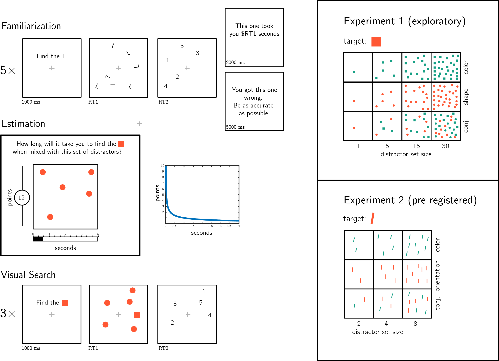

# Prospective search time estimates for unseen displays reveal a rich intuitive theory of visual search {#ch:MVS}

#### Matan Mazor, Max Siegel & Joshua B. Tenenbaum {.unnumbered}

abstract

```{r ch4_load_pkgs, echo=FALSE, message=FALSE, include=FALSE}
library('papaja')
library('dplyr')
library('magrittr')
library('broom')
library('tidyr')
library('BayesFactor')
library('lmerTest')
library('ppcor')
library('ggplot2')
library('png')
library('grid')
library('png')
library('cowplot')
options(warn=-1)

r_refs('RJreferences.bib')
set.seed(42)

```

## Introduction

The *Intuitive Theories* approach to cognitive science [@gerstenberg2017intuitive] has been successful in accounting for human knowledge and reasoning in the domains of physics [@mccloskey1983intuitive], psychology [@baker2011bayesian] and semantic knowledge [@gelman2011concepts]. In recent years, careful experimental and computational work has advanced our understanding of these simplified theories: their ontologies and causal laws, the abstractions that they make, and the consequences of these abstractions for faithfully and efficiently modeling the real world. For example, the computational specification of the intuitive physics model and its deviation from Newtonian physics was informed by empirical measures of biased intuitions about the consequences of object collisions [@smith2013sources; @sanborn2013reconciling].

Theoretically, there is no reason to believe that Intuitive Theories should be limited in their scope to modeling the external environment and other agents. Indeed, agents may benefit from having an intuitive theory or a simplified model of their own perceptual, cognitive and psychological states. For example, in the context of memory, it has been suggested that knowing which items are more subjectively memorable is useful for making negative recognition judgments ["I would have remembered this object if I saw it"; @brown1977memorability], and self-modeling has been proposed to play an important role in inference about absence more broadly [@mazorinference]. In the context of perception and attention, @graziano2015attention argued that having a simplified *Attention Schema* (an intuitive theory of attention and its dynamics) is crucial for monitoring and controlling one's attention, similar to how a body-schema supports motor control. 

Still, little experimental work has been devoted to characterizing the computational specifications of this intuitive theory of attention. Is it based on a simulation engine [similar to the game engine proposal; @ullman2017mind]? Or instead formatted as a list of propositions (e.g., *'My attention span is shorter when I am tired'*)? How accurate is it? To what extent is it learned from experience and what inductive biases guide its acquisition and tuning based on experience?

Here we take a first step in this direction, using visual search as our model test-case. Participants estimated their prospective search times in visual search tasks and then performed the same searches. Similar to using colliding balls and falling blocks to study intuitive physics, here we chose visual search for being thoroughly studied and amenable to relatively simple modeling. In Experiments 1 and 2, we used simple colorful shapes as our stimuli, and compared participants' intuitive theories to scientific theories of attention that distinguish parallel from serial processing. We found that participants were sensitive to the parallel/serial distinction, but had a persistent bias to assume serial search. In experiments 3 and 4 we used unfamiliar stimuli from the Omniglot dataset [@lake2011one] to demonstrate the richness and compositional nature of participants' intuitive theories, and their reliance of idiosyncratic knowledge.


## Experiments 1 and 2: shape, orientation, and color

A good intuitive theory needs to have good predictive value without being overly complex. A reasonable first candidate for what an intuitive theory of visual search may look like is Anne Treisman's *Feature Integration Theory* (FIT). According to FIT, visual search comprises two stages: a *pre-attentive* parallel stage, and a serial *focused attention* stage [@treisman1986features;@treisman1990conjunction]. In the first stage, visual features (such as color, orientation, and intensity) are extracted from the display to generate spatial 'feature maps'. Search targets that are defined by a single feature with respect to its surroundings (*feature search*; for example searching for a red car in a road full of yellow taxis) can be located based on the feature map. Since the extraction of the feature map is pre-attentive, in these cases the search can be completed immediately. However, sometimes the target can only be identified by integrating over multiple features (*conjunction search*; for example if the road has not only yellow taxis, but also red buses). In such cases, attention must be serially deployed to items in the display until the target is identified. 

In its simplest form, Treisman's FIT predicts that search time should linearly scale with the number of distractors in conjunction search, but not in feature searches. This model provides reasonably accurate search time predictions for simple displays with only three parameters: non-decision time (the y-intercept of the set size X search time curve), the time cost of deploying attention to an item (the slope of the same curve), and a list of the features that can be found without serially scanning the display (for example, color, orientation, and size). 

In Experiments 1 and 2 we used stimuli that lend themselves to a categorical distinction between parallel and serial search: simple geometric shapes of different colors and orientations. We asked whether participants' intuitive theory of visual search can predict which search displays demand serial deployment of attention and which don't. Critically, participants gave their search time estimates before they were asked to perform searches involving these or similar stimuli, so their search time estimates reflected prior beliefs about search efficiency. Our hypotheses and analysis plan for Experiment 2, based on the results of Experiment 1, were pre-registered prior to data collection (pre-registration document: [osf.io/2dpq9](osf.io/2dpq9)). 

### Participants

For Exp. 1, 100 participants were recruited from Amazon’s crowdsourcing web-service Mechanical Turk. Exp. 1 took about 20
minutes to complete. Each participant was paid \$2.50. The highest performing 30% of participants received an additional bonus of \$1.50.  For Exp. 2, 100 participants were recruited from the Prolific crowdsourcing web-service. The experiment took about 15
minutes to complete. Each participant was paid \£1.5. The highest performing 30\% of participants received an additional bonus of \£1. 

### Procedure
The study was built using the Lab.js platform [@henninger2019lab] and hosted on a JATOS server [@lange2015just]. 

#### Familiarization {-}
First, participants were acquainted with the visual search task. The instructions for this part were as follows:

>In the first part, you will find a target hidden among distractors. First, a gray cross will appear on the screen. Look at the cross. Then, the target and distractors will appear. When you spot the target, press the spacebar as quickly as possible. Upon pressing the spacebar, the target and distractors will be replaced by up to 5 numbers. To move to the next trial, type in the number that replaced the target.

The instructions were followed by four trials of an example visual search task (searching for a *T* among 7 *L*s). Feedback was delivered on speed and accuracy. The purpose of this part of the experiment was to familiarize participants with the task. 

#### Estimation {-}

After familiarization, participants estimated how long it would take them to perform various visual search tasks involving novel stimuli and various set sizes. On each trial, they were presented with a target stimulus and a display of distractors and were asked to estimate how long it would take to find the target if it was hidden among the distractors (see Fig. \@ref(fig:ch4-methods1)). 

To motivate accurate estimates, we explained that these visual search tasks will be performed in the last part of the experiment, and that bonus points will be awarded for trials in which participants respond as fast or faster than their estimation. The number of points awarded for a successful search changed as a function of the search time estimate according to the rule
$points=\frac{1}{\sqrt{secs}}$. This rule was chosen for being exponential with respect to the log response times, incentivizing participants to be consistent in their ratings across short and long search tasks. The report scale ranged from 0.1 to 4 seconds in Exp. 1 and to 2 seconds in Exp. 2. 

```{r ch4-methods1, cache=TRUE, echo=FALSE, fig.cap="Experimental design. Participants first performed five similar visual search trials and received feedback about their speed and accuracy. Then, they were asked to estimate the duration of novel visual search tasks. Bonus points were awarded for accurate estimates, and more points were awarded for risky estimates. Finally, in the visual search part participants performed three consecutive trials of each visual search task for which they gave a search time estimates. Right panels: stimuli used for Experiments 1 and 2.", fig.align='center', out.width = '100%'}

```

After one practice trial (estimating search time for finding one *T* among 3 randomly positioned *L*s), we turned to our stimuli of interest. In Experiment 1, participants estimated how long it would take them to find a red (#FF5733) square among green (#16A085) squares (color condition), red circles (shape condition) and a mix of green squares, red circles, and green circles (shape-color conjunction condition), for set sizes 1, 5, 15 and 30. Together, participants estimated the expected search time of 12 different search tasks (see Figure \@ref(fig:ch4-methods1), upper right panel). In Experiment 2, participants rated how long it would take them to find a red (#FF5733) tilted bar (20° off vertical) among green (#16A085) titled bars (color condition), red vertical bars (orientation condition) and a mix of green tilted and red vertical bars (oriention-color conjunction condition) for set sizes 2, 4, and 8. Together, participants estimated the expected search time of 9 different search tasks see Figure \@ref(fig:ch4-methods1), lower right panel). In both experiments, the order of estimation trials was randomized between participants. 

#### Visual Search {-}
Participants performed three consecutive search tasks for each of the 12 (Exp. 1) or 9 (Exp. 2) search types. The order of presentation was randomized between participants. No feedback was delivered about speed. To motivate accurate responses, error trials were followed by a 5 second pause. 

### Results

```{r ch4-e1-descriptives, include=FALSE, cache=TRUE}
# load data
min_RT <- 0.2 #seconds
max_RT <- 5
max_tte <- 30 #time to estimate
max_exclude <- 30 #percent

e1=list();

e1$df <- read.csv('data/ch4/expt1.csv');

filterDataFrame <- function(e) {
  
  e$all_subjects <- e$df$Subj_id%>%unique();

  e$N_total <- e$all_subjects%>%length();

  # summarize accuracy
  e$acc <- e$df %>% 
    group_by(Subj_id) %>%
    summarize(acc = mean(accuracy, na.rm=TRUE)) %>%
    pull(acc);
  
  e$num_errors <- length(which(e$df$accuracy==0));
  e$too_fast <- length(which(e$df$RT<min_RT));
  e$too_slow <- length(which(e$df$RT>max_RT));
  e$slow_est <- length(which(e$df$timeToEstimate>max_tte))/3;
  
  # add an 'include' column based on reaction time, estimation time, 
  # and response accuracy
  e$df %<>%
    mutate(include=ifelse(accuracy==1 & 
                            !is.na(RT) &
                            RT>min_RT &
                            RT<max_RT,
                            1,0)) %>%
    mutate(timeToEstimate = ifelse(timeToEstimate <30, 
                                   timeToEstimate, NA ))
  
  e$filtered_df <- e$df %>%
    group_by(Subj_id) %>% 
    filter(mean(include)>(100-max_exclude)/100) %>%
    filter(include==1);
  
  # how many participants have survived exclusion?
  e$N <- length(unique(e$filtered_df$Subj_id))
  
  # average all three trials from each search type
  e$avgd <- e$filtered_df %>% 
    group_by(Subj_id,search_type,set_size) %>%
    summarize_at(vars('RT','estimates','timeToEstimate'),mean)

  return(e)
}

e1 <- e1%>%filterDataFrame();

```

```{r ch4-e2-descriptives, include=FALSE}
e2=list();

# In the pre-registration document, Exp. 2 is Exp. 3 and vice versa. 
e2$df <- read.csv('data/ch4/expt3.csv');

e2 <- e2%>%filterDataFrame();
```

Accuracy in the visual search task was reasonably high in both Experiments (Exp. 1: `r e1$acc%>%t.test()%>%apa_print()%>%'$'(estimate)`; Exp. 2: `r e2$acc%>%t.test()%>%apa_print()%>%'$'(estimate)`). Error trials and visual search trials that took shorter than `r min_RT` seconds or longer than `r max_RT` seconds were excluded from all further analysis. Participants were excluded if more than `r max_exclude`\% of their trials were excluded based on the aforementioned criteria, leaving `r e1$N` and `r e2$N` participants for the main analysis of Experiments 1 and 2, respectively. 

```{r ch4-e1-search-slopes, include=FALSE, cache=TRUE}

getSlopes <- function(e) {
  
  # fit a linear model predicting RT from set size for each 
  # subject and search type
  e$search_slopes <- e$filtered_df %>%
    group_by(Subj_id,search_type) %>%
    do(model=lm(RT~set_size,data=.)) %>%
    tidy(model) %>%
    filter(term=='set_size');
  
  e$mean_search_slopes <- e$search_slopes %>%
  group_by(search_type) %>%
  summarize(mean=mean(estimate)*1000) %>%
  spread(key=search_type, value=mean);
  
  dfs<-e$filtered_df
  dfs[,c(7)]=scale(dfs[,c(7)]) # center set size
  e$RT_model <- lmer(RT ~ set_size*search_type + ((1+set_size*search_type)| Subj_id), data=dfs);
  e$est_model <- lmer(estimates ~ set_size*search_type + ((1+set_size*search_type)| Subj_id), data=dfs); 
  
  return(e)
}

e1 <- e1%>%getSlopes()


e1$t_slope_color <- e1$search_slopes %>%
                            filter(search_type=='color') %$%
                            estimate %>%
                            t.test(.,mu=0)

e1$BF_slope_color <- e1$search_slopes %>%
                            filter(search_type=='color') %$%
                            estimate %>%
                            ttestBF(.,mu=0)

e1$t_slope_shape <- e1$search_slopes %>%
                            filter(search_type=='shape') %$%
                            estimate %>%
                            t.test(.,mu=0)

e1$t_slope_conj <- e1$search_slopes %>%
                            filter(search_type=='conjunction') %$%
                            estimate %>%
                            t.test(.,mu=0)

e1$search_shape_vs_color <- t.test(
  e1$search_slopes %>%
    filter(search_type=='shape') %$%
    estimate,
  e1$search_slopes %>% 
    filter(search_type=='color') %$%
    estimate,
  paired=TRUE);

e1$search_shape_vs_conjunction <- t.test(
  e1$search_slopes %>%
    filter(search_type=='shape') %$%
    estimate,
  e1$search_slopes %>% 
    filter(search_type=='conjunction') %$%
    estimate,
  paired=TRUE)

```

```{r ch4-e2-search-slopes, include=FALSE, cache=TRUE}

e2 <- e2 %>%
  getSlopes()

e2$t_slope_color <- e2$search_slopes %>%
                            filter(search_type=='color') %$%
                            estimate %>%
                            t.test(.,mu=0)

e2$BF_slope_color <- e2$search_slopes %>%
                            filter(search_type=='color') %$%
                            estimate %>%
                            ttestBF(.,mu=0)

e2$t_slope_orientation <- e2$search_slopes %>%
                            filter(search_type=='orientation') %$%
                            estimate %>%
                            t.test(.,mu=0);

e2$BF_slope_orientation <- e2$search_slopes %>%
                            filter(search_type=='orientation') %$%
                            estimate %>%
                            ttestBF(.,mu=0)

e2$t_slope_conj <- e2$search_slopes %>%
                            filter(search_type=='conjunction') %$%
                            estimate %>%
                            t.test(.,mu=0)

e2$search_orientation_vs_color <- t.test(
  e2$search_slopes %>%
    filter(search_type=='orientation') %$%
    estimate,
  e2$search_slopes %>% 
    filter(search_type=='color') %$%
    estimate,
  paired=TRUE);

e2$search_orientation_vs_conjunction <- t.test(
  e2$search_slopes %>%
    filter(search_type=='orientation') %$%
    estimate,
  e2$search_slopes %>% 
    filter(search_type=='conjunction') %$%
    estimate,
  paired=TRUE)


```

#### Search times {-}

For each participant and distractor type, we extracted the slope of the function relating RT to distractor set size. As expected, search slopes for color search were not significantly different than zero in Exp. 1 (`r printnum(e1$mean_search_slopes$color)` ms/item; `r paste(apa_print(e1$t_slope_color)$statistic, apa_print(e1$BF_slope_color, auto_invert=TRUE)$statistic,sep=', ')`) and Exp. 2 (`r printnum(e2$mean_search_slopes$color)` ms/item; `r paste(apa_print(e2$t_slope_color)$statistic, apa_print(e2$BF_slope_color, auto_invert=TRUE)$statistic,sep=', ')`). This is consistent with color being a basic feature that is not dependent on serial attention for its extraction by the visual system [@treisman1986features;@treisman1990conjunction]. The slope for shape search was close, but significantly higher than zero (`r printnum(e1$mean_search_slopes$shape)` ms/item; `r apa_print(e1$t_slope_shape)$statistic`), and the slope for orientation was numerically higher than zero (`r printnum(e2$mean_search_slopes$orientation)` ms/item) but not significantly so (`r paste(apa_print(e2$t_slope_orientation)$statistic, apa_print(e2$BF_slope_orientation, auto_invert=TRUE)$statistic,sep=', ')`). In both Experiments, conjunction search gave rise to search slopes significantly higher than zero (Exp. 1: `r printnum(e1$mean_search_slopes$conjunction)` ms/item (`r apa_print(e1$t_slope_conj)$statistic`; Exp. 2: `r printnum(e2$mean_search_slopes$conjunction)` ms/item (`r apa_print(e2$t_slope_conj)$statistic`; see Figure \ref{fig:slopeHistograms}, upper panel). This is consistent with the FIT prediction that conjunction search demands serial attention. 
<!-- A mixed effects linear regression model (fixed effects of search-type, set size, and the interaction between them, and random intercept and set size effects) yielded  significant coefficients for all three random effects.  -->

```{r ch4-e1-estimation, include=FALSE, cache=TRUE}

analyzeEstimates <- function(e) {
  
  # mean search times and estimated search times per participant
  e$mean_times <- e$filtered_df %>% 
  group_by(Subj_id) %>%
  summarize_at(vars('RT','estimates'),mean)

  e$time_comparison = t.test(e$mean_times$estimates, 
                             e$mean_times$RT, 
                             paired=TRUE);
  
  e$est_slopes <- e$filtered_df %>%
  group_by(Subj_id,search_type) %>%
  do(model=lm(estimates~set_size,data=.)) %>%
  tidy(model) %>%
  filter(term=='set_size');
  
  e$mean_est_slopes <- e$est_slopes %>%
  group_by(search_type) %>%
  summarize(mean=mean(estimate)*1000) %>%
  spread(key=search_type, value=mean)
  
  e$slope_comparison <- t.test(
  aggregate(e$est_slopes$estimate, by=list(e$est_slopes$Subj_id), FUN=mean)$x,
  aggregate(e$search_slopes$estimate, by=list(e$search_slopes$Subj_id), FUN=mean)$x,
  paired=TRUE);

  return(e)
};

e1 <- e1 %>%
  analyzeEstimates() 

e1$est_shape_vs_color <- t.test(
  e1$est_slopes %>%
    filter(search_type=='shape') %$%
    estimate,
  e1$est_slopes %>% 
    filter(search_type=='color') %$%
    estimate,
  paired=TRUE);

e1$est_conjunction_vs_color <- t.test(
  e1$est_slopes %>%
    filter(search_type=='conjunction') %$%
    estimate,
  e1$est_slopes %>% 
    filter(search_type=='color') %$%
    estimate,
  paired=TRUE);

e1$est_conjunction_vs_shape <- t.test(
  e1$est_slopes %>%
    filter(search_type=='conjunction') %$%
    estimate,
  e1$est_slopes %>% 
    filter(search_type=='shape') %$%
    estimate,
  paired=TRUE)

e1$t_est_slope_color <- e1$est_slopes %>%
                            filter(search_type=='color') %$%
                            estimate %>%
                            t.test(.,mu=0)

# Spearman correlations
e1$RT_est_corr <- e1$avgd %>%
  group_by(Subj_id) %>%
  summarize(COR = cor(RT,estimates,method = 'spearman',use='complete.obs'))

# Spearman part correlations, controlling for set size
e1$RT_est_corr_no_set_size <- e1$avgd %>%
  group_by(Subj_id) %>%
  na.omit() %>%
  summarize(COR = spcor.test(estimates,RT,set_size,method = 'spearman')$estimate)

# Spearman part correlations, controlling for search type slope
e1$RT_est_corr_no_type <- e1$avgd %>%
  group_by(Subj_id) %>%
  na.omit() %>%
  summarize(COR = spcor.test(estimates,RT, 
    list(
      ifelse(search_type=='conjunction',1,0)*set_size,
      ifelse(search_type=='shape',1,0)*set_size),
    method = 'spearman')$estimate);

# Spearman part correlations, controlling for search type and set size and for the interaction between them.
e1$RT_est_corr_no_set_size_type <- e1$avgd %>%
  group_by(Subj_id) %>%
  na.omit() %>%
  summarize(COR = spcor.test(estimates,RT, list(
    set_size,
    ifelse(search_type=='conjunction',1,0)*set_size,
    ifelse(search_type=='shape',1,0)*set_size),
    method = 'spearman')$estimate)

```

```{r ch4-e2-estimation, include=FALSE, cache=TRUE}


e2 <-  e2 %>%
  analyzeEstimates()


e2$est_orientation_vs_color <- t.test(
  e2$est_slopes %>%
    filter(search_type=='orientation') %$%
    estimate,
  e2$est_slopes %>% 
    filter(search_type=='color') %$%
    estimate,
  paired=TRUE);

e2$est_conjunction_vs_color <- t.test(
  e2$est_slopes %>%
    filter(search_type=='conjunction') %$%
    estimate,
  e2$est_slopes %>% 
    filter(search_type=='color') %$%
    estimate,
  paired=TRUE);

e2$est_conjunction_vs_orientation <- t.test(
  e2$est_slopes %>%
    filter(search_type=='conjunction') %$%
    estimate,
  e2$est_slopes %>% 
    filter(search_type=='orientation') %$%
    estimate,
  paired=TRUE);

e2$t_est_slope_color <- e2$est_slopes %>%
                            filter(search_type=='color') %$%
                            estimate %>%
                            t.test(.,mu=0);

e2$t_est_slope_orientation <- e2$est_slopes %>%
                            filter(search_type=='orientation') %$%
                            estimate %>%
                            t.test(.,mu=0)

# Spearman correlations
e2$RT_est_corr <- e2$avgd %>%
  group_by(Subj_id) %>%
  summarize(COR = cor(RT,estimates,method = 'spearman',use='complete.obs'))

# Spearman part correlations, controlling for set size
e2$RT_est_corr_no_set_size <- e2$avgd %>%
  group_by(Subj_id) %>%
  na.omit() %>%
  summarize(COR = spcor.test(estimates,RT,set_size,method = 'spearman')$estimate)

# Spearman part correlations, controlling for search type slope
e2$RT_est_corr_no_type <- e2$avgd %>%
  group_by(Subj_id) %>%
  na.omit() %>%
  summarize(COR = spcor.test(estimates,RT, 
    list(
      ifelse(search_type=='conjunction',1,0)*set_size,
      ifelse(search_type=='orientation',1,0)*set_size),
    method = 'spearman')$estimate);

# Spearman part correlations, controlling for search type and set size and for the interaction between them.
e2$RT_est_corr_no_set_size_type <- e2$avgd %>%
  group_by(Subj_id) %>%
  na.omit() %>%
  summarize(COR = spcor.test(estimates,RT, list(
    set_size,
    ifelse(search_type=='conjunction',1,0)*set_size,
    ifelse(search_type=='orientation',1,0)*set_size),
    method = 'spearman')$estimate)

```

#### Estimation accuracy {-}

We next turned to analyze participants' prospective search time estimates, and their alignment with actual search times. In both tasks, participants generally overestimated their search times. This was the case for all search types across the two Experiments (see Figure \@ref(fig:ch4-e1-e2-slopes), left panels: all markers are above the dashed $x=y$ diagonal). Despite this bias, estimates were correlated with true search times, supporting a metacognitive insight into visual search behaviour (within subject Spearman correlations, Exp. 1: `r apa_print(t.test(e1$RT_est_corr$COR))$full_result`; Exp 2: `r apa_print(t.test(e2$RT_est_corr$COR))$full_result`). 

To test participants' intuitive theory of visual search, we analyzed participants' estimates as if they were search times, and extracted search slopes relating estimates to the number of distractors in the display. Estimation slopes (expected ms/item) were steeper than search slopes for all search types. In particular, although search time for a deviant color was unaffected by the number of distractors, participants estimated that color searches with more distractors should take longer (mean estimated slope in Exp. 1: `r printnum(e1$mean_est_slopes$color)` ms/item; `r apa_print(e1$t_est_slope_color)$statistic`; in Exp 2: `r printnum(e2$mean_est_slopes$color)` ms/item; `r apa_print(e2$t_est_slope_color)$statistic`). In other words, at the group level, participants showed no metacognitive insight into the parallel nature of color search. Still, in both Experiments estimated slopes for color search were significantly shallower than for conjunction search (Exp. 1: `r apa_print(e1$est_conjunction_vs_color)$statistic`, Exp. 2: `r apa_print(e2$est_conjunction_vs_color)$statistic`). In contrast, although true search slopes were shallower for shape and orientation than for conjunction (p's<0.001), the difference in estimate slopes was not significant (difference between shape and conjuntion slopes: `r apa_print(e1$est_conjunction_vs_shape)$statistic`; difference between orientation and conjunction slopes: `r apa_print(e2$est_conjunction_vs_orientation)$statistic`). 


```{r ch4-e1-e2-slopes, echo=FALSE,cache=TRUE,fig.cap="Left panels: median estimated search times plotted against true search times for the different search types (coded by color), and set sizes (coded by circle size; from small to large), for Exp. 1 (upper panel) and 2 (lower panel). Error bars represent the standard error of the median. Right panels: distribution of search (top) and estimated (bottom) slopes for the three search types in Exp. 1 (upper panel) and 2 (lower panel). The dashed line indicates $y=x$ and the dotted line indicates $y=2x$."}

plotSlopes <- function(e) {
  e$est_slopes$measure='estimate'
  e$search_slopes$measure='RT'
  e$slopes <- bind_rows(e$est_slopes,e$search_slopes) %>%
    mutate(measure = factor(measure, levels=c('RT','estimate')),
           estimate_ms = estimate*1000)
  e$slope_figure <- ggplot(e$slopes,aes(x=estimate_ms,fill=search_type))+
    geom_vline(xintercept = 0) +
    geom_vline(xintercept = 1) +
    geom_density(alpha=0.5, color='black')+
      labs(x="slope (ms/item)", y = "")+
    facet_grid(measure ~ .,scales='free_y') +
    scale_fill_manual(values = c("#648FFF","#DC267F","#FFB000")) + 
    scale_color_manual(values = c("#648FFF","#DC267F","#FFB000")) +
      theme_classic()+
    theme(aspect.ratio=0.5, 
          legend.position='none',
          axis.title.y=element_blank(),
          axis.text.y=element_blank(),
          axis.ticks.y=element_blank(),
          );
  
  return(e);
};

#http://davidmlane.com/hyperstat/A106993.html
semedian <- function(x) {return(se(x, na.rm=TRUE)*1.253)}

plotMedian <- function(e) {
  
  e$median <- e$avgd %>%
  group_by(search_type,set_size) %>%
  summarize_at(vars('RT','estimates','timeToEstimate'),median, na.rm=TRUE)%>%
    mutate(RT=RT*1000,
           estimates=estimates*1000,
           timeToEstimate=timeToEstimate*1000)

  e$sem <- e$avgd %>%
    group_by(search_type,set_size) %>%
    summarize_at(vars('RT','estimates','timeToEstimate'),semedian)%>%
    mutate(RT=RT*1000,
           estimates=estimates*1000,
           timeToEstimate=timeToEstimate*1000)
  
  e$median_figure <- ggplot(e$median,
         aes(x=RT,y=estimates,color=search_type,fill=search_type,size=set_size))+
    geom_errorbar(
      aes(ymin = estimates-e$sem$estimates,ymax = estimates + e$sem$estimates),size=0.5)+
    geom_errorbar(
      aes(xmin = RT-e$sem$RT,xmax = RT + e$sem$RT),size=0.5)+
    geom_abline(slope=c(1,2),intercept=0,linetype=c('dashed','dotted'))+
    geom_point(color='black',pch=21,)+
    geom_path(size=0.5)+
    theme_classic() + 
    coord_fixed(ratio=0.5)+labs(x='RT (seconds)',
                                y='estimates (seconds)') +
    scale_fill_manual(values = c("#648FFF","#DC267F","#FFB000")) + 
    scale_color_manual(values = c("#648FFF","#DC267F","#FFB000")) +
    guides(size=FALSE) +
    scale_y_continuous(limits=c(200,2000),
                       breaks=seq(0,2000,by=500))+
    scale_x_continuous(limits=c(200,2000),
                       breaks=seq(0,2000,by=500))+
    theme(legend.position=c(0.8,0.4),
          legend.title = element_blank(),
          legend.background = element_blank(),
          legend.box.background = element_blank());
  
  return(e)
};

e1 <- e1 %>%
  plotSlopes() %>%
  plotMedian()

e2 <- e2 %>%
  plotSlopes() %>%
  plotMedian()

plot_grid(e1$median_figure+labs(title='Experiment 1')+labs(x=''),e1$slope_figure+labs(x=''),
          e2$median_figure+labs(title='Experiment 2'),e2$slope_figure)

```

<!-- #### A graded representation of search efficiency {-} -->

<!-- In FIT's simplest form, searches come in two flavours only: parallel and serial. If participants' intuitive theory of visual search shares this simplifying assumption, the results from the previous section indicate that their theories also wrongly specify that shape and orientation searches are serial just like conjunction search. In contrast, an intuitive theory of visual search may represent search efficiency along a continuum, with some searches being highly efficient, some highly inefficient, and others fall somewhere in between the two ends. This is more in line with contemporary theories of visual search such as Guided Search [REF]. -->


<!-- To further investigate which factors contribute to this correlation, we compared the correlation between true and estimated search times before and after regressing out the effects of set size and search type on search time. This analysis revealed that this correlation was largely based on the positive effect of distractor set size on both search times and estimates (difference between full and part correlation;  `r apa_print(t.test(e1$RT_est_corr$COR,e1$RT_est_corr_no_set_size$COR,paired=TRUE))$full_result`) and on the effect of search type slope (`r apa_print(t.test(e1$RT_est_corr$COR,e1$RT_est_corr_no_type$COR,paired=TRUE))$full_result`). When controlling for both factors the part correlation between estimated and actual search times was no longer significant (`r apa_print(t.test(e1$RT_est_corr_no_set_size_type$COR))$full_result`). In other words, participants' valid expectations about their own search time behaviour were fully captured by the linear model $RT\sim\beta_0+\beta_1N+\beta_2NT$, with *N* representing set size and *T* search type. Any expectations beyond this simple model were not in agreement with their actual search times. -->


```{r ch4-e1-e2-scaled_slopes, echo=FALSE,cache=TRUE, warning=FALSE, message=FALSE, fig.cap="Normalized slopes for feature searches in Experiments 1 (left) and 2 (right). Search and estimate slopes were divided by the conjunction slopes, to yield subject specific estimates."}

compareSlopesInSubj <- function(e) {
  
 normalizedRTSlopes <- e$slopes %>%
    filter(measure=='RT') %>%
    group_by(Subj_id) %>%
    filter(estimate_ms[search_type=='conjunction']>0) %>%
    mutate(scaled_slope = estimate_ms/estimate_ms[search_type=='conjunction']) %>%
    filter(search_type != 'conjunction')
  
  normalizedEstimateSlopes <- e$slopes %>%
    filter(measure=='estimate') %>%
    group_by(Subj_id) %>%
    filter(estimate_ms[search_type=='conjunction']>0) %>%
    mutate(scaled_slope = estimate_ms/estimate_ms[search_type=='conjunction']) %>%
    filter(search_type != 'conjunction')
  
  e$normalizedSlopes <- rbind(normalizedRTSlopes, normalizedEstimateSlopes);
  
  e$normalized_slope_figure <- ggplot(e$normalizedSlopes,aes(x=scaled_slope,fill=search_type))+
    geom_vline(xintercept = 0) +
    geom_vline(xintercept = 1) +
    geom_density(alpha=0.5, color='black')+
      labs(x="scaled slope", y = "")+
    facet_grid(measure ~ .,scales='free_y') +
    scale_fill_manual(values = c("#648FFF","#FFB000")) + 
    scale_color_manual(values = c("#648FFF","#FFB000")) +
    theme_classic()+
    scale_x_continuous(limits=c(-3,3),breaks=c(0,1), labels=c('0','conjunction'))+
    theme(aspect.ratio=0.5, 
          axis.title.y=element_blank(),
          axis.text.y=element_blank(),
          axis.ticks.y=element_blank(),
          legend.position="top",
          legend.title = element_blank()
          );
  
  return(e)
}

e1 <- compareSlopesInSubj(e1);

e2 <- compareSlopesInSubj(e2);

# plot_grid(e1$normalized_slope_figure+labs(title='Experiment 1'),
#           e2$normalized_slope_figure+labs(title='Experiment 2'))
```

<!-- In order to better distinguish between these two options, we focused on the slopes for shape and orientation. These searches were more efficient than conjunction search, but not as efficient as colour search. We tested if this efficiency gradient was represented in search time estimates of single individuals. To this end, we scaled both RT and estimate slopes with respect to subject-specific conjunction slopes $\beta_{scaled}=\frac{\beta}{\beta_{conjunction}}$. If representations of search efficiency are dichotomous, the distribution of scaled estimate slopes should peak at 1. Instead, scaled estimate slopes for both shape and orientation peaked at values lower than 1, and were significantly lower than 1 at the group level  -->


## Experiments 3 and 4: complex, unfamiliar stimuli

In Experiments 1 and 2 participants' intuitive theory of visual search allowed them to accurately estimate how long it would take them to find a target stimulus in arrays of distractor stimuli. Participants had insight into the set-size effect and into the fact that conjunction searches are more difficult than feature searches. Importantly, this knowledge could not have been acquired in the familiarization phase of the experiment, where we used 'T' and 'L's as our stimuli and all displays had the same number of distractors. We also found that participants' intuitive theory of visual search was systematically biased to overestimate the set-size effect, even in feature searches in which the number of distractors had no effect on search time. 

In Experiments 3 and 4 we asked how rich this intuitive theory is, by using displays of complex stimuli with which participants are unlikely to have had prior experience (letters from a medieval Alphabet and from the Futurama TV series). Here, insight into the set size effect and its absence in feature searches would not be useful for generating accurate search time estimates. Instead, participants' intuitive theory of visual search must be capable of extracting relevant features from rich stimuli, and use these features to generate stimulus-specific predictions based on some intricate model of how visual search works. Using these more complex stimuli further allowed us to ask if search-time estimates rely on person-specific knowledge. Experiment 4 followed Experiment 3 and was pre-registered (pre-registration document: [osf.io/dprtk](osf.io/dprtk)). 

### Participants

For Exp. 3, 100 participants were recruited from the Prolific crowdsourcing web-service. The experiment took about 15
minutes to complete. Participants were paid \£1.5. The highest performing 30\% of participants received an additional bonus of \£1. For Exp. 4, 200 participants were recruited from the Prolific crowdsourcing web-service. We recruited more participants for Exp. 4 in order to have sufficient statistical power for our inter-subject correlation analysis (section \@ref(selfself). The experiment took about 8 minutes to complete. Participants were paid \$1.27. The highest performing 30\% of participants received an additional bonus of \$0.75. 

### Procedure

The procedure for Experiments 3 and 4 was similar to that of Exp. 1 with several changes. 

Stimuli were letters drawn by Mechanical Turk workers [@lake2011one], instead of geometrical shapes. In Exp. 3, we used letters from the *Alphabet of the Magi*. In Exp. 4, we used letters from the *Futurama* television series as well as Latin letters. We explained to participants that they will search for a specific letter (the target letter) from among copies of another letter (the distractor letter). In Exp. 3, target and distractor letters were drawn from the Alphabet of the Magi, and distractors were drawn by different Mechanical Turk workers. In Exp. 4, the target and distractor letters were drawn from different Alphabets, with the target being a Latin letter on half of the trials and a Futurama letter on the other half. In this experiments, distractors were copies of the same letter drawn by the same Mechanical Turk worker. This was important for our visual search asymmetry analysis (section \@ref(asymmetry)).

```{r ch4-methods2, cache=TRUE, echo=FALSE, fig.cap="Stimuli used for Experiments 3 and 4. In Exp. 3, stimuli were characters from the Alphabet of the Magi, and distractors were drawn by different Mechanical Turk Users. In Exp.4, stimuli were characters from the Latin and Futurama alphabets. Stimulus pairs 1-4 and 5-8 are identical except for the target assignment. In Exp. 4, all distractors in a display were drawn by the same Mechanical Turk user, and were presented on an invisible clockface.", fig.align='center', out.width = '100%'}
knitr::include_graphics("figure/ch4/methods2.png")
```

In the familiarization part, we used as target and distractors two letters from the Alphabet of the Magi in Exp. 3 and two letters from the Futurama alphabet in Exp. 4. Importantly, these letters were only used for training, and did not appear in the Estimation or Visual search parts. In the Estimation part participants gave search time estimates for 8 search tasks, all involving 10 distractors, and in the Visual Search part they performed these search tasks. To minimize random variation in spatial configurations, in Exp. 4 letters appeared on an invisible clockface surrounding the fixation cross. Finally, the report scale ranged from 0.1 to 4 seconds in Exp. 3 and to 2 seconds in Exp. 4. 

### Results

```{r ch4-e3-descriptives, include=FALSE, cache=TRUE}

e3=list();

## In the report, Exp. 2 and 3 are swapped. That's okay.
e3$df <- read.csv('data/ch4/expt2.csv');

# summarize accuracy
e3$acc <- e3$df %>% 
  group_by(Subj_id) %>%
  summarize(acc = mean(accuracy, na.rm=TRUE))%>%
  pull(acc)

e3$num_errors <- length(which(e3$df$accuracy==0))
e3$num_too_slow <- length(which(e3$df$RT>max_RT))
e3$num_slow_est <- length(which(e3$df$timeToEstimate>max_tte))/3

# add an 'include' column based on reaction time, estimation time, 
# and response accuracy
e3$df %<>%
  mutate(include=ifelse(accuracy==1 & 
                          !is.na(RT) &
                          RT<max_RT, 
                        1,0)) %>%
  mutate(timeToEstimate = ifelse(timeToEstimate <30, 
                                 timeToEstimate, NA ))


e3$filtered_df <- e3$df %>%
  group_by(Subj_id) %>% filter(mean(include)>(100-max_exclude)/100) %>%
  filter(include==1)

# how many participants have survived exclusion?
e3$N_filtered <- length(unique(e3$filtered_df$Subj_id))
```

```{r ch4-e4-descriptives, include=FALSE, cache=TRUE}

e4=list();

## In the report, Exp. 2 and 3 are swapped. That's okay.
e4$df <- read.csv('data/ch4/expt4.csv');

# summarize accuracy
e4$acc <- e4$df %>% 
  group_by(Subj_id) %>%
  summarize(acc = mean(accuracy, na.rm=TRUE))%>%
  pull(acc)

e4$num_errors <- length(which(e4$df$accuracy==0))
e4$num_too_slow <- length(which(e4$df$RT>max_RT))
e4$num_slow_est <- length(which(e4$df$timeToEstimate>max_tte))/3

# add an 'include' column based on reaction time, estimation time, 
# and response accuracy
e4$df %<>%
  mutate(include=ifelse(accuracy==1 & 
                          !is.na(RT) &
                          RT<max_RT, 
                        1,0)) %>%
  mutate(timeToEstimate = ifelse(timeToEstimate <30, 
                                 timeToEstimate, NA ))


e4$filtered_df <- e4$df %>%
  group_by(Subj_id) %>% filter(mean(include)>(100-max_exclude)/100) %>%
  filter(include==1)

# how many participants have survived exclusion?
e4$N_filtered <- length(unique(e4$filtered_df$Subj_id))
```

Accuracy in the visual search task was high in Exp. 3 (`r e3$acc%>%t.test()%>%apa_print()%>%'$'(estimate)`) and at ceiling in Exp. 4 (`r e4$acc%>%t.test()%>%apa_print()%>%'$'(estimate)`). 
Error trials and visual search trials that took longer than `r max_RT` seconds were excluded from all further analysis. Participants were excluded if more than `r max_exclude`\% of their trials were excluded based on the aforementioned criteria, leaving `r e3$N_filtered` and `r e4$N_filtered` participants for the main analysis of Experiments 3 and 4, respectively. 

```{r ch4-e3-estimation, include=FALSE, cache=TRUE}

# mean search times and estimated search times per participant
e3$mean_times <- e3$filtered_df %>% 
  group_by(Subj_id) %>%
  summarize_at(vars('RT','estimates'),mean)

e3$time_comparison = t.test(e3$mean_times$estimates, e3$mean_times$RT, paired=TRUE)

# average all three trials from each search type
e3$avgd <- e3$filtered_df %>% 
  group_by(Subj_id,search_type) %>%
  summarize_at(vars('RT','estimates','timeToEstimate'),mean)

# Spearman correlations
e3$RT_est_corr <- e3$avgd %>%
  group_by(Subj_id) %>%
  summarize(COR = cor(RT,estimates,method = 'spearman',use='complete.obs'))
```

```{r ch4-e4-estimation, include=FALSE, cache=TRUE}

# mean search times and estimated search times per participant
e4$mean_times <- e4$filtered_df %>% 
  group_by(Subj_id) %>%
  summarize_at(vars('RT','estimates'),mean)

e4$time_comparison = t.test(e4$mean_times$estimates, e4$mean_times$RT, paired=TRUE)

# average all three trials from each search type
e4$avgd <- e4$filtered_df %>% 
  group_by(Subj_id,search_type) %>%
  summarize_at(vars('RT','estimates','timeToEstimate'),mean)

# Spearman correlations
e4$RT_est_corr <- e4$avgd %>%
  group_by(Subj_id) %>%
  summarize(COR = cor(RT,estimates,method = 'spearman',use='complete.obs'))
```

#### Estimation accuracy {-}

In both experiments, search time estimates were positively correlated with true search times (within-subject Spearman correlations in Exp. 3: `r apa_print(t.test(e3$RT_est_corr$COR))$full_result`;  Exp. 4: `r apa_print(t.test(e4$RT_est_corr$COR))$full_result`; see Figures \@ref(fig:ch-4-exp3-estimation-scatter) and \@ref(fig:ch-4-exp4-estimation-scatter)). The correlation between search time and search time estimates was significantly weaker in Experiment 4 (`r apa_print(t.test(e3$RT_est_corr$COR,e4$RT_est_corr$COR))$full_result`)). This difference in correlation strength is likely the result of a more narrow range of search times in Exp. 4 (with median search times `r round(e4$median$RT%>%min()*1000)` - `r round(e4$median$RT%>%max()*1000)` ms, per display) than in Exp. 3 (`r round(e3$median$RT%>%min()*1000)` - `r round(e3$median$RT%>%max()*1000)` ms). 

Importantly, in both experiments all searches involved exactly 10 distractors, so a positive correlation could not be driven by the effect of distractor set size. Furthermore, since participants had no prior experience with our stimuli, their estimates could not be informed by explicit knowledge about specific letters ('The third letter in the *Alphabet of the Magi* pops out to attention when presented between instances of the fourth letter', or 'the fifth letter in the *Futurama Alphabet* is difficult to find when presented among *d*s). These positive correlation reveal a more intricate theory of visual search. Our next two analyses were designed to test whether estimates were based on person-specific knowledge, and whether their generation involved a simulation of the search process.

```{r ch-4-exp3-estimation-scatter, cache=TRUE, echo=FALSE, fig.cap="Estimated search times plotted against true search times in Experiment 2. The dashed line indicates $y=x$ and the dotted line indicates $y=2x$. Legend: each search task involved searching for one Omniglot character (top letter) among ten tokens of a second Omniglot character, drawn by 10 different MTurk workers (bottom letter)."}
#http://davidmlane.com/hyperstat/A106993.html
semedian <- function(x) {return(se(x, na.rm=TRUE)*1.253)}

e3$median <- e3$avgd %>%
  group_by(search_type) %>%
  summarize_at(vars('RT','estimates','timeToEstimate'),median, na.rm=TRUE)

e3$sem <- e3$avgd %>%
  group_by(search_type) %>%
  summarize_at(vars('RT','estimates', 'timeToEstimate'),semedian)

mylegend <- readPNG('figure/ch4/search_legend_exp2.png')
g <- rasterGrob(mylegend, interpolate=TRUE)

ggplot(e3$median,
       aes(x=RT,y=estimates, label=rank(RT)))+
  geom_errorbar(
    aes(ymin = estimates-e3$sem$estimates,ymax = estimates + e3$sem$estimates),size=0.5)+
  geom_errorbar(
    aes(xmin = RT-e3$sem$RT,xmax = RT + e3$sem$RT),size=0.5)+
  geom_abline(slope=c(1,2),intercept=0,linetype=c('dashed','dotted'))+
  geom_point()+
  theme_classic() + labs(x='RT (ms.)', y='estimates (ms.)', title='Estimation accuracy: Experiment 3') +  theme(legend.position='bottom')+geom_text(position = position_nudge(y = -0.03, x=-0.03))+ ylim(c(0.7,1.8))+
  annotation_custom(g, xmin=1.05, xmax=1.75, ymin=0.6, ymax=1.1) 
```

```{r ch-4-exp4-estimation-scatter, cache=TRUE, echo=FALSE, fig.cap="Median estimated search times plotted against true search times in Experiment 4. The dashed line indicates $y=x$. Legend: each search task involved searching for one character (top letter) among ten tokens of a different character (bottom letter). In four searches, the target character was from the Latin alphabet (circles), and in the other four from the Futurama alphabet (squares). Search pairs that involved the same pair of stimuli with opposite roles are marked by the same color."}
#http://davidmlane.com/hyperstat/A106993.html
semedian <- function(x) {return(se(x, na.rm=TRUE)*1.253)}

e4$median <- e4$avgd %>%
  group_by(search_type) %>%
  summarize_at(vars('RT','estimates','timeToEstimate'),median, na.rm=TRUE) %>%
  mutate(target = factor(ifelse(search_type<5, 'Latin','Futurama'), levels=c('Latin','Futurama')),
         stimulus_pair = factor(mod(search_type,4), levels=c(1,2,3,0)))

e4$sem <- e4$avgd %>%
  group_by(search_type) %>%
  summarize_at(vars('RT','estimates', 'timeToEstimate'),semedian) 

mylegend <- readPNG('figure/ch4/search_legend_exp4.png')
g <- rasterGrob(mylegend, interpolate=TRUE)

ggplot(e4$median,
       aes(x=RT,y=estimates, fill=stimulus_pair, color=stimulus_pair, shape=target, label=search_type))+
  geom_errorbar(
    aes(ymin = estimates-e4$sem$estimates,ymax = estimates + e4$sem$estimates),size=0.5, color='black')+
  geom_errorbar(
    aes(xmin = RT-e4$sem$RT,xmax = RT + e4$sem$RT),size=0.5, color='black')+
  geom_abline(slope=c(1,2),intercept=0,linetype=c('dashed','dotted'))+
  geom_point(size=7, color='black',stroke=1)+
  scale_shape_manual(values=c(21,22))+
  scale_fill_manual(values = c("#785EF0","#DC267F","#FE6100","#FFB000"))+
  theme_classic() + labs(x='RT (seconds)', y='estimates (seconds)', title='Estimation accuracy: Experiment 4') +  theme(legend.position='none') +
  geom_text(color='black')+
  ylim(0.75,0.95) +
  xlim(0.53, 0.75) +
  annotation_custom(g, xmin=0.6, xmax=0.8, ymax=0.8, ymin=0.75) 
```


```{r e3_cross_participant_corr, include=FALSE, cache=TRUE}

compare_self_other <- function(RT_by_s,est_by_s) {
  
  cor_mat <- cor(est_by_s,RT_by_s,method='spearman',use='pairwise.complete.obs')
  
  mean_self_corr <- mean(diag(cor_mat),na.rm=TRUE)
  
  mean_other_corr <-  (mean(cor_mat[lower.tri(cor_mat,diag=FALSE)],na.rm=TRUE)
  + mean(cor_mat[upper.tri(cor_mat,diag=FALSE)],na.rm=TRUE))/2
  
  true_diff <- mean_self_corr - mean_other_corr
  
  null_dist = c()
  for (i in 1:10000) {
    
    shuffled_cor_mat <- cor_mat[,sample(ncol(cor_mat))]
    shuf_self_cor <- mean(diag(shuffled_cor_mat),na.rm=TRUE)
    shuf_other_cor <-  (mean(shuffled_cor_mat[lower.tri(shuffled_cor_mat,diag=FALSE)],na.rm=TRUE)
  + mean(shuffled_cor_mat[upper.tri(shuffled_cor_mat,diag=FALSE)],na.rm=TRUE))/2
    
    null_dist <- c(null_dist, shuf_self_cor-shuf_other_cor)
  }
  p_perm <- mean(null_dist>true_diff,na.rm=TRUE)
  
  RT_cor <-  cor(RT_by_s,method='spearman',use='pairwise.complete.obs')
  
  # How similar are the RTs of different participants? take off-diag entires only.
  RT_consensus <- (mean(RT_cor[lower.tri(RT_cor,diag=FALSE)],na.rm=TRUE)
  + mean(RT_cor[upper.tri(RT_cor,diag=FALSE)],na.rm=TRUE))/2
  
  est_cor <- cor(est_by_s,method='spearman',use='pairwise.complete.obs')
  
  # How similar are the estimates of different participants? take off-diag entires only.
  est_consensus <- (mean(est_cor[lower.tri(est_cor,diag=FALSE)],na.rm=TRUE)
  + mean(est_cor[upper.tri(est_cor,diag=FALSE)],na.rm=TRUE))/2
  
  
  return(list('p_perm'=p_perm, 
              'mean_self_corr'=mean_self_corr,
              'mean_other_corr'=mean_other_corr,
              'true_diff'=true_diff,
              'cor_mat'=cor_mat,
              'RT_consensus' = RT_consensus,
              'est_consensus' = est_consensus))
}

testCorrelation <- function (e) {
  
  e$RT_by_s <- e$avgd %>% 
    dplyr::select(search_type,Subj_id,RT) %>%
    spread(key=Subj_id,value=RT,sep='') %>%
    ungroup() %>%
    dplyr::select(starts_with('Subj_id'))

  e$est_by_s <- e$avgd %>% 
    dplyr::select(search_type,Subj_id,estimates)%>%
    spread(key=Subj_id,value=estimates,sep='')%>%
    ungroup() %>%
    dplyr::select(starts_with('Subj_id'))

  e$corrTest <- compare_self_other(e$RT_by_s,e$est_by_s)

  return(e);
}

e3 <- e3%>%testCorrelation()
```


```{r e4_cross_participant_corr, include=FALSE, cache=TRUE}

e4 <- e4%>%testCorrelation()

```

#### Cross-participant correlations {#selfself -}

In our choice of stimuli for Experiments 3 and 4 we were motivated to make heuristic-based estimation more difficult, and instead encourage an introspective estimation process. If participants were using idiosyncratic knowledge about their own attention, we would expect to find higher correlations between their search time estimates and their own search times (*self-self alignment*), compared to with the search times of a random participant (*self-other alignment*). To test this, we ran a non-parametric permutation test, comparing self-self and self-other alignment in prospective search time estimates. In Exp. 3, a numerical difference between self-seld (mean Spearman correlation $M_r=$ `r printnum(e3$corr$mean_self_corr)`) and seld-other alignment ($M_r=$ `r printnum(e3$corr$mean_other_corr)`) was marginally significant ($p_{perm}=$ `r printnum(e3$corr$p_perm)`). In Experiment 3, we found a significant advantage for self-self alignment compared with self-other alignment (mean Spearman correlations for self-self $M_r=$ `r printnum(e4$corr$mean_self_corr)` and self-other $M_r=$ `r printnum(e4$corr$mean_other_corr)`, $p_{perm}=$ `r printnum(e4$corr$p_perm)`).

This advantage for self-self alignment is unlikely to reflect motivated slowing in searches that were rated as difficult. Our bonus scheme incentivized accurate search time estimates in the Estimation part, but in the search part points were awarded for speed. We interpret this result as indicating that at least some of participants' intuitive theory of visual search builds on idiosyncratic knowledge about their own attention.

#### Estimation time {-}

```{r e3_estimation_time, include=FALSE, cache=TRUE}

testEstimationTime <- function(e) {
  
  # Spearman correlations
  e$tte_est_corr <- e$avgd %>%
  group_by(Subj_id) %>%
  summarize(COR = cor(timeToEstimate,estimates,method = 'spearman',use='complete.obs'))
  
  return(e)
}

e3<- e3 %>%
  testEstimationTime()

```

```{r e4_estimation_time, include=FALSE, cache=TRUE}

e4<- e4 %>%
  testEstimationTime()

```

We next looked at the time taken to give search time estimates in the Estimation part. We reasoned that if participants had to mentally simulate searching for the target in order to generate their search time estimates, they would take longer to estimate that a search task will terminate after 1500 compared to 1000 milliseconds. This is similar to how a linear alignment between the degree of rotation and response time in a mental rotation task was taken as support for an internal simulation that evolves over time  [@shepard1971mental]. We see no evidence for within-subject correlation between estimates and the time taken to deliver them, not in Exp. 3 (`r apa_print(t.test(e3$tte_est_corr$COR))$statistic`) and not in Exp. 4 (`r apa_print(t.test(e4$tte_est_corr$COR))$statistic`). 

#### Visual search asymmetry {#asymmetry -}

```{r ch4-e4-asymmetry, include=FALSE, cache=TRUE}

e4$avgd <- e4$avgd %>%
  mutate(target = factor(ifelse(search_type<5, 'Latin','Futurama'), levels=c('Latin','Futurama')),
         stimulus_pair = factor(mod(search_type,4), levels=c(1,2,3,0)));

flipped_estimates <- e4$avgd %>%
  mutate(target = factor(ifelse(search_type<5, 'Futurama','Latin'), levels=c('Latin','Futurama')),
         flipped_estimates = estimates)%>%
  dplyr::select(Subj_id,target,stimulus_pair,flipped_estimates)

e4$avgd <- merge(e4$avgd, flipped_estimates)

# Spearman correlations
e4$RT_est_corr <- e4$avgd %>%
  group_by(Subj_id) %>%
  summarize(COR = cor(RT,estimates,method = 'spearman',use='complete.obs'),
            COR_flipped = cor(RT,flipped_estimates,method = 'spearman',use='complete.obs'),
            diff = COR-COR_flipped)

```

[PARAGRAPH ABOUT SEARCH ASYMMETRY]

To test if participants were sensitive to this asymmetry in their prospective visual search estimates, we extracted the estimated/true search time correlations after inverting the identity of the target and distractor stimuli in the estimates, but not in the actual search times. If estimates were affected by the assignment of stimuli to target and distractor, this inversion should reduce the correlation, but if visual search estimates reflected a symmetric notion of similarity the correlation should not be affected. Inverting the target/distractor assignment dropped the correlation between estimates and search time to zero (`r apa_print(t.test(e4$RT_est_corr%>%pull(COR_flipped)))$estimate`), significantly lower than the original correlation (`r apa_print(t.test(e4$RT_est_corr%>%pull(COR),e4$RT_est_corr%>%pull(COR_flipped),paired=TRUE))$full_result`).