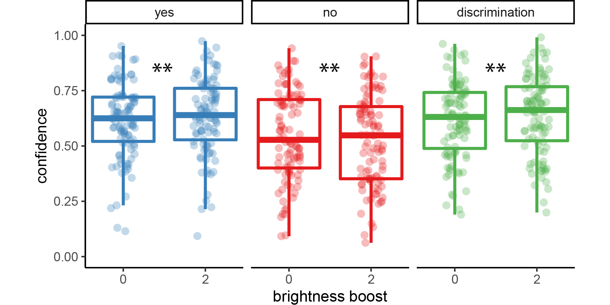

# Evidence weightings in confidence judgments for detection and discrimination {#ch:RC}

#### Matan Mazor, Lucie Charles, Roni Or Maimon Mor & Stephen M. Fleming {.unnumbered}

In Chapters \@ref(ch:termination) and \@ref(ch:MVS) I examined inference about absence and its relation to self-modelling in visual search, where a target is present or absent in an array of distractors. In this Chapter, I examine inference about absence in a near-threshold detection setting, where the location of the target is known and no distractors are present. Previous studies of near-threshold discrimination revealed a *positive evidence bias* (PEB) in discrimination confidence: confidence in perceptual decisions is more sensitive to evidence in support of the decision than to conflicting evidence. Recent theoretical proposals suggest that a PEB is due to observers adopting a detection-like strategy when rating their confidence, one that has functional benefits for metacognition in real-world settings where detectability and discriminability often go hand in hand. In three experiments (one lab-based and two online) we first successfully replicate a PEB in discrimination confidence. We then show that a PEB is observed in detection decisions, where participants report the presence or absence of a stimulus, regardless of its identity. We discuss our findings in relation to models that account for a positive evidence bias as emerging from a confidence-specific heuristic, and alternative models where decision and confidence are generated by the same, Bayes-rational process.

```{r RC_load_pkgs, echo=FALSE, message=FALSE, include=FALSE}
# List of packages required for this analysis
pkg <- c("dplyr", "ggplot2", "knitr", "bookdown")
# Check if packages are not installed and assign the
# names of the packages not installed to the variable new.pkg
new.pkg <- pkg[!(pkg %in% installed.packages())]
# If there are any packages in the list that aren't installed,
# install them
if (length(new.pkg)) {
  install.packages(new.pkg, repos = "https://cran.rstudio.com")
}
# Load packages

library("papaja")
r_refs("r-references.bib")
library('tidyverse')
library('broom')
library('cowplot')
library('MESS') # for AUCs
library('lsr') # for effect sizes
library('pwr') # for power calculations
library('brms') # for mixed effects modeling
library('BayesFactor') # for Bayesian t test
library('jsonlite') #parsing data from sort_trial
library('thesisdown')
library('knitr')
library('egg')
library('zoo') # for rollapply
library('RColorBrewer')
library('reticulate') # for python

```


## Introduction
<!-- First-year statistics courses teach that “the absence of evidence is not evidence of absence” [@altman1995statistics]. In other words, failing to find a statistically significant effect is not sufficient justification for that an effect does not exist. To make claims about the absence of an effect, one needs to incorporate information about test sensitivity (statistical power), specificity (significance level), and the probability of an effect to exist prior to seeing any data. Similarly, when facing a perceptual detection problem (*is there any signal in the noise?*), failure to detect a signal is not by itself sufficient to conclude that a signal is absent. In this case, information of potential relevance is the sensitivity of one’s senses to external signals, the tendency to hallucinate in the absence of true signal, and the prior probability of signal presence. The same considerations are also relevant when forming subjective confidence in the presence or absence of external signals. -->

<!-- Adult humans have been shown to rationally integrate information about the prior of a signal and the statistical power of the test when forming confidence in the absence of a signal in an abstract decision making task [@hsu2017absence]. However, it remains unknown whether similar computational considerations apply in perceptual settings, where uncertainty about the presence or absence of a signal is affected by both external (signal intensity) and internal (sensory precision) sources, and where these sources are not explicitly signaled. What information is incorporated into confidence ratings in visual detection, and whether this varies between decisions about signal absence or presence, is still an open question. Specifically, while confidence in decisions about target presence can scale with stimulus intensity, it is unclear what stimulus features, if any, will affect confidence in stimulus absence, given that decisions about absence can only be based on the lack of perceptual evidence for stimulus presence.  -->

When considering two alternative hypotheses, the probability of a chosen hypothesis to be correct is not only a function of the likelihood of observations under the chosen hypothesis, but also under the unchosen one. For example, when deciding that a random dot display was drifting to the right and not to the left, confidence should not only positively weigh motion energy to the right (*positive evidence*), but also negatively weigh motion energy to the left (*negative evidence*). However, when rating their subjective confidence, subjects place disproportional weight on evidence in favour of the choice, giving rise to a *positive evidence bias* [@zylberberg2012construction; @koizumi2015does; @peters2017perceptual; @sepulveda2020visual; @samaha2020positive; @rollwage2020confidence]. Put differently, confidence ratings in discrimination are sensitive not only to the *relative evidence* of the chosen hypothesis compared with the unchosen one (also termed *balance of evidence*), but also to the *sum evidence* for the two hypotheses [which for perceptual decisions is often related to *visibility*; see Fig. \@ref(fig:RC-2dmodel), left panel; @rausch2018confidence].

(ref:RC-2dmodel) Discrimination and detection in a two-dimensional Signal Detection Theory model. Left: in a two-dimensional SDT model, percepts $e$ are sampled from one of two Gaussian distributions (here centered at (0,1) and (1,0)). We define relative evidence as $e_{S1}-e_{S2}$ and sum evidence as $e_{S1}+e_{S2}$. Circles represent cross-sections of two-dimensional distributions. Center and Left: response and confidence accuracy are maximized when based on a log-likelihood ratio for the two stimulus categories. Center: in discrimination, this yields optimal decision and confidence criteria that are based on relative evidence (distance from the main diagonal), irrespective of sum evidence. Right: in detection, percepts in the absence of a stimulus are sampled from a Gaussian distribution centered at (0,0). This yields optimal decision and confidence that are based on a non-linear interaction between relative and sum evidence.

```{r RC-2dmodel, echo=FALSE,out.width="\\textwidth",fig.scap="Discrimination and detection in a two-dimensional SDT model", fig.cap="(ref:RC-2dmodel)"}

```

To account for this apparently irrational discounting of incongruent evidence in confidence formation, @maniscalco2016heuristic point out that outside of a lab setting, representational spaces are so high-dimensional that keeping track of evidence for every possible stimulus category is not feasible. For example, to be confident that an object is an apple, one would have to incorporate evidence for this object not being an orange, a banana, a book and a ferret, among an infinite many other unsupported hypotheses. To resolve this engineering challenge, metacognitive systems may have evolved to weigh evidence for the chosen hypothesis only, while ignoring conflicting evidence. This is similar to rating confidence not in the identity of a stimulus relative to other hypothetical stimuli, but in the presence of a stimulus relative to absence. Such a strategy is reasonable, as in Signal Detection space, samples that are farther away from the origin (high visibility) are on average farther away from the discrimination criterion (high discriminability). This strategy is then carried over to the lab, where decisions are made in low-dimensional representational spaces, and where keeping track of evidence for the two alternative stimulus categories is in fact feasible. 

A more recent model identified the origin of this response-congruent heuristic not in the curse of dimensionality, but in the variance structure of perceptual evidence [@miyoshi2020decision]. In a series of simulations, the authors augmented a bidimensional Signal Detection model with realistic assumptions about the sensory encoding of signal and noise, most importantly that the variance of signal tends to be higher than that of noise. In these settings, a Response Congruent Evidence (RCE) heuristic provided more accurate confidence judgments, meaning ones that are more aligned with objective accuracy, than did a Balance of Evidence (BE) heuristic. Again, this model implies that adopting a detection-like strategy when rating one’s confidence might have functional benefits for metacognition.

Notably, both models imply a link between confidence in discrimination, and detection judgments about the presence or absence of a stimulus. In a detection setting with multiple possible targets, the likelihood ratio between stimulus presence and absence is more sensitive to positive evidence for the detected stimulus compared to evidence for the absence of other, undetected stimuli (see \@ref(fig:RC-2dmodel), right panel). Perhaps  surprisingly, however, despite several recent studies finding that discrimination confidence is detection-like, there has been limited focus on the complementary question: do detection decisions share features of discrimination confidence, such as a positive evidence bias? In other words, when faced with a detection task where targets are drawn from two stimulus classes, would detection decisions be sensitive to sum evidence (like discrimination confidence), or to the relative evidence for presence for one category over the other? Moreover, little is known about confidence in these detection responses: would confidence in the presence of a target stimulus be susceptible to the same positive evidence bias as confidence in stimulus type? Finally, we asked whether detection confidence ratings would be sensitive to some form of positive evidence bias not only in decisions about target presence, but also in decisions about target absence. 

<!-- A detection disposition to confidence judgments in discrimination is then a case of bounded rationality under limited cognitive resources. Keeping track of evidence for all stimulus categories is hard (or practically impossible in natural representational spaces), so people base their confidence in the identity of a stimulus on evidence that is easily available to their cognitive system, namely evidence for the presence of this particular stimulus.  -->

<!-- Focusing on sum evidence is rational if subjects are rating their confidence not in the identity of the stimulus, but in the presence or absence of a signal. For example, when evidence is equally high for both stimulus categories, confidence in stimulus identity should be low (low relative evidence; see Fig. \@ref(fig:RC-2dmodel), middle panel), but confidence in the presence of a stimulus, regardless of its identity, should be high (high sum evidence; see Fig. \@ref(fig:RC-2dmodel), right panel). A positive evidence bias in discrimination judgments may indicate that participants are rating their confidence not in the accuracy of their choice, but in the presence of a signal. Indeed, a model that assumed a detection disposition toward discrimination confidence accounted for a set of behavioural findings, including this positive evidence bias [@maniscalco2016heuristic]. -->


<!-- Some decisions however are asymmetric by design, not just in the cognitive or metacognitive processing of incoming evidence. For example, when deciding if a target object is present or absent in a display, evidence can only be available to support presence, and inference about absence is based on a failure to accumulate evidence for presence, not on the accumulation of evidence for absence.  -->

To examine these questions, we conducted three experiments: one lab-based (N=10, 1800 trials per participant) and two online (N=102/100, 112/168 trials per participant). Participants performed discrimination and detection decisions on noisy stimuli, and rated their confidence in their decisions. Using reverse correlation analysis, we measured the influence of random fluctuations in stimulus energy on both responses and confidence ratings, and tested for the existence of processing asymmetries between detection 'yes' and 'no' responses [in response time, general confidence, and metacognitive sensitivity; @meuwese2014subjective; @mazor2020distinct; @kellij2021investigation; @mazor2021stage]. In all three experiments, we replicated previous findings of a positive evidence bias in confidence in discrimination of motion direction and relative luminance [@zylberberg2012construction]. In contrast, our understanding of decision and confidence formation in detection has evolved and changed following each experiment, as evident in our pre-registration documents. When considering the results of all three experiments together, we conclude that, similar to discrimination confidence, detection decisions and confidence ratings are also sensitive to a positive evidence bias (we use the word bias here to mean a deviation from equal weighting of positive and negative evidence, and not in the sense of a deviation from rationality). We discuss our findings with respect to recent theoretical proposals regarding the origin of a positive evidence bias in discrimination confidence.

<!-- In Exp. 2, where reverse correlation revealed an accumulation of positive evidence for stimulus absence, we find no metacognitive asymmetry between the two detection responses. We discuss our findings as drawing a link between discrimination confidence ratings and detection responses, but not detection confidence ratings.  -->


## Experiment 1

### Methods

#### Participants

The research complied with all relevant ethical regulations, and was approved by the Research Ethics Committee of University College London (study ID number 1260/003). 10 participants were recruited via the UCL's psychology subject pool, and gave their informed consent prior to their participation. Each participant performed four sessions of 600 trials each, in blocks of 100 trials. Sessions took place on different days and consisted of 3 discrimination blocks interleaved with 3 detection blocks. 

#### Experimental procedure

The experimental procedure for Exp. 1 largely followed the procedure described in @zylberberg2012construction, Exp. 1. Participants observed a random-dot kinematogram for a fixed duration of 700 ms. In discrimination trials, the direction of motion was one of two opposite directions with equal probability, and participants reported the observed direction by pressing one of two arrow keys on a standard keyboard. In detection blocks participants reported whether there was coherent motion by pressing one of two arrow keys on a standard keyboard. In half of the detection trials dots moved coherently to one of two opposite directions, and in the other half they moved randomly.

In both detection and discrimination blocks, following a decision participants indicated their confidence in their decision. Confidence was reported on a continuous scale ranging from chance to complete certainty. To avoid systematic response biases affecting confidence reports, the orientation (vertical or horizontal) and polarity (e.g., right or left) of the scale was set to agree with the type 1 response. For example, following a down arrow press, a vertical confidence bar was presented where 'guess' is at the center of the screen and 'certain' appeared at the lower end of the scale (see Fig. \@ref(fig:RC-exp1-design)). 

To control for response requirements, for five subjects the dots moved to the right or to the left, and for the other five subjects they moved upward or downward. The first group made discrimination judgments with the right and left keys and detection judgments with the up and down keys, and this mapping was reversed for the second group. The number of coherently moving dots ('motion coherence') was adjusted to maintain performance at around 70% accuracy for detection and discrimination tasks independently. This was achieved by measuring mean accuracy after every 20 trials, and adjusting coherence by a step of 3% if accuracy fell below 60% or went above 80%.

Stimuli for discrimination blocks were generated using the exact same procedure reported in @zylberberg2012construction^[We reused the original Matlab code that was used for Exp. 1 in Zylberberg et. al. (2012), kindly shared by Ariel Zylberberg. ]. Trials started with a presentation of a fixation cross for one second, immediately followed by stimulus presentation. The stimulus consisted of 152 white dots (diameter = 0.14°), presented within a 6.5° circular aperture centered on the fixation point for 700 milliseconds (42 frames, frame rate = 60 Hz). Dots were grouped in two sets of 56 dots each. Every other frame, the dots of one set were replaced with a new set of randomly positioned dots. For a coherence value of $c'$, a proportion of $c'$ of the dots from the second set moved coherently in one direction by a fixed distance of 0.33°, while the remaining dots in the set moved in random directions by a fixed distance of 0.33°. On the next update, the sets were switched, to prevent participants from tracing the position of specific dots. Frame-specific coherence values were sampled for each screen update from a normal distribution centred around the coherence value $c$ with a standard deviation of 0.07, with the constraint that $c'$ must be a number between 0 and 1.

Stimuli for detection blocks were generated using a similar procedure, with the only difference being that on a random half of the trials coherence was set to 0%, without random sampling of coherence values for different frames (see Fig. 1). 

At the end of each experimental block (100 trials), participants estimated the number of correct responses they have made.


```{r RC-exp1-design, echo=FALSE,out.width="\\textwidth",fig.scap="Experimental design for Exp. 1", fig.cap="Task design for Experiment 1. In both discrimination and detection blocks, participants viewed 700 milliseconds of a random dot motion array, after which they made a keyboard response to indicate their decision (motion direction in discrimination, signal absence or presence in detection), followed by a continuous confidence report using the mouse. 5 participants viewed vertically moving dots and indicated their detection responses on a horizontal scale, and 5 participants viewed horizontally moving dots and indicated their detection responses on a vertical scale. "}
knitr::include_graphics("figure/RC/designExp1.png")
```

### Randomization

The order and timing of experimental events was determined pseudo-randomly by the Mersenne Twister pseudorandom number generator, initialized in a way that ensures registration time-locking [@mazor2019novel]. 

### Analysis

Experiment 1 was pre-registered (pre-registration document is available here: [https://osf.io/z2s93/](https://osf.io/z2s93/)). Our full pre-registered analysis of behavioural data is available in Appendix \@ref(appRC:everything). 

<!-- Our pre-registered objectives for this study were to: -->

<!-- 1. Replicate the finding that metacognitive sensitivity for ‘no’ responses is lower than for ‘yes’ responses in detection [@meuwese2014subjective; @kanai2010subjective; @kellij2018foundations], and generalize these findings to a different task (determining whether or not some dots moved coherently in a random dot kinematogram; RDK). -->

<!-- 2. Estimate the goodness of fit of an unequal-variance SDT model to perceptual detection data, and compare it to the fit of models that assume a qualitative difference between confidence in absence and confidence in presence. -->

<!-- 3. Replicate the results of @zylberberg2012construction for perceptual discrimination. Namely, show that confidence in a motion discrimination task is mostly influenced by evidence for the selected direction within a short time window around 300 milliseconds after stimulus onset.  -->

<!-- 4. Test the generality of the results of @zylberberg2012construction to perceptual detection, where, by definition, no evidence can be collected to support a ‘no’ decision. Examine the contribution of signal variance. -->

#### Reverse correlation analysis {-}

For the reverse correlation analysis, we followed a procedure similar to the one described in @zylberberg2012construction. For each of the four directions (right, left, up and down), we applied two spatiotemporal filters to the frames of the dot motion stimuli as described in previous studies [@adelson1985spatiotemporal; @zylberberg2012construction]. The outputs of the two filters were squared and summed, resulting in a three-dimensional matrix with motion energy in a specific direction as a function of x, y, and time. We then took the mean of this matrix across the x and y dimensions to obtain an estimate of the overall temporal fluctuations in motion energy in the selected direction. Additionally, for every time point we extracted the variance along the x and y dimensions, to obtain a measure of temporal fluctuations in spatial variance. Using this filter, we obtained estimates of temporal fluctuations in the mean and variance of motion energy for upward, downward, leftward and rightward motion within each trial. Given a high correlation between our mean and variance estimates, we focused our analysis on the mean motion energy.

In order to distill random fluctuations in motion energy from mean differences between stimulus categories, we subtracted the mean motion energy from trial-specific motion energy vectors. The mean motion energy vectors were extracted at the group level, separately for each motion coherence level and as a function of motion direction. We chose this approach instead of the linear regression approach used by @zylberberg2012construction in order to control for nonlinear effects of coherence on motion energy.

#### Statistical inference {-}

Statistics were extracted separately for each participant, and group-level inference was then performed on the first-order statistics. T-test Bayes factors were used to quantify the evidence for the null when appropriate, using a Jeffrey-Zellner-Siow Prior for the null distribution, with a unit prior scale [@rouder2009bayesian]. 

### Results


```{r RC-exp1-load-and-format-data, echo=FALSE, cache=TRUE, message=FALSE}

e1=list()

e1$df <- read_csv('data/RC/RC.csv') %>%
  group_by(subj_id, detection) %>%
  mutate(confidence=confidence/1000,
         # in the original coding, 3 is right and 1 is left. 
         # changed to be 0 for right/up and 1 for left/down, to align 
         # with the coding of responses.
         direction = ifelse(direction==3,1,0)); 
 
e1$trial_df_unfiltered <- e1$df %>%
  group_by(subj_id, trial_id) %>%
  summarise(
    detection = detection[timepoint==1],
    direction = direction[timepoint==1],
    signal = signal[timepoint==1],
    response = response[timepoint==1],
    RT = RT[timepoint==1]-700, # stimulus duration
    confidence = confidence[timepoint==1],
    correct = correct[timepoint==1],
    trial_number = trial_number[timepoint==1],
    logRT = log(RT[timepoint==1]),
    conf_bi = ifelse(
        response==1, 
        as.numeric(confidence),
        -1*as.numeric(confidence)))%>%
  group_by(subj_id) %>%
  mutate(
    conf_discrete = ntile(confidence,20) %>%
      factor(levels=1:21))

e1$task_stats_unfiltered <- e1$trial_df_unfiltered %>%
  group_by(subj_id,detection) %>%
  summarise(acc=mean(correct),
            RT = median(RT),
            confidence=mean(confidence));

e1$trial_df <- e1$trial_df_unfiltered %>%
  filter(trial_number>300);

e1$detection_df <- e1$trial_df %>%
  filter(detection==1) %>%
  mutate(stimulus=signal);

e1$discrimination_df <- e1$trial_df %>%
  filter(detection==0) %>%
  mutate(stimulus = direction);

```

```{r RC-exp1-general-stats, echo=FALSE, cache=TRUE, message=FALSE}

# get basic stats
generalStats <- function(df) {
  
  stats = list();

  # GENERAL STATS
  stats$general <- df %>%
    group_by(subj_id) %>%
    summarise(
      bias = mean(ifelse(response==1,1,0)),
      acc = mean(ifelse(correct==1,1,0)),
      hit_rate = sum(correct==1 & stimulus==1)/sum(stimulus==1),
      false_alarm_rate=sum(correct==0 & stimulus==0)/sum(stimulus==0),
      dprime=qnorm(hit_rate)-qnorm(false_alarm_rate),
      confidence=mean(confidence),
      )
  
  # STATS AS A FUNCTION OF ACCURACY
  stats$by_acc <-
    df %>%
    group_by(subj_id, correct) %>%
    summarise(
      RT = mean(RT),
      confidence = mean(confidence),
      logRT = mean(logRT)
    )
  
  # STATS PER RESPONSE
  stats$by_response <-
    df %>%
    group_by(subj_id, response) %>%
    summarise(
      cor = cor(x=logRT, y=confidence), #correlation between RT and confidence
      RT = mean(RT),
      logRT = mean(logRT),
      confidence = mean(confidence),
      acc=mean(correct),
      count = n()
    )
  
  # A DIRECT CONTRAST BETWEEN THE TWO RESPONSES
  stats$contrast_responses <-
    stats$by_response %>%
    group_by(subj_id) %>%
    summarise(
      RT=RT[response==1]-RT[response==0], 
      logRT = logRT[response==1]-logRT[response==0],
      confidence=confidence[response==1]-confidence[response==0],
      cor = cor[response==1]-cor[response==0],
      acc = acc[response==1]-acc[response==0])
  
  return(stats)

}

# get stats for both tasks

generalStats2Tasks <- function(e) {
  
  e$detection_stats <- generalStats(e$detection_df);
  
  e$discrimination_stats <- generalStats(e$discrimination_df);
  
  e$task_stats <- rbind(e$detection_stats$general%>%mutate(detection=1),
                        e$discrimination_stats$general%>%mutate(detection=0))
  
  return(e)
}

e1 <- generalStats2Tasks(e1);


# Compare area under the response conditional curve
testAUC <- function(e) {
  
  e$made_errors <- e$trial_df %>%
    group_by(subj_id, detection, response, correct, .drop=FALSE) %>%
    tally() %>% 
    group_by(subj_id) %>%
      summarise(min_per_cell=min(n))%>%
    filter(min_per_cell>1) %>%
    pull(subj_id);

  e$conf_counts <- e$trial_df %>%
    filter(subj_id %in% e$made_errors) %>%
  mutate(subj_id=factor(subj_id)) %>%
  group_by(subj_id, detection, response, correct, confidence, .drop=FALSE) %>%
  tally() %>%
  spread(correct, n, sep='', fill=0) %>%
  arrange(desc(confidence), by_group=TRUE) %>%
  group_by(subj_id, detection, response)%>%
  mutate(cs_correct=cumsum(correct1)/sum(correct1),
         cs_incorrect=cumsum(correct0)/sum(correct0));

e$conf_counts <-e$conf_counts %>%
  group_by(subj_id, detection, response,.drop=TRUE) %>%
  summarise(
    cs_correct=c(0,1),
    cs_incorrect=c(0,1)) %>%
  bind_rows(e$conf_counts,.) %>%
  group_by(subj_id, detection, response,cs_incorrect) %>%
  summarise(cs_correct=max(cs_correct)) %>%
  merge(e$task_stats%>%dplyr::select(subj_id,detection,dprime, hit_rate, false_alarm_rate))%>%
  mutate(miss_rate=1-hit_rate,
         cr_rate=1-false_alarm_rate,
         cs_correct_from_sdt= ifelse(response==1,
           pnorm(qnorm(false_alarm_rate*cs_incorrect), mean=-dprime)/hit_rate,
           pnorm(qnorm(miss_rate*cs_incorrect), mean=-dprime)/cr_rate));

  e$AUC <- e$conf_counts %>%
    group_by(subj_id, detection, response,.drop=TRUE) %>%
    summarise(AUC = auc(cs_incorrect, cs_correct)) %>%
    spread(response, AUC, sep='')%>%
    mutate(metacognitive_asymmetry=(response1-response0),
           average_AUC=response1/2+response0/2);
  
  e$sdtAUC <- e$conf_counts %>%
    group_by(subj_id, detection, response,.drop=TRUE) %>%
    summarise(AUC = auc(cs_incorrect, cs_correct_from_sdt)) %>%
    spread(response, AUC, sep='')%>%
    mutate(metacognitive_asymmetry_from_sdt=(response1-response0))

  e$AUC <- e$AUC %>%
    merge(e$sdtAUC%>%dplyr::select(subj_id,detection,metacognitive_asymmetry_from_sdt)) %>%
            mutate(metacognitive_asymmetry_control = metacognitive_asymmetry-metacognitive_asymmetry_from_sdt)
  
  return(e)

};

e1 <- testAUC(e1);

```

#### Response accuracy

Overall proportion correct was `r e1$task_stats_unfiltered%>%filter(detection==0)%>%pull(acc)%>%mean()%>%printnum()` in the discrimination and `r e1$task_stats_unfiltered%>%filter(detection==1)%>%pull(acc)%>%mean()%>%printnum()` in the detection task. Performance for discrimination was significantly higher than for detection (`r t.test(e1$task_stats_unfiltered%>%filter(detection==0)%>%pull(acc), e1$task_stats_unfiltered%>%filter(detection==1)%>%pull(acc), paired=TRUE)%>%apa_print()%>%'$'(full_result)`). This difference in task performance reflected a slower convergence of the staircasing procedure for the discrimination task during the first session. When discarding all data from the first session and analyzing only data from the last three sessions (1800 trials per participant), task performance was equated between the two tasks at the group level (`r t.test(e1$task_stats%>%filter(detection==0)%>%pull(acc), e1$task_stats%>%filter(detection==1)%>%pull(acc), paired=TRUE)%>%apa_print()%>%'$'(full_result)`; `r ttestBF(e1$task_stats%>%filter(detection==0)%>%pull(acc), e1$task_stats%>%filter(detection==1)%>%pull(acc), paired=TRUE)%>%apa_print()%>%'$'(statistic)`).  In order to avoid confounding differences between discrimination and detection decision and confidence profiles with more general task performance effects, the first session was excluded from all subsequent analyses.

#### Overall properties of response time and confidence distributions

In detection, participants were more likely to respond 'yes' than 'no' (mean proportion of 'yes' responses: `r t.test(e1$detection_stats$general$bias,mu=0.5)%>%apa_print()%>%'$'(full_result)`). We did not observe a consistent response bias for the discrimination data (mean proportion of 'rightward' or 'upward' responses: `r t.test(e1$discrimination_stats$general$bias,mu=0.5)%>%apa_print()%>%'$'(full_result)`). 

Replicating previous studies [@meuwese2014subjective; @mazor2020distinct; @kellij2021investigation; @mazor2021stage], we find the typical asymmetries between detection 'yes' and 'no' responses in response time, overall confidence, and the alignment between subjective confidence and objective accuracy (also termed metacognitive sensitivity, here measured as the area under the response-conditional type 2 ROC curve; see Fig. \@ref(fig:RC-exp1-asymmetries)). 'No' responses were slower compared to 'yes' responses (median difference: `r e1$detection_stats$contrast_responses%>%pull(RT)%>%median()%>%abs()%>%printnum()` ms), and accompanied by lower levels of subjective confidence (mean difference of `r e1$detection_stats$contrast_responses$confidence%>%mean()%>%printnum()` on a 0-1 scale). Metacognitive sensitivity was higher for detection 'yes' compared with detection 'no' responses (mean difference in area under the curve units: `r e1$AUC%>%filter(detection==1)%>%pull(metacognitive_asymmetry)%>%mean()%>%printnum()`). No difference in response time, confidence, or metacognitive sensitivity was found between the two discrimination responses. For a detailed statistical analysis of these behavioural asymmetries see Appendix \@ref(appRC:asymmetries1).

(ref:exp1-asymmetries) Behavioural asymmetries in metacognitive sensitivity, response time, and overall confidence, in Exp. 1. Top row: Response conditional type 2 ROC curves for the two tasks and four responses in Exp. 1. The area under the type 2 ROC curve is a measure of metacognitive sensitivity, and the difference in areas between the two responses a measure of metacognitive asymmetry. Single-subject curves are presented in low opacity. Second, third, and fourth rows: distributions of the area under the type 2 ROC curve, median response time, and mean confidence for the four responses, across participants. Box edges and central lines represent the 25, 50 and 75 quantiles. Whiskers cover data points within four inter-quartile ranges around the median. Stars represent significance in a two-sided t-test: \*\*: p<0.01, \*\*\*: p<0.001

```{r RC-exp1-asymmetries, echo=FALSE, message=FALSE, fig.cap="(ref:exp1-asymmetries)", fig.scap="Behavioural asymmetries in metacognitive sensitivity, response time, and overall confidence, in Exp. 1", out.width="\\textwidth"}

detection_colors = c('#377eb8', '#e41a1c');
discrimination_colors = c('#4daf4a','#984ea3')

 plotrcROC = function(df, labels, c, title, AUC, alpha=1) {
   #############################
  
  conf_discrete_counts <- df %>%
  mutate(subj_id=factor(subj_id),
         conf_discrete = conf_discrete%>%
            fct_rev()) %>%
  group_by(subj_id, response, correct, conf_discrete, .drop=FALSE) %>%
  tally() %>%
  spread(correct, n, sep='') %>%
  arrange(conf_discrete, by_group=TRUE) %>%
  group_by(subj_id, response)%>%
  mutate(cs_correct=cumsum(correct1)/sum(correct1),
         cs_incorrect=cumsum(correct0)/sum(correct0))

conf_discrete_counts_group <- conf_discrete_counts %>%
  group_by(response, conf_discrete)%>%
  summarise(conf_incorrect = mean(cs_incorrect, na.rm=TRUE),
            conf_correct = mean(cs_correct, na.rm=TRUE),
            conf_incorrect_sem = se(cs_incorrect, na.rm=TRUE),
            conf_correct_sem  = se(cs_correct, na.rm=TRUE));


rcROC <- ggplot(data=conf_discrete_counts_group %>%
                 mutate(response=ifelse(response==1,labels[1],labels[2]) %>%
                          factor(levels=labels)),
       aes(x=conf_incorrect, y=conf_correct, color=response)) +
  geom_line(size=1.3) +
  geom_point(aes(shape = response))+
  geom_errorbar(aes(ymin = conf_correct-conf_correct_sem,ymax = conf_correct+conf_correct_sem)) +
  geom_errorbar(aes(xmin = conf_incorrect-conf_incorrect_sem,xmax = conf_incorrect+conf_incorrect_sem)) +
  geom_abline(slope=1)+
  theme_bw() + coord_fixed() +
  labs(x='p(conf | incorrect)', y='p(conf | correct)', title=title)+ 
  scale_color_manual(values=c)+
  scale_fill_manual(values=c) +
  geom_rect(aes(xmin=0,xmax=1,ymin=0,ymax=1),size=0.5,color='black',alpha=0)+
  geom_line(data=conf_discrete_counts %>%
              filter(as.integer(subj_id)<20) %>%
              mutate(response=ifelse(response==1,labels[1],labels[2]) %>%
                       factor(levels=labels)),
            aes(x=cs_incorrect,y=cs_correct, group=interaction(subj_id,response), color=response),alpha=0.4) +
  theme(legend.position='none');


AUClong <- AUC %>%
  gather('response','rcAUC',3:4) %>%
  mutate(response=ifelse(response=='response1',labels[1],labels[2])%>%factor(levels=labels),
         'auROC2'=rcAUC);

AUCplot <- ggplot(AUClong, aes(x=response,y=auROC2, color=response)) +
  ylim(0,1)+
  geom_boxplot(size=1,fill='white',outlier.alpha=0)+
  geom_jitter(alpha=0.3,size=2, width=0.3) +
  theme(axis.text.x = element_blank(),
        plot.background = element_rect(
    fill = "white",
    colour = "black",
    size = 1)
    )+ 
  scale_color_manual(values=c)+
  scale_fill_manual(values=c)+
  theme_classic()+
  theme(legend.position='none',
        plot.margin=unit(c(0, 25, 0, 25),'pt'),
        axis.title.y=element_blank())+
  coord_flip();

return(list('rcROC'=rcROC, 'AUC'=AUCplot))

 }
 
 plotAllAsymmetries <- function(experiment, filename) {

  subj_df <- experiment$df %>% 
    group_by(subj_id,detection,response) %>%
    summarise(confidence=mean(confidence),
              RT=median(RT));
  
  DetRTplot <- ggplot(subj_df %>%
                        filter(detection==1) %>%
                        mutate(response=factor(response,levels=c(1,0),
                                               labels=c('yes','no'))),
                      aes(x=response,y=RT,group=response,fill=response,color=response)) +
        ylim(0,2500)+
        geom_boxplot(size=1,fill='white',outlier.alpha=0)+
        geom_jitter(alpha=0.3,size=2, width=0.3) +
  theme(axis.text.x = element_blank(),
        plot.background = element_rect(
    fill = "white",
    colour = "black",
    size = 1)
    )+ 
  scale_color_manual(values=detection_colors)+
  scale_fill_manual(values=detection_colors)+
  theme_classic()+
  theme(legend.position='none',
        plot.margin=unit(c(0, 25, 0, 25),'pt'),
        axis.title.y=element_blank())+
  coord_flip();
  
  Detconfplot <- ggplot(subj_df %>%
                        filter(detection==1) %>%
                        mutate(response=factor(response,levels=c(1,0),
                                               labels=c('yes','no'))),
                      aes(x=response,y=confidence,group=response,fill=response,color=response)) +
        ylim(0,1)+
        geom_boxplot(size=1,fill='white',outlier.alpha=0)+
        geom_jitter(alpha=0.3,size=2, width=0.3) +
  theme(axis.text.x = element_blank(),
        plot.background = element_rect(
    fill = "white",
    colour = "black",
    size = 1)
    )+ 
  scale_color_manual(values=detection_colors)+
  scale_fill_manual(values=detection_colors)+
  theme_classic()+
  theme(legend.position='none',
        plot.margin=unit(c(0, 25, 0, 25),'pt'),
        axis.title.y=element_blank())+
  coord_flip();
  
  DisRTplot <- ggplot(subj_df %>%
                        filter(detection==0) %>%
                        mutate(response=factor(response,levels=c(1,0),
                                               labels=c('S1','S2'))),
                      aes(x=response,y=RT,group=response,fill=response,color=response)) +
        ylim(0,2500)+
        geom_boxplot(size=1,fill='white',outlier.alpha=0)+
        geom_jitter(alpha=0.3,size=2, width=0.3) +
  theme(axis.text.x = element_blank(),
        plot.background = element_rect(
    fill = "white",
    colour = "black",
    size = 1)
    )+ 
  scale_color_manual(values=discrimination_colors)+
  scale_fill_manual(values=discrimination_colors)+
  theme_classic()+
  theme(legend.position='none',
        plot.margin=unit(c(0, 25, 0, 25),'pt'),
        axis.title.y=element_blank())+
  coord_flip();
  
  Disconfplot <- ggplot(subj_df %>%
                        filter(detection==0) %>%
                        mutate(response=factor(response,levels=c(1,0),
                                               labels=c('S1','S2'))),
                      aes(x=response,y=confidence,group=response,fill=response,color=response)) +
        geom_boxplot(size=1,fill='white',outlier.alpha=0)+
        geom_jitter(alpha=0.3,size=2, width=0.3) +
  theme(axis.text.x = element_blank(),
        plot.background = element_rect(
    fill = "white",
    colour = "black",
    size = 1)
    )+ 
  scale_color_manual(values=discrimination_colors)+
  scale_fill_manual(values=discrimination_colors)+
  theme_classic()+
  theme(legend.position='none',
        plot.margin=unit(c(0, 25, 0, 25),'pt'),
        axis.title.y=element_blank())+
  coord_flip();
  
  DetROCplot <- plotrcROC(experiment$detection_df, 
                 c('yes','no'), 
                 detection_colors, 
                 title='Detection', 
                 experiment$AUC%>%filter(detection==1));
  
  DisROCplot <- plotrcROC(experiment$discrimination_df, 
                 c('S1','S2'), 
                 discrimination_colors, 
                 title='Discrimination', 
                 experiment$AUC%>%filter(detection==0));

p <- grid.arrange(DetROCplot$rcROC,DisROCplot$rcROC,DetROCplot$AUC,DisROCplot$AUC,DetRTplot,DisRTplot,Detconfplot,Disconfplot,ncol=2, heights=c(6,2,2,2))
ggsave(filename,p,width=8,height=8,dpi=300) 

}

# plotAllAsymmetries(e1,'figure/RC/RC-exp1-asymmetries.pdf');

```

<!-- #### zROC curves -->

```{r RC-exp1-zROC, echo=FALSE}

testzROC <- function(df) {
  
  conf_bi_counts <- df %>%
     mutate(subj_id=factor(subj_id)) %>%
      group_by(subj_id, stimulus, conf_bi, .drop=FALSE) %>%
      tally() %>%
      spread(stimulus, n, sep='', fill=0) %>%
      arrange(desc(conf_bi), by_group=TRUE) %>%
      mutate(cs_1=cumsum(stimulus1)/sum(stimulus1),
             cs_0=cumsum(stimulus0)/sum(stimulus0)) %>%
     filter(cs_1 >0 & cs_1<1 & cs_0>0 & cs_0<1) %>% 
    mutate(z_1 = qnorm(cs_1),
           z_0 = qnorm(cs_0)) %>%
    ungroup()
  
    zROC_slopes1 <- conf_bi_counts %>%
      group_by(subj_id) %>%
      do(model=lm(z_1~z_0,data=.)) %>%
      tidy(model) %>%
      filter(term=='z_0')%>%
      mutate(slope1=estimate)%>%
      dplyr::select('subj_id','slope1') %>%
      drop_na();
    
    # To control for regression to the mean, fit the opposite model and average the two slopes
    # (see Wickens, p. 56)
    zROC_slopes2 <- conf_bi_counts %>%
      group_by(subj_id) %>%
      do(model=lm(z_0~z_1,data=.)) %>%
      tidy(model) %>%
      filter(term=='z_1')%>%
      mutate(slope2=1/estimate)%>%
      dplyr::select('subj_id','slope2') %>%
      drop_na();
      
   zROC_fit <- conf_bi_counts %>%
          group_by(subj_id) %>%
          do(glance(lm(z_1~z_0,data=.))) %>%
          dplyr::select(subj_id,r.squared);
    
   zROC_slopes <- merge(
      zROC_slopes1 %>%
        dplyr::select(subj_id, slope1),
     zROC_slopes2 %>%
        dplyr::select(subj_id, slope2),
    ) %>%
      merge(zROC_fit) %>%
      rowwise()%>%
      mutate(
        logslope = log(slope1)/2+log(slope2)/2
    )
    
  return(zROC_slopes)
}

testzROC2tasks <- function(e) {
  
  e$detection_zROC<- testzROC(e$detection_df);
  
  e$discrimination_zROC <- testzROC(e$discrimination_df);
  
  return(e)
}

e1 <- testzROC2tasks(e1);

```


#### Reverse Correlation

Random fluctuations in motion energy made it possible to apply reverse correlation to test which stimulus features are incorporated into decisions and confidence ratings in detection and discrimination. Following @zylberberg2012construction, our statistical analysis focused on the first 300 milliseconds after stimulus onset.

##### Discrimination {#e1-disc-RC -}


(ref:exp1-discrimination) Decision and confidence discrimination kernels, Experiment 1. Upper left: motion energy in the chosen (green) and unchosen (purple) direction as a function of time. Lower left: a subtraction between energy in the chosen and unchosen directions. Upper right: confidence effects for motion energy in the chosen (green) and unchosen (purple) directions. Lower right: a subtraction between confidence effects in the chosen and unchosen directions. Shaded areas represent the the mean $\pm$ one standard error. The first 300 milliseconds of the trial are marked in yellow. Stars represent significance in a two-sided t-test: \*: p<0.05, \*\*: p<0.01, \*\*\*: p<0.001. In the upper row, stars represent the significance of a positive evidence bias in evidence weighting.

```{r RC-exp1-discrimination-RC, echo=FALSE, message=FALSE, warning=FALSE, fig.cap="(ref:exp1-discrimination)", fig.scap="Reverse correlation of discrimination trials, Exp. 1", out.width="\\textwidth"}

e1$discRCdf <- e1$df %>%
  filter(detection==0 & 
           trial_number>300) %>%
  mutate(energyChosen = ifelse(response==1, 
                               energyLeft, 
                               energyRight),
         energyUnchosen = ifelse(response==1, 
                                 energyRight,
                                 energyLeft),
         energyTrue = ifelse(direction==1, 
                               energyLeft, 
                               energyRight),
         energyOpposite = ifelse(direction==1, 
                                 energyRight,
                                 energyLeft)) %>%
  dplyr::select(subj_id,timepoint,energyChosen,energyUnchosen, energyTrue, energyOpposite, confidence, trial_number, correct) %>%
  gather('direction','energy',4:7) %>%
  mutate(direction=ifelse(direction=='energyChosen',
                          'chosen',
                          ifelse(direction=='energyUnchosen',
                                 'unchosen',
                                 ifelse(direction=='energyTrue',
                                        'true',
                                        'opposite'))),
         session = round(trial_number/300)) %>%
  group_by(subj_id, session) %>%
  mutate(median_confidence=median(confidence)) %>%
  ungroup() %>%
  mutate(
    binaryconf = ifelse(confidence>=median_confidence, 1, 0)
  );

  e1$discrimination_decision_kernel <- e1$discRCdf %>%
  filter(direction=='chosen' | direction=='unchosen') %>%
    group_by (subj_id,direction,timepoint) %>%
    summarise(energy=mean(energy)) %>%
    group_by(subj_id, direction)%>%
    arrange(timepoint) %>%
    mutate(sm_energy=rollapply(energy,5,mean,align='right',fill=NA),
           time=(timepoint-4)/60*1000)

  e1$discrimination_objective_decision_kernel <- e1$discRCdf %>%
    filter(direction=='true' | direction=='opposite') %>%
    group_by (subj_id,direction,timepoint,correct) %>%
    summarise(energy=mean(energy)) %>%
    group_by (subj_id,direction,timepoint) %>%
    summarise(energy=energy[correct==1]-energy[correct==0])%>%
    group_by(subj_id, direction)%>%
    arrange(timepoint) %>%
    mutate(sm_energy=rollapply(energy,5,mean,align='right',fill=NA),
           time=(timepoint-4)/60*1000)


p1 <- ggplot(e1$discrimination_decision_kernel %>%
    group_by(direction,time) %>%
    summarise(se=se(sm_energy),
              energy=mean(sm_energy)),aes(x=time,y=energy,color=direction)) +
  geom_hline(yintercept=0) +
  annotate(geom = "rect", xmin=0, xmax=300, ymin=-2000,ymax=2000, 
           color="transparent", fill="orange", alpha=0.3) +
  geom_line() +
  geom_ribbon(aes(ymin = energy-se, ymax = energy+se, fill=direction),alpha=0.5) +
  scale_color_manual(values=discrimination_colors)+
  scale_fill_manual(values=discrimination_colors) + 
  theme_minimal()+theme(
    axis.text.y=element_blank(),
    axis.ticks.y=element_blank(),
    axis.text.x=element_blank(),
    axis.ticks.x=element_blank(),
    axis.title.x=element_blank()) +
  labs(y='energy', 
       x='time (ms.)',
       title='Decision: discrimination')+
  theme(legend.position = 'none')
      
p2 <- ggplot(
  data= e1$discrimination_decision_kernel %>%
    group_by(time,subj_id) %>%
    summarise(diff=sm_energy[direction=='chosen']-sm_energy[direction=='unchosen'])%>%
    group_by(time) %>%
    summarise(se=se(diff),
              diff=mean(diff)),
  aes(x=time,y=diff)) +
  geom_hline(yintercept=0) +
  annotate(geom = "rect", xmin=0, xmax=300, ymin=-1500,ymax=3300, 
           color="transparent", fill="orange", alpha=0.3) +
  geom_line() +
  geom_ribbon(aes(ymin = diff-se, ymax = diff+se),alpha=0.5) +
  theme_minimal()+theme(
    axis.text.y=element_blank(),
    axis.ticks.y=element_blank()) +
  labs(title='',
       y='energy difference', 
       x='time (ms.)');

e1$discrimination_confidence_kernel <-  e1$discRCdf %>%
  filter(direction=='chosen' | direction=='unchosen') %>%
    group_by (subj_id,direction, binaryconf, timepoint) %>%
    summarise(energy=mean(energy)) %>%
    group_by(subj_id, direction, timepoint) %>%
    mutate(conf_effect = energy[binaryconf==1]-energy[binaryconf==0]) %>%
    group_by(subj_id, direction) %>%
    arrange(timepoint) %>%
    mutate(sm_energy=rollapply(conf_effect,5,mean,align='right',fill=NA),
           time=(timepoint-4)/60*1000)

p3 <- ggplot(
  data = e1$discrimination_confidence_kernel  %>%
    group_by(direction,time) %>%
    summarise(se=se(sm_energy),
              energy=mean(sm_energy)),
  aes(x=time,y=energy,color=direction)) +
  geom_hline(yintercept=0) +
  annotate(geom = "rect", xmin=0, xmax=300, ymin=-2000,ymax=2000, 
           color="transparent", fill="orange", alpha=0.3) +
  geom_line() +
  geom_ribbon(aes(ymin = energy-se, ymax = energy+se, fill=direction),alpha=0.5) +
  scale_color_manual(values=discrimination_colors)+
  scale_fill_manual(values=discrimination_colors) + 
  theme_minimal()+theme(
    axis.text.y=element_blank(),
    axis.ticks.y=element_blank(),
    axis.text.x=element_blank(),
    axis.ticks.x=element_blank(),
    axis.title.x=element_blank()) +
  labs(y='energy', 
       x='time (ms.)',
       title='Confidence: discrimination')+
  theme(legend.position = c(0.8, 0.8));

p4 <- ggplot(data= e1$discrimination_confidence_kernel %>%
    group_by(time,subj_id) %>%
    summarise(diff=sm_energy[direction=='chosen']-sm_energy[direction=='unchosen'])%>%
    group_by(time) %>%
    summarise(se=se(diff),
              diff=mean(diff)),
    aes(x=time,y=diff)) +
  geom_hline(yintercept=0) +
  annotate(geom = "rect", xmin=0, xmax=300, ymin=-1500,ymax=3300, 
           color="transparent", fill="orange", alpha=0.3) +
  geom_line() +
  geom_ribbon(aes(ymin = diff-se, ymax = diff+se),alpha=0.5) +
  theme_minimal()+theme(
    axis.text.y=element_blank(),
    axis.ticks.y=element_blank()) +
  labs(title='',
       y='energy difference', 
       x='time (ms.)');

# grid.arrange(p1, p3, p2, p4, ncol=2);
knitr::include_graphics("figure/RC/RC-exp1-discrimination-RC-enhanced.png")


# p5 <- ggplot(e1$discrimination_objective_decision_kernel %>%
#                mutate(direction=factor(direction,levels=c('true','opposite'))) %>%
#     group_by(direction,time) %>%
#     summarise(se=se(sm_energy),
#               energy=mean(sm_energy)),aes(x=time,y=energy,color=direction)) +
#   geom_hline(yintercept=0) +
#   annotate(geom = "rect", xmin=0, xmax=300, ymin=-2000,ymax=2000, 
#            color="transparent", fill="orange", alpha=0.3) +
#   geom_line() +
#   geom_ribbon(aes(ymin = energy-se, ymax = energy+se, fill=direction),alpha=0.5) +
#   scale_color_manual(values=discrimination_colors)+
#   scale_fill_manual(values=discrimination_colors) + 
#   theme_minimal()+theme(
#     axis.text.y=element_blank(),
#     axis.ticks.y=element_blank(),
#     axis.text.x=element_blank(),
#     axis.ticks.x=element_blank(),
#     axis.title.x=element_blank()) +
#   labs(y='energy', 
#        x='time (ms.)',
#        title='Decision: discrimination')+
#   theme(legend.position = c(0.8,0.8))

e1$RC = list();

e1$RC$decision300 <- e1$discrimination_decision_kernel %>%
  filter(timepoint>4 & timepoint<22) %>%
  group_by(subj_id,timepoint) %>%
  summarise(diff=sm_energy[direction=='chosen']-sm_energy[direction=='unchosen']) %>% 
  group_by(subj_id) %>%
  summarise(diff=mean(diff));

e1$RC$decisionPEB300 <- e1$discrimination_objective_decision_kernel %>%
  filter(timepoint>4 & timepoint<22) %>%
  group_by(subj_id,timepoint) %>%
  summarise(diff=sm_energy[direction=='true']+sm_energy[direction=='opposite']) %>% 
  group_by(subj_id) %>%
  summarise(diff=mean(diff));

e1$RC$accuracy300 <- e1$discrimination_objective_decision_kernel %>%
  filter(timepoint>4 & timepoint<22) %>%
  group_by(subj_id,timepoint) %>%
  summarise(diff=sm_energy[direction=='true']-sm_energy[direction=='opposite']) %>% 
  group_by(subj_id) %>%
  summarise(diff=mean(diff));

e1$RC$confidence300 <- e1$discrimination_confidence_kernel %>%
  filter(timepoint>4 & timepoint<22) %>%
  group_by(subj_id,timepoint) %>%
  summarise(diff=sm_energy[direction=='chosen']-sm_energy[direction=='unchosen']) %>% 
  group_by(subj_id) %>%
  summarise(diff=mean(diff));

e1$RC$PEB300 <- e1$discrimination_confidence_kernel %>%
  filter(timepoint>4 & timepoint<22) %>%
  group_by(subj_id,timepoint) %>%
  summarise(diff=sm_energy[direction=='chosen']+sm_energy[direction=='unchosen']) %>% 
  group_by(subj_id) %>%
  summarise(diff=mean(diff));

```

Reverse correlation analysis quantified the effect of random fluctuations in motion energy on the probability of responding 'right' and 'left' (or 'up' and 'down'), and the temporal dynamics of decision formation. Similar to the results obtained by @zylberberg2012construction., participants' decisions were sensitive to motion energy fluctuations during the first 300 milliseconds of the trial (`r e1$RC$decision300%>%pull(diff)%>%t.test()%>%apa_print()%>%'$'(statistic)`; see Fig. \@ref(fig:RC-exp1-discrimination-RC), left panels). The symmetry of the two time courses around the x axis does not by itself entail an equal contribution of negative and positive evidence to the final decision, because due to the demeaning procedure, with enough trials negative and positive evidence at each time point should mathematically sum to zero. Instead, we tested the contribution of motion energy in the true and opposite directions of motion (defined with respect to the stimulus, and independently of decision) to discrimination decisions. Fluctuations in motion energy in both directions contributed significantly to discrimination decisions (`r e1$RC$accuracy300%>%pull(diff)%>%t.test()%>%apa_print()%>%'$'(statistic)`), with no significant difference between them (`r e1$RC$decisionPEB300%>%pull(diff)%>%t.test()%>%apa_print()%>%'$'(statistic)`). In other words, positive and negative evidence equally contributed to discrimination decisions, even when defined independently of the decision. 

We then turned to the contribution of motion energy to subjective confidence ratings. The median confidence rating in each experimental session was used to split all motion energy vectors into four groups, according to decision (chosen or unchosen directions) and confidence level (high or low). Confidence kernels for the chosen and unchosen directions were then extracted by subtracting the mean low confidence vectors from the mean high confidence vectors for both the chosen and unchosen directions. We observed a significant effect of motion energy on confidence within this time window (`r e1$RC$confidence300%>%t.test()%>%apa_print()%>%'$'(statistic)`; see Fig. \@ref(fig:RC-exp1-discrimination-RC), right panels).  This effect was significantly stronger for motion energy in the chosen direction, compared to the unchosen direction (`r e1$RC$PEB300%>%pull(diff)%>%t.test()%>%apa_print()%>%'$'(statistic)`). In other words, confidence ratings in the discrimination task were more sensitive to positive evidence than to negative evidence. This is a replication of the Positive Evidence Bias observed in @zylberberg2012construction. 


```{r RC-exp1-detection-RC, echo=FALSE, message=FALSE, warning=FALSE}

e1$detRCdf <- e1$df %>%
  filter(detection==1 & 
           trial_number>300) %>%
  mutate(totalEnergy = energyLeft+energyRight) %>%
  dplyr::select(subj_id, timepoint, response, totalEnergy, confidence, trial_number, signal) %>%
  mutate(session = round(trial_number/300)) %>%
  group_by(subj_id, session) %>%
  mutate(median_confidence=median(confidence)) %>%
  ungroup() %>%
  mutate(
    binaryconf = ifelse(confidence>=median_confidence, 1, 0)
  );

## to make sure that we are not measuring some artefact of signal vs. noise trials
e1$detection_signal_kernel <- e1$detRCdf %>%
group_by (subj_id,signal,timepoint) %>%
summarise(totalEnergy=mean(totalEnergy)) %>%
group_by(subj_id, signal)%>%
arrange(timepoint) %>%
mutate(sm_energy=rollapply(totalEnergy,5,mean,align='right',fill=NA),
       time=(timepoint-4)/60*1000);

e1$detection_response_kernel <- e1$detRCdf %>%
group_by (subj_id,response,timepoint) %>%
summarise(totalEnergy=mean(totalEnergy)) %>%
group_by(subj_id, response)%>%
arrange(timepoint) %>%
mutate(sm_energy=rollapply(totalEnergy,5,mean,align='right',fill=NA),
       time=(timepoint-4)/60*1000);


e1$detection_confidence_kernel <- e1$detRCdf %>%
group_by (subj_id,response,binaryconf,timepoint) %>%
summarise(totalEnergy=mean(totalEnergy)) %>%
group_by(subj_id, response, timepoint)%>%
summarise(diff=totalEnergy[binaryconf==1]-totalEnergy[binaryconf==0])%>%
arrange(timepoint) %>%
mutate(sm_energy=rollapply(diff,5,mean,align='right',fill=NA),
       time=(timepoint-4)/60*1000);


e1$RC$detectionDecision300 <- e1$detection_response_kernel %>%
filter(timepoint>4 & timepoint<22) %>%
group_by(subj_id,timepoint) %>%
mutate(energy=sm_energy[response==1]-sm_energy[response==0]) %>%
group_by(subj_id) %>%
summarise(energy=mean(energy));

e1$RC$detectionConfidence300 <- e1$detection_confidence_kernel %>%
filter(timepoint>4 & timepoint<22) %>%
group_by(subj_id,timepoint) %>%
mutate(energy=sm_energy[response==1]-sm_energy[response==0]) %>%
group_by(subj_id) %>%
summarise(energy=mean(energy));

e1$RC$detectionConfidence300_by_resp <- e1$detection_confidence_kernel %>%
filter(timepoint>4 & timepoint<22) %>%
group_by(subj_id, response) %>%
summarise(energy=mean(sm_energy)) %>%
  spread(response,energy,sep='');

e1$RC$detectionPEB300 <- e1$detection_confidence_kernel %>%
  filter(timepoint>4 & timepoint<22) %>%
  group_by(subj_id,timepoint) %>%
  summarise(diff=sm_energy[response==1]+sm_energy[response==0]) %>% 
  group_by(subj_id) %>%
  summarise(diff=mean(diff));
      

```

##### Detection {-}

Reverse correlation analysis for detection introduces a challenge: while 'no' responses reflect a belief in the absence of any coherent motion, 'yes' responses can result from detection of any type of coherent motion going in either direction (or both). We chose to have two possible motion directions in the detection task in order to prevent participants from making 'no' responses based on significant motion in an unexpected direction. While this choice ensured that participants cannot trivially accumulate evidence for absence, it also made the reverse correlation analysis more difficult, as we did not have full access to participants' beliefs about the stimulus when they responded 'yes'. 

As a first approximation, we tested whether sum motion energy along the relevant dimension (horizontal or vertical), regardless of direction (up/down or left/right), affected the probability of a 'yes' response. Sum motion energy did not have a significant effect on participants' responses during the first 300 milliseconds (`r e1$RC$detectionDecision300%>%pull(energy)%>%t.test()%>%apa_print()%>%'$'(statistic)`) or at any other time point. The effect of sum motion energy on decision confidence during the first 300 milliseconds was positive and marginally significant (`r e1$RC$detectionConfidence300%>%pull(energy)%>%t.test()%>%apa_print()%>%'$'(statistic)`). Response-specific effects of sum motion energy on decision confidence were not significant for either response.


```{r RC-exp1-detection-RC-figure, echo=FALSE, message=FALSE, warning=FALSE,fig.cap="Decision and confidence detection kernels, Experiment 1. Upper left: sum motion energy along the relevant dimension in 'yes' (blue) and 'no' (red) responses as a function of time. Lower left: a subtraction between energy in 'yes' and 'no' responses. Upper right: confidence effects for motion energy in 'yes' and 'no' responses. Lower right: a subtraction between confidence effects 'yes' and 'no' responses. Shaded areas represent the the mean +- one standard error. The first 300 milliseconds of the trial are marked in yellow", fig.scap="Reverse correlation of detection trials, Exp. 1", out.width="\\textwidth"}

p1 <- ggplot(e1$detection_response_kernel%>%
    group_by(response,time) %>%
    summarise(se=se(sm_energy),
              energy=mean(sm_energy)) %>%
      mutate(response=factor(ifelse(response==1,'yes','no'), levels=c('yes','no'))),aes(x=time,y=energy,color=response)) +
  geom_hline(yintercept=0) +
  annotate(geom = "rect", xmin=0, xmax=300, ymin=-4500,ymax=3000, 
           color="transparent", fill="orange", alpha=0.3) +
  geom_line() +
  geom_ribbon(aes(ymin = energy-se, ymax = energy+se, fill=response),alpha=0.5) +
  scale_color_manual(values=detection_colors)+
  scale_fill_manual(values=detection_colors) + 
  theme_minimal()+theme(
    axis.text.y=element_blank(),
    axis.ticks.y=element_blank(),
    axis.text.x=element_blank(),
    axis.ticks.x=element_blank(),
    axis.title.x=element_blank()) +
  labs(y='energy', 
       x='time (ms.)',
       title='Decision kernel: detection')+
  theme(legend.position = 'none');

p2 <- ggplot(
  data= e1$detection_response_kernel%>%
    group_by(time,subj_id) %>%
    summarise(diff=sm_energy[response==1]-sm_energy[response==0])%>%
    group_by(time) %>%
    summarise(se=se(diff),
              diff=mean(diff)),
  aes(x=time,y=diff)) +
  geom_hline(yintercept=0) +
  annotate(geom = "rect", xmin=0, xmax=300, ymin=-2500,ymax=6000, 
           color="transparent", fill="orange", alpha=0.3) +
  geom_line() +
  geom_ribbon(aes(ymin = diff-se, ymax = diff+se),alpha=0.5) +
  theme_minimal()+theme(
    axis.text.y=element_blank(),
    axis.ticks.y=element_blank()) +
  labs(title='',
       y='energy difference', 
       x='time (ms.)');

p3 <- ggplot(
  data = e1$detection_confidence_kernel %>%
    group_by(response,time) %>%
    summarise(se=se(sm_energy),
              energy=mean(sm_energy))%>%
      mutate(response=factor(ifelse(response==1,'yes','no'), levels=c('yes','no'))),
  aes(x=time,y=energy,color=response)) +
  geom_hline(yintercept=0) +
  annotate(geom = "rect", xmin=0, xmax=300, ymin=-4500,ymax=3000, 
           color="transparent", fill="orange", alpha=0.3) +
  geom_line() +
  geom_ribbon(aes(ymin = energy-se, ymax = energy+se, fill=response),alpha=0.5) +
  scale_color_manual(values=detection_colors)+
  scale_fill_manual(values=detection_colors) + 
  theme_minimal()+theme(
    axis.text.y=element_blank(),
    axis.ticks.y=element_blank(),
    axis.text.x=element_blank(),
    axis.ticks.x=element_blank(),
    axis.title.x=element_blank()) +
  labs(y='energy', 
       x='time (ms.)',
       title='Confidence kernel: detection')+
  theme(legend.position = c(0.8,0.8));

p4 <- ggplot(data= e1$detection_confidence_kernel%>%
    group_by(time,subj_id) %>%
    summarise(diff=sm_energy[response==1]-sm_energy[response==0])%>%
    group_by(time) %>%
    summarise(se=se(diff),
              diff=mean(diff)),
    aes(x=time,y=diff)) +
  geom_hline(yintercept=0) +
  annotate(geom = "rect", xmin=0, xmax=300, ymin=-2500,ymax=6000, 
           color="transparent", fill="orange", alpha=0.3) +
  geom_line() +
  geom_ribbon(aes(ymin = diff-se, ymax = diff+se),alpha=0.5) +
  theme_minimal()+theme(
    axis.text.y=element_blank(),
    axis.ticks.y=element_blank()) +
  labs(title='',
       y='energy difference', 
       x='time (ms.)');


# grid.arrange(p1, p3, p2, p4, ncol=2)

```


#### Detection signal trials {-}

```{r RC-exp1-signal, echo=FALSE, message=FALSE, warning=FALSE}
e1$signalRCdf <- e1$df %>%
  filter(detection==1 & 
           signal==1 &
           trial_number>300) %>%
  mutate(energyTrue= ifelse(direction==1,
                            energyLeft,
                            energyRight),
         energyOpposite=ifelse(direction==1,
                               energyRight,
                               energyLeft))%>%
  pivot_longer(starts_with('energy'),names_to='motionDirection',values_to='energy')%>%
  dplyr::select(subj_id, timepoint, response, motionDirection, energy, confidence, trial_number) %>%
  mutate(session = round(trial_number/300)) %>%
  group_by(subj_id, session) %>%
  mutate(median_confidence=median(confidence)) %>%
  ungroup() %>%
  mutate(
    binaryconf = ifelse(confidence>=median_confidence, 1, 0)
  ) %>%
  filter(motionDirection=='energyTrue' | motionDirection=='energyOpposite')%>%
  mutate(motionDirection=factor(ifelse(motionDirection=='energyTrue','true','opposite'),
                                levels=c('true', 'opposite')));

e1$signal_decision_kernel <- e1$signalRCdf %>%
group_by (subj_id,response,timepoint,motionDirection) %>%
summarise(energy=mean(energy)) %>%
group_by (subj_id,timepoint,motionDirection) %>%
summarise(energy=energy[response==1]-energy[response==0])%>%
group_by(subj_id,motionDirection) %>%
arrange(timepoint) %>%
mutate(sm_energy=rollapply(energy,5,mean,align='right',fill=NA),
       time=(timepoint-4)/60*1000);


e1$signal_confidence_kernel <- e1$signalRCdf %>%
group_by (subj_id,response,binaryconf,timepoint, motionDirection) %>%
summarise(energy=mean(energy)) %>%
group_by(subj_id, response, timepoint, motionDirection)%>%
summarise(diff=energy[binaryconf==1]-energy[binaryconf==0])%>%
group_by(subj_id,motionDirection,response)%>%
arrange(timepoint) %>%
mutate(sm_energy=rollapply(diff,5,mean,align='right',fill=NA),
       time=(timepoint-4)/60*1000);


p1 <- ggplot(e1$signal_decision_kernel%>%
    group_by(motionDirection,time) %>%
    summarise(se=se(sm_energy),
              energy=mean(sm_energy)),
    aes(x=time,y=energy,color=motionDirection)) +
  geom_hline(yintercept=0) +
  annotate(geom = "rect", xmin=0, xmax=300, ymin=-6300,ymax=6300,
           color="transparent", fill="orange", alpha=0.3) +
  geom_line() +
  geom_ribbon(aes(ymin = energy-se, ymax = energy+se, fill=motionDirection),alpha=0.5) +
  scale_color_manual(values=detection_colors)+
  scale_fill_manual(values=detection_colors) + 
  theme_minimal()+theme(
    axis.text.y=element_blank(),
    axis.ticks.y=element_blank(),
    axis.text.x=element_blank(),
    axis.ticks.x=element_blank(),
    axis.title.x=element_blank()) +
  labs(y='energy', 
       x='time (ms.)',
       title='Decision: signal trials')+
  theme(legend.position = 'none');

p2 <- ggplot(e1$signal_confidence_kernel%>%
               filter(response==1)%>%
    group_by(motionDirection,time) %>%
    summarise(se=se(sm_energy),
              energy=mean(sm_energy)),
    aes(x=time,y=energy,color=motionDirection)) +
  geom_hline(yintercept=0) +
  annotate(geom = "rect", xmin=0, xmax=300, ymin=-6300,ymax=6300,
           color="transparent", fill="orange", alpha=0.3) +
  geom_line() +
  geom_ribbon(aes(ymin = energy-se, ymax = energy+se, fill=motionDirection),alpha=0.5) +
  scale_color_manual(values=detection_colors)+
  scale_fill_manual(values=detection_colors) + 
  theme_minimal()+theme(
    axis.text.y=element_blank(),
    axis.ticks.y=element_blank(),
    axis.text.x=element_blank(),
    axis.ticks.x=element_blank(),
    axis.title.x=element_blank()) +
  labs(y='energy', 
       x='time (ms.)',
       title='Confidence: hit trials')+
  theme(legend.position = 'none');

p3 <- ggplot(e1$signal_confidence_kernel%>%
               filter(response==0)%>%
    group_by(motionDirection,time) %>%
    summarise(se=se(sm_energy),
              energy=mean(sm_energy)),
    aes(x=time,y=energy,color=motionDirection)) +
  geom_hline(yintercept=0) +
  annotate(geom = "rect", xmin=0, xmax=300, ymin=-6300,ymax=6300,
           color="transparent", fill="orange", alpha=0.3) +
  geom_line() +
  geom_ribbon(aes(ymin = energy-se, ymax = energy+se, fill=motionDirection),alpha=0.5) +
  scale_color_manual(values=detection_colors)+
  scale_fill_manual(values=detection_colors) + 
  theme_minimal()+theme(
    axis.text.y=element_blank(),
    axis.ticks.y=element_blank(),
    axis.text.x=element_blank(),
    axis.ticks.x=element_blank(),
    axis.title.x=element_blank()) +
  labs(y='energy', 
       x='time (ms.)',
       title='Confidence: miss trials',
       fill='direction',
       color='direction')+
  theme(legend.position = c(0.8,0.8))


p4 <- ggplot(
  data = e1$signal_decision_kernel %>%
    group_by(subj_id,time) %>%
    summarise(diff=sm_energy[motionDirection=='true']-sm_energy[motionDirection=='opposite'])%>%
      group_by(time)%>%
      summarise(se=se(diff),
              energy=mean(diff)),
  aes(x=time,y=energy)) +
  geom_hline(yintercept=0) +
  annotate(geom = "rect", xmin=0, xmax=300, ymin=-10000,ymax=10000, 
           color="transparent", fill="orange", alpha=0.3) +
  geom_line() +
  geom_ribbon(aes(ymin = energy-se, ymax = energy+se),alpha=0.5) +
  scale_color_manual(values=detection_colors)+
  scale_fill_manual(values=detection_colors) + 
  theme_minimal()+theme(
    axis.text.y=element_blank(),
    axis.ticks.y=element_blank()) +
  labs(y='energy difference', 
       x='time (ms.)');

p5 <- ggplot(
  data = e1$signal_confidence_kernel %>%
    filter(response==1)%>%
    group_by(subj_id,time) %>%
    summarise(diff=sm_energy[motionDirection=='true']-sm_energy[motionDirection=='opposite'])%>%
      group_by(time)%>%
      summarise(se=se(diff),
              energy=mean(diff)),
  aes(x=time,y=energy)) +
  geom_hline(yintercept=0) +
  annotate(geom = "rect", xmin=0, xmax=300, ymin=-10000,ymax=10000, 
           color="transparent", fill="orange", alpha=0.3) +
  geom_line() +
  geom_ribbon(aes(ymin = energy-se, ymax = energy+se),alpha=0.5) +
  scale_color_manual(values=detection_colors)+
  scale_fill_manual(values=detection_colors) + 
  theme_minimal()+theme(
    axis.text.y=element_blank(),
    axis.ticks.y=element_blank()) +
  labs(y='energy difference', 
       x='time (ms.)');

p6 <- ggplot(
  data = e1$signal_confidence_kernel %>%
    filter(response==0)%>%
    group_by(subj_id,time) %>%
    summarise(diff=sm_energy[motionDirection=='true']-sm_energy[motionDirection=='opposite'])%>%
      group_by(time)%>%
      summarise(se=se(diff),
              energy=mean(diff)),
  aes(x=time,y=energy)) +
  geom_hline(yintercept=0) +
  annotate(geom = "rect", xmin=0, xmax=300, ymin=-10000,ymax=10000, 
           color="transparent", fill="orange", alpha=0.3) +
  geom_line() +
  geom_ribbon(aes(ymin = energy-se, ymax = energy+se),alpha=0.5) +
  scale_color_manual(values=detection_colors)+
  scale_fill_manual(values=detection_colors) + 
  theme_minimal()+theme(
    axis.text.y=element_blank(),
    axis.ticks.y=element_blank()) +
  labs(y='energy difference', 
       x='time (ms.)');

e1$RC$signal_decision300 <- e1$signal_decision_kernel %>%
  filter(timepoint>4 & timepoint<22)%>%
  group_by(subj_id) %>%
  summarise(diff=mean(sm_energy[motionDirection=='true'])-mean(sm_energy[motionDirection=='opposite'])); 

e1$RC$signalPEB300 <- e1$signal_decision_kernel %>%
  filter(timepoint>4 & timepoint<22)%>%
  group_by(subj_id) %>%
  summarise(diff=mean(sm_energy[motionDirection=='true'])+mean(sm_energy[motionDirection=='opposite'])); 

e1$RC$signal_confidenceYes300 <- e1$signal_confidence_kernel %>%
  filter(timepoint>4 & timepoint<22 & response==1)%>%
  group_by(subj_id) %>%
  summarise(diff=mean(sm_energy[motionDirection=='true'])-mean(sm_energy[motionDirection=='opposite']));

e1$RC$signal_confidenceNo300 <- e1$signal_confidence_kernel %>%
  filter(timepoint>4 & timepoint<22 & response==0)%>%
  group_by(subj_id) %>%
  summarise(diff=mean(sm_energy[motionDirection=='true'])-mean(sm_energy[motionDirection=='opposite']));

e1$RC$signal_confidenceNoTrue300 <- e1$signal_confidence_kernel %>%
  filter(timepoint>4 & timepoint<22 & response==0)%>%
  group_by(subj_id) %>%
  summarise(diff=mean(sm_energy[motionDirection=='true']));

e1$RC$signal_confidenceNoOpposite300 <- e1$signal_confidence_kernel %>%
  filter(timepoint>4 & timepoint<22 & response==0)%>%
  group_by(subj_id) %>%
  summarise(diff=mean(sm_energy[motionDirection=='opposite']));

e1$RC$signal_PEBYes300 <- e1$signal_confidence_kernel %>%
  filter(timepoint>4 & timepoint<22 & response==1)%>%
  group_by(subj_id) %>%
  summarise(diff=mean(sm_energy[motionDirection=='true'])+mean(sm_energy[motionDirection=='opposite']));

e1$RC$signal_PEBNo300 <- e1$signal_confidence_kernel %>%
  filter(timepoint>4 & timepoint<22 & response==0)%>%
  group_by(subj_id) %>%
  summarise(diff=mean(sm_energy[motionDirection=='true'])+mean(sm_energy[motionDirection=='opposite']));
# 
```

A failure to find significant effects of sum motion energy on detection decisions and confidence may be due to the fact that participants were sensitive to relative evidence (e.g., 'more dots are moving to the right than to the left') rather than to the sum motion along the relevant axis ('many dots are moving to the right and to the left'). However, as we mention above, on any single trial, we cannot tell whether a 'yes' response means 'I perceived coherent motion to the right' or 'I perceived coherent motion to the left'. Instead, in order to approximate participants' belief states during 'yes' responses, we focused only on trials in which coherent motion was presented in one of the two directions (signal trials). In these trials, we reasoned that a 'yes' response is most likely to reflect the detection of the true direction of motion. We therefore asked whether fluctuations in the true and opposite directions of motion contributed to detection decision and confidence. This was done by subtracting the motion energy vectors for 'yes' and 'no' responses in the true and opposite motion directions. 

Similar to discrimination decisions, detection decisions were most sensitive to perceptual evidence in the first 300 milliseconds of the trial (see Fig. \@ref(fig:RC-exp1-signal-figure), left panels). However, in contrast to discrimination, an asymmetric evidence weighting was apparent in the decision itself: when deciding whether a stimulus contained coherent motion, participants were more sensitive to fluctuations in motion energy that strengthened the true direction of motion, in comparison to fluctuations that weakened motion in the opposite direction (`r e1$RC$signalPEB300%>%pull(diff)%>%t.test()%>%apa_print()%>%'$'(statistic)`). 

<!-- We note again that the apparent symmetry in the discrimination decision kernel is an artefact of the analysis method. In the discrimination analysis, 'chosen' and 'unchosen' vectors mirror each other in the limit, because they must sum to zero. This is not true for this analysis, where we subtract motion energy for 'yes' and 'no' responses within each of the two vectors.  -->
  
  Motion fluctuations in the first 300 milliseconds of the trial also contributed to confidence in detection 'yes' responses (contrasting high and low confidence hit trials; `r e1$RC$signal_confidenceYes300%>%pull(diff)%>%t.test()%>%apa_print()%>%'$'(statistic)`). But unlike in the discrimination task here we found no positive evidence bias in confidence ratings (`r e1$RC$signal_PEBYes300%>%pull(diff)%>%t.test()%>%apa_print()%>%'$'(statistic)`). To reiterate, while detection decisions were mostly sensitive to fluctuations in motion energy toward the true direction of motion, confidence in detection 'yes' responses was equally sensitive to fluctuations in the true and opposite directions of motion. 
Confidence in 'miss' trials was independent of motion energy (`r e1$RC$signal_confidenceNo300%>%pull(diff)%>%t.test()%>%apa_print()%>%'$'(statistic)`). This was true for motion energy in the true direction of motion (`r e1$RC$signal_confidenceNoTrue300%>%pull(diff)%>%t.test()%>%apa_print()%>%'$'(statistic)`) as well as for motion energy in the opposite direction (`r e1$RC$signal_confidenceNoOpposite300%>%pull(diff)%>%t.test()%>%apa_print()%>%'$'(statistic)`). However, and to anticipate the results of Exp. 3 presented below, we note that this equal weighting of positive and negative evidence in detection confidence was not replicated in an experiment designed to directly test this surprising result with an experimental manipulation. 

(ref:exp1-signal) Decision and confidence detection kernels in signal trials, Experiment 1. Upper left: difference in motion energy between 'yes' and 'no' responses in the true (blue) and opposite (red) directions as a function of time. Upper middle and right: confidence effects for motion energy in the true and opposite directions for 'yes' and 'no' responses, respectively. Lower panels: the subtraction of decision and confidence kernels for the true and opposite directions. Shaded areas represent the the mean $\pm$ one standard error. The first 300 milliseconds of the trial are marked in yellow. Stars represent significance in a two-sided t-test: \*: p<0.05, \*\*: p<0.01, \*\*\*: p<0.001. In the upper row, stars represent the significance of a positive evidence bias in evidence weighting.

```{r RC-exp1-signal-figure, echo=FALSE, message=FALSE, warning=FALSE,fig.cap="(ref:exp1-signal)", fig.scap="Reverse correlation of detection signal trials, Exp. 1", out.width="\\textwidth"}

# grid.arrange(p1, p2, p3, p4, p5, p6, ncol=3)
knitr::include_graphics("figure/RC/RC-exp1-signal-RC-enhanced.png")

```


<!-- #### Perceptual sample analysis {-} -->
  
  <!-- According to  -->
  
```{r RCExp1MEhistDisc, echo=FALSE, message=FALSE, warning=FALSE, eval=FALSE, fig.cap="Decision and confidence discrimination kernels, Experiment 1. Upper left: motion energy in the chosen (green) and unchosen (purple) direction as a function of time. Upper right: a subtraction between energy in the chosen and unchosen directions. Lower left: confidence effects for motion energy in the chosen (green) and unchosen (purple) directions. Upper right: a subtraction between confidence effects in the chosen and unchosen directions. Shaded areas represent the the mean +- one standard error. The first 300 milliseconds of the trial are marked in yellow", fig.scap="Decision kernels in discrimination."}

# e1$raw_df <- read_csv('data/RC/raw_RC.csv') %>%
#   group_by(subj_id, detection) %>%
#   mutate(confidence=confidence/1000,
#          # in the original coding, 3 is right and 1 is left. 
#          # changed to be 0 for right/up and 1 for left/down, to align 
#          # with the coding of responses.
#          direction = ifelse(direction==3,1,0)); 
# 
# df <- e1$raw_df %>%
#   filter(detection==0 & 
#            trial_number>300 &
#            timepoint >4 &
#            timepoint<22) %>%
#   mutate(energyDiff = energyRight-energyLeft) %>%
#   group_by(subj_id,trial_number,response,confidence,direction) %>%
#   summarise(X=mean(energyDiff)) %>%
#   ungroup()%>%
#   mutate(respconf=ifelse(response==1,-confidence,confidence),
#          direction=ifelse(direction==0,'right','left'))
# 
# p1 <- ggplot(df%>%filter(subj_id==4),aes(x=X,fill=direction))+geom_density(alpha=0.5, color='black',size=1)+scale_fill_manual(values=discrimination_colors);
# 
# p2 <- ggplot(df%>%filter(subj_id==4), aes(x=X,y=respconf))+geom_point();
# 
# grid.arrange(p1, p2, ncol = 1, heights = c(2, 0.5));
# 
# discCorPerResp <- df %>% group_by(subj_id,response) %>% 
#   summarise(cor=cor(respconf,X,method='spearman')) %>%
#   spread(response,cor,sep='')

```


```{r RCExp1MEhistDet, echo=FALSE, message=FALSE, warning=FALSE, fig.cap="Decision and confidence discrimination kernels, Experiment 1. Upper left: motion energy in the chosen (green) and unchosen (purple) direction as a function of time. Upper right: a subtraction between energy in the chosen and unchosen directions. Lower left: confidence effects for motion energy in the chosen (green) and unchosen (purple) directions. Upper right: a subtraction between confidence effects in the chosen and unchosen directions. Shaded areas represent the the mean +- one standard error. The first 300 milliseconds of the trial are marked in yellow", eval=FALSE, fig.scap="Decision kernels in discrimination."}


# df <- e1$raw_df %>%
#   filter(detection==1 & 
#            trial_number>300 &
#            timepoint >4 &
#            timepoint<22) %>%
#   mutate(energy = abs(energyRight-energyLeft)) %>%
#   group_by(subj_id,trial_number,response,confidence,signal) %>%
#   summarise(X=mean(energy)) %>%
#   ungroup()%>%
#   mutate(respconf=ifelse(response==1,confidence,-confidence),
#          signal=factor(ifelse(signal==1,'signal','noise'),
#                        levels=c('signal','noise')))
# 
# p1 <- ggplot(df%>%filter(subj_id==4),aes(x=X,fill=signal))+geom_density(alpha=0.5, color='black',size=1)+scale_fill_manual(values=detection_colors);
# 
# p2 <- ggplot(df%>%filter(subj_id==4), aes(x=X,y=respconf))+geom_point();
# 
# grid.arrange(p1, p2, ncol = 1, heights = c(2, 0.5))
# 
# detCorPerResp <- df %>% group_by(subj_id,response) %>% 
#   summarise(cor=cor(respconf,X,method='spearman')) %>%
#   spread(response,cor,sep='')
```


## Experiment 2

```{r RC-exp2-load-and-format-data, echo=FALSE, cache=TRUE, message=FALSE, warning=FALSE}

e2=list()

e2$df <- read_csv('data/RC/Flicker.csv') %>%
  group_by(s,task,trial_index) %>%
  mutate(side=c(rep(0,48),rep(1,48)),
         timepoint=rep(1:12,8), 
         eccentricity = rep(c(rep(1,12),rep(2,12),rep(3,12),rep(4,12)),2)) %>%
  rename(subj_id = s,
         trial_id = trial_index) %>%
  mutate(detection = ifelse(task=='detection',1,0),
         bright_side=ifelse(bright_side=='right',1,0),
         signal=signal_presence,
         detection=as.factor(detection),
         response=as.factor(response),
         correct=as.factor(correct),
         subj_id=as.factor(subj_id)) %>%
  ungroup() %>%
  dplyr::select(subj_id,detection,trial_id,
                RT,signal,correct,bright_side,
                response,conf_RT,confidence,
                luminance,side,timepoint,
                eccentricity,trial)

e2$trial_df <- e2$df %>%
  group_by(subj_id, trial_id) %>%
  summarise(
    detection = detection[side==1 & timepoint==1 & eccentricity == 1],
    bright_side = bright_side[side==1 & timepoint==1 & eccentricity == 1],
    signal = signal[side==1 & timepoint==1 & eccentricity == 1],
    response = response[side==1 & timepoint==1 & eccentricity == 1],
    RT = RT[side==1 & timepoint==1 & eccentricity == 1]-480, # stimulus duration
    confidence = confidence[side==1 & timepoint==1 & eccentricity == 1],
    correct = correct[side==1 & timepoint==1 & eccentricity == 1],
    trial_number = trial[side==1 & timepoint==1 & eccentricity == 1],
    conf_bi = ifelse(
      response==1, 
      as.numeric(confidence),
      -1*as.numeric(confidence)),
    luminance_0=mean(luminance[side==0 & timepoint<8]),
    luminance_1=mean(luminance[side==1 & timepoint<8]))%>%
  group_by(subj_id) %>%
  mutate(
    conf_discrete = ntile(confidence,20) %>%
      factor(levels=1:21),
    logRT=log(RT));

e2$detection_df <- e2$trial_df %>%
  filter(detection==1) %>%
  mutate(stimulus=signal);

e2$discrimination_df <- e2$trial_df %>%
  filter(detection==0) %>%
  mutate(stimulus = bright_side);

e2 <- generalStats2Tasks(e2) %>%
  testAUC() %>%
  testzROC2tasks();

e2$zROC <- rbind(e2$detection_zROC%>%mutate(detection=1),
                 e2$discrimination_zROC%>%mutate(detection=0));

e2$zROC_contast_rsquare <- e2$zROC%>%group_by(subj_id)%>%summarize(fit_diff=r.squared[detection==1]-r.squared[detection==0])

```


In Exp. 1,  we replicated previous observations of a positive evidence bias in discrimination confidence, such that evidence in support of a decision was given more weight in the construction of confidence than evidence against it. In contrast, in detection a positive evidence bias was apparent for the decision, but not for the confidence kernels. Equal weighting of positive and negative evidence suggests that detection confidence followed not the presence or absence of a signal, but the clarity of its identity. Furthermore, confidence in detection 'no' responses was not at all affected by fluctuations in motion energy. 

In Exp. 2 we tested the robustness of these findings by employing a different type of stimuli (flickering patches) and mode of data collection (a ~10 minute online experiment). Our pre-registered objectives (documented here: [https://osf.io/8u7dk/](https://osf.io/8u7dk/)) were to first, replicate a positive evidence bias in discrimination, second, replicate the absence of a positive evidence bias in detection confidence ratings, and third, replicate the absence of an effect for either positive or negative evidence on confidence in 'no' judgments. 

### Methods

#### Participants

The research complied with all relevant ethical regulations, and was approved by the Research Ethics Committee of University College London (study ID number 1260/003). 147 participants were recruited via Prolific (prolific.co), and gave their informed consent prior to their participation. They were selected based on their acceptance rate (>95%) and for being native English speakers. Following our pre-registration, we aimed to collect data until we had reached 100 included participants based on our pre-specified inclusion criteria (see [https://osf.io/8u7dk/](https://osf.io/8u7dk/)). Our final data set includes observations from 102 included participants. The entire experiment took around 10 minutes to complete. Participants were paid £1.25 for their participation, equivalent to an hourly wage of £7.5.

#### Experimental paradigm

The experiment was programmed using the jsPsych and P5 JavaScript packages [@de2015jspsych;@mccarthy2015p5], and was hosted on a JATOS server [@lange2015jatos]. It consisted of two tasks (Detection and Discrimination) presented in separate blocks. A total of 56 trials of each task were delivered in 2 blocks of 28 trials each. The order of experimental blocks was interleaved, starting with discrimination.

The first discrimination block started after an instruction section, which included instructions about the stimuli and confidence scale, four practice trials and four confidence practice trials. Further instructions were presented before the second block. Instruction sections were followed by multiple-choice comprehension questions, to monitor participants' understanding of the main task and confidence reporting interface. To encourage concentration, feedback was delivered at the end of the second and fourth blocks about overall performance and mean confidence in the task. 

Importantly, unlike the lab-based experiment, there was no calibration of difficulty for the two tasks. The rationale for this is that in Exp. 1 perceptual thresholds for motion discrimination were highly consistent across participants, and staircasing took a long time to converge. Furthermore, in Exp. 1 we aimed to control for task difficulty, but this introduced differences between the stimulus intensity in detection and discrimination. To complement our findings, here we aimed to match stimulus intensity between the two tasks, and accept that task performance might vary. 

##### Trial structure {-}

In discrimination blocks, trial structure closely followed Exp. 2 from @zylberberg2012construction, with a few adaptations. Following a fixation cross (500 ms), two sets of four adjacent vertical gray bars were presented as a rapid serial visual presentation (RSVP; 12 frames, presented at 25Hz), displayed to the left and right of the fixation cross (see Fig. \@ref(fig:RC-exp2-design)). On each frame, the luminance of the bars was randomly sampled from a Gaussian distribution with a standard deviation of 10/255 units in the standard RGB 0-255 coordinate system. The average luminance of one set of bars was that of the background (128/255). The average luminance of the other set was 133/255, making this patch brighter on average. Participants then reported which of the two sets was brighter on average using the 'D' and 'F' keys on the keyboard. After their response, they rated their confidence on a continuous scale, by controlling the size of a colored circle with their mouse. High confidence was mapped to a big, blue circle, and low confidence to a small, red circle. To discourage hasty confidence ratings, the confidence rating scale stayed on the screen for at least 2000 milliseconds. Feedback about response accuracy was delivered after the confidence rating phase. 

```{r RC-exp2-design, echo=FALSE,out.width="\\textwidth",fig.scap="Experimental design for Exp. 2", fig.cap="Task design for Experiment 2. In both tasks, participants viewed 480 milliseconds of two flicketing patches, after which they made a keyboard response to indicate which of the patches was brighter (discrimination) or whether any of the patches was brighter than the background (detection). ", out.width="\\textwidth"}
knitr::include_graphics("figure/RC/designExp2.png")
```


Detection blocks were similar to discrimination blocks, with the exception that decisions were made about whether the average luminance of either of the two sets was brighter than the gray background, or not. In 'different' trials, the luminance of the four bars in one of the sets was sampled from a Gaussian distribution with mean 133/255, and the luminance of the other set from a Gaussian distribution with mean 128/255. In 'same' trials, the luminance of both sets was sampled from a distribution centered at 128/255. Decisions in Detection trials were reported using the 'Y' and 'N' keys. Confidence ratings and feedback were as in the discrimination task. 

### Randomization

The order and timing of experimental events was determined pseudo-randomly by the Mersenne Twister pseudorandom number generator, initialized in a way that ensures registration time-locking [@mazor2019novel]. 

### Results

#### Response accuracy

Overall proportion correct was `r e2$task_stats%>%filter(detection==0)%>%pull(acc)%>%mean()%>%printnum()` in the discrimination and `r e2$task_stats%>%filter(detection==1)%>%pull(acc)%>%mean()%>%printnum()` in the detection task. Performance for discrimination was significantly higher than for detection (`r t.test(e2$task_stats%>%filter(detection==0)%>%pull(acc), e2$task_stats%>%filter(detection==1)%>%pull(acc), paired=TRUE)%>%apa_print()%>%'$'(full_result)`). Unlike in Exp. 1, where we aimed to control for task difficulty, here we decided to match stimulus intensity between the two tasks, so a difference between detection and discrimination performance was expected [@wickens2002elementary, 104]. 

#### Overall properties of response and confidence distributions

Similar to Exp. 1, participants were more likely to respond 'yes' than 'no' in the detection task (mean proportion of 'yes' responses: `r t.test(e2$detection_stats$general$bias,mu=0.5)%>%apa_print()%>%'$'(full_result)`). We did not observe a consistent response bias in discrimination (mean proportion of 'right' responses: `r t.test(e2$discrimination_stats$general$bias,mu=0.5)%>%apa_print()%>%'$'(full_result)`). 

As in Exp. 1, we also found behavioural asymmetries between the two detection responses (see Fig. \@ref(fig:RC-exp2-asymmetries)), with 'yes' responses being faster (median difference of `r e2$detection_stats$contrast_responses%>%pull(RT)%>%median()%>%abs()%>%printnum()` ms) and accompanied by higher levels of confidence (mean difference of `r e2$detection_stats$contrast_responses$confidence%>%mean()%>%printnum()` on a 0-1 scale). Unlike in Exp. 1, here we found no evidence for a difference in metacognitive sensitivity between 'yes' and 'no' responses (mean difference of `r e2$AUC%>%filter(detection==1)%>%pull(metacognitive_asymmetry)%>%mean()%>%printnum()` in AUC units). No asymmetries were observed between the two discrimination responses. For a detailed statistical analysis see Appendix \@ref(appRC:asymmetries2).

(ref:exp2-asymmetries) Behavioural asymmetries in metacognitive sensitivity, response time, and overall confidence, in Exp. 2. Same conventions as in Fig. \@ref(fig:RC-exp1-asymmetries).

```{r RC-exp2-asymmetries, echo=FALSE, message=FALSE, fig.scap="Behavioural asymmetries in metacognitive sensitivity, response time, and overall confidence, in Exp. 2",  fig.cap= "(ref:exp2-asymmetries)", out.width="\\textwidth"}
# plotAllAsymmetries(e2,'figures/RC-exp2-asymmetries.pdf');

```

#### Reverse Correlation

Stimuli in Exp. 2 consisted of two flickering patches, each comprising 4 gray bars presented for 12 frames. Together, this summed to 96 random luminance values per trial, which we subjected to reverse correlation analysis, following the analysis procedure of Exp 2. in @zylberberg2012construction.  


```{r echo=FALSE, message=FALSE, warning=FALSE}

e2$demeaned_df <- e2$df %>%
  mutate(luminance=ifelse(signal==1 & side==bright_side,
                luminance-133,
                luminance-128),
         time=(timepoint-1)*40);

e2$discRCdf <- e2$demeaned_df %>%
  filter(detection==0) %>%
  mutate(obj_side=factor(ifelse(side==bright_side,
                         'true',
                         'opposite'),levels=c('true','opposite')),
         side = factor(ifelse(response==side,
                       'chosen',
                       'unchosen'),
                       levels=c('chosen','unchosen'))) %>%
  dplyr::select(subj_id,timepoint,obj_side,side,eccentricity,confidence, trial,luminance, time, correct) %>%
  group_by(subj_id) %>%
  mutate(median_confidence=median(confidence)) %>%
  ungroup() %>%
  mutate(
    binaryconf = ifelse(confidence>=median_confidence, 1, 0),
  );


e2$discrimination_decision_kernel <- e2$discRCdf %>%
  group_by (subj_id,side,time,eccentricity) %>%
  summarise(luminance=mean(luminance)) 

e2$discrimination_objective_decision_kernel <- e2$discRCdf %>%
  drop_na()%>%
  group_by (subj_id,obj_side,time,eccentricity,correct) %>%
  summarise(luminance=mean(luminance)) %>%
  group_by(subj_id,obj_side,time,eccentricity) %>%
  summarise(luminance=luminance[correct==1]-luminance[correct==0])
  
p1 <- ggplot(e2$discrimination_decision_kernel%>%
    group_by(side,time,eccentricity) %>%
    summarise(se=se(luminance),
              luminance=mean(luminance)) %>%
      mutate(position=ifelse(side=='unchosen',
                             eccentricity,
                             5-eccentricity),
             sig=pt(-abs(luminance/se),101)<0.05/48,
             side=factor(side,levels=c('unchosen','chosen'))),
    aes(x=position,y=time,fill=luminance)) +
  geom_tile(size=1) +
  geom_tile(aes(color=sig),alpha=0,size=1,show.legend = FALSE)+
  scale_y_reverse() +
  scale_fill_gradient2(low='#984ea3',mid='white',high='#4daf4a', midpoint=0)+
scale_colour_manual(values = c("#00000000", "#000000")) +
  theme_classic()+
  theme(axis.title.x=element_blank(),
        axis.text.x=element_blank(),
        axis.ticks.x=element_blank(),
        axis.text.y=element_blank(),
        axis.ticks.y=element_blank(),
        line = element_blank()) +
  facet_wrap(~side)+
  ggtitle('Decision kernel: discrimination')

e2$discrimination_confidence_kernel <- e2$discRCdf %>%
  group_by (subj_id,side,time,eccentricity,binaryconf) %>%
  summarise(luminance=mean(luminance)) %>%
  group_by (subj_id,side,time,eccentricity) %>%
  summarise(diff = luminance[binaryconf==1]-luminance[binaryconf==0])

p2 <- ggplot(e2$discrimination_confidence_kernel%>%
               group_by(side,time,eccentricity) %>%
               summarise(se=se(diff),
                         luminance=mean(diff)) %>%
               mutate(position=ifelse(side=='unchosen',
                                      eccentricity,
                                      5-eccentricity),
                      sig=pt(-abs(luminance/se),101)<0.05/48,
                      side=factor(side,levels=c('unchosen','chosen'))),
             aes(x=position,y=time,fill=luminance)) +
  geom_tile(size=1) +
  geom_tile(aes(color=sig),alpha=0,size=1,show.legend = FALSE)+
  scale_y_reverse() +
  scale_fill_gradient2(low='#984ea3',mid='white',high='#4daf4a', midpoint=0)+
  scale_colour_manual(values = c("#00000000", "#000000")) +
  theme_classic()+
  theme(axis.title.x=element_blank(),
        axis.text.x=element_blank(),
        axis.ticks.x=element_blank(),
        axis.text.y=element_blank(),
        axis.ticks.y=element_blank(),
        line = element_blank()) +
  facet_wrap(~side)+
  ggtitle('Confidence kernel: discrimination');

p3 <- ggplot(e2$discrimination_decision_kernel%>%
               group_by(side,time, subj_id) %>%
               summarise(luminance=mean(luminance)) %>%
               group_by(side,time)%>%
               summarise(se=se(luminance),
                         luminance=mean(luminance)),aes(x=time,y=luminance,color=side)) +
  geom_hline(yintercept=0)  +
  annotate(geom = "rect", xmin=0, xmax=300, ymin=-0.5,ymax=0.5, 
           color="transparent", fill="orange", alpha=0.3) +
  geom_line() +
  geom_ribbon(aes(ymin = luminance-se, ymax = luminance+se, fill=side),alpha=0.5) +
  scale_color_manual(values=discrimination_colors)+
  scale_fill_manual(values=discrimination_colors) + 
  theme_minimal()+theme(
    axis.text.y=element_blank(),
    axis.ticks.y=element_blank()) +
  labs(y='luminance', 
       x='time (ms.)')+
  theme(legend.position = 'none');

p4 <- ggplot(e2$discrimination_confidence_kernel%>%
               group_by(side,time, subj_id) %>%
               summarise(luminance=mean(diff)) %>%
               group_by(side,time)%>%
               summarise(se=se(luminance),
                         luminance=mean(luminance)),aes(x=time,y=luminance,color=side)) +
  geom_hline(yintercept=0)  +
  annotate(geom = "rect", xmin=0, xmax=300, ymin=-0.8,ymax=0.8, 
           color="transparent", fill="orange", alpha=0.3) +
  geom_line() +
  geom_ribbon(aes(ymin = luminance-se, ymax = luminance+se, fill=side),alpha=0.5) +
  scale_color_manual(values=discrimination_colors)+
  scale_fill_manual(values=discrimination_colors) + 
  theme_minimal()+theme(
    axis.text.y=element_blank(),
    axis.ticks.y=element_blank()) +
  labs(y='luminance', 
       x='time (ms.)')+
  theme(legend.position = 'none');

p5 <- ggplot(e2$discrimination_decision_kernel%>%
               group_by(time, subj_id) %>%
               summarise(luminance=mean(luminance[side=='chosen'])-mean(luminance[side=='unchosen'])) %>%
               group_by(time)%>%
               summarise(se=se(luminance),
                         luminance=mean(luminance)),aes(x=time,y=luminance)) +
  geom_hline(yintercept=0)  +
  annotate(geom = "rect", xmin=0, xmax=300, ymin=-0.5,ymax=1.2, 
           color="transparent", fill="orange", alpha=0.3) +
  geom_line() +
  geom_ribbon(aes(ymin = luminance-se, ymax = luminance+se),alpha=0.5,fill='black') +
  theme_minimal()+theme(
    axis.text.y=element_blank(),
    axis.ticks.y=element_blank()) +
  labs(y='luminance difference', 
       x='time (ms.)')+
  theme(legend.position = 'none');

p6 <- ggplot(e2$discrimination_confidence_kernel%>%
               group_by(time, subj_id) %>%
               summarise(luminance=mean(diff[side=='chosen'])-mean(diff[side=='unchosen'])) %>%
               group_by(time)%>%
               summarise(se=se(luminance),
                         luminance=mean(luminance)),aes(x=time,y=luminance)) +
  geom_hline(yintercept=0)  +
  annotate(geom = "rect", xmin=0, xmax=300, ymin=-0.5,ymax=1.2, 
           color="transparent", fill="orange", alpha=0.3) +
  geom_line() +
  geom_ribbon(aes(ymin = luminance-se, ymax = luminance+se),alpha=0.5,fill='black') +
  theme_minimal()+theme(
    axis.text.y=element_blank(),
    axis.ticks.y=element_blank()) +
  labs(y='luminance difference', 
       x='time (ms.)')+
  theme(legend.position = 'none');


# p<- grid.arrange(p1, p2, p3, p4, p5, p6, ncol=2, heights=c(2,1,1))
# ggsave('figure/RC/RC-exp2-discrimination-RC.pdf',p,width=8,height=8)

e2$RC = list();

e2$RC$decision300 <- e2$discrimination_decision_kernel %>%
  filter(time<300)%>%
  group_by(subj_id) %>%
  summarise(diff=mean(luminance[side=='chosen'])-mean(luminance[side=='unchosen'])); 

e2$RC$accuracy300 <- e2$discrimination_objective_decision_kernel %>%
  filter(time<300)%>%
  group_by(subj_id) %>%
  summarise(diff=mean(luminance[obj_side=='true'])-mean(luminance[obj_side=='opposite'])); 

e2$RC$decisionPEB300 <- e2$discrimination_objective_decision_kernel %>%
  filter(time<300)%>%
  group_by(subj_id) %>%
  summarise(diff=mean(luminance[obj_side=='true'])+mean(luminance[obj_side=='opposite'])); 

e2$RC$confidence300 <- e2$discrimination_confidence_kernel %>%
  filter(time<300)%>%
  group_by(subj_id) %>%
  summarise(diff=mean(diff[side=='chosen'])-mean(diff[side=='unchosen']));

e2$RC$PEB300 <- e2$discrimination_confidence_kernel %>%
  filter(time<300)%>%
  group_by(subj_id) %>%
  summarise(diff=mean(diff[side=='chosen'])+mean(diff[side=='unchosen']));

```


##### Discrimination decisions {-}

First, we asked whether random fluctuations in luminance had an effect on participants' discrimination responses. Similar to the results obtained by Zylberberg et. al., discrimination decisions were sensitive to fluctuations in luminance during the first 300 milliseconds of the trial (`r e2$RC$decision300%>%pull(diff)%>%t.test()%>%apa_print()%>%'$'(statistic)`; see Fig. \@ref(fig:RC-exp2-discrimination-RC), left panels). As per our approach to the reverse correlation analysis of Exp. 1, in order to test for decision biases we need to divide evidence based on a criterion that is independent of participants' decision. When sorting evidence based on the location of the true signal, participants' decisions were significantly more sensitive to fluctuations in luminance in the non-signal compared with the signal stimulus within the first 300 milliseconds of the trial (`r e2$RC$decisionPEB300%>%pull(diff)%>%t.test()%>%apa_print()%>%'$'(statistic)`). Importantly, this asymmetry (effectively, a negative evidence bias) is in the opposite direction to what we later find in discrimination confidence and detection decisions.

(ref:exp2-discrimination) Decision and confidence discrimination kernels, Experiment 2. Upper panels: decision (left) and confidence (right) kernels for the flickering patch stimuli. Black frames signify a significant effect at the 0.05 significance level controlling for family-wise error rate across the 48 (12 timepoint x 4 positions) comparisons. middle panels: decision and confidence kernels, averaged across the four bars to yield a single timecourse for the chosen (green) and unchosen (purple) stimuli. Lower panels: subtraction of luminance timecourses for the chosen and unchosen stimuli. Same plotting conventions as Fig. \@ref(fig:RC-exp1-discrimination-RC).

```{r RC-exp2-discrimination-RC, echo=FALSE, fig.cap="(ref:exp2-discrimination)", fig.scap="Discrimination decision kernels, Exp. 2", out.width="\\textwidth"}
knitr::include_graphics("figure/RC/RC-exp2-discrimination-RC-enhanced.png")
```

##### Discrimination confidence {-}

We observed a significant effect of luminance on confidence within the first 300 milliseconds of the stimulus (`r e2$RC$confidence300%>%pull(diff)%>%t.test()%>%apa_print()%>%'$'(statistic)`; see Fig. \@ref(fig:RC-exp2-discrimination-RC), right panels).  Replicating @zylberberg2012construction, this effect was significantly stronger for luminance in the chosen stimulus, compared to the unchosen one (`r e2$RC$PEB300%>%pull(diff)%>%t.test()%>%apa_print()%>%'$'(statistic)`), consistent with a positive evidence bias. 

##### Detection decisions {#e2-det-RC -}


```{r RC-exp2-detection-RC, echo=FALSE, message=FALSE, warning=FALSE}


e2$detRCdf <- e2$demeaned_df %>%
  filter(detection==1) %>%
  group_by(subj_id,time,eccentricity,confidence, trial,response) %>%
  summarise(luminance=luminance[side==0]+luminance[side==1]) %>%
  group_by(subj_id) %>%
  mutate(median_confidence=median(confidence)) %>%
  ungroup() %>%
  mutate(
    binaryconf = ifelse(confidence>=median_confidence, 1, 0)
  );

e2$detection_decision_kernel <- e2$detRCdf %>%
  group_by (subj_id,response,time,eccentricity) %>%
  summarise(luminance=mean(luminance)) %>%
  group_by(subj_id,time,eccentricity) %>%
  summarise(diff=luminance[response==1]-luminance[response==0]);
      

e2$detection_confidence_kernel <- e2$detRCdf %>%
  group_by (subj_id,response,time,eccentricity, binaryconf) %>%
  summarise(luminance=mean(luminance)) %>%
  group_by(subj_id,time,eccentricity,response) %>%
  summarise(diff=luminance[binaryconf==1]-luminance[binaryconf==0]);


e2$RC$detectionDecision300 <- e2$detection_decision_kernel %>%
  filter(time<300) %>%
  group_by(subj_id) %>%
  summarise(diff=mean(diff)); 


e2$RC$detectionConfidenceYes300 <- e2$detection_confidence_kernel %>%
  filter(time<300) %>%
  filter(response==1)%>%
  group_by(subj_id) %>%
  summarise(diff=mean(diff)); 

e2$RC$detectionConfidenceNo300 <- e2$detection_confidence_kernel %>%
  filter(time<300) %>%
  filter(response==0)%>%
  group_by(subj_id) %>%
  summarise(diff=mean(diff));

```

<!-- To make a detection decision, participants could either compare the luminance of the right and left stimuli and respond 'yes' if they thought one was brighter than the other, or alternatively pool luminance values from both stimuli and respond 'yes' if the average stimulus was brighter than the background. Participants who employ the second strategy should be more likely to respond 'yes' when both stimuli are equally bright, but are brighter than the background. The second strategy however predicts that overall luminance should have no effect on detection decision.  -->

We pooled luminance values from both right and left stimuli and contrasted the resulting values as a function of detection response. Sum luminance had a significant effect on participants' detection responses during the first 300 milliseconds (`r e2$RC$detectionDecision300%>%pull(diff)%>%t.test()%>%apa_print()%>%'$'(statistic)`; see Fig. \@ref(fig:RC-exp2-detection-RC-figure), left panel), suggesting that participants were sensitive to sum evidence in their detection responses, as expected from a model in which detection is rationally based on the likelihood ratio between signal presence and absence (see Fig. \@ref(fig:RC-2dmodel)).

We then asked if overall luminance had an effect on decision confidence, such that participants are more confident in their 'yes' responses for brighter displays, and more confident in their 'no' responses for darker displays. Interestingly, and in contrast with our hypothesis, sum luminance had no effect on decision confidence in 'yes' responses (`r e2$RC$detectionConfidenceYes300%>%pull(diff)%>%t.test()%>%apa_print()%>%'$'(statistic)`), but had a significant negative effect on confidence in 'no' responses (`r e2$RC$detectionConfidenceNo300%>%pull(diff)%>%t.test()%>%apa_print()%>%'$'(statistic)`;  see Fig. \@ref(fig:RC-exp2-detection-RC-figure), middle and right panels). However, to again anticipate our  pre-registered Exp. 3, we find an effect of sum luminance on both 'yes' and 'no' responses, suggesting that this surprising absence of an effect for 'yes' responses is likely to be a type-2 error. 

(ref:exp2-detection) Decision and confidence detection kernels, Experiment 2. Upper panels: decision (left) and confidence (right) kernels for the flickering patch stimuli, showing the effect of sum evidence (sum luminance across both stimuli) on decisions and confidence. Black frames signify a significant effect at the 0.05 significance level controlling for family-wise error rate across the 48 (12 timepoint x 4 positions) comparisons. Lower panels: decision and confidence kernels, averaged across the four bars to yield a single timecourse for the difference in luminance effects in 'yes' and 'no' responses. Same conventions as in Fig. \@ref(fig:RC-exp2-discrimination-RC).

``` {r RC-exp2-detection-RC-figure, echo=FALSE, message=FALSE, warning=FALSE, fig.cap="(ref:exp2-detection)", fig.scap="Decision kernels in detection, Exp. 2", out.width="\\textwidth"}

p1 <- ggplot(e2$detection_decision_kernel%>%
               group_by(time,eccentricity) %>%
               summarise(se=se(diff),
                         luminance=mean(diff)) %>%
               mutate(sig=pt(-abs(luminance/se),101)<0.05/48),
             aes(x=eccentricity,y=time,fill=luminance)) +
  geom_tile(size=1) +
  geom_tile(aes(color=sig),alpha=0,size=1,show.legend = FALSE)+
  scale_y_reverse() +
  scale_fill_gradient2(low=detection_colors[2],mid='white',high=detection_colors[1], midpoint=0)+
  scale_colour_manual(values = c("#00000000", "#000000")) +
  theme_classic()+
  theme(axis.title.x=element_blank(),
        axis.text.x=element_blank(),
        axis.ticks.x=element_blank(),
        axis.text.y=element_blank(),
        axis.ticks.y=element_blank(),
        line = element_blank()) +
  ggtitle('Decision: detection');


## confidence in 'yes' responses
p2 <- ggplot(e2$detection_confidence_kernel%>%
               filter(response==1)%>%
               group_by(time,eccentricity) %>%
               summarise(se=se(diff),
                         luminance=mean(diff)) %>%
               mutate(sig=pt(-abs(luminance/se),101)<0.05/48),
             aes(x=eccentricity,y=time,fill=luminance)) +
  geom_tile(size=1) +
  geom_tile(aes(color=sig),alpha=0,size=1,show.legend = FALSE)+
  scale_y_reverse() +
  scale_fill_gradient2(low=detection_colors[2],mid='white',high=detection_colors[1], midpoint=0)+
  scale_colour_manual(values = c("#00000000", "#000000")) +
  theme_classic()+
  theme(axis.title.x=element_blank(),
        axis.text.x=element_blank(),
        axis.ticks.x=element_blank(),
        axis.text.y=element_blank(),
        axis.ticks.y=element_blank(),
        line = element_blank()) +
  ggtitle('Confidence: \'yes\'');

## confidence in 'no' responses
p3 <- ggplot(e2$detection_confidence_kernel%>%
               filter(response==0)%>%
               group_by(time,eccentricity) %>%
               summarise(se=se(diff),
                         luminance=mean(diff)) %>%
               mutate(sig=pt(-abs(luminance/se),101)<0.05/48),
             aes(x=eccentricity,y=time,fill=luminance)) +
  geom_tile(size=1) +
  geom_tile(aes(color=sig),alpha=0,size=1,show.legend = FALSE)+
  scale_y_reverse() +
  scale_fill_gradient2(low=detection_colors[2],mid='white',high=detection_colors[1], midpoint=0)+
  scale_colour_manual(values = c("#00000000", "#000000")) +
  theme_classic()+
  theme(axis.title.x=element_blank(),
        axis.text.x=element_blank(),
        axis.ticks.x=element_blank(),
        axis.text.y=element_blank(),
        axis.ticks.y=element_blank(),
        line = element_blank()) +
  ggtitle('Confidence: \'no\'');


p4 <- ggplot(e2$detection_decision_kernel%>%
               group_by(time, subj_id) %>%
               summarise(diff=mean(diff)) %>%
               group_by(time)%>%
               summarise(se=se(diff),
                         luminance=mean(diff)),aes(x=time,y=luminance)) +
  geom_hline(yintercept=0)  +
  annotate(geom = "rect", xmin=0, xmax=300, ymin=-1.3,ymax=1.3, 
           color="transparent", fill="orange", alpha=0.3) +
  geom_line() +
  geom_line() +
  geom_ribbon(aes(ymin = luminance-se, ymax = luminance+se),alpha=0.5) +
  theme_minimal()+theme(
    axis.text.y=element_blank(),
    axis.ticks.y=element_blank()) +
  labs(y='sum luminance', 
       x='time (ms.)')+
  theme(legend.position = 'none');

p5 <- ggplot(e2$detection_confidence_kernel%>%
               filter(response==1)%>%
               group_by(time, subj_id) %>%
               summarise(diff=mean(diff)) %>%
               group_by(time)%>%
               summarise(se=se(diff),
                         luminance=mean(diff)),aes(x=time,y=luminance)) +
  geom_hline(yintercept=0)  +
  annotate(geom = "rect", xmin=0, xmax=300, ymin=-1.3,ymax=1.3, 
           color="transparent", fill="orange", alpha=0.3) +
  geom_line() +
  geom_ribbon(aes(ymin = luminance-se, ymax = luminance+se),alpha=0.5) +
  theme_minimal()+theme(
    axis.text.y=element_blank(),
    axis.ticks.y=element_blank()) +
  labs(y='sum luminance', 
       x='time (ms.)')+
  theme(legend.position = 'none');

p6 <- ggplot(e2$detection_confidence_kernel%>%
               filter(response==0)%>%
               group_by(time, subj_id) %>%
               summarise(diff=mean(diff)) %>%
               group_by(time)%>%
               summarise(se=se(diff),
                         luminance=mean(diff)),aes(x=time,y=luminance)) +
  geom_hline(yintercept=0)  +
  annotate(geom = "rect", xmin=0, xmax=300, ymin=-1.3,ymax=1.3, 
           color="transparent", fill="orange", alpha=0.3) +
  geom_line() +
  geom_ribbon(aes(ymin = luminance-se, ymax = luminance+se),alpha=0.5) +
  theme_minimal()+theme(
    axis.text.y=element_blank(),
    axis.ticks.y=element_blank()) +
  labs(y='sum luminance', 
       x='time (ms)')+
  theme(legend.position = 'none');


# p <- grid.arrange(p1, p2, p3, p4, p5, p6, ncol=3, top='Sum evidence');
# ggsave('figure/RC/RC-exp2-detection-RC.pdf',p)

```


### Detection signal trials

(ref:exp2-signal) Decision and confidence kernels for detection signal trials, Experiment 2. Upper left: mean difference in luminance between 'yes' and 'no' responses for the target and non-target stimuli. Upper middle and right panels: mean effect of luminance on confidence in the target and non-target stimuli, in 'yes' and 'no' responses. Middle panels: the effects of luminance on decision and confidence, averaged across the four spatial locations. Lower panels: a subtraction between the effects of luminance in the target and non-target stimuli. Same conventions as Fig. \@ref(fig:RC-exp2-discrimination-RC)

```{r RC-exp2-signal-RC, echo=FALSE, message=FALSE, warning=FALSE, fig.cap="(ref:exp2-signal)", fig.scap="Decision kernels in detection signal trials, Exp. 2", out.width="\\textwidth"}

e2$signalRCdf <- e2$demeaned_df %>%
  filter(detection==1) %>%
  mutate(side = factor(ifelse(side==bright_side,
                              'target',
                              'non-target'),
                       levels=c('target','non-target'))) %>%
  dplyr::select(subj_id,time,side,eccentricity,confidence, trial,luminance, response) %>%
  group_by(subj_id, response) %>%
  mutate(median_confidence=median(confidence)) %>%
  ungroup() %>%
  mutate(
    binaryconf = ifelse(confidence>=median_confidence, 1, 0)
  );

e2$signal_decision_kernel <- e2$signalRCdf %>%
  group_by (subj_id,side,time,eccentricity, response) %>%
  summarise(luminance=mean(luminance)) %>%
  group_by(subj_id,side,time,eccentricity) %>%
  summarise(luminance=luminance[response==1]-luminance[response==0])


p1 <- ggplot(e2$signal_decision_kernel%>%
               group_by(side,time,eccentricity) %>%
               summarise(se=se(luminance),
                         luminance=mean(luminance)) %>%
               mutate(position=ifelse(side=='target',
                                      eccentricity,
                                      5-eccentricity),
                      sig=pt(-abs(luminance/se),101)<0.05/48,
                      side=factor(side,levels=c('non-target','target'))),
             aes(x=position,y=time,fill=luminance)) +
  geom_tile(size=1) +
  geom_tile(aes(color=sig),alpha=0,size=1,show.legend = FALSE)+
  scale_y_reverse() +
  scale_fill_gradient2(low=detection_colors[2],mid='white',high=detection_colors[1], midpoint=0, limits=c(-1.8,1.8))+
  scale_colour_manual(values = c("#00000000", "#000000")) +
  theme_classic()+
  theme(axis.title.x=element_blank(),
        axis.text.x=element_blank(),
        axis.ticks.x=element_blank(),
        axis.text.y=element_blank(),
        axis.ticks.y=element_blank(),
        line = element_blank()) +
  facet_wrap(~side)+
  ggtitle('Decision: detection')+
  theme(legend.position = 'none');

e2$signal_confidence_kernel <- e2$signalRCdf %>%
  group_by (subj_id,side,time,eccentricity,binaryconf,response) %>%
  summarise(luminance=mean(luminance)) %>%
  group_by (subj_id,side,time,eccentricity,response) %>%
  summarise(diff = luminance[binaryconf==1]-luminance[binaryconf==0])

p2 <- ggplot(e2$signal_confidence_kernel%>%
               filter(response==1)%>%
               group_by(side,time,eccentricity) %>%
               summarise(se=se(diff),
                         luminance=mean(diff)) %>%
               mutate(position=ifelse(side=='target',
                                      eccentricity,
                                      5-eccentricity),
                      sig=pt(-abs(luminance/se),101)<0.05/48,
                      side=factor(side,levels=c('non-target','target'))),
             aes(x=position,y=time,fill=luminance)) +
  geom_tile(size=1) +
  geom_tile(aes(color=sig),alpha=0,size=1,show.legend = FALSE)+
  scale_y_reverse() +
  scale_fill_gradient2(low=detection_colors[2],mid='white',high=detection_colors[1], midpoint=0, limits=c(-1.8,1.8))+
  scale_colour_manual(values = c("#00000000", "#000000")) +
  theme_classic()+
  theme(axis.title.x=element_blank(),
        axis.text.x=element_blank(),
        axis.ticks.x=element_blank(),
        axis.text.y=element_blank(),
        axis.ticks.y=element_blank(),
        line = element_blank()) +
  facet_wrap(~side)+
  ggtitle('Confidence: "yes"')+
  theme(legend.position = 'none');

p3 <- ggplot(e2$signal_confidence_kernel%>%
               filter(response==0)%>%
               group_by(side,time,eccentricity) %>%
               summarise(se=se(diff),
                         luminance=mean(diff)) %>%
               mutate(position=ifelse(side=='target',
                                      eccentricity,
                                      5-eccentricity),
                      sig=pt(-abs(luminance/se),101)<0.05/48,
                      side=factor(side,levels=c('non-target','target'))),
             aes(x=position,y=time,fill=luminance)) +
  geom_tile(size=1) +
  geom_tile(aes(color=sig),alpha=0,size=1,show.legend = FALSE)+
  scale_y_reverse() +
  scale_fill_gradient2(low=detection_colors[2],mid='white',high=detection_colors[1], midpoint=0, limits=c(-1.8,1.8))+
  scale_colour_manual(values = c("#00000000", "#000000")) +
  theme_classic()+
  theme(axis.title.x=element_blank(),
        axis.text.x=element_blank(),
        axis.ticks.x=element_blank(),
        axis.text.y=element_blank(),
        axis.ticks.y=element_blank(),
        line = element_blank()) +
  facet_wrap(~side)+
  ggtitle('Confidence: "no"')+
  theme(legend.position = 'none');

p4 <- ggplot(e2$signal_decision_kernel%>%
               group_by(side,time, subj_id) %>%
               summarise(luminance=mean(luminance)) %>%
               group_by(side,time)%>%
               summarise(se=se(luminance),
                         luminance=mean(luminance)),aes(x=time,y=luminance,color=side)) +
  geom_hline(yintercept=0)  +
  annotate(geom = "rect", xmin=0, xmax=300, ymin=-1.2,ymax=1.2, 
           color="transparent", fill="orange", alpha=0.3) +
  geom_line() +
  geom_ribbon(aes(ymin = luminance-se, ymax = luminance+se, fill=side),alpha=0.5) +
  scale_color_manual(values=detection_colors)+
  scale_fill_manual(values=detection_colors) + 
  theme_minimal()+theme(
    axis.text.y=element_blank(),
    axis.ticks.y=element_blank()) +
  labs(y='luminance', 
       x='time (ms.)',
       fill= 'side',
       color='side')+
  theme(legend.position = 'none');

p5 <- ggplot(e2$signal_confidence_kernel%>%
               filter(response==1)%>%
               group_by(side,time, subj_id) %>%
               summarise(luminance=mean(diff)) %>%
               group_by(side,time)%>%
               summarise(se=se(luminance),
                         luminance=mean(luminance)),aes(x=time,y=luminance,color=side)) +
  geom_hline(yintercept=0)  +
  annotate(geom = "rect", xmin=0, xmax=300, ymin=-1.2,ymax=1.2, 
           color="transparent", fill="orange", alpha=0.3) +
  geom_line() +
  geom_ribbon(aes(ymin = luminance-se, ymax = luminance+se, fill=side),alpha=0.5) +
  scale_color_manual(values=detection_colors)+
  scale_fill_manual(values=detection_colors) + 
  theme_minimal()+theme(
    axis.text.y=element_blank(),
    axis.ticks.y=element_blank()) +
  labs(y='luminance', 
       x='time (ms.)')+
  theme(legend.position = 'none');

p6 <- ggplot(e2$signal_confidence_kernel%>%
               filter(response==0)%>%
               group_by(side,time, subj_id) %>%
               summarise(luminance=mean(diff)) %>%
               group_by(side,time)%>%
               summarise(se=se(luminance),
                         luminance=mean(luminance)),aes(x=time,y=luminance,color=side)) +
  geom_hline(yintercept=0)  +
  annotate(geom = "rect", xmin=0, xmax=300, ymin=-1.2,ymax=1.2, 
           color="transparent", fill="orange", alpha=0.3) +
  geom_line() +
  geom_ribbon(aes(ymin = luminance-se, ymax = luminance+se, fill=side),alpha=0.5) +
  scale_color_manual(values=detection_colors)+
  scale_fill_manual(values=detection_colors) + 
  theme_minimal()+theme(
    axis.text.y=element_blank(),
    axis.ticks.y=element_blank()) +
  labs(y='luminance', 
       x='time (ms.)')+
  theme(legend.position = 'none');

p7 <- ggplot(e2$signal_decision_kernel%>%
               group_by(time, subj_id) %>%
               summarise(luminance=mean(luminance[side=='target'])-mean(luminance[side=='non-target'])) %>%
               group_by(time)%>%
               summarise(se=se(luminance),
                         luminance=mean(luminance)),aes(x=time,y=luminance)) +
  geom_hline(yintercept=0)  +
  annotate(geom = "rect", xmin=0, xmax=300, ymin=-1.2,ymax=1.3, 
           color="transparent", fill="orange", alpha=0.3) +
  geom_line() +
  geom_ribbon(aes(ymin = luminance-se, ymax = luminance+se),alpha=0.5, fill='black') +
  scale_color_manual(values=detection_colors)+
  scale_fill_manual(values=detection_colors) + 
  theme_minimal()+theme(
    axis.text.y=element_blank(),
    axis.ticks.y=element_blank()) +
  labs(y='luminance difference', 
       x='time (ms.)',
       fill= 'side',
       color='side')+
  theme(legend.position = 'none');

p8 <- ggplot(e2$signal_confidence_kernel%>%
               filter(response==1)%>%
               group_by(time, subj_id) %>%
               summarise(luminance=mean(diff[side=='target'])-mean(diff[side=='non-target'])) %>%
               group_by(time)%>%
               summarise(se=se(luminance),
                         luminance=mean(luminance)),aes(x=time,y=luminance)) +
  geom_hline(yintercept=0)  +
  annotate(geom = "rect", xmin=0, xmax=300, ymin=-1.2,ymax=1.3, 
           color="transparent", fill="orange", alpha=0.3) +
  geom_line() +
  geom_ribbon(aes(ymin = luminance-se, ymax = luminance+se),alpha=0.5, fill='black') +
  scale_color_manual(values=detection_colors)+
  scale_fill_manual(values=detection_colors) + 
  theme_minimal()+theme(
    axis.text.y=element_blank(),
    axis.ticks.y=element_blank()) +
  labs(y='luminance difference', 
       x='time (ms.)',
       fill= 'side',
       color='side')+
  theme(legend.position = 'none');

p9 <- ggplot(e2$signal_confidence_kernel%>%
               filter(response==0)%>%
               group_by(time, subj_id) %>%
               summarise(luminance=mean(diff[side=='target'])-mean(diff[side=='non-target'])) %>%
               group_by(time)%>%
               summarise(se=se(luminance),
                         luminance=mean(luminance)),aes(x=time,y=luminance)) +
  geom_hline(yintercept=0)  +
  annotate(geom = "rect", xmin=0, xmax=300, ymin=-1.2,ymax=1.3, 
           color="transparent", fill="orange", alpha=0.3) +
  geom_line() +
  geom_ribbon(aes(ymin = luminance-se, ymax = luminance+se),alpha=0.5, fill='black') +
  scale_color_manual(values=detection_colors)+
  scale_fill_manual(values=detection_colors) + 
  theme_minimal()+theme(
    axis.text.y=element_blank(),
    axis.ticks.y=element_blank()) +
  labs(y='luminance difference', 
       x='time (ms.)',
       fill= 'side',
       color='side')+
  theme(legend.position = 'none');

# p<- grid.arrange(p1, p2, p3, p4, p5, p6,p7,p8,p9, ncol=3, top = "Relative evidence");
# ggsave('figure/RC/RC-exp2-signal-RC.pdf',p,width=8, height=8)
knitr::include_graphics('figure/RC/RC-exp2-signal-RC-enhanced.png')

e2$RC$signal_decision300 <- e2$signal_decision_kernel %>%
  filter(time<300)%>%
  group_by(subj_id) %>%
  summarise(diff=mean(luminance[side=='target'])-mean(luminance[side=='non-target'])); 

e2$RC$signalPEB300 <- e2$signal_decision_kernel %>%
  filter(time<300)%>%
  group_by(subj_id) %>%
  summarise(diff=mean(luminance[side=='target'])+mean(luminance[side=='non-target'])); 

e2$RC$signal_confidenceYes300 <- e2$signal_confidence_kernel %>%
  filter(time<300 & response==1)%>%
  group_by(subj_id) %>%
  summarise(diff=mean(diff[side=='target'])-mean(diff[side=='non-target']));

e2$RC$signal_confidenceNo300 <- e2$signal_confidence_kernel %>%
  filter(time<300 & response==0)%>%
  group_by(subj_id) %>%
  summarise(diff=mean(diff[side=='target'])-mean(diff[side=='non-target']));

e2$RC$signal_confidenceNoTrue300 <- e2$signal_confidence_kernel %>%
  filter(time<300 & response==0)%>%
  group_by(subj_id) %>%
  summarise(diff=mean(diff[side=='target']));

e2$RC$signal_confidenceNoOpposite300 <- e2$signal_confidence_kernel %>%
  filter(time<300 & response==0)%>%
  group_by(subj_id) %>%
  summarise(diff=mean(diff[side=='non-target']));

e2$RC$signal_PEBYes300 <- e2$signal_confidence_kernel %>%
  filter(time<300 & response==1)%>%
  group_by(subj_id) %>%
  summarise(diff=mean(diff[side=='target'])+mean(diff[side=='non-target']));

e2$RC$signal_PEBNo300 <- e2$signal_confidence_kernel %>%
  filter(time<300 & response==0)%>%
  group_by(subj_id) %>%
  summarise(diff=mean(diff[side=='target'])+mean(diff[side=='non-target']));


```

We next focused on detection signal trials. This analysis diverged from our pre-registered plan; for the pre-registered analysis, please see Appendix section \@ref(appRC:PDRC). In these trials, we could separate stimuli to a signal channel (the brighter, target stimulus) and a noise channel (the darker, non-target stimulus), and ask how random variability in luminance in each channel affected detection decisions and confidence. As in Exp. 1, a positive evidence bias effect in detection was apparent in the decision itself: when deciding whether one of the flickering patches was brighter, participants were more sensitive to positive noise in the brighter patch than to negative noise in the darker patch (`r e2$RC$signalPEB300%>%pull(diff)%>%t.test()%>%apa_print()%>%'$'(statistic)`). Random fluctuations in luminance in the first 300 milliseconds of the trial also contributed to confidence in detection 'yes' responses (hit trials; `r e2$RC$signal_confidenceYes300%>%pull(diff)%>%t.test()%>%apa_print()%>%'$'(statistic)`). In contrast, confidence in 'no' responses was negatively sensitive to the overall luminance of the display. A negative effect of luminance on confidence in 'no' responses was significant for the non-target stimulus (`r e2$RC$signal_confidenceNoOpposite300%>%pull(diff)%>%t.test()%>%apa_print()%>%'$'(statistic)`), and marginally significant for the target stimulus (`r e2$RC$signal_confidenceNoTrue300%>%pull(diff)%>%t.test()%>%apa_print()%>%'$'(statistic)`). Consistent with the results of Exp. 1, confidence in 'miss' trials was independent of the contrast in luminance between the right and left stimuli (`r e2$RC$signal_confidenceNo300%>%pull(diff)%>%t.test()%>%apa_print()%>%'$'(statistic)`). Importantly, for both stimuli higher confidence in these trials was associated with lower luminance values, in line with our observation that confidence in detection 'no' responses was based on the overall darkness of the display, rather than on relative evidence. Finally, and similar to the results of Exp. 1, detection confidence was not susceptible to a positive evidence bias (`r e2$RC$signal_PEBYes300%>%pull(diff)%>%t.test()%>%apa_print()%>%'$'(statistic)`). Exp. 3 below was designed to replicate this surprising symmetric weighting of positive and negative evidence in detection confidence (the absence of a positive evidence bias) in a highly-powered design.

## Experiment 3

In Exp. 3 we aimed to replicate our findings using an experimental manipulation, in addition to employing reverse-correlation analysis to random variations between stimuli. Our pre-registered objectives (see our pre-registration document: [https://osf.io/hm3fn/](https://osf.io/hm3fn/)) were to first, replicate a positive evidence bias in discrimination, second, replicate a positive evidence bias in detection decisions, and third, replicate the absence of a positive evidence bias in detection confidence. 

### Methods

#### Participants

The research complied with all relevant ethical regulations, and was approved by the Research Ethics Committee of University College London (study ID number 1260/003). 173 participants were recruited via Prolific (prolific.co), and gave their informed consent prior to their participation. They were selected based on their acceptance rate (>95%) and for being native English speakers. Following our pre-registration, we aimed to collect data until we had reached 100 included participants based on our pre-specified inclusion criteria (see [https://osf.io/hm3fn/](https://osf.io/hm3fn/)). Our final data set includes observations from 100 included participants. The entire experiment took around 20 minutes to complete. Participants were paid £2.5 for their participation, equivalent to an hourly wage of £7.5.

#### Experimental paradigm

Experiment 3 was identical to Experiment 2 with two changes. First, on half of the trials (*high-luminance* trials) the luminance of both sets of bars was increased by 2/255 for the entire duration of the display. Second, in order to increase our statistical power for detecting response-specific effects in detection, participants performed four detection blocks and two discrimination blocks. Each block comprised 56 trials. The order of blocks was [detection, discrimination, detection, discrimination, detection, detection] for all participants.


```{r RC-exp3-load-and-format-data, echo=FALSE, cache=TRUE, message=FALSE, warning=FALSE}

e3=list()

e3$df <- read_csv('data/RC/Flicker2.csv') %>%
  filter(include==TRUE)%>%
  group_by(s,task,trial_index) %>%
  mutate(side=c(rep(0,48),rep(1,48)),
         timepoint=rep(1:12,8), 
         eccentricity = rep(c(rep(1,12),rep(2,12),rep(3,12),rep(4,12)),2)) %>%
  rename(subj_id = s,
         trial_id = trial_index) %>%
  mutate(detection = ifelse(task=='detection',1,0),
         bright_side=ifelse(bright_side=='right',1,0),
         signal=signal_presence,
         detection=as.factor(detection),
         response=as.factor(response),
         correct=as.factor(correct),
         subj_id=as.factor(subj_id)) %>%
  ungroup() %>%
  dplyr::select(subj_id,detection,trial_id,
                RT,signal,correct,bright_side,
                response,conf_RT,confidence,
                luminance,side,timepoint,
                eccentricity,trial, brightness_boost)

e3$trial_df <- e3$df %>%
  group_by(subj_id, trial_id) %>%
  summarise(
    detection = detection[side==1 & timepoint==1 & eccentricity == 1],
    bright_side = bright_side[side==1 & timepoint==1 & eccentricity == 1],
    brightness_boost = brightness_boost[side==1 & timepoint==1 & eccentricity == 1],
    signal = signal[side==1 & timepoint==1 & eccentricity == 1],
    response = response[side==1 & timepoint==1 & eccentricity == 1],
    RT = RT[side==1 & timepoint==1 & eccentricity == 1]-480, # stimulus duration
    confidence = confidence[side==1 & timepoint==1 & eccentricity == 1],
    correct = correct[side==1 & timepoint==1 & eccentricity == 1],
    trial_number = trial[side==1 & timepoint==1 & eccentricity == 1],
    conf_bi = ifelse(
      response==1, 
      as.numeric(confidence),
      -1*as.numeric(confidence)),
    luminance_0=mean(luminance[side==0 & timepoint<8]),
    luminance_1=mean(luminance[side==1 & timepoint < 8]))%>%
  group_by(subj_id) %>%
  mutate(
    conf_discrete = ntile(confidence,20) %>%
      factor(levels=1:21),
    logRT=log(RT));

e3$detection_df <- e3$trial_df %>%
  filter(detection==1) %>%
  mutate(stimulus=signal);

e3$discrimination_df <- e3$trial_df %>%
  filter(detection==0) %>%
  mutate(stimulus = bright_side);

e3 <- generalStats2Tasks(e3) %>%
  testAUC() %>%
  testzROC2tasks();

e3$zROC <- rbind(e3$detection_zROC%>%mutate(detection=1),
                 e3$discrimination_zROC%>%mutate(detection=0));

e3$zROC_contast_rsquare <- e3$zROC%>%group_by(subj_id)%>%summarize(fit_diff=r.squared[detection==1]-r.squared[detection==0])

e3$discrimination_conf_PEB <- e3$trial_df %>%
  filter(detection==0) %>%
  group_by(subj_id, brightness_boost) %>%
  summarise(confidence=mean(confidence)) %>%
  group_by(subj_id)%>%
  summarise(PEB=confidence[brightness_boost==2]-confidence[brightness_boost==0]);

e3$H1$t.test <- t.test(e3$discrimination_conf_PEB$PEB);
e3$H1$d <- cohensD(e3$discrimination_conf_PEB$PEB);

e3$detection_dec_PEB <- e3$trial_df %>%
  filter(detection==1) %>%
  group_by(subj_id, brightness_boost) %>%
  summarise(P=mean(as.numeric(as.character(response))))%>%
  group_by(subj_id)%>%
  summarise(PEB=P[brightness_boost==2]-P[brightness_boost==0]);

e3$H2 <- t.test(e3$detection_dec_PEB$PEB);

e3$PEB_interaction <- e3$trial_df %>%
  filter(correct==1 & signal==1) %>%
  group_by(subj_id, detection, brightness_boost) %>%
  summarise(confidence=mean(confidence)) %>%
  group_by(subj_id,detection) %>%
  summarise(PEB=confidence[brightness_boost==2]-confidence[brightness_boost==0]) %>%
  group_by(subj_id) %>%
  summarise(PEB_diff = PEB[detection==0]-PEB[detection==1]); 

e3$H3 <- t.test(e3$PEB_interaction$PEB_diff);

e3$yes_conf_PEB <- e3$trial_df %>%
  filter(detection==1 & response==1) %>%
  group_by(subj_id, brightness_boost) %>%
  summarise(confidence=mean(confidence)) %>%
  group_by(subj_id)%>%
  summarise(PEB=confidence[brightness_boost==2]-confidence[brightness_boost==0]);


e3$H4$BF <- ttestBF(e3$yes_conf_PEB$PEB,rscale=e3$H1$d);
e3$H4$t.test <- t.test(e3$yes_conf_PEB$PEB)


e3$no_conf_PEB <- e3$trial_df %>%
  filter(detection==1 & response==0) %>%
  group_by(subj_id, brightness_boost) %>%
  summarise(confidence=mean(confidence)) %>%
  group_by(subj_id)%>%
  summarise(PEB=confidence[brightness_boost==2]-confidence[brightness_boost==0]);

e3$H5$BF <- ttestBF(e3$no_conf_PEB$PEB,rscale=e3$H1$d);
e3$H5$t.test <- t.test(e3$no_conf_PEB$PEB)

```

### Results

#### Response accuracy

Overall proportion correct was `r e3$task_stats%>%filter(detection==0)%>%pull(acc)%>%mean()%>%printnum()` in the discrimination and `r e3$task_stats%>%filter(detection==1)%>%pull(acc)%>%mean()%>%printnum()` in the detection task. Performance for discrimination was significantly higher than for detection (`r t.test(e3$task_stats%>%filter(detection==0)%>%pull(acc), e3$task_stats%>%filter(detection==1)%>%pull(acc), paired=TRUE)%>%apa_print()%>%'$'(full_result)`), as expected. 

#### Overall properties of response and confidence distributions

Similar to Experiments 1 and 2, participants were more likely to respond 'yes' than 'no' in the detection task (mean proportion of 'yes' responses: `r t.test(e3$detection_stats$general$bias,mu=0.5)%>%apa_print()%>%'$'(full_result)`). We did not observe a consistent response bias in discrimination (mean proportion of 'right' responses: `r t.test(e3$discrimination_stats$general$bias,mu=0.5)%>%apa_print()%>%'$'(full_result)`). 

As in both Experiments 1 and 2, we found behavioural asymmetries between the two detection responses, with 'yes' responses being faster (median difference of `r e3$detection_stats$contrast_responses%>%pull(RT)%>%median()%>%abs()%>%printnum()` ms), and accompanied by higher levels of confidence (mean difference of `r e3$detection_stats$contrast_responses$confidence%>%mean()%>%printnum()` on a 0-1 scale). As in Exp. 1, we find a difference in metacognitive sensitivity between 'yes' and 'no' responses (mean difference of `r e3$AUC%>%filter(detection==1)%>%pull(metacognitive_asymmetry)%>%mean()%>%printnum()` in AUC units). No asymmetries were observed between the two discrimination responses. For a detailed statistical analysis see Appendix \@ref(appRC:asymmetries3).

(ref:exp3-asymmetries) Behavioural asymmetries in metacognitive sensitivity, response time, and overall confidence, in Exp. 3. Same conventions as in Fig. \@ref(fig:RC-exp1-asymmetries).

```{r RC-exp3-asymmetries, echo=FALSE, message=FALSE, fig.scap="Behavioural asymmetries in metacognitive sensitivity, response time, and overall confidence, in Exp. 3",  fig.cap= "(ref:exp3-asymmetries)", out.width="\\textwidth"}
# plotAllAsymmetries(e1,'figure/RC/RC-exp3-asymmetries.pdf');
knitr::include_graphics("figure/RC/RC-exp3-asymmetries-enhanced.png")
```

#### Reverse correlation
##### Discrimination decisions {-}

```{r RC-exp3-discrimination, echo=FALSE, message=FALSE}

e3$demeaned_df <- e3$df %>%
  mutate(luminance=ifelse(signal==1 & side==bright_side,
                          luminance-134,
                          luminance-129),
         time=(timepoint-1)*40);

e3$discRCdf <- e3$demeaned_df %>%
  filter(detection==0) %>%
  mutate(obj_side=factor(ifelse(side==bright_side,
                                'true',
                                'opposite'),levels=c('true','opposite')),
         side = factor(ifelse(response==side,
                              'chosen',
                              'unchosen'),
                       levels=c('chosen','unchosen'))) %>%
  dplyr::select(subj_id,timepoint,obj_side,side,eccentricity,confidence, trial,luminance, time, correct) %>%
  group_by(subj_id) %>%
  mutate(median_confidence=median(confidence)) %>%
  ungroup() %>%
  mutate(
    binaryconf = ifelse(confidence>=median_confidence, 1, 0),
  );


e3$discrimination_decision_kernel <- e3$discRCdf %>%
  group_by (subj_id,side,time,eccentricity) %>%
  summarise(luminance=mean(luminance)) 

e3$discrimination_objective_decision_kernel <- e3$discRCdf %>%
  drop_na()%>%
  group_by (subj_id,obj_side,time,eccentricity,correct) %>%
  summarise(luminance=mean(luminance)) %>%
  group_by(subj_id,obj_side,time,eccentricity) %>%
  summarise(luminance=luminance[correct==1]-luminance[correct==0])

e3$discrimination_confidence_kernel <- e3$discRCdf %>%
  group_by (subj_id,side,time,eccentricity,binaryconf) %>%
  summarise(luminance=mean(luminance)) %>%
  group_by (subj_id,side,time,eccentricity) %>%
  summarise(diff = luminance[binaryconf==1]-luminance[binaryconf==0])

e3$RC = list();

e3$RC$decision300 <- e3$discrimination_decision_kernel %>%
  filter(time<300)%>%
  group_by(subj_id) %>%
  summarise(diff=mean(luminance[side=='chosen'])-mean(luminance[side=='unchosen'])); 

e3$RC$accuracy300 <- e3$discrimination_objective_decision_kernel %>%
  filter(time<300)%>%
  group_by(subj_id) %>%
  summarise(diff=mean(luminance[obj_side=='true'])-mean(luminance[obj_side=='opposite'])); 

e3$RC$decisionPEB300 <- e3$discrimination_objective_decision_kernel %>%
  filter(time<300)%>%
  group_by(subj_id) %>%
  summarise(diff=mean(luminance[obj_side=='true'])+mean(luminance[obj_side=='opposite'])); 

e3$RC$confidence300 <- e3$discrimination_confidence_kernel %>%
  filter(time<300)%>%
  group_by(subj_id) %>%
  summarise(diff=mean(diff[side=='chosen'])-mean(diff[side=='unchosen']));

e3$RC$PEB300 <- e3$discrimination_confidence_kernel %>%
  filter(time<300)%>%
  group_by(subj_id) %>%
  summarise(diff=mean(diff[side=='chosen'])+mean(diff[side=='unchosen']));

```

We first focused on reverse correlation analyses that collapsed across high-luminance and standard trials, in order to replicate the same approach used in Exps. 1 and 2. When focusing on standard trials only, the results are qualitatively similar, with the exception of confidence in detection 'no' responses (see Appendix \@ref(appRC:standardonly)). Discrimination decisions were sensitive to fluctuations in luminance during the first 300 milliseconds of the trial (`r e3$RC$decision300%>%pull(diff)%>%t.test()%>%apa_print()%>%'$'(statistic)`; see Fig. \@ref(fig:RC-exp3-discrimination-RC), left panels). We found no evidence for a positive evidence bias in discrimination decisions, even when grouping evidence based on the location of the true signal rather than subjects' decisions (`r e3$RC$decisionPEB300%>%pull(diff)%>%t.test()%>%apa_print()%>%'$'(statistic)`). 


##### Discrimination confidence {-}

Luminance within the first 300 milliseconds had a significant effect on confidence ratings (`r e3$RC$confidence300%>%pull(diff)%>%t.test()%>%apa_print()%>%'$'(statistic)`; see Fig. \@ref(fig:RC-exp3-discrimination-RC), right panels). A positive evidence bias in discrimination confidence was only marginally significant in this sample (`r e3$RC$PEB300%>%pull(diff)%>%t.test()%>%apa_print()%>%'$'(statistic)`). 

(ref:exp3-discrimination-RC) Decision and confidence discrimination kernels, Experiment 3. Same conventions as Fig. \@ref(fig:RC-exp2-discrimination-RC).

```{r RC-exp3-discrimination-RC, echo=FALSE, message=FALSE, warning=FALSE, fig.cap="(ref:exp3-discrimination-RC)", fig.scap="Decision kernels in discrimination, Exp. 3", out.width="\\textwidth"}
  
p1 <- ggplot(e3$discrimination_decision_kernel%>%
    group_by(side,time,eccentricity) %>%
    summarise(se=se(luminance),
              luminance=mean(luminance)) %>%
      mutate(position=ifelse(side=='unchosen',
                             eccentricity,
                             5-eccentricity),
             sig=pt(-abs(luminance/se),101)<0.05/48,
             side=factor(side,levels=c('unchosen','chosen'))),
    aes(x=position,y=time,fill=luminance)) +
  geom_tile(size=1) +
  geom_tile(aes(color=sig),alpha=0,size=1,show.legend = FALSE)+
  scale_y_reverse() +
  scale_fill_gradient2(low='#984ea3',mid='white',high='#4daf4a', midpoint=0)+
scale_colour_manual(values = c("#00000000", "#000000")) +
  theme_classic()+
  theme(axis.title.x=element_blank(),
        axis.text.x=element_blank(),
        axis.ticks.x=element_blank(),
        axis.text.y=element_blank(),
        axis.ticks.y=element_blank(),
        line = element_blank()) +
  facet_wrap(~side)+
  ggtitle('Decision kernel: discrimination')

e3$discrimination_confidence_kernel <- e3$discRCdf %>%
  group_by (subj_id,side,time,eccentricity,binaryconf) %>%
  summarise(luminance=mean(luminance)) %>%
  group_by (subj_id,side,time,eccentricity) %>%
  summarise(diff = luminance[binaryconf==1]-luminance[binaryconf==0])

p2 <- ggplot(e3$discrimination_confidence_kernel%>%
               group_by(side,time,eccentricity) %>%
               summarise(se=se(diff),
                         luminance=mean(diff)) %>%
               mutate(position=ifelse(side=='unchosen',
                                      eccentricity,
                                      5-eccentricity),
                      sig=pt(-abs(luminance/se),101)<0.05/48,
                      side=factor(side,levels=c('unchosen','chosen'))),
             aes(x=position,y=time,fill=luminance)) +
  geom_tile(size=1) +
  geom_tile(aes(color=sig),alpha=0,size=1,show.legend = FALSE)+
  scale_y_reverse() +
  scale_fill_gradient2(low='#984ea3',mid='white',high='#4daf4a', midpoint=0)+
  scale_colour_manual(values = c("#00000000", "#000000")) +
  theme_classic()+
  theme(axis.title.x=element_blank(),
        axis.text.x=element_blank(),
        axis.ticks.x=element_blank(),
        axis.text.y=element_blank(),
        axis.ticks.y=element_blank(),
        line = element_blank()) +
  facet_wrap(~side)+
  ggtitle('Confidence kernel: discrimination');

p3 <- ggplot(e3$discrimination_decision_kernel%>%
               group_by(side,time, subj_id) %>%
               summarise(luminance=mean(luminance)) %>%
               group_by(side,time)%>%
               summarise(se=se(luminance),
                         luminance=mean(luminance)),aes(x=time,y=luminance,color=side)) +
  geom_hline(yintercept=0)  +
  annotate(geom = "rect", xmin=0, xmax=300, ymin=-0.5,ymax=0.5, 
           color="transparent", fill="orange", alpha=0.3) +
  geom_line() +
  geom_ribbon(aes(ymin = luminance-se, ymax = luminance+se, fill=side),alpha=0.5) +
  scale_color_manual(values=discrimination_colors)+
  scale_fill_manual(values=discrimination_colors) + 
  theme_minimal()+theme(
    axis.text.y=element_blank(),
    axis.ticks.y=element_blank()) +
  labs(y='luminance', 
       x='time (ms.)')+
  theme(legend.position = 'none');

p4 <- ggplot(e3$discrimination_confidence_kernel%>%
               group_by(side,time, subj_id) %>%
               summarise(luminance=mean(diff)) %>%
               group_by(side,time)%>%
               summarise(se=se(luminance),
                         luminance=mean(luminance)),aes(x=time,y=luminance,color=side)) +
  geom_hline(yintercept=0)  +
  annotate(geom = "rect", xmin=0, xmax=300, ymin=-0.8,ymax=0.8, 
           color="transparent", fill="orange", alpha=0.3) +
  geom_line() +
  geom_ribbon(aes(ymin = luminance-se, ymax = luminance+se, fill=side),alpha=0.5) +
  scale_color_manual(values=discrimination_colors)+
  scale_fill_manual(values=discrimination_colors) + 
  theme_minimal()+theme(
    axis.text.y=element_blank(),
    axis.ticks.y=element_blank()) +
  labs(y='luminance', 
       x='time (ms.)')+
  theme(legend.position = 'none')

p5 <- ggplot(e3$discrimination_decision_kernel%>%
               group_by(time, subj_id) %>%
               summarise(luminance=mean(luminance[side=='chosen'])-mean(luminance[side=='unchosen'])) %>%
               group_by(time)%>%
               summarise(se=se(luminance),
                         luminance=mean(luminance)),aes(x=time,y=luminance)) +
  geom_hline(yintercept=0)  +
  annotate(geom = "rect", xmin=0, xmax=300, ymin=-0.8,ymax=1.5, 
           color="transparent", fill="orange", alpha=0.3) +
  geom_line() +
  geom_ribbon(aes(ymin = luminance-se, ymax = luminance+se),alpha=0.5, color='black') +
  scale_color_manual(values=discrimination_colors)+
  scale_fill_manual(values=discrimination_colors) + 
  theme_minimal()+theme(
    axis.text.y=element_blank(),
    axis.ticks.y=element_blank()) +
  labs(y='luminance difference', 
       x='time (ms.)')+
  theme(legend.position = 'none');

p6 <- ggplot(e3$discrimination_confidence_kernel%>%
               group_by(time, subj_id) %>%
               summarise(luminance=mean(diff[side=='chosen'])-mean(diff[side=='unchosen'])) %>%
               group_by(time)%>%
               summarise(se=se(luminance),
                         luminance=mean(luminance)),aes(x=time,y=luminance)) +
  geom_hline(yintercept=0)  +
  annotate(geom = "rect", xmin=0, xmax=300, ymin=-0.8,ymax=1.5, 
           color="transparent", fill="orange", alpha=0.3) +
  geom_line() +
  geom_ribbon(aes(ymin = luminance-se, ymax = luminance+se),alpha=0.5,fill='black') +
  scale_color_manual(values=discrimination_colors)+
  scale_fill_manual(values=discrimination_colors) + 
  theme_minimal()+theme(
    axis.text.y=element_blank(),
    axis.ticks.y=element_blank()) +
  labs(y='luminance difference', 
       x='time (ms.)')+
  theme(legend.position = 'none')

# p <- grid.arrange(p1, p2, p3, p4, p5, p6, ncol=2, heights=c(2,1,1))
# ggsave('figure/RC/RC-exp3-discrimination-RC.pdf',p,width=8, height=8);


```

#### Detection

```{r RC-exp3-detection-RC, echo=FALSE, message=FALSE, warning=FALSE}


e3$detRCdf <- e3$demeaned_df %>%
  filter(detection==1) %>%
  group_by(subj_id,time,eccentricity,confidence, trial,response) %>%
  summarise(luminance=luminance[side==0]+luminance[side==1]) %>%
  group_by(subj_id) %>%
  mutate(median_confidence=median(confidence)) %>%
  ungroup() %>%
  mutate(
    binaryconf = ifelse(confidence>=median_confidence, 1, 0)
  );

e3$detection_decision_kernel <- e3$detRCdf %>%
  group_by (subj_id,response,time,eccentricity) %>%
  summarise(luminance=mean(luminance)) %>%
  group_by(subj_id,time,eccentricity) %>%
  summarise(diff=luminance[response==1]-luminance[response==0]);


e3$detection_confidence_kernel <- e3$detRCdf %>%
  group_by (subj_id,response,time,eccentricity, binaryconf) %>%
  summarise(luminance=mean(luminance)) %>%
  group_by(subj_id,time,eccentricity,response) %>%
  summarise(diff=luminance[binaryconf==1]-luminance[binaryconf==0]);


e3$RC$detectionDecision300 <- e3$detection_decision_kernel %>%
  filter(time<300) %>%
  group_by(subj_id) %>%
  summarise(diff=mean(diff)); 


e3$RC$detectionConfidenceYes300 <- e3$detection_confidence_kernel %>%
  filter(time<300) %>%
  filter(response==1)%>%
  group_by(subj_id) %>%
  summarise(diff=mean(diff)); 

e3$RC$detectionConfidenceNo300 <- e3$detection_confidence_kernel %>%
  filter(time<300) %>%
  filter(response==0)%>%
  group_by(subj_id) %>%
  summarise(diff=mean(diff));

```

Similar to Exp. 2, sum luminance had a significant effect on participants' detection responses during the first 300 milliseconds (`r e3$RC$detectionDecision300%>%pull(diff)%>%t.test()%>%apa_print()%>%'$'(statistic)`; see Fig. \@ref(fig:RC-exp3-detection-RC-figure), left panel). Recall that a surprising finding in Exp. 1 was that sum luminance on detection decisions had no effect on participants' confidence in their judgments of stimulus presence. In contrast, in Exp. 3 sum luminance had a significant positive effect on decision confidence when reporting target presence ('yes' responses; `r e3$RC$detectionConfidenceYes300%>%pull(diff)%>%t.test()%>%apa_print()%>%'$'(statistic)`), and a significant negative effect on confidence when reporting target absence ('no' responses; `r e3$RC$detectionConfidenceNo300%>%pull(diff)%>%t.test()%>%apa_print()%>%'$'(statistic)`;  see Fig. \@ref(fig:RC-exp3-detection-RC-figure), middle and right panels).

(ref:exp3-detection) Decision and confidence detection kernels, Experiment 3. Same conventions as Fig. \@ref(fig:RC-exp2-detection-RC-figure).

``` {r RC-exp3-detection-RC-figure, echo=FALSE, message=FALSE, warning=FALSE, fig.cap="(ref:exp3-detection)", fig.scap="Decision kernels in detection, Exp. 3", out.width="\\textwidth"}

p1 <- ggplot(e3$detection_decision_kernel%>%
               group_by(time,eccentricity) %>%
               summarise(se=se(diff),
                         luminance=mean(diff)) %>%
               mutate(sig=pt(-abs(luminance/se),101)<0.05/48),
             aes(x=eccentricity,y=time,fill=luminance)) +
  geom_tile(size=1) +
  geom_tile(aes(color=sig),alpha=0,size=1,show.legend = FALSE)+
  scale_y_reverse() +
  scale_fill_gradient2(low=detection_colors[2],mid='white',high=detection_colors[1], midpoint=0)+
  scale_colour_manual(values = c("#00000000", "#000000")) +
  theme_classic()+
  theme(axis.title.x=element_blank(),
        axis.text.x=element_blank(),
        axis.ticks.x=element_blank(),
        axis.text.y=element_blank(),
        axis.ticks.y=element_blank(),
        line = element_blank()) +
  ggtitle('Decision: detection');


## confidence in 'yes' responses
p2 <- ggplot(e3$detection_confidence_kernel%>%
               filter(response==1)%>%
               group_by(time,eccentricity) %>%
               summarise(se=se(diff),
                         luminance=mean(diff)) %>%
               mutate(sig=pt(-abs(luminance/se),101)<0.05/48),
             aes(x=eccentricity,y=time,fill=luminance)) +
  geom_tile(size=1) +
  geom_tile(aes(color=sig),alpha=0,size=1,show.legend = FALSE)+
  scale_y_reverse() +
  scale_fill_gradient2(low=detection_colors[2],mid='white',high=detection_colors[1], midpoint=0)+
  scale_colour_manual(values = c("#00000000", "#000000")) +
  theme_classic()+
  theme(axis.title.x=element_blank(),
        axis.text.x=element_blank(),
        axis.ticks.x=element_blank(),
        axis.text.y=element_blank(),
        axis.ticks.y=element_blank(),
        line = element_blank()) +
  ggtitle('Confidence: \'yes\'');

## confidence in 'no' responses
p3 <- ggplot(e3$detection_confidence_kernel%>%
               filter(response==0)%>%
               group_by(time,eccentricity) %>%
               summarise(se=se(diff),
                         luminance=mean(diff)) %>%
               mutate(sig=pt(-abs(luminance/se),101)<0.05/48),
             aes(x=eccentricity,y=time,fill=luminance)) +
  geom_tile(size=1) +
  geom_tile(aes(color=sig),alpha=0,size=1,show.legend = FALSE)+
  scale_y_reverse() +
  scale_fill_gradient2(low=detection_colors[2],mid='white',high=detection_colors[1], midpoint=0)+
  scale_colour_manual(values = c("#00000000", "#000000")) +
  theme_classic()+
  theme(axis.title.x=element_blank(),
        axis.text.x=element_blank(),
        axis.ticks.x=element_blank(),
        axis.text.y=element_blank(),
        axis.ticks.y=element_blank(),
        line = element_blank()) +
  ggtitle('Confidence: \'no\'');


p4 <- ggplot(e3$detection_decision_kernel%>%
               group_by(time, subj_id) %>%
               summarise(diff=mean(diff)) %>%
               group_by(time)%>%
               summarise(se=se(diff),
                         luminance=mean(diff)),aes(x=time,y=luminance)) +
  geom_hline(yintercept=0)  +
  annotate(geom = "rect", xmin=0, xmax=300, ymin=-1.3,ymax=1.3, 
           color="transparent", fill="orange", alpha=0.3) +
  geom_line() +
  geom_line() +
  geom_ribbon(aes(ymin = luminance-se, ymax = luminance+se),alpha=0.5) +
  theme_minimal()+theme(
    axis.text.y=element_blank(),
    axis.ticks.y=element_blank()) +
  labs(y='sum luminance', 
       x='time (ms.)')+
  theme(legend.position = 'none');

p5 <- ggplot(e3$detection_confidence_kernel%>%
               filter(response==1)%>%
               group_by(time, subj_id) %>%
               summarise(diff=mean(diff)) %>%
               group_by(time)%>%
               summarise(se=se(diff),
                         luminance=mean(diff)),aes(x=time,y=luminance)) +
  geom_hline(yintercept=0)  +
  annotate(geom = "rect", xmin=0, xmax=300, ymin=-1.3,ymax=1.3, 
           color="transparent", fill="orange", alpha=0.3) +
  geom_line() +
  geom_ribbon(aes(ymin = luminance-se, ymax = luminance+se),alpha=0.5) +
  theme_minimal()+theme(
    axis.text.y=element_blank(),
    axis.ticks.y=element_blank()) +
  labs(y='sum luminance', 
       x='time (ms.)')+
  theme(legend.position = 'none');

p6 <- ggplot(e3$detection_confidence_kernel%>%
               filter(response==0)%>%
               group_by(time, subj_id) %>%
               summarise(diff=mean(diff)) %>%
               group_by(time)%>%
               summarise(se=se(diff),
                         luminance=mean(diff)),aes(x=time,y=luminance)) +
  geom_hline(yintercept=0)  +
  annotate(geom = "rect", xmin=0, xmax=300, ymin=-1.3,ymax=1.3, 
           color="transparent", fill="orange", alpha=0.3) +
  geom_line() +
  geom_ribbon(aes(ymin = luminance-se, ymax = luminance+se),alpha=0.5) +
  theme_minimal()+theme(
    axis.text.y=element_blank(),
    axis.ticks.y=element_blank()) +
  labs(y='sum luminance', 
       x='time (ms)')+
  theme(legend.position = 'none');


# p <-grid.arrange(p1, p2, p3, p4, p5, p6, ncol=3, top='Sum evidence')
# ggsave('figure/RC/RC-exp3-detection-RC.pdf',p, width=8, height=8);
knitr::include_graphics('figure/RC/RC-exp3-detection-RC-enhanced.png');
```

(ref:exp3-signal) Decision and confidence kernels for detection signal trials, Experiment 3. Same conventions as Fig. \@ref(fig:RC-exp2-signal-RC).

```{r RC-exp3-signal-RC, echo=FALSE, message=FALSE, warning=FALSE, fig.cap="(ref:exp3-signal)", fig.scap="Decision kernels in detection signal trials, Exp. 3", out.width="\\textwidth"}

e3$signalRCdf <- e3$demeaned_df %>%
  filter(detection==1) %>%
  mutate(side = factor(ifelse(side==bright_side,
                              'target',
                              'non-target'),
                       levels=c('target','non-target'))) %>%
  dplyr::select(subj_id,time,side,eccentricity,confidence, trial,luminance, response) %>%
  group_by(subj_id, response) %>%
  mutate(median_confidence=median(confidence)) %>%
  ungroup() %>%
  mutate(
    binaryconf = ifelse(confidence>=median_confidence, 1, 0)
  );

e3$signal_decision_kernel <- e3$signalRCdf %>%
  group_by (subj_id,side,time,eccentricity, response) %>%
  summarise(luminance=mean(luminance)) %>%
  group_by(subj_id,side,time,eccentricity) %>%
  summarise(luminance=luminance[response==1]-luminance[response==0])


p1 <- ggplot(e3$signal_decision_kernel%>%
               group_by(side,time,eccentricity) %>%
               summarise(se=se(luminance),
                         luminance=mean(luminance)) %>%
               mutate(position=ifelse(side=='target',
                                      eccentricity,
                                      5-eccentricity),
                      sig=pt(-abs(luminance/se),101)<0.05/48,
                      side=factor(side,levels=c('non-target','target'))),
             aes(x=position,y=time,fill=luminance)) +
  geom_tile(size=1) +
  geom_tile(aes(color=sig),alpha=0,size=1,show.legend = FALSE)+
  scale_y_reverse() +
  scale_fill_gradient2(low=detection_colors[2],mid='white',high=detection_colors[1], midpoint=0, limits=c(-1.8,1.8))+
  scale_colour_manual(values = c("#00000000", "#000000")) +
  theme_classic()+
  theme(axis.title.x=element_blank(),
        axis.text.x=element_blank(),
        axis.ticks.x=element_blank(),
        axis.text.y=element_blank(),
        axis.ticks.y=element_blank(),
        line = element_blank()) +
  facet_wrap(~side)+
  ggtitle('Decision: detection')+
  theme(legend.position = 'none');

e3$signal_confidence_kernel <- e3$signalRCdf %>%
  group_by (subj_id,side,time,eccentricity,binaryconf,response) %>%
  summarise(luminance=mean(luminance)) %>%
  group_by (subj_id,side,time,eccentricity,response) %>%
  summarise(diff = luminance[binaryconf==1]-luminance[binaryconf==0])

p2 <- ggplot(e3$signal_confidence_kernel%>%
               filter(response==1)%>%
               group_by(side,time,eccentricity) %>%
               summarise(se=se(diff),
                         luminance=mean(diff)) %>%
               mutate(position=ifelse(side=='target',
                                      eccentricity,
                                      5-eccentricity),
                      sig=pt(-abs(luminance/se),101)<0.05/48,
                      side=factor(side,levels=c('non-target','target'))),
             aes(x=position,y=time,fill=luminance)) +
  geom_tile(size=1) +
  geom_tile(aes(color=sig),alpha=0,size=1,show.legend = FALSE)+
  scale_y_reverse() +
  scale_fill_gradient2(low=detection_colors[2],mid='white',high=detection_colors[1], midpoint=0, limits=c(-1.8,1.8))+
  scale_colour_manual(values = c("#00000000", "#000000")) +
  theme_classic()+
  theme(axis.title.x=element_blank(),
        axis.text.x=element_blank(),
        axis.ticks.x=element_blank(),
        axis.text.y=element_blank(),
        axis.ticks.y=element_blank(),
        line = element_blank()) +
  facet_wrap(~side)+
  ggtitle('Confidence: "yes"')+
  theme(legend.position = 'none');

p3 <- ggplot(e3$signal_confidence_kernel%>%
               filter(response==0)%>%
               group_by(side,time,eccentricity) %>%
               summarise(se=se(diff),
                         luminance=mean(diff)) %>%
               mutate(position=ifelse(side=='target',
                                      eccentricity,
                                      5-eccentricity),
                      sig=pt(-abs(luminance/se),101)<0.05/48,
                      side=factor(side,levels=c('non-target','target'))),
             aes(x=position,y=time,fill=luminance)) +
  geom_tile(size=1) +
  geom_tile(aes(color=sig),alpha=0,size=1,show.legend = FALSE)+
  scale_y_reverse() +
  scale_fill_gradient2(low=detection_colors[2],mid='white',high=detection_colors[1], midpoint=0, limits=c(-1.8,1.8))+
  scale_colour_manual(values = c("#00000000", "#000000")) +
  theme_classic()+
  theme(axis.title.x=element_blank(),
        axis.text.x=element_blank(),
        axis.ticks.x=element_blank(),
        axis.text.y=element_blank(),
        axis.ticks.y=element_blank(),
        line = element_blank()) +
  facet_wrap(~side)+
  ggtitle('Confidence: "no"')+
  theme(legend.position = 'none');

p4 <- ggplot(e3$signal_decision_kernel%>%
               group_by(side,time, subj_id) %>%
               summarise(luminance=mean(luminance)) %>%
               group_by(side,time)%>%
               summarise(se=se(luminance),
                         luminance=mean(luminance)),aes(x=time,y=luminance,color=side)) +
  geom_hline(yintercept=0)  +
  annotate(geom = "rect", xmin=0, xmax=300, ymin=-1.2,ymax=1.2, 
           color="transparent", fill="orange", alpha=0.3) +
  geom_line() +
  geom_ribbon(aes(ymin = luminance-se, ymax = luminance+se, fill=side),alpha=0.5) +
  scale_color_manual(values=detection_colors)+
  scale_fill_manual(values=detection_colors) + 
  theme_minimal()+theme(
    axis.text.y=element_blank(),
    axis.ticks.y=element_blank()) +
  labs(y='luminance', 
       x='time (ms.)',
       fill= 'side',
       color='side')+
  theme(legend.position = 'none');

p5 <- ggplot(e3$signal_confidence_kernel%>%
               filter(response==1)%>%
               group_by(side,time, subj_id) %>%
               summarise(luminance=mean(diff)) %>%
               group_by(side,time)%>%
               summarise(se=se(luminance),
                         luminance=mean(luminance)),aes(x=time,y=luminance,color=side)) +
  geom_hline(yintercept=0)  +
  annotate(geom = "rect", xmin=0, xmax=300, ymin=-1.2,ymax=1.2, 
           color="transparent", fill="orange", alpha=0.3) +
  geom_line() +
  geom_ribbon(aes(ymin = luminance-se, ymax = luminance+se, fill=side),alpha=0.5) +
  scale_color_manual(values=detection_colors)+
  scale_fill_manual(values=detection_colors) + 
  theme_minimal()+theme(
    axis.text.y=element_blank(),
    axis.ticks.y=element_blank()) +
  labs(y='luminance', 
       x='time (ms.)')+
  theme(legend.position = 'none');

p6 <- ggplot(e3$signal_confidence_kernel%>%
               filter(response==0)%>%
               group_by(side,time, subj_id) %>%
               summarise(luminance=mean(diff)) %>%
               group_by(side,time)%>%
               summarise(se=se(luminance),
                         luminance=mean(luminance)),aes(x=time,y=luminance,color=side)) +
  geom_hline(yintercept=0)  +
  annotate(geom = "rect", xmin=0, xmax=300, ymin=-1.2,ymax=1.2, 
           color="transparent", fill="orange", alpha=0.3) +
  geom_line() +
  geom_ribbon(aes(ymin = luminance-se, ymax = luminance+se, fill=side),alpha=0.5) +
  scale_color_manual(values=detection_colors)+
  scale_fill_manual(values=detection_colors) + 
  theme_minimal()+theme(
    axis.text.y=element_blank(),
    axis.ticks.y=element_blank()) +
  labs(y='luminance', 
       x='time (ms.)')+
  theme(legend.position = 'none');

p7 <- ggplot(e3$signal_decision_kernel%>%
               group_by(time, subj_id) %>%
               summarise(luminance=mean(luminance[side=='target']-luminance[side=='non-target'])) %>%
               group_by(time)%>%
               summarise(se=se(luminance),
                         luminance=mean(luminance)),aes(x=time,y=luminance)) +
  geom_hline(yintercept=0)  +
  annotate(geom = "rect", xmin=0, xmax=300, ymin=-1.2,ymax=1.2, 
           color="transparent", fill="orange", alpha=0.3) +
  geom_line() +
  geom_ribbon(aes(ymin = luminance-se, ymax = luminance+se),fill='black',alpha=0.5) +
  scale_color_manual(values=detection_colors)+
  scale_fill_manual(values=detection_colors) + 
  theme_minimal()+theme(
    axis.text.y=element_blank(),
    axis.ticks.y=element_blank()) +
  labs(y='luminance difference', 
       x='time (ms.)',
       fill= 'side',
       color='side')+
  theme(legend.position = 'none');


p8 <- ggplot(e3$signal_confidence_kernel%>%
               filter(response==1)%>%
               group_by(time, subj_id) %>%
               summarise(luminance=mean(diff[side=='target'])-mean(diff[side=='non-target'])) %>%
               group_by(time)%>%
               summarise(se=se(luminance),
                         luminance=mean(luminance)),aes(x=time,y=luminance)) +
  geom_hline(yintercept=0)  +
  annotate(geom = "rect", xmin=0, xmax=300, ymin=-1.2,ymax=1.2, 
           color="transparent", fill="orange", alpha=0.3) +
  geom_line() +
  geom_ribbon(aes(ymin = luminance-se, ymax = luminance+se),fill='black',alpha=0.5) +
  scale_color_manual(values=detection_colors)+
  scale_fill_manual(values=detection_colors) + 
  theme_minimal()+theme(
    axis.text.y=element_blank(),
    axis.ticks.y=element_blank()) +
  labs(y='luminance', 
       x='time (ms.)')+
  theme(legend.position = 'none');

p9 <- ggplot(e3$signal_confidence_kernel%>%
               filter(response==0)%>%
               group_by(time, subj_id) %>%
               summarise(luminance=mean(diff[side=='target'])-mean(diff[side=='non-target'])) %>%
               group_by(time)%>%
               summarise(se=se(luminance),
                         luminance=mean(luminance)),aes(x=time,y=luminance)) +
  geom_hline(yintercept=0)  +
  annotate(geom = "rect", xmin=0, xmax=300, ymin=-1.2,ymax=1.2, 
           color="transparent", fill="orange", alpha=0.3) +
  geom_line() +
  geom_ribbon(aes(ymin = luminance-se, ymax = luminance+se),fill='black',alpha=0.5) +
  scale_color_manual(values=detection_colors)+
  scale_fill_manual(values=detection_colors) + 
  theme_minimal()+theme(
    axis.text.y=element_blank(),
    axis.ticks.y=element_blank()) +
  labs(y='luminance', 
       x='time (ms.)')+
  theme(legend.position = 'none');

# p <- grid.arrange(p1, p2, p3, p4, p5, p6, p7, p8, p9, ncol=3, top = "Relative evidence")
# ggsave('figure/RC/RC-exp3-signal-RC.pdf',p, width=8, height=8)
knitr::include_graphics('figure/RC/RC-exp3-signal-RC-enhanced.png')

e3$RC$signal_decision300 <- e3$signal_decision_kernel %>%
  filter(time<300)%>%
  group_by(subj_id) %>%
  summarise(diff=mean(luminance[side=='target'])-mean(luminance[side=='non-target'])); 

e3$RC$signalPEB300 <- e3$signal_decision_kernel %>%
  filter(time<300)%>%
  group_by(subj_id) %>%
  summarise(diff=mean(luminance[side=='target'])+mean(luminance[side=='non-target'])); 

e3$RC$signal_confidenceYes300 <- e3$signal_confidence_kernel %>%
  filter(time<300 & response==1)%>%
  group_by(subj_id) %>%
  summarise(diff=mean(diff[side=='target'])-mean(diff[side=='non-target']));

e3$RC$signal_confidenceNo300 <- e3$signal_confidence_kernel %>%
  filter(time<300 & response==0)%>%
  group_by(subj_id) %>%
  summarise(diff=mean(diff[side=='target'])-mean(diff[side=='non-target']));

e3$RC$signal_confidenceNoTrue300 <- e3$signal_confidence_kernel %>%
  filter(time<300 & response==0)%>%
  group_by(subj_id) %>%
  summarise(diff=mean(diff[side=='target']));

e3$RC$signal_confidenceNoOpposite300 <- e3$signal_confidence_kernel %>%
  filter(time<300 & response==0)%>%
  group_by(subj_id) %>%
  summarise(diff=mean(diff[side=='non-target']));

e3$RC$signal_PEBYes300 <- e3$signal_confidence_kernel %>%
  filter(time<300 & response==1)%>%
  group_by(subj_id) %>%
  summarise(diff=mean(diff[side=='target'])+mean(diff[side=='non-target']));

e3$RC$signal_PEBNo300 <- e3$signal_confidence_kernel %>%
  filter(time<300 & response==0)%>%
  group_by(subj_id) %>%
  summarise(diff=mean(diff[side=='target'])+mean(diff[side=='non-target']));


```

#### Detection signal trials

As in Exp. 2, here we also asked how random variability in luminance in the target (brighter) and non-target (darker) channels affected detection decision and confidence. When deciding whether one of the two flickering patches was brighter than the background, participants were sensitive to positive noise in the target patch more than to negative noise in the non-target patch (`r e3$RC$signalPEB300%>%pull(diff)%>%t.test()%>%apa_print()%>%'$'(statistic)`), consistent with a positive evidence bias in detection decisions and replicating findings from Exps. 1 and 2. Random fluctuations in luminance in the first 300 milliseconds of the trial also contributed to confidence in detection 'yes' responses (hit trials; `r e3$RC$signal_confidenceYes300%>%pull(diff)%>%t.test()%>%apa_print()%>%'$'(statistic)`). Importantly, however, and in contrast to the results of Exp. 1 and 2, confidence in 'yes' responses was more sensitive to positive evidence than to conflicting evidence (`r e3$RC$signal_PEBYes300%>%pull(diff)%>%t.test()%>%apa_print()%>%'$'(statistic)`). Together these results are consistent with a positive evidence bias not only for detection decisions, but also for detection confidence.

<!-- In fact, the only comparison that survived a correction for multiple comparisons for 12 timepoints and 4 spatial positions was in the foil stimulus, such that participants were more confident in their 'yes' responses if the foil stimulus was darker 75 ms after stimulus onset.  -->
  
Confidence in 'miss' trials was independent of the contrast in luminance between the right and left stimuli (`r e3$RC$signal_confidenceNo300%>%pull(diff)%>%t.test()%>%apa_print()%>%'$'(statistic)`) but, as described above, confidence in 'no' responses was sensitive to the overall luminance of the display. This negative effect of luminance on confidence in 'no' responses was significant for the non-target stimulus (`r e3$RC$signal_confidenceNoOpposite300%>%pull(diff)%>%t.test()%>%apa_print()%>%'$'(statistic)`), and marginally significant for the target stimulus (`r e3$RC$signal_confidenceNoTrue300%>%pull(diff)%>%t.test()%>%apa_print()%>%'$'(statistic)`). In other words, and similar to our findings in Exp. 2, for both stimuli higher confidence was associated with lower luminance values. This is again consistent with our observation that confidence in judgments about stimulus absence is based on the overall darkness of the display.

#### Evidence-weighting

In Experiments 1 and 2, confidence in judgments about stimulus presence was invariant to sum evidence (overall motion energy in Exp.1, sum luminance in Exp. 2). This was surprising for two reasons. First, in both cases sum motion energy did have a significant effect on detection decisions. Second, incorporating information about sum evidence into confidence in the presence of a stimulus is rational: a target stimulus is more likely to be present when both stimuli are brighter. As we document above, however, this surprising finding did not replicate in Exp. 3, where detection confidence was now sensitive to the overall brightness of the display. We contrasted the two luminance conditions as a direct experimental test of differential evidence weighting on detection decisions and confidence. 

In order to increase statistical power for tests of a positive evidence bias, in Exp. 3 half of the trials consisted of slightly brighter stimuli. In detection, participants were more likely to respond 'yes' on these high-luminance trials (`r apa_print(e3$H2)$full_result`). Overall luminance is a valid cue for signal presence, so relying on it for detection judgments is rational. In discrimination, participants were also more confident in high-luminance trials (`r apa_print(e3$H1$t.test)$full_result`), replicating a positive evidence bias for discrimination confidence.

In line with the reverse correlation analysis of Exp. 3 (and in contrast to the findings of Experiments 1 and 2), participants were more confident in their 'yes' responses when overall luminance was higher (`r apa_print(e3$H4$t.test)$full_result`). Our pre-registered Bayesian analysis provided strong evidence for the alternative hypothesis that detection confidence is affected by this manipulation (`r apa_print(e3$H4$BF)$statistic`). Furthermore, this increase in 'yes' response confidence as a function of the brightness manipulation was not significantly different from that observed for discrimination confidence (`r apa_print(e3$H3)$full_result`).

Finally, and in line with Exp. 2, overall luminance had a significant negative effect on confidence in 'no' responses (`r apa_print(e3$H5$t.test)$full_result`), indicating that participants were more confident in the absence of a target when overall luminance was lower. 

(ref:conf-boost) Difference in confidence between standard and higher-luminance trials for the three response categories (detection 'yes' and 'no' responses, and discrimination responses) in Exp. 3. Box edges and central lines represent the 25, 50 and 75 quantiles. Whiskers cover data points within four inter-quartile ranges around the median. Stars represent significance in a two-sided t-test: \*\*: p<0.01

```{r RC-exp3-conf-boost, echo=FALSE, message=FALSE, warning=FALSE, fig.cap="(ref:conf-boost)", fig.scap="Difference in confidence between standard and high-luminance trials in Exp. 3", out.width="\\textwidth"}


conf_boost_df <- e3$trial_df %>%
  mutate(response_category = factor(ifelse(detection==0, 'discrimination', 
                                           ifelse(response==1, 'yes','no')), 
                                    levels=c('yes','no','discrimination'))) %>%
  group_by(subj_id,brightness_boost,response_category)%>%
  summarise(confidence=mean(confidence),
            RT=mean(RT),
            correct=mean(as.numeric(as.character(correct))));

e3$accuracy_boost <- conf_boost_df %>%
  filter(response_category=='discrimination') %>%
  group_by(subj_id) %>%
  summarise(accuracy_effect=correct[brightness_boost==2]-correct[brightness_boost==0]) %>%
  merge(e3$discrimination_conf_PEB)

p<-ggplot(conf_boost_df,
             aes(x=brightness_boost,y=confidence,group=brightness_boost,fill=response_category,color=response_category)) +
  ylim(0,1)+
  geom_boxplot(size=1,fill='white',outlier.alpha=0)+
  geom_jitter(alpha=0.3,size=2, width=0.3) +
  scale_color_manual(values=c(detection_colors,discrimination_colors[1]))+
  scale_fill_manual(values=c(detection_colors,discrimination_colors[1]))+
  scale_x_continuous(breaks=c(0,2))+
  theme_classic()+
  theme(legend.position='none',
        plot.margin=unit(c(0, 25, 0, 25),'pt'))+
  facet_grid(~response_category)+
  labs(x='brightness');

# ggsave('figure/RC/confidence_boost.png',p,width=6,height=3)


```

## Discussion

In three experiments, we compared the perceptual drivers of decisions and confidence ratings in discrimination and detection, matched for difficulty (Exp. 1) and signal strength (Exp. 2 and 3). In order to measure the contribution of perceptual evidence to confidence in detection and discrimination confidence ratings, we followed @zylberberg2012construction and applied reverse correlation to noisy stimuli in perceptual decision making tasks. We fully replicated the main results of Zylberberg and colleagues: decisions and confidence were affected by perceptual evidence in the first 300 milliseconds of the trial, peaking at around 200 milliseconds. We also successfully replicated a positive evidence bias for discrimination confidence: confidence in the discrimination task was more affected by supporting than by conflicting evidence. A positive evidence bias in discrimination confidence judgments may indicate that participants adopt a detection-like disposition in their metacognitive judgments, focusing on sum evidence rather than relative evidence when rating their confidence.

In Experiments 1 and 2, detection decisions but not confidence ratings also showed a positive evidence bias: when making a detection response participants mostly ignored random fluctuations in stimulus energy that were not aligned with the true, presented signal, but these fluctuations were later taken into account when rating their confidence. Based on this surprising finding, in Experiment 3 we pre-registered an hypothesis that detection confidence should be equally sensitive to positive and negative evidence. To increase our statistical sensitivity, we doubled the number of detection trials and included a direct manipulation of positive evidence. Results from Experiment 3 provided clear evidence against the hypothesis derived from Experiments 1 and 2, and support an unequal weighting of positive and negative evidence not only for detection decisions, but also for detection confidence judgments. 

Previous accounts of the positive evidence bias in discrimination confidence presented it as a heuristic that participants adopt due to cognitive constraints in the face of unreasonably vast representational spaces [@maniscalco2016heuristic] or due to an asymmetric encoding of signal and noise [@miyoshi2020decision]. A heuristic use of evidence in confidence ratings, but not in the decision itself, in turn implies that different processes are involved in the generation of decisions and confidence ratings, and that participants are in some sense being irrational when discarding relevant evidence that could be used in constructing confidence. 

Similarly, a positive-evidence bias was recently demonstrated in an artificial neural network trained to classify hand-written digits and, in parallel, predict its classification accuracy [@webb2021task]. The network was trained on images varying in contrast and visual noise, and later tested on overlays of two digits, varying in contrast only. Under this training regime, the network was more confident for high-contrast images, controlling for classification accuracy. Similar to the heuristic account of @maniscalco2016heuristic, here also a positive evidence bias reflected the application of an inductive bias acquired in real life, or in training, to a test setting where doing so is maladaptive.

An alternative possibility is that a single, Bayes-rational model with a valid prior is governing both choice and confidence ratings, but that the form of that model is yet to be specified. For instance, one possible driver of a positive evidence bias in discrimination confidence ratings is the higher informational value of signal than noise. If the signal channel holds more information about signal identity or stimulus presence, giving more weight to information from this channel is rational. This is the case in unequal-variance SDT settings, where signal is sampled from a wider range of values than noise. As an example, if noise is sampled from a Gaussian distribution with mean 0 and variance 1 and signal from a Gaussian distribution with mean 2 and variance 9, sampling the value 7 (two standard deviations to the right of the signal distribution) is much more informative about the presence or absence of a signal than sampling the value -2 (two standard deviations to the left of the noise distribution), because the first is only likely if sampled from the signal distribution ($\frac{p(x|signal)}{p(x|noise)}>1,000,000,000$), but the second is likely under both distributions ($\frac{p(x|signal)}{p(x|noise)}=1.5$). ^[In other words, the expected log likelihood ratio when sampling from the signal distribution is higher (in absolute terms) than when sampling from the noise distribution, or $D_{KL}(signal||noise)>D_{KL}(noise||signal)$.] Similarly, if the representation of coherent motion is more variable across trials than the representation of random motion, participants would be rational to give more weight to evidence for coherent motion in one channel than evidence for its absence in the other channel.

Higher variability in the representation of signal is often built into the experiment itself. For example, in our Exp. 1, following @zylberberg2012construction, the number of coherently moving dots was itself randomly determined, sampled from a Gaussian distribution once every four frames. This means that there were two sources of variability for the true direction of motion (variability in the direction of randomly moving dots and variability in the number of coherently moving dots), but only one source of variability for the opposite direction (variability in the direction of randomly moving dots). But even when signal is not made more variable by design, the representation of signal is expected to be more variable due to the Weber-Fechner law [@fechner1860elements] and the coupling between firing rate mean and variability implied by a Poisson form of neuronal firing rates. 

To obtain qualitative predictions for such effects, we simulated a stimulus-dependent noise model (full simulation details, including source code are available in appendix \@ref(app2:simulation)). To model the unequal variance nature of the perception of signal and noise, perceptual noise was sampled from a normal distribution with mean 0 and a standard deviation proportional to the exponent of the sensory sample ($x'=x+\epsilon; \epsilon \sim \mathcal{N}(0,2^x)$). We chose to use the exponent of the sensory sample in order to have positive values only for the standard deviation, but qualitatively similar results are obtained for a linear mapping from sensory samples to sensory noise. A Bayes-rational agent had full knowledge of this generative model for extracting a Log Likelihood Ratio in the process of making a decision and rating their confidence.

This simulation gave rise to a pronounced positive evidence bias in discrimination confidence ratings and in detection decisions (see Fig. \@ref(fig:RC-2d-model-2)). The agent was more sensitive to variations in the signal channel both for deciding whether a signal was present or not, when rating its confidence in discriminating between two stimulus classes, and when rating its confidence in decisions about stimulus presence. This is in line with our empirical findings. Importantly, in this model decision and confidence ratings are the output of the same Bayes-rational process applied to a situation where perceptual noise scales with signal strength, and do not reflect any suboptimality in evidence weighting.

(ref:RC-2dmodel-2) Model predictions for a stimulus-dependent noise model. Sensory noise is higher for stronger sensory samples. For each point on the grid, we simulated 200 trials by sampling a sensory sample and extracting a decision and a confidence rating according to the log likelihood ratio of the two hypotheses. Left: two example sensory samples, marked with an X, have the same relative evidence, but absolute evidence is higher for the sample on the upper right. This sample was given a higher-confidence rating, consistent with a positive evidence bias in behaviour, here emerging from a Bayes-rational response and confidence strategy.

```{r RC-2d-model-2, fig.cap="(ref:RC-2dmodel-2)",fig.scap="Model predictions for a stimulus-dependent noise model.", out.width="\\textwidth",echo=FALSE, message=FALSE, warning=FALSE}


```

However, a stimulus-dependent-noise model makes predictions not only for the effect of sum evidence on discrimination and detection confidence ratings, but also for the effect of sum evidence on decision performance ($d'$). Specifically, if stronger stimuli are also noisier, sum evidence should have a positive effect on confidence, but a negative effect on response accuracy. In contrast with this prediction, in Exp. 3, an increase to the luminance of both stimuli had no effect on accuracy (`r apa_print(e3$accuracy_boost$accuracy_effect%>%t.test())$full_result`), but boosted discrimination confidence nonetheless. Moreover, the effect of overall luminance on confidence was positively correlated with its effect on decision confidence (`r  apa_print(cor.test(e3$accuracy_boost$accuracy_effect,e3$accuracy_boost$PEB))$full_result`) and not negatively correlated as would be expected if degraded accuracy and higher confidence were both driven by higher sum evidence. 

Goal-contingent effects also weigh against a Bayes-rational account of the positive evidence bias in discrimination confidence. In a recent study, @sepulveda2020visual presented participants with pairs of dot arrays and asked them to choose the array with more white dots. Participants were more confident when both arrays included more dots, replicating a positive evidence bias. Critically, the experiment also included a second condition, in which participants were asked to choose the array with *fewer* white dots. In this condition, confidence was higher when both arrays included fewer dots: an effect opposite to the positive evidence bias. This effect was also related to participants' information sampling behaviour in the two conditions: they spent more time fixating their gaze at the array containing more dots under typical instructions, but the opposite was the case when they were instructed to select the array with fewer dots. In a Bayes-rational model, evidence weighting should be identical for these two equivalent ways of framing the task instructions. This finding is also inconsistent with heuristic models that are based at variance differences between the encoding of signal and noise, as those are not expected to change as task instructions change. 

Instead, our findings, as well as those of @sepulveda2020visual, are generally in line with a heuristic account of positive evidence bias that posits limits on cognitive resources when coping with high-dimensional representations [@maniscalco2016heuristic]. Basing confidence on positive evidence in such a world frees agents from the need to consider an infinite number of alternative hypotheses. Similarly, the findings of @sepulveda2020visual can be accounted for by a model in which participants flexibly allocate attention to the choice-consistent dimension of evidence (more vs. fewer dots), while ignoring other dimensions. What constitutes positive evidence is then rationally dependent on an agent's specific goals and attentional set at the time of performing a task. 

```{r RC-wrap_for_app, echo=FALSE, message=FALSE, warning=FALSE}
RC = list();
RC$e1 = e1;
RC$e2 = e2;
RC$e3 = e3;
```