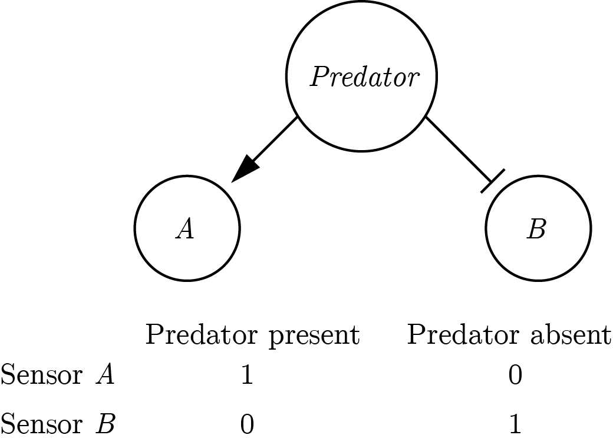
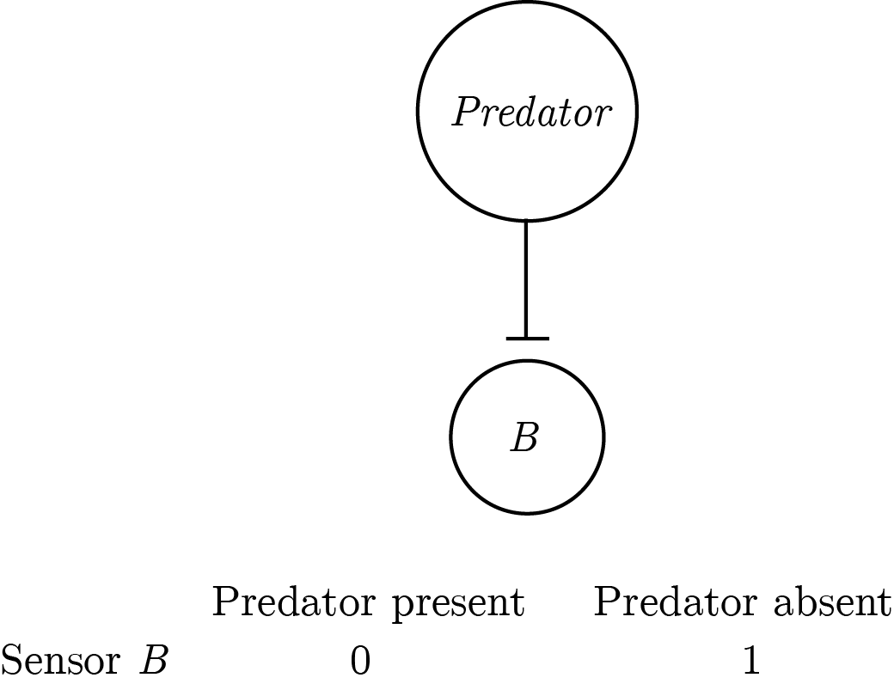
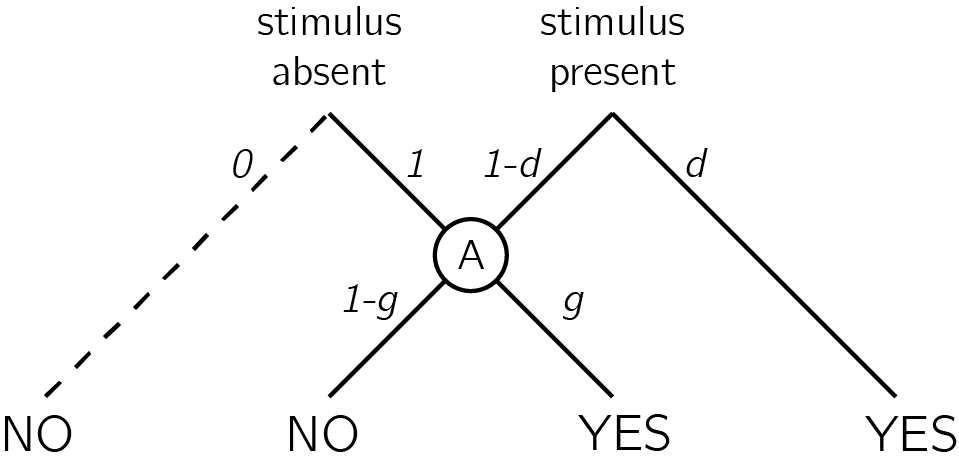
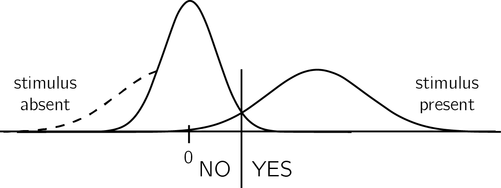
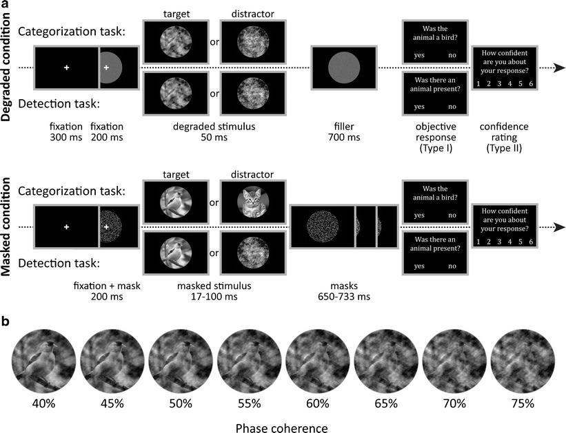
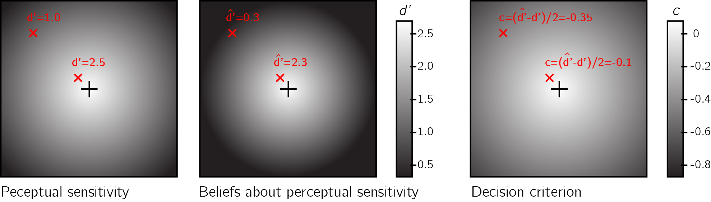
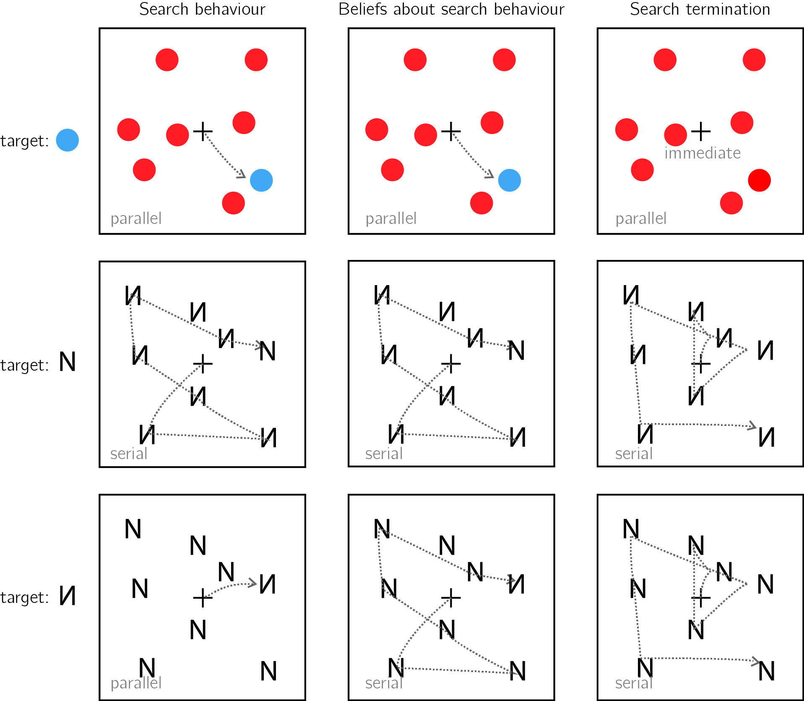

<!--
Above is the YAML (YAML Ain't Markup Language) header that includes a lot of 
metadata used to produce the document.  Be careful with spacing in this header!

If you'd prefer to not include a Dedication, for example, simply delete the section entirely, or silence them (add # before each line). 

If you have other LaTeX packages you would like to include, delete the # before header-includes and list the packages after hyphens on new lines.

If you'd like to include a comment that won't be produced in your resulting file enclose it in a block like this.

If you receive a duplicate label error after knitting, make sure to delete the index.Rmd file and then knit again.
-->


```{r include_packages, include=FALSE}
# This chunk ensures that the thesisdown package is
# installed and loaded. This thesisdown package includes
# the template files for the thesis.
if (!require(remotes)) {
  if (params$`Install needed packages for {thesisdown}`) {
    install.packages("remotes", repos = "https://cran.rstudio.com")
  } else {
    stop(
      paste('You need to run install.packages("remotes")",
            "first in the Console.')
    )
  }
}
if (!require(thesisdown)) {
  if (params$`Install needed packages for {thesisdown}`) {
    remotes::install_github("ismayc/thesisdown")
  } else {
    stop(
      paste(
        "You need to run",
        'remotes::install_github("ismayc/thesisdown")',
        "first in the Console."
      )
    )
  }
}
library(thesisdown)
# Set how wide the R output will go
options(width = 70)

knitr::opts_chunk$set(message = FALSE)
knitr::opts_chunk$set(warning = FALSE)

```

<!--
The acknowledgements, preface, dedication, and abstract are added into the PDF
version automatically by inputting them in the YAML at the top of this file.
Alternatively, you can put that content in files like 00--prelim.Rmd and
00-abstract.Rmd like done below.
-->


```{r eval=!knitr::is_latex_output(), child=here::here("prelims", "00--prelim.Rmd")}

```

```{r eval=!knitr::is_latex_output(), child=here::here("prelims", "00-abstract.Rmd")}

```

<!-- The {.unnumbered} option here means that the introduction will be 
"Chapter 0." You can also use {-} for no numbers on chapters.
-->

# Introduction {.unnumbered}


You are in the grocery shop. On your grocery list are one carton of oat milk and one guava. You search through the shelves and find your favourite oat milk. You place the carton in your basket and move on to the fruit aisle. You visually scan the fruit boxes, but you already have a strong feeling that you will not find guavas in this store. You would have already smelled the guavas if they were anywhere around you. But then again, maybe something is wrong with your sense of smell? You grab a mandarin and sniff it. Your sense of smell is intact. You can be confident that there are no guavas around. 

```{r intro-guava, echo=FALSE, fig.pos='!h', out.width="\\textwidth",fig.scap="Guavas", fig.cap="Guavas."}

```

## Inference about absence

Finding the oat milk carton was straightforward. As soon as you identified it you were convinced in its presence, no reflection or deliberation required. In contrast, concluding that no guavas were present took you longer and involved more complex cognitive processes. You had to rely on the absence of smell or sight of the fruit to reach a conclusion. In philosophical writings, this is known as Argument from Ignorance (*Argumentum ad ignorantiam*): the fallacy of accepting a statement as true only because it hasn't been disproved [@locke1836essay]. Although logically unsound, *Argumentum ad ignorantiam* is widely applied by humans in different situations and contexts [@Oaksford2004]. One particular context which invites such reasoning is that of inference about absence. Positive evidence is rarely available to support inference about absence, and so it is almost exclusively made on the basis of a failure to find evidence for presence. 

Basing inference on the absence of evidence can sometimes be rational from a Bayesian standpoint [@Oaksford2004]. For this to be the case, the individual must know the sensitivity and specificity of the perceptual or cognitive system at hand. For example, in order for the inference "I don't smell a guava, therefore there are no guavas in this store" to be logically sound, I need to know that the probability of me not smelling a guava is very low if it is nearby, and so is the probability of me imagining the smell of a guava when it is not there. In other words, in order to make valid inferences about absences I need to know things about myself and my cognitive processes (see next section \@ref(detectionmodels) for a formal unpacking of this logical derivation). In the above example, this is evident in that my certainty in the absence of a guava increased after smelling the mandarin. Critically, smelling the mandarin did not provide me with any additional information about the layout of the shop or the seasonal availability of tropical fruit, but about my own perceptual system.

<!-- This example of inference about absence is exceptional in that I am able to justify my reasoning. If later my friend asks me why I concluded that no guavas were in the store, I will be able to convince them by explaining how I normally smell guavas from a distance, how I was able to smell the mandarin, and how I concluded that I would have detected a guava if it was present. But explicitly representing a derivation chain from assumptions to conclusions is the exception, not the rule. I can tell with confidence that there is no cup of water on my desk right now. If my friend asks me how I concluded that there was no cup of water on my desk, I would probably answer that I could see that it was not there. But this does not mean that I perceived its absence. It means that I did not perceive its presence, and that I would see if it was there. The first part is a fact about my perception, but the second part is based on intricate knowledge that details how hypothetical glasses of water may look like to me if they were on my desk right now. This builds on my knowledge of glasses, but more relevant to us here, on a *mental self-model*: a simplified description of one's own cognition, perception and attention that allows agents to predict their mental states under different world states.  -->

<!-- Here I argue that this necessary role of a mental self-model for inference about absence makes inference about absence a promising tool to probe people's self-knowledge. Beliefs about my sense of smell, or the expected appearance of cups of water, are only part of a rich and complex knowledge structure, comprising beliefs about the senses (for example, the belief that my hearing is better in the right ear), attention (that I'm easily distracted by noises), and cognition (that I have bad memory for faces). Indeed, mental self-models have been suggested to play an important role in attention control [@wilterson2020attention], theory of mind [@graziano2019attributing], and subjectivity more generally [@metzinger2003phenomenal]. While I can report some of those beliefs, some are not available to report, potentially not even to introspection [@flavell1979metacognition]. This cognitive impenetrability is not different from how grammar rules are represented in cognition. Native English speakers would agree that the question "Who did you see Mary with?" is grammatically acceptable and that the question "Who did you see Mary and?" is not [@ross1967constraints], but most would not be able to tell what rule is violated by the second question. Similarly, one may immediately appreciate that an object is missing, even if they will not be able to provide a better justification for this impression other than "I could see that it was not there".  -->

The following section introduces a computational formulation of this self-knowledge account, based in formal semantics and Bayesian theories of cognition, and exemplifies how different patterns of results can be interpreted in light of this formulation. This formulation is then followed by descriptions of several independent lines of experimental findings that all demonstrate a role for self-knowledge in inference about absence. 

## Probabilistic reasoning, criterion setting, and self knowledge {#formalabsence}

The intimate link between inference about absence and self-knowledge has been recognized in the fields of linguistics, formal logic, and artificial intelligence. In *default-reasoning logic* [@reiter1980logic], a failure to provide a proof for a statement is transformed into a proof for the negation of the statement using the *closed world assumption*: the assumption that a proof would have been found if it was available. Similarly, Linguist Benoît de Cornulier's refers to *epistemic closure*: the notion that all there is to be known is in fact known. This is reflected in his two definitions of *knowing whether* [@de1988knowing]:

### Symmetrical definition: {-} 
'John knows whether P' means that:

1. If P, John knows that P.
2. If not-P, John knows that not-P.

### Dissymmetrical definition:{-}
'John knows whether P' means that:

1. If P, John knows that P.
2. John knows that 1 holds.

### Second-order cognition {#intro-2nd-order}

The symmetric definition entails a *first-order process*, as no knowledge about the system itself is used in the process of inferring the world state. This definition applies to scenarios in which it is possible to have direct evidence against the veracity of a proposition. For example, a hypothetical organism can be equipped with sensors $A$ and $B$ that are tuned to the presence or absence of a predator, respectively. This organism can be said to know whether there is a predator around or not. It will know that a predator is nearby if $A$ is on and $B$ is off, and it will know there is no predator around if $B$ is on and $A$ is off (similar to the *Neuron-Antineuron* architecture in @gold2001neural). Such an organism can be said to implement the symmetrical definition of to know whether presented above.

```{r intro-symmetric, echo=FALSE,out.width="50%",fig.scap="A symmetric implementation of a predator-detector.", fig.cap="A symmetric implementation of a predator-detector."}

```

The symmetric architecture is redundant: assuming perfect information flow there is a perfect negative correlation between the activations of sensors $A$ and $B$. Conversely, the asymmetric definition only necessitates one sensor that is sensitive to the presence of a predator. The organism will know that the predator is around if the sensor is activated, and will conclude that it is not around if the sensor is not activated. This inference is dependent on the confidence of the organism that the sensor will always be activated by the presence of a predator (the negative test validity of its sensor, see section \@ref(detectionmodels)). In that sense, the asymmetric definition entails a *second-order process*.

```{r intro-asymmetric, echo=FALSE,out.width="50%",fig.scap="An asymmetric implementation of a predator-detector.", fig.cap="An asymmetric implementation of a predator-detector."}
knitr::include_graphics("figure/intro/asymmetric.png")
```

This implementation assumes that the absence of a predator is a *default state*. Making this assumption makes the system leaner: instead of having two sensors, only one sensor is needed to mark deviations from a default state [@reiter1980logic]. This default-reasoning has an interesting property: it is *non-monotonous*. Accepting the default state (the absence of a predator in the above example) can only be done tentatively and can potentially be overridden by future evidence. This is not true for the deviant state (here, the presence of a predator), which once accepted cannot be retracted based on the absence of new evidence. In other words, while beliefs about the absence of a predator can be overturn by evidence for presence, beliefs about the presence of a predator cannot be overturn by the absence of evidence for presence. 

The asymmetric architecture requires that the organism knows that the presence of a predator would activate sensor $A$. Only then can the organism take the absence of input from $A$ as evidence for the absence of a predator. Without this knowledge, the organism will be able to represent the presence of a predator (when $A$ is activated), but not its absence. Indeed, it has been pointed out that Reiter's Default Logic is an *autoepistemic logic*, which is based on an agent's ability to introspect over their own belief states [@denecker2011reiter].

The mirror architecture is also possible: taking the presence of a predator to be a default state and using a sensor to mark deviations from this state, i.e., the absence of a predator.

```{r intro-pessimistic, echo=FALSE,out.width="50%",fig.cap="An asymmetric implementation of a predator-detector with a pessimistic prior."}

```

This architecture is perfectly equivalent to the previous one for systems that are composed of sensors only. All activated sensors in the first architecture are silenced in the second architecture and vice versa. However, for multi-layered systems that generate higher-level representations from sensory input, the second architecture becomes unreasonably huge. In such systems, if the default state is taken to be "everything is happening", then for every sensory input the system should generate the abstract representation of all possible *combinations* of sensory inputs that were not experienced --- $2^n-1$ in total, $n$ being the number of sensors. This number becomes unrealistic even with a modest number of 100 sensors ($2^{99}$, or more than a million million million million millions), and is even less realistic for complex systems that are equipped with eyes, thalami and cortices. 

This has dramatic consequences for systems that need to flexibly represent a rich space of entities or events, using a set of finite building blocks such as sensors and atomic concepts. Such hierarchical, complex systems are compelled to implement an architecture analog to the one in figure \@ref(fig:intro-pessimistic), namely to represent presences only, and infer absence by relying on their own self-representation. In other words, the maintenance of a reliable self-representation can be costly, but not nearly as costly as the alternative of representing absences and presences in a symmetrical way.

### Computational models of detection {#detectionmodels}

<!-- The symmetrical definition is available for statements that can be supported or negated by evidence. For example, the statement "It is not yet 3pm" can be supported if the time on one's phone indicates that it is 2:30pm, or negated if the time on one's phone indicates it is 3:30pm. Therefore, knowing whether it is now 3pm does not rely on self-knowledge. Conversely, statements such as "I have met this person before" can only be supported by positive evidence. This leaves inference about their negation to be made based on the absence of evidence, in conjunction with self-knowledge ("I don't recall seeing this person before, and this is not a face that I would forget"). This is an example of the De Cornulier's dissymmetrical definition: knowing that I would not have forgotten this person's face is in this case 'knowing that 1 holds'.  -->

In psychological experiments of near-threshold detection, participants are required to decide whether a stimulus (for example a faint dot) was present or absent from a display. Using De Cornulier's formulation, we can ask which of the two definitions better describes the inferential machinery that is engaged in detection tasks. Is it the case that participants perceive positive evidence for the absence of a target (symmetrical definition), or alternatively, do they rely on the metacognitive belief that they would have seen the target if it was present (dissymetrical definition)? 

### The High-Threshold model {#htm -}

The *high-threshold model* of visual detection [@blackwell1952studies] formalizes this process in a way that shares conceptual similarity with De Cornulier's dissymemetrical definition. According to this model, the probability of detecting the signal $d$ scales with stimulus intensity. If participants detect the signal, they respond with 'yes'. The parameter $d$ is a perceptual parameter: it captures variables such as objective stimulus intensity (for example, in units of luminance) and sensory sensitivity (for example, of photoreceptors in the retina, or neurons in the visual cortex). The value of this parameter corresponds to the degree to which statement 1 in the dissymetrical definition is true: "If P [a stimulus is presented] John knows that P", or to the reliability of the excitatory edge feeding into sensor *B* in figure \@ref(fig:intro-asymmetric). Critically, in the high-threshold model no similar parameter exists to control the probability of detecting the absence of a signal. In other words, the presence/absence asymmetry is expressed in the absence of a direct edge from 'stimulus absent' to a 'no' response (leftmost dashed line in Fig. \@ref(fig:intro-htm)). In this model, 'no' responses are controlled by the 'guessing' parameter $g$. Unlike $d$, the $g$ parameter is under participants' cognitive control, and can be optimally set to maximize accuracy based on beliefs about the probability of a stimulus, the incentive structure, and critically, metacognitive beliefs about the perceptual sensitivity parameter $d$. 

(ref:HTMcaption) In discrete high-threshold models the presence of a signal can sometimes lead directly to a 'yes' response, but the absence of a signal is never sufficient to lead to a 'no' response. Agents enter node *A* when a stimulus is not detected. 'No' responses are then controlled by the parameter *g* - a 'guessing parameter' that determines the probability of responding 'yes' in case no stimulus was detected. 

```{r intro-htm, echo=FALSE, fig.scap = "The high threshold model", fig.cap='(ref:HTMcaption)', out.width = '70%'}

```

Given accurate knowledge about the parameter $d$ and the prior probability of signal presence, observers can use *Bayes' rule* to extract the *negative test validity* [@Oaksford2004]: the probability that a signal is absent, given that the they did not perceive a signal. Formally, this equals $p(\neg T|\neg e)$, where $T$ stands for my theory (here, a signal is present) and $e$ for the availability of evidence (here, I can see the signal). Using Bayes' rule, this quantity is determined by the system's *correct rejection rate* ($p(\neg e|\neg T)$), *hit rate* ($p(e|T)$), and the prior probability of $T$. In the high threshold model, the correct rejection rate is always 1 (the threshold is never exceeded by noise alone), so the negative test validity equals:

\begin{equation}
p(\neg T|\neg e)=\frac{\overbrace{p(\neg e|\neg T))}^{CR}(1-p(T))}{1-p(e)} = \frac{1-p(T)}{1-p(e)}
\end{equation}
where 
\begin{equation}
p(e)=\overbrace{p(e|\neg T)}^{FA}(1-p(T))+\overbrace{p(e|T)}^{Hit}p(T) = \overbrace{p(e|T)}^{Hit}p(T)
\end{equation}

Subjects can then use the negative test validity to inform their setting of the $g$ parameter. For example, consider a setting where you know that a target will appear on exactly half of the trials ($p(T)=0.5$), and that half of the targets will be detected ($p(e|T)=0.5$). Using the above formula, and given that in the high-threshold model $p(e|\neg T)=0$, you can conclude that  $p(\neg T|\neg e)=\frac{1-0.5}{1-0.5*0.5}=\frac{2}{3}$. In other words, given that a target was not detected, it is twice as likely that no target was present than that a target was present. This information can now be used to inform your setting of the $g$ parameter before the next experimental trial.

### Signal Detection Theory {#sdt -}

Given its simplicity, the high-threshold model is useful for demonstrating the utility of self-knowledge for inference about absence. Without veridical knowledge about the sensitivity parameter $d$, subjects cannot tell whether they can rely on the absence of evidence when making inference about the absence of a stimulus. Continuous and graded models of perception based on Signal Detection Theory (SDT) express the same asymmetrical nature of presence/absence judgments, where clear evidence can be available for presence but less so for absence (see appendix \@ref(app1:SDT) for an overview of Signal Detection Theory). In signal detection terms, this is expressed as high between-trial variance in sensory strength when a signal is present, but low variance when a signal is absent (see Fig. \@ref(fig:intro-sdt)). Here, instead of controlling the parameter $g$, participants control the placement of a decision criterion. Only trials in which the sensory signal (also termed perceptual evidence, or decision variable) exceeds this criterion will be classified as 'stimulus present' trials. Optimal positioning of the criterion is dependent on beliefs about the likelihood of a stimulus to be present, as well as the spread of the signal and noise distributions and the distance between them [the stimulus-conditional *Probability Density Functions*; @gold2001neural]. Due to the unequal-variance structure, sensory strength in trials where a stimulus is present will be on average farther from the decision criterion compared to when no stimulus is present. As a result, similar to the setting of the $g$ parameter in the high-threshold model, the exact placement of the SDT decision criterion will affect accuracy more when a stimulus is absent, compared to when a stimulus is present. 

Common to both frameworks is the reliance on knowledge about one's own perception (the $d$ parameter in the first case, the shape and position of the sensory distributions in the second) for optimally setting a heuristic for response on trials in which no clear evidence is available for the presence of a signal. As a result, these models draw a strong link between participants' beliefs about their own perception and their behaviour on target-absent trials. In what follows I provide empirical examples for how humans make inference about the absence of objects and memories, and link those examples to the core idea, that inference about absence critically relies on access to a self-model. 

```{r intro-sdt, echo=FALSE, fig.scap="The unequal variance Signal Detection model",fig.cap="In unequal-variance SDT models, decisions are made based on the relative position of the sensory sample to a decision  criterion. The presense/absence asymmetry manifests in the fact that only in some 'target-present' trials, but not in 'target-absent' trials, the sensory sample falls far away from the decision criterion. The dashed line represents the missing tail of the noise distribution: without it, definite evidence is sometimes available for presence, but never for absence.", out.width = '70%'}

```

## Detection: "I would have noticed it"

We start our exploration of inference about absence in cognition with perhaps the most basic of psychophysical tasks - visual detection. In visual detection, participants report the presence or absence of a target stimulus, commonly presented near perceptual threshold. In such tasks, accuracy alone cannot reveal a difference in processing between decisions about presence and decisions about absence, because task accuracy is a function of both 'yes' and 'no' responses. 

However, when asked to report how confident they are in their decision, subjective confidence reports reveal a metacognitive asymmetry between judgments about presence and absence. Decisions about target absence are accompanied by lower confidence, even for correctly rejected 'stimulus absence' trials [@meuwese2014subjective; @kanai2010subjective; @mazor2020distinct]. Put differently, often participants cannot tell if they missed an existing target, or correctly perceived the absence of a target. 

For example, in a study by @meuwese2014subjective, participants were asked to rate their confidence after performing either a perceptual detection task ("Was there an animal present?") or a categorization task ("Was the animal a bird?"). Stimuli were identical for the two conditions, apart from phase-scrambled ‘noise’ images that were only shown on detection blocks. Metacognitive sensitivity was quantified as the area under the response-conditional type-II receiver-operating characteristic curve (AUROC2; see Appendix \@ref(app1:mc)). This measure reflects the agreement between confidence ratings and objective accuracy. AUROC2 was higher for the categorization than for the detection task even when performance on the primary tasks was equated. This difference originated from degraded metacognitive ability for trials in which the subjects reported not detecting an animal. More specifically, it was driven by lower confidence ratings for correct rejection trials rather than high confidence ratings for misses. 

<!-- These fits well with the high-threshold and unequal-variance SDT models described above. Confidence ratings in detection on perceptually degraded stimuli are well captured by an unequal-variance SDT model [@kellij2018foundations]. Importantly for our point here, an unequal-variance setting (whether produced by physiological constraints on neuronal firing rates, or by physical properties of the stimuli themselves) limits the availability of evidence for absence, making inference about absence more challenging. Only in the presence of a target stimulus can participants make a decision without deliberation (without passing in the *A* node in the high-threshold model, or based on a sample very far from the decision criterion in unequal-variance SDT). On these trials, participants can be highly confident in that a target was present -- more confident than when deciding that a target was present after deliberation. These high-confidence trials will not be available for decisions about target-absence. -->

```{r intro-meuwese, echo=FALSE, fig.cap="Task design for Meuwese et al (2014). Subjects performed both the detection task and the categorization task in 12 interleaved blocks of 60 trials. Stimulus visibility was manipulated between subjects, by either pattern masking or degrading (phase scrambling). During the detection task, the degraded or masked stimulus contained either an animal (cat, bird, or fish; target) or a fully phase-scrambled image (distractor). On every trial, subjects were asked “Was there an animal present?” For the categorization task, a target category was randomly selected for each block (i.e., “bird”), and the stimuli consisted of a degraded/masked cat, bird, or fish. Subjects were asked whether the animal was a member of the target category (i.e., “Was the animal a bird?”). Subjects rated their confidence in the correctness of their response on a scale from 1 (not at all confident) to 6 (very confident). By linking confidence ratings with objective performance, metacognitive ability (MA) was calculated. b An image that is phase scrambled to different coherence levels: from left to right, 0.4 to 0.75  phase coherence, which was the range of phase coherence levels and step sizes used in degraded condition of the experiment.", fig.scap="Task design for Meuwese et al (2014).", out.width = '70%'}
#
```

These and similar observations of a metacognitive disadvantage for inference about absence [@meuwese2014subjective; @kanai2010subjective; @mazor2020distinct; @kellij2018foundations], as well as a similar pattern in response times [decisions about absence tend to be slower than decisions about presence; @mazor2020distinct] fit well with the high-threshold and unequal-variance SDT models described above. Only in a subset of target-present trials, but in no target-absent trial, can participants make a decision without deliberation (without passing in the *A* node in the high-threshold model, or based on a sample very far from the decision criterion in unequal-variance SDT). On these trials, participants can be highly confident in that a target was present -- more confident than when deciding that a target was present after deliberation. These high-confidence trials will only be available when a target is indeed present, giving rise to a metacognitive disadvantage for inference about absence. 
 
In line with a central role for self-monitoring in inference about absence, the lower metacognitive sensitivity for 'stimulus absence' judgments diminishes or reverses when targets are masked from awareness by means of an attentional manipulation [@kanai2010subjective; @kellij2018foundations]. For example, when an attentional-blink paradigm is used to control stimulus visibility, participants are significantly more confident in their correct rejection trials than in their misses. What is it in attentional manipulations that improves participants' metacognitive insight into their judgments about stimulus absence? One compelling possibility is that a blockage of sensory information at the perceptual stage is not accessible to awareness [and is thus phenomenally transparent; @metzinger2003phenomenal], whereas fluctuations in attention are accessible to introspection [and are thus phenomenally opaque; @limanowski2018seeing]. This monitoring of one's attention state makes it possible to use premises such as "I would not have missed the target" in rating confidence in absence under attentional, but not under perceptual manipulations of visibility. Put in more formal terms, attentional manipulations increase metacognitive access to the likelihood function going from world-states to perceptual states, thereby allowing trial-to-trial tuning of the decision criterion or the *g* parameter. 

Studies contrasting detection responses and confidence ratings under different levels of attention provide more support for this metacognitive account of detection 'no' responses. For example, participants are more likely to report the absence of a target in a specific location if their attention was directed to this location before stimulus onset, compared to when their attention was directed to a different location [@rahnev2011attention]. Similarly, participants are more likely to correctly report the absence of a target embedded in a stimulus (for example, a grating embedded in noise) when the stimulus is presented at the center of their visual field, compared to the periphery [@odegaard2018inflation; @solovey2015decisional]. Note that both effects are the exact opposite of what is expected based on that attention boosts sensory gain [@parr2019attention], because an increase in sensory gain without a change to the decision criterion would make false alarms, not correct rejections, more prevalent. They are however consistent with the idea that participants deploy a metacognitive strategy, shifting their decision criterion to accord with the expected strength of evidence given their current attentional state. If participants overestimate the effect of attention on their visual sensitivity, decision criterion, as measured in Signal Detection Theory, will be higher for attended versus unattended stimuli (see Fig. \@ref(fig:intro-detection)). Indeed, detection criterion is typically found to be lower for unattended stimuli [@odegaard2018inflation; @solovey2015decisional; @rahnev2011attention].

```{r intro-detection, echo=FALSE, fig.scap="The effect of erroneous beliefs about perceptual sensitivity on decision criterion", fig.cap="Left panel: Sensitivity to near-threshold stimuli is lower in the visual periphery. For example, d' equals 1.0 in top left of the screen, but is much higher near the center. Right panel: the perceptual decision criterion is lower (more 'yes' responses) in the visual periphery.  Middle panel: if the effect of eccentricity on visual sensitivity is overestimated in participants' mental self-model (here d' in the top left corner is estimated to be 0.3), a lowering of the decision criterion in the visual periphery as observed in Odegaard et al. (2018) is expected.", out.width = '100%'}

```

## Visual search: "I would have found it" {#intro:search}

In visual search tasks, participants are presented with an array of stimuli and are asked to report, as quickly and accurately as possible, whether a target stimulus was present or absent in the array. Moving one step up the complexity ladder, the accumulation of information in visual search is not only a function of stimulus strength and sensory precision, but is also affected by the endogenous allocation of attention to items in an observed scene. As a result, search time varies as a function of the number of distractors, their perceptual similarity to the target and their spatial arrangement, among other factors [for a review, see @wolfe2008visual]. These factors affect not only the time taken to report the presence of a target, but also the time taken to report its absence. For example, when searching for an orange target among red and green distractors, the number of distractors has virtually no effect on search time [e.g., @d1991color] - a phenomenon known as 'pop-out'. The bottom-up pop-out of a target can explain the immediate recognition of the presence of a target, irrespective of distractor set size. But this perceptual pop-out cannot, by itself, explain the immediate recognition of target absence, because in target absence trials there is nothing in the display to pop out. 

Computational models of visual search provide different accounts for search termination in target-absent trials. In *Feature Integration Theory*, visual search comprises a pre-attentive, automatic process, and a later stage that is under participants' cognitive control. According to this model, difficult searches for a conjunction of features (*conjunction searches*, for example, searching for a purple *7* among orange and purple digits) terminate with a 'no' response once participants finished scanning all the items in the display [a *self-terminating exhaustive search*; @treisman1980feature]. However, this model predicts that search-time variability in such conjunction target-absent trials should be lower than in conjunction target-present trials - a pattern that is not observed in empirical data [@wolfe2010reaction; @moran2016serial]. Furthermore, Feature Integration Theory does not provide an explicit account of target-absent responses in highly efficient parallel searches.


```{r intro-termination-models, echo=FALSE, out.width="100%", fig.scap = 'Models of search termination', fig.cap="Models of search termination. For the same visual array (left panel) search terminated immediately for one target (a green 7, lower row), but takes longer for another target (a purple 7, upper row). Different models of visual search explain this difference by postulating search termination mechanisms that are sensitive to the counterfactual difficulty of finding a hypothetical target."}
knitr::include_graphics(path = "figure/intro/termination_models_wide.png")
```


In early versions of the *Guided Search* model, 'target absent' judgments are the result of exhausting the search only on items that surpass a learned 'activation threshold' [@chun1996just; @wolfe1994guided]. In difficult searches, the activation threshold is set to a low value, thereby requiring the scanning of multiple items before a 'no' response can be delivered. In contrast, in easy searches the activation threshold is set to a high value, reflecting a belief that a target would be highly salient (see Fig. \@ref(fig:intro-termination-models)). Furthermore, some very long searches are terminated once subjects concluded that "it rarely takes this long to find a target" [@wolfe1994guided].

A more recent version of the Guided Search model (*Competitive Guided Search*) described visual search as a stochastic process where items are selected for inspection based on their dynamic weight in a salience map. Critically, this model also included a *quitting unit* that is selected with a certain probability [@moran2013competitive]. The search terminates once an item is recognized as the target, or once the quitting unit is selected. In this model, the salience of the quitting unit changes following the rejection of distractors. This incremental change is controlled by a parameter ($\Delta w_{quit}$) that is "under strategic control of the observer". For difficult searches, this parameter can be set to a low value, so that more items can be scanned before search termination. In very easy 'pop-out' searches this parameter can be set to a high value, making it possible to terminate a search after rejecting only one item.   

In the latest formulation of the Guided Search model [@wolfe2021guided], searches are terminated once a noisy accumulator reaches a *quitting threshold*. Setting the quitting threshold high allows participants to scan more items before concluding that a target is absent. The mechanism by which participants calibrate the quitting threshold is not specified in the model. 

Finally, in a fixation-based model of visual search, the number of items that are concurrently scanned within a single fixation (the *functional visual field*) is dependent on search difficulty: with more items for easy searches and less items for more difficult ones [@hulleman2017impending].  

Importantly for our point here, the activation threshold, $\Delta w_{quit}$, the quitting threshold and the functional visual field all share high similarity with the SDT criterion or the high-threshold *g* parameter, and are influenced by explicit or implicit beliefs about the subjective salience of a hypothetical target in the array -- a form of self-knowledge. 

<!-- @moran2013competitive proposed a Competitive Guided Search model, according to which 'target absent' responses are the result of selecting a 'quit unit' with probability that inversely scales with the salience of items in the display. In this model too, bottom-up activation is not sufficient to explain the lack of a distractor set-size effect on 'no' responses in feature search. The authors note that this effect may be driven by participants' expectation that in feature search, it is unlikely that attention will be drawn to a distractor when a target exists. Again, this is a form of self-knowledge, and more specifically beliefs and predictions about attention and search difficulty.  -->

Usually, search times in target-present and target-absent trials are highly correlated, such that if participants take longer to find the target in a given display, they will also take longer to conclude that it is absent from it [@wolfe1998can]. This alignment speaks to the accuracy of the mental self-model: participants take longer to conclude that a target is missing when they believe they would take longer to find the target, and these beliefs about hypothetical search times are generally accurate. In the two upper panels of Fig. \@ref(fig:intro-search) I provide two examples of cases where beliefs about search behaviour perfectly align with actual serach behaviour, leading to optimal search termination. 

However, self-knowledge about attention in visual search is not always accurate. For example, when searching for an unfamiliar letter (for example, an inverted N) among familiar letters (for example, Ns), the unfamiliar letter draws immediate attention without a need for serially attending to each item in the display. However, participants are slow in concluding that no unfamiliar letter is present, exhibiting a search time pattern consistent with a serial search for 'target absent' responses only [@wang1994familiarity; @zhang2020visual]. In the context of my proposal here, this can be an indication for a blind-spot of the mental self-model, failing to represent the fact that an unfamiliar letter would stand out (see Fig. \@ref(fig:intro-search), lower panel). 

<!-- Importantly, collecting explicit metacognitive judgments of expected search times may lead to underestimating the richness and accuracy of the mental self-model. For example, participants may not have introspective access to their knowledge about color pop-out, but may still be able to act on this information when deciding to terminating their search. Here also, inference about absence provides a unique window into the mental self-model that does not depend on introspective access. -->

```{r intro-search, echo=FALSE, fig.scap ="Computational models of visual search", fig.cap="Upper panel: A target that is marked by a unique colour imemdiately captures attention (left). This fact is available to participants' self-model (middle). As a result, participants can immediately terminate a search when no distractor shares the color of the target (right). Middle panel: When searching for the letter N among inverted Ns, the target does not immediately capture attention, and the serial deployment of attention is necessary (left). Participants are aware of this (middle). As a result, participants perform an exhaustive serial search before concluding that a target is absent (right). Lower panel: When searching for an inverted N among canonically presented Ns, the inverted letter immediately captures attention (left). This fact is not specified in the self-model (middle). As a result, participants perform an unncessary exhaustive serial search before concluding that a target is absent (right).", out.width = '70%'}

```

## Memory: "I would have remembered it"

Inference about absence not only applies to external objects (such as guavas, or visual items on the screen), but also to mental variables such as memories and thoughts. For example, upon being introduced to a new colleague, one can be certain that they have not met this person before. In the memory literature, this is known as *Negative recognition*: remembering that something did not happen [@brown1977memorability]. In the lab, a typical recognition memory experiment comprises a learning phase and a test phase. In the learning phase participants are presented with a list of items, and in the test phase they are asked to classify different items as 'old' (presented in the learning phase) or 'new' (not presented in the learning phase). 

Recognition memory is often modeled using threshold or signal detection models (see section \@ref(htm)), or a combination of the two [*Dual Process models*; @wixted2007dual; @yonelinas1996signal]. For example, in SDT models [@banks1970signal], participants compare a 'memory trace' against an internal criterion to determine whether the item should be classified as old or new. Like perceptual detection, the placement of the decision threshold reflects beliefs about the expected signal for old and new items. If participants believe that learned items would produce very salient memory traces, they can safely increase the decision criterion without risking mistaking old items for being new. 

The role of self-knowledge in negative recognition is exemplified in the *mirror effect*: items that are more likely to be correctly endorsed as 'old' are also more likely to be correctly rejected as 'new'. In SDT terms, this effect can be described as the adjustment of the decision criterion to the expected memory trace of an item, had it been present [its *memorability*; @brown1977memorability]. For example, @brown1977memorability found that when asked to memorize a list of names, subjects are more confident in remembering that their own name was on the list, but also in correctly remembering when it was *not* on the list. For this effect to manifest, it is not sufficient that subjects' memory was better for their own name. They also had to know this fact, and to use it in their counterfactual thinking ("I would remember if my name were on the list"). 

The mirror effect has also been demonstrated for the name of one's hometown [@brown1977memorability], for word frequency [rare words are more likely to be correctly endorsed or rejected with confidence; @brown1977memorability; @glanzer1976analysis], word imaginability [@cortese2010recognition; @cortese2015mega] and for study time [subjects are more likely to correctly classify new items as new if learned items are presented for longer; @stretch1998difference; @starns2012strength]. 

In a clever set of experiments, @strack2005know established a causal link from metacognitive beliefs about item memorability and decisions about the absence of memories. In two experiments, participants in one group were led to believe that high-frequency words (words that are used relatively often) are more memorable than low-frequency words, while participants in a second group were led to believe that low-frequency words were more memorable than high-frequency words. This manipulation affected participants' tendency to reject high-frequency or low-frequency items in a later recognition-memory task. Participants who believed that high-frequency words were more memorable were more likely to classify high-frequency words as 'new', suggesting that their metacognitive belief informed their inference about the absence of a memory ('I would have remembered this word'). Inversely, participants who believed that low frequency words were more memorable showed the opposite pattern. 

One formal description of this inferential process is provided by the *likelihood ratio* rule. According to this model, subjects compare the likelihood of incoming evidence under two competing models of the world - the presence or absence of a memory trace, and choose the model under which the incoming evidence is more likely. In order to be able to compare the likelihood of an observation under alternative models, subjects must have a model of their cognition that is sufficiently detailed to yield conditional probability distributions. In experiments where the probabilities of an item to be old or new is equal, the likelihood ratio strategy is optimal [@neyman1933ix]. As a cartoon example, a participant may expect the perceived memory trace for frequent words to be centered around 0.3, and around 0.6 for infrequent words. Using the likelihood ratio rule, this participant will be more confident in that a word is new if the observed memory is 0 and the word is infrequent, compared to when the word is frequent. The likelihood ratio approach has been successful in explaining several features of recognition memory, including the mirror effect in negative recognition [@glanzer1993regularities; @glanzer2009likelihood].

Just like in the cases of near-threshold detection and visual search, the intuitive metacognitive knowledge behind the mirror effect may not be available for explicit report, at least not in the absence of direct experience with the task itself. In their explicit memorability reports, subjects often have little to no declarative metacognitive knowledge of which items are more likely to be remembered, even under conditions that give rise to a mirror effect. For example, although more frequent words are more likely to be forgotten (and incorrectly classified as old), participants tended to judge them as more memorable than infrequent words [@benjamin2003predicting; @begg1989memory; @wixted1992subjective; @greene1994mirror]. However, participants showed metacognitive insight into the negative effect of word frequency on memorability when memorability was rated after (and not before) negative recognition judgments [@guttentag1998memorability; @benjamin2003predicting]. Thus, the implicit metacognitive knowledge that supports accurate negative recognition may become available for explicit report only when participants introspect about their recognition attempts. 

## The development of a self-model

As exemplified above, the inferential processes that result in judgments of absence share important commonalities, regardless of whether it is the absence of an isolated target stimulus, of one target in an array of distractors, or of a non-physical entity such as a memory. First, in all three cases, to infer absence agents must possess some self-knowledge (under what conditions are they likely to miss a target, how long they should expect to search before finding a target in an array of distractors, or which items are likely or unlikely to be remembered). Second, agents must be able to use this counterfactual knowledge and compare it with their current state (for example, having no recollection of an item, or not seeing a target stimulus). 

At what developmental stage do humans master the necessary self knowledge and inferential machinery to make efficient and accurate inference about absence? In the context of memory, evidence suggests that the necessary self-knowledge and the capacity for counterfactual thinking exist in primary form already in early childhood, but continue to develop until adulthood. For example, children as young as 5 were able to give meaningful assessments the memorability of hypothetical life events and to use this metacognitive knowledge to inform their judgments about the nonoccurrence of an event, but this ability did not reach full maturation until the age of 9 [@ghetti2004if]. Other studies identified a qualitative transition between the ages 7 and 8 in the ability of children to rely on expected event memorability for inference about the absence of a memory [@ghetti2010knowing; @ghetti2008development]. This developmental discontinuity was attributed to the development of counterfactual thinking and second-order theory of mind. Indeed, the ability to infer that something did not happen based on that it would have been remembered critically relies on one's ability to ascribe mental states to their counterfactual self. 

In perception, the ability to represent absences lags behind the ability to represent presences, but reaches maturation much earlier than in the case of memory. In a study by @coldren2000asymmetries, 4 month-old infants were familiarized with a pair of identical letters (e.g., the letter 'O'), presented side by side. In the test phase, one of the letters was replaced with a novel letter, which differed from the familiar letter either in the presence or the absence of a distinctive feature. For example, when infants that were familiarized with the letter O were tested on a display of one O and one Q, the novel letter (Q) was marked by the presence of a distinctive feature. Conversely, for infants that were familiarized with the letter Q, the novel letter O was marked by the absence of a distinctive feature. Infants showed preferential looking at the novel letter only when this letter was marked by the presence, not the absence, of a distinctive feature. A similar feature-positive effect was still evident in the learning behaviour of preschool children. When presented with two similar displays, 4 and 5 year old children were able to learn to approach the display with a distinctive feature but were at chance when trained to approach a display that is marked by the absence of a distinctive feature [@sainsbury1971feature]. 

Together, these results suggest that the capacity to infer the absence of physical and mental entities and the ability to use beliefs about absence to guide learning develop through infancy and early childhood. In the context of this thesis, the development of this capacity may reflect, at least in part, the gradual expansion of different aspects a mental self-model, and the development of the capacity to use this model for counterfactual reasoning. For example, a baby that is not drawn to the new letter 'O' after being habituated to the letter 'Q' may not yet represent the absence of the distinguishing feature, because they lack the implicit self knowledge to know that they would notice the lower diagonal line if it was present. More abstractly, a 7 year-old may not be able to confidently tell that they did not spread a lotion on a chair [a highly memorable action, due to its bizarreness; @ghetti2008development], because they lack the self-knowledge to know that if they had, they would remember doing so.  

## This thesis

This thesis revolves around inference about absence in perception, and its reliance on self-modeling. First, in Chapter \@ref(ch:termination) I look at inference about absence in visual search. Like detection and memory, in visual search too inference about the absence of a target item must rely on some form of self-knowledge (see section \@ref(intro:search)). This study sought to pinpoint the origin of this knowledge. For example, is the knowledge that some visual searches are easier than others available to subjects in everyday life, or is it learned from experience in the artificial context of performing many trials of the same visual search task again and again? Due to the typical many-trials/few-subjects structure of lab-based experiments, classical visual search studies could not tell between these alternative options. By collecting data from a large number of online participants, in this first study we were able to reliably characterize participants' search termination in the first few trials of an experiment. 

In Chapter \@ref(ch:termination), Exp. 2, we found that participants gave accurate estimates of search difficulty, showing good metacognitive knowledge of key findings in the visual search literature. However, metacognitive estimates were given at the end of the experiment, allowing participants to base their estimates on their recent task experience. In Chapter \@ref(ch:MVS) I asked participants to estimate search times for new search arrays, before performing these searches. Here I found that an internal model of visual search is rich and accurate, and also that it is person-specific in that it is better aligned with subjects' own search behaviour than with the search behaviour of other participants. 

In Chapters \@ref(ch:RC) and \@ref(ch:fMRI) I looked at a different perceptual task in which participants make inference about presence and absence: near-threshold detection. Detection was compared against discrimination as a control task in which stimulus category is inferred in a symmetrical setting (for example, right versus left motion). In Chapter \@ref(ch:RC), I used reverse correlation to ask what perceptual features contribute to decision and confidence in detection and discrimination. In three experiments (one lab-based and two conducted online), I replicated the 'positive evidence bias' in discrimination confidence, and found that a similar bias exists in detection response, establishing a link between confidence in disrimination and decisions about presence and absence.

In Chapter \@ref(ch:fMRI) I used functional magnetic resonance imaging (fMRI) to compare brain activation in decisions about stimulus type, stimulus presence, and stimulus absence, as well as in confidence ratings in these decisions. I found a quadratic modulation of brain activity by confidence in prefrontal and parietal cortices. This modulation was stronger for detection judgments (decisions about stimulus presence or absence) than for discrimination judgments (decisions about stimulus type). Computational models of internal and external precision monitoring captured some, but not all aspects of the observed data.

Finally, in Chapter \@ref(ch:asymmetry) I focused on three behavioural asymmetries in detection (in confidence, response time, and metacognitive sensitivity), and asked whether similar asymmetries exist for the detection not of entire objects or stimuli, but also of stimulus parts, stimulus features, and expectation violations. The idea to look at presence and absence of sub-stimulus entities drew inspiration from reports of *visual search asymmetries*, where finding a stimulus that is marked by the presence of a feature relative to distractors is easier than finding a stimulus that is marked by the absence of a feature. Results from six pre-registered experiments indicated at least two sources of asymmetry between presence and absence, that independently contribute to differences in response time and confidence on the one hand, and in metacognitive sensitivity on the other hand.


