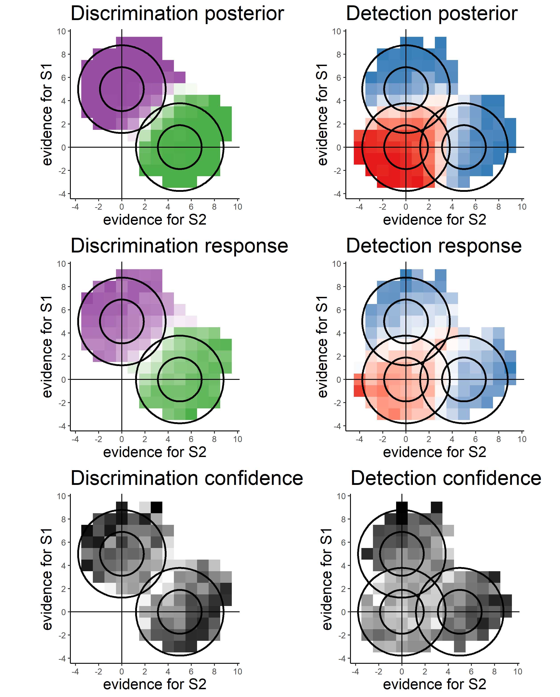

<!--
Above is the YAML (YAML Ain't Markup Language) header that includes a lot of 
metadata used to produce the document.  Be careful with spacing in this header!

If you'd prefer to not include a Dedication, for example, simply delete the section entirely, or silence them (add # before each line). 

If you have other LaTeX packages you would like to include, delete the # before header-includes and list the packages after hyphens on new lines.

If you'd like to include a comment that won't be produced in your resulting file enclose it in a block like this.

If you receive a duplicate label error after knitting, make sure to delete the index.Rmd file and then knit again.
-->


```{r include_packages, include=FALSE}
# This chunk ensures that the thesisdown package is
# installed and loaded. This thesisdown package includes
# the template files for the thesis.
if (!require(remotes)) {
  if (params$`Install needed packages for {thesisdown}`) {
    install.packages("remotes", repos = "https://cran.rstudio.com")
  } else {
    stop(
      paste('You need to run install.packages("remotes")",
            "first in the Console.')
    )
  }
}
if (!require(thesisdown)) {
  if (params$`Install needed packages for {thesisdown}`) {
    remotes::install_github("ismayc/thesisdown")
  } else {
    stop(
      paste(
        "You need to run",
        'remotes::install_github("ismayc/thesisdown")',
        "first in the Console."
      )
    )
  }
}
library(thesisdown)
# Set how wide the R output will go
options(width = 70)

knitr::opts_chunk$set(message = FALSE)
knitr::opts_chunk$set(warning = FALSE)

```

<!--
The acknowledgements, preface, dedication, and abstract are added into the PDF
version automatically by inputting them in the YAML at the top of this file.
Alternatively, you can put that content in files like 00--prelim.Rmd and
00-abstract.Rmd like done below.
-->


```{r eval=!knitr::is_latex_output(), child=here::here("prelims", "00--prelim.Rmd")}

```

```{r eval=!knitr::is_latex_output(), child=here::here("prelims", "00-abstract.Rmd")}

```

<!-- The {.unnumbered} option here means that the introduction will be 
"Chapter 0." You can also use {-} for no numbers on chapters.
-->

# Introduction {.unnumbered}


You are in the grocery shop. On your grocery list are one carton of oat milk and one guava. You search through the shelves and find your favourite oat milk. You place the carton in your basket and move on to the fruit aisle. You visually scan the fruit boxes, but you already have a strong feeling that you will not find guavas in this store. You would have already smelled the guavas if they were anywhere around you. But then again, maybe something is wrong with your sense of smell? You grab a mandarin and sniff it. Your sense of smell is intact. You can be confident that there are no guavas around. 

```{r intro-guava, echo=FALSE, fig.pos='!h', out.width="\\textwidth",fig.scap="Guavas", fig.cap="Guavas."}
knitr::include_graphics("figure/intro/guava.jpg")
```

## Inference about absence

Finding the oat milk carton was straightforward. As soon as you identified it you were convinced in its presence, no reflection or deliberation required. In contrast, concluding that no guavas were present took you longer and involved more complex cognitive processes. You had to rely on the absence of smell or sight of the fruit to reach a conclusion. In philosophical writings, this is known as Argument from Ignorance (*Argumentum ad ignorantiam*): the fallacy of accepting a statement as true only because it hasn't been disproved [@locke1836essay]. Although logically unsound, *Argumentum ad ignorantiam* is widely applied by humans in different situations and contexts [@Oaksford2004]. One particular context which invites such reasoning is that of inference about absence. Positive evidence is rarely available to support inference about absence, and so it is almost exclusively made on the basis of a failure to find evidence for presence. 

Basing inference on the absence of evidence can sometimes be rational from a Bayesian standpoint [@Oaksford2004]. For this to be the case, the individual must know the sensitivity and specificity of the perceptual or cognitive system at hand. For example, in order for the inference "I don't smell a guava, therefore there are no guavas in this store" to be logically sound, I need to know that the probability of me not smelling a guava is very low if it is nearby, and so is the probability of me imagining the smell of a guava when it is not there. In other words, in order to make valid inferences about absences I need to know things about myself and my cognitive processes (see next section \@ref(detectionmodels) for a formal unpacking of this logical derivation). In the above example, this is evident in that my certainty in the absence of a guava increased after smelling the mandarin. Critically, smelling the mandarin did not provide me with any additional information about the layout of the shop or the seasonal availability of tropical fruit, but about my own perceptual system.

<!-- This example of inference about absence is exceptional in that I am able to justify my reasoning. If later my friend asks me why I concluded that no guavas were in the store, I will be able to convince them by explaining how I normally smell guavas from a distance, how I was able to smell the mandarin, and how I concluded that I would have detected a guava if it was present. But explicitly representing a derivation chain from assumptions to conclusions is the exception, not the rule. I can tell with confidence that there is no cup of water on my desk right now. If my friend asks me how I concluded that there was no cup of water on my desk, I would probably answer that I could see that it was not there. But this does not mean that I perceived its absence. It means that I did not perceive its presence, and that I would see if it was there. The first part is a fact about my perception, but the second part is based on intricate knowledge that details how hypothetical glasses of water may look like to me if they were on my desk right now. This builds on my knowledge of glasses, but more relevant to us here, on a *mental self-model*: a simplified description of one's own cognition, perception and attention that allows agents to predict their mental states under different world states.  -->

<!-- Here I argue that this necessary role of a mental self-model for inference about absence makes inference about absence a promising tool to probe people's self-knowledge. Beliefs about my sense of smell, or the expected appearance of cups of water, are only part of a rich and complex knowledge structure, comprising beliefs about the senses (for example, the belief that my hearing is better in the right ear), attention (that I'm easily distracted by noises), and cognition (that I have bad memory for faces). Indeed, mental self-models have been suggested to play an important role in attention control [@wilterson2020attention], theory of mind [@graziano2019attributing], and subjectivity more generally [@metzinger2003phenomenal]. While I can report some of those beliefs, some are not available to report, potentially not even to introspection [@flavell1979metacognition]. This cognitive impenetrability is not different from how grammar rules are represented in cognition. Native English speakers would agree that the question "Who did you see Mary with?" is grammatically acceptable and that the question "Who did you see Mary and?" is not [@ross1967constraints], but most would not be able to tell what rule is violated by the second question. Similarly, one may immediately appreciate that an object is missing, even if they will not be able to provide a better justification for this impression other than "I could see that it was not there".  -->

The following section introduces a computational formulation of this self-knowledge account, based in formal semantics and Bayesian theories of cognition, and exemplifies how different patterns of results can be interpreted in light of this formulation. This formulation is then followed by descriptions of several independent lines of experimental findings that all demonstrate a role for self-knowledge in inference about absence. 

## Probabilistic reasoning, criterion setting, and self knowledge {#formalabsence}

The intimate link between inference about absence and self-knowledge has been recognized in the fields of linguistics, formal logic, and artificial intelligence. In *default-reasoning logic* [@reiter1980logic], a failure to provide a proof for a statement is transformed into a proof for the negation of the statement using the *closed world assumption*: the assumption that a proof would have been found if it was available. Similarly, Linguist Benoît de Cornulier's refers to *epistemic closure*: the notion that all there is to be known is in fact known. This is reflected in his two definitions of *knowing whether* [@de1988knowing]:

### Symmetrical definition: {-} 
'John knows whether P' means that:

1. If P, John knows that P.
2. If not-P, John knows that not-P.

### Dissymmetrical definition:{-}
'John knows whether P' means that:

1. If P, John knows that P.
2. John knows that 1 holds.

### Second-order cognition {#intro-2nd-order}

The symmetric definition entails a *first-order process*, as no knowledge about the system itself is used in the process of inferring the world state. This definition applies to scenarios in which it is possible to have direct evidence against the veracity of a proposition. For example, a hypothetical organism can be equipped with sensors $A$ and $B$ that are tuned to the presence or absence of a predator, respectively. This organism can be said to know whether there is a predator around or not. It will know that a predator is nearby if $A$ is on and $B$ is off, and it will know there is no predator around if $B$ is on and $A$ is off (similar to the *Neuron-Antineuron* architecture in @gold2001neural). Such an organism can be said to implement the symmetrical definition of to know whether presented above.

```{r intro-symmetric, echo=FALSE,out.width="50%",fig.scap="A symmetric implementation of a predator-detector.", fig.cap="A symmetric implementation of a predator-detector."}
knitr::include_graphics("figure/intro/symmetric.png")
```

The symmetric architecture is redundant: assuming perfect information flow there is a perfect negative correlation between the activations of sensors $A$ and $B$. Conversely, the asymmetric definition only necessitates one sensor that is sensitive to the presence of a predator. The organism will know that the predator is around if the sensor is activated, and will conclude that it is not around if the sensor is not activated. This inference is dependent on the confidence of the organism that the sensor will always be activated by the presence of a predator (the negative test validity of its sensor, see section \@ref(detectionmodels)). In that sense, the asymmetric definition entails a *second-order process*.

```{r intro-asymmetric, echo=FALSE,out.width="50%",fig.scap="An asymmetric implementation of a predator-detector.", fig.cap="An asymmetric implementation of a predator-detector."}
knitr::include_graphics("figure/intro/asymmetric.png")
```

This implementation assumes that the absence of a predator is a *default state*. Making this assumption makes the system leaner: instead of having two sensors, only one sensor is needed to mark deviations from a default state [@reiter1980logic]. This default-reasoning has an interesting property: it is *non-monotonous*. Accepting the default state (the absence of a predator in the above example) can only be done tentatively and can potentially be overridden by future evidence. This is not true for the deviant state (here, the presence of a predator), which once accepted cannot be retracted based on the absence of new evidence. In other words, while beliefs about the absence of a predator can be overturn by evidence for presence, beliefs about the presence of a predator cannot be overturn by the absence of evidence for presence. 

The asymmetric architecture requires that the organism knows that the presence of a predator would activate sensor $A$. Only then can the organism take the absence of input from $A$ as evidence for the absence of a predator. Without this knowledge, the organism will be able to represent the presence of a predator (when $A$ is activated), but not its absence. Indeed, it has been pointed out that Reiter's Default Logic is an *autoepistemic logic*, which is based on an agent's ability to introspect over their own belief states [@denecker2011reiter].

The mirror architecture is also possible: taking the presence of a predator to be a default state and using a sensor to mark deviations from this state, i.e., the absence of a predator.

```{r intro-pessimistic, echo=FALSE,out.width="50%",fig.cap="An asymmetric implementation of a predator-detector with a pessimistic prior."}
knitr::include_graphics("figure/intro/pessimistic.png")
```

This architecture is perfectly equivalent to the previous one for systems that are composed of sensors only. All activated sensors in the first architecture are silenced in the second architecture and vice versa. However, for multi-layered systems that generate higher-level representations from sensory input, the second architecture becomes unreasonably huge. In such systems, if the default state is taken to be "everything is happening", then for every sensory input the system should generate the abstract representation of all possible *combinations* of sensory inputs that were not experienced --- $2^n-1$ in total, $n$ being the number of sensors. This number becomes unrealistic even with a modest number of 100 sensors ($2^{99}$, or more than a million million million million millions), and is even less realistic for complex systems that are equipped with eyes, thalami and cortices. 

This has dramatic consequences for systems that need to flexibly represent a rich space of entities or events, using a set of finite building blocks such as sensors and atomic concepts. Such hierarchical, complex systems are compelled to implement an architecture analog to the one in figure \@ref(fig:intro-pessimistic), namely to represent presences only, and infer absence by relying on their own self-representation. In other words, the maintenance of a reliable self-representation can be costly, but not nearly as costly as the alternative of representing absences and presences in a symmetrical way.

### Computational models of detection {#detectionmodels}

<!-- The symmetrical definition is available for statements that can be supported or negated by evidence. For example, the statement "It is not yet 3pm" can be supported if the time on one's phone indicates that it is 2:30pm, or negated if the time on one's phone indicates it is 3:30pm. Therefore, knowing whether it is now 3pm does not rely on self-knowledge. Conversely, statements such as "I have met this person before" can only be supported by positive evidence. This leaves inference about their negation to be made based on the absence of evidence, in conjunction with self-knowledge ("I don't recall seeing this person before, and this is not a face that I would forget"). This is an example of the De Cornulier's dissymmetrical definition: knowing that I would not have forgotten this person's face is in this case 'knowing that 1 holds'.  -->

In psychological experiments of near-threshold detection, participants are required to decide whether a stimulus (for example a faint dot) was present or absent from a display. Using De Cornulier's formulation, we can ask which of the two definitions better describes the inferential machinery that is engaged in detection tasks. Is it the case that participants perceive positive evidence for the absence of a target (symmetrical definition), or alternatively, do they rely on the metacognitive belief that they would have seen the target if it was present (dissymetrical definition)? 

### The High-Threshold model {#htm -}

The *high-threshold model* of visual detection [@blackwell1952studies] formalizes this process in a way that shares conceptual similarity with De Cornulier's dissymemetrical definition. According to this model, the probability of detecting the signal $d$ scales with stimulus intensity. If participants detect the signal, they respond with 'yes'. The parameter $d$ is a perceptual parameter: it captures variables such as objective stimulus intensity (for example, in units of luminance) and sensory sensitivity (for example, of photoreceptors in the retina, or neurons in the visual cortex). The value of this parameter corresponds to the degree to which statement 1 in the dissymetrical definition is true: "If P [a stimulus is presented] John knows that P", or to the reliability of the excitatory edge feeding into sensor *B* in figure \@ref(fig:intro-asymmetric). Critically, in the high-threshold model no similar parameter exists to control the probability of detecting the absence of a signal. In other words, the presence/absence asymmetry is expressed in the absence of a direct edge from 'stimulus absent' to a 'no' response (leftmost dashed line in Fig. \@ref(fig:intro-htm)). In this model, 'no' responses are controlled by the 'guessing' parameter $g$. Unlike $d$, the $g$ parameter is under participants' cognitive control, and can be optimally set to maximize accuracy based on beliefs about the probability of a stimulus, the incentive structure, and critically, metacognitive beliefs about the perceptual sensitivity parameter $d$. 

(ref:HTMcaption) In discrete high-threshold models the presence of a signal can sometimes lead directly to a 'yes' response, but the absence of a signal is never sufficient to lead to a 'no' response. Agents enter node *A* when a stimulus is not detected. 'No' responses are then controlled by the parameter *g* - a 'guessing parameter' that determines the probability of responding 'yes' in case no stimulus was detected. 

```{r intro-htm, echo=FALSE, fig.scap = "The high threshold model", fig.cap='(ref:HTMcaption)', out.width = '70%'}
knitr::include_graphics("figure/intro/htm.png")
```

Given accurate knowledge about the parameter $d$ and the prior probability of signal presence, observers can use *Bayes' rule* to extract the *negative test validity* [@Oaksford2004]: the probability that a signal is absent, given that the they did not perceive a signal. Formally, this equals $p(\neg T|\neg e)$, where $T$ stands for my theory (here, a signal is present) and $e$ for the availability of evidence (here, I can see the signal). Using Bayes' rule, this quantity is determined by the system's *correct rejection rate* ($p(\neg e|\neg T)$), *hit rate* ($p(e|T)$), and the prior probability of $T$. In the high threshold model, the correct rejection rate is always 1 (the threshold is never exceeded by noise alone), so the negative test validity equals:

\begin{equation}
p(\neg T|\neg e)=\frac{\overbrace{p(\neg e|\neg T))}^{CR}(1-p(T))}{1-p(e)} = \frac{1-p(T)}{1-p(e)}
\end{equation}
where 
\begin{equation}
p(e)=\overbrace{p(e|\neg T)}^{FA}(1-p(T))+\overbrace{p(e|T)}^{Hit}p(T) = \overbrace{p(e|T)}^{Hit}p(T)
\end{equation}

Subjects can then use the negative test validity to inform their setting of the $g$ parameter. For example, consider a setting where you know that a target will appear on exactly half of the trials ($p(T)=0.5$), and that half of the targets will be detected ($p(e|T)=0.5$). Using the above formula, and given that in the high-threshold model $p(e|\neg T)=0$, you can conclude that  $p(\neg T|\neg e)=\frac{1-0.5}{1-0.5*0.5}=\frac{2}{3}$. In other words, given that a target was not detected, it is twice as likely that no target was present than that a target was present. This information can now be used to inform your setting of the $g$ parameter before the next experimental trial.

### Signal Detection Theory {#sdt -}

Given its simplicity, the high-threshold model is useful for demonstrating the utility of self-knowledge for inference about absence. Without veridical knowledge about the sensitivity parameter $d$, subjects cannot tell whether they can rely on the absence of evidence when making inference about the absence of a stimulus. Continuous and graded models of perception based on Signal Detection Theory (SDT) express the same asymmetrical nature of presence/absence judgments, where clear evidence can be available for presence but less so for absence (see appendix \@ref(app1:SDT) for an overview of Signal Detection Theory). In signal detection terms, this is expressed as high between-trial variance in sensory strength when a signal is present, but low variance when a signal is absent (see Fig. \@ref(fig:intro-sdt)). Here, instead of controlling the parameter $g$, participants control the placement of a decision criterion. Only trials in which the sensory signal (also termed perceptual evidence, or decision variable) exceeds this criterion will be classified as 'stimulus present' trials. Optimal positioning of the criterion is dependent on beliefs about the likelihood of a stimulus to be present, as well as the spread of the signal and noise distributions and the distance between them [the stimulus-conditional *Probability Density Functions*; @gold2001neural]. Due to the unequal-variance structure, sensory strength in trials where a stimulus is present will be on average farther from the decision criterion compared to when no stimulus is present. As a result, similar to the setting of the $g$ parameter in the high-threshold model, the exact placement of the SDT decision criterion will affect accuracy more when a stimulus is absent, compared to when a stimulus is present. 

Common to both frameworks is the reliance on knowledge about one's own perception (the $d$ parameter in the first case, the shape and position of the sensory distributions in the second) for optimally setting a heuristic for response on trials in which no clear evidence is available for the presence of a signal. As a result, these models draw a strong link between participants' beliefs about their own perception and their behaviour on target-absent trials. In what follows I provide empirical examples for how humans make inference about the absence of objects and memories, and link those examples to the core idea, that inference about absence critically relies on access to a self-model. 

```{r intro-sdt, echo=FALSE, fig.scap="The unequal variance Signal Detection model",fig.cap="In unequal-variance SDT models, decisions are made based on the relative position of the sensory sample to a decision  criterion. The presense/absence asymmetry manifests in the fact that only in some 'target-present' trials, but not in 'target-absent' trials, the sensory sample falls far away from the decision criterion. The dashed line represents the missing tail of the noise distribution: without it, definite evidence is sometimes available for presence, but never for absence.", out.width = '70%'}
knitr::include_graphics("figure/intro/sdt.png")
```

## Detection: "I would have noticed it"

We start our exploration of inference about absence in cognition with perhaps the most basic of psychophysical tasks - visual detection. In visual detection, participants report the presence or absence of a target stimulus, commonly presented near perceptual threshold. In such tasks, accuracy alone cannot reveal a difference in processing between decisions about presence and decisions about absence, because task accuracy is a function of both 'yes' and 'no' responses. 

However, when asked to report how confident they are in their decision, subjective confidence reports reveal a metacognitive asymmetry between judgments about presence and absence. Decisions about target absence are accompanied by lower confidence, even for correctly rejected 'stimulus absence' trials [@meuwese2014subjective; @kanai2010subjective; @mazor2020distinct]. Put differently, often participants cannot tell if they missed an existing target, or correctly perceived the absence of a target. 

For example, in a study by @meuwese2014subjective, participants were asked to rate their confidence after performing either a perceptual detection task ("Was there an animal present?") or a categorization task ("Was the animal a bird?"). Stimuli were identical for the two conditions, apart from phase-scrambled ‘noise’ images that were only shown on detection blocks. Metacognitive sensitivity was quantified as the area under the response-conditional type-II receiver-operating characteristic curve (AUROC2; see Appendix \@ref(app1:mc)). This measure reflects the agreement between confidence ratings and objective accuracy. AUROC2 was higher for the categorization than for the detection task even when performance on the primary tasks was equated. This difference originated from degraded metacognitive ability for trials in which the subjects reported not detecting an animal. More specifically, it was driven by lower confidence ratings for correct rejection trials rather than high confidence ratings for misses. 

<!-- These fits well with the high-threshold and unequal-variance SDT models described above. Confidence ratings in detection on perceptually degraded stimuli are well captured by an unequal-variance SDT model [@kellij2018foundations]. Importantly for our point here, an unequal-variance setting (whether produced by physiological constraints on neuronal firing rates, or by physical properties of the stimuli themselves) limits the availability of evidence for absence, making inference about absence more challenging. Only in the presence of a target stimulus can participants make a decision without deliberation (without passing in the *A* node in the high-threshold model, or based on a sample very far from the decision criterion in unequal-variance SDT). On these trials, participants can be highly confident in that a target was present -- more confident than when deciding that a target was present after deliberation. These high-confidence trials will not be available for decisions about target-absence. -->

```{r intro-meuwese, echo=FALSE, fig.cap="Task design for Meuwese et al (2014). Subjects performed both the detection task and the categorization task in 12 interleaved blocks of 60 trials. Stimulus visibility was manipulated between subjects, by either pattern masking or degrading (phase scrambling). During the detection task, the degraded or masked stimulus contained either an animal (cat, bird, or fish; target) or a fully phase-scrambled image (distractor). On every trial, subjects were asked “Was there an animal present?” For the categorization task, a target category was randomly selected for each block (i.e., “bird”), and the stimuli consisted of a degraded/masked cat, bird, or fish. Subjects were asked whether the animal was a member of the target category (i.e., “Was the animal a bird?”). Subjects rated their confidence in the correctness of their response on a scale from 1 (not at all confident) to 6 (very confident). By linking confidence ratings with objective performance, metacognitive ability (MA) was calculated. b An image that is phase scrambled to different coherence levels: from left to right, 0.4 to 0.75  phase coherence, which was the range of phase coherence levels and step sizes used in degraded condition of the experiment.", fig.scap="Task design for Meuwese et al (2014).", out.width = '70%'}
#knitr::include_graphics("figure/intro/Meuwese.jpg")
```

These and similar observations of a metacognitive disadvantage for inference about absence [@meuwese2014subjective; @kanai2010subjective; @mazor2020distinct; @kellij2018foundations], as well as a similar pattern in response times [decisions about absence tend to be slower than decisions about presence; @mazor2020distinct] fit well with the high-threshold and unequal-variance SDT models described above. Only in a subset of target-present trials, but in no target-absent trial, can participants make a decision without deliberation (without passing in the *A* node in the high-threshold model, or based on a sample very far from the decision criterion in unequal-variance SDT). On these trials, participants can be highly confident in that a target was present -- more confident than when deciding that a target was present after deliberation. These high-confidence trials will only be available when a target is indeed present, giving rise to a metacognitive disadvantage for inference about absence. 
 
In line with a central role for self-monitoring in inference about absence, the lower metacognitive sensitivity for 'stimulus absence' judgments diminishes or reverses when targets are masked from awareness by means of an attentional manipulation [@kanai2010subjective; @kellij2018foundations]. For example, when an attentional-blink paradigm is used to control stimulus visibility, participants are significantly more confident in their correct rejection trials than in their misses. What is it in attentional manipulations that improves participants' metacognitive insight into their judgments about stimulus absence? One compelling possibility is that a blockage of sensory information at the perceptual stage is not accessible to awareness [and is thus phenomenally transparent; @metzinger2003phenomenal], whereas fluctuations in attention are accessible to introspection [and are thus phenomenally opaque; @limanowski2018seeing]. This monitoring of one's attention state makes it possible to use premises such as "I would not have missed the target" in rating confidence in absence under attentional, but not under perceptual manipulations of visibility. Put in more formal terms, attentional manipulations increase metacognitive access to the likelihood function going from world-states to perceptual states, thereby allowing trial-to-trial tuning of the decision criterion or the *g* parameter. 

Studies contrasting detection responses and confidence ratings under different levels of attention provide more support for this metacognitive account of detection 'no' responses. For example, participants are more likely to report the absence of a target in a specific location if their attention was directed to this location before stimulus onset, compared to when their attention was directed to a different location [@rahnev2011attention]. Similarly, participants are more likely to correctly report the absence of a target embedded in a stimulus (for example, a grating embedded in noise) when the stimulus is presented at the center of their visual field, compared to the periphery [@odegaard2018inflation; @solovey2015decisional]. Note that both effects are the exact opposite of what is expected based on that attention boosts sensory gain [@parr2019attention], because an increase in sensory gain without a change to the decision criterion would make false alarms, not correct rejections, more prevalent. They are however consistent with the idea that participants deploy a metacognitive strategy, shifting their decision criterion to accord with the expected strength of evidence given their current attentional state. If participants overestimate the effect of attention on their visual sensitivity, decision criterion, as measured in Signal Detection Theory, will be higher for attended versus unattended stimuli (see Fig. \@ref(fig:intro-detection)). Indeed, detection criterion is typically found to be lower for unattended stimuli [@odegaard2018inflation; @solovey2015decisional; @rahnev2011attention].

```{r intro-detection, echo=FALSE, fig.scap="The effect of erroneous beliefs about perceptual sensitivity on decision criterion", fig.cap="Left panel: Sensitivity to near-threshold stimuli is lower in the visual periphery. For example, d' equals 1.0 in top left of the screen, but is much higher near the center. Right panel: the perceptual decision criterion is lower (more 'yes' responses) in the visual periphery.  Middle panel: if the effect of eccentricity on visual sensitivity is overestimated in participants' mental self-model (here d' in the top left corner is estimated to be 0.3), a lowering of the decision criterion in the visual periphery as observed in Odegaard et al. (2018) is expected.", out.width = '100%'}
knitr::include_graphics("figure/intro/detection.png")
```

## Visual search: "I would have found it" {#intro:search}

In visual search tasks, participants are presented with an array of stimuli and are asked to report, as quickly and accurately as possible, whether a target stimulus was present or absent in the array. Moving one step up the complexity ladder, the accumulation of information in visual search is not only a function of stimulus strength and sensory precision, but is also affected by the endogenous allocation of attention to items in an observed scene. As a result, search time varies as a function of the number of distractors, their perceptual similarity to the target and their spatial arrangement, among other factors [for a review, see @wolfe2008visual]. These factors affect not only the time taken to report the presence of a target, but also the time taken to report its absence. For example, when searching for an orange target among red and green distractors, the number of distractors has virtually no effect on search time [e.g., @d1991color] - a phenomenon known as 'pop-out'. The bottom-up pop-out of a target can explain the immediate recognition of the presence of a target, irrespective of distractor set size. But this perceptual pop-out cannot, by itself, explain the immediate recognition of target absence, because in target absence trials there is nothing in the display to pop out. 

Computational models of visual search provide different accounts for search termination in target-absent trials. In *Feature Integration Theory*, visual search comprises a pre-attentive, automatic process, and a later stage that is under participants' cognitive control. According to this model, difficult searches for a conjunction of features (*conjunction searches*, for example, searching for a purple *7* among orange and purple digits) terminate with a 'no' response once participants finished scanning all the items in the display [a *self-terminating exhaustive search*; @treisman1980feature]. However, this model predicts that search-time variability in such conjunction target-absent trials should be lower than in conjunction target-present trials - a pattern that is not observed in empirical data [@wolfe2010reaction; @moran2016serial]. Furthermore, Feature Integration Theory does not provide an explicit account of target-absent responses in highly efficient parallel searches.


```{r intro-termination-models, echo=FALSE, out.width="100%", fig.scap = 'Models of search termination', fig.cap="Models of search termination. For the same visual array (left panel) search terminated immediately for one target (a green 7, lower row), but takes longer for another target (a purple 7, upper row). Different models of visual search explain this difference by postulating search termination mechanisms that are sensitive to the counterfactual difficulty of finding a hypothetical target."}
knitr::include_graphics(path = "figure/intro/termination_models_wide.png")
```


In early versions of the *Guided Search* model, 'target absent' judgments are the result of exhausting the search only on items that surpass a learned 'activation threshold' [@chun1996just; @wolfe1994guided]. In difficult searches, the activation threshold is set to a low value, thereby requiring the scanning of multiple items before a 'no' response can be delivered. In contrast, in easy searches the activation threshold is set to a high value, reflecting a belief that a target would be highly salient (see Fig. \@ref(fig:intro-termination-models)). Furthermore, some very long searches are terminated once subjects concluded that "it rarely takes this long to find a target" [@wolfe1994guided].

A more recent version of the Guided Search model (*Competitive Guided Search*) described visual search as a stochastic process where items are selected for inspection based on their dynamic weight in a salience map. Critically, this model also included a *quitting unit* that is selected with a certain probability [@moran2013competitive]. The search terminates once an item is recognized as the target, or once the quitting unit is selected. In this model, the salience of the quitting unit changes following the rejection of distractors. This incremental change is controlled by a parameter ($\Delta w_{quit}$) that is "under strategic control of the observer". For difficult searches, this parameter can be set to a low value, so that more items can be scanned before search termination. In very easy 'pop-out' searches this parameter can be set to a high value, making it possible to terminate a search after rejecting only one item.   

In the latest formulation of the Guided Search model [@wolfe2021guided], searches are terminated once a noisy accumulator reaches a *quitting threshold*. Setting the quitting threshold high allows participants to scan more items before concluding that a target is absent. The mechanism by which participants calibrate the quitting threshold is not specified in the model. 

Finally, in a fixation-based model of visual search, the number of items that are concurrently scanned within a single fixation (the *functional visual field*) is dependent on search difficulty: with more items for easy searches and less items for more difficult ones [@hulleman2017impending].  

Importantly for our point here, the activation threshold, $\Delta w_{quit}$, the quitting threshold and the functional visual field all share high similarity with the SDT criterion or the high-threshold *g* parameter, and are influenced by explicit or implicit beliefs about the subjective salience of a hypothetical target in the array -- a form of self-knowledge. 

<!-- @moran2013competitive proposed a Competitive Guided Search model, according to which 'target absent' responses are the result of selecting a 'quit unit' with probability that inversely scales with the salience of items in the display. In this model too, bottom-up activation is not sufficient to explain the lack of a distractor set-size effect on 'no' responses in feature search. The authors note that this effect may be driven by participants' expectation that in feature search, it is unlikely that attention will be drawn to a distractor when a target exists. Again, this is a form of self-knowledge, and more specifically beliefs and predictions about attention and search difficulty.  -->

Usually, search times in target-present and target-absent trials are highly correlated, such that if participants take longer to find the target in a given display, they will also take longer to conclude that it is absent from it [@wolfe1998can]. This alignment speaks to the accuracy of the mental self-model: participants take longer to conclude that a target is missing when they believe they would take longer to find the target, and these beliefs about hypothetical search times are generally accurate. In the two upper panels of Fig. \@ref(fig:intro-search) I provide two examples of cases where beliefs about search behaviour perfectly align with actual serach behaviour, leading to optimal search termination. 

However, self-knowledge about attention in visual search is not always accurate. For example, when searching for an unfamiliar letter (for example, an inverted N) among familiar letters (for example, Ns), the unfamiliar letter draws immediate attention without a need for serially attending to each item in the display. However, participants are slow in concluding that no unfamiliar letter is present, exhibiting a search time pattern consistent with a serial search for 'target absent' responses only [@wang1994familiarity; @zhang2020visual]. In the context of my proposal here, this can be an indication for a blind-spot of the mental self-model, failing to represent the fact that an unfamiliar letter would stand out (see Fig. \@ref(fig:intro-search), lower panel). 

<!-- Importantly, collecting explicit metacognitive judgments of expected search times may lead to underestimating the richness and accuracy of the mental self-model. For example, participants may not have introspective access to their knowledge about color pop-out, but may still be able to act on this information when deciding to terminating their search. Here also, inference about absence provides a unique window into the mental self-model that does not depend on introspective access. -->

```{r intro-search, echo=FALSE, fig.scap ="Computational models of visual search", fig.cap="Upper panel: A target that is marked by a unique colour imemdiately captures attention (left). This fact is available to participants' self-model (middle). As a result, participants can immediately terminate a search when no distractor shares the color of the target (right). Middle panel: When searching for the letter N among inverted Ns, the target does not immediately capture attention, and the serial deployment of attention is necessary (left). Participants are aware of this (middle). As a result, participants perform an exhaustive serial search before concluding that a target is absent (right). Lower panel: When searching for an inverted N among canonically presented Ns, the inverted letter immediately captures attention (left). This fact is not specified in the self-model (middle). As a result, participants perform an unncessary exhaustive serial search before concluding that a target is absent (right).", out.width = '70%'}
knitr::include_graphics("figure/intro/search.png")
```

## Memory: "I would have remembered it"

Inference about absence not only applies to external objects (such as guavas, or visual items on the screen), but also to mental variables such as memories and thoughts. For example, upon being introduced to a new colleague, one can be certain that they have not met this person before. In the memory literature, this is known as *Negative recognition*: remembering that something did not happen [@brown1977memorability]. In the lab, a typical recognition memory experiment comprises a learning phase and a test phase. In the learning phase participants are presented with a list of items, and in the test phase they are asked to classify different items as 'old' (presented in the learning phase) or 'new' (not presented in the learning phase). 

Recognition memory is often modeled using threshold or signal detection models (see section \@ref(htm)), or a combination of the two [*Dual Process models*; @wixted2007dual; @yonelinas1996signal]. For example, in SDT models [@banks1970signal], participants compare a 'memory trace' against an internal criterion to determine whether the item should be classified as old or new. Like perceptual detection, the placement of the decision threshold reflects beliefs about the expected signal for old and new items. If participants believe that learned items would produce very salient memory traces, they can safely increase the decision criterion without risking mistaking old items for being new. 

The role of self-knowledge in negative recognition is exemplified in the *mirror effect*: items that are more likely to be correctly endorsed as 'old' are also more likely to be correctly rejected as 'new'. In SDT terms, this effect can be described as the adjustment of the decision criterion to the expected memory trace of an item, had it been present [its *memorability*; @brown1977memorability]. For example, @brown1977memorability found that when asked to memorize a list of names, subjects are more confident in remembering that their own name was on the list, but also in correctly remembering when it was *not* on the list. For this effect to manifest, it is not sufficient that subjects' memory was better for their own name. They also had to know this fact, and to use it in their counterfactual thinking ("I would remember if my name were on the list"). 

The mirror effect has also been demonstrated for the name of one's hometown [@brown1977memorability], for word frequency [rare words are more likely to be correctly endorsed or rejected with confidence; @brown1977memorability; @glanzer1976analysis], word imaginability [@cortese2010recognition; @cortese2015mega] and for study time [subjects are more likely to correctly classify new items as new if learned items are presented for longer; @stretch1998difference; @starns2012strength]. 

In a clever set of experiments, @strack2005know established a causal link from metacognitive beliefs about item memorability and decisions about the absence of memories. In two experiments, participants in one group were led to believe that high-frequency words (words that are used relatively often) are more memorable than low-frequency words, while participants in a second group were led to believe that low-frequency words were more memorable than high-frequency words. This manipulation affected participants' tendency to reject high-frequency or low-frequency items in a later recognition-memory task. Participants who believed that high-frequency words were more memorable were more likely to classify high-frequency words as 'new', suggesting that their metacognitive belief informed their inference about the absence of a memory ('I would have remembered this word'). Inversely, participants who believed that low frequency words were more memorable showed the opposite pattern. 

One formal description of this inferential process is provided by the *likelihood ratio* rule. According to this model, subjects compare the likelihood of incoming evidence under two competing models of the world - the presence or absence of a memory trace, and choose the model under which the incoming evidence is more likely. In order to be able to compare the likelihood of an observation under alternative models, subjects must have a model of their cognition that is sufficiently detailed to yield conditional probability distributions. In experiments where the probabilities of an item to be old or new is equal, the likelihood ratio strategy is optimal [@neyman1933ix]. As a cartoon example, a participant may expect the perceived memory trace for frequent words to be centered around 0.3, and around 0.6 for infrequent words. Using the likelihood ratio rule, this participant will be more confident in that a word is new if the observed memory is 0 and the word is infrequent, compared to when the word is frequent. The likelihood ratio approach has been successful in explaining several features of recognition memory, including the mirror effect in negative recognition [@glanzer1993regularities; @glanzer2009likelihood].

Just like in the cases of near-threshold detection and visual search, the intuitive metacognitive knowledge behind the mirror effect may not be available for explicit report, at least not in the absence of direct experience with the task itself. In their explicit memorability reports, subjects often have little to no declarative metacognitive knowledge of which items are more likely to be remembered, even under conditions that give rise to a mirror effect. For example, although more frequent words are more likely to be forgotten (and incorrectly classified as old), participants tended to judge them as more memorable than infrequent words [@benjamin2003predicting; @begg1989memory; @wixted1992subjective; @greene1994mirror]. However, participants showed metacognitive insight into the negative effect of word frequency on memorability when memorability was rated after (and not before) negative recognition judgments [@guttentag1998memorability; @benjamin2003predicting]. Thus, the implicit metacognitive knowledge that supports accurate negative recognition may become available for explicit report only when participants introspect about their recognition attempts. 

## The development of a self-model

As exemplified above, the inferential processes that result in judgments of absence share important commonalities, regardless of whether it is the absence of an isolated target stimulus, of one target in an array of distractors, or of a non-physical entity such as a memory. First, in all three cases, to infer absence agents must possess some self-knowledge (under what conditions are they likely to miss a target, how long they should expect to search before finding a target in an array of distractors, or which items are likely or unlikely to be remembered). Second, agents must be able to use this counterfactual knowledge and compare it with their current state (for example, having no recollection of an item, or not seeing a target stimulus). 

At what developmental stage do humans master the necessary self knowledge and inferential machinery to make efficient and accurate inference about absence? In the context of memory, evidence suggests that the necessary self-knowledge and the capacity for counterfactual thinking exist in primary form already in early childhood, but continue to develop until adulthood. For example, children as young as 5 were able to give meaningful assessments the memorability of hypothetical life events and to use this metacognitive knowledge to inform their judgments about the nonoccurrence of an event, but this ability did not reach full maturation until the age of 9 [@ghetti2004if]. Other studies identified a qualitative transition between the ages 7 and 8 in the ability of children to rely on expected event memorability for inference about the absence of a memory [@ghetti2010knowing; @ghetti2008development]. This developmental discontinuity was attributed to the development of counterfactual thinking and second-order theory of mind. Indeed, the ability to infer that something did not happen based on that it would have been remembered critically relies on one's ability to ascribe mental states to their counterfactual self. 

In perception, the ability to represent absences lags behind the ability to represent presences, but reaches maturation much earlier than in the case of memory. In a study by @coldren2000asymmetries, 4 month-old infants were familiarized with a pair of identical letters (e.g., the letter 'O'), presented side by side. In the test phase, one of the letters was replaced with a novel letter, which differed from the familiar letter either in the presence or the absence of a distinctive feature. For example, when infants that were familiarized with the letter O were tested on a display of one O and one Q, the novel letter (Q) was marked by the presence of a distinctive feature. Conversely, for infants that were familiarized with the letter Q, the novel letter O was marked by the absence of a distinctive feature. Infants showed preferential looking at the novel letter only when this letter was marked by the presence, not the absence, of a distinctive feature. A similar feature-positive effect was still evident in the learning behaviour of preschool children. When presented with two similar displays, 4 and 5 year old children were able to learn to approach the display with a distinctive feature but were at chance when trained to approach a display that is marked by the absence of a distinctive feature [@sainsbury1971feature]. 

Together, these results suggest that the capacity to infer the absence of physical and mental entities and the ability to use beliefs about absence to guide learning develop through infancy and early childhood. In the context of this thesis, the development of this capacity may reflect, at least in part, the gradual expansion of different aspects a mental self-model, and the development of the capacity to use this model for counterfactual reasoning. For example, a baby that is not drawn to the new letter 'O' after being habituated to the letter 'Q' may not yet represent the absence of the distinguishing feature, because they lack the implicit self knowledge to know that they would notice the lower diagonal line if it was present. More abstractly, a 7 year-old may not be able to confidently tell that they did not spread a lotion on a chair [a highly memorable action, due to its bizarreness; @ghetti2008development], because they lack the self-knowledge to know that if they had, they would remember doing so.  

## This thesis

This thesis revolves around inference about absence in perception, and its reliance on self-modeling. First, in Chapter \@ref(ch:termination) I look at inference about absence in visual search. Like detection and memory, in visual search too inference about the absence of a target item must rely on some form of self-knowledge (see section \@ref(intro:search)). This study sought to pinpoint the origin of this knowledge. For example, is the knowledge that some visual searches are easier than others available to subjects in everyday life, or is it learned from experience in the artificial context of performing many trials of the same visual search task again and again? Due to the typical many-trials/few-subjects structure of lab-based experiments, classical visual search studies could not tell between these alternative options. By collecting data from a large number of online participants, in this first study we were able to reliably characterize participants' search termination in the first few trials of an experiment. 

In Chapter \@ref(ch:termination), Exp. 2, we found that participants gave accurate estimates of search difficulty, showing good metacognitive knowledge of key findings in the visual search literature. However, metacognitive estimates were given at the end of the experiment, allowing participants to base their estimates on their recent task experience. In Chapter \@ref(ch:MVS) I asked participants to estimate search times for new search arrays, before performing these searches. Here I found that an internal model of visual search is rich and accurate, and also that it is person-specific in that it is better aligned with subjects' own search behaviour than with the search behaviour of other participants. 

In Chapters \@ref(ch:RC) and \@ref(ch:fMRI) I looked at a different perceptual task in which participants make inference about presence and absence: near-threshold detection. Detection was compared against discrimination as a control task in which stimulus category is inferred in a symmetrical setting (for example, right versus left motion). In Chapter \@ref(ch:RC), I used reverse correlation to ask what perceptual features contribute to decision and confidence in detection and discrimination. In three experiments (one lab-based and two conducted online), I replicated the 'positive evidence bias' in discrimination confidence, and found that a similar bias exists in detection response, establishing a link between confidence in disrimination and decisions about presence and absence.

In Chapter \@ref(ch:fMRI) I used functional magnetic resonance imaging (fMRI) to compare brain activation in decisions about stimulus type, stimulus presence, and stimulus absence, as well as in confidence ratings in these decisions. I found a quadratic modulation of brain activity by confidence in prefrontal and parietal cortices. This modulation was stronger for detection judgments (decisions about stimulus presence or absence) than for discrimination judgments (decisions about stimulus type). Computational models of internal and external precision monitoring captured some, but not all aspects of the observed data.

Finally, in Chapter \@ref(ch:asymmetry) I focused on three behavioural asymmetries in detection (in confidence, response time, and metacognitive sensitivity), and asked whether similar asymmetries exist for the detection not of entire objects or stimuli, but also of stimulus parts, stimulus features, and expectation violations. The idea to look at presence and absence of sub-stimulus entities drew inspiration from reports of *visual search asymmetries*, where finding a stimulus that is marked by the presence of a feature relative to distractors is easier than finding a stimulus that is marked by the absence of a feature. Results from six pre-registered experiments indicated at least two sources of asymmetry between presence and absence, that independently contribute to differences in response time and confidence on the one hand, and in metacognitive sensitivity on the other hand.


<!--chapter:end:index.Rmd-->

`r if(knitr:::is_latex_output()) '\\appendix'`

`r if(!knitr:::is_latex_output()) '# (APPENDIX) Appendix {-}'` 

```{r include_packages_3, include = FALSE}
# This chunk ensures that the thesisdown package is
# installed and loaded. This thesisdown package includes
# the template files for the thesis and also two functions
# used for labeling and referencing
if (!require(remotes)) {
  if (params$`Install needed packages for {thesisdown}`) {
    install.packages("remotes", repos = "https://cran.rstudio.com")
  } else {
    stop(
      paste(
        'You need to run install.packages("remotes")',
        "first in the Console."
      )
    )
  }
}
if (!require(dplyr)) {
  if (params$`Install needed packages for {thesisdown}`) {
    install.packages("dplyr", repos = "https://cran.rstudio.com")
  } else {
    stop(
      paste(
        'You need to run install.packages("dplyr")',
        "first in the Console."
      )
    )
  }
}
if (!require(ggplot2)) {
  if (params$`Install needed packages for {thesisdown}`) {
    install.packages("ggplot2", repos = "https://cran.rstudio.com")
  } else {
    stop(
      paste(
        'You need to run install.packages("ggplot2")',
        "first in the Console."
      )
    )
  }
}
if (!require(bookdown)) {
  if (params$`Install needed packages for {thesisdown}`) {
    install.packages("bookdown", repos = "https://cran.rstudio.com")
  } else {
    stop(
      paste(
        'You need to run install.packages("bookdown")',
        "first in the Console."
      )
    )
  }
}
if (!require(thesisdown)) {
  if (params$`Install needed packages for {thesisdown}`) {
    remotes::install_github("ismayc/thesisdown")
  } else {
    stop(
      paste(
        "You need to run",
        'remotes::install_github("ismayc/thesisdown")',
        "first in the Console."
      )
    )
  }
}
library(thesisdown)
library(dplyr)
library(ggplot2)
library(knitr)

knitr::opts_chunk$set(message = FALSE)
knitr::opts_chunk$set(warning = FALSE)
```

# Signal Detection Theory {#app1:SDT}

"Signal Detection Theory" is a conceptual framework for the description of decision making between two alternatives in the presence of uncertainty. Examples include deciding whether a presented word has been studied before or not, to which of two groups does a noisy stimulus belong, or whether a stimulus was presented on the screen or not [@tanner1954decision; @stanislaw1999calculation]. Under this framework, on each experimental trial a "decision variable" is sampled from one of two distributions. I will refer to these distributions here as the *signal* and *noise* distributions, although depending on context they can have different labels, such as *old* and *new* distributions in recognition memory task or *right* and *left* in a movement discrimination task. On trials in which the decision variable exceeds a criterion $c$, a 'yes' response is executed, otherwise a 'no' response is executed (see Fig. \@ref(fig:app1-SDT)). 

(ref:app1-SDT-caption) Distribution of the decision variable across noise and signal trials, showing d', c, and the likelihoods. Figure based on  Stanislaw & Todorov, 1999.
```{r app1-SDT, echo=FALSE, out.width="70%", fig.scap = 'Signal Detection Theory', fig.cap='(ref:app1-SDT-caption'}
include_graphics(path = "figure/app-SDT/SDT_rep.png")
```

Given the noisiness of the incoming input, some signal trials will result in a 'no' response and some noise trials will result in a 'yes' response. This makes a total of four groups of trials that can be ordered in a two by two table:

|  response| signal | noise     |
|-----|----------------|-------------------|
| 'yes' | hit            | false alarm       |
| 'no'  | miss           | correct rejection |
Table: (\#tab:app1SDT) SDT response classification.

Two conditional probabilities are sufficient to provide a full description of the behaviour profile of a participant, namely $p(yes|Signal)$ (the 'hit rate'), and $p(yes|Noise)$ (the 'false alarm rate'). SDT makes it possible to translate these two probabilities to properties of the signal and noise distributions and their positioning with respect to the decision criterion. The parameter $d'$ represents the distance between the two distributions in standard deviations. Under the assumption of equal variance of the two distributions $d'$ can be approximated as $\hat{d'}=Z(h)-Z(f)$, with $Z$ representing the inverse cumulative normal distribution. The parameter $\lambda$ stands for the position of the criterion relative to the mean of the noise distribution, and can be approximated as $\hat{\lambda}=-Z(f)$. 

## ROC and zROC curves {#app1:ROC}

The false alarm and hit rates are often insufficient to provide a full description of a system. For example, they are not sufficient to determine the ratio between the variance terms of the two distributions, and therefore to decide if the equal variance assumption holds. To obtain a fuller picture, false alarm and hit rates can be recorded under different settings of the decision criterion. One way to experimentally shift the criterion is by manipulation of the task incentive structure. For example, in order to encourage participants to make more 'no' responses, rewards for correct rejections can be set higher than rewards for hits. Alternatively, confidence ratings can be collected for every decision. The criterion can then be theoretically placed between every two possible confidence ratings, to generate a full set of false positive and hit rates. 

A "*Receiver Operating Characteristic*" (ROC) curve is the plot of false alarm and hit rates for all possible settings of a decision criterion value. It can be approximated by plotting the false alarm and hit rates for the criterion values available by the experimental manipulation (see figure \ref{fig:app1-ROC}). For a system that performs at chance, false positive and hit rates should be equal for every criterion, giving rise to an ROC that follows the identity line. The area under the ROC curve ("AUROC") can be interpreted as the proportion of times the system will identify the stimulus in a 2AFC task where noise and signal are presented simultaneously [@stanislaw1999calculation]. 

(ref:app1ROCcaption) Receiver Operating Characteristic (ROC) curve. Three points on the ROC curve are shown (open squares). The area under the curve, as estimated by linear extrapolation, is indicating by hatching; the true area includes the gray regions. Figure based on Stanislaw & Todorov, 1999.
```{r app1-ROC, echo=FALSE, out.width="60%", fig.scap = 'Receiver Operative Characteristic (ROC) curve', fig.cap="(ref:app1ROCcaption)"}
include_graphics(path = "figure/app-SDT/ROC_rep.png")
```

Often it is informative to plot the inverse of the cumulative distribution for $p(f)$ and $p(h)$, resulting in what is known as a "zROC curve" (see figure \ref{fig:app1-zROC}). The zROC curve is linear when the noise and signal distributions are approximately normal. The slope of the zROC curve equals the ratio between the standard deviations of the noise and signal distributions [@stanislaw1999calculation]. Hence, the standard equal-variance SDT model predicts a linear zROC curve with a slope of 1. 

```{r app1-zROC, echo=FALSE, out.width="60%", fig.cap="zROC curve"}
include_graphics(path = "figure/app-SDT/zROC_rep.png")
```

## Unequal-variance (uv) SDT {#app1:uvSDT}

Unequal variance (uv) SDT can be applied to settings in which one distribution is assumed to be wider. For example, in perceptual detection tasks it is plausible that the signal distribution will be wider, as every sample comprises two sources of variance: a baseline noise component that is shared with the noise distribution, and the stimulus noise that represents fluctuations in the evidence strength available in the physical stimulus. A similar pattern is typically observed in recognition memory tasks. 

This simple change to the model has profound effects on the decision making process. Under the assumption of equal-variance, the "log likelihood-ratio" (LLR; $log(\frac{p(x|signal)}{p(x|noise)})$) increases monotonically as a function of the decision variable, so that an optimal solution to the inference problem can rely on one decision criterion: samples to the right of the criterion are labeled as 'signal', and samples to its left are labeled as 'noise' [@wickens2002elementary, 30]. The introduction of unequal variance to the SDT model makes inference more complex. Both extreme positive and extreme negative values are more likely to be drawn from the signal distribution when it is wider than the noise distribution, making a single-criterion decision rule sub-optimal. More specifically, in an unequal-variance setting, the LLR is proportional to the square of the decision variable. This means that it can be arbitrarily high for extremely positive or negative decision variables, but has a strict lower bound around the peak of the noise distribution. 

## SDT Measures for Metacognition {#app1:mc}

the ability to reliably track one's objective performance in a perceptual or a memory task is commonly taken as a measure of one's metacognitive ability [e.g., @fleming2012neural]. This ability can be quantified by asking participants for confidence judgments ("type-2 task") following their primary decision ("type-1 task"). The match or mismatch between objective performance and confidence can then be used as a proxy for their "metacognitive sensitivity". 

The way this measure is extracted depends on the assumed underlying process. One potential process is a second-order SDT model, where a second variable is sampled following the type-1 decision, and this variable is then compared with an internal criterion that separates 'confident' responses from 'unconfident' responses (or a set of criteria, in the case of more than two possible confidence ratings). This variable is assumed to have higher values on average on trials in which the type-1 response was correct, similar to how the decision variable is higher on average on trials in which a signal is presented in a visual detection task (see figure \@ref(fig:app1-kunimoto)).  Assuming that the two distributions of this confidence variable are normal, and assuming equal-variance, metacognitive sensitivity can then be quantified as the $d'$ of the process that aims to separate between correct and incorrect responses . Alternatively, a type-2 ROC curve can be generated by plotting $p(confidence>x|incorrect)$ against $p(confidence>x|correct)$ for different values of x, and the area under this curve can be extracted as a measure of metacognitive sensitivity. Under these assumptions, these SDT measures have the desired properties of relative invariance of $d'$ and AuROC to the positioning of the criterion and to performance level in the type-1 task [@kunimoto2001confidence].

(ref:app1Kunimotocaption) A second order SDT model: confidence judgments are assumed to result from a process that uses an internal variable to separate correct from incorrect responses. Figure is based on  Kunimoto, Miller, & Pashler, 2001.
```{r app1-kunimoto, echo=FALSE, out.width="60%", fig.cap="(ref:ref:app1Kunimotocaption)", fig.scap="A second order SDT model"}
include_graphics(path = "figure/app-SDT/kunimoto_rep.png")
```

However, as discussed by @maniscalco2012signal, this approach is unwarranted if the assumed underlying process uses the decision variable itself, or some transformation of it, in the generation of the confidence rating. In such a first-order model, the distance between the signal and noise distributions $d'$ will be positively correlated with the estimated distance between the hypothetical 'correct' and 'incorrect' internal distributions. To correct for this, the authors propose to extract a measure of metacognitive sensitivity ($meta-d'$) that is fitted to the conditional distribution of confidence given stimulus and response, and compare it with $d'$ (for example, by taking the ratio between these the two ($M_{ratio}=meta-d'/d'$). For an interactive primer on this approach, see [matanmazor.shinyapps.io/sdtprimer](matanmazor.shinyapps.io/sdtprimer).
<!--
If you feel it necessary to include an appendix, it goes here.
-->

# Supp. materials for ch. 1 {#app1:RT}

## Effect of RT-based trial exclusion

Our pre-registered exclusion criterion for particularly slow (>1000 ms) and fast (<250 ms) trials resulted in the exclusion of a non-negligible number of trials per participant (more than two out of 12 trials on average). 

```{r RT-histograms, echo=FALSE, out.width="100%", fig.cap="RT histograms in the first block (first four trials) of Exp. 1 and 2 as a function of search type and set size. Our pre-registered analysis included only trials between the two vertical lines, corresponding to 250 and 1000 ms.", fig.scap="Uncensored search time histograms"}

p1 <- E1.search_df %>%
  filter(test_part=='absence1') %>%
  ggplot(aes(x=RT, color=search_type)) +
  geom_density() +
  geom_vline(xintercept=c(250,1000)) +
  facet_wrap(~set_size,ncol=1) +
  labs(title='Experiment 1',
       color='Search type')+
  theme(legend.position='bottom');

p2 <- E2.search_df %>%
  filter(test_part=='absence1') %>%
  ggplot(aes(x=RT, color=search_type)) +
  geom_density() +
  geom_vline(xintercept=c(250,1000)) +
  facet_wrap(~set_size,ncol=1) +
  labs(title='Experiment 2',
       color='search type')+
  theme(legend.position='bottom')

plot_grid(p1,p2,nrow=1);
# ggsave('figure/termination/RT_hists.pdf',width=9,height=4.5)

```


To test the robustness of our findings to other RT-based exclusion criteria, we report here all pre-registered analyses, this time without excluding trials based on response time. Relaxing the RT-based exclusion criterion did not affect the results of most of our four pre-registered analyses, with the following exceptions: slopes for conjunctions slopes were now generally higher, and in Experiment 2, block 3, shape slope was not significantly different from the slope for conjunction search. Importantly, even when including these trials, shape slope was significantly different from conjunction slope in block 1. Furthermore, like in the original report, here also we find no learning effect between blocks 1 and 3. 

```{r analyze_E1_no_RT_exp, echo=FALSE, cache=TRUE}

E1_no_RT_exc.median_search_times <- E1_no_RT_exc.search_df %>%
  filter(include==1) %>%
  group_by(test_part,set_size,search_type) %>%
  summarise(median_RT= median(RTcorrected), 
            sem_RT=bootstrap_error(RTcorrected,N_perm))%>%
  #since we are only looking at correct responses
  mutate(response=test_part=='presence1')

E1_no_RT_exc.mean_acc <- E1_no_RT_exc.search_df %>%
  group_by(test_part,set_size,search_type) %>%
  summarise(mean_acc=mean(correct))%>%
  mutate(response=test_part=='presence1')

E1_no_RT_exc.search_slopes <- E1_no_RT_exc.search_df %>%
  filter(include==1) %>%
  group_by(subj_id,search_type,test_part) %>%
  do(model=lm(RTcorrected~set_size,data=.)) %>%
  mutate(tidys=list(broom::tidy(model))) %>%
  unnest(tidys) %>%
  # we are interested in the slope, i.e., the effect of set size.
  filter(term=='set_size')

E1_no_RT_exc.mean_search_slopes <- E1_no_RT_exc.search_slopes %>%
  group_by(search_type,test_part) %>%
  summarise('mean_slope'=mean(estimate,na.rm=TRUE),
            'se_slope' = se(estimate, na.rm=TRUE))

E1_no_RT_exc.slopes_wide <- pivot_wider(E1_no_RT_exc.search_slopes,
                           id_cols = 'subj_id',
                           names_from = c('search_type','test_part'),
                           values_from = estimate)
```

### Experiment 1


*Hypothesis 1 (positive control)*: Search times in block 2 (target-present) followed the expected pattern, with a steep slope for conjunction search (`r apa_print(t.test(E1_no_RT_exc.slopes_wide$conjunction_presence1,na.rm=TRUE))$estimate`) and a shallow slope for color search (`r apa_print(t.test(E1_no_RT_exc.slopes_wide$color_presence1,na.rm=TRUE))$estimate`). The slope for color search was significantly lower than 10 ms/item and thus met our criterion for being considered 'pop-out' (`r apa_print(t.test(E1_no_RT_exc.slopes_wide$color_presence1,na.rm=TRUE,mu=10,alternative='less'))$statistic`). Furthermore, the difference between the slopes was significant (`r apa_print(t.test(E1_no_RT_exc.slopes_wide$conjunction_presence1-E1_no_RT_exc.slopes_wide$color_presence1,na.rm=TRUE))$statistic`). 

*Hypothesis 2*: Similar to the second block, the slope for the conjunction search was steep (`r apa_print(t.test(E1_no_RT_exc.slopes_wide$conjunction_absence1,na.rm=TRUE))$estimate`). A clear ‘pop-out’ effect for color search was also evident (`r apa_print(t.test(E1_no_RT_exc.slopes_wide$color_absence1,na.rm=TRUE,mu=10, alternative='less'))$full_result`). Furthermore, the average search slope for color search in this first block was significantly different from that of the conjunction search (`r apa_print(t.test(E1_no_RT_exc.slopes_wide$conjunction_absence1-E1_no_RT_exc.slopes_wide$color_absence1,na.rm=TRUE))$statistic`), indicating that a color-absence pop-out is already in place prior to direct task experience. 

*Hypothesis 3*: Like in the first block, in the third block color search complied with our criterion for ‘pop-out’  (`r apa_print(t.test(E1_no_RT_exc.slopes_wide$color_absence2,na.rm=TRUE,mu=10, alternative='less'))$full_result`), and was significantly different from the conjunction search slope (`r apa_print(t.test(E1_no_RT_exc.slopes_wide$conjunction_absence2-E1_no_RT_exc.slopes_wide$color_absence2,na.rm=TRUE))$statistic`). 

*Hypothesis 4*:  We find no evidence for a learning effect (`r apa_print(t.test(E1_no_RT_exc.slopes_wide$color_absence1-E1_no_RT_exc.slopes_wide$color_absence2,na.rm=TRUE))$statistic`). Furthermore, a Bayesian t-test with a scaled Cauchy prior for effect sizes (r=0.707) provided strong evidence in favour of the absence of a learning effect (`r apa_print(ttestBF(na.omit(E1_no_RT_exc.slopes_wide$color_absence1-E1_no_RT_exc.slopes_wide$color_absence2)))$statistic`).

*Hypothesis 5*: The change in slope between blocks 1 and 3 was similar for color and conjunction search (`r apa_print(t.test(E1_no_RT_exc.slopes_wide$color_absence1-E1_no_RT_exc.slopes_wide$color_absence2-E1_no_RT_exc.slopes_wide$conjunction_absence1+E1_no_RT_exc.slopes_wide$conjunction_absence2,na.rm=TRUE))$full_result`). 


```{r exp1PlotnoRTexc, echo=FALSE, out.width="100%", fig.cap="Results from Experiment 1 without RT-based trial exclusion"}

block_names <-  c("Block 1 (Absence)", "Block 2 (Presence)", "Block 3 (Absence)");
names(block_names) <- c("absence1", "presence1", "absence2");

RTplot <- ggplot(data=E1_no_RT_exc.median_search_times, 
       aes(x=set_size, y=median_RT, color=search_type, fill=search_type, linetype=test_part)) +
  geom_line(size=1) +
  geom_point(aes(shape = search_type), size=4, color="black",stroke=1.5, alpha=0.8) +
  scale_shape_manual(values=c(4,21))+
  scale_fill_manual(values = c("black","#377eb8"))+
  scale_color_manual(values = c("black","#377eb8"))+
  scale_linetype_manual(values=c("21", "solid","21"))+
  facet_grid(cols = vars(test_part))+
  geom_errorbar(aes(ymin=median_RT-sem_RT,ymax=median_RT+sem_RT),linetype="solid", width=1.2, color="black") +
  facet_grid(cols = vars(test_part), 
             labeller = labeller(test_part = block_names))+
  labs(x='set size',y='median RT (seconds)', title='Experiment 1') + 
  theme_bw()+ 
  scale_x_continuous(breaks = c(4,8))+
  theme(legend.position=c(0.48,0.7),
        legend.background = element_rect(fill=NA))+
  guides(color = FALSE, linetype=FALSE) 

accplot <- ggplot(data=E1_no_RT_exc.mean_acc, 
       aes(x=set_size, y=mean_acc, fill=search_type)) +
  geom_bar(position='dodge',stat='identity') +
  theme_classic()+ 
  scale_fill_manual(values = c("black","#377eb8"))+
  facet_grid(cols = vars(test_part))+
  labs(x='set size',y='accuracy') +
  scale_x_continuous(breaks = c(4,8))+
  scale_y_continuous(breaks = c(0.5,1))+
  coord_cartesian(ylim=c(0.5,1)) +
  theme(legend.position='none')+ theme(strip.background = element_blank(),
   strip.text.x = element_blank())

plot_grid(RTplot,accplot,nrow=2,rel_heights=c(3,1))

ggsave('figure/termination/results_Exp1_no_RT_exp.pdf',width=5,height=4.5)

```

### Experiment 2

```{r analyzedataE2noRTexc, echo=FALSE, cache=TRUE}

E2_no_RT_exc.median_search_times <- E2_no_RT_exc.search_df %>%
  filter(include==1) %>%
  group_by(test_part,set_size,search_type) %>%
  summarise(mean_trial=mean(trial),median_RT= median(RTcorrected), 
            sem_RT=bootstrap_error(RTcorrected,N_perm))%>%
  mutate(response=test_part=='presence1')

E2_no_RT_exc.mean_acc <- E2_no_RT_exc.search_df %>%
  group_by(test_part,set_size,search_type) %>%
  summarise(mean_acc=mean(correct))%>%
  mutate(response=test_part=='presence1')

E2_no_RT_exc.search_slopes <- E2_no_RT_exc.search_df %>%
  filter(include==1) %>%
  group_by(subj_id,search_type,test_part) %>%
  do(model=lm(RTcorrected~set_size,data=.)) %>%
  mutate(tidys=list(broom::tidy(model))) %>%
  unnest(tidys) %>%
  filter(term=='set_size')

E2_no_RT_exc.mean_search_slopes <- E2_no_RT_exc.search_slopes %>%
  group_by(search_type,test_part) %>%
  summarise('mean_slope'=mean(estimate,na.rm=TRUE),
            'se_slope' = se(estimate, na.rm=TRUE))

E2_no_RT_exc.slopes_wide <- pivot_wider(E2_no_RT_exc.search_slopes,
                           id_cols = 'subj_id',
                           names_from = c('search_type','test_part'),
                           values_from = estimate)
```
*Hypothesis 1 (positive control)*: Search times in block 2 (target-present) followed the expected pattern, with a steep slope for conjunction search (`r apa_print(t.test(E2_no_RT_exc.slopes_wide$conjunction_presence1,na.rm=TRUE))$estimate`) and a shallow slope for shape search (`r apa_print(t.test(E2_no_RT_exc.slopes_wide$shape_presence1,na.rm=TRUE))$estimate`). The slope for shape search was significantly lower than 10 ms/item and thus met our criterion for being considered 'pop-out' (`r apa_print(t.test(E2_no_RT_exc.slopes_wide$shape_presence1,na.rm=TRUE,mu=10,alternative='less'))$statistic`). Furthermore, the difference between the slopes was significant (`r apa_print(t.test(E2_no_RT_exc.slopes_wide$conjunction_presence1-E2_no_RT_exc.slopes_wide$shape_presence1,na.rm=TRUE))$statistic`). 

*Hypothesis 2*: Also in the first block, the slope for conjunction search was steep (`r apa_print(t.test(E2_no_RT_exc.slopes_wide$conjunction_absence1,na.rm=TRUE))$estimate`). The slope for shape search was numerically lower than 10 ms/item, but not significantly so (`r apa_print(t.test(E2_no_RT_exc.slopes_wide$shape_absence1,na.rm=TRUE,mu=10, alternative='less'))$full_result`). Still, the average search slope for shape search in this first block was significantly different from that of the conjunction search (`r apa_print(t.test(E2_no_RT_exc.slopes_wide$conjunction_absence1-E2_no_RT_exc.slopes_wide$shape_absence1,na.rm=TRUE))$statistic`).

*Hypothesis 3*: In the third block the slope for shape search was *higher* than 10 ms/item (`r apa_print(t.test(E2_no_RT_exc.slopes_wide$shape_absence2,na.rm=TRUE))$estimate`), and not significantly different from the the slope for conjunction search (`r apa_print(t.test(E2_no_RT_exc.slopes_wide$conjunction_absence2-E2_no_RT_exc.slopes_wide$shape_absence2,na.rm=TRUE))$statistic`).

*Hypothesis 4*: To quantify a potential learning effect for shape search between blocks 1 and 3, we directly contrasted the search slope for shape search in these two 'target-absent' blocks. We find no evidence for a learning effect (`r apa_print(t.test(E2_no_RT_exc.slopes_wide$shape_absence1-E2_no_RT_exc.slopes_wide$shape_absence2,na.rm=TRUE))$statistic`). Furthermore, a Bayesian t-test with a scaled Cauchy prior for effect sizes (r=0.707) provided strong evidence against a learning effect (`r apa_print(ttestBF(na.omit(E2_no_RT_exc.slopes_wide$shape_absence1-E2_no_RT_exc.slopes_wide$shape_absence2)))$statistic`). 

```{r exp2PlotnoRTexc, echo=FALSE, out.width="100%", fig.cap="Results from Experiment 1 without RT-based trial exclusion"}


RTplot <- ggplot(data=E2_no_RT_exc.median_search_times, 
       aes(x=set_size, y=median_RT, color=search_type, fill=search_type, linetype=test_part)) +
  geom_line(size=1) +
  geom_point(aes(shape = search_type), size=4, color="black",stroke=1.5, alpha=0.8) +
  scale_shape_manual(values=c(4,22))+
  scale_fill_manual(values = c('black',"#e41a1c"))+
  scale_color_manual(values = c('black',"#e41a1c"))+
  scale_linetype_manual(values=c("21", "solid","21"))+
  facet_grid(cols = vars(test_part))+
  geom_errorbar(aes(ymin=median_RT-sem_RT,ymax=median_RT+sem_RT),linetype="solid", width=1.2,color='black') +
  facet_grid(cols = vars(test_part), 
             labeller = labeller(test_part = block_names))+
  labs(x='set size',y='median RT (seconds)', title='Experiment 2') + 
  theme_bw()+ 
  scale_x_continuous(breaks = c(4,8))+
  theme(legend.position=c(0.48,0.7),
        legend.background = element_rect(fill=NA))+
  guides(color = FALSE, linetype=FALSE) 

accplot <- ggplot(data=E2_no_RT_exc.mean_acc, 
       aes(x=set_size, y=mean_acc, fill=search_type)) +
  geom_bar(position='dodge',stat='identity') +
  theme_classic()+ 
  scale_fill_manual(values = c('black',"#e41a1c"))+
  facet_grid(cols = vars(test_part))+
  labs(x='set size',y='accuracy') +
  scale_x_continuous(breaks = c(4,8))+
  scale_y_continuous(breaks = c(0.5,1))+
  coord_cartesian(ylim=c(0.5,1)) +
  theme(legend.position='none')+ theme(strip.background = element_blank(),
   strip.text.x = element_blank())

plot_grid(RTplot,accplot,nrow=2,rel_heights=c(3,1))

ggsave('figure/termination/results_Exp2_no_RT_exp.pdf',width=5,height=4.5)

```


# Supp. materials for ch. 2

## Bonus structure {#app2:bonus}

We assume that participants represent the distribution of response times conditional on a specific search array as a right-skewed, positive distribution. Here, we assume that internal distributions of response times abide by the rule that 

\begin{align}
    log(RT) \sim N(\mu, \sigma)
\end{align}

where $\sigma$ is fixed per participant, and $\mu$ varies as a function of search difficulty. 

The participants produces an estimate $x$. The expected bonus given for a trial is now:

\begin{align}
    E[bonus|x]=Pr_{n \sim N(\mu, \sigma)}[\log(x)>n] \cdot e^{-\log(x)/2}.
\end{align}

We can write $log(x)=\mu+\alpha \cdot \sigma$ for some number $\alpha$. This number represents the position of the estimate relative to the distribution of response times, with lower values corresponding to more risky estimates, and higher values to more conservative ones. Then the expected bonus is:

\begin{align}
    E[bonus|\alpha]&=Pr_{n \sim N(0, 1)}[\alpha>n] \cdot e^{-(\mu+\alpha \cdot \sigma)/2} \\ \nonumber
    &= Pr_{n \sim N(0, 1)}[\alpha>n] \cdot e^{-(\alpha \cdot \sigma)/2} \cdot e^{-\mu/2}. 
\end{align}

$\mu$ only appears in the third term in the product, which functions as a constant multiplier which scales the expected bonus equally for all choices of $\alpha$. It then follows that the function relating the choice of $\alpha$ to the expected bonus preserves its shape for all possible values of $\mu$:

```{r bonus-scheme, echo=FALSE, message=FALSE, warning=FALSE, fig.cap='Upper panel: response time distributions are modeled as exponents of values drawn from a normal distribution with different values of mu. Lower panel: the estimate value that maximizes the expected bonus is fixed with respect to the the mean of the log(RT) distributions, regardless of what the mean is. The expected bonus is higher for lower values of mu, but to maximize their bonus participants should always choose an estimate that is positioned in the 70 quantile of the RT distribution.', fig.scap='bonus structure'}

library(dplyr);
library(ggplot2);
library(gridExtra);
mu=0;
sd = 1;

x <- seq(-5,5,0.001);
expx <- exp(x)
muminus2 <- dnorm(x,-2,1)
muminus1 <- dnorm(x,-1,1)
mu0 <- dnorm(x,0,1)
mu1 <- dnorm(x,1,1)

df <- data.frame(x);

dfminus2 <- df %>%mutate(mu = -2,
                         density = dnorm(x,mu,1));

dfminus1 <- df %>%mutate(mu = -1,
                         density = dnorm(x,mu,1));

df0 <- df %>%mutate(mu = 0,
                         density = dnorm(x,mu,1));

df1 <- df %>%mutate(mu = 1,
                         density = dnorm(x,mu,1));

df <- rbind(dfminus2,
            rbind(dfminus1,
                  rbind(df0,df1))) %>%
  mutate(expx=exp(x),
         bonus=1/sqrt(expx)*pnorm(x,mu,1),
         alpha=x-mu,
         mu=factor(mu))

p1 <- ggplot(df,aes(x=expx,y=density,color=mu))+
  geom_line(size=1) + labs(x='seconds') + scale_x_continuous(limits=c(0,10))

p2 <- ggplot(df,aes(x=alpha,y=bonus,color=mu))+
  geom_line(size=1) + labs(x='alpha (sd from mu)',y='expected bonus') + scale_x_continuous(limits=c(-2,4))


# df <- df %>%
#   mutate(bonus=1/sqrt(exp(x))*pnorm(x,mu,sd))
# 
# ggplot(df, aes(x=x,y=bonus))+
#   geom_line() +
#   labs(x='alpha',
#        y='expected bonus')+
#   theme_classic()

grid.arrange(p1,p2)
```

# Supp. materials for ch. 3 {#appRC:everything}

## Additional analyses: Exp. 1

### Response time, confidence, and metacognitive sensitivity differences {#appRC:asymmetries1}

In detection, participants were generally slower to deliver 'no' responses compared to 'yes' responses (median difference: `r RC$e1$detection_stats$contrast_responses%>%pull(RT)%>%median()%>%abs()%>%printnum()` ms, `r RC$e1$detection_stats$contrast_responses%>%pull(logRT)%>%t.test()%>%apa_print()%>%'$'(statistic)` for a t-test on the log-transformed response times; see Fig. \@ref(fig:RC-exp1-asymmetries), third row). No significant difference in response times was observed for the discrimination task (median difference: `r RC$e1$discrimination_stats$contrast_responses%>%pull(RT)%>%mean()%>%abs()%>%printnum()` ms, `r RC$e1$discrimination_stats$contrast_responses%>%pull(logRT)%>%t.test()%>%apa_print()%>%'$'(statistic)`).

Confidence in detection was generally higher than in discrimination (`r t.test(RC$e1$task_stats%>%filter(detection==1)%>%pull(confidence), RC$e1$task_stats%>%filter(detection==0)%>%pull(confidence), paired=TRUE)%>%apa_print()%>%'$'(full_result)`; see Fig. \@ref(fig:RC-exp1-asymmetries), fourth row). Within detection, confidence in 'yes' responses was generally higher than confidence in 'no' responses (`r RC$e1$detection_stats$contrast_responses$confidence%>%t.test()%>%apa_print()%>%'$'(full_result)`). No difference in average confidence levels was found between the two discrimination responses (`r RC$e1$discrimination_stats$contrast_responses$confidence%>%t.test()%>%apa_print()%>%'$'(full_result)`).

Following @meuwese2014subjective, we extracted response-conditional type-2 ROC (rc-ROC) curves for the two tasks. Unlike traditional type-I ROC curves that provide a summary of subjects' ability to distinguish between two external world states, type 2 ROC curves represent their ability to track the accuracy of their own responses. The area under the response-conditional ROC curve (auROC2) is a measure of metacognitive sensitivity, with higher values corresponding to more accurate metacognitive monitoring. 

Mean response-conditional ROC curves for the two responses in the discrimination task closely matched (`r RC$e1$AUC%>%filter(detection==0)%>%pull(metacognitive_asymmetry)%>%t.test()%>%apa_print()%>%'$'(full_result)`), indicating that on average, participants had similar metacognitive insight into the accuracy of the two discrimination responses. In contrast, auROC2 estimates for ‘yes’ responses were significantly higher than for 'no' responses, indicating a metacognitive asymmetry between the two detection responses (group difference in auROC2: `r RC$e1$AUC%>%filter(detection==1)%>%pull(metacognitive_asymmetry)%>%t.test()%>%apa_print()%>%'$'(full_result)`). 

### zROC curves


An asymmetry in metacognitive sensitivity for 'yes' and 'no' responses is predicted by unequal-variance Signal Detection Theory (*uvSDT*). Specifically, if the signal distribution is wider than the noise distribution, the overlap between the distributions will be more pronounced for misses and correct rejections than for hits and false alarms, making metacognitive judgments for 'no' responses objectively more difficult. Unequal-variance SDT predicts that plotting the type-1 ROC curve in z-space (taking the inverse cumulative distribution of the confidence rating histogram) will result in a straight line with a slope equal to $\frac{\sigma_{noise}}{\sigma_{signal}}$. Because the variance of the signal distribution is higher than that of the noise distribution, zROC slopes are typically shallow, with slopes below 1.

We used linear regression to estimate the slope of the zROC curve. To control for underestimation of the slope due to regression to the mean [@wickens2002elementary, 56], we fitted two regression models for the task data of each participant: one predicting $Z(h)$ based on $Z(f)$ (slope $s_1$) and one predicting $Z(f)$ based on $Z(h)$ (slope $s_2$). We then used $\frac{log(s_1)-log(s2)}{2}$ as a bias-free measure of the zROC slope. In equal-variance SDT, this value is predicted to be 0, corresponding to a slope of 1.

Indeed, slopes were generally shallow for detection zROC curves (as predicted by an unequal-variance SDT model; `r  RC$e1$detection_zROC%>%pull(logslope)%>%t.test%>%apa_print()%>%'$'(full_result)`), and not significantly different from 1 for discrimination zROC curves (as predicted by equal-variance SDT; `r RC$e1$discrimination_zROC%>%pull(logslope)%>%t.test%>%apa_print()%>%'$'(full_result)`).

These results support a difference in the variance-structure of the representation of signal and noise, such that the representation of signal is more varied across trials. However, it is still possible that some of the metacognitive asymmetry in detection (the difference in auROC between 'yes' and 'no' responses) reflects additional higher-order processes that cannot be captured by a first-order signal-detection model. If this was the case, zROC curves for detection should not only be more shallow, but also less linear than for discrimination, reflecting poorer fit of the signal-detection model to detection. In order to test if this was the case, we compared the subject-wise $R^2$ values for the detection and discrimination zROC regression lines. $R^2$ values reflect the goodness of fit of a linear model to the data. These values were similar for the two tasks (`r t.test(RC$e1$detection_zROC$r.squared,RC$e1$discrimination_zROC$r.squared, paired=TRUE)%>%apa_print%>%'$'(full_result)`), suggesting that a first-order SDT model accounted equally well for the two tasks.

### Confidence response-time alignment

```{r RC-conf-RT, echo=FALSE, message=FALSE, include=FALSE}

RC$e1$RT_conf_cor <- RC$e1$trial_df %>%
  group_by(subj_id,detection,response) %>%
  summarise(cor=cor(RT,confidence,method='spearman'))

```


Following our pre-registered analysis plan, we extracted a Spearman correlation coefficient between confidence and response times separately for the two tasks and four responses. We find a negative correlation in all four cases (discrimination responses: `r RC$e1$RT_conf_cor%>%filter(detection==0&response==0)%>%pull(cor)%>%mean()%>%printnum()` and `r RC$e1$RT_conf_cor%>%filter(detection==0&response==1)%>%pull(cor)%>%mean()%>%printnum()`, detection 'yes': `r RC$e1$RT_conf_cor%>%filter(detection==1&response==1)%>%pull(cor)%>%mean()%>%printnum()`, detection 'no': `r RC$e1$RT_conf_cor%>%filter(detection==1&response==0)%>%pull(cor)%>%mean()%>%printnum()`). As hypothesized, this negative correlation was significantly attenuated in detection 'no' responses compared to detection 'yes' responses (tested with a one-tailed t-test: `r apa_print(t.test(RC$e1$RT_conf_cor%>%filter(detection==1&response==1)%>%pull(cor),RC$e1$RT_conf_cor%>%filter(detection==1&response==0)%>%pull(cor),paired=1,alternative='less'))$statistic`). The difference in correlation strength between detection 'no' responses and discrimination responses was only marginally significant (`r apa_print(t.test(RC$e1$RT_conf_cor%>%filter(detection==0)%>%group_by(subj_id)%>%summarise(cor=mean(cor))%>%pull(cor),RC$e1$RT_conf_cor%>%filter(detection==1&response==0)%>%pull(cor),paired=1,alternative='less'))$statistic`).

### Global metacognitive estimates

```{r RC-global, echo=FALSE, message=FALSE, include=FALSE}

RC$e1$global_df <- read_csv('data/RC/global_estimates.csv') %>%
  drop_na();

RC$e1$global_df_per_subj <- RC$e1$global_df %>%
  group_by(subj_id,detection) %>%
  summarise(estimates = mean(estimates)/100) %>%
  spread(detection,estimates,sep='_') %>%
  mutate(diff=detection_0-detection_1);

RC$e1$global_df_per_subj <- RC$e1$global_df %>%
  filter(block_number>3)%>% 
  group_by(subj_id,detection) %>%
  summarise(estimates = mean(estimates)/100) %>%
  spread(detection,estimates,sep='_') %>%
  mutate(diff=detection_0-detection_1);

```

At the end of each 100-trial block, participants estimated their block-wise accuracy. Mean estimated accuracy was `r RC$e1$global_df_per_subj%>%pull(detection_0)%>%mean()%>%printnum()` for discrimination and `r RC$e1$global_df_per_subj%>%pull(detection_1)%>%mean()%>%printnum()`. These figures are close to true correct response rates:  `r RC$e1$task_stats_unfiltered%>%filter(detection==0)%>%pull(acc)%>%mean()%>%printnum()` in discrimination and `r RC$e1$task_stats_unfiltered%>%filter(detection==1)%>%pull(acc)%>%mean()%>%printnum()` in detection. 

A difference of `r RC$e1$global_df_per_subj%>%pull(diff)%>%mean()%>%printnum()` between mean accuracy estimates for discrimination and detection was not significant at the group level (`r apa_print(RC$e1$global_df_per_subj%>%pull(diff)%>%t.test())$statistic`).


## Additional analyses: Exp. 2

### Response time, confidence, and metacognitive sensitivity differences {#appRC:asymmetries2}

Participants were slower to deliver 'no' responses compared to 'yes' responses (median difference: `r RC$e2$detection_stats$contrast_responses%>%pull(RT)%>%median()%>%abs()%>%printnum()` ms, `r RC$e2$detection_stats$contrast_responses%>%pull(logRT)%>%t.test()%>%apa_print()%>%'$'(statistic)` for a t-test on the log-transformed response times; see Fig. \@ref(fig:RC-exp2-asymmetries), third row). No significant difference in response times was observed for the discrimination task (median difference: `r RC$e2$discrimination_stats$contrast_responses%>%pull(RT)%>%mean()%>%abs()%>%printnum()` ms, `r RC$e2$discrimination_stats$contrast_responses%>%pull(logRT)%>%t.test()%>%apa_print()%>%'$'(statistic)`).

Confidence in detection was generally lower than in discrimination, consistent with lower accuracy in this task (`r t.test(RC$e2$task_stats%>%filter(detection==1)%>%pull(confidence), RC$e2$task_stats%>%filter(detection==0)%>%pull(confidence), paired=TRUE)%>%apa_print()%>%'$'(full_result)`; see Fig. \@ref(fig:RC-exp2-asymmetries), fourth row). Within detection, confidence in 'yes' responses was generally higher than confidence in 'no' responses (`r RC$e2$detection_stats$contrast_responses$confidence%>%t.test()%>%apa_print()%>%'$'(full_result)`). No difference in average confidence levels was observed between the two discrimination responses (`r RC$e2$discrimination_stats$contrast_responses$confidence%>%t.test()%>%apa_print()%>%'$'(full_result)`).

In contrast to the results of Exp. 1, auROC2 for 'yes' and 'no' responses were not significantly different (group difference in area under the response-conditional curve, AUROC2: `r RC$e2$AUC%>%filter(detection==1)%>%pull(metacognitive_asymmetry)%>%t.test()%>%apa_print()%>%'$'(full_result)`; see Fig. \@ref(fig:RC-exp2-asymmetries), first and second rows). auROC2s were not significantly different also when controlling for type-1 response and confidence biases (`r RC$e2$AUC%>%filter(detection==1)%>%pull(metacognitive_asymmetry_control)%>%t.test()%>%apa_print()%>%'$'(full_result)`). 

### zROC curves
Unlike in Experiment 1, detection zROC slopes were not significantly different from 1  (`r RC$e2$detection_zROC%>%pull(logslope)%>%t.test%>%apa_print()%>%'$'(full_result)`), whereas discrimination zROC slopes were significantly shallower than 1 (`r RC$e2$discrimination_zROC%>%pull(logslope)%>%t.test%>%apa_print()%>%'$'(full_result)`). This unexpected result indicates equal variance for the signal and noise distributions, but higher variance for targets presented on the right than on the left. Furthermore, first-order SDT fitted the data significantly better for the detection task than for the discrimination (difference in $R^2$ for the two tasks: `r RC$e2$zROC_contast_rsquare%>%pull(fit_diff)%>%t.test()%>%apa_print()%>%'$'(full_result)`). 

## Additional analyses: Exp. 3

### Response time, confidence, and metacognitive sensitivity differences {#appRC:asymmetries3}

Participants were also slower to deliver 'no' responses compared to 'yes' responses (median difference: `r RC$e3$detection_stats$contrast_responses%>%pull(RT)%>%median()%>%abs()%>%printnum()` ms, `r RC$e3$detection_stats$contrast_responses%>%pull(logRT)%>%t.test()%>%apa_print()%>%'$'(statistic)` for a t-test on the log-transformed response times; see Fig. \@ref(fig:RC-exp3-asymmetries), third row). No significant difference in response times was observed for the discrimination task (median difference: `r RC$e3$discrimination_stats$contrast_responses%>%pull(RT)%>%mean()%>%abs()%>%printnum()` ms, `r RC$e3$discrimination_stats$contrast_responses%>%pull(logRT)%>%t.test()%>%apa_print()%>%'$'(statistic)`).

Confidence in detection was generally lower than in discrimination, consistent with lower accuracy in this task (`r t.test(RC$e3$task_stats%>%filter(detection==1)%>%pull(confidence), RC$e3$task_stats%>%filter(detection==0)%>%pull(confidence), paired=TRUE)%>%apa_print()%>%'$'(full_result)`; see Fig. \@ref(fig:RC-exp3-asymmetries), fourth row). Within detection, confidence in 'yes' responses was generally higher than confidence in 'no' responses (`r RC$e3$detection_stats$contrast_responses$confidence%>%t.test()%>%apa_print()%>%'$'(full_result)`). No difference in average confidence levels was observed between the two discrimination responses (`r RC$e3$discrimination_stats$contrast_responses$confidence%>%t.test()%>%apa_print()%>%'$'(full_result)`).


### Reverse correlation analysis of standard trials only {#appRC:standardonly}

In the following, we repeat the reverse correlation analysis for Exp 3. on the subset of trials where luminance was not increased by 2/255.

##### Discrimination decisions {-}

```{r RC-exp3-no-boost-discrimination, echo=FALSE, message=FALSE}

e3$no_boost$df <- RC$e3$df %>%
  filter(brightness_boost==0);

e3$no_boost$demeaned_df <- e3$no_boost$df %>%
  mutate(luminance=ifelse(signal==1 & side==bright_side,
                          luminance-133,
                          luminance-128),
         time=(timepoint-1)*40);

e3$no_boost$discRCdf <- e3$no_boost$demeaned_df %>%
  filter(detection==0) %>%
  mutate(obj_side=factor(ifelse(side==bright_side,
                                'true',
                                'opposite'),levels=c('true','opposite')),
         side = factor(ifelse(response==side,
                              'chosen',
                              'unchosen'),
                       levels=c('chosen','unchosen'))) %>%
  dplyr::select(subj_id,timepoint,obj_side,side,eccentricity,confidence, trial,luminance, time, correct) %>%
  group_by(subj_id) %>%
  mutate(median_confidence=median(confidence)) %>%
  ungroup() %>%
  mutate(
    binaryconf = ifelse(confidence>=median_confidence, 1, 0),
  );


e3$no_boost$discrimination_decision_kernel <- e3$no_boost$discRCdf %>%
  group_by (subj_id,side,time,eccentricity) %>%
  summarise(luminance=mean(luminance)) 

e3$no_boost$discrimination_objective_decision_kernel <- e3$no_boost$discRCdf %>%
  drop_na()%>%
  group_by (subj_id,obj_side,time,eccentricity,correct) %>%
  summarise(luminance=mean(luminance)) %>%
  group_by(subj_id,obj_side,time,eccentricity) %>%
  summarise(luminance=luminance[correct==1]-luminance[correct==0])

e3$no_boost$discrimination_confidence_kernel <- e3$no_boost$discRCdf %>%
  group_by (subj_id,side,time,eccentricity,binaryconf) %>%
  summarise(luminance=mean(luminance)) %>%
  group_by (subj_id,side,time,eccentricity) %>%
  summarise(diff = luminance[binaryconf==1]-luminance[binaryconf==0])

e3$no_boost$RC = list();

e3$no_boost$RC$decision300 <- e3$no_boost$discrimination_decision_kernel %>%
  filter(time<300)%>%
  group_by(subj_id) %>%
  summarise(diff=mean(luminance[side=='chosen'])-mean(luminance[side=='unchosen'])); 

e3$no_boost$RC$accuracy300 <- e3$no_boost$discrimination_objective_decision_kernel %>%
  filter(time<300)%>%
  group_by(subj_id) %>%
  summarise(diff=mean(luminance[obj_side=='true'])-mean(luminance[obj_side=='opposite'])); 

e3$no_boost$RC$decisionPEB300 <- e3$no_boost$discrimination_objective_decision_kernel %>%
  filter(time<300)%>%
  group_by(subj_id) %>%
  summarise(diff=mean(luminance[obj_side=='true'])+mean(luminance[obj_side=='opposite'])); 

e3$no_boost$RC$confidence300 <- e3$no_boost$discrimination_confidence_kernel %>%
  filter(time<300)%>%
  group_by(subj_id) %>%
  summarise(diff=mean(diff[side=='chosen'])-mean(diff[side=='unchosen']));

e3$no_boost$RC$PEB300 <- e3$no_boost$discrimination_confidence_kernel %>%
  filter(time<300)%>%
  group_by(subj_id) %>%
  summarise(diff=mean(diff[side=='chosen'])+mean(diff[side=='unchosen']));

```

 Discrimination decisions were sensitive to fluctuations in luminance during the first 300 milliseconds of the trial (`r e3$no_boost$RC$decision300%>%pull(diff)%>%t.test()%>%apa_print()%>%'$'(statistic)`). We found no evidence for a positive evidence bias in discrimination decisions, even when grouping evidence based on the location of the true signal rather than subjects' decisions (`r e3$no_boost$RC$decisionPEB300%>%pull(diff)%>%t.test()%>%apa_print()%>%'$'(statistic)`). 


##### Discrimination confidence {-}

Luminance within the first 300 milliseconds had a significant effect on confidence ratings (`r e3$no_boost$RC$confidence300%>%pull(diff)%>%t.test()%>%apa_print()%>%'$'(statistic)`; see Fig. \@ref(fig:RC-exp3-no-boost-discrimination-RC), right panels). A positive evidence bias in discrimination confidence was not significant in this sample (`r e3$no_boost$RC$PEB300%>%pull(diff)%>%t.test()%>%apa_print()%>%'$'(statistic)`). 

(ref:exp3-no-boost-discrimination-RC) Decision and confidence discrimination kernels, Experiment 3, standard trials only.

```{r RC-exp3-no-boost-discrimination-RC, echo=FALSE, message=FALSE, warning=FALSE, fig.cap="(ref:exp3-no-boost-discrimination-RC)", fig.scap="Decision kernels in discrimination, Exp. 3"}
  
p1 <- ggplot(e3$no_boost$discrimination_decision_kernel%>%
    group_by(side,time,eccentricity) %>%
    summarise(se=se(luminance),
              luminance=mean(luminance)) %>%
      mutate(position=ifelse(side=='unchosen',
                             eccentricity,
                             5-eccentricity),
             sig=pt(-abs(luminance/se),101)<0.05/48,
             side=factor(side,levels=c('unchosen','chosen'))),
    aes(x=position,y=time,fill=luminance)) +
  geom_tile(size=1) +
  geom_tile(aes(color=sig),alpha=0,size=1,show.legend = FALSE)+
  scale_y_reverse() +
  scale_fill_gradient2(low='#984ea3',mid='white',high='#4daf4a', midpoint=0)+
scale_colour_manual(values = c("#00000000", "#000000")) +
  theme_classic()+
  theme(axis.title.x=element_blank(),
        axis.text.x=element_blank(),
        axis.ticks.x=element_blank(),
        axis.text.y=element_blank(),
        axis.ticks.y=element_blank(),
        line = element_blank()) +
  facet_wrap(~side)+
  ggtitle('Decision kernel: discrimination')

e3$no_boost$discrimination_confidence_kernel <- e3$no_boost$discRCdf %>%
  group_by (subj_id,side,time,eccentricity,binaryconf) %>%
  summarise(luminance=mean(luminance)) %>%
  group_by (subj_id,side,time,eccentricity) %>%
  summarise(diff = luminance[binaryconf==1]-luminance[binaryconf==0])

p2 <- ggplot(e3$no_boost$discrimination_confidence_kernel%>%
               group_by(side,time,eccentricity) %>%
               summarise(se=se(diff),
                         luminance=mean(diff)) %>%
               mutate(position=ifelse(side=='unchosen',
                                      eccentricity,
                                      5-eccentricity),
                      sig=pt(-abs(luminance/se),101)<0.05/48,
                      side=factor(side,levels=c('unchosen','chosen'))),
             aes(x=position,y=time,fill=luminance)) +
  geom_tile(size=1) +
  geom_tile(aes(color=sig),alpha=0,size=1,show.legend = FALSE)+
  scale_y_reverse() +
  scale_fill_gradient2(low='#984ea3',mid='white',high='#4daf4a', midpoint=0)+
  scale_colour_manual(values = c("#00000000", "#000000")) +
  theme_classic()+
  theme(axis.title.x=element_blank(),
        axis.text.x=element_blank(),
        axis.ticks.x=element_blank(),
        axis.text.y=element_blank(),
        axis.ticks.y=element_blank(),
        line = element_blank()) +
  facet_wrap(~side)+
  ggtitle('Confidence kernel: discrimination');

p3 <- ggplot(e3$no_boost$discrimination_decision_kernel%>%
               group_by(side,time, subj_id) %>%
               summarise(luminance=mean(luminance)) %>%
               group_by(side,time)%>%
               summarise(se=se(luminance),
                         luminance=mean(luminance)),aes(x=time,y=luminance,color=side)) +
  geom_hline(yintercept=0)  +
  annotate(geom = "rect", xmin=0, xmax=300, ymin=-0.5,ymax=0.5, 
           color="transparent", fill="orange", alpha=0.3) +
  geom_line() +
  geom_ribbon(aes(ymin = luminance-se, ymax = luminance+se, fill=side),alpha=0.5) +
  scale_color_manual(values=discrimination_colors)+
  scale_fill_manual(values=discrimination_colors) + 
  theme_minimal()+theme(
    axis.text.y=element_blank(),
    axis.ticks.y=element_blank()) +
  labs(y='luminance', 
       x='time (ms.)')+
  theme(legend.position = 'none');

p4 <- ggplot(e3$no_boost$discrimination_confidence_kernel%>%
               group_by(side,time, subj_id) %>%
               summarise(luminance=mean(diff)) %>%
               group_by(side,time)%>%
               summarise(se=se(luminance),
                         luminance=mean(luminance)),aes(x=time,y=luminance,color=side)) +
  geom_hline(yintercept=0)  +
  annotate(geom = "rect", xmin=0, xmax=300, ymin=-0.8,ymax=0.8, 
           color="transparent", fill="orange", alpha=0.3) +
  geom_line() +
  geom_ribbon(aes(ymin = luminance-se, ymax = luminance+se, fill=side),alpha=0.5) +
  scale_color_manual(values=discrimination_colors)+
  scale_fill_manual(values=discrimination_colors) + 
  theme_minimal()+theme(
    axis.text.y=element_blank(),
    axis.ticks.y=element_blank()) +
  labs(y='luminance', 
       x='time (ms.)')+
  theme(legend.position = 'none')

p5 <- ggplot(e3$no_boost$discrimination_decision_kernel%>%
               group_by(time, subj_id) %>%
               summarise(luminance=mean(luminance[side=='chosen'])-mean(luminance[side=='unchosen'])) %>%
               group_by(time)%>%
               summarise(se=se(luminance),
                         luminance=mean(luminance)),aes(x=time,y=luminance)) +
  geom_hline(yintercept=0)  +
  annotate(geom = "rect", xmin=0, xmax=300, ymin=-0.8,ymax=1.5, 
           color="transparent", fill="orange", alpha=0.3) +
  geom_line() +
  geom_ribbon(aes(ymin = luminance-se, ymax = luminance+se),alpha=0.5, color='black') +
  scale_color_manual(values=discrimination_colors)+
  scale_fill_manual(values=discrimination_colors) + 
  theme_minimal()+theme(
    axis.text.y=element_blank(),
    axis.ticks.y=element_blank()) +
  labs(y='luminance difference', 
       x='time (ms.)')+
  theme(legend.position = 'none');

p6 <- ggplot(e3$no_boost$discrimination_confidence_kernel%>%
               group_by(time, subj_id) %>%
               summarise(luminance=mean(diff[side=='chosen'])-mean(diff[side=='unchosen'])) %>%
               group_by(time)%>%
               summarise(se=se(luminance),
                         luminance=mean(luminance)),aes(x=time,y=luminance)) +
  geom_hline(yintercept=0)  +
  annotate(geom = "rect", xmin=0, xmax=300, ymin=-0.8,ymax=1.5, 
           color="transparent", fill="orange", alpha=0.3) +
  geom_line() +
  geom_ribbon(aes(ymin = luminance-se, ymax = luminance+se),alpha=0.5,fill='black') +
  scale_color_manual(values=discrimination_colors)+
  scale_fill_manual(values=discrimination_colors) + 
  theme_minimal()+theme(
    axis.text.y=element_blank(),
    axis.ticks.y=element_blank()) +
  labs(y='luminance difference', 
       x='time (ms.)')+
  theme(legend.position = 'none')

grid.arrange(p1, p2, p3, p4, p5, p6, ncol=2, heights=c(2,1,1))
# ggsave('figures/RC-exp3-discrimination-RC.pdf',p,width=8, height=8);
# knitr::include_graphics('figures/RC-exp3-discrimination-RC-enhanced.png')

```

## Pseudo-discrimination analysis {#appRC:PDRC}

```{r all-relevant-code-from-ch2, echo=FALSE, message=FALSE, warning=FALSE}

### THIS THING SHOULD BE WRAPPED IN A PACKAGE!

# library("papaja")
# r_refs("r-references.bib")
# library('reticulate')
# library('tidyverse')
# library('broom')
# library('cowplot')
# library('MESS') # for AUCs
# library('lsr') # for effect sizes
# library('pwr') # for power calculations
# library('brms') # for mixed effects modeling
# library('BayesFactor') # for Bayesian t test
# library('jsonlite') #parsing data from sort_trial
# library('thesisdown')
# library('knitr')
# library('egg')
# library('zoo') # for rollapply
# library('RColorBrewer')
# 
# e1=list()
# 
# e1$df <- read_csv('../experiments/Experiment1/data/RC.csv') %>%
#   group_by(subj_id, detection) %>%
#   mutate(confidence=confidence/1000,
#          # in the original coding, 3 is right and 1 is left. 
#          # changed to be 0 for right/up and 1 for left/down, to align 
#          # with the coding of responses.
#          direction = ifelse(direction==3,1,0)); 
#  
# e1$trial_df_unfiltered <- e1$df %>%
#   group_by(subj_id, trial_id) %>%
#   summarise(
#     detection = detection[timepoint==1],
#     direction = direction[timepoint==1],
#     signal = signal[timepoint==1],
#     response = response[timepoint==1],
#     RT = RT[timepoint==1]-700, # stimulus duration
#     confidence = confidence[timepoint==1],
#     correct = correct[timepoint==1],
#     trial_number = trial_number[timepoint==1],
#     logRT = log(RT[timepoint==1]),
#     conf_bi = ifelse(
#         response==1, 
#         as.numeric(confidence),
#         -1*as.numeric(confidence)))%>%
#   group_by(subj_id) %>%
#   mutate(
#     conf_discrete = ntile(confidence,20) %>%
#       factor(levels=1:21))
# 
# e1$task_stats_unfiltered <- e1$trial_df_unfiltered %>%
#   group_by(subj_id,detection) %>%
#   summarise(acc=mean(correct),
#             RT = median(RT),
#             confidence=mean(confidence));
# 
# e1$trial_df <- e1$trial_df_unfiltered %>%
#   filter(trial_number>300);
# 
# e1$detection_df <- e1$trial_df %>%
#   filter(detection==1) %>%
#   mutate(stimulus=signal);
# 
# e1$discrimination_df <- e1$trial_df %>%
#   filter(detection==0) %>%
#   mutate(stimulus = direction);
# 
# detection_colors = c('#377eb8', '#e41a1c');
# discrimination_colors = c('#4daf4a','#984ea3')

e1$PDRCdf <- RC$e1$df %>%
  filter(detection==1 &
           signal ==1  &
           trial_number>300) %>%
  mutate(energyChosen = ifelse((response==1 & direction == 1) | (response==0 & direction==0),
                               energyLeft,
                               energyRight),
         energyUnchosen = ifelse((response==1 & direction == 1) | (response==0 & direction==0),
                                 energyRight,
                                 energyLeft)) %>%
  dplyr::select(subj_id,timepoint,energyChosen,energyUnchosen, confidence, trial_number, response) %>%
  gather('direction','energy',4:5) %>%
  mutate(direction=ifelse(direction=='energyChosen',
                          'chosen',
                          'unchosen'),
         session = round(trial_number/300)) %>%
  group_by(subj_id, session) %>%
  mutate(median_confidence=median(confidence)) %>%
  ungroup() %>%
  mutate(
    binaryconf = ifelse(confidence>=median_confidence, 1, 0)
  );

  e1$PD_decision_kernel <- e1$PDRCdf %>%
    group_by (subj_id,direction,timepoint) %>%
    summarise(energy=mean(energy)) %>%
    group_by(subj_id, direction)%>%
    arrange(timepoint) %>%
    mutate(sm_energy=rollapply(energy,5,mean,align='right',fill=NA),
           time=(timepoint-4)/60*1000)

e1$PD_confidence_kernel <-  e1$PDRCdf %>%
    group_by (subj_id,direction, binaryconf, timepoint) %>%
    summarise(energy=mean(energy)) %>%
    group_by(subj_id, direction, timepoint) %>%
    mutate(conf_effect = energy[binaryconf==1]-energy[binaryconf==0]) %>%
    group_by(subj_id, direction) %>%
    arrange(timepoint) %>%
    mutate(sm_energy=rollapply(conf_effect,5,mean,align='right',fill=NA),
           time=(timepoint-4)/60*1000)

e1$RC$PDdecision300 <- e1$PD_decision_kernel %>%
  filter(timepoint>4 & timepoint<22) %>%
  group_by(subj_id,timepoint) %>%
  summarise(diff=sm_energy[direction=='chosen']-sm_energy[direction=='unchosen']) %>%
  group_by(subj_id) %>%
  summarise(diff=mean(diff));

e1$RC$PDconfidence300 <- e1$PD_confidence_kernel %>%
  filter(timepoint>4 & timepoint<22) %>%
  group_by(subj_id,timepoint) %>%
  summarise(diff=sm_energy[direction=='chosen']-sm_energy[direction=='unchosen']) %>%
  group_by(subj_id) %>%
  summarise(diff=mean(diff));

e1$RC$PDPEB300 <- e1$PD_confidence_kernel %>%
  filter(timepoint>4 & timepoint<22) %>%
  group_by(subj_id,timepoint) %>%
  summarise(diff=sm_energy[direction=='chosen']+sm_energy[direction=='unchosen']) %>%
  group_by(subj_id) %>%
  summarise(diff=mean(diff));

e1$RC$PDconfidenceChosenOnly300 <- e1$PD_confidence_kernel %>%
  filter(timepoint>4 & timepoint<22) %>%
  group_by(subj_id,timepoint) %>%
  summarise(diff=sm_energy[direction=='chosen']) %>%
  group_by(subj_id) %>%
  summarise(diff=mean(diff));

e1$RC$PDconfidenceUnchosenOnly300 <- e1$PD_confidence_kernel %>%
  filter(timepoint>4 & timepoint<22) %>%
  group_by(subj_id,timepoint) %>%
  summarise(diff=sm_energy[direction=='unchosen']) %>%
  group_by(subj_id) %>%
  summarise(diff=mean(diff));

e1$PD_confidence_kernel_by_resp <-  e1$PDRCdf %>%
    group_by (subj_id,direction, binaryconf, timepoint, response) %>%
    summarise(energy=mean(energy)) %>%
    group_by(subj_id, direction, timepoint, response) %>%
    mutate(conf_effect = energy[binaryconf==1]-energy[binaryconf==0]) %>%
    group_by(subj_id, direction, response) %>%
    arrange(timepoint) %>%
    mutate(sm_energy=rollapply(conf_effect,5,mean,align='right',fill=NA),
           time=(timepoint-4)/60*1000)


e1$RC$PDconfidence300_by_resp <- e1$PD_confidence_kernel_by_resp %>%
  filter(timepoint>4 & timepoint<22) %>%
  group_by(subj_id,timepoint,response) %>%
  summarise(diff=sm_energy[direction=='chosen']-sm_energy[direction=='unchosen']) %>%
  group_by(subj_id,response) %>%
  summarise(diff=mean(diff)) %>%
  spread(response, diff,sep='');

e1$RC$PDPEB300_by_resp <- e1$PD_confidence_kernel_by_resp %>%
  filter(timepoint>4 & timepoint<22) %>%
  group_by(subj_id,timepoint,response) %>%
  summarise(diff=sm_energy[direction=='chosen']+sm_energy[direction=='unchosen']) %>%
  group_by(subj_id,response) %>%
  summarise(diff=mean(diff)) %>%
  spread(response, diff,sep='');

# e2=list()
# 
# e2$df <- read_csv('../experiments/Experiment2/data/Flicker.csv') %>%
#   group_by(s,task,trial_index) %>%
#   mutate(side=c(rep(0,48),rep(1,48)),
#          timepoint=rep(1:12,8), 
#          eccentricity = rep(c(rep(1,12),rep(2,12),rep(3,12),rep(4,12)),2)) %>%
#   rename(subj_id = s,
#          trial_id = trial_index) %>%
#   mutate(detection = ifelse(task=='detection',1,0),
#          bright_side=ifelse(bright_side=='right',1,0),
#          signal=signal_presence,
#          detection=as.factor(detection),
#          response=as.factor(response),
#          correct=as.factor(correct),
#          subj_id=as.factor(subj_id)) %>%
#   ungroup() %>%
#   dplyr::select(subj_id,detection,trial_id,
#          RT,signal,correct,bright_side,
#          response,conf_RT,confidence,
#          luminance,side,timepoint,
#          eccentricity,trial)
#  
# e2$trial_df <- e2$df %>%
#   group_by(subj_id, trial_id) %>%
#   summarise(
#     detection = detection[side==1 & timepoint==1 & eccentricity == 1],
#     bright_side = bright_side[side==1 & timepoint==1 & eccentricity == 1],
#     signal = signal[side==1 & timepoint==1 & eccentricity == 1],
#     response = response[side==1 & timepoint==1 & eccentricity == 1],
#     RT = RT[side==1 & timepoint==1 & eccentricity == 1]-480, # stimulus duration
#     confidence = confidence[side==1 & timepoint==1 & eccentricity == 1],
#     correct = correct[side==1 & timepoint==1 & eccentricity == 1],
#     trial_number = trial[side==1 & timepoint==1 & eccentricity == 1],
#      conf_bi = ifelse(
#         response==1, 
#         as.numeric(confidence),
#         -1*as.numeric(confidence)))%>%
#   group_by(subj_id) %>%
#   mutate(
#     conf_discrete = ntile(confidence,20) %>%
#       factor(levels=1:21),
#     logRT=log(RT));
# 
# e2$detection_df <- e2$trial_df %>%
#   filter(detection==1) %>%
#   mutate(stimulus=signal);
# 
# e2$discrimination_df <- e2$trial_df %>%
#   filter(detection==0) %>%
#   mutate(stimulus = bright_side);
# 
# e2$demeaned_df <- e2$df %>%
#   mutate(luminance=ifelse(signal==1 & side==bright_side,
#                 luminance-133,
#                 luminance-128),
#          time=(timepoint-1)*40);

```


In our pre-registration document ([https://osf.io/8u7dk/](https://osf.io/8u7dk/)), we specified our plan for *pseudo-discrimination analysis*, where we analyze detection 'signal' trials as if they were discrimination trials:

> In this analysis, we will assume that in the majority of ‘different’ trials, when participants responded ‘yes’ they correctly identified the brighter set. For example, a detection trial in which the brighter set was presented on the right and in which the participant responded ‘yes’ will be treated as a discrimination trial in which the participant responded ‘right’. Conversely, a trial in which the brighter set was presented on the right and in which the participant responded ‘no’ will be treated as a discrimination trial in which the participant responded ‘left’. These hypothetical responses will then be submitted to the same reverse correlation analysis described in the previous section confidence kernels.

We subsequently realized that a much simpler approach is to contrast 'yes' and 'no' responses for the true and opposite direction of motion (or flickering stimuli) in signal trials. This alternative approach does not entail treating 'no' responses as the successful detection of a wrong signal. The results of this analysis mostly agreed with the pre-registered pseudo-discrimination analysis. For completeness, we include the pre-registered pseudo-discrimination analysis for both experiments here. 

(ref:caption1) Decision and confidence pseudo-discrimination kernels, Experiment 1. Upper left: motion energy in the "chosen" (green) and "unchosen" (purple) direction as a function of time. Bottom left: a subtraction between energy in the "chosen" and "unchosen" directions. Upper right: confidence effects for motion energy in the "chosen" (green) and "unchosen" (purple) directions. Lower right: a subtraction between confidence effects in the "chosen" and "unchosen" directions. Shaded areas represent the the mean +- one standard error. The first 300 milliseconds of the trial are marked in yellow.

### Exp. 1

```{r ch2-exp1-RC-PD-figure, echo=FALSE, message=FALSE, warning=FALSE, fig.cap='(ref:caption1)', fig.scap="Pseudo-discrimination kernels for detection signal trials."}


p1 <- ggplot(e1$PD_decision_kernel%>%
    group_by(direction,time) %>%
    summarise(se=se(sm_energy),
              energy=mean(sm_energy)),aes(x=time,y=energy,color=direction)) +
  geom_hline(yintercept=0) +
  annotate(geom = "rect", xmin=0, xmax=300, ymin=-2600,ymax=2600,
           color="transparent", fill="orange", alpha=0.3) +
  geom_line() +
  geom_ribbon(aes(ymin = energy-se, ymax = energy+se, fill=direction),alpha=0.5) +
  scale_color_manual(values=discrimination_colors)+
  scale_fill_manual(values=discrimination_colors) +
  theme_minimal()+theme(
    axis.text.y=element_blank(),
    axis.ticks.y=element_blank(),
    axis.text.x=element_blank(),
    axis.ticks.x=element_blank(),
    axis.title.x=element_blank()) +
  labs(y='energy',
       x='time (ms.)',
       title='Decision kernel: pseudo-disc.')+
  theme(legend.position = 'none')

p2 <- ggplot(
  data= e1$PD_decision_kernel%>%
    group_by(time,subj_id) %>%
    summarise(diff=sm_energy[direction=='chosen']-sm_energy[direction=='unchosen'])%>%
    group_by(time) %>%
    summarise(se=se(diff),
              diff=mean(diff)),
  aes(x=time,y=diff)) +
  geom_hline(yintercept=0) +
  annotate(geom = "rect", xmin=0, xmax=300, ymin=-2500,ymax=3500,
           color="transparent", fill="orange", alpha=0.3) +
  geom_line() +
  geom_ribbon(aes(ymin = diff-se, ymax = diff+se),alpha=0.5) +
  theme_minimal()+theme(
    axis.text.y=element_blank(),
    axis.ticks.y=element_blank()) +
  labs(title='',
       y='energy difference',
       x='time (ms.)');

p3 <- ggplot(
  data = e1$PD_confidence_kernel %>%
    group_by(direction,time) %>%
    summarise(se=se(sm_energy),
              energy=mean(sm_energy)),
  aes(x=time,y=energy,color=direction)) +
  geom_hline(yintercept=0) +
  annotate(geom = "rect", xmin=0, xmax=300, ymin=-2600,ymax=2600,
           color="transparent", fill="orange", alpha=0.3) +
  geom_line() +
  geom_ribbon(aes(ymin = energy-se, ymax = energy+se, fill=direction),alpha=0.5) +
  scale_color_manual(values=discrimination_colors)+
  scale_fill_manual(values=discrimination_colors) +
  theme_minimal()+theme(
    axis.text.y=element_blank(),
    axis.ticks.y=element_blank(),
    axis.text.x=element_blank(),
    axis.ticks.x=element_blank(),
    axis.title.x=element_blank()) +
  labs(y='energy',
       x='time (ms.)',
       title='Confidence kernel: pseudo-disc.')+
  theme(legend.position = c(0.8, 0.8));

p4 <- ggplot(data= e1$PD_confidence_kernel%>%
    group_by(time,subj_id) %>%
    summarise(diff=sm_energy[direction=='chosen']-sm_energy[direction=='unchosen'])%>%
    group_by(time) %>%
    summarise(se=se(diff),
              diff=mean(diff)),
    aes(x=time,y=diff)) +
  geom_hline(yintercept=0) +
  annotate(geom = "rect", xmin=0, xmax=300, ymin=-2500,ymax=3500,
           color="transparent", fill="orange", alpha=0.3) +
  geom_line() +
  geom_ribbon(aes(ymin = diff-se, ymax = diff+se),alpha=0.5) +
  theme_minimal()+theme(
    axis.text.y=element_blank(),
    axis.ticks.y=element_blank()) +
  labs(title='',
       y='energy difference',
       x='time (ms.)');

grid.arrange(p1, p3, p2, p4, ncol=2)
```


Pseudo-discrimination decision kernels were highly similar to discrimination decision kernels. Here also, motion energy during the first 300 milliseconds of the stimulus had a significant effect on decision (`r e1$RC$PDdecision300%>%pull(diff)%>%t.test()%>%apa_print()%>%'$'(statistic)`) and on decision confidence (`r e1$RC$PDconfidence300%>%pull(diff)%>%t.test()%>%apa_print()%>%'$'(statistic)`). However, unlike discrimination, where motion energy in the chosen direction influenced decision confidence more than motion energy in the unchosen direction, no such bias was observed for detection responses (`r e1$RC$PDPEB300%>%pull(diff)%>%t.test()%>%apa_print()%>%'$'(statistic)`).

While motion energy during the first 300 milliseconds of the trial significantly affected confidence in 'yes' responses (`r e1$RC$PDconfidence300_by_resp %>%pull(response1)%>%t.test()%>%apa_print%>%'$'(statistic)`), it had no significant effect on confidence in 'no' responses (`r e1$RC$PDconfidence300_by_resp %>%pull(response0)%>%t.test()%>%apa_print%>%'$'(statistic)`). However, given that the pseudo-discrimination analysis was performed on signal trials only, confidence kernels for ‘no’ responses were based on fewer trials than confidence kernels for ‘yes’ responses, such that the absence of a significant effect in 'no' responses may reflect insufficient statistical power to detect one. 

### Exp. 2

(ref:caption2) Decision and confidence pseudo-discrimination kernels, Experiment 2. Upper left: luminance in the "chosen" (green) and "unchosen" (purple) stimulus as a function of time and spatial position. Bottom left: decision kernel averaged across the four spatial positions. Upper right: confidence effects for motion energy in the "chosen" (green) and "unchosen" (purple) stimuli. Bottom right: confidence effects averaged across the four spatial positions. Shaded areas represent the the mean +- one standard error. The first 300 milliseconds of the trial are marked in yellow. Black frames denote significance at the 0.05 level controlling for family-wise error rate for 48 comparisons.

```{r ch2-exp2-PD-RC, echo=FALSE, message=FALSE, warning=FALSE, fig.cap='(ref:caption2)', fig.scap="Pseudo-discrimination kernels for detection signal trials."}


e2$PDRCdf <- RC$e2$demeaned_df %>%
  filter(detection==1) %>%
  mutate(side = factor(ifelse((response==1 & side==bright_side) |
                               (response==0 & side!=bright_side),
                       'chosen',
                       'unchosen'),
                       levels=c('chosen','unchosen'))) %>%
  dplyr::select(subj_id,time,side,eccentricity,confidence, trial,luminance) %>%
  group_by(subj_id) %>%
  mutate(median_confidence=median(confidence)) %>%
  ungroup() %>%
  mutate(
    binaryconf = ifelse(confidence>=median_confidence, 1, 0)
  );

e2$PD_decision_kernel <- e2$PDRCdf %>%
  group_by (subj_id,side,time,eccentricity) %>%
  summarise(luminance=mean(luminance))


p1 <- ggplot(e2$PD_decision_kernel%>%
    group_by(side,time,eccentricity) %>%
    summarise(se=se(luminance),
              luminance=mean(luminance)) %>%
      mutate(position=ifelse(side=='unchosen',
                             eccentricity,
                             5-eccentricity),
             sig=pt(-abs(luminance/se),101)<0.05/48,
             side=factor(side,levels=c('unchosen','chosen'))),
    aes(x=position,y=time,fill=luminance)) +
  geom_tile(size=1) +
  geom_tile(aes(color=sig),alpha=0,size=1,show.legend = FALSE)+
  scale_y_reverse() +
  scale_fill_gradient2(low='#984ea3',mid='white',high='#4daf4a', midpoint=0)+
  scale_colour_manual(values = c("#00000000", "#000000")) +
  theme_classic()+
  theme(axis.title.x=element_blank(),
        axis.text.x=element_blank(),
        axis.ticks.x=element_blank(),
        axis.text.y=element_blank(),
        axis.ticks.y=element_blank(),
        line = element_blank()) +
  facet_wrap(~side)+
  ggtitle('Decision kernel: pseudo-disc.')

e2$PD_confidence_kernel <- e2$PDRCdf %>%
  group_by (subj_id,side,time,eccentricity,binaryconf) %>%
  summarise(luminance=mean(luminance)) %>%
  group_by (subj_id,side,time,eccentricity) %>%
  summarise(diff = luminance[binaryconf==1]-luminance[binaryconf==0])

p2 <- ggplot(e2$PD_confidence_kernel%>%
    group_by(side,time,eccentricity) %>%
    summarise(se=se(diff),
              luminance=mean(diff)) %>%
      mutate(position=ifelse(side=='unchosen',
                             eccentricity,
                             5-eccentricity),
             sig=pt(-abs(luminance/se),101)<0.05/48,
             side=factor(side,levels=c('unchosen','chosen'))),
    aes(x=position,y=time,fill=luminance)) +
  geom_tile(size=1) +
  geom_tile(aes(color=sig),alpha=0,size=1,show.legend = FALSE)+
  scale_y_reverse() +
  scale_fill_gradient2(low='#984ea3',mid='white',high='#4daf4a', midpoint=0)+
  scale_colour_manual(values = c("#00000000", "#000000")) +
  theme_classic()+
  theme(axis.title.x=element_blank(),
        axis.text.x=element_blank(),
        axis.ticks.x=element_blank(),
        axis.text.y=element_blank(),
        axis.ticks.y=element_blank(),
        line = element_blank()) +
  facet_wrap(~side)+
  ggtitle('Confidence kernel: pseudo-disc.');

p3 <- ggplot(e2$PD_decision_kernel%>%
    group_by(side,time, subj_id) %>%
      summarise(luminance=mean(luminance)) %>%
      group_by(side,time)%>%
       summarise(se=se(luminance),
              luminance=mean(luminance)),aes(x=time,y=luminance,color=side)) +
  geom_hline(yintercept=0)  +
  annotate(geom = "rect", xmin=0, xmax=300, ymin=-0.5,ymax=0.5,
           color="transparent", fill="orange", alpha=0.3) +
  geom_line() +
  geom_ribbon(aes(ymin = luminance-se, ymax = luminance+se, fill=side),alpha=0.5) +
  scale_color_manual(values=discrimination_colors)+
  scale_fill_manual(values=discrimination_colors) +
  theme_minimal()+theme(
    axis.text.y=element_blank(),
    axis.ticks.y=element_blank()) +
  labs(y='luminance',
       x='time (ms.)')+
  theme(legend.position = 'none');

p4 <- ggplot(e2$PD_confidence_kernel%>%
    group_by(side,time, subj_id) %>%
      summarise(luminance=mean(diff)) %>%
      group_by(side,time)%>%
       summarise(se=se(luminance),
              luminance=mean(luminance)),aes(x=time,y=luminance,color=side)) +
  geom_hline(yintercept=0)  +
  annotate(geom = "rect", xmin=0, xmax=300, ymin=-0.5,ymax=0.5,
           color="transparent", fill="orange", alpha=0.3) +
  geom_line() +
  geom_ribbon(aes(ymin = luminance-se, ymax = luminance+se, fill=side),alpha=0.5) +
  scale_color_manual(values=discrimination_colors)+
  scale_fill_manual(values=discrimination_colors) +
  theme_minimal()+theme(
    axis.text.y=element_blank(),
    axis.ticks.y=element_blank()) +
  labs(y='luminance',
       x='time (ms.)')+
  theme(legend.position = c(0.2, 0.9))


grid.arrange(p1, p2, p3, p4, ncol=2)


e2$RC$PDdecision300 <- e2$PD_decision_kernel %>%
  filter(time<300)%>%
  group_by(subj_id) %>%
  summarise(diff=mean(luminance[side=='chosen'])-mean(luminance[side=='unchosen']));


e2$RC$PDconfidence300 <- e2$PD_confidence_kernel %>%
  filter(time<300)%>%
  group_by(subj_id) %>%
  summarise(diff=mean(diff[side=='chosen'])-mean(diff[side=='unchosen']));

e2$RC$PDPEB300 <- e2$PD_confidence_kernel %>%
  filter(time<300)%>%
  group_by(subj_id) %>%
  summarise(diff=mean(diff[side=='chosen'])+mean(diff[side=='unchosen']));

e2$RC$PDconfideneChosenOnly300 <- e2$PD_confidence_kernel %>%
  filter(time<300)%>%
  group_by(subj_id) %>%
  summarise(diff=mean(diff[side=='chosen']));

e2$RC$PDconfideneUnchosenOnly300 <- e2$PD_confidence_kernel %>%
  filter(time<300)%>%
  group_by(subj_id) %>%
  summarise(diff=mean(diff[side=='unchosen']));


```

Similar to decision kernels in Exp. 2, random fluctuations in luminance during the first 300 milliseconds of the stimulus had a significant effect on decision (`r e2$RC$PDdecision300%>%pull(diff)%>%t.test()%>%apa_print()%>%'$'(statistic)`). However, in Exp. 2 this anslysis revealed no effect of luminance on decision confidence (`r e2$RC$PDconfidence300%>%pull(diff)%>%t.test()%>%apa_print()%>%'$'(statistic)`), and no positive evidence bias in confidence judgments (`r e2$RC$PDPEB300%>%pull(diff)%>%t.test()%>%apa_print()%>%'$'(statistic)`). 

## Stimulus-dependent noise model { #app2:simulation}

### Discrimination

#### Generative model {-}

Stimuli were represented as pairs of numbers, corresponding to the two sensory channels (e.g., right and left motion). One sensory channel transmitted pure noise, and one channel had additional signal in it. The signal channel was chosen randomly for each trial with equal probability.

\begin{equation}
  x^c_t \sim \begin{cases}
    \mathcal{N}(0,1), & \text{if signal}.\\
    \mathcal{N}(1,1), & \text{if noise}.\\
  \end{cases}
\end{equation}

On top of the presented noise, we added perceptual noise to the stimulus. Importantly, this additional noise affected the decisions and confidence ratings of the simulated agent, but did not affect trial-wise estimates of stimulus energy for the reverse correlation analysis.  The noise was channel specific, and its magnitude dependent on the magnitude of the underlying signal:

\begin{equation}
  \epsilon^c_t \sim \mathcal{N}(0,2^{x^c_t})
\end{equation}

\begin{equation}
 x'^c_t= x^c_t+\epsilon^c_t
\end{equation}


#### Inference {-}
The log likelihood ratio is computed to decide whether it is more likely that the signal was in channel 1 or 2. 

\begin{equation}
LLR=log(p([x'^1_t,x'^2_t]|stim=[x^s,x^n])-log(p([x'^1_t,x'^2_t]|stim=[x^n,x^s])
\end{equation}

\begin{equation}
  decision_t=\begin{cases}
    \text{1}, & \text{if } LLR>1.\\
   \text{2}, & \text{else}.
    
  \end{cases}
\end{equation}

\begin{equation}
confidence_t = |LLR|
\end{equation}

```{python app2-simulation-load-packages, echo=FALSE, message=FALSE, warning=FALSE}
import pandas as pd
import numpy as np
import scipy.stats as stats
from scipy.stats import norm
from scipy.stats import poisson
import statsmodels.formula.api as sm
import warnings
warnings.filterwarnings('ignore')

np.random.seed(1)
```

```{python app2-discrimination-simulation, message=FALSE, warning=FALSE}

class Model:
    def __init__(self, mu, sigma, noise_factor):
        
        self.df = pd.DataFrame()
        self.mu = mu
        self.sigma = sigma
        self.noise_factor = noise_factor
        
        # if noise factor > 0, approximate density function
        # with grid.
        if noise_factor > 0:
        
          X = np.arange(-100,100,0.1)
          Xboundaries = np.arange(-100,100.1,0.1)-0.05
          marginal_signal=[0]*len(X)
          marginal_noise=[0]*len(X)
          
          for x in X:
            conditional = stats.norm(x,self.noise_factor**x).pdf(X);
            prior_noise = stats.norm(self.mu[0],self.sigma[0]).pdf(x)
            prior_signal = stats.norm(self.mu[1],self.sigma[1]).pdf(x)
            marginal_noise = [p+conditional[i]*prior_noise 
                              for i,p in enumerate(marginal_noise)];
            marginal_signal = [p+conditional[i]*prior_signal 
                               for i,p in enumerate(marginal_signal)];

          
          self.signal_dist = stats.rv_histogram(
              (np.array(marginal_signal),Xboundaries));

          self.noise_dist = stats.rv_histogram(
              (np.array(marginal_noise),Xboundaries));

        # else, use normal distributions.
        else:
          self.signal_dist = stats.norm(self.mu[1],self.sigma[1]);
          self.noise_dist = stats.norm(self.mu[0],self.sigma[0])
      
    def runModel(self, num_trials):

        # first, decide which is the true direction in each trial (p=0.5)
        self.df['direction'] = ['r' if flip else 'l' 
                                for flip in np.random.binomial(1,0.5,num_trials)] 

        self.getMotionEnergy()
        
        self.extractLLR()

        self.makeDecision()

        self.rateConfidence()
        
        self.df['correct'] = self.df.apply(lambda row: 
                                           row.direction==row.decision, axis=1)
        
        #energy in chosen direction
        self.df['E_c'] = self.df.apply(lambda row: 
                                       row.E_r if row.decision=='r' 
                                       else row.E_l, axis=1)
        
        #energy in unchosen direction
        self.df['E_u'] = self.df.apply(lambda row: 
                                       row.E_l if row.decision=='r' 
                                       else row.E_r, axis=1)
    
    def runModelForSpecifiedValues(self, specified_values, repetitions=1):

        # no direction here
        self.df['direction'] = ['x']*len(specified_values)**2*repetitions
        
        self.df['E_r'] = specified_values*len(specified_values)*repetitions;
        
        self.df['E_l'] = list(np.repeat(
            specified_values,len(specified_values)))*repetitions;
        
        # how it appears to subjects
        if self.noise_factor>0:
          self.df['E_ra'] = self.df.apply(lambda row: row.E_r +
                        np.random.normal(0, self.noise_factor**row.E_r), 
                        axis=1);

          self.df['E_la'] = self.df.apply(lambda row: row.E_l +
                        np.random.normal(0, self.noise_factor**row.E_l), 
                        axis=1);
        else:
          self.df['E_ra']=self.df['E_r'];
          self.df['E_la']=self.df['E_l'];

        self.extractLLR()

        self.makeDecision()

        self.rateConfidence()
        
        self.df['correct'] = self.df.apply(lambda row: 
                                           row.direction==row.decision, axis=1)
        
        #energy in chosen direction
        self.df['E_c'] = self.df.apply(lambda row: 
                                       row.E_r if row.decision=='r' 
                                       else row.E_l, axis=1)
        
        #energy in unchosen direction
        self.df['E_u'] = self.df.apply(lambda row: 
                                       row.E_l if row.decision=='r' 
                                       else row.E_r, axis=1)
        
    def getMotionEnergy(self):
    # sample the motion energy for left and right as a function of the true direction
        self.df['E_r'] = self.df.apply(lambda row: 
                      np.random.normal(self.mu[1],self.sigma[1]) 
                      if row.direction=='r' 
                      else np.random.normal(self.mu[0],self.sigma[0]),
                      axis=1)

        self.df['E_l'] = self.df.apply(lambda row: 
                      np.random.normal(self.mu[1],self.sigma[1]) 
                      if row.direction=='l' 
                      else np.random.normal(self.mu[0],self.sigma[0]),
                      axis=1)
        
        # how it appears to subjects
        if self.noise_factor>0:
          self.df['E_ra'] = self.df.apply(lambda row: row.E_r +
                        np.random.normal(0, self.noise_factor**row.E_r), 
                        axis=1);
          self.df['E_la'] =  self.df.apply(lambda row: row.E_l +
                        np.random.normal(0, self.noise_factor**row.E_l), 
                        axis=1)
        else:
          self.df['E_ra']=self.df['E_r'];
          self.df['E_la']=self.df['E_l'];
    
    def extractLLR(self):
        
        # extract the Log Likelihood Ratio (LLR) 
        #log(p(Er|r))-log(p(Er|l)) + log(p(El|r))-log(p(El|l))
        self.df['LLR'] = self.df.apply(lambda row: 
                            np.log(self.signal_dist.pdf(row.E_ra))- 
                            np.log(self.noise_dist.pdf(row.E_ra)) + 
                            np.log(self.noise_dist.pdf(row.E_la))- 
                            np.log(self.signal_dist.pdf(row.E_la)), axis=1)
    def makeDecision(self):
        
        # we assume that our participant chooses the direction associated 
        # with higher likelihood
        self.df['decision'] =  self.df.apply(lambda row: 
                                             'r' if row.LLR>0 else 'l', 
                                             axis=1)
        
    def rateConfidence(self):
        
        # and rates their confidence in proportion to the absolute LLR
        self.df['confidence'] = abs(self.df['LLR'])
        
```

### Detection

#### Generative model {-}

Similar to detection, except that on half of the trials both channels transmitted noise only.

#### Inference {-}
The log likelihood ratio is computed to decide whether it is more likely that the signal was present or absent. 

\begin{equation}
LLR=log(0.5 \times p([x'^1_t,x'^2_t]|stim=[x^s,x^n])  \\ 
+ 0.5 \times p([x'^1_t,x'^2_t]|stim=[x^n,x^s])) - log p([x'^1_t,x'^2_t]|stim=[x^n,x^n])
\end{equation}

\begin{equation}
  decision_t=\begin{cases}
    \text{1}, & \text{if } LLR>1.\\
   \text{2}, & \text{else}.
    
  \end{cases}
\end{equation}

\begin{equation}
confidence_t = |LLR|
\end{equation}


```{python app2-detection-simulation, message=FALSE, warning=FALSE}

class DetectionModel(Model):
    
    def runModel(self, num_trials):

        # first, decide which is the true direction in each trial (p=0.5)
        self.df['direction'] = ['r' if flip else 'l' 
                                for flip in np.random.binomial(1,0.5,num_trials)] 
        
        # decide whether motion is present or absent.
        self.df['motion'] = ['p' if flip else 'a' 
                             for flip in np.random.binomial(1,0.5,num_trials)] 
        
        self.getMotionEnergy()
        
        self.extractLLR()

        self.makeDecision()

        self.rateConfidence()
        
        self.df['correct'] = self.df.apply(lambda row: 
                                           row.motion==row.decision, 
                                           axis=1)
        
         #energy in true direction
        self.df['E_t'] = self.df.apply(lambda row: 
                                       row.E_r if row.direction=='r' 
                                       else row.E_l, 
                                       axis=1)
        
        #energy in opposite direction
        self.df['E_o'] = self.df.apply(lambda row: 
                                       row.E_l if row.direction=='r' 
                                       else row.E_r, 
                                       axis=1)
        
    def runModelForSpecifiedValues(self, specified_values, repetitions=1):

        # no direction/motion here
        self.df['direction'] = ['x']*len(specified_values)**2*repetitions
        self.df['motion'] = ['x']*len(specified_values)**2*repetitions

        self.df['E_r'] = specified_values*len(specified_values)*repetitions;
        self.df['E_l'] = list(np.repeat(
            specified_values,len(specified_values)))*repetitions;
        
        # how it appears to subjects
        if self.noise_factor>0:
          self.df['E_ra'] = self.df.apply(lambda row: row.E_r +
                        np.random.normal(0, self.noise_factor**row.E_r), 
                        axis=1);
          self.df['E_la'] = self.df.apply(lambda row: row.E_l +
                        np.random.normal(0, self.noise_factor**row.E_l), 
                        axis=1)
        else:
          self.df['E_ra']=self.df['E_r'];
          self.df['E_la']=self.df['E_l'];

        self.extractLLR()

        self.makeDecision()

        self.rateConfidence()
        
        self.df['correct'] = self.df.apply(lambda row: row.motion==row.decision, axis=1)

    def getMotionEnergy(self):
    # sample the motion energy for left and right as a function of the true direction
        self.df['E_r'] = self.df.apply(lambda row: 
                      np.random.normal(self.mu[1],self.sigma[1]) 
                      if row.direction=='r' and row.motion=='p'
                      else np.random.normal(self.mu[0],self.sigma[0]),
                      axis=1)

        self.df['E_l'] = self.df.apply(lambda row: 
                      np.random.normal(self.mu[1],self.sigma[1]) 
                      if row.direction=='l' and row.motion=='p'
                      else np.random.normal(self.mu[0],self.sigma[0]),
                      axis=1)
       
        # how it appears to subjects
        if self.noise_factor>0:
          self.df['E_ra'] = self.df.apply(lambda row: row.E_r +
                        np.random.normal(0, self.noise_factor**row.E_r), 
                        axis=1);
          self.df['E_la'] = self.df.apply(lambda row: row.E_l +
                        np.random.normal(0, self.noise_factor**row.E_l), 
                        axis=1)
        else:
          self.df['E_ra']=self.df['E_r'];
          self.df['E_la']=self.df['E_l'];
    
    def extractLLR(self):
        
        self.df['LLR'] = self.df.apply(lambda row: 
                            np.log(0.5*self.signal_dist.pdf(row.E_ra)* 
                            self.noise_dist.pdf(row.E_la) + 
                            0.5*self.signal_dist.pdf(row.E_la)* 
                            self.noise_dist.pdf(row.E_ra)) - 
                            np.log(self.noise_dist.pdf(row.E_la) * 
                            self.noise_dist.pdf(row.E_ra)), 
                            axis=1)
    def makeDecision(self):
        
        # we assume that our participant just chooses the option associated with higher likelihood
        self.df['decision'] =  self.df.apply(lambda row: 
                                             'p' if row.LLR>0 
                                             else 'a', 
                                             axis=1)
        
    def rateConfidence(self):
        
        # and rates their confidence in proportion to the absolute LLR
        self.df['confidence'] = abs(self.df['LLR'])
```

### Effects of evidence on decision and confidence: Exp. 2 and 3

To compare participants' empirical behaviour to our model simulations, we plotted optimal behaviour, participants' responses, and confidence in correct responses, as a function of perceptual evidence in a two-dimensional representational space. First, for each trial we extracted mean luminance (minus background luminance) in the first 300 milliseconds in the right and left stimuli. These numbers were rounded to the closest integer. For each tuple of such integers, we extracted the posterior probability for stimulus category (Fig. \@ref(fig:RC-2d-empirical), top row), participants' empirical discrimination and detection decisions (middle row), and participants' subjective confidence in correct responses (bottom row). 

```{r RC-2d-empirical, fig.cap="Top row: posterior probability of stimulus category given perceptual evidence for discrimination (left) and detection (right). Middle row: decision probability as a function of perceptual evidence. Bottom row: mean confidence in correct responses as a function of perceptual evidence."}



```


# Supp. materials for ch. 4

## Confidence button presses {#app3:buttonpresses}

```{r buttonpresses, fig.pos='H', echo=FALSE, out.width="\\linewidth", fig.scap = 'Button presses, imaging experiment', fig.cap="Average number of button presses for each confidence level, as a function of task. More button presses were needed on average to reach the extreme confidence ratings, hence the quadratic shape. No difference between the two tasks was observed in the mean number of button presses for any of the confidence levels. Error bars represent the standard error of the mean."}
include_graphics(path = "figure/fMRI/buttonPresses.png")
```

\newpage

## zROC curves {#app3:zROC}

```{r zROC, echo=FALSE, fig.pos='H', out.width="\\linewidth", fig.scap = 'zROC curves, imaging experiment', fig.cap="mean zROC curves for the discrimination and detection tasks. As expected in a uv-SDT setting, the discrimination curve is approximately linear with a slope of 1, and the detection curve is approximately linear with a shallower slope. Error bars represent the standard error of the mean."}
include_graphics(path = "figure/fMRI/zROC.jpg")
```

\newpage

## Global confidence design matrix {#app3:GC-DM}

```{r GC-DM, echo=FALSE, fig.pos='H', out.width="\\linewidth", fig.scap = 'Parametric effect of confidence in correct responses', fig.cap="Effect of confidence in correct responses, from the global-confidence design matrix. Uncorrected, thresholded at p<0.001. Left: glass brain visualization of the whole brain contrast. Right: yellow-red represent a positive correlation with subjective confidence ratings, and green-blue represent a negative correlation."}
include_graphics(path = "figure/fMRI/GC-DM.jpg")
```

From our pre-specified ROIs, only the vmPFC and BA46 ROIs showed a significant linear effect of confidence in correct responses, in the opposite direction to what we expected based on previous studies. This is likely to be due to the differences in confidence profiles between the detection and discrimination tasks:

| Average beta     | T value | P value | Standard deviation |      |
|------------------|---------|---------|--------------------|------|
| vmPFC            | -0.35   | -3.06   | 4 × 10-3           | 0.67 |
| pMFC             | -0.31   | -2.48   | 0.02               | 0.74 |
| precuneus        | 0.25    | 2.30    | 0.03               | 0.64 |
| ventral striatum | -0.056  | -1.51   | 0.14               | 0.22 |
| FPl              | 0.16    | 1.52    | 0.14               | 0.64 |
| FPm              | -0.12   | -1.46   | 0.16               | 0.48 |
| BA 46            | 0.37    | 3.77    | 6 × 10-4           | 0.57 |

## Effect of confidence in our pre-specified ROIs {#app3:ROIconf}
```{r ROIconf, echo=FALSE, fig.pos='H', out.width="\\linewidth", fig.scap = 'Effect of confidence in Regions of Interest', fig.cap="Effect of confidence in all 4 ROIs, as a function of task and response, as extracted from the categorical design matrix. No significant interaction between the linear or quadratic effects and task or response was observed in any of the ROIs."}
include_graphics(path = "figure/fMRI/allROIs.png")
```

\newpage

## SDT variance ratio correlation with the quadratic confidence effect {#app3:varianceRat}

```{r varianceRat, echo=FALSE, fig.pos='H', out.width="\\linewidth", fig.scap = 'Inter-subject correlation between the quadratic effect in the right hemisphere clusters and the ratio between the detection and discrimination distribution variances', fig.cap="Inter-subject correlation between the quadratic effect in the right hemisphere clusters and the ratio between the detection (top panel) and discrimination (lower panel) distribution variances, as estimated from the zROC curve slopes in the two tasks. Marker color indicates the goodness of fit of the second-order polynomial model to the BOLD data. All Spearman correlation coefficients are <0.25."}
include_graphics(path = "figure/fMRI/varianceRatio.jpg")
```

\newpage

## Correlation of metacognitive efficiency with linear and quadratic confidence effects {#app3:efficiency}
```{r varianceRatio, echo=FALSE, fig.pos='H', out.width="\\linewidth", fig.scap = 'Inter-subject correlation between the linear and quadratic effects in the right hemisphere clusters and metacognitive efficiency scores', fig.cap="Inter-subject correlation between the linear (upper panel) and quadratic (lower panel) effects in the right hemisphere clusters and metacognitive efficiency scores (measured as M ratio = meta-d'/d', Maniscalco and Lau, 2012)."}
include_graphics(path = "figure/fMRI/efficiency.png")
```

\newpage

## Confidence-decision cross classification {#app3:cross}
In order to dissociate between brain regions that encode stimulus visibility and brain regions that encode decision confidence, we performed a multivariate cross-classification analysis. We trained a linear classifier on detection decisions ('yes' and 'no'), and tested it on discrimination confidence (high and low), and vice versa. Shared information content between detection responses and confidence in discrimination is expected in brain regions that encode stimulus visibility, rather than accuracy estimation. In detection, yes responses are associated with higher stimulus visibility compared to no responses (regardless of decision confidence), and in discrimination high confidence trials are associated with higher visibility than low confidence trials (regardless of subjective confidence).

Presented cross classification scores are the mean of cross classification accuracies in both directions. Detection-response and discrimination-confidence cross-classification was significantly above chance in in the pMFC ($t(29)=2.76, p<0.05$, corrected for family-wise error across the four ROIs), and in the BA46 anatomical subregion of the frontopolar ROI ($t(29)=2.64, p<0.05$, corrected).

```{r cross, echo=FALSE, out.width="\\linewidth", fig.pos='H', fig.scap = 'Cross-classification analysis', fig.cap="Accuracy minus chance for classification of response in detection (yes vs. no; blue), and from a cross-classification between tasks: confidence in detection and confidence in discrimination (gray), and confidence in discrimination and decision in detection (pink). "}
include_graphics(path = "figure/fMRI/confidence_cross_resp.png")
```

\newpage

## Static Signal Detection Theory {#app3:SDT}
### Discrimination
#### Generative model {-}
According to SDT, a decision variable $x$ is sampled from one of two distributions on each experimental trial.

\begin{equation}
  \mu_t=\begin{cases}
    0.5, & \text{if cw}.\\
    -0.5, & \text{if acw}.\\
  \end{cases}
\end{equation}

\begin{equation}
   x_t \sim \mathcal{N}(\mu_t,1)    
\end{equation}

#### Inference {-}
$x$ is compared against a criterion to generate a decision about which of the two distributions was most likely, given the sample. For a discrimination task with symmetric distributions around 0, the optimal placement for a criterion is at 0.

\begin{equation}
  decision_t=\begin{cases}
    \text{cw}, & \text{if } x_t>0.\\
   \text{acw}, & \text{else}.
    
  \end{cases}
\end{equation}

In standard discrimination tasks, a common assumption is that the two distributions are Gaussian with equal variance. This assumption has a convenient computational consequence: the log-likelihood ratio (LLR), a quantity that reflects the degree to which the sample is more likely under one distribution or another, is linear with respect to $x$. Confidence is then assumed to be proportional to the distance of $x_t$ from the decision criterion. 

In what follows $\phi(x,\mu,\sigma)$ is the likelihood of observing x when sampling from a normal distribution with mean $\mu$ and standard deviation $\sigma$.

\begin{equation}
LLR = log(\phi(x_t,0.5,1))-log(\phi(x_t,-0.5,1))
\end{equation}

\begin{equation}
confidence_t \propto |x_t|
\end{equation}

### Detection
#### Generative model {-}
A common assumption is that in detection the signal distribution is wider than the noise distribution  [unequal-variance SDT; @wickens2002elementary, 48]. 

\begin{equation}
  \mu_t=\begin{cases}
    1.3, & \text{if P}.\\
    0, & \text{if A}.\\
  \end{cases}
\end{equation}

\begin{equation}
  \sigma_t=\begin{cases}
    2, & \text{if P}.\\
    1, & \text{if A}.\\
  \end{cases}
\end{equation}

\begin{equation}
   x_t \sim \mathcal{N}(\mu_t,\sigma_t)    
\end{equation}

#### Inference {-}
Here $med(x)$ represents the median sensory sample $x$. This criterion was chosen to ensure that detection responses are balanced.

\begin{equation}
  decision=\begin{cases}
    \text{P}, & \text{if } x_t>med(x).\\
    \text{A}, & \text{else}.
  \end{cases}
\end{equation}

Importantly, in uv-SDT, LLR is quadratic in x. 
\begin{equation}
LLR = log(\phi(x,1.3,2))-log(\phi(x,0,1))
\end{equation}

\begin{equation}
confidence \propto |x_t-med(x)|
\end{equation}

## Dynamic Criterion {#app3:Dynamic}

In SDT, task performance depends on the degree of overlap between the underlying distributions (d’) and on the positioning of the decision criterion (c). Participants may optimize criterion placement based on their changing beliefs about the underlying distributions [@ko2012detection]. To model this dynamic process of criterion setting we simulated a model where beliefs about the underlying distributions are the Maximum Likelihood Estimates of the mean and standard deviation, based on the last 5 samples that were (correctly or not) categorized. 

### Discrimination
#### Generative model {-}

As in the Static Signal Detection model.

#### Inference {-}

Means and standard deviations of the two distributions are estimated based on the last 5 samples in each category. To model prior beliefs about these parameters, each participant starts the task with 5 imaginary samples from the veridical distributions. Means and standard deviations are then extracted from these imaginary samples. In what follows, $\vec{cw}$  and $\vec{acw}$ are vectors with entries corresponding to the last 5 samples that were (correcly or not) labelled as 'cw' and 'acw', respectively. $\bar{x}_{cw}$ and $\bar{x}_{acw}$ correspond to the sample means of these vectors. $\sigma_{cw}$ and  $\sigma_{acw}$ correspond to their standard deviations.

\begin{equation}
LLR = log(\phi(x,\bar{x}_{cw},\sigma_{cw}))-log(\phi(x,\bar{x}_{acw},\sigma_{acw}))
\end{equation}

Decisions and confidence are extracted from the $LLR$ as in the Static Signal Detection model.

### Detection

#### Generative model {-}

As in the Static Signal Detection model.

#### Inference {-}

As in discrimination. In what follows, $\vec{a}$  and $\vec{p}$ are vectors with entries corresponding to the last 5 samples that were (correcly or not) labelled as 'signal absent' and 'signal present', respectively. $\bar{x}_{a}$ and $\bar{x}_{p}$ correspond to the sample means of these vectors. $\sigma_{a}$ and  $\sigma_{p}$ correspond to their standard deviations.

\begin{equation}
LLR = log(\phi(x,\bar{x}_{p},\sigma_{p}))-log(\phi(x,\bar{x}_{a},\sigma_{a}))
\end{equation}

In detection, $LLR=0$ at two points (see figure \@ref{fig:models). The decision criterion $c_t$ is chosen to coincide with the rightmost point, which is positioned between the Signal and Noise distribution means. 

\begin{equation}
  decision=\begin{cases}
    \text{p}, & \text{if } x_t>c_t.\\
    \text{a}, & \text{else}.
  \end{cases}
\end{equation}

\begin{equation}
confidence \propto |LLR|
\end{equation}

## Attention Monitoring {#app3:Monitoring}

Similar to the Dynamic Criterion model, in the Attention Monitoring model participants adjusts a decision criterion based on changing beliefs about the underlying distributions. However, unlike the Dynamic Criterion model, here beliefs change not as a function of recent perceptual samples, but as a function of access to an internal variable that represents the expected sensory precision (attention).

### Discrimination
#### Generative model {-}

In our schematic formulation of this model, participants have a true attentional state, which for simplicity we treat as either being on (1) or off (0). When attending, participatns enjoy higher sensitivity than when they don't.

\begin{equation}
    p(attended_t)= 0.5
\end{equation}

The attentional state determines the means of sensory distributions. 

\begin{equation}
  \mu_t=\begin{cases}
    0.5, & \text{if cw and $\neg attended_t$}.\\
    -0.5, & \text{if acw and $\neg attended_t$}.\\
    2, & \text{if cw and $attended_t$}.\\
    -2, & \text{if acw and $attended_t$}.\\
  \end{cases}
\end{equation}

\begin{equation}
   x_t \sim \mathcal{N}(\mu_t,1)    
\end{equation}

However, they don't have direct access to their attentional state, but only to a noisy approximation of the probability that they were attending. 
 
\begin{equation}
onTask_t \sim \begin{cases}
    Beta(2, 1), & \text{if $attended_t$}.\\
    Beta(1, 2), & \text{if $\neg attended_t$}.\\
  \end{cases}
\end{equation}
\subsubsection{Inference}

#### Inference {-}

Participants are then assumed to use their knowledge about the $onTask$ variable when making a decision and confidence estimate.

\begin{equation}
\begin{aligned}
    p(x_t | \text{cw}) = p(attended_t | onTask_t) \phi(x_t,2,1) + p(\neg attended_t | onTask_t) \phi(x_t,0.5,1)\\
    = onTask_t \phi(x_t,2,1) + (1-onTask_t) \phi(x_t,0.5,1)
    \end{aligned}
\end{equation}

\begin{equation}
\begin{aligned}
    p(x_t | \text{acw}) = p(attended_T | onTask_t) \phi(x_t,-2,1) + p(\neg attended_t | onTask_t) \phi(x_t,-0.5,1)\\
    = onTask_t \phi(x_t,-2,1) + (1-onTask_t) \phi(x_t,-0.5,1)
    \end{aligned}
\end{equation}

\begin{equation}
LLR = log(p(x_t | \text{w}))-log(p(x_t | \text{acw})
\end{equation}

\begin{equation}
  decision_t=\begin{cases}
    \text{cw}, & \text{if } LLR>0.\\
   \text{acw}, & \text{else}.
    
  \end{cases}
\end{equation}

\begin{equation}
confidence_t \propto |LLR|
\end{equation}

### Detection

#### Generative model {-}

In detection, attentional states only affect the signal distribution, as noise is always centred at 0.

\begin{equation}
  \mu_t=\begin{cases}
    0, & \text{if a and $\neg attended_t$}.\\
    0.5, & \text{if p and $\neg attended_t$}.\\
    0, & \text{if a and $attended_t$}.\\
    2, & \text{if p and $attended_t$}.\\
  \end{cases}
\end{equation}

\begin{equation}
   x_t \sim \mathcal{N}(\mu_t,1)    
\end{equation}


#### Inference {-}

\begin{equation}
\begin{aligned}
    p(x_t | \text{p}) = p(attended_t | onTask_t) \phi(x_t,2,1) + p(\neg attended_t|onTask_t) \phi(x_t,0.5,1)\\
    = onTask_t \phi(x_t,2,1) + (1-onTask_t) \phi(x_t,0.5,1)
    \end{aligned}
\end{equation}

The likelihood of observing $x_t$ if no stimulus was presented is independent of the attention state.

\begin{equation}
\begin{aligned}
    p(x_t | \text{a}) = p(attended_t | onTask_t) \phi(x_t,0,1)) + p(\neg attended_t | onTask_t) \phi(x_t,0,1)\\
    = \phi(x_t,0,1)
    \end{aligned}
\end{equation}

\begin{equation}
LLR = log(p(x_t | \text{p}))-log(p(x_t | \text{a})
\end{equation}

\begin{equation}
  decision_t=\begin{cases}
    \text{p}, & \text{if } LLR>0.\\
   \text{a}, & \text{else}.
    
  \end{cases}
\end{equation}

Nevertheless, confidence in judgments about stimulus absence is dependent on beliefs about the attentional state. This is mediated by the effect of attention on the likelihood of observing $x_t$ if a stimulus were present. This is the counterfactual part.

\begin{equation}
confidence_t \propto |LLR|
\end{equation}

# Supp. materials for ch. 5

## Robustness Region

```{r app5-RR, echo=FALSE, fig.scap="Robustness region", fig.cap="A Robustness Region plot, visualizing Bayes Factors for hypothetical effect sizes and scale factors on the prior, for our sample size of 106 participants. Points above the horizontal line are significant in a one-tailed t-test. The dashed line indicates our choice of a scale factor on the prior.", out.width = '60%'}
knitr::include_graphics("figure/asymmetry/RR.png")
```

<!--chapter:end:07-appendix.Rmd-->

<!--
The bib chunk below must go last in this document according to how R Markdown renders.  More info is at http://rmarkdown.rstudio.com/authoring_bibliographies_and_citations.html
-->

\backmatter

<!-- 
If you'd like to change the name of the bibliography to something else,
delete "References" and replace it.
-->

# References {-}
<!--
This manually sets the header for this unnumbered chapter.
-->
\markboth{References}{References}
<!--
To remove the indentation of the first entry.
-->
\noindent

<!--
To create a hanging indent and spacing between entries.  These three lines may need to be removed for styles that don't require the hanging indent.
-->

\setlength{\parindent}{-0.20in}
\setlength{\leftskip}{0.20in}
\setlength{\parskip}{8pt}


<!--
This is just for testing with more citations for the bibliography at the end.  Add other entries into the list here if you'd like them to appear in the bibliography even if they weren't explicitly cited in the document.
-->

---
nocite: | 
  @angel2000, @angel2001, @angel2002a
...

<!--chapter:end:99-references.Rmd-->

