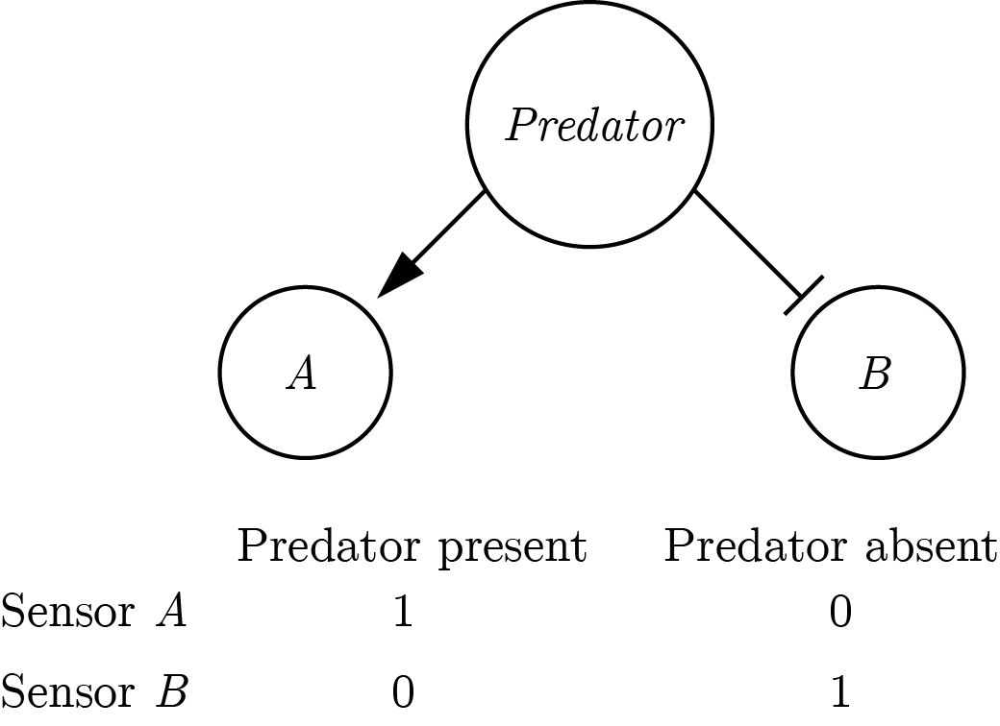
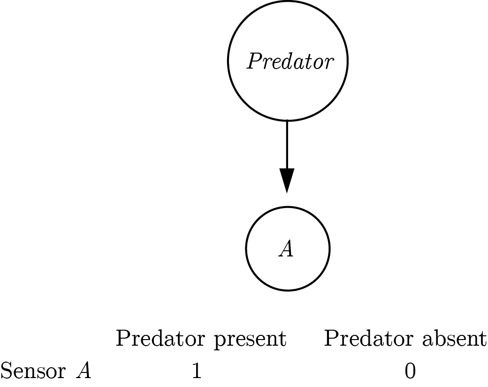
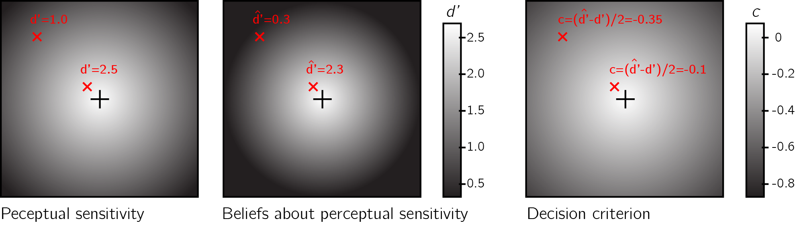
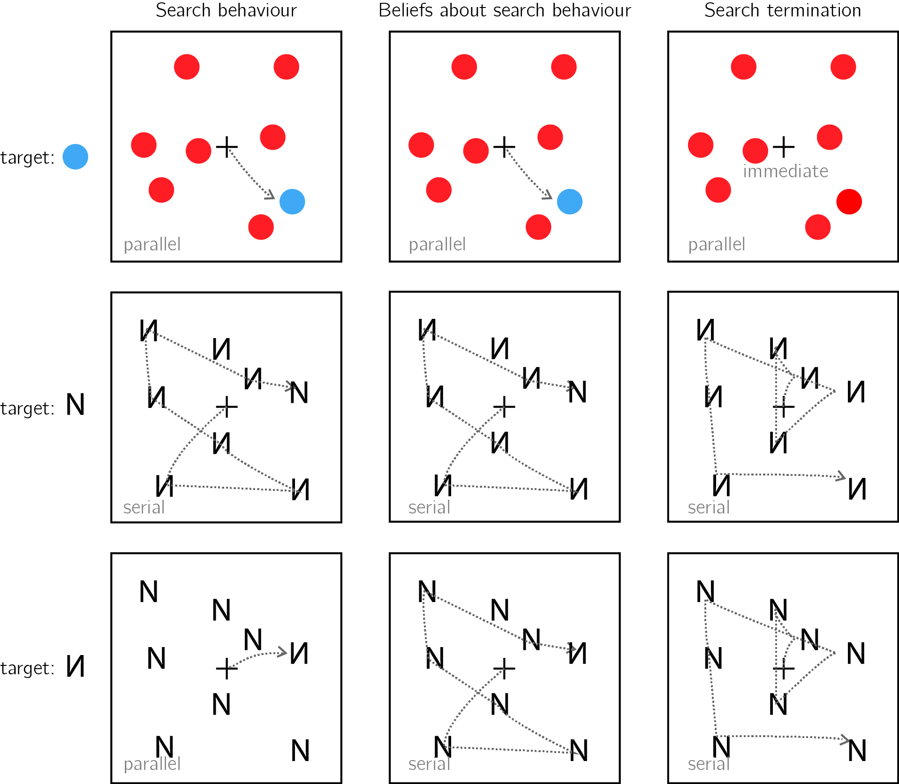

<!--
Above is the YAML (YAML Ain't Markup Language) header that includes a lot of 
metadata used to produce the document.  Be careful with spacing in this header!

If you'd prefer to not include a Dedication, for example, simply delete the section entirely, or silence them (add # before each line). 

If you have other LaTeX packages you would like to include, delete the # before header-includes and list the packages after hyphens on new lines.

If you'd like to include a comment that won't be produced in your resulting file enclose it in a block like this.

If you receive a duplicate label error after knitting, make sure to delete the index.Rmd file and then knit again.
-->


```{r include_packages, include=FALSE}
# This chunk ensures that the thesisdown package is
# installed and loaded. This thesisdown package includes
# the template files for the thesis.

setwd('C:\\Users\\mmazor\\Documents\\projects\\inProgress\\thesis\\index')
if (!require(remotes)) {
  if (params$`Install needed packages for {thesisdown}`) {
    install.packages("remotes", repos = "https://cran.rstudio.com")
  } else {
    stop(
      paste('You need to run install.packages("remotes")",
            "first in the Console.')
    )
  }
}
if (!require(thesisdown)) {
  if (params$`Install needed packages for {thesisdown}`) {
    remotes::install_github("ismayc/thesisdown")
  } else {
    stop(
      paste(
        "You need to run",
        'remotes::install_github("ismayc/thesisdown")',
        "first in the Console."
      )
    )
  }
}
library(thesisdown)
# Set how wide the R output will go
options(width = 70)

knitr::opts_chunk$set(message = FALSE)
knitr::opts_chunk$set(warning = FALSE)

```

<!--
The acknowledgements, preface, dedication, and abstract are added into the PDF
version automatically by inputting them in the YAML at the top of this file.
Alternatively, you can put that content in files like 00--prelim.Rmd and
00-abstract.Rmd like done below.
-->


```{r eval=!knitr::is_latex_output(), child=here::here("prelims", "00--prelim.Rmd")}

```

```{r eval=!knitr::is_latex_output(), child=here::here("prelims", "00-abstract.Rmd")}

```

<!-- The {.unnumbered} option here means that the introduction will be 
"Chapter 0." You can also use {-} for no numbers on chapters.
-->

# Introduction {.unnumbered}


You are in the grocery shop. On your grocery list are one carton of oat milk and one guava. You search through the shelves and find your favourite oat milk. You place the carton in your basket and move on to the fruit aisle. You visually scan the fruit boxes, but you already have a strong feeling that you will not find guavas in this store. You would have already smelled the guavas if they were anywhere around you. But then again, maybe something is wrong with your sense of smell? You grab a mandarin and sniff it. Your sense of smell is intact. You can be confident that there are no guavas around. 

```{r intro-guava, echo=FALSE,out.width="\\textwidth",fig.scap="Guavas", fig.cap="Guavas."}

```

## Inference about absence

Finding the oat milk carton was straightforward. As soon as you identified it you were convinced in its presence, no reflection or deliberation required. In contrast, concluding that no guavas were present took you longer and involved more complex cognitive processes. You had to rely on the absence of smell or sight of the fruit to reach a conclusion. In philosophical writings, this is known as Argument from ignorance (*Argumentum ad ignorantiam*): the fallacy of accepting a statement as true only because it hasn't been disproved [@locke1836essay]. Although logically unsound, *Argumentum ad ignorantiam* is widely applied by humans in different situations and contexts [@Oaksford2004]. One particular context which invites such reasoning is that of inference about absence. Positive evidence is rarely available to support inference about absence, and so it is almost exclusively made on the basis of a failure to find evidence for presence. 

Basing inference on the absence of evidence can sometimes be rational from a Bayesian standpoint [@Oaksford2004]. For this to be the case, the individual must know the sensitivity and specificity of the perceptual or cognitive system at hand. For example, in order for the inference "I don't smell a guava, therefore there are no guavas in this store" to be logically sound, I need to know that the probability of me not smelling a guava is very low if it is nearby, and so is the probability of me imagining the smell of a guava when it is not there. In other words, in order to make valid inferences about absences I need to know things about myself and my cognitive processes (see next section \@ref(detectionmodels) for a formal unpacking of this logical derivation). In the above example, this is evident in that my certainty in the absence of a guava increased after smelling the mandarin. Critically, smelling the mandarin did not provide me with any additional information about the layout of the shop or the seasonal availability of tropical fruit, but about my own perceptual system.

<!-- This example of inference about absence is exceptional in that I am able to justify my reasoning. If later my friend asks me why I concluded that no guavas were in the store, I will be able to convince them by explaining how I normally smell guavas from a distance, how I was able to smell the mandarin, and how I concluded that I would have detected a guava if it was present. But explicitly representing a derivation chain from assumptions to conclusions is the exception, not the rule. I can tell with confidence that there is no cup of water on my desk right now. If my friend asks me how I concluded that there was no cup of water on my desk, I would probably answer that I could see that it was not there. But this does not mean that I perceived its absence. It means that I did not perceive its presence, and that I would see if it was there. The first part is a fact about my perception, but the second part is based on intricate knowledge that details how hypothetical glasses of water may look like to me if they were on my desk right now. This builds on my knowledge of glasses, but more relevant to us here, on a *mental self-model*: a simplified description of one's own cognition, perception and attention that allows agents to predict their mental states under different world states.  -->

<!-- Here I argue that this necessary role of a mental self-model for inference about absence makes inference about absence a promising tool to probe people's self-knowledge. Beliefs about my sense of smell, or the expected appearance of cups of water, are only part of a rich and complex knowledge structure, comprising beliefs about the senses (for example, the belief that my hearing is better in the right ear), attention (that I'm easily distracted by noises), and cognition (that I have bad memory for faces). Indeed, mental self-models have been suggested to play an important role in attention control [@wilterson2020attention], theory of mind [@graziano2019attributing], and subjectivity more generally [@metzinger2003phenomenal]. While I can report some of those beliefs, some are not available to report, potentially not even to introspection [@flavell1979metacognition]. This cognitive impenetrability is not different from how grammar rules are represented in cognition. Native English speakers would agree that the question "Who did you see Mary with?" is grammatically acceptable and that the question "Who did you see Mary and?" is not [@ross1967constraints], but most would not be able to tell what rule is violated by the second question. Similarly, one may immediately appreciate that an object is missing, even if they will not be able to provide a better justification for this impression other than "I could see that it was not there".  -->

The following section introduces a computational formulation of this self-knowledge account, based in formal semantics and Bayesian theories of cognition, and exemplifies how different patterns of results can be interpreted in light of this formulation. This formulation is then followed by descriptions of several independent lines of experimental work that all share a role for self-knowledge in inference about absence. 

## Probabilistic reasoning, criterion setting, and self knowledge {#formalabsence}

The intimate link between inference about absence and self-knowledge has been recognized in the fields of linguistics, formal logic, and artificial intelligence. In *default-reasoning logic* [@reiter1980logic], a failure to provide a proof for a statement is transformed into a proof for the negation of the statement using the *closed world assumption*: the assumption that a proof would have been found if it was available. Similarly, Linguist Benoît de Cornulier's refers to *epistemic closure*: the notion that all there is to be known is in fact known. This is reflected in his two definitions of *knowing whether* [@de1988knowing]:

### Symmetrical definition: {-} 
'John knows whether P' means that:

1. If P, John knows that P.
2. If not-P, John knows that not-P.

### Dissymmetrical definition:{-}
'John knows whether P' means that:

1. If P, John knows that P.
2. John knows that 1 holds.

### Second-order cognition

The symmetric definition entails a *first-order process*, as no knowledge about the system itself is used in the process of inferring about the world state. This definition applies to scenarios in which it is possible to have direct knowledge against the veracity of a proposition. For example, a hypothetical organism can be equipped with sensors $A$ and $B$ that are tuned to the presence or absence of a predator, respectively. This organism can be said to know whether there is a predator around or not. It will know that a predator is nearby if $A$ is on and $B$ is off, and it will know there is no predator around if $B$ is on and $A$ is off (similar to the *Neuron-Antineuron* architecture in @gold2001neural). Such an organism can be said to implement the symmetrical definition of to know whether presented above.

```{r intro-symmetric, echo=FALSE,out.width="50%",fig.scap="A symmetric implementation of a predator-detector.", fig.cap="A symmetric implementation of a predator-detector."}

```

The symmetric architecture is redundant: assuming perfect information flow there is a perfect negative correlation between the activations of sensors $A$ and $B$. Conversely, the asymmetric definition only necessitates one sensor that is sensitive to the presence of a predator. The organism will know that the predator is around if the sensor is activated, and will conclude that it is not around if the sensor is not activated. This inference is dependent on the confidence of the organism that the sensor will always be activated by the presence of a predator (the negative test validity of its sensor, see section \@ref(detectionmodels)). In that sense, the asymmetric definition entails a *second-order process*.

```{r intro-asymmetric, echo=FALSE,out.width="50%",fig.scap="An asymmetric implementation of a predator-detector.", fig.cap="An asymmetric implementation of a predator-detector."}

```

This implementation assumes that the absence of a predator is a default state. Making this assumption makes the system leaner: instead of having two sensors, only one sensor is needed to mark deviations from a *default state* [@reiter1980logic]. This default-reasoning has an interesting property: it is *non-monotonous*. Accepting the default state (the absence of a predator in the above example) can only be done tentatively and can potentially be overridden by future evidence. This is not true for the deviant state (here, the presence of a predator), which once accepted cannot be retracted based on the absence of new evidence. In other words, while beliefs about the absence of a predator can be overturn by evidence for presence, beliefs about the presence of a predator cannot be overturn by the absence of evidence for presence. 

The asymmetric architecture requires that the organism knows that the presence of a predator would activate sensor $A$. Only then can the organism take the absence of input from $A$ as evidence for the absence of a predator. Without this knowledge, the organism will be able to represent the presence of a predator (when $A$ is activated), but not its absence. 

The mirror architecture is also possible: taking the presence of a predator to be a default state and using a sensor to mark deviations from this state, i.e., the absence of a predator.

```{r intro-pessimistic, echo=FALSE,out.width="50%",fig.cap="An asymmetric implementation of a predator-detector with a pessimistic prior."}
knitr::include_graphics("figure/intro/pessimistic.png")
```

This architecture is perfectly equivalent to the previous one for systems that are composed of sensors only. All activated sensors in the first architecture are silenced in the second architecture and vice versa. However, for multi-layered systems that generate higher-level representations from sensory input, the second architecture becomes unreasonably huge. In such systems, if the default state is taken to be "everything is happening", then for every sensory input the system should generate the abstract representation of all possible *combinations* of sensory inputs that were not experienced --- $2^n-1$ in total, $n$ being the number of sensors. This number becomes unrealistic even with a modest number of 100 sensors ($2^{99}$, or more than a million million million million millions), and is even less realistic for complex systems that are equipped with eyes, thalami and cortices. 

This has dramatic consequences for systems that need to flexibly represent a rich space of entities or events, using a set of finite building blocks such as sensors and atomic concepts. Such hierarchical, complex systems are compelled to implement an architecture analog to the one in figure \@ref(fig:intro-pessimistic), namely to represent presences only, and infer absence by relying on their own self-representation. In other words, the maintenance of a reliable self-representation can be costly, but not nearly as costly as the alternative of representing absences and presences in a symmetrical way.

### Computational models of detection {#detectionmodels}

<!-- The symmetrical definition is available for statements that can be supported or negated by evidence. For example, the statement "It is not yet 3pm" can be supported if the time on one's phone indicates that it is 2:30pm, or negated if the time on one's phone indicates it is 3:30pm. Therefore, knowing whether it is now 3pm does not rely on self-knowledge. Conversely, statements such as "I have met this person before" can only be supported by positive evidence. This leaves inference about their negation to be made based on the absence of evidence, in conjunction with self-knowledge ("I don't recall seeing this person before, and this is not a face that I would forget"). This is an example of the De Cornulier's dissymmetrical definition: knowing that I would not have forgotten this person's face is in this case 'knowing that 1 holds'.  -->

In psychological experiments of near-threshold detection, participants are required to decide whether a stimulus (for example a faint dot) was present or absent from a display. Using De Cornulier's formulation, we can ask which of the two definitions better describes the inferential machinery that is engaged in detection tasks. Is it the case that participants perceive positive evidence for he absence of a target (symmetrical definition), or alternatively, do they rely on the metacognitive belief that they would have seen the target if it was present (dissymetrical definition)? 

### The High-Threshold model {#htm -}

The *high-threshold model* of visual detection [@blackwell1952studies] formalizes this process in a way that shares conceptual similarity with De Cornulier's dissymemetrical definition. According to this model, the probability of detecting the signal $d$ scales with stimulus intensity. If participants detect the signal, they respond with 'yes'. The parameter $d$ is a perceptual parameter: it captures variables such as objective stimulus intensity (for example, in units of luminance) and sensory sensitivity (for example, of photoreceptors in the retina, or neurons in the visual cortex). The value of this parameter corresponds to the degree to which statement 1 in the dissymetrical definition is true: "If P [a stimulus is presented] John knows that P", or to the reliability of the excitatory edge feeding into sensor *B* in figure \@ref(fig:intro-asymmetric). Critically, in the high-threshold model no similar parameter exists to control the probability of detecting the absence of a signal. In other words, the presence/absence asymmetry is expressed in the absence of a direct edge from 'stimulus absent' to a 'no' response (leftmost dashed line in Fig. \@ref(fig:intro-htm)). In this model, 'no' responses are controlled by the 'guessing' parameter $g$. Unlike $d$, the $g$ parameter is under participants' cognitive control, and can be optimally set to maximize accuracy based on beliefs about the probability of a stimulus, the incentive structure, and critically, metacognitive beliefs about the perceptual sensitivity parameter $d$. 

```{r intro-htm, echo=FALSE, fig.cap="In discrete high-threshold models the presence of a signal can sometimes lead directly to a 'yes' response, but the absence of a signal is never sufficient to lead to a 'no' response. 'No' responses are controlled by the parameter *g* - a 'guessing parameter' that determines the probability of responding 'yes' in case no stimulus was detected.", out.width = '70%'}
knitr::include_graphics("figure/intro/htm.png")
```

Given accurate knowledge about the parameter $d$ and the prior probability of signal presence, observers can use *Bayes' rule* to extract the *negative test validity* [@Oaksford2004]: the probability that a signal is absent, given that the they did not perceive a signal. Formally, this equals $p(\neg T|\neg e)$, where $T$ stands for my theory (here, a signal is present) and $e$ for the availability of evidence (here, I can see the signal). Using Bayes' rule, this quantity is determined by the system's *correct rejection rate* ($p(\neg e|\neg T)$), *hit rate* ($p(e|T)$), and the prior probability of $T$. In the high threshold model, the correct rejection rate is always 1 (the threshold is never exceeded by noise alone), so the negative test validity equals:

\begin{equation}
p(\neg T|\neg e)=\frac{\overbrace{p(\neg e|\neg T))}^{CR}(1-p(T))}{1-p(e)} = \frac{1-p(T)}{1-p(e)}
\end{equation}
where 
\begin{equation}
p(e)=\overbrace{p(e|\neg T)}^{FA}(1-p(T))+\overbrace{p(e|T)}^{Hit}p(T) = \overbrace{p(e|T)}^{Hit}p(T)
\end{equation}

Subjects can then use the negative test validity to inform their setting of the $g$ parameter. For example, consider a setting where you know that a target will appear on exactly half of the trials ($p(T)=0.5$), and that half of the targets will be detected ($p(e|T)=0.5$). Using the above formula, and given that in the high-threshold model $p(e|\neg T)=0$, you can conclude that  $p(\neg e|\neg T)=\frac{1-0.5}{1-0.5*0.5}=\frac{2}{3}$. In other words, given that a target was not detected, it is twice as likely that no target was present than that a target was present. This information can now be used to inform your setting of the $g$ parameter before the next experimental trial.

### Signal Detection Theory {#sdt -}

Given its simplicity, the high-threshold model is useful for demonstrating the utility of self-knowledge for inference about absence. Without veridical knowledge about the sensitivity parameter $d$, subjects cannot tell whether they can rely on the absence of evidence when making inference about the absence of a stimulus. Continuous and graded models of perception based on Signal Detection Theory (SDT) express the same asymmetrical nature of presence/absence judgments, where clear evidence can be available for presence but less so for absence (see appendix \@ref(app1:SDT) for an overview of Signal Detection Theory). In signal detection terms, this is expressed as high between-trial variance in sensory strength when a signal is present, but low variance when a signal is absent (see Fig. \@ref(fig:intro-sdt)). Here, instead of controlling the parameter $g$, participants control the placement of a decision criterion. Only trials in which the sensory signal (also termed perceptual evidence, or decision variable) exceeds this criterion will be classified as 'stimulus present' trials. Optimal positioning of the criterion is dependent on beliefs about the likelihood of a stimulus to be present, as well as the spread of the signal and noise distributions and the distance between them [the stimulus-conditional *Probability Density Functions*; @gold2001neural]. Due to the unequal-variance structure, sensory strength in trials where a stimulus is present will be on average farther from the decision criterion compared to when no stimulus is present. As a result, similar to the setting of the $g$ parameter in the high-threshold model, the exact placement of the SDT decision criterion will affect accuracy more when a stimulus is absent, compared to when a stimulus is present. 

Common to both frameworks is the reliance on knowledge about one's own perception (the $d$ parameter in the first case, the shape and position of the sensory distributions in the second) for optimally setting a heuristic for response on trials in which no clear evidence is available for the presence of a signal. As a result, these models draw a strong link between participants' beliefs about their own perception and their behaviour on target-absent trials. In what follows I provide empirical examples for how humans make inference about the absence of objects and memories, and link those examples to the core idea, that inference about absence critically relies on access to a self-model. 

```{r intro-sdt, echo=FALSE, fig.cap="In unequal-variance SDT models, decisions are made based on the relative position of the sensory sample to a decision  criterion. The presense/absence asymmetry manifests in the fact that only in some 'target-present' trials, but no in 'target-absent' trials, the sensory sample falls far away from the decision criterion.", out.width = '70%'}
knitr::include_graphics("figure/intro/sdt.png")
```

## Detection: "I would have noticed it"

We start our exploration of inference about absence in cognition with perhaps the most basic of psychophysical tasks - visual detection. In visual detection, participants report the presence or absence of a target stimulus, commonly presented near perceptual threshold. In such tasks, accuracy alone cannot reveal a difference in processing between decisions about presence and decisions about absence, because task accuracy is a function of both 'yes' and 'no' responses. 

However, when asked to report how confident they are in their decision, subjective confidence reports reveal a metacognitive asymmetry between judgments about presence and absence. Decisions about target absence are accompanied by lower confidence, even for correctly rejected 'stimulus absence' trials [@meuwese2014subjective; @kanai2010subjective; @mazor2020distinct]. Put differently, often participants cannot tell if they missed an existing target, or correctly perceived the absence of a target. 

For example, in a study by @meuwese2014subjective, participants were asked to rate their confidence after performing either a perceptual detection task ("Was there an animal present?") or a categorization task ("Was the animal a bird?"). Stimuli were identical for the two conditions, apart from phase-scrambled ‘noise’ images that were only shown on detection blocks (see figure \@ref(fig:intro-meuwese)). Metacognitive sensitivity was quantified as the area under the response-conditional type-II receiver-operating characteristic curve (AUROC2; see Appendix \@ref(app1:mc)). This measure reflects the agreement between confidence ratings and objective accuracy. AUROC2 was higher for the categorization than for the detection task even when performance on the primary tasks was equated. This difference originated from degraded metacognitive ability for trials in which the subjects reported not detecting an animal. More specifically, it was driven by lower confidence ratings for correct rejection trials rather than high confidence ratings for misses. 

```{r intro-meuwese, echo=FALSE, fig.cap="Task design for Meuwese et al (2014). Subjects performed both the detection task and the categorization task in 12 interleaved blocks of 60 trials. Stimulus visibility was manipulated between subjects, by either pattern masking or degrading (phase scrambling). During the detection task, the degraded or masked stimulus contained either an animal (cat, bird, or fish; target) or a fully phase-scrambled image (distractor). On every trial, subjects were asked “Was there an animal present?” For the categorization task, a target category was randomly selected for each block (i.e., “bird”), and the stimuli consisted of a degraded/masked cat, bird, or fish. Subjects were asked whether the animal was a member of the target category (i.e., “Was the animal a bird?”). Subjects rated their confidence in the correctness of their response on a scale from 1 (not at all confident) to 6 (very confident). By linking confidence ratings with objective performance, metacognitive ability (MA) was calculated. b An image that is phase scrambled to different coherence levels: from left to right, 0.4 to 0.75  phase coherence, which was the range of phase coherence levels and step sizes used in degraded condition of the experiment.", fig.scap="Task design for Meuwese et al (2014).", out.width = '70%'}
knitr::include_graphics("figure/intro/Meuwese.jpg")
```

These and similar observations of a metacognitive disadvantage for inference about absence [@meuwese2014subjective; @kanai2010subjective; @mazor2020distinct; @kellij2018foundations], as well as a similar pattern in response times [decisions about absence tend to be slower than decisions about presence; @mazor2020distinct] fit well with the high-threshold and unequal-variance SDT models described above. Only in the presence of a target stimulus can participants make a decision without deliberation (without passing in the *A* node in the high-threshold model, or based on a sample very far from the decision criterion in unequal-variance SDT). On these trials, participants can be highly confident in that a target was present -- more confident than when deciding that a target was present after deliberation. These high-confidence trials will only be available when a target is indeed present, giving rise to a metacognitive disadvantage for inference about absence. 
 
In line with a central role for self-monitoring in inference about absence, this metacognitive blindspot for 'stimulus absence' judgments diminishes or reverses when targets are masked from awareness by means of an attentional manipulation [@kanai2010subjective; @kellij2018foundations]. For example, when an attentional-blink paradigm is used to control stimulus visibility, participants are significantly more confident in their correct rejection trials than in their misses. What is it in attentional manipulations that improves participants' metacognitive insight into their judgments about stimulus absence? One compelling possibility is that a blockage of sensory information at the perceptual stage is not accessible to awareness [and is thus phenomenally transparent; @metzinger2003phenomenal], whereas fluctuations in attention are accessible to introspection [and are thus phenomenally opaque; @limanowski2018seeing]. This monitoring of one's attention state makes it possible to use premises such as "I would not have missed the target" in rating confidence in absence under attentional, but not under perceptual manipulations of visibility. Put in more formal terms, attentional manipulations increase metacognitive access to the likelihood function going from world-states to perceptual states, thereby allowing trial-to-trial tuning of the decision criterion or the *g* parameter. 

Studies contrasting detection responses and confidence ratings under different levels of attention provide more support for this metacognitive account of detection 'no' responses. For example, participants are more likely to report the absence of a target in a specific location if their attention was directed to this location before stimulus onset, compared to when their attention was directed to a different location [@rahnev2011attention]. Similarly, participants are more likely to correctly report the absence of a target embedded in a stimulus (for example, a grating embedded in noise) when the stimulus is presented at the center of their visual field, compared to the periphery [@odegaard2018inflation; @solovey2015decisional]. Note that both effects are the exact opposite of what is expected based on that attention boosts sensory gain [@parr2019attention], because an increase in sensory gain without a change to the decision criterion would make false alarms, not correct rejections, more prevalent. They are however consistent with the idea that participants deploy a metacognitive strategy, shifting their decision criterion to accord with the expected strength of evidence given their current attentional state. If participants overestimate the effect of attention on their visual sensitivity, decision criterion, as measured in Signal Detection Theory, will be lower for attended versus unattended stimuli (see Fig. \@ref(fig:intro-detection)). Indeed, detection criterion is typically found to be lower for unattended stimuli [@odegaard2018inflation; @solovey2015decisional; @rahnev2011attention].

```{r intro-detection, echo=FALSE, fig.cap="Left panel: Sensitivity to near-threshold stimuli is lower in the visual periphery. For example, d' equals 1.0 in top left of the screen, but is much higher near the center. Right panel: the perceptual decision criterion is lower (more 'yes' responses) in the visual periphery.  Middle panel: if the effect of eccentricity on visual sensitivity is overestimated in participants' mental self-model (here d' in the top left corner is estimated to be 0.3), a lowering of the decision criterion in the visual periphery as observed in Odegaard et al. (2018) is expected.", out.width = '100%'}

```

## Visual search: "I would have found it" {#intro:search}

In visual search tasks, participants are presented with an array of stimuli and are asked to report, as quickly and accurately as possible, whether a target stimulus was present or absent in the array. Moving one step up the complexity ladder, the accumulation of information in visual search is not only a function of stimulus strength and sensory precision, but is also affected by the endogenous allocation of attention to items in the visual array. As a result, search time varies as a function of the number of distractors, their perceptual similarity to the target and their spatial arrangement, among other factors [for a review, see @wolfe2008visual]. These factors affect not only the time taken to report the presence of a target, but also the time taken to report its absence. For example, when searching for an orange target among red and green distractors, the number of distractors has virtually no effect on search time [e.g., @d1991color] - a phenomenon known as 'pop-out'. The bottom-up pop-out of a target can explain the immediate recognition of the presence of a target, irrespective of distractor set size. But this perceptual pop-out cannot, by itself, explain the immediate recognition of target absence, because in target absence trials there is nothing in the display to pop out. 

Computational models of visual search provide different accounts for search termination in target-absent trials. In *Feature Integration Theory*, visual search comprises a pre-attentive, automatic process, and a later stage that is under participants' cognitive control. According to this model, difficult target-absent 'conjunction' searches terminate once participants scan all the items in the display [a *self-terminating exhaustive search*; @treisman1980feature]. However, this model predicts that search-time variability in conjunction target-absent trials should be lower than in conjunction target-present trials - a pattern that is not observed in empirical data [@wolfe2010reaction; @moran2016serial]. Furthermore, Feature Integration Theory does not provide an explicit account of target-absent responses in highly efficient parallel searches.

In early versions of the *Guided Search* model, 'target absent' judgments are the result of exhausting the search only on items that surpass a learned 'activation threshold' [@chun1996just; @wolfe1994guided]. In difficult searches, the activation threshold was set to a low value, thereby requiring the scanning of multiple items before a 'no' response can be delivered. In contrast, in easy searches the activation threshold could be set to a high value, reflecting a belief that a target would be highly salient (see Fig. \@ref(fig:intro-termination-models)). Furthermore, some very long searches terminated once subjects concluded that "it rarely takes this long to find a target" [@wolfe1994guided]

A more recent version of the Guided Search model (*Competitive Guided Search*) described visual search as a stochastic process where items are selected for inspection based on their dynamic weight in a salience map. Critically, this model also included a *quitting unit* that can be chosen with a certain probability [@moran2013competitive]. The search terminates once an item is recognized as the target, or once the quitting unit is selected. In this model, the salience of the quitting unit changes following the rejection of distractors. This incremental change was controlled by a parameter ($\Delta w_{quit}$) that is "under strategic control of the observer". For difficult searches, this parameter can be set to a low value, so that more items can be scanned before search termination. In very easy 'pop-out' searches this parameter can be set to a high value, making it possible to terminate the search after rejecting only one item.   

In a more recent formulation of the Guided Search model [@wolfe2021guided], the search terminated once a noisy accumulator reached a *quitting threshold*. Setting the quitting threshold high allows participants to scan more items before concluding that a target is absent. The mechanism by which participants calibrate the quitting threshold is not specified in the model. Finally, in a fixation-based model of visual search, the number of items that are concurrently scanned within a single fixation (the *functional visual field*) was dependent on search difficulty: with more items for easy searches and less items for more difficult ones [@hulleman2017impending].  

Importantly for our point here, the activation threshold, $\Delta w_{quit}$, the quitting threshold and the functional visual field all share high similarity with the SDT criterion or the high-threshold *g* parameter, and reflects explicit or implicit beliefs about the subjective salience of a hypothetical target in the array -- a form of self-knowledge. 

```{r intro-termination-models, echo=FALSE, out.width="100%", fig.scap = 'Models of search termination', fig.cap="Models of search termination. For the same visual array (uppermost panel) search terminated immediately for one target (a green 7, right column), but takes longer for another target (a purple 7, left column). Different models of visual search explain this difference by postulating search termination mechanisms that are sensitive to the counterfactual difficulty of finding a hypothetical target."}
knitr::include_graphics(path = "figure/intro/termination_models.png")
```

<!-- @moran2013competitive proposed a Competitive Guided Search model, according to which 'target absent' responses are the result of selecting a 'quit unit' with probability that inversely scales with the salience of items in the display. In this model too, bottom-up activation is not sufficient to explain the lack of a distractor set-size effect on 'no' responses in feature search. The authors note that this effect may be driven by participants' expectation that in feature search, it is unlikely that attention will be drawn to a distractor when a target exists. Again, this is a form of self-knowledge, and more specifically beliefs and predictions about attention and search difficulty.  -->

Usually, search times in target-present and target-absent trials are highly correlated, such that if participants take longer to find the target in a given display, they will also take longer to conclude that it is absent from it [@wolfe1998can]. This alignment speaks to the accuracy of the mental self-model: participants take longer to conclude that a target is missing when they believe they would take longer to find the target, and these beliefs about hypothetical search times are generally accurate. In the two upper panels of Fig. \@ref(fig:intro-search) I provide two examples of cases where beliefs about search behaviour perfectly align with actual serach behaviour, leading to optimal search termination. However, self-knowledge about attention in visual search is not always accurate. For example, when searching for an unfamiliar letter (for example, an inverted N) among familiar letters (for example, Ns), the unfamiliar letter draws immediate attention without a need for serially attending to each item in the display. However, participants are slow in concluding that no unfamiliar letter is present, exhibiting a search time pattern consistent with a serial search for 'target absent' responses only [@wang1994familiarity; @zhang2020visual]. In the context of my proposal here, this can be an indication for a blind-spot of the mental self-model, failing to represent the fact that an unfamiliar letter would stand out (see Fig. \@ref(fig:intro-search), lower panel). 

<!-- Importantly, collecting explicit metacognitive judgments of expected search times may lead to underestimating the richness and accuracy of the mental self-model. For example, participants may not have introspective access to their knowledge about color pop-out, but may still be able to act on this information when deciding to terminating their search. Here also, inference about absence provides a unique window into the mental self-model that does not depend on introspective access. -->

```{r intro-search, echo=FALSE, fig.cap="Upper panel: A target that is marked by a unique colour imemdiately captures attention (left). This fact is available to particiapnts' self-model (middle). As a result, participants can immediately terminate a search when no distractor shares the color of the target (right). Middle panel: When searching for the letter N among inverted Ns, the target does not immediately capture attention, and the serial deployment of attention is necessary (left). Participants are aware of this (middle). As a result, participants perform an exhaustive serial search before concluding that a target is absent (right. Lower panel: When searching for an inverted N among canincally presented Ns, the inverted letter immediately captures attention (left). This fact is not specified in the self-model (middle). As a result, participants perform an unncessary exhaustive serial search before concluding that a target is absent (right).", out.width = '70%'}

```

## Memory: "I would have remembered it"

Inference about absence not only applies to external objects (such as guavas, or visual items on the screen), but also to mental variables such as memories and thoughts. For example, upon being introduced to a new colleague, one can be certain that they have not met this person before. In the memory literature, this is known as *Negative recognition*: remembering that something did not happen [@brown1977memorability]. In the lab, a typical recognition memory experiment comprises a learning phase and a test phase. In the learning phase participants are presented with a list of items, and in the test phase they are asked to classify different items as 'old' (presented in the learning phase) or 'new' (not presented in the learning phase). 

Recognition memory is often modeled using threshold or signal detection models (see sections \@ref(htm) and \@ref(sdt)), or a combination of the two [*Dual Process models*; @wixted2007dual; @yonelinas1996signal]. For example, in SDT models [@banks1970signal], participants compare a 'memory trace' against an internal criterion to determine whether the item should be classified as old or new. Like perceptual detection, the placement of the decision threshold reflects beliefs about the expected signal for old and new items. If participants believe that learned items would give rise to very salient memory traces, they can safely increase the decision criterion without risking mistaking old items for being new. 

The role of self-knowledge in negative recognition is exemplified in the *mirror effect*: items that are more likely to be correctly endorsed as 'old' are also more likely to be correctly rejected as 'new'. In SDT terms, this effect can be described as the adjustment of the decision criterion to the expected memory trace of an item, had it been present [its *memorability*; @brown1977memorability]. For example, @brown1977memorability found that when asked to memorize a list of names, subjects are more confident in remembering that their own name was on the list, but also in correctly remembering when it was *not* on the list. For this effect to manifest, it is not sufficient that subjects' memory was better for their own name. They also had to know this fact, and to use it in their counterfactual thinking ("I would have remembered if my name was on the list"). The mirror effect has also been demonstrated for the name of one's hometown [@brown1977memorability], for word frequency [rare words are more likely to be correctly endorsed or rejected with confidence; @brown1977memorability; @glanzer1976analysis], word imaginability [@cortese2010recognition; @cortese2015mega] and for study time [subjects are more likely to correctly reject items if learned items are presented for longer; @stretch1998difference; @starns2012strength]. 

In a clever set of experiments, @strack2005know established a causal link from metacognitive beliefs about item memorability and decisions about the absence of memories. In two experiments, participants in one group were led to believe that high-frequency words (words that are used relatively often) are more memorable than low-frequency words, while participants in a second group were led to believe that low-frequency words were more memorable than high-frequency words. This manipulation affected participants' tendency to reject high-frequency or low-frequency items in a later recognition-memory task. Participants who believed that high-frequency words were more memorable were more likely to classify high-frequency words as 'new', suggesting that their metacognitive belief informed their inference about the absence of a memory ('I would have remembered this word'). Inversely, participants who believed that low frequency words were more memorable showed the opposite pattern. 

One formal description of this inferential process is provided by the *likelihood ratio* rule. According to this model, subjects compare the likelihood of incoming evidence under two competing models of the world - the presence or absence of a memory trace, and choose the model under which the incoming evidence is more likely. In order to be able to compare the likelihood of an observation under alternative models, subjects must have a model of their cognition that is sufficiently detailed to yield conditional probability distributions. In experiments where the probabilities of an item to be old or new is equal, the likelihood ratio strategy is optimal [@neyman1933ix]. As a cartoon example, a participant may expect the perceived memory trace for frequent words to be centered around 0.3, and around 0.6 for infrequent words. Using the likelihood ratio rule, this particiapnt will be more confident in that a word is new if the observed memory is 0 and the word is infrequent, compared to when the word is frequent. The likelihood ratio approach has been successful in explaining several features of recognition memory, including the mirror effect in negative recognition [@glanzer1993regularities; @glanzer2009likelihood].

Just like in the cases of near-threshold detection and visual search, the intuitive metacognitive knowledge behind the mirror effect may not be available for explicit report, at least not in the absence of direct experience with the task itself. In their explicit memorability reports, subjects often have little to no declarative metacognitive knowledge of which items are more likely to be remembered, even under conditions that give rise to a mirror effect. For example, although more frequent words are more likely to be forgotten (and incorrectly classified as old), participants tended to judge them as more memorable than infrequent words [@benjamin2003predicting; @begg1989memory; @wixted1992subjective; @greene1994mirror]. However, participants showed metacognitive insight into the negative effect of word frequency on memorability when memorability was rated after (and not before) negative recognition judgments [@guttentag1998memorability; @benjamin2003predicting]. Thus, the implicit metacognitive knowledge that supports accurate negative recognition may become available for explicit report only when participants introspect over their recognition attempts. 

## The development of a self-model

As exemplified above, the inferential processes that result in judgments of absence share important commonalities, regardless of whether it is the absence of an isolated target stimulus, of one target in an array of distractors, or of a non-physical entity such as a memory. First, in all three cases, to infer absence agents must possess some self-knowledge (under what conditions are they likely to miss a target, how long they should expect to search before finding a target in an array of distractors, or which items are likely or unlikely to be remembered). Second, agents must be able to use this counterfactual knowledge and compare it with their current state (for example, having no recollection of an item, or not seeing a target stimulus). 

At what developmental stage do humans master the necessary self knowledge and inferential machinery to make efficient and accurate inference about absence? In the context of memory, evidence suggests that the necessary self-knowledge and the capacity for counterfactual thinking exist in primary form already in early childhood, but continue to develop until adulthood. For example, children as young as 5 were able to give meaningful assessments the memorability of hypothetical life events and to use this metacognitive knowledge to inform their judgments about the nonoccurrence of an event, but this ability did not reach full maturation until the age of 9 [@ghetti2004if]. Other studies identified a qualitative transition between the ages 7 and 8 in the ability of children to rely on expected event memorability for inference about the absence of a memory [@ghetti2010knowing; @ghetti2008development]. This developmental discontinuity was attributed to the development of counterfactual thinking and second-order theory of mind. Indeed, the ability to infer that something did not happen based on that it would have been remembered critically relies on one's ability to ascribe mental states to their counterfactual self. 

In perception, the ability to represent absences lags behind the ability to represent presences, but reaches maturation much earlier than in the case of memory. In a study by @coldren2000asymmetries, 4 month-old infants were familiarized with a pair of identical letters (e.g., the letter 'O'), presented side by side. In the test phase, one of the letters was replaced with a novel letter, which differed from the familiar letter either in the presence or the absence of a distinctive feature. For example, when infants that were familiarized with the letter O were tested on a display of one O and one Q, the novel letter (Q) was marked by the presence of a distinctive feature. Conversely, for infants that were familiarized with the letter Q, the novel letter O was marked by the absence of a distinctive feature. Infants showed preferential looking at the novel letter only when this letter was marked by the presence, not the absence, of a distinctive feature. A similar feature-positive effect was still evident in the learning behaviour of preschool children. When presented with two similar displays, 4 and 5 year old children were able to learn to approach the display with a distinctive feature but were at chance when trained to approach a display that is marked by the absence of a distinctive feature [@sainsbury1971feature]. 

Together, these results suggest that the capacity to infer the absence of physical and mental entities develops through infancy and early childhood. In context of this thesis, the development of this capacity can reflect the gradual expansion of different aspects a mental self-model, and the development of the capacity to use this model for counterfactual reasoning. For example, a baby that is not drawn to the new letter 'O' after being habituated to the letter 'Q' may not yet represent the absence of the distinguishing feature, because they lack the implicit self knowledge to know that they would have noticed the lower diagonal line if it was present. More abstractly, a 7 year-old may not be able to confidently tell that they did not spread a lotion on a chair [a highly memorable action, due to its bizarreness; @ghetti2008development], because they lack the self-knowledge to know that if they had, they would have remembered doing so.  

## This thesis

This thesis is centred around inference about absence in perception, and its reliance on self-modeling. First, in Chapter \@ref(ch:search) I look at inference about absence in visual search. Not unlike near-threshold detection and memory, in visual search too inference about the absence of a target item must rely on some form of self-knowledge (see section \@ref(intro:search)). This study sought to pinpoint the origin of this knowledge. For example, is the knowledge that some visual searches are easier than others available to subjects in everyday life, or is it learned from experience in the artificial context of performing many trials of the same visual search task again and again? Due to the typical many-trials/few-subjects structure of lab-based experiments, classical visual search studies could not tell between these alternative options. By collecting data from a large number of online participants, in this first study we were able to reliably characterise participants' asearch termination in the first few trials of an experiment. 


<!--chapter:end:index.Rmd-->


```{r ch1_load_pkgs, echo=FALSE, message=FALSE, include=FALSE}
# List of packages required for this analysis
pkg <- c("dplyr", "ggplot2", "knitr", "bookdown")
# Check if packages are not installed and assign the
# names of the packages not installed to the variable new.pkg
new.pkg <- pkg[!(pkg %in% installed.packages())]
# If there are any packages in the list that aren't installed,
# install them
if (length(new.pkg)) {
  install.packages(new.pkg, repos = "https://cran.rstudio.com")
}
# Load packages

library("papaja")
r_refs("r-references.bib")
library('reticulate')
library('tidyverse')
library('broom')
library('cowplot')
library('MESS') # for AUCs
library('lsr') # for effect sizes
library('pwr') # for power calculations
library('brms') # for mixed effects modeling
library('BayesFactor') # for Bayesian t test
library('jsonlite') #parsing data from sort_trial
library('thesisdown')
library('knitr')
```

# Zero-shot search termination reveals a dissociation between implicit and explicit metacognitive knowledge {#ch:search}

#### Matan Mazor, Stephen M. Fleming {.unnumbered}

In order to infer that a target item is missing from a display, subjects must know that they would have detected it if it was present. This form of counterfactual reasoning critically relies on metacognitive knowledge about spatial attention and visual search behaviour. Previous work on visual search established that this knowledge is constructed and expanded based on task experience. Here we show that some metacognitive knowledge is also available to participants in the first few trials of the task, and that this knowledge can be used to guide decisions about search termination even if it is not available for explicit report. 

## Introduction 

Searching for the only blue letter in an array of yellow letters is easy, but searching for the only blue X among an array of yellow Xs and blue Ts is much harder [@treisman1980feature]. This difference manifests in the time taken to find the target letter, but also in the time taken to conclude that the target letter is missing. In other words, easier searches not only make it easier to detect the presence of a target, but also to infer its absence. Differences in the speed of detecting the presence of a target have been attributed to pre-attentional mechanisms [@treisman1980feature] and guiding signals [@wolfe2007guided; @wolfe2021guided], that can sometimes make the target item 'pop out' immediately, without any attentional effort. In target-absent trials, however, there is nothing in the display to pop-out. This reasis a fundamental question: what makes some decisions about target absence easier than others?


Metacognitive beliefs about the expected time taken to detect a target can draw on previous experience in the task. Indeed, search time in target-absent trials decreases following successful target-present trials, and sharply increases following target  misses [@chun1996just]. This simple heuristic provided an excellent fit to data from a visual search task with hundreds of trials. However, in everyday life visual searches rarely come in a blocks of hundreds of similar trials, such that relying on previous repetitions of the same search to guide search termination is impossible [@wolfe2021guided]. Only the first trials of a visual search experiment, where participants meet the stimuli for the first time, are a good model of this *zero-shot search termination* behaviour. In these trials, search time should rely solely on metacognitive beliefs about search efficiency that are available to subjects prior to engaging with the task. This fact makes search time in the first few trials of a task a critical window into participants’ metacognitive knowledge about attention and visual search. Furthermore, participants' ability to learn from positive examples (target-present trials), and their ability to generalize their knowledge across stimulus types and displays, offers an opportunity to study the structure of this simplified metacognitive knowledge, its building blocks, and the inductive biases that guide its acquisition. In this study, we use target-absent trials in visual search to ask what participants know about their spatial attention before engaging with the visual search task, and how this knowledge is built and expanded based on experience.

In two pre-registered experiments here we focus on feature search for colour and shape. Focusing on the first four trials in a visual search task, we ask whether prior experience with the task and stimuli is necessary for efficient search termination in feature searches. Unlike typical visual search experiments that comprise hundreds or thousands of trials, here we collect only a handful of trials from a large pool of online participants. This unusual design allows us to reliably identify search time patterns in the first trials of the experiment. Furthermore, by making sure that the first displays do not include the target stimulus, we are able for the first time to ask what knowledge is available to participants about their expected search efficiency prior to engaging with the task. 

We dub this approach *zero-shot search termination* in a tribute to the study of 'zero-shot learning' in machine learning: the ability to classify unseen categories of stimuli, based on generalizable knowledge from other categories [@xian2017zero]. Efficient (i.e., fast and accurate) quitting in target-absent trials prior to any target-present trials would indicate that knowledge about the salience of a divergent color or shape is available at some form in the cognitive system, and that this knowledge can flexibly be put to use for counterfactual reasoning in the process of inference about absence. Conversely, inefficient search in these first trials would mean that positive experience is necessary for this knowledge to be acquired, or to be expressed. 

```{r ch1_exp1_load_and_format_data, echo=FALSE, message = FALSE, cache=TRUE}

E1.df <- read_csv('data/ch1/exp1/jatos_results_batch1.csv') %>%
  rename('subj_id' = 'subject_identifier') %>%
  mutate(subj_id=factor(subj_id))

E1.export <- read_csv('data/ch1/exp1/prolific_export_batch1.csv') %>%
  filter(status=='APPROVED')

E1.N_total <- E1.df$subj_id%>%unique()%>%length()

E1.search_df <- E1.df %>%
  filter((test_part=='absence1') | 
           (test_part=='absence2') | 
           (test_part=='presence1')) %>%
  dplyr::select('subj_id','test_part','set_size','target_present','correct','RT','search_type') %>%
  #response was not coded directly, so is instead inferred from accuracy and stimulus
  mutate(response = ifelse(correct==1, target_present, 1-target_present)) %>%
  #in order to correct for serial position effects, I'm extracting a centered serial
  #position value for each trial in a block (-1.5,-0.5,0.5,1.5)
  mutate(trial = sequence(rle(as.character(subj_id))$lengths),
         i = trial%%4,
         i = ifelse(i==0,1.5,i-2.5),
         #convert to factor
         test_part = factor(test_part, levels = c('absence1','presence1','absence2')),
         search_type = factor(search_type, levels = c('conjunction','color')))

#Exclusion parameters:
minRT <- 250
maxRTsubj <- 5000 # for subject exclusion
maxRTtrial <- 1000 #for trial exclusion
min_acc_search <- 5/6

#Obtain list of excluded subjects
E1.excluded <- E1.search_df %>%
  group_by(subj_id) %>%
  summarise(acc = mean(correct),
            RTlow = quantile(RT,0.25),
            RThigh = quantile(RT,0.75)) %>%
  filter(acc<min_acc_search | RTlow<minRT | RThigh>maxRTsubj) %>%
  dplyr::select('subj_id')

#A function to control for within-block slope effects of serial order
correctOrderEffects <- function(df) {
  fit <- lm(RTfiltered ~ i, data=df)
  slope = fit$coefficients[2];
  return(df$RTfiltered-slope*(df$i))
}

#Correct order effects
E1.search_df <- E1.search_df %>%
  mutate( include=RT>minRT & 
            RT<maxRTtrial & 
            correct==1 & 
            !subj_id%in%E1.excluded$subj_id,
          RTfiltered = ifelse(include, RT, NA)) %>%
  group_by(test_part) %>%
  do(mutate(.,RTcorrected = correctOrderEffects(.)))

E1.descriptives <- E1.search_df %>% 
  filter(!subj_id%in%E1.excluded$subj_id) %>%
  group_by(subj_id) %>%
  summarise(accuracy=mean(correct), RT=median(RT))
```

## Experiment 1
In Experiment 1, we examined search termination in the case of colour search. When searching for a deviant colour, the number of distractors has virtually no effect on search time [*colour pop-out*; e.g., @d1991color], for both 'target present' and 'target absent' responses. Here we asked whether efficient quitting in colour search is dependent on task experience. A detailed pre-registration document for Experiment 1 can be accessed via the following link: [https://osf.io/yh82v/](https://osf.io/yh82v/).

### Participants

The research complied with all relevant ethical regulations, and was approved by the Research Ethics Committee of University College London (study ID number 1260/003). `r E1.N_total` Participants were recruited via Prolific, and gave their informed consent prior to their participation. They were selected based on their acceptance rate (>95%) and for being native English speakers. Following our pre-registration, we collected data until we reached 320 included participants for each of our pre-registered hypotheses (after applying our pre-registered exclusion criteria). The entire experiment took around 3 minutes to complete (median completion time: `r printnum(E1.export$time_taken%>%median()/60)` minutes). Participants were paid £0.38 for their participation, equivalent to an hourly wage of £ `r printnum(0.38*3600/E1.export$time_taken%>%median())`.

### Procedure

A static version of Experiment 1 can be accessed on [matanmazor.github.io/termination/experiments/demos/exp1/](matanmazor.github.io/termination/experiments/demos/exp1/). Participants were first instructed about the visual search task. Specifically, that their task is to report, as accurately and quickly as possible, whether a target stimulus was present (press 'J') or absent (press 'F'). Then, practice trials were delivered, in which the target stimulus was a rotated *T*, and distractors are rotated *L*s. The purpose of the practice trials was to familiarize participants with the structure of the task. For these practice trials the number of items was always 3. Practice trials were delivered in small blocks of 6 trials each, and the main part of the experiment started only once participants responded correctly on at least five trials in a block (see Figure \@ref(fig:ch1-exp1-design)). 


```{r ch1-exp1-design, echo=FALSE,out.width="\\textwidth",fig.scap="Experimental design for Exp. 1", fig.cap="Experimental design. Top panel: each visual search trial started with a screen indicating the target stimulus. The search display remained visible until a response is recorded. To motivate accurate responses, the feedback screen remained visible for one second following correct responses and for four seconds following errors. Middle panel: after reading the instructions, participants practiced the visual search task in blocks of 6 trials, until they had reached an accuracy level of 0.83 correct or higher (at most one error per block of 6 trials). Bottom panel: the main part of the experiment comprised 12 trials only, in which the target was a red dot. Unbeknown the subjects, only trials 5-8 (Block 2) were target-present trials, and the remaining trials were target-absent trials. Each 4-trial block followed a 2 by 2 design, with factors being set size (4 or 8) and distractor type (color or conjunction; blue dots only or blue dots and red squares, respectively)."}

```

In the main part of the experiment, participants searched for a red dot among blue dots or a mixed array of blue dots and red squares. Set size was set to 4 or 8, resulting in a 2-by-2 design (search type: color or color$\times$shape, by set size: 4 or 8). Critically, and unbeknown to subjects, the first four trials were always target-absent trials (one of each set-size $\times$ search-type combination), presented in randomized order. These trials were followed by the four corresponding target-present trials, presented in randomized order. The final four trials were again target-absent trials, presented in randomized order.

#### Randomization {-}

The order and timing of experimental events was determined pseudo-randomly by the Mersenne Twister pseudorandom number generator, initialized in a way that ensures registration time-locking [@mazor2019novel]. 

### Data analysis 

#### Rejection criteria {-}

Participants were excluded for making more than one error in the main part of the experiment, or for having extremely fast or slow reaction times in one or more of the tasks (below 250 milliseconds or above 5 seconds in more than 25% of the trials). 

Error trials, and trials with response times below 250 milliseconds or above 1 second were excluded from the response-time analysis.

#### Data preprocessing {-}

To control for within-block trial order effects, a separate linear regression model was fitted to the data of each block, predicting search time as a function of trial serial order ($RT \sim \beta_0+\beta_1i$, with $i$ denoting the mean-centered serial position within a block). Search times were corrected by subtracting the product of the slope and the mean-centered serial position, in a block-wise manner.

Subject-wise search slopes were then extracted for each combination of search type (color or conjunction) and block number by fitting a linear regression model to the reaction time data with one intercept and one set-size term.

#### Hypotheses and analysis plan {-}

Experiment 1 was designed to test several hypotheses about the contribution of metacognitive knowledge to search termination, the state of this knowledge prior to engaging with the task, and the effect of experience trials on this metacognitive knowledge. The specifics of our pre-registered analysis can be accessed in the following link: [https://osf.io/ea385](https://osf.io/ea385). We outline some possible search time patterns and their pre-registered interpretation in Fig. \@ref(fig:ch1-models). 


```{r ch1-models, echo=FALSE, out.width="\\textwidth",fig.cap="Visualization of Hypotheses. Top left: typical search time results in visual search experiments with many trials (where TP =  Target Present responses; TA = Target Absent responses). Set size (x axis) affects search time in conjunction search, but much less so in color search. However, it is unclear whether this pattern of target-absent search also holds in the first trials in an experiment. Different models make different predictions about target-absent serach times in the first block of the experiment. Top right: one possible pattern is that the same qualitative pattern will be observed in our design, with an overall decrease in response time as a function of trial number. This would suggest that the metacognitive knowledge necessary to support efficient inference about absence was already in place before engaging with the task. Bottom left: an alternative pattern is that the same qualitative pattern will be observed for blocks 2 and 3, but not in block 1. This would suggest that for inference about absence to be efficient, participants had to first experience some target-present trials. Bottom right: alternatively, some degree of metacognitive knowledge may be available prior to engaging with the task, with some being acquired by subsequent exposure to target-present trials. This would manifest as different slopes for conjunction and color searches in blocks 1 and a learning effect for color search between blocks 1 and 3."}
knitr::include_graphics("figure/ch1/models.png")
```


Analysis comprised a positive control based on target-present trials, a test of the presence of a pop-out effect for target-absent color search in block 1, and a test for the change in slope for target-absent color search between blocks 1 and 3. All hypotheses were tested using a within-subject t-test, with a significance level of 0.05. 
Given the fact that we only have one trial per cell, one excluded trial is sufficient to make some hypotheses impossible to test on a given participant. For this reason, for each hypothesis separately, participants were included only if all necessary trials met our inclusion criteria. This meant that some hypotheses were tested on different subsets of participants.

We used `r cite_r("r-references.bib", pkgs=c('ggplot2','reticulate', 'cowplot','dplyr','papaja','tidyr','MESS', 'jsonlite', 'lsr', 'BayesFactor', 'pwr'), withhold=FALSE)` for all our analyses. 

### Results

```{r ch1-exp1-analyze_data, echo=FALSE, cache=TRUE, message = FALSE}

E1.median_search_times <- E1.search_df %>%
  filter(include==1) %>%
  group_by(test_part,set_size,search_type) %>%
  summarise(median_RT= median(RTcorrected), 
            sem_RT=se(RTcorrected)*1.2533)%>%
  #since we are only looking at correct responses
  mutate(response=test_part=='presence1')

E1.mean_acc <- E1.search_df %>%
  group_by(test_part,set_size,search_type) %>%
  summarise(mean_acc=mean(correct))%>%
  mutate(response=test_part=='presence1')

E1.search_slopes <- E1.search_df %>%
  filter(include==1) %>%
  group_by(subj_id,search_type,test_part) %>%
  do(model=lm(RTcorrected~set_size,data=.)) %>%
  mutate(tidys=list(broom::tidy(model))) %>%
  unnest(tidys) %>%
  # we are interested in the slope, i.e., the effect of set size.
  filter(term=='set_size')

E1.mean_search_slopes <- E1.search_slopes %>%
  group_by(search_type,test_part) %>%
  summarise('mean_slope'=mean(estimate,na.rm=TRUE),
            'se_slope' = se(estimate, na.rm=TRUE))

E1.slopes_wide <- pivot_wider(E1.search_slopes,
                           id_cols = 'subj_id',
                           names_from = c('search_type','test_part'),
                           values_from = estimate)
```

Overall mean accuracy was `r printnum(mean(E1.descriptives$accuracy))` (standard deviation =`r printnum(sd(E1.descriptives$accuracy))`). Median reaction time was `r printnum(median(E1.descriptives$RT))` ms (median absolute deviation = `r printnum(mad(E1.descriptives$RT))`). In all further analyses, only correct trials with response times between 250 and 1000 ms are included. 

*Hypothesis 1 (positive control)*: Search times in block 2 (target-present) followed the expected pattern, with a steep slope for conjunction search (`r apa_print(t.test(E1.slopes_wide$conjunction_presence1,na.rm=TRUE))$estimate`) and a shallow slope for conjunction search (`r apa_print(t.test(E1.slopes_wide$color_presence1,na.rm=TRUE))$estimate`; see middle panel in Fig. \@ref(fig:ch1-exp1-results)). The slope for color search was significantly lower than 10 ms/item and thus met our criterion for being considered 'pop-out' (`r apa_print(t.test(E1.slopes_wide$color_presence1,na.rm=TRUE,mu=10,alternative='less'))$statistic`). Furthermore, the difference between the slopes was significant (`r apa_print(t.test(E1.slopes_wide$conjunction_presence1-E1.slopes_wide$color_presence1,na.rm=TRUE))$statistic`). This positive control served to validate our method of using two trials per participant for obtaining reliable group-level estimates of search slopes.

*Hypothesis 2*: Our central focus was on results from block 1 (target-absent). Here participants didn't yet have experience with searching for the red dot. Similar to the second block, the slope for the conjunction search was steep (`r apa_print(t.test(E1.slopes_wide$conjunction_absence1,na.rm=TRUE))$estimate`). A clear ‘pop-out’ effect for color search was also evident (`r apa_print(t.test(E1.slopes_wide$color_absence1,na.rm=TRUE,mu=10, alternative='less'))$full_result`). Furthermore, the average search slope for color search in this first block was significantly different from that of the conjunction search (`r apa_print(t.test(E1.slopes_wide$conjunction_absence1-E1.slopes_wide$color_absence1,na.rm=TRUE))$statistic`; see leftmost panel in Fig. \@ref(fig:ch1-exp1-results)), indicating that a color-absence pop-out is already in place prior to direct task experience. This result is in line with the *prior-knowledge only* model (see Fig. \@ref(fig:ch1-models)), in which participants have valid expectations for efficient color search, prior to engaging with a task.

Pre-registered hypotheses 3-5 were designed to test for a learning effect between blocks 1 and 3, before and after experience with observing a red target among blue distractors. Given the overwhelming pop-out effect for target-absent trials in block 1, not much room for additional learning remained. Indeed, results from these tests support a prior-knowledge only model.

*Hypothesis 3*: Like in the first block, in the third block color search complied with our criterion for ‘pop-out’  (`r apa_print(t.test(E1.slopes_wide$color_absence2,na.rm=TRUE,mu=10, alternative='less'))$full_result`), and was significantly different from the conjunction search slope (`r apa_print(t.test(E1.slopes_wide$conjunction_absence2-E1.slopes_wide$color_absence2,na.rm=TRUE))$statistic`; see rightmost panel in Fig. \@ref(fig:ch1-exp1-results)). This result is not surprising, given that a pop-out effect was already observed in block 1.

*Hypothesis 4*: To quantify the learning effect for color search, we directly contrasted the search slope for color search in blocks 1 and 3. We find no evidence for a learning effect (`r apa_print(t.test(E1.slopes_wide$color_absence1-E1.slopes_wide$color_absence2,na.rm=TRUE))$statistic`). Furthermore, a Bayesian t-test with a scaled Cauchy prior for effect sizes (r=0.707) provided strong evidence in favour of the absence of a learning effect (`r apa_print(ttestBF(na.omit(E1.slopes_wide$color_absence1-E1.slopes_wide$color_absence2)))$statistic`).

*Hypothesis 5*: In case of a learning effect for pop-out search, Hypothesis 5 was designed to test the specificity of this effect to color pop-out by computing an interaction between block number and search type. Given that no learning effect was observed, this test makes little sense. For completeness, we report that the change in slope between blocks 1 and 3 was similar for color and conjunction search (`r apa_print(t.test(E1.slopes_wide$color_absence1-E1.slopes_wide$color_absence2-E1.slopes_wide$conjunction_absence1+E1.slopes_wide$conjunction_absence2,na.rm=TRUE))$full_result`). 

```{r ch1-exp1-results, echo=FALSE, fig.pos = 'H', out.width="\\textwidth", fig.cap="Upper panel: median search time by distractor set size for the two search tasks across the three blocks (12 trials per participant). Correct responses only. Lower panel: accuracy as a function of block, set size and search type. Error bars represent the standard error of the median."}

block_names <-  c("Block 1 (Absence)", "Block 2 (Presence)", "Block 3 (Absence)");
names(block_names) <- c("absence1", "presence1", "absence2");

RTplot <- ggplot(data=E1.median_search_times, 
       aes(x=set_size, y=median_RT, color=search_type, fill=search_type, linetype=test_part)) +
  geom_line(size=1) +
  geom_point(aes(shape = search_type), size=4, color="black",stroke=1.5) +
  scale_shape_manual(values=c(4,21))+
  scale_fill_manual(values = c("black","#377eb8"))+
  scale_color_manual(values = c("black","#377eb8"))+
  scale_linetype_manual(values=c("21", "solid","21"))+
  facet_grid(cols = vars(test_part))+
  geom_errorbar(aes(ymin=median_RT-sem_RT,ymax=median_RT+sem_RT),linetype="solid", width=0.6) +
  facet_grid(cols = vars(test_part), 
             labeller = labeller(test_part = block_names))+
  labs(x='set size',y='median RT (seconds)', title='Experiment 1') + 
  theme_bw()+ 
  scale_x_continuous(breaks = c(4,8))+
  theme(legend.position=c(0.48,0.7),
        legend.background = element_rect(fill=NA))+
  guides(color = FALSE, linetype=FALSE) 

accplot <- ggplot(data=E1.mean_acc, 
       aes(x=set_size, y=mean_acc, fill=search_type)) +
  geom_bar(position='dodge',stat='identity') +
  theme_classic()+ 
  scale_fill_manual(values = c("black","#377eb8"))+
  facet_grid(cols = vars(test_part))+
  labs(x='set size',y='accuracy') +
  scale_x_continuous(breaks = c(4,8))+
  scale_y_continuous(breaks = c(0.5,1))+
  coord_cartesian(ylim=c(0.5,1)) +
  theme(legend.position='none')+ theme(strip.background = element_blank(),
   strip.text.x = element_blank())

plot_grid(RTplot,accplot,nrow=2,rel_heights=c(3,1))

ggsave('figure/ch1/results_Exp1.png',width=5,height=4.5)

```

```{r ch1-exp1-first_trial_only, echo=FALSE, cache=TRUE, eval=FALSE, message=FALSE}

E1.first_trial_df <- E1.search_df %>%
  filter(trial==1)

E1.median_search_times_first_trial <- E1.first_trial_df %>%
  filter(include==1) %>%
  group_by(test_part,set_size,search_type) %>%
  summarise(mean_trial=mean(trial),median_RT= median(RT), num_trials=length(RT),
            sem_RT=se(RT)*1.2533)%>%
  mutate(response=test_part=='presence1')

E1.search_slopes_first_trial <- E1.first_trial_df %>%
  filter(include==1) %>%
  group_by(search_type) %>%
  do(model=lm(RT~set_size,data=.)) %>%
  tidy(model) %>%
  filter(term=='set_size')

block_names <-  c("Block 1 (Absence)", "Block 2 (Presence)", "Block 3 (Absence)");

names(block_names) <- c("absence1", "presence1", "absence2");

```


```{r ch1-exp1-color_first, echo=FALSE, cache=TRUE, message=FALSE}

E1.color_first_subjects <- E1.search_df %>%
  group_by(subj_id) %>%
  summarise(
    first_cond=search_type[trial==1], 
    second_cond=search_type[trial==2]) %>%
  filter(
    first_cond=='color' &
      second_cond=='color')

E1.color_first_df <- E1.search_df %>%
  filter(subj_id %in% E1.color_first_subjects$subj_id)

E1.median_search_times_color_first <- E1.color_first_df %>%
  filter(include==1) %>%
  group_by(test_part,set_size,search_type) %>%
  summarise(mean_trial=mean(trial),
            median_RT= median(RTfiltered), 
            num_trials=length(RT),
            sem_RT=se(RTfiltered)*1.2533)%>%
  mutate(response=test_part=='presence1')

E1.search_slopes_color_first <- E1.color_first_df %>%
  filter(include==1) %>%
  group_by(subj_id,search_type,test_part) %>%
  do(model=lm(RTcorrected~set_size,data=.)) %>%
  tidy(model) %>%
  filter(term=='set_size')

E1.slopes_wide_color_first <- pivot_wider(E1.search_slopes_color_first,
                           id_cols = 'subj_id',
                           names_from = c('search_type','test_part'),
                           values_from = estimate)

```

#### Additional analyses {-}

In Experiment 1, we found a clear pop-out effect for color absence in the first trials of the experiment, before participants experienced color pop-out in target-present trials. As per our analysis, this reflects prior metacognitive knowledge about the expected efficiency of color search. In order to terminate the search immediately, participants must have known, implicitly or explicitly, that a red item would have popped out immediately. In the setting of this experiment, this knowledge could not be acquired in previous trials. However, an alternative account is that participants noticed the pop-out of the red distractors in the conjunction trials of block 1, and based their expectation for color pop out on those trials. This account can be directly tested by zeroing in on the subset of participants who performed the two color trials before the two conjunction trials in block 1 (the order of trials within each block was determined pseudorandomly, such that half of the participants had color-search for the first trial, and of those a third had color-search for the second trial as well). This subset of participants showed a clear pop-out effect (`r apa_print(t.test(E1.slopes_wide_color_first$color_absence1,na.rm=TRUE,mu=10, alternative='less'))$full_result`), indicating that the highly efficient search termination in these first trials was not based on prior experience with red distractors.

## Experiment 2

Experiment 1 provided evidence that color-absence pop-out occurs prior to experiencing color pop-out in the context of the same task. We interpret this as indicating that task-naive adults had valid implicit or explicit metacognitive expectations about color pop-out. This metacognitive knowledge may be innate (acquired in the course of evolution, for example driven by the utility of color search for foraging), learned from previous visual experience (for example, first-person experience of attention being immediately drawn to distinct colors), or culturally acquired (for example, through language). Experiment 2 was designed to extend these findings to another stimulus feature that is found to also efficiently guide attention: shape. The time cost of additional distractors in shape search was under 10 ms in our pilot data, rendering it another case of parallel, efficient search. It is possible however that unlike in the case of color, the metacognitive knowledge that gives rise to the pop-out effect for shape-absence is acquired through experience with the task. Unlike the colour space, that spans three dimensions only, the space of possible shapes is relatively unconstrained such that having prior knowledge of the expected effect of different shapes on attention requires a richer mental model of attentional processes. Furthrmore, colour is agreed to be a 'guiding attribute of attention', while it is unclear which shape features guide attention [@wolfe2017five]. In this experiment we also include an additional control for prior experience with visual search tasks, and ask whether the implicit metacognitive knowledge about pop-out is available for explicit report.

 
```{r ch1-load_and_format_data_Exp2, echo=FALSE, cache=TRUE, message = FALSE}

E2.df <- read_csv('data/ch1/exp2/jatos_results_batch1.csv') %>%
  rename('subj_id' = 'subject_identifier') %>%
  mutate(subj_id=factor(subj_id))

E2.export <- read_csv('data/ch1/exp2/prolific_export_batch1.csv') %>%
  filter(status=='APPROVED')

E2.N_total <- E2.df$subj_id%>%unique()%>%length()

#subjective estimates of search difficulty
E2.estimates <- E2.df %>%
  filter(test_part=='sort_trial') %>%
  dplyr::select(
    subj_id,
    final_locations) %>%
  mutate(final_locations = map(final_locations, ~ fromJSON(.) %>%
                                 as.data.frame())) %>%
  unnest(final_locations) %>%
  #only include stimulus name, no path or file extension.
  mutate(stimulus=substr(src,9,nchar(src)-4))%>%
  group_by(subj_id)%>%
  mutate(rank_x=rank(x),
         search_type=ifelse(stimulus=='shape4' | stimulus=='shape8','shape','conjunction'),
         set_size=ifelse(stimulus=='shape4' | stimulus=='conj4',4,8))%>%
  dplyr::select(subj_id,search_type,set_size,x, rank_x) 

#count how many times participants moved the boxes in the sorting trial.
E2.num_moves<- E2.df %>%
     filter(test_part=='sort_trial') %>%
     dplyr::select(
         subj_id,
         moves) %>%
     mutate(moves = map(moves, ~fromJSON(.) %>%
                          as.data.frame())) %>%
  unnest(moves) %>%
  group_by(subj_id) %>%
  tally() %>%
  #n represents the number of states, so the number of moves is n-1
  mutate(moves=n-1) 

#create a dataframe for prior experience responses
E2.prior_experience1 <- E2.df %>%
  filter(test_part=='prior_experience1') %>%
  dplyr::select('subj_id','responses') %>%
  mutate(responses =substr(responses,8,nchar(responses)-2))

E2.prior_experience2 <- E2.df %>%
  filter(test_part=='prior_experience2') %>%
  dplyr::select('subj_id','responses') %>%
  mutate(description=substr(responses,15,nchar(responses)-2))

E2.prior_experience <- merge(
  E2.prior_experience1,
  E2.prior_experience2,
  all=TRUE) %>%
  mutate(experience=ifelse(responses=='no','no',description)) %>%
  dplyr::select('subj_id','experience')

E2.search_df <- merge(E2.df,
                      E2.prior_experience) %>%
  filter((test_part=='absence1') | 
           (test_part=='absence2') | 
           (test_part=='presence1')) %>%
  dplyr::select('subj_id','test_part','set_size','target_present','correct','RT','search_type','experience') %>%
  #response was not coded directly, so is instead inferred from accuracy and stimulus
  mutate(response = ifelse(correct==1, target_present, 1-target_present)) %>%
  #in order to correct for serial position effects, I'm extracting a centered serial
  #position value for each trial in a block (-1.5,-0.5,0.5,1.5)
  mutate(trial = sequence(rle(as.character(subj_id))$lengths),
         i = trial%%4,
         i = ifelse(i==0,1.5,i-2.5),
         #convert to factor
         test_part = factor(test_part, levels = c('absence1','presence1','absence2')),
         search_type = factor(search_type, levels = c('conjunction','shape')))

##exclude subjects
E2.excluded <- E2.search_df %>%
  group_by(subj_id) %>%
  summarise(acc = mean(correct),
            RTlow = quantile(RT,0.25),
            RThigh = quantile(RT,0.75))%>%
  filter(acc<min_acc_search | RTlow<minRT | RThigh>maxRTsubj) %>%
  dplyr::select('subj_id')

E2.search_df <- E2.search_df %>%
  mutate( include=RT>minRT & 
            RT<maxRTtrial & correct==1 & 
            !subj_id%in%E2.excluded$subj_id,
          RTfiltered = ifelse(include, RT, NA)) %>%
  group_by(test_part) %>%
  do(mutate(.,RTcorrected = correctOrderEffects(.)))

E2.descriptives <- E2.search_df %>% 
  filter(!subj_id%in%E2.excluded$subj_id) %>%
  group_by(subj_id) %>%
  summarise(accuracy=mean(correct), RT=median(RT))
```

### Participants 

The research complied with all relevant ethical regulations, and was approved by the Research Ethics Committee of University College London (study ID number 1260/003). `r E2.N_total` Participants were recruited via Prolific, and gave their informed consent prior to their participation. They were selected based on their acceptance rate (>95%) and for being native English speakers. We collected data until we reached 320 included participants for hypotheses 1-4 (after applying our pre-registered exclusion criteria). The entire experiment took around 4 minutes to complete (median completion time in our pilot data: `r printnum(E2.export$time_taken%>%median()/60)` minutes). Participants were paid £0.51 for their participation, equivalent to an hourly wage of £`r printnum(0.51*3600/E2.export$time_taken%>%median())`.

### Procedure 

A static version of Experiment 2 can be accessed on [matanmazor.github.io/termination/experiments/demos/exp2/](matanmazor.github.io/termination/experiments/demos/exp1/). Experiment 2 was identical to Experiment 1 with the following exceptions. First, instead of color search trials, we included shape search trials, where the red dot target is present or absent in an array of red squares. Second, to minimize the similarity between conjunction and shape searches, conjunction trials included blue dots and red triangles as distractors. Third, to test participants' explicit metacognition about their visual search behaviour, upon completing the main part of the task participants were presented with the four target-absent displays (shape and conjunction displays with 4 or 8 items), and were asked to sort them from fastest to slowest. Finally, participants reported whether they had participated in a similar experiment before, where they were asked to search for shapes on the screen. Participants who responded 'yes' were asked to tell us more about this previous experiment. This question was included in order to examine whether efficient target-absent search in trial 1 reflects prior experience with similar visual search experiments.

Our pre-registered analysis plan for Experiment 2, including rejection criteria and data preprocessing, was identical to our analysis plan for Experiment 1, and can be accessed in the following link: [https://osf.io/v6mnb](https://osf.io/v6mnb).

```{r ch1-analyze_data_E2, echo=FALSE, cache=TRUE, message = FALSE}

E2.median_search_times <- E2.search_df %>%
  filter(include==1) %>%
  group_by(test_part,set_size,search_type) %>%
  summarise(mean_trial=mean(trial),median_RT= median(RTcorrected), 
            sem_RT=se(RTcorrected)*1.2533)%>%
  mutate(response=test_part=='presence1')

E2.mean_acc <- E2.search_df %>%
  group_by(test_part,set_size,search_type) %>%
  summarise(mean_acc=mean(correct))%>%
  mutate(response=test_part=='presence1')

E2.search_slopes <- E2.search_df %>%
  filter(include==1) %>%
  group_by(subj_id,search_type,test_part) %>%
  do(model=lm(RTcorrected~set_size,data=.)) %>%
  mutate(tidys=list(broom::tidy(model))) %>%
  unnest(tidys) %>%
  filter(term=='set_size')

E2.mean_search_slopes <- E2.search_slopes %>%
  group_by(search_type,test_part) %>%
  summarise('mean_slope'=mean(estimate,na.rm=TRUE),
            'se_slope' = se(estimate, na.rm=TRUE))

E2.slopes_wide <- pivot_wider(E2.search_slopes,
                           id_cols = 'subj_id',
                           names_from = c('search_type','test_part'),
                           values_from = estimate)
```

### Results

Overall mean accuracy was `r printnum(mean(E2.descriptives$accuracy))` (standard deviation =`r printnum(sd(E2.descriptives$accuracy))`). Median reaction time was `r printnum(median(E2.descriptives$RT))` ms (median absolute deviation = `r printnum(mad(E2.descriptives$RT))`). In all further analyses, only correct trials with response times between 250 and 1000 ms are included. 

*Hypothesis 1 (positive control)*: Search times in block 2 (target-present) followed the expected pattern, with a steep slope for conjunction search (`r apa_print(t.test(E2.slopes_wide$conjunction_presence1,na.rm=TRUE))$estimate`) and a shallow slope for shape search (`r apa_print(t.test(E2.slopes_wide$shape_presence1,na.rm=TRUE))$estimate`; see middle panel of Fig. \@ref(fig:ch1-exp2-results)). The slope for shape search was significantly lower than 10 ms/item and thus met our criterion for being considered 'pop-out' (`r apa_print(t.test(E2.slopes_wide$shape_presence1,na.rm=TRUE,mu=10,alternative='less'))$statistic`). Furthermore, the difference between the slopes was significant (`r apa_print(t.test(E2.slopes_wide$conjunction_presence1-E2.slopes_wide$shape_presence1,na.rm=TRUE))$statistic`). 

*Hypothesis 2*: Our central focus was on results from block 1 (target-absent). Here participants didn't yet have experience with finding the red dot. Similar to the second block, the slope for the conjunction search was steep (`r apa_print(t.test(E2.slopes_wide$conjunction_absence1,na.rm=TRUE))$estimate`). The slope for shape search was numerically lower than 10 ms/item, but not significantly so (`r apa_print(t.test(E2.slopes_wide$shape_absence1,na.rm=TRUE,mu=10, alternative='less'))$full_result`). Still, the average search slope for shape search in this first block was significantly different from that of the conjunction search (`r apa_print(t.test(E2.slopes_wide$conjunction_absence1-E2.slopes_wide$shape_absence1,na.rm=TRUE))$statistic`; see leftmost panel of Fig. \@ref(fig:ch1-exp2-results)), indicating that a processing advantage for the detecting the absence of a shape compared to the absence of shape-color conjunction was already in place before experience with target presence.

*Hypothesis 3*: As in the first block, in the third block the slope for shape search was numerically lower than 10 ms/item, but not significantly so (`r apa_print(t.test(E2.slopes_wide$shape_absence2,na.rm=TRUE,mu=10, alternative='less'))$full_result`). Importantly, the slope for shape search in block 3 was significantly different from the the slope for conjunction search (`r apa_print(t.test(E2.slopes_wide$conjunction_absence2-E2.slopes_wide$shape_absence2,na.rm=TRUE))$statistic`; see rightmost panel of Fig. \@ref(fig:ch1-exp2-results)).

*Hypothesis 4*: To quantify a potential learning effect for shape search between blocks 1 and 3, we directly contrasted the search slope for shape search in these two 'target-absent' blocks. We find no evidence for a learning effect (`r apa_print(t.test(E2.slopes_wide$shape_absence1-E2.slopes_wide$shape_absence2,na.rm=TRUE))$statistic`). Furthermore, a Bayesian t-test with a scaled Cauchy prior for effect sizes (r=0.707) provided strong evidence against a learning effect (`r apa_print(ttestBF(na.omit(E2.slopes_wide$shape_absence1-E2.slopes_wide$shape_absence2)))$statistic`). Like in Experiment 1, these results are most consistent with a *prior-knowledge only* model (see Fig. \@ref(fig:ch1-exp2-results)), in which participants already know to expect that shape search should be easier than conjunction search, prior to having direct experience with target-present trials. 

```{r ch1-exp2-results, echo=FALSE, fig.pos = 'H', out.width="\\textwidth", fig.cap="Upper panel: median search time by distractor set size for the two search tasks across the three blocks. Correct responses only. Lower panel: accuracy as a function of block, set size and search type. Error bars represent the standard error of the median."}


RTplot <- ggplot(data=E2.median_search_times, 
       aes(x=set_size, y=median_RT, color=search_type, fill=search_type, linetype=test_part)) +
  geom_line(size=1) +
  geom_point(aes(shape = search_type), size=4, color="black",stroke=1.5) +
  scale_shape_manual(values=c(4,22))+
  scale_fill_manual(values = c('black',"#e41a1c"))+
  scale_color_manual(values = c('black',"#e41a1c"))+
  scale_linetype_manual(values=c("21", "solid","21"))+
  facet_grid(cols = vars(test_part))+
  geom_errorbar(aes(ymin=median_RT-sem_RT,ymax=median_RT+sem_RT),linetype="solid", width=0.6) +
  facet_grid(cols = vars(test_part), 
             labeller = labeller(test_part = block_names))+
  labs(x='set size',y='median RT (seconds)', title='Experiment 2') + 
  theme_bw()+ 
  scale_x_continuous(breaks = c(4,8))+
  theme(legend.position=c(0.48,0.7),
        legend.background = element_rect(fill=NA))+
  guides(color = FALSE, linetype=FALSE) 

accplot <- ggplot(data=E2.mean_acc, 
       aes(x=set_size, y=mean_acc, fill=search_type)) +
  geom_bar(position='dodge',stat='identity') +
  theme_classic()+ 
  scale_fill_manual(values = c('black',"#e41a1c"))+
  facet_grid(cols = vars(test_part))+
  labs(x='set size',y='accuracy') +
  scale_x_continuous(breaks = c(4,8))+
  scale_y_continuous(breaks = c(0.5,1))+
  coord_cartesian(ylim=c(0.5,1)) +
  theme(legend.position='none')+ theme(strip.background = element_blank(),
   strip.text.x = element_blank())

plot_grid(RTplot,accplot,nrow=2,rel_heights=c(3,1))

ggsave('figure/ch1/results_Exp2.png',width=5,height=4.5)
```

#### Additional Analyses {-}

##### Exploratory analysis: task experience {-}

```{r ch1-exp2-analyze_experience, echo=FALSE, cache=TRUE}

E2.no_experience <- E2.prior_experience1 %>%
  filter(responses=='no') %>%
  '$'(subj_id)

E2.search_slopes_no_experience <- E2.slopes_wide %>%
  filter(subj_id%in%E2.no_experience)
  
```

At the end of the experiment, participants were asked if they have ever participated in a similar experiment before, where they were asked to search for a target item. `r length(E2.no_experience)` participants answered 'no' to this question. For those participants, a highly efficient search for a distinct shape in the first trials of the experiment, if found, cannot be due to prior experience performing a visual search task with similar stimuli. Participants that reported having no prior experience with a visual search task still showed efficient search termination for shape distractors (`r apa_print(t.test(E2.search_slopes_no_experience$shape_absence1,na.rm=TRUE,mu=10))$estimate`), and were significantly more efficient in terminating shape search than conjunction search in the first 4 target-absent trials (`r apa_print(t.test(E2.search_slopes_no_experience$conjunction_absence1-E2.search_slopes_no_experience$shape_absence1,na.rm=TRUE))$statistic`). Efficient search termination for shape search is therefore not dependent on prior visual search trials, neither within the same experiment nor in previous ones. 

#### Exploratory analysis: search time estimates {-}

```{r ch1-e2-analyze_estimates, echo=FALSE, cache=TRUE, message=FALSE}

#only analyze participants that made at least one move
moved <- E2.num_moves %>%
  filter(moves>0) %>%
  '$'(subj_id)

E2.median_estimates <- E2.estimates %>%
  filter(subj_id%in%moved) %>%
  group_by(set_size,search_type) %>%
  summarise(median_estimate= median(x), 
            sem_estimate=se(x)*1.2533)

E2.estimate_by_search_type <- E2.estimates %>%
    filter(subj_id%in%moved) %>%
  dplyr::select(subj_id,search_type,x) %>%
  group_by(subj_id,search_type) %>%
  summarise(x=mean(x)) %>%
  spread(key=search_type,value=x) %>%
  mutate(diff=conjunction-shape)

E2.estimate_by_set_size <- E2.estimates %>%
    filter(subj_id%in%moved) %>%
  dplyr::select(subj_id,set_size,x) %>%
  group_by(subj_id,set_size) %>%
  summarise(x=mean(x)) %>%
  spread(key=set_size,value=x,sep='') %>%
  mutate(diff=set_size8-set_size4)

E2.estimate_slopes <- E2.estimates %>%
  filter(subj_id%in%moved) %>%
  group_by(subj_id,search_type) %>%
  do(model=lm(x~set_size,data=.)) %>%
  tidy(model) %>%
  filter(term=='set_size')%>%
  pivot_wider(
    id_cols = 'subj_id',
    names_from = c('search_type'),
    values_from = estimate
  )

E2.slopes_by_resp <- E2.search_df %>%
    filter(include==1) %>%
    group_by(subj_id,search_type,response) %>%
    do(model=lm(RTcorrected~set_size,data=.)) %>%
    tidy(model) %>%
    filter(term=='set_size')%>%
  pivot_wider(id_cols = 'subj_id',
                           names_from = c('search_type','response'),
                           values_from = estimate)

# Both search slopes and estimated slopes
E2.all_slopes <- na.omit(merge(E2.estimate_slopes,E2.slopes_wide)%>%merge(E2.slopes_by_resp));

E2.all_slopes_no_insight <- E2.all_slopes%>%filter(shape>conjunction);

# # filter participants that rated conjunction4 as slower than shape8
# E2.correct_estimates <- E2.estimates %>%
#   pivot_wider(id_cols=subj_id,
#               names_from=c('search_type','set_size'),
#               values_from=x) %>%
#   filter(conjunction_4<shape_8) %>%
#   '$'(subj_id)
# 
# E2.search_slopes_insight <- E2.search_slopes_no_experience <- E2.slopes_wide %>%
#   filter(subj_id%in%E2.correct_estimates)

```

Upon completing the main part of Experiment 2, participants placed the four search arrays (shape and conjunction searches with 4 or 8 distractors) on a perceived difficulty axis. We used these ratings to ask whether the advantage for detecting the absence of a distinct shape over the absence of a shape/color conjunction depended on explicit access to metacognitive knowledge about search difficulty. The decision to quit early in target-absent shape search trials may depend on an internal belief that the target shape would have drawn attention immediately, but this belief may inaccessible to introspection. If introspective access is not a necessary condition for efficient quitting in visual search, some participants may not be able to reliably introspect about the difficulty of different searches but still be able to quit efficiently in shape search.

For this analysis, we only considered the ratings of participants who engaged with the array-sorting trial, and moved some of the arrays before continuing to the next trial (N=`r length(moved)`). Searches with 8 distractors were rated as more difficult than searches with 4 distractors, in line with the set-size effect (`r apa_print(t.test(E2.estimate_by_set_size$diff))$statistic`). Furthermore, conjunction searches were rates as more difficult than shape searches (`r apa_print(t.test(E2.estimate_by_search_type$diff))$statistic`). Finally, we fitted single-subject linear regression models to the two search types, predicting search-time estimates as a function of set size. Similar to actual search slopes, these slopes derived from subjective estimates were also shallower for shape than for conjunction search, reflecting a belief that the effect of set size in shape search is not as strong as the effect of set size in conjunction search (`r apa_print(t.test(E2.estimate_slopes$conjunction-E2.estimate_slopes$shape))$full_result`).

Subjective search time estimates revealed that by the end of the experiment, the average participant considered the slope of shape search to be shallower than that of conjunction search. This suggests that at least some participants had introspective access to their visual search behaviour. But were those participants whose estimates reflected a shallow slope for shape search the same ones that were more efficient in detecting the absence of a shape in the display? The slopes of retrospective estimates for shape search were not reliably correlated with actual search slopes for shape absence in block 1 (`r apa_print(cor.test(E2.all_slopes$shape,E2.all_slopes$shape_absence1))$estimate`) or 2 (`r apa_print(cor.test(E2.all_slopes$shape,E2.all_slopes$shape_absence2))$estimate`). However, this result should be interpreted carefully in light of the low reliability of single subject estimated that are derived from one trial per cell. Indeed, search slopes for shape absence in blocks 1 and 3 were not reliably correlated themselves (`r apa_print(cor.test(E2.all_slopes$shape_absence1,E2.all_slopes$shape_absence2))$estimate`). 

To answer this question using a more severe test [@mayo2018statistical], we focused on the subset of participants whose difficulty orderings reflected the erroneous belief that shape search was more difficult than conjunction search ($N=$ `r E2.all_slopes_no_insight%>%nrow()`). If efficient search termination depends on accurate explicit metacognitive knowledge about search efficiency, search termination in this subset of participants is not expected to be more efficient in shape compared to conjunction search, and is even expected to show the opposite pattern. In contrast with this prediction, and in support of a functional dissociation between explicit and implicit metacognitive knowledge, search slopes for shape-absence trials were shallower than for conjunction-absence trials (`r apa_print(t.test(E2.all_slopes_no_insight$conjunction_0,E2.all_slopes_no_insight$shape_0, paired=TRUE))$full_result`).

## Discussion

Deciding that an item is absent requires counterfactual thinking, in the form of 'I would have seen it if it was present'. In some cases, it is immediately clear that an hypothetical target would have been detected (such as when searching for a red item, but seeing only blue items), and in other cases more deliberate searching is needed until this belief can be held with confidence (such as when searching for a conjunction of features, for example colour and shape). Here we sought to determine the origins of this metacognitive knowledge that allows participants to conclude that a target would be found immediately in the first case, but not in the second. Specifically, we asked if this knowledge depends on task experience (such that with time, participants learn that some searches are easier than others), or alternatively, whether it is available already in the first trials of the experiment.

Previous studies of search termination have focused on the calibration of a quitting strategy over long chains of similar trials. For example, in a seminal study by @chun1996just, participants decreased their activation threshold (the necessary activation for an item to be scanned) following misses, but increased the threshold following correct rejections. This calibration mechanism critically depended on two features of the experimental design: a large number of similar trials, and explicit feedback about accuracy. Similarly, in a multi-session perceptual training study by Ellison and Walsh -@ellison1998perceptual, response times became faster over sessions, and search slopes for conjunction search became shallower. In more recent studies, participants were able to learn statistical regularities in spatial position [@van2019learning] and visual features [@van2020neural] of distractor stimuli in a visual search task, and to use this information for making faster responses. These studies revealed important mechanisms by which task experience can affect visual search behaviour, but they left open the question of what guides search termination in the absence of any task experience. Our zero-shot search termination paradigm revealed that some knowledge about search efficiency is available to participants already in the first trials of the experiment, before engaging with the task or knowing what distractors to expect.  

In two experiments, no prior experience with color or shape pop-out in previous trials was needed for participants to be able to terminate the search early when a target was absent. Participants were sensitive to the counterfactual likelihood of detecting a hypothetical target even in the first trials of the experiment, suggesting that metacognitive knowledge about visual attention (e.g., 'red pops out', or 'a dot would catch my attention') is available to guide zero-shot search termination. In Experiment 2, we find that some of this knowledge is represented explicitly, as expressed in participants' ordering of visual search arrays by difficulty. However, focusing on participants with erroneous metacognitive beliefs about search efficiency, we find that explicit metacognitive knowledge is not a necessary condition for efficient search termination. More broadly, this finding indicates a functional dissociation between explicit and implicit metacognitive knowledge.

### Is implicit metacognitive knowledge metacognitive?

In this study we assumed that efficient search termination is impossible without accurate metacognitive knowledge about search difficulty. We base this conjecture on our conceptual analysis of inference about absence: in order to represent something as absent, one must know that they would have detected it had it been present [@mazor2020distinguishing]. Alternative approaches to visual search assume that the absence of a stimulus can sometimes be perceived directly, without alluding to any metacognitive beliefs or counterfactual thinking. For example, ensemble perception allows observers to extract summary statistical information from sets of similar stimuli, without directly perceiving every single stimulus [@whitney2018ensemble]. According to one alternative explanation of our results, if participants immediately perceive that the search array is all blue, they might not need to rely on any counterfactual thinking or self-knowledge to conclude that no red item was present. Similarly, when searching for a red dot, there is no need to serially scan a search array if it is immediately perceived as comprising only squares.

When contrasting this alternative account with our counterfactual model, it is useful to ask how does the visual system extract ensemble properties from sets of objects. For the global statistical property 'the array comprises only squares' to be extracted from a display without representing individual squares, the visual system must represent, explicitly or implicitly, that a non-square item would have been detected if present. This representation can be implemented, for example, as a threshold on curvature-sensitive neurons ('a round object would have induced a higher firing rate in this neuron population'), or more generally as a likelihood function going from polygons to firing patterns ('The perceived input is most likely under a world state where the display includes polygons only'). Even within the ensemble perception framework, inference about the absence of items must be based on some form of meta-level knowledge about the cognitive and perceptual systems. The fact that attention may not be required for ensemble perception [@hochstein2015global] can inform and constrain our theories of where this meta-level knowledge is represented in the cognitive hierarchy, but it does not, by itself, weigh on the question of whether this is indeed metacognitive knowledge. 

We note here that it not a prerequisite that metacognitive knowledge be accessible to consciousness. Metacognitive knowledge was originally assumed by Flavell -@flavell1979metacognition to mostly affect cognition without accessing consciousness at all (i.e. without inducing a 'metacognitive experience'). Different aspects of metacognition monitoring, including an immediate *Feeling of Knowing* when presented with a problem, have been attributed to implicit metacognitive mechanisms that share a conceptual similarity with the ones described in the previous paragraph [@reder1996metacognition]. More relevant to visual search, a schematic model of attention has been suggested to be implemented in the brains of many animal species, including all mammals and birds, and to facilitate attention control and monitoring [@graziano2013consciousness]. This *Attention Schema* is metacognitive in the sense that it reflects self knowledge about one's own attention. This kind of implicit metacognitive knowledge may be crucial for extracting ensemble statistics from displays, and for representing the absence of objects. 

### Inference about absence as a tool for studying implicit self knowledge

Participants' early quitting in target-absence feature searches taught us something about implicit self-knowledge. This is not a coincidence, but an example of a general principle: inference about absence critically relies on self-knowledge not only in visual search ('If a target was present, I would have found it') but also in near-threshold detection ('If a stimulus was present, I would have noticed it'), recognition memory ('If this item was in the study list, I would have remembered it'), and problem-solving ('If a solution to this problem was present, I would have come up with it'). This makes inference about absence an important tool for studying implicit self-knowledge in a range of domains without relying on explicit metacognitive reports. For example, in the context of recognition memory, items that are most likely to be remembered are also the ones that are most likely to be correctly rejected as foils when new. This 'mirror effect' [@brown1977memorability] conceptually resembles the alignment of feature-present and feature-absent search times across items and visual dimensions in visual search: if a target is found easily within a set of distractors *S*, it would also be easy to conclude that a target is absent if *S* is presented without the target in it. Just as in the study of visual search, previous studies of the mirror effect adopted a typical many subjects/few trials designs [e.g., @brown1977memorability; @glanzer1985mirror; @greene1994mirror]. By generalizing the approach we have taken here to implicit metacognitive knowledge of memory, future *Zero-shot negative recognition* experiments could ask whether the self knowledge that gives rise to the mirror effect is also available prior to engaging with the task.

### Conclusion

Search termination in the first few trials of an experiment (zero shot search termination) showed the same qualitative response time pattern as that commonly found in typical (few subjects/many trials) visual search experiments. Given that no target was present in these trials, participants must have been sensitive to the counterfactual likelihood of them finding the target, had it been present. In Experiment 2 we showed that this metacognitive knowledge about search difficulty was often accessible to report, but that this was not a necessary condition for efficient search termination. We interpret our results as indicating a dissociation between implicit and explicit metacognitive knowledge, with the former having a particularly influential role in inference about absence.

<!--chapter:end:01-chap1.Rmd-->

# Prospective search time estimates for unseen displays reveal a rich intuitive theory of visual search {#ch:MVS}

#### Matan Mazor, Max Siegel & Joshua B. Tenenbaum {.unnumbered}

abstract

```{r ch4_load_pkgs, echo=FALSE, message=FALSE, include=FALSE}
library('papaja')
library('dplyr')
library('magrittr')
library('broom')
library('tidyr')
library('BayesFactor')
library('lmerTest')
library('ppcor')
library('ggplot2')
library('png')
library('grid')
library('png')
library('cowplot')
options(warn=-1)

r_refs('RJreferences.bib')
set.seed(42)

```

## Introduction

The *Intuitive Theories* approach to cognitive science [@gerstenberg2017intuitive] has been successful in accounting for human knowledge and reasoning in the domains of physics [@mccloskey1983intuitive], psychology [@baker2011bayesian] and semantic knowledge [@gelman2011concepts]. In recent years, careful experimental and computational work has advanced our understanding of these simplified theories: their ontologies and causal laws, the abstractions that they make, and the consequences of these abstractions for faithfully and efficiently modeling the real world. For example, the computational specification of the intuitive physics model and its deviation from Newtonian physics was informed by empirical measures of biased intuitions about the consequences of object collisions [@smith2013sources; @sanborn2013reconciling].

Theoretically, there is no reason to believe that Intuitive Theories should be limited in their scope to modeling the external environment and other agents. Indeed, agents may benefit from having an intuitive theory or a simplified model of their own perceptual, cognitive and psychological states. For example, in the context of memory, it has been suggested that knowing which items are more subjectively memorable is useful for making negative recognition judgments ["I would have remembered this object if I saw it"; @brown1977memorability], and self-modeling has been proposed to play an important role in inference about absence more broadly [@mazorinference]. In the context of perception and attention, @graziano2015attention argued that having a simplified *Attention Schema* (an intuitive theory of attention and its dynamics) is crucial for monitoring and controlling one's attention, similar to how a body-schema supports motor control. 

Still, little experimental work has been devoted to characterizing the computational specifications of this intuitive theory of attention. Is it based on a simulation engine [similar to the game engine proposal; @ullman2017mind]? Or instead formatted as a list of propositions (e.g., *'My attention span is shorter when I am tired'*)? How accurate is it? To what extent is it learned from experience and what inductive biases guide its acquisition and tuning based on experience?

Here we take a first step in this direction, using visual search as our model test-case. Participants estimated their prospective search times in visual search tasks and then performed the same searches. Similar to using colliding balls and falling blocks to study intuitive physics, here we chose visual search for being thoroughly studied and amenable to relatively simple modeling. In Experiments 1 and 2, we used simple colorful shapes as our stimuli, and compared participants' intuitive theories to scientific theories of attention that distinguish parallel from serial processing. We found that participants were sensitive to the parallel/serial distinction, but had a persistent bias to assume serial search. In experiments 3 and 4 we used unfamiliar stimuli from the Omniglot dataset [@lake2011one] to demonstrate the richness and compositional nature of participants' intuitive theories, and their reliance of idiosyncratic knowledge.


## Experiments 1 and 2: shape, orientation, and color

A good intuitive theory needs to have good predictive value without being overly complex. A reasonable first candidate for what an intuitive theory of visual search may look like is Anne Treisman's *Feature Integration Theory* (FIT). According to FIT, visual search comprises two stages: a *pre-attentive* parallel stage, and a serial *focused attention* stage [@treisman1986features;@treisman1990conjunction]. In the first stage, visual features (such as color, orientation, and intensity) are extracted from the display to generate spatial 'feature maps'. Search targets that are defined by a single feature with respect to its surroundings (*feature search*; for example searching for a red car in a road full of yellow taxis) can be located based on the feature map. Since the extraction of the feature map is pre-attentive, in these cases the search can be completed immediately. However, sometimes the target can only be identified by integrating over multiple features (*conjunction search*; for example if the road has not only yellow taxis, but also red buses). In such cases, attention must be serially deployed to items in the display until the target is identified. 

In its simplest form, Treisman's FIT predicts that search time should linearly scale with the number of distractors in conjunction search, but not in feature searches. This model provides reasonably accurate search time predictions for simple displays with only three parameters: non-decision time (the y-intercept of the set size X search time curve), the time cost of deploying attention to an item (the slope of the same curve), and a list of the features that can be found without serially scanning the display (for example, color, orientation, and size). 

In Experiments 1 and 2 we used stimuli that lend themselves to a categorical distinction between parallel and serial search: simple geometric shapes of different colors and orientations. We asked whether participants' intuitive theory of visual search can predict which search displays demand serial deployment of attention and which don't. Critically, participants gave their search time estimates before they were asked to perform searches involving these or similar stimuli, so their search time estimates reflected prior beliefs about search efficiency. Our hypotheses and analysis plan for Experiment 2, based on the results of Experiment 1, were pre-registered prior to data collection (pre-registration document: [osf.io/2dpq9](osf.io/2dpq9)). 

### Participants

For Exp. 1, 100 participants were recruited from Amazon’s crowdsourcing web-service Mechanical Turk. Exp. 1 took about 20
minutes to complete. Each participant was paid \$2.50. The highest performing 30% of participants received an additional bonus of \$1.50.  For Exp. 2, 100 participants were recruited from the Prolific crowdsourcing web-service. The experiment took about 15
minutes to complete. Each participant was paid \£1.5. The highest performing 30\% of participants received an additional bonus of \£1. 

### Procedure
The study was built using the Lab.js platform [@henninger2019lab] and hosted on a JATOS server [@lange2015just]. 

#### Familiarization {-}
First, participants were acquainted with the visual search task. The instructions for this part were as follows:

>In the first part, you will find a target hidden among distractors. First, a gray cross will appear on the screen. Look at the cross. Then, the target and distractors will appear. When you spot the target, press the spacebar as quickly as possible. Upon pressing the spacebar, the target and distractors will be replaced by up to 5 numbers. To move to the next trial, type in the number that replaced the target.

The instructions were followed by four trials of an example visual search task (searching for a *T* among 7 *L*s). Feedback was delivered on speed and accuracy. The purpose of this part of the experiment was to familiarize participants with the task. 

#### Estimation {-}

After familiarization, participants estimated how long it would take them to perform various visual search tasks involving novel stimuli and various set sizes. On each trial, they were presented with a target stimulus and a display of distractors and were asked to estimate how long it would take to find the target if it was hidden among the distractors (see Fig. \@ref(fig:ch4-methods1)). 

To motivate accurate estimates, we explained that these visual search tasks will be performed in the last part of the experiment, and that bonus points will be awarded for trials in which participants respond as fast or faster than their estimation. The number of points awarded for a successful search changed as a function of the search time estimate according to the rule
$points=\frac{1}{\sqrt{secs}}$. This rule was chosen for being exponential with respect to the log response times, incentivizing participants to be consistent in their ratings across short and long search tasks. The report scale ranged from 0.1 to 4 seconds in Exp. 1 and to 2 seconds in Exp. 2. 

```{r ch4-methods1, cache=TRUE, echo=FALSE, fig.cap="Experimental design. Participants first performed five similar visual search trials and received feedback about their speed and accuracy. Then, they were asked to estimate the duration of novel visual search tasks. Bonus points were awarded for accurate estimates, and more points were awarded for risky estimates. Finally, in the visual search part participants performed three consecutive trials of each visual search task for which they gave a search time estimates. Right panels: stimuli used for Experiments 1 and 2.", fig.align='center', out.width = '100%'}
knitr::include_graphics("figure/ch4/methods1.png")
```

After one practice trial (estimating search time for finding one *T* among 3 randomly positioned *L*s), we turned to our stimuli of interest. In Experiment 1, participants estimated how long it would take them to find a red (#FF5733) square among green (#16A085) squares (color condition), red circles (shape condition) and a mix of green squares, red circles, and green circles (shape-color conjunction condition), for set sizes 1, 5, 15 and 30. Together, participants estimated the expected search time of 12 different search tasks (see Figure \@ref(fig:ch4-methods1), upper right panel). In Experiment 2, participants rated how long it would take them to find a red (#FF5733) tilted bar (20° off vertical) among green (#16A085) titled bars (color condition), red vertical bars (orientation condition) and a mix of green tilted and red vertical bars (oriention-color conjunction condition) for set sizes 2, 4, and 8. Together, participants estimated the expected search time of 9 different search tasks see Figure \@ref(fig:ch4-methods1), lower right panel). In both experiments, the order of estimation trials was randomized between participants. 

#### Visual Search {-}
Participants performed three consecutive search tasks for each of the 12 (Exp. 1) or 9 (Exp. 2) search types. The order of presentation was randomized between participants. No feedback was delivered about speed. To motivate accurate responses, error trials were followed by a 5 second pause. 

### Results

```{r ch4-e1-descriptives, include=FALSE, cache=TRUE}
# load data
min_RT <- 0.2 #seconds
max_RT <- 5
max_tte <- 30 #time to estimate
max_exclude <- 30 #percent

e1=list();

e1$df <- read.csv('data/ch4/expt1.csv');

filterDataFrame <- function(e) {
  
  e$all_subjects <- e$df$Subj_id%>%unique();

  e$N_total <- e$all_subjects%>%length();

  # summarize accuracy
  e$acc <- e$df %>% 
    group_by(Subj_id) %>%
    summarize(acc = mean(accuracy, na.rm=TRUE)) %>%
    pull(acc);
  
  e$num_errors <- length(which(e$df$accuracy==0));
  e$too_fast <- length(which(e$df$RT<min_RT));
  e$too_slow <- length(which(e$df$RT>max_RT));
  e$slow_est <- length(which(e$df$timeToEstimate>max_tte))/3;
  
  # add an 'include' column based on reaction time, estimation time, 
  # and response accuracy
  e$df %<>%
    mutate(include=ifelse(accuracy==1 & 
                            !is.na(RT) &
                            RT>min_RT &
                            RT<max_RT,
                            1,0)) %>%
    mutate(timeToEstimate = ifelse(timeToEstimate <30, 
                                   timeToEstimate, NA ))
  
  e$filtered_df <- e$df %>%
    group_by(Subj_id) %>% 
    filter(mean(include)>(100-max_exclude)/100) %>%
    filter(include==1);
  
  # how many participants have survived exclusion?
  e$N <- length(unique(e$filtered_df$Subj_id))
  
  # average all three trials from each search type
  e$avgd <- e$filtered_df %>% 
    group_by(Subj_id,search_type,set_size) %>%
    summarize_at(vars('RT','estimates','timeToEstimate'),mean)

  return(e)
}

e1 <- e1%>%filterDataFrame();

```

```{r ch4-e2-descriptives, include=FALSE}
e2=list();

# In the pre-registration document, Exp. 2 is Exp. 3 and vice versa. 
e2$df <- read.csv('data/ch4/expt3.csv');

e2 <- e2%>%filterDataFrame();
```

Accuracy in the visual search task was reasonably high in both Experiments (Exp. 1: `r e1$acc%>%t.test()%>%apa_print()%>%'$'(estimate)`; Exp. 2: `r e2$acc%>%t.test()%>%apa_print()%>%'$'(estimate)`). Error trials and visual search trials that took shorter than `r min_RT` seconds or longer than `r max_RT` seconds were excluded from all further analysis. Participants were excluded if more than `r max_exclude`\% of their trials were excluded based on the aforementioned criteria, leaving `r e1$N` and `r e2$N` participants for the main analysis of Experiments 1 and 2, respectively. 

```{r ch4-e1-search-slopes, include=FALSE, cache=TRUE}

getSlopes <- function(e) {
  
  # fit a linear model predicting RT from set size for each 
  # subject and search type
  e$search_slopes <- e$filtered_df %>%
    group_by(Subj_id,search_type) %>%
    do(model=lm(RT~set_size,data=.)) %>%
    tidy(model) %>%
    filter(term=='set_size');
  
  e$mean_search_slopes <- e$search_slopes %>%
  group_by(search_type) %>%
  summarize(mean=mean(estimate)*1000) %>%
  spread(key=search_type, value=mean);
  
  dfs<-e$filtered_df
  dfs[,c(7)]=scale(dfs[,c(7)]) # center set size
  e$RT_model <- lmer(RT ~ set_size*search_type + ((1+set_size*search_type)| Subj_id), data=dfs);
  e$est_model <- lmer(estimates ~ set_size*search_type + ((1+set_size*search_type)| Subj_id), data=dfs); 
  
  return(e)
}

e1 <- e1%>%getSlopes()


e1$t_slope_color <- e1$search_slopes %>%
                            filter(search_type=='color') %$%
                            estimate %>%
                            t.test(.,mu=0)

e1$BF_slope_color <- e1$search_slopes %>%
                            filter(search_type=='color') %$%
                            estimate %>%
                            ttestBF(.,mu=0)

e1$t_slope_shape <- e1$search_slopes %>%
                            filter(search_type=='shape') %$%
                            estimate %>%
                            t.test(.,mu=0)

e1$t_slope_conj <- e1$search_slopes %>%
                            filter(search_type=='conjunction') %$%
                            estimate %>%
                            t.test(.,mu=0)

e1$search_shape_vs_color <- t.test(
  e1$search_slopes %>%
    filter(search_type=='shape') %$%
    estimate,
  e1$search_slopes %>% 
    filter(search_type=='color') %$%
    estimate,
  paired=TRUE);

e1$search_shape_vs_conjunction <- t.test(
  e1$search_slopes %>%
    filter(search_type=='shape') %$%
    estimate,
  e1$search_slopes %>% 
    filter(search_type=='conjunction') %$%
    estimate,
  paired=TRUE)

```

```{r ch4-e2-search-slopes, include=FALSE, cache=TRUE}

e2 <- e2 %>%
  getSlopes()

e2$t_slope_color <- e2$search_slopes %>%
                            filter(search_type=='color') %$%
                            estimate %>%
                            t.test(.,mu=0)

e2$BF_slope_color <- e2$search_slopes %>%
                            filter(search_type=='color') %$%
                            estimate %>%
                            ttestBF(.,mu=0)

e2$t_slope_orientation <- e2$search_slopes %>%
                            filter(search_type=='orientation') %$%
                            estimate %>%
                            t.test(.,mu=0);

e2$BF_slope_orientation <- e2$search_slopes %>%
                            filter(search_type=='orientation') %$%
                            estimate %>%
                            ttestBF(.,mu=0)

e2$t_slope_conj <- e2$search_slopes %>%
                            filter(search_type=='conjunction') %$%
                            estimate %>%
                            t.test(.,mu=0)

e2$search_orientation_vs_color <- t.test(
  e2$search_slopes %>%
    filter(search_type=='orientation') %$%
    estimate,
  e2$search_slopes %>% 
    filter(search_type=='color') %$%
    estimate,
  paired=TRUE);

e2$search_orientation_vs_conjunction <- t.test(
  e2$search_slopes %>%
    filter(search_type=='orientation') %$%
    estimate,
  e2$search_slopes %>% 
    filter(search_type=='conjunction') %$%
    estimate,
  paired=TRUE)


```

#### Search times {-}

For each participant and distractor type, we extracted the slope of the function relating RT to distractor set size. As expected, search slopes for color search were not significantly different than zero in Exp. 1 (`r printnum(e1$mean_search_slopes$color)` ms/item; `r paste(apa_print(e1$t_slope_color)$statistic, apa_print(e1$BF_slope_color, auto_invert=TRUE)$statistic,sep=', ')`) and Exp. 2 (`r printnum(e2$mean_search_slopes$color)` ms/item; `r paste(apa_print(e2$t_slope_color)$statistic, apa_print(e2$BF_slope_color, auto_invert=TRUE)$statistic,sep=', ')`). This is consistent with color being a basic feature that is not dependent on serial attention for its extraction by the visual system [@treisman1986features;@treisman1990conjunction]. The slope for shape search was close, but significantly higher than zero (`r printnum(e1$mean_search_slopes$shape)` ms/item; `r apa_print(e1$t_slope_shape)$statistic`), and the slope for orientation was numerically higher than zero (`r printnum(e2$mean_search_slopes$orientation)` ms/item) but not significantly so (`r paste(apa_print(e2$t_slope_orientation)$statistic, apa_print(e2$BF_slope_orientation, auto_invert=TRUE)$statistic,sep=', ')`). In both Experiments, conjunction search gave rise to search slopes significantly higher than zero (Exp. 1: `r printnum(e1$mean_search_slopes$conjunction)` ms/item (`r apa_print(e1$t_slope_conj)$statistic`; Exp. 2: `r printnum(e2$mean_search_slopes$conjunction)` ms/item (`r apa_print(e2$t_slope_conj)$statistic`; see Figure \ref{fig:slopeHistograms}, upper panel). This is consistent with the FIT prediction that conjunction search demands serial attention. 
<!-- A mixed effects linear regression model (fixed effects of search-type, set size, and the interaction between them, and random intercept and set size effects) yielded  significant coefficients for all three random effects.  -->

```{r ch4-e1-estimation, include=FALSE, cache=TRUE}

analyzeEstimates <- function(e) {
  
  # mean search times and estimated search times per participant
  e$mean_times <- e$filtered_df %>% 
  group_by(Subj_id) %>%
  summarize_at(vars('RT','estimates'),mean)

  e$time_comparison = t.test(e$mean_times$estimates, 
                             e$mean_times$RT, 
                             paired=TRUE);
  
  e$est_slopes <- e$filtered_df %>%
  group_by(Subj_id,search_type) %>%
  do(model=lm(estimates~set_size,data=.)) %>%
  tidy(model) %>%
  filter(term=='set_size');
  
  e$mean_est_slopes <- e$est_slopes %>%
  group_by(search_type) %>%
  summarize(mean=mean(estimate)*1000) %>%
  spread(key=search_type, value=mean)
  
  e$slope_comparison <- t.test(
  aggregate(e$est_slopes$estimate, by=list(e$est_slopes$Subj_id), FUN=mean)$x,
  aggregate(e$search_slopes$estimate, by=list(e$search_slopes$Subj_id), FUN=mean)$x,
  paired=TRUE);

  return(e)
};

e1 <- e1 %>%
  analyzeEstimates() 

e1$est_shape_vs_color <- t.test(
  e1$est_slopes %>%
    filter(search_type=='shape') %$%
    estimate,
  e1$est_slopes %>% 
    filter(search_type=='color') %$%
    estimate,
  paired=TRUE);

e1$est_conjunction_vs_color <- t.test(
  e1$est_slopes %>%
    filter(search_type=='conjunction') %$%
    estimate,
  e1$est_slopes %>% 
    filter(search_type=='color') %$%
    estimate,
  paired=TRUE);

e1$est_conjunction_vs_shape <- t.test(
  e1$est_slopes %>%
    filter(search_type=='conjunction') %$%
    estimate,
  e1$est_slopes %>% 
    filter(search_type=='shape') %$%
    estimate,
  paired=TRUE)

e1$t_est_slope_color <- e1$est_slopes %>%
                            filter(search_type=='color') %$%
                            estimate %>%
                            t.test(.,mu=0)

# Spearman correlations
e1$RT_est_corr <- e1$avgd %>%
  group_by(Subj_id) %>%
  summarize(COR = cor(RT,estimates,method = 'spearman',use='complete.obs'))

# Spearman part correlations, controlling for set size
e1$RT_est_corr_no_set_size <- e1$avgd %>%
  group_by(Subj_id) %>%
  na.omit() %>%
  summarize(COR = spcor.test(estimates,RT,set_size,method = 'spearman')$estimate)

# Spearman part correlations, controlling for search type slope
e1$RT_est_corr_no_type <- e1$avgd %>%
  group_by(Subj_id) %>%
  na.omit() %>%
  summarize(COR = spcor.test(estimates,RT, 
    list(
      ifelse(search_type=='conjunction',1,0)*set_size,
      ifelse(search_type=='shape',1,0)*set_size),
    method = 'spearman')$estimate);

# Spearman part correlations, controlling for search type and set size and for the interaction between them.
e1$RT_est_corr_no_set_size_type <- e1$avgd %>%
  group_by(Subj_id) %>%
  na.omit() %>%
  summarize(COR = spcor.test(estimates,RT, list(
    set_size,
    ifelse(search_type=='conjunction',1,0)*set_size,
    ifelse(search_type=='shape',1,0)*set_size),
    method = 'spearman')$estimate)

```

```{r ch4-e2-estimation, include=FALSE, cache=TRUE}


e2 <-  e2 %>%
  analyzeEstimates()


e2$est_orientation_vs_color <- t.test(
  e2$est_slopes %>%
    filter(search_type=='orientation') %$%
    estimate,
  e2$est_slopes %>% 
    filter(search_type=='color') %$%
    estimate,
  paired=TRUE);

e2$est_conjunction_vs_color <- t.test(
  e2$est_slopes %>%
    filter(search_type=='conjunction') %$%
    estimate,
  e2$est_slopes %>% 
    filter(search_type=='color') %$%
    estimate,
  paired=TRUE);

e2$est_conjunction_vs_orientation <- t.test(
  e2$est_slopes %>%
    filter(search_type=='conjunction') %$%
    estimate,
  e2$est_slopes %>% 
    filter(search_type=='orientation') %$%
    estimate,
  paired=TRUE);

e2$t_est_slope_color <- e2$est_slopes %>%
                            filter(search_type=='color') %$%
                            estimate %>%
                            t.test(.,mu=0);

e2$t_est_slope_orientation <- e2$est_slopes %>%
                            filter(search_type=='orientation') %$%
                            estimate %>%
                            t.test(.,mu=0)

# Spearman correlations
e2$RT_est_corr <- e2$avgd %>%
  group_by(Subj_id) %>%
  summarize(COR = cor(RT,estimates,method = 'spearman',use='complete.obs'))

# Spearman part correlations, controlling for set size
e2$RT_est_corr_no_set_size <- e2$avgd %>%
  group_by(Subj_id) %>%
  na.omit() %>%
  summarize(COR = spcor.test(estimates,RT,set_size,method = 'spearman')$estimate)

# Spearman part correlations, controlling for search type slope
e2$RT_est_corr_no_type <- e2$avgd %>%
  group_by(Subj_id) %>%
  na.omit() %>%
  summarize(COR = spcor.test(estimates,RT, 
    list(
      ifelse(search_type=='conjunction',1,0)*set_size,
      ifelse(search_type=='orientation',1,0)*set_size),
    method = 'spearman')$estimate);

# Spearman part correlations, controlling for search type and set size and for the interaction between them.
e2$RT_est_corr_no_set_size_type <- e2$avgd %>%
  group_by(Subj_id) %>%
  na.omit() %>%
  summarize(COR = spcor.test(estimates,RT, list(
    set_size,
    ifelse(search_type=='conjunction',1,0)*set_size,
    ifelse(search_type=='orientation',1,0)*set_size),
    method = 'spearman')$estimate)

```

#### Estimation accuracy {-}

We next turned to analyze participants' prospective search time estimates, and their alignment with actual search times. In both tasks, participants generally overestimated their search times. This was the case for all search types across the two Experiments (see Figure \@ref(fig:ch4-e1-e2-slopes), left panels: all markers are above the dashed $x=y$ diagonal). Despite this bias, estimates were correlated with true search times, supporting a metacognitive insight into visual search behaviour (within subject Spearman correlations, Exp. 1: `r apa_print(t.test(e1$RT_est_corr$COR))$full_result`; Exp 2: `r apa_print(t.test(e2$RT_est_corr$COR))$full_result`). 

To test participants' intuitive theory of visual search, we analyzed participants' estimates as if they were search times, and extracted search slopes relating estimates to the number of distractors in the display. Estimation slopes (expected ms/item) were steeper than search slopes for all search types. In particular, although search time for a deviant color was unaffected by the number of distractors, participants estimated that color searches with more distractors should take longer (mean estimated slope in Exp. 1: `r printnum(e1$mean_est_slopes$color)` ms/item; `r apa_print(e1$t_est_slope_color)$statistic`; in Exp 2: `r printnum(e2$mean_est_slopes$color)` ms/item; `r apa_print(e2$t_est_slope_color)$statistic`). In other words, at the group level, participants showed no metacognitive insight into the parallel nature of color search. Still, in both Experiments estimated slopes for color search were significantly shallower than for conjunction search (Exp. 1: `r apa_print(e1$est_conjunction_vs_color)$statistic`, Exp. 2: `r apa_print(e2$est_conjunction_vs_color)$statistic`). In contrast, although true search slopes were shallower for shape and orientation than for conjunction (p's<0.001), the difference in estimate slopes was not significant (difference between shape and conjuntion slopes: `r apa_print(e1$est_conjunction_vs_shape)$statistic`; difference between orientation and conjunction slopes: `r apa_print(e2$est_conjunction_vs_orientation)$statistic`). 


```{r ch4-e1-e2-slopes, echo=FALSE,cache=TRUE,fig.cap="Left panels: median estimated search times plotted against true search times for the different search types (coded by color), and set sizes (coded by circle size; from small to large), for Exp. 1 (upper panel) and 2 (lower panel). Error bars represent the standard error of the median. Right panels: distribution of search (top) and estimated (bottom) slopes for the three search types in Exp. 1 (upper panel) and 2 (lower panel). The dashed line indicates $y=x$ and the dotted line indicates $y=2x$."}

plotSlopes <- function(e) {
  e$est_slopes$measure='estimate'
  e$search_slopes$measure='RT'
  e$slopes <- bind_rows(e$est_slopes,e$search_slopes) %>%
    mutate(measure = factor(measure, levels=c('RT','estimate')),
           estimate_ms = estimate*1000)
  e$slope_figure <- ggplot(e$slopes,aes(x=estimate_ms,fill=search_type))+
    geom_vline(xintercept = 0) +
    geom_vline(xintercept = 1) +
    geom_density(alpha=0.5, color='black')+
      labs(x="slope (ms/item)", y = "")+
    facet_grid(measure ~ .,scales='free_y') +
    scale_fill_manual(values = c("#648FFF","#DC267F","#FFB000")) + 
    scale_color_manual(values = c("#648FFF","#DC267F","#FFB000")) +
      theme_classic()+
    theme(aspect.ratio=0.5, 
          legend.position='none',
          axis.title.y=element_blank(),
          axis.text.y=element_blank(),
          axis.ticks.y=element_blank(),
          );
  
  return(e);
};

#http://davidmlane.com/hyperstat/A106993.html
semedian <- function(x) {return(se(x, na.rm=TRUE)*1.253)}

plotMedian <- function(e) {
  
  e$median <- e$avgd %>%
  group_by(search_type,set_size) %>%
  summarize_at(vars('RT','estimates','timeToEstimate'),median, na.rm=TRUE)%>%
    mutate(RT=RT*1000,
           estimates=estimates*1000,
           timeToEstimate=timeToEstimate*1000)

  e$sem <- e$avgd %>%
    group_by(search_type,set_size) %>%
    summarize_at(vars('RT','estimates','timeToEstimate'),semedian)%>%
    mutate(RT=RT*1000,
           estimates=estimates*1000,
           timeToEstimate=timeToEstimate*1000)
  
  e$median_figure <- ggplot(e$median,
         aes(x=RT,y=estimates,color=search_type,fill=search_type,size=set_size))+
    geom_errorbar(
      aes(ymin = estimates-e$sem$estimates,ymax = estimates + e$sem$estimates),size=0.5)+
    geom_errorbar(
      aes(xmin = RT-e$sem$RT,xmax = RT + e$sem$RT),size=0.5)+
    geom_abline(slope=c(1,2),intercept=0,linetype=c('dashed','dotted'))+
    geom_point(color='black',pch=21,)+
    geom_path(size=0.5)+
    theme_classic() + 
    coord_fixed(ratio=0.5)+labs(x='RT (seconds)',
                                y='estimates (seconds)') +
    scale_fill_manual(values = c("#648FFF","#DC267F","#FFB000")) + 
    scale_color_manual(values = c("#648FFF","#DC267F","#FFB000")) +
    guides(size=FALSE) +
    scale_y_continuous(limits=c(200,2000),
                       breaks=seq(0,2000,by=500))+
    scale_x_continuous(limits=c(200,2000),
                       breaks=seq(0,2000,by=500))+
    theme(legend.position=c(0.8,0.4),
          legend.title = element_blank(),
          legend.background = element_blank(),
          legend.box.background = element_blank());
  
  return(e)
};

e1 <- e1 %>%
  plotSlopes() %>%
  plotMedian()

e2 <- e2 %>%
  plotSlopes() %>%
  plotMedian()

plot_grid(e1$median_figure+labs(title='Experiment 1')+labs(x=''),e1$slope_figure+labs(x=''),
          e2$median_figure+labs(title='Experiment 2'),e2$slope_figure)

```

<!-- #### A graded representation of search efficiency {-} -->

<!-- In FIT's simplest form, searches come in two flavours only: parallel and serial. If participants' intuitive theory of visual search shares this simplifying assumption, the results from the previous section indicate that their theories also wrongly specify that shape and orientation searches are serial just like conjunction search. In contrast, an intuitive theory of visual search may represent search efficiency along a continuum, with some searches being highly efficient, some highly inefficient, and others fall somewhere in between the two ends. This is more in line with contemporary theories of visual search such as Guided Search [REF]. -->


<!-- To further investigate which factors contribute to this correlation, we compared the correlation between true and estimated search times before and after regressing out the effects of set size and search type on search time. This analysis revealed that this correlation was largely based on the positive effect of distractor set size on both search times and estimates (difference between full and part correlation;  `r apa_print(t.test(e1$RT_est_corr$COR,e1$RT_est_corr_no_set_size$COR,paired=TRUE))$full_result`) and on the effect of search type slope (`r apa_print(t.test(e1$RT_est_corr$COR,e1$RT_est_corr_no_type$COR,paired=TRUE))$full_result`). When controlling for both factors the part correlation between estimated and actual search times was no longer significant (`r apa_print(t.test(e1$RT_est_corr_no_set_size_type$COR))$full_result`). In other words, participants' valid expectations about their own search time behaviour were fully captured by the linear model $RT\sim\beta_0+\beta_1N+\beta_2NT$, with *N* representing set size and *T* search type. Any expectations beyond this simple model were not in agreement with their actual search times. -->


```{r ch4-e1-e2-scaled_slopes, echo=FALSE,cache=TRUE, warning=FALSE, message=FALSE, fig.cap="Normalized slopes for feature searches in Experiments 1 (left) and 2 (right). Search and estimate slopes were divided by the conjunction slopes, to yield subject specific estimates."}

compareSlopesInSubj <- function(e) {
  
 normalizedRTSlopes <- e$slopes %>%
    filter(measure=='RT') %>%
    group_by(Subj_id) %>%
    filter(estimate_ms[search_type=='conjunction']>0) %>%
    mutate(scaled_slope = estimate_ms/estimate_ms[search_type=='conjunction']) %>%
    filter(search_type != 'conjunction')
  
  normalizedEstimateSlopes <- e$slopes %>%
    filter(measure=='estimate') %>%
    group_by(Subj_id) %>%
    filter(estimate_ms[search_type=='conjunction']>0) %>%
    mutate(scaled_slope = estimate_ms/estimate_ms[search_type=='conjunction']) %>%
    filter(search_type != 'conjunction')
  
  e$normalizedSlopes <- rbind(normalizedRTSlopes, normalizedEstimateSlopes);
  
  e$normalized_slope_figure <- ggplot(e$normalizedSlopes,aes(x=scaled_slope,fill=search_type))+
    geom_vline(xintercept = 0) +
    geom_vline(xintercept = 1) +
    geom_density(alpha=0.5, color='black')+
      labs(x="scaled slope", y = "")+
    facet_grid(measure ~ .,scales='free_y') +
    scale_fill_manual(values = c("#648FFF","#FFB000")) + 
    scale_color_manual(values = c("#648FFF","#FFB000")) +
    theme_classic()+
    scale_x_continuous(limits=c(-3,3),breaks=c(0,1), labels=c('0','conjunction'))+
    theme(aspect.ratio=0.5, 
          axis.title.y=element_blank(),
          axis.text.y=element_blank(),
          axis.ticks.y=element_blank(),
          legend.position="top",
          legend.title = element_blank()
          );
  
  return(e)
}

e1 <- compareSlopesInSubj(e1);

e2 <- compareSlopesInSubj(e2);

# plot_grid(e1$normalized_slope_figure+labs(title='Experiment 1'),
#           e2$normalized_slope_figure+labs(title='Experiment 2'))
```

<!-- In order to better distinguish between these two options, we focused on the slopes for shape and orientation. These searches were more efficient than conjunction search, but not as efficient as colour search. We tested if this efficiency gradient was represented in search time estimates of single individuals. To this end, we scaled both RT and estimate slopes with respect to subject-specific conjunction slopes $\beta_{scaled}=\frac{\beta}{\beta_{conjunction}}$. If representations of search efficiency are dichotomous, the distribution of scaled estimate slopes should peak at 1. Instead, scaled estimate slopes for both shape and orientation peaked at values lower than 1, and were significantly lower than 1 at the group level  -->


## Experiments 3 and 4: complex, unfamiliar stimuli

In Experiments 1 and 2 participants' intuitive theory of visual search allowed them to accurately estimate how long it would take them to find a target stimulus in arrays of distractor stimuli. Participants had insight into the set-size effect and into the fact that conjunction searches are more difficult than feature searches. Importantly, this knowledge could not have been acquired in the familiarization phase of the experiment, where we used 'T' and 'L's as our stimuli and all displays had the same number of distractors. We also found that participants' intuitive theory of visual search was systematically biased to overestimate the set-size effect, even in feature searches in which the number of distractors had no effect on search time. 

In Experiments 3 and 4 we asked how rich this intuitive theory is, by using displays of complex stimuli with which participants are unlikely to have had prior experience (letters from a medieval Alphabet and from the Futurama TV series). Here, insight into the set size effect and its absence in feature searches would not be useful for generating accurate search time estimates. Instead, participants' intuitive theory of visual search must be capable of extracting relevant features from rich stimuli, and use these features to generate stimulus-specific predictions based on some intricate model of how visual search works. Using these more complex stimuli further allowed us to ask if search-time estimates rely on person-specific knowledge. Experiment 4 followed Experiment 3 and was pre-registered (pre-registration document: [osf.io/dprtk](osf.io/dprtk)). 

### Participants

For Exp. 3, 100 participants were recruited from the Prolific crowdsourcing web-service. The experiment took about 15
minutes to complete. Participants were paid \£1.5. The highest performing 30\% of participants received an additional bonus of \£1. For Exp. 4, 200 participants were recruited from the Prolific crowdsourcing web-service. We recruited more participants for Exp. 4 in order to have sufficient statistical power for our inter-subject correlation analysis (section \@ref(selfself). The experiment took about 8 minutes to complete. Participants were paid \$1.27. The highest performing 30\% of participants received an additional bonus of \$0.75. 

### Procedure

The procedure for Experiments 3 and 4 was similar to that of Exp. 1 with several changes. 

Stimuli were letters drawn by Mechanical Turk workers [@lake2011one], instead of geometrical shapes. In Exp. 3, we used letters from the *Alphabet of the Magi*. In Exp. 4, we used letters from the *Futurama* television series as well as Latin letters. We explained to participants that they will search for a specific letter (the target letter) from among copies of another letter (the distractor letter). In Exp. 3, target and distractor letters were drawn from the Alphabet of the Magi, and distractors were drawn by different Mechanical Turk workers. In Exp. 4, the target and distractor letters were drawn from different Alphabets, with the target being a Latin letter on half of the trials and a Futurama letter on the other half. In this experiments, distractors were copies of the same letter drawn by the same Mechanical Turk worker. This was important for our visual search asymmetry analysis (section \@ref(asymmetry)).

```{r ch4-methods2, cache=TRUE, echo=FALSE, fig.cap="Stimuli used for Experiments 3 and 4. In Exp. 3, stimuli were characters from the Alphabet of the Magi, and distractors were drawn by different Mechanical Turk Users. In Exp.4, stimuli were characters from the Latin and Futurama alphabets. Stimulus pairs 1-4 and 5-8 are identical except for the target assignment. In Exp. 4, all distractors in a display were drawn by the same Mechanical Turk user, and were presented on an invisible clockface.", fig.align='center', out.width = '100%'}
knitr::include_graphics("figure/ch4/methods2.png")
```

In the familiarization part, we used as target and distractors two letters from the Alphabet of the Magi in Exp. 3 and two letters from the Futurama alphabet in Exp. 4. Importantly, these letters were only used for training, and did not appear in the Estimation or Visual search parts. In the Estimation part participants gave search time estimates for 8 search tasks, all involving 10 distractors, and in the Visual Search part they performed these search tasks. To minimize random variation in spatial configurations, in Exp. 4 letters appeared on an invisible clockface surrounding the fixation cross. Finally, the report scale ranged from 0.1 to 4 seconds in Exp. 3 and to 2 seconds in Exp. 4. 

### Results

```{r ch4-e3-descriptives, include=FALSE, cache=TRUE}

e3=list();

## In the report, Exp. 2 and 3 are swapped. That's okay.
e3$df <- read.csv('data/ch4/expt2.csv');

# summarize accuracy
e3$acc <- e3$df %>% 
  group_by(Subj_id) %>%
  summarize(acc = mean(accuracy, na.rm=TRUE))%>%
  pull(acc)

e3$num_errors <- length(which(e3$df$accuracy==0))
e3$num_too_slow <- length(which(e3$df$RT>max_RT))
e3$num_slow_est <- length(which(e3$df$timeToEstimate>max_tte))/3

# add an 'include' column based on reaction time, estimation time, 
# and response accuracy
e3$df %<>%
  mutate(include=ifelse(accuracy==1 & 
                          !is.na(RT) &
                          RT<max_RT, 
                        1,0)) %>%
  mutate(timeToEstimate = ifelse(timeToEstimate <30, 
                                 timeToEstimate, NA ))


e3$filtered_df <- e3$df %>%
  group_by(Subj_id) %>% filter(mean(include)>(100-max_exclude)/100) %>%
  filter(include==1)

# how many participants have survived exclusion?
e3$N_filtered <- length(unique(e3$filtered_df$Subj_id))
```

```{r ch4-e4-descriptives, include=FALSE, cache=TRUE}

e4=list();

## In the report, Exp. 2 and 3 are swapped. That's okay.
e4$df <- read.csv('data/ch4/expt4.csv');

# summarize accuracy
e4$acc <- e4$df %>% 
  group_by(Subj_id) %>%
  summarize(acc = mean(accuracy, na.rm=TRUE))%>%
  pull(acc)

e4$num_errors <- length(which(e4$df$accuracy==0))
e4$num_too_slow <- length(which(e4$df$RT>max_RT))
e4$num_slow_est <- length(which(e4$df$timeToEstimate>max_tte))/3

# add an 'include' column based on reaction time, estimation time, 
# and response accuracy
e4$df %<>%
  mutate(include=ifelse(accuracy==1 & 
                          !is.na(RT) &
                          RT<max_RT, 
                        1,0)) %>%
  mutate(timeToEstimate = ifelse(timeToEstimate <30, 
                                 timeToEstimate, NA ))


e4$filtered_df <- e4$df %>%
  group_by(Subj_id) %>% filter(mean(include)>(100-max_exclude)/100) %>%
  filter(include==1)

# how many participants have survived exclusion?
e4$N_filtered <- length(unique(e4$filtered_df$Subj_id))
```

Accuracy in the visual search task was high in Exp. 3 (`r e3$acc%>%t.test()%>%apa_print()%>%'$'(estimate)`) and at ceiling in Exp. 4 (`r e4$acc%>%t.test()%>%apa_print()%>%'$'(estimate)`). 
Error trials and visual search trials that took longer than `r max_RT` seconds were excluded from all further analysis. Participants were excluded if more than `r max_exclude`\% of their trials were excluded based on the aforementioned criteria, leaving `r e3$N_filtered` and `r e4$N_filtered` participants for the main analysis of Experiments 3 and 4, respectively. 

```{r ch4-e3-estimation, include=FALSE, cache=TRUE}

# mean search times and estimated search times per participant
e3$mean_times <- e3$filtered_df %>% 
  group_by(Subj_id) %>%
  summarize_at(vars('RT','estimates'),mean)

e3$time_comparison = t.test(e3$mean_times$estimates, e3$mean_times$RT, paired=TRUE)

# average all three trials from each search type
e3$avgd <- e3$filtered_df %>% 
  group_by(Subj_id,search_type) %>%
  summarize_at(vars('RT','estimates','timeToEstimate'),mean)

# Spearman correlations
e3$RT_est_corr <- e3$avgd %>%
  group_by(Subj_id) %>%
  summarize(COR = cor(RT,estimates,method = 'spearman',use='complete.obs'))
```

```{r ch4-e4-estimation, include=FALSE, cache=TRUE}

# mean search times and estimated search times per participant
e4$mean_times <- e4$filtered_df %>% 
  group_by(Subj_id) %>%
  summarize_at(vars('RT','estimates'),mean)

e4$time_comparison = t.test(e4$mean_times$estimates, e4$mean_times$RT, paired=TRUE)

# average all three trials from each search type
e4$avgd <- e4$filtered_df %>% 
  group_by(Subj_id,search_type) %>%
  summarize_at(vars('RT','estimates','timeToEstimate'),mean)

# Spearman correlations
e4$RT_est_corr <- e4$avgd %>%
  group_by(Subj_id) %>%
  summarize(COR = cor(RT,estimates,method = 'spearman',use='complete.obs'))
```

#### Estimation accuracy {-}

In both experiments, search time estimates were positively correlated with true search times (within-subject Spearman correlations in Exp. 3: `r apa_print(t.test(e3$RT_est_corr$COR))$full_result`;  Exp. 4: `r apa_print(t.test(e4$RT_est_corr$COR))$full_result`; see Figures \@ref(fig:ch-4-exp3-estimation-scatter) and \@ref(fig:ch-4-exp4-estimation-scatter)). The correlation between search time and search time estimates was significantly weaker in Experiment 4 (`r apa_print(t.test(e3$RT_est_corr$COR,e4$RT_est_corr$COR))$full_result`)). This difference in correlation strength is likely the result of a more narrow range of search times in Exp. 4 (with median search times `r round(e4$median$RT%>%min()*1000)` - `r round(e4$median$RT%>%max()*1000)` ms, per display) than in Exp. 3 (`r round(e3$median$RT%>%min()*1000)` - `r round(e3$median$RT%>%max()*1000)` ms). 

Importantly, in both experiments all searches involved exactly 10 distractors, so a positive correlation could not be driven by the effect of distractor set size. Furthermore, since participants had no prior experience with our stimuli, their estimates could not be informed by explicit knowledge about specific letters ('The third letter in the *Alphabet of the Magi* pops out to attention when presented between instances of the fourth letter', or 'the fifth letter in the *Futurama Alphabet* is difficult to find when presented among *d*s). These positive correlation reveal a more intricate theory of visual search. Our next two analyses were designed to test whether estimates were based on person-specific knowledge, and whether their generation involved a simulation of the search process.

```{r ch-4-exp3-estimation-scatter, cache=TRUE, echo=FALSE, fig.cap="Estimated search times plotted against true search times in Experiment 2. The dashed line indicates $y=x$ and the dotted line indicates $y=2x$. Legend: each search task involved searching for one Omniglot character (top letter) among ten tokens of a second Omniglot character, drawn by 10 different MTurk workers (bottom letter)."}
#http://davidmlane.com/hyperstat/A106993.html
semedian <- function(x) {return(se(x, na.rm=TRUE)*1.253)}

e3$median <- e3$avgd %>%
  group_by(search_type) %>%
  summarize_at(vars('RT','estimates','timeToEstimate'),median, na.rm=TRUE)

e3$sem <- e3$avgd %>%
  group_by(search_type) %>%
  summarize_at(vars('RT','estimates', 'timeToEstimate'),semedian)

mylegend <- readPNG('figure/ch4/search_legend_exp2.png')
g <- rasterGrob(mylegend, interpolate=TRUE)

ggplot(e3$median,
       aes(x=RT,y=estimates, label=rank(RT)))+
  geom_errorbar(
    aes(ymin = estimates-e3$sem$estimates,ymax = estimates + e3$sem$estimates),size=0.5)+
  geom_errorbar(
    aes(xmin = RT-e3$sem$RT,xmax = RT + e3$sem$RT),size=0.5)+
  geom_abline(slope=c(1,2),intercept=0,linetype=c('dashed','dotted'))+
  geom_point()+
  theme_classic() + labs(x='RT (ms.)', y='estimates (ms.)', title='Estimation accuracy: Experiment 3') +  theme(legend.position='bottom')+geom_text(position = position_nudge(y = -0.03, x=-0.03))+ ylim(c(0.7,1.8))+
  annotation_custom(g, xmin=1.05, xmax=1.75, ymin=0.6, ymax=1.1) 
```

```{r ch-4-exp4-estimation-scatter, cache=TRUE, echo=FALSE, fig.cap="Median estimated search times plotted against true search times in Experiment 4. The dashed line indicates $y=x$. Legend: each search task involved searching for one character (top letter) among ten tokens of a different character (bottom letter). In four searches, the target character was from the Latin alphabet (circles), and in the other four from the Futurama alphabet (squares). Search pairs that involved the same pair of stimuli with opposite roles are marked by the same color."}
#http://davidmlane.com/hyperstat/A106993.html
semedian <- function(x) {return(se(x, na.rm=TRUE)*1.253)}

e4$median <- e4$avgd %>%
  group_by(search_type) %>%
  summarize_at(vars('RT','estimates','timeToEstimate'),median, na.rm=TRUE) %>%
  mutate(target = factor(ifelse(search_type<5, 'Latin','Futurama'), levels=c('Latin','Futurama')),
         stimulus_pair = factor(mod(search_type,4), levels=c(1,2,3,0)))

e4$sem <- e4$avgd %>%
  group_by(search_type) %>%
  summarize_at(vars('RT','estimates', 'timeToEstimate'),semedian) 

mylegend <- readPNG('figure/ch4/search_legend_exp4.png')
g <- rasterGrob(mylegend, interpolate=TRUE)

ggplot(e4$median,
       aes(x=RT,y=estimates, fill=stimulus_pair, color=stimulus_pair, shape=target, label=search_type))+
  geom_errorbar(
    aes(ymin = estimates-e4$sem$estimates,ymax = estimates + e4$sem$estimates),size=0.5, color='black')+
  geom_errorbar(
    aes(xmin = RT-e4$sem$RT,xmax = RT + e4$sem$RT),size=0.5, color='black')+
  geom_abline(slope=c(1,2),intercept=0,linetype=c('dashed','dotted'))+
  geom_point(size=7, color='black',stroke=1)+
  scale_shape_manual(values=c(21,22))+
  scale_fill_manual(values = c("#785EF0","#DC267F","#FE6100","#FFB000"))+
  theme_classic() + labs(x='RT (seconds)', y='estimates (seconds)', title='Estimation accuracy: Experiment 4') +  theme(legend.position='none') +
  geom_text(color='black')+
  ylim(0.75,0.95) +
  xlim(0.53, 0.75) +
  annotation_custom(g, xmin=0.6, xmax=0.8, ymax=0.8, ymin=0.75) 
```


```{r e3_cross_participant_corr, include=FALSE, cache=TRUE}

compare_self_other <- function(RT_by_s,est_by_s) {
  
  cor_mat <- cor(est_by_s,RT_by_s,method='spearman',use='pairwise.complete.obs')
  
  mean_self_corr <- mean(diag(cor_mat),na.rm=TRUE)
  
  mean_other_corr <-  (mean(cor_mat[lower.tri(cor_mat,diag=FALSE)],na.rm=TRUE)
  + mean(cor_mat[upper.tri(cor_mat,diag=FALSE)],na.rm=TRUE))/2
  
  true_diff <- mean_self_corr - mean_other_corr
  
  null_dist = c()
  for (i in 1:10000) {
    
    shuffled_cor_mat <- cor_mat[,sample(ncol(cor_mat))]
    shuf_self_cor <- mean(diag(shuffled_cor_mat),na.rm=TRUE)
    shuf_other_cor <-  (mean(shuffled_cor_mat[lower.tri(shuffled_cor_mat,diag=FALSE)],na.rm=TRUE)
  + mean(shuffled_cor_mat[upper.tri(shuffled_cor_mat,diag=FALSE)],na.rm=TRUE))/2
    
    null_dist <- c(null_dist, shuf_self_cor-shuf_other_cor)
  }
  p_perm <- mean(null_dist>true_diff,na.rm=TRUE)
  
  RT_cor <-  cor(RT_by_s,method='spearman',use='pairwise.complete.obs')
  
  # How similar are the RTs of different participants? take off-diag entires only.
  RT_consensus <- (mean(RT_cor[lower.tri(RT_cor,diag=FALSE)],na.rm=TRUE)
  + mean(RT_cor[upper.tri(RT_cor,diag=FALSE)],na.rm=TRUE))/2
  
  est_cor <- cor(est_by_s,method='spearman',use='pairwise.complete.obs')
  
  # How similar are the estimates of different participants? take off-diag entires only.
  est_consensus <- (mean(est_cor[lower.tri(est_cor,diag=FALSE)],na.rm=TRUE)
  + mean(est_cor[upper.tri(est_cor,diag=FALSE)],na.rm=TRUE))/2
  
  
  return(list('p_perm'=p_perm, 
              'mean_self_corr'=mean_self_corr,
              'mean_other_corr'=mean_other_corr,
              'true_diff'=true_diff,
              'cor_mat'=cor_mat,
              'RT_consensus' = RT_consensus,
              'est_consensus' = est_consensus))
}

testCorrelation <- function (e) {
  
  e$RT_by_s <- e$avgd %>% 
    dplyr::select(search_type,Subj_id,RT) %>%
    spread(key=Subj_id,value=RT,sep='') %>%
    ungroup() %>%
    dplyr::select(starts_with('Subj_id'))

  e$est_by_s <- e$avgd %>% 
    dplyr::select(search_type,Subj_id,estimates)%>%
    spread(key=Subj_id,value=estimates,sep='')%>%
    ungroup() %>%
    dplyr::select(starts_with('Subj_id'))

  e$corrTest <- compare_self_other(e$RT_by_s,e$est_by_s)

  return(e);
}

e3 <- e3%>%testCorrelation()
```


```{r e4_cross_participant_corr, include=FALSE, cache=TRUE}

e4 <- e4%>%testCorrelation()

```

#### Cross-participant correlations {#selfself -}

In our choice of stimuli for Experiments 3 and 4 we were motivated to make heuristic-based estimation more difficult, and instead encourage an introspective estimation process. If participants were using idiosyncratic knowledge about their own attention, we would expect to find higher correlations between their search time estimates and their own search times (*self-self alignment*), compared to with the search times of a random participant (*self-other alignment*). To test this, we ran a non-parametric permutation test, comparing self-self and self-other alignment in prospective search time estimates. In Exp. 3, a numerical difference between self-seld (mean Spearman correlation $M_r=$ `r printnum(e3$corr$mean_self_corr)`) and seld-other alignment ($M_r=$ `r printnum(e3$corr$mean_other_corr)`) was marginally significant ($p_{perm}=$ `r printnum(e3$corr$p_perm)`). In Experiment 3, we found a significant advantage for self-self alignment compared with self-other alignment (mean Spearman correlations for self-self $M_r=$ `r printnum(e4$corr$mean_self_corr)` and self-other $M_r=$ `r printnum(e4$corr$mean_other_corr)`, $p_{perm}=$ `r printnum(e4$corr$p_perm)`).

This advantage for self-self alignment is unlikely to reflect motivated slowing in searches that were rated as difficult. Our bonus scheme incentivized accurate search time estimates in the Estimation part, but in the search part points were awarded for speed. We interpret this result as indicating that at least some of participants' intuitive theory of visual search builds on idiosyncratic knowledge about their own attention.

#### Estimation time {-}

```{r e3_estimation_time, include=FALSE, cache=TRUE}

testEstimationTime <- function(e) {
  
  # Spearman correlations
  e$tte_est_corr <- e$avgd %>%
  group_by(Subj_id) %>%
  summarize(COR = cor(timeToEstimate,estimates,method = 'spearman',use='complete.obs'))
  
  return(e)
}

e3<- e3 %>%
  testEstimationTime()

```

```{r e4_estimation_time, include=FALSE, cache=TRUE}

e4<- e4 %>%
  testEstimationTime()

```

We next looked at the time taken to give search time estimates in the Estimation part. We reasoned that if participants had to mentally simulate searching for the target in order to generate their search time estimates, they would take longer to estimate that a search task will terminate after 1500 compared to 1000 milliseconds. This is similar to how a linear alignment between the degree of rotation and response time in a mental rotation task was taken as support for an internal simulation that evolves over time  [@shepard1971mental]. We see no evidence for within-subject correlation between estimates and the time taken to deliver them, not in Exp. 3 (`r apa_print(t.test(e3$tte_est_corr$COR))$statistic`) and not in Exp. 4 (`r apa_print(t.test(e4$tte_est_corr$COR))$statistic`). 

#### Visual search asymmetry {#asymmetry -}

```{r ch4-e4-asymmetry, include=FALSE, cache=TRUE}

e4$avgd <- e4$avgd %>%
  mutate(target = factor(ifelse(search_type<5, 'Latin','Futurama'), levels=c('Latin','Futurama')),
         stimulus_pair = factor(mod(search_type,4), levels=c(1,2,3,0)));

flipped_estimates <- e4$avgd %>%
  mutate(target = factor(ifelse(search_type<5, 'Futurama','Latin'), levels=c('Latin','Futurama')),
         flipped_estimates = estimates)%>%
  dplyr::select(Subj_id,target,stimulus_pair,flipped_estimates)

e4$avgd <- merge(e4$avgd, flipped_estimates)

# Spearman correlations
e4$RT_est_corr <- e4$avgd %>%
  group_by(Subj_id) %>%
  summarize(COR = cor(RT,estimates,method = 'spearman',use='complete.obs'),
            COR_flipped = cor(RT,flipped_estimates,method = 'spearman',use='complete.obs'),
            diff = COR-COR_flipped)

```

[PARAGRAPH ABOUT SEARCH ASYMMETRY]

To test if participants were sensitive to this asymmetry in their prospective visual search estimates, we extracted the estimated/true search time correlations after inverting the identity of the target and distractor stimuli in the estimates, but not in the actual search times. If estimates were affected by the assignment of stimuli to target and distractor, this inversion should reduce the correlation, but if visual search estimates reflected a symmetric notion of similarity the correlation should not be affected. Inverting the target/distractor assignment dropped the correlation between estimates and search time to zero (`r apa_print(t.test(e4$RT_est_corr%>%pull(COR_flipped)))$estimate`), significantly lower than the original correlation (`r apa_print(t.test(e4$RT_est_corr%>%pull(COR),e4$RT_est_corr%>%pull(COR_flipped),paired=TRUE))$full_result`).

<!--chapter:end:02-chap2.Rmd-->

```{r include_packages_2, include = FALSE, message=FALSE}
# This chunk ensures that the thesisdown package is
# installed and loaded. This thesisdown package includes
# the template files for the thesis and also two functions
# used for labeling and referencing
if (!require(remotes)) {
  if (params$`Install needed packages for {thesisdown}`) {
    install.packages("remotes", repos = "https://cran.rstudio.com")
  } else {
    stop(
      paste(
        'You need to run install.packages("remotes")',
        "first in the Console."
      )
    )
  }
}
if (!require(dplyr)) {
  if (params$`Install needed packages for {thesisdown}`) {
    install.packages("dplyr", repos = "https://cran.rstudio.com")
  } else {
    stop(
      paste(
        'You need to run install.packages("dplyr")',
        "first in the Console."
      )
    )
  }
}
if (!require(ggplot2)) {
  if (params$`Install needed packages for {thesisdown}`) {
    install.packages("ggplot2", repos = "https://cran.rstudio.com")
  } else {
    stop(
      paste(
        'You need to run install.packages("ggplot2")',
        "first in the Console."
      )
    )
  }
}
if (!require(bookdown)) {
  if (params$`Install needed packages for {thesisdown}`) {
    install.packages("bookdown", repos = "https://cran.rstudio.com")
  } else {
    stop(
      paste(
        'You need to run install.packages("bookdown")',
        "first in the Console."
      )
    )
  }
}
if (!require(thesisdown)) {
  if (params$`Install needed packages for {thesisdown}`) {
    remotes::install_github("ismayc/thesisdown")
  } else {
    stop(
      paste(
        "You need to run",
        'remotes::install_github("ismayc/thesisdown")',
        "first in the Console."
      )
    )
  }
}
library(thesisdown)
library(dplyr)
library(ggplot2)
library(knitr)
library(plotly)
```


# Distinct neural contributions to metacognition for detecting (but not discriminating) visual stimuli

Being confident in whether a stimulus is present or absent (a detection judgment) is qualitatively distinct from being confident in the identity of that stimulus (a discrimination judgment). In particular, in detection, evidence can only be available for the presence, not the absence, of a target object. This asymmetry suggests that higher-order cognitive and neural processes may be required for confidence in detection, and more specifically, in judgments about absence. In a within-subject, pre-registered and performance-matched fMRI design, we observed quadratic confidence effects in frontopolar cortex for detection but not discrimination. Furthermore, in the right temporoparietal junction, confidence effects were enhanced for judgments of target absence compared to judgments of target presence. We interpret these findings as reflecting qualitative differences between the neural basis of metacognitive evaluation of detection and discrimination, potentially in line with counterfactual or higher-order models of confidence formation in detection.

## Introduction

When foraging for berries, one first needs to decide whether a certain bush bears fruit or not. Only if berries are detected, can one proceed to examine and classify them into a category - are these raspberries or blackberries? The first is a *detection* task: a decision about whether something is there or not, and the second is a *discrimination* task: a decision about which item is there. For these types of decisions, it is important not only to understand the decision process that leads to deciding present or absent, or raspberries or blackberries, but also our ability to reflect on and estimate the quality of the decision, known as metacognition. For instance, two foragers working together may want to share their confidence in deciding which bush to tackle next [@bahrami2010optimally; @frith2012role]. 

There is an increasing understanding of the neural basis of confidence in simple decisions, with a network of prefrontal and parietal regions being identified as important for tracking metacognitive beliefs about the accuracy of both perceptual and value-based decisions [for reviews, see @fleming2012neural; @domenech2015executive; @meyniel2015confidence]. Accordingly, neuropsychological data in humans suggests that damage or impairment of prefrontal function can lead to metacognitive impairments such as noisy or inappropriate confidence judgments  [for a review, see @rouault2018psychiatric]. However, in a majority of these cases, the study of confidence has been restricted to discrimination, or deciding whether a stimulus is from category A or B. Despite their ubiquity and importance in decision-making, much less is known about how confidence is formed in detection settings, in which subjects are asked to make a judgment about whether a target stimulus is present or not. 

Computational considerations and behavioural findings suggest that computing confidence in detection judgments may differ from computing confidence in the more commonly studied discrimination tasks. In particular, detection is unique in the landscape of perceptual tasks in that evidence can only be available to support the presence, not the absence, of a target object. This makes confidence ratings in judgments about absence a unique case, where confidence is decoupled from the amount of supporting perceptual evidence. Accordingly, behavioural evidence indicates that metacognitive sensitivity, or the alignment between subjective confidence and objective performance, for judgments about absence is typically impaired compared to metacognitive sensitivity for judgments about presence [@meuwese2014subjective; @kanai2010subjective].

Under one family of models (*first-order models*), confidence in detection judgments is formed in the same way as confidence in discrimination judgments. For example, in evidence-accumulation models, confidence can be evaluated as the distance of the losing accumulator from the threshold at the time of decision [@merkle2006application].  Similarly, in models of discrimination confidence based on *Signal Detection Theory* (SDT), decision confidence is assumed to be proportional to the strength of the available evidence supporting the decision, which is modeled as the distance of the perceptual sample from the decision criterion on a strength-of-evidence axis [@wickens2002elementary, 85].  While first-order models are traditionally symmetric, they can be adapted to account for the asymmetry between judgments about presence and absence. For example, *unequal-variance* and *multi-dimensional SDT models* account for the inherent difference between presence and absence by making the signal distribution wider than the noise distribution [@wickens2002elementary, 48], or by assuming a high-dimensional stimulus space, in which the absence of a signal is represented as a distribution centered around the origin [@king2014model; @wickens2002elementary, 118]. Importantly, first-order models treat the process of metacogntive evaluation of detection and discrimination as qualitatively similar, with any differences between detection and discrimination emerging from differences in the underlying distributions (uv-SDT), or the mapping between stimulus features and responses (two-dimensional SDT). 

In contrast with first-order models of detection confidence, *higher-order models* treat confidence in judgments about target absence as emerging from a distinct, higher-order cognitive process. For instance, in one version of the higher-order approach, confidence in judgments about absence is assumed to be based on counterfactual estimation of the likelihood of a hypothetical stimulus to be detected, if presented. In other words, subjects may be more confident in the absence of a target object when they believe they would not have missed it, based on their global estimation of task difficulty, or on their current level of attention. A similar type of modeling has been successfully employed in studies of memory, to explain how participants form judgments that an item was not presented during the preceding learning phase, based on their counterfactual expectations about remembering an item [for example, @glanzer1990mirror]. When applied to the comparison of detection and discrimination, this approach predicts that qualitatively distinct cognitive and neural resources will be recruited when judging confidence in detection responses, due to the additional demand on counterfactual and self-monitoring processes, and that this recruitment will be most pronounced for confidence about absence. In particular, the counterfactual account predicts that responses in the frontopolar cortex, a region which has been shown to track counterfactual world states [@boorman2009green], will show specificity for confidence judgements when inferring the absence of a target.

To test for such qualitative differences, here we set out to directly compare the neural basis of metacognitive evaluation of detection and discrimination responses within two similar low-level perceptual tasks, while controlling for differences in task performance. In a pre-registered design, we asked whether parametric relationships between subjective confidence ratings and the blood-oxygenation-level-dependent (BOLD) signal in a set of predefined prefrontal and parietal regions of interests (ROIs) would show systematic interaction with task (detection/discrimination) and, within detection, type of response (present/absent). To anticipate our results, we observed a quadratic effect of confidence on regional responses in frontopolar cortex for detection, but not for discrimination judgments. In further whole-brain exploratory analyses, we found stronger confidence-related effecs for judgments of absence compared to presence in right temporoparietal junction. 

## Methods and Materials

All design and analysis details were pre-registered before data acquisition and time-locked using pre-RNG randomization [@mazor2019novel]. The time-locked protocol folder is available [in the following GitHub repository](https://www.github.com/matanmazor/detectionVsDiscrimination\_fMRI). The entire set of preregistered analysis is available [in the following OSF Project](https://www.osf.io/98mv4). Whole-brain imaging results are available in [NeuroValut](https://neurovault.org/collections/VVLPQBWK/).

### Participants
46 participants took part in the study (ages 18-36, mean = 24 ± 4; 29 females). 35 participants met our pre-specified inclusion criteria (ages 18-36, mean=24 ±4; 20 females). After applying our run-wise exclusion criteria to the data of the remaining 35 participants, our dataset consisted of 5 usable experimental runs from 15 participants, 4 usable experimental runs from 14 participants, 3 usable experimental runs from 5 participants, and 2 usable experimental runs from one participant. 

### Design and procedure
After a temporally jittered rest period of 500-4000 milliseconds, each trial started with a fixation cross (500 milliseconds), followed by a presentation of a target for 33 milliseconds. In discrimination trials, the target was a circle of diameter 3° containing randomly generated white noise, merged with a sinusoidal grating (2 cycles per degree; oriented 45° or -45°). In half of the detection trials, targets did not contain a sinusoidal grating and consisted of random noise only. After stimulus offset, participants used their right-hand index and middle fingers to make a perceptual decision about the orientation of the grating (discrimination blocks), or about the presence or absence of a grating (detection blocks). The response mapping was counterbalanced between blocks, such that an index finger press was used to indicate a clockwise tilt on half of the trials, and an anticlockwise tilt on the other half. Similarly, in half of the detection trials the index finger was mapped to a 'yes' (‘target present’) response, and on the other half to a 'no' (‘target absent’) response. 

Immediately after making a decision, participants rated their confidence on a 6-point scale by using two keys to increase and decrease their reported confidence level with their left-hand thumb. Confidence levels were indicated by the size and color of a circle presented at the center of the screen. The initial size and color of the circle was determined randomly at the beginning of the confidence rating phase, to decorrelate the number of button presses and the final confidence rating. The mapping between color and size to confidence was counterbalanced between participants: for half of the participants high confidence was mapped to small, red circles, and for the other half high confidence was mapped to large, blue circles. This counterbalancing was employed to isolate confidence-related activations from activations that originate from the perceptual properties of the confidence scale or from differences in the motor requirement to press the upper and lower buttons. The perceptual decision and the confidence rating phases were restricted to 1500 and 2500 milliseconds, respectively. No feedback was delivered to subjects about their performance. 

```{r ch3-exp1-design, echo=FALSE, out.width="\\linewidth", fig.scap = 'Experimental design, imaging experiment', fig.cap="Experimental design for discrimination and for detection trials . Perceptual decisions were reported using the right index and middle fingers, and confidence ratings were reported using the left thumb. A) In discrimination blocks, participants indicated the orientation of a visual grating ('clockwise' or 'counterclockwise'). B) In detection blocks, participants indicated whether a grating was embedded in the random noise, or not ('yes' or 'no'). Confidence ratings were made by varying the size and color of a circle, with 6 options ranging from small and red to big and blue. For half of the subjects, high confidence was mapped to a small, red circle. For the other half, high confidence was mapped to a big, blue circle. The initial size and color of the circle was determined randomly at the beginning of the confidence rating phase. Participants performed 10 interleaved 40-trial detection and discrimination blocks inside a 3T MRI scanner."}
include_graphics(path = "figure/ch3/design.png")
```

Participants were acquainted with the task in a preceding behavioural session. During this session, task difficulty was adjusted independently for detection and for discrimination, targeting around 70% accuracy on both tasks. We achieved this by adaptively controlling the stimulus signal-to-noise ratio (SNR) once in every 10 trials: increasing the SNR when accuracy fell below 60%, and decreasing it when accuracy exceeded 80%.  Performance on the detection and discrimination task was further calibrated to the scanner environment at the beginning of the scanning session, during the acquisition of anatomical (MP-RAGE and fieldmap) images. After completing the calibration phase, participants underwent five ten-minute functional scanner runs, each comprising one detection and one discrimination block of 40 trials each, presented in random order. 

To avoid stimulus-driven fluctuations in confidence, grating SNR was fixed within each experimental block. Nevertheless, following experimental blocks with markedly bad ($\leq52.5\%$ ) or good ($\geq85\%$) accuracy, grating SNR was adjusted for the next block of the same task (SNR level was divided or multiplied by a factor of 0.9 for bad and good performance, respectively). Finally, grating SNR was adjusted for both tasks following runs in which the difference in performance between the two tasks exceeded 16.25% (SNR level was multiplied by the square root of 0.9 for the easier task and divided by the square root of 0.9 for the more difficult task).

To incentivize participants to do their best at the task and rate their confidence accurately, we offered a bonus payment according to the following payment schedule:
bonus = £$\frac{\overrightarrow{accuracy}  \cdot \overrightarrow{confidence}}{200}$
Where $\overrightarrow{accuracy}$ is a vector of 1 and -1 for correct and incorrect responses, and $\overrightarrow{confidence}$  is a vector of integers in the range of 1 to 6, representing confidence reports for all trials. We explained the payment structure to participants in the preceding behavioural session. Specifically, we advised participants that to maximize their bonus they should do their best at the main task, rate the confidence higher when they believe they are correct, and rate their confidence lower when they believe they might be wrong. 

### Scanning parameters

Scanning took place at the Wellcome Centre for Human Neuroimaging, London, using a 3 Tesla Siemens Prisma MRI scanner with a 64-channel head coil. 
We acquired structural images using an MPRAGE sequence (1x1x1mm voxels, 176 slices, in plane FoV = 256x256 mm$^2$), followed by a double-echo FLASH (gradient echo) sequence with TE1=10ms and TE2=12.46ms (64 slices, slice thickness = 2mm, gap = 1mm, in plane FoV= 192×192 mm$^2$, resolution = 3×3 mm$^2$) that was later used for field inhomogeneity correction. Functional scans were acquired using a 2D EPI sequence, optimized for regions near the orbito-frontal cortex (3.0x3.0x3.0mm voxels, TR=3.36 seconds, TE = 30 ms, 48 slices tilted by -30 degrees with respect to the T>C axis, matrix size = 64x72, Z-shim=-1.4). 

### Analysis

The preregistered objectives of this study were to:

* Replicate findings of a generic (task-invariant) confidence signal in the activity of medial prefrontal cortex [@fleming2012neural; @morales2018domain].

*	Test for an interaction between the parametric effect of confidence level and task (detection/discrimination) in the BOLD response in prefrontal cortex ROIs.

*	Within detection trials, test for an interaction between the parametric effect of confidence level and response ('yes'/'no') in the BOLD response, specifically in the prefrontal cortex and in frontopolar regions that have previously been associated with counterfactual reasoning [@boorman2009green; @donoso2014foundations].

*	 Test for relationships between fluctuations in metacognitive adequacy [a trial-by-trial measure of metacognitive sensitivity; @wokke2017sure], and the BOLD signal separately for detection and for discrimination, and for 'yes' and 'no' responses within detection.

*	 Replicate previous findings of between-subject correlations between lateral prefrontal cortex (lPFC) function and metacognitive efficiency  [meta-d’/d’;  @fleming2014measure] in discrimination [@yokoyama2010right].

*	 Identify between-subject functional correlates of metacognitive efficiency in detection. Specifically, ask if metacognitive efficiency in detection is predicted by activity in distinct networks compared to metacognitive efficiency in discrimination. 


### Exclusion criteria

Subjects were excluded from all analyses for any of the following pre-specified reasons: missing more than 20% of the trials, performing one of the tasks with accuracy below 60%, exceeding the 4 mm affine motion cutoff criterion in more than 2 experimental runs, and showing a consistent response bias (i.e. using the same response in more than 75% of the trials) in at least one task. Individual scan runs were excluded from all analyses if the participant exceeded the affine motion cutoff, if more than 20% of trials were missed, if mean accuracy was below 60% or if the response bias for one of the tasks exceeded 80%.

In addition, we applied a confidence-related exclusion criterion: participants were excluded if they used the same confidence level in more than 80% of all trials globally or for a particular response, and individual scan runs were excluded if the same confidence level was used in more than 95% of the trials, either globally or for particular response types. Our preregistration document specified that the confidence exclusion criterion will be used to exclude participants from confidence-related analyses only, but we subsequently revised this plan in order to use identical design matrices for all participants.

### Response conditional type-II ROC curves

Response conditional ROC (Receiver Operating Characteristic) curves were extracted for the two discrimination and two detection responses. This was done by plotting the cumulative distribution of confidence levels in correct responses against the cumulative distribution of confidence levels in incorrect responses. As a measure of response-specific metacognitive sensitivity, we extracted the area under these curves (*AUROC2*). The expected AUROC2 for no metacognitive insight (i.e., the confidence distributions are identical for correct and incorrect responses) is 0.5. Perfect metacognitive insight (i.e., confidence in all correct responses is higher than confidence in all incorrect responses) will result in an AUROC2 of 1. 

### Imaging analysis

#### fMRI data preprocessing {-}

Data preprocessing followed the procedure described in @morales2018domain: 

> "Imaging analysis was performed using SPM12 (Statistical Parametric Mapping; www.fil.ion.ucl.ac.uk/spm). The first five volumes of each run were discarded to allow for T1 stabilization. Functional images were realigned and unwarped using local field maps [@andersson2001modeling] and then slice-time corrected [@sladky2011slice]. Each participant’s structural image was segmented into gray matter, white matter, CSF, bone, soft tissue, and air/background images using a nonlinear deformation field to map it onto template tissue probability maps [@ashburner2005unified]. This mapping was applied to both structural and functional images to create normalized images in Montreal Neurological Institute (MNI) space. Normalized images were spatially smoothed using a Gaussian kernel (6 mm FWHM). We set a within-run 4 mm affine motion cutoff criterion."

Preprocessing and construction of first- and second-level models used standardized pipelines and scripts available at the [MetaLab GitHub page](https://github.com/metacoglab/MetaLabCore/)

#### Regions of Interest {-}

In addition to an exploratory whole-brain analysis (corrected for multiple comparisons at the cluster level), our analysis focused on the following a priori regions of interest, largely following the ROIs used by @fleming2018neural:

* *Frontopolar cortex* (FPC, defined anatomically). We used a connectivity-based parcellation [@neubert2014comparison] to define a general FPC region of interest as the total area spanned by areas FPl,  FPm and BA46. The right hemisphere mask was mirrored to create a bilateral mask.

* *Ventromedial prefrontal cortex* (vmPFC). The vmPFC ROI was defined as a 8-mm sphere around MNI coordinates [0,46,-7], obtained from a meta-analysis of subjective-value related activations [@bartra2013valuation] and aligned to the cortical midline.

*	*Bilateral ventral striatum*. The ventral striatum ROIs was specified anatomically from the Oxford-Imanova Striatal Strctural Atlas included with [FSL](http://fsl.fmrib.ox.ac.uk).

*	*Posterior medial frontal cortex* (pMFC). The pMFC ROI was defined as a 8-mm sphere around MNI coordinates [0, 17, 46], obtained from a functional MRI study on decision confidence) and aligned to the cortical midline [@fleming2012prefrontal].

*	*Precuneus*. The precuneus ROI was defined as a 8-mm sphere around MNI coordinates [0,-57,18], based on Voxel Based Morphometry studies of metacognitive efficiency [@fleming2010relating; @mccurdy2013anatomical] and aligned to the cortical midline.


For the general FPC ROI, small-volume correction was applied to individual voxels within the ROI for all univariate contrasts. For the multivariate analysis, we used a searchlight approach to scan for spatial patterns within the ROI, followed by a correction for multiple comparisons.  For all other ROIs, a GLM was fitted to the mean time course of voxels within the region, and multivariate analysis was performed on all voxels within the ROI.
While our pre-registered analysis defined the frontopolar cortex as a single region, we subsequently decided to separately analyze its 3 separate anatomical subregions identified by @neubert2014comparison (FPl, FPm and BA46). The decision to separate the FPC ROI to its subcomponents was made *after* data collection. These anatomical subregions should not be taken as prior ROIs.

#### Univariate analysis {-}

Univariate analysis was based on a design matrix in which different trial types are modeled by different regressors (main design matrix, below). Additionally, to examine the global effect of confidence across trial types, a simpler design matrix was fitted to the data as a first step (global confidence design matrix, below). Experimental runs for each subject were temporally concatenated before estimating the GLM coefficients. This was done in order to maximize sensitivity to response- and task-specific modulations of confidence, given the limited and varying number of trials within each experimental run.

##### Main Design Matrix (DM-1) {- #DM-1}

The main design matrix for the univariate GLM analysis consisted of 16 regressors of interest. There was a regressor for each of the eight combinations of task x condition x response: For example, a regressor for detection trials where a signal was present and the subject reported seeing a signal with a 'yes' response (present and present, P_P). The relevant trials were modeled by a boxcar regressor with nonzero entries at the 4300 millisecond interval starting at the offset of the stimulus and ending immediately after the confidence rating phase, convolved with the canonical hemodynamic response function (HRF). 
Each of these primary regressors was accompanied by a linear parametric modulation of the confidence reported for each trial. Together, the design matrix included 16 regressors of interest (see table \@ref(tab:ch3DM1))

|    |              | Task           | Stimulus      | Response      |
|----|--------------|----------------|---------------|---------------|
| 1  | CW_CW        | Discrimination | Clockwise     | Clockwise     |
| 2  | CW_ACW_conf  |                |               |               |
| 3  | CW_ACW       | Discrimination | Clockwise     | anticlockwise |
| 4  | CW_ACW_conf  |                |               |               |
| 5  | CW_CW        | Discrimination | anticlockwise | Clockwise     |
| 6  | CW_CW_conf   |                |               |               |
| 7  | ACW_ACW      | Discrimination | anticlockwise | anticlockwise |
| 8  | ACW_ACW_conf |                |               |               |
| 9  | Y_Y          | Detection      | Signal        | Yes           |
| 10 | Y_Y_conf     |                |               |               |
| 11 | Y_N          | Detection      | Signal        | No            |
| 12 | Y_N_conf     |                |               |               |
| 13 | N_Y          | Detection      | Noise         | Yes           |
| 14 | N_Y_conf     |                |               |               |
| 15 | N_N          | Detection      | Noise         | No            |
| 16 | N_N_conf     |                |               |               |
Table: (\#tab:ch3DM1) List of regressors in the main design matrix (DM-1).

Trials in which the participant did not respond within the 1500 millisecond time frame were modeled by a separate regressor. The design matrix also include a run-wise constant term regressor, an instruction-screen regressor for the beginning of each block, motion regressors (the 6 motion parameters and their first derivatives as extracted by SPM in the head motion correction preprocessing phase) and regressors for physiological measures. Button presses were modeled as stick functions, convolved with the canonical HRF, in three regressors: two regressors for the right and left right-hand buttons, and one regressor for both up and down left-hand presses. We decided to have one regressor for both types of left-hand presses due to the strong positive correlation of the final confidence rating with the number of ‘increase confidence’ button presses, and the strong negative correlation with the number of ‘decrease confidence’ button presses.

##### Global Confidence Design Matrix (GC-DM) {-}

The global confidence design matrix consisted of 4 regressors of interest. The first two primary regressors were 'correct trials' (trials in which the participant was correct, across tasks and responses) and 'incorrect trials' (trials in which the participant was incorrect, across tasks and responses). Single events were modeled by a boxcar regressor with nonzero entries at the interval starting at the offset of the stimulus and ending immediately after the confidence rating phase, convolved with the canonical hemodynamic response function (HRF). The duration of this interval was 4300 milliseconds, and not 4000 milliseconds as mistakenly indicated in the preregistration document. Additionally, the design matrix included a confidence parametric modulator for each of the first two regressors. The construction of the regressors and the additional nuisance regressors was handled similarly to the main design.

##### Quadratic-Confidence Design Matrix (post-hoc analysis; QC-DM) {- #QC-DM}

The quadratic-confidence design matrix for the univariate GLM analysis consisted of 12 regressors of interest. There was a regressor for each of the four responses: 'yes', 'no', 'clockwise' and 'anticlockwise'. Similar to the main design matrix, the relevant trials were modeled by a boxcar regressor with nonzero entries at the 4300 millisecond interval starting at the offset of the stimulus and ending immediately after the confidence rating phase, convolved with the canonical hemodynamic response function (HRF). 
Each of these primary regressors was accompanied by two parametric modulators, representing the linear and quadratic effects of confidence. Together, the design matrix included 12 regressors (4 responses + 4 linear confidence regressors + 4 quadratic confidence regressors). The QC-DM included the same set of nuisance regressors as the main design matrix.

##### Categorical-Confidence Design Matrices (post-hoc analysis; CC-DM) {- #categoricalDM}

In order to better understand the nature of the linear interaction between confidence in 'yes' and 'no' responses, we specified a pair of design matrices - one for each task - in which confidence level was modeled as a categorical variable. Instead of the 8 primary regressors in the main design matrix, this design matrix consisted of only one regressor of interest for all trials, modeled by a boxcar with nonzero entries at the 4300 millisecond interval starting at the offset of the stimulus and ending immediately after the confidence rating phase, convolved with the canonical hemodynamic response function (HRF). This regressor was in turn modulated by a series of 12 dummy (0/1) parametric modulators - one for every response ('yes' and 'no' for detection and 'clockwise' and 'anticlockwise' for discrimination) and confidence rating (1-6 for both tasks).  Using two design matrices instead of one allowed us to set discrimination trials to be the baseline category for detection, and detection trials as the baseline for discrimination. These design matrices included the same set of nuisance regressors as the main design matrix. 

For each participant, we used the beta-estimates from the categorical-confidence design matrices as the input to four response-specific multiple linear regression models, with linear confidence and quadratic confidence as predictors, in addition to an intercept term. The subject-specific coefficients were then subjected to ordinary least squares group-level inference, to compare linear and quadratic effects of confidence between responses. The rational for choosing this two-step approach was its ambivalence to differences in the confidence distributions for the four responses, that may bias the estimation of the quadratic and linear terms.

#### Multivariate analysis {-}

Multi-voxel pattern analysis [@norman2006beyond] was used to test for consistent spatial patterns in the fMRI data. We used The Decoding Toolbox [@hebart2015decoding] and followed the procedures described by [@morales2018domain].  In order to identify brain regions that are implicated in inference about presence and absence, we trained and tested a linear classifier on detection decisions. We classified hits and correct rejections, instead of hits and misses as originally planned, due to an insufficient number of detection misses in some experimental blocks. We then compared the resulting classification accuracy with the cross-classification accuracy of training on detection responses and testing on discrimination confidence and vice versa. The purpose of this comparison was to isolate neural correlates of inference about stimulus absence or presence that should be specific to detection from more general neural correlates of stimulus visibility, that are also expected to affect confidence in discrimination judgements.  

The other prespecified multivariate tests were designed to find universal and response-specific spatially multivariate representations of confidence. After conducting this analysis we came to realize that our experimental design was not appropriate for estimating the degree to which the representation of confidence is “response-general”. In our experimental design, confidence is confounded with visual feedback during the confidence-rating phase, such that “response-general” representations of confidence could appear if the spatial pattern of activation was sensitive to the visual feedback in the confidence rating. For completeness, we include the results of this analysis in the appendix (\@ref(app3:cross)), but do not interpret them further.

### Statistical inference

T-test and anova Bayes factors use a Jeffrey-Zellner-Siow Prior for the null distribution, with a unit prior scale  [@rouder2009bayesian; @rouder2012default]. Whole-brain fMRI significance was corrected for family-wise error rate at the cluster level (p<0.05), with a cluster defining threshold of p<0.001.

## Results

35 participants performed two perceptual decision-making tasks while being scanned in a 3T MRI scanner: an orientation discrimination task (*"was the grating tilted clockwise or anticlockwise?"*), and a detection task (*"was any grating presented at all?"*). At the end of each trial, participants rated their confidence in the accuracy of their decision on a 6-point scale. We adjusted the difficulty of the two tasks in a preceding behavioural session to achieve equal performance of around 70% accuracy. At scanning, 10 discrimination and detection blocks were presented in 5 scanner runs. 

## Behavioural results

Task performance was similar for detection (75% accuracy, d’=1.48) and discrimination blocks (76% accuracy, d’=1.50). Repeated measures t-tests failed to detect a difference between tasks both in mean accuracy ($t(34) = -0.90, p = 0.37$, $BF_{01}= 5.15$), and d’ ( $t(34) = -0.30, p = 0.76$, $BF_{01}=7.29$), indicating that performance was well matched. Responses were also balanced for the two tasks. The probability of responding 'yes' (target present) in the detection task was $0.49 ± 0.11$, and not significantly different from 0.5 ($t(34) = -0.39, p = 0.70$, $BF_{01}=7.07$). The probability of responding 'clockwise' in the discrimination task was $0.50 ± 0.08$, and not significantly different from 0.5 ($t(34) = 0.22, p=0.87$, $BF_{01}=7.43$).

The distribution of confidence ratings was generally similar between the two tasks and four responses. For all four responses, participants were most likely to report the highest confidence rating compared to any other option. Within detection, a significant difference in mean confidence was observed between 'yes' (target present) and 'no' (target absent) responses, such that participants were more confident in their 'yes' responses ($t(34) = -4.85, p<0.0001$; see Figure \@ref(fig:ch3-exp1-behaviour)). This difference in mean confidence was mostly driven by the higher proportion of maximum confidence ratings in 'yes' responses compared to 'no' responses (46% of all 'yes' responses compared to 26% of all 'no' responses, $t(34)=5.63, p<0.00001$), but persisted even when ignoring the highest ratings ($t(34)=2.39, p<0.05$).

```{r ch3-exp1-behaviour, echo=FALSE, out.width="\\linewidth", fig.scap = 'Behavioural results, imaging experiment', fig.cap="Upper panels: response conditional type-2 ROC curves. In parentheses: the mean area under the curve. Lower panels: distribution of confidence ratings for the two tasks and four responses. Right panel: Mean accuracy for both tasks. Error bars represent the standard error of the mean."}
include_graphics(path = "figure/ch3/behaviour.png")
```

Metacognitive sensitivity, quantified as the area under the type-II ROC curve, was significantly higher for 'yes' compared to 'no' responses ($t(34) = 7.83, p<10-8$; see Figure \@ref(fig:ch3-exp1-behaviour), as expected [@meuwese2014subjective]. In other words, confidence ratings about the presence of a target stimulus were more diagnostic of accuracy than ratings about target absence, even though both sets of ratings tended to cover the full range of the scale, from low to high confidence. Taking metacognitive sensitivity following discrimination responses as a baseline, we found that this effect was driven by a decrease in metacognitive sensitivity for 'no' responses ($t(34) = -4.89, p<0.0001$), whereas a quantitative increase in metacognitive sensitivity for 'yes' responses compared to discrimination was not significant ($t(34)=1.84, p=0.07$). No difference was observed in metacognitive sensitivity between the two discrimination responses ('clockwise' and 'anticlockwise'; $t(34) = 0.06, p=0.95$, $BF_{01}=7.6$). Taken together, these results are consistent with the previously reported selective asymmetry in the fidelity of metacognitive evaluation following  judgments about target absence [@meuwese2014subjective; @kanai2010subjective].

Response times were faster on average for correct responses ($849 ± 79$ milliseconds) compared to incorrect responses ($938 ± 95$ milliseconds; $t(34)=10.59, p<10^{-11}$ for a paired t-test on the log-transformed response times). Within the detection task, 'yes' responses were significantly faster than 'no' responses ($850 ± 90$ milliseconds and $896 ± 103$ milliseconds, respectively; $t(34)=3.16, p<0.005$ for a paired t-test on the log-transformed response times).

### Imaging results

#### Parametric effect of confidence {-}

We next turned to our fMRI data to ask whether confidence-related responses were similar or distinct across tasks (detection / discrimination) and response (target present: 'yes' / target absent: 'no'). We first established the presence of linear confidence-related effects in our a priori ROIs, both across tasks and response types and across correct and incorrect responses, in line with previous findings of “generic” or task-invariant confidence signals in these regions [@morales2018domain]. Specifically, high confidence ratings were associated with increased activation in the ventromedial prefrontal cortex (vmPFC), the ventral striatum, and the precuneus. Conversely, activations in the posterior medial frontal cortex (pMFC) were negatively correlated with confidence (see figure \@ref(fig:ch3-exp1-globalConf)). For the confidence effect pattern obtained from the Global-Confidence Design Matrix (GC-DM), see supplementary figure \@ref(app3:GC-DM).

```{r ch3-exp1-globalConf, echo=FALSE, out.width="\\linewidth", fig.scap = 'Univariate parametric effect of confidence', fig.cap="Univariate parametric effect of confidence. a) Glass brain visualization of global effect of confidence, thresholded at the single voxel level for visualization (p<0.001, uncorrected). Negative confidence effect appears in blue, and positive effect in red. b) Whole brain contrast between confidence in ‘yes’ (target-presemt) and ‘no’ (target-absent) detection responses, corrected for family-wise error rate at the cluster level (p<0.05) with a cluster defining threshold of p<0.001, uncorrected. c. upper panel: BOLD signal in the rTPJ cluster from panel b as a function of response and confidence. lower panel: mean coefficients of response- and subject-specific multiple linear regression models, predicting rTPJ activation as a linear and quadratic function of confidence.  * - p<0.05; uncorrected for multiple comparisons across the four tests."}
include_graphics(path = "figure/ch3/figure3.png")
```

#### Interaction of linear confidence effects with task and response {-}

We next asked whether the linear parametric relationship between confidence and BOLD activity differed as a function of task (discrimination vs. detection) and response type ('yes' vs. 'no' in detection). In the pMFC, vmPFC, ventral striatum and precuneus ROIs, the parametric effect of confidence failed to show a significant difference between the two tasks (all p-values > 0.3), between the two discrimination responses (all p-values > 0.24), or between the two detection responses (all p-values > 0.09). Similarly, no cluster within the pre-specified frontopolar ROI showed a differential effect of confidence as a function of task or response. We show below that this absence of a linear interaction should not be taken as evidence of absence of differences between detection and discrimination, due to the presence of nonlinear interaction effects. In the next section we first explain the analysis steps we took to uncover nonlinear effect of confidence.

#### Interaction of nonlinear confidence effects with task and response {-}

An exploratory whole brain analysis (p<0.05, corrected for multiple comparisons at the cluster-level) revealed no differential confidence effect as a function of task anywhere in the brain. However, within detection, whole-brain analysis revealed that the linear effect of confidence was significantly more negative for 'no' compared to 'yes' responses in the right temporo-parietal junction (rTPJ: 101 voxels, peak voxel: [54,-46, 26], z = 5.10). To further characterize the nature of the interaction between confidence and response in the rTPJ, we fitted a new design matrix for each task ([CC-DM](#categoricalDM)) where confidence was represented as a categorical variable with 6 levels instead of one parametric modulator. In contrast to our original design matrix ([DM-1](#DM-1)) that assumed a linear effect of confidence, this analysis is agnostic as to the functional form of the confidence effect. We then plotted the mean activation level for each combination of response and confidence level in the rTPJ cluster (see Figure \@ref(fig:ch3-exp1-globalConf), panel c).

The categorical-confidence design matrix revealed a positive quadratic effect of confidence on activation levels in the rTPJ, with stronger activation levels for the two extremities of the confidence scale. We confirmed the presence of a significant quadratic effect of confidence in this region by fitting a second-order polynomial to the response-specific confidence curve of each participant (see [Methods](@categoricalDM)). This analysis revealed a main quadratic effect of confidence in this region ($t(34) = 5.21, p<0.00001$), an effect which was stronger in detection compared to discrimination ($t(34)=2.06, p<0.05$).  Importantly, the linear interaction of confidence with detection responses remained significant for this quadratic model, establishing that this response-specific effect is not explained by an overall quadratic pattern ($t(33)=2.09, p<0.05$; see Figure \@ref(fig:ch3-exp1-globalConf)). More generally, these analyses make clear that linear effects of parametric modulators and their interactions are not exhaustive in their characterization of the confidence-related BOLD response – in this region and potentially in our other ROIs too.

To formally test for such nonlinear differences in the activation profile of other ROIs, we extracted the coefficients from the categorical model for each ROI, and fitted a second-order polynomial separately for the ensuing confidence-related response. Within our a priori ROIs, no quadratic effect of confidence was observed in the pMFC, the precuneus, the ventral striatum, or the vmPFC (see supplementary figure \@ref(app3:ROIconf)). In contrast, in all three anatomical subregions of the frontopolar cortex, we found a positive quadratic effect of confidence, with stronger activations for the two extremities of the confidence scale. Strikingly, in both the FPl and the FPm, this positive quadratic effect of confidence was entirely driven by the detection task (FPm: $t(34)=3.04, p<0.005$; FPl: $t(34)=3.90, p<0.001$; see Figure \@ref(fig:ch3-exp1-FPl)). Confidence ratings for the discrimination task however showed a quadratic effect that was not statistically different from zero (FPm: $t(34)=-0.54, p=0.59$, $BF_{01}=6.61$; FPl: $t(34)=1.42, p=0.16$, $BF_{01}=2.92$). In the FPm, the linear effect of confidence was more negative for detection than for discrimination ($t(34) = -2.11, p<0.05$), and within detection, more negative for confidence in judgments about absence ('no' responses; $t(34) = 2.10, p<0.05$).

```{r ch3-exp1-FPl, echo=FALSE, out.width="0.7\\linewidth", fig.scap = 'Effect of confidence in the frontopolar cortex', fig.cap="Confidence effect as a function of response in the frontopolar cortex separated into its three anatomical subcomponents: FPm, FPl, and BA 46. Same conventions as in Figure 3.3c * - p<0.05; uncorrected for multiple comparisons."}
include_graphics(path = "figure/ch3/figure4.png")
```

Finally, to test for similar quadratic effects of confidence at the whole-brain level, we constructed a new design matrix (in a departure to our pre-registered analysis plan) in which confidence was modeled by a parametric modulator with a polynomial expansion of 2 ([QC-DM](QC-DM)). Three clusters in the right hemisphere showed a significantly stronger quadratic effect of confidence in detection compared to discrimination (Figure \@ref(fig:ch3-exp1-quadConf)). These were located in the right superior temporal sulcus (72 voxels, peak voxel: [60,-43,2], Z=3.99), right pre-SMA (130 voxels, peak voxel: [0,35,47], Z=4.07), and right frontopolar cortex, overlapping with our FPl and FPm frontopolar anatomical subregions (51 voxels, peak voxel: [9,65,-10], Z=4.00). 


To visualize activity patterns in these regions, we extracted the mean coefficients from the categorical model for these three clusters, and fitted a second-order polynomial separately to each response estimate (see Figure \@ref(fig:ch3-exp1-quadConf)). In addition to the effect of task on the quadratic effect of confidence in all three clusters, the linear effect of confidence in the right frontopolar cluster was significantly more negative for detection, compared to discrimination ($t(34)=-3.13, p<0.005$). For both tasks, inter-subject variability in metacognitive efficiency [measured as meta-d’/d’; @maniscalco2010comparing] was not reliably correlated with linear or quadratic parametric effect of confidence in any of the three regions (see Supplementary Figure \@ref(app3:varianceRat) in the supplementary materials).

```{r ch3-exp1-quadConf, echo=FALSE, out.width="\\linewidth", fig.scap = 'Quadratic effect of confidence', fig.cap="Left, top panel: a glass-brain representation of a contrast between the quadratic effects of confidence in detection and in discrimination, whole-brain corrected for family-wise error rate at the cluster-level (p<.05)  with a cluster-defining threshold of p<.001, uncorrected). Remaining panels: mean betas from the categorical model for each of the four responses and six confidence ratings, for the three indicated clusters. The second-order polynomial coefficients for these estimates are presented below each plot. Significance is only indicated for the linear effects, which are orthogonal to the quadratic contrast used to select the clusters. * - p<0.05; ** - p<0.01"}
include_graphics(path = "figure/ch3/figure5.png")
```

### Computational models

We next considered alternative computational-level explanations for the detection-specific quadratic activation profile. Specifically, we evaluated how latent model variables or belief states change non-linearly as a function of confidence in three candidate model architectures (see \@ref(fig:ch3-exp1-models)): a static ‘Signal Detection’ model, a ‘Dynamic Criterion’ model where policy changes as a function of previous perceptual samples, and an ‘Attention Monitoring’ model in which beliefs about fluctuations in attention inform decisions and confidence judgments. A detailed formal description of the three models is available in the appendix (sections \@ref(app3:SDT), \@ref(app3:Dynamic) and \@ref(app3:Monitoring)), and Matlab implementations are available in the following [page](https://github.com/matanmazor/detectionVsDiscrimination_fMRI/blob/master/simulation/simulations.mlx).

```{r ch3-exp1-models, echo=FALSE, out.width="\\linewidth", fig.scap = 'Computational models, imaging experiment', fig.cap="The three models (left) and their prediction for confidence effects (right). Top panel: In Signal Detection Theory, perceptual decisions and confidence ratings are generated by comparing the sensory evidence to a fixed set of criteria. In detection the ’signal’ distribution is assumed to have higher variance. Plotting the absolute value of the log likelihood ratio as a function of decision and confidence results in a linear curve for discrimination, and a pronounced quadratic effect for 'yes' responses in detection, an effect that is specific to unequal-variance SDT. Middle panel: In a Dynamic Criterion model beliefs about the mean and variance of the perceptual distributions are updated as a function of incoming samples (plotted as circles) and the decision criterion is shifted accordingly. Plotting the absolute change in criterion placement as a function of decision and confidence results in a quadratic effect of confidence for detection responses only. Bottom: In the Attention Monitoring model, beliefs about overall attentiveness (’onTask’ node) probabilistically reflect sensory precision. Plotting beliefs about overall attentiveness as a function of decision and confidence results in an overall quadratic effect of confidence, and an interaction between 'yes' and 'no' responses in detection."}
include_graphics(path = "figure/ch3/models.png")
```

First, we consider the static Signal Detection Theory (SDT) model. In SDT models of confidence formation, the log likelihood-ratio between the two competing hypotheses ($LLR=log\frac{p(x|S1)}{p(x|S2)}$) is a useful measure for determining the certainty with which one should commit to a choice. The mapping between the perceptual sample x and the LLR is linear for equal-variance SDT, which is often used to model discrimination, but quadratic for unequal-variance SDT, which is often used to model detection. It then follows that if confidence is proportional to the distance of the sample x from the decision criterion, neuronal populations that represent the relative likelihood of a choice being correct (be it LLR or an analogue quantity) will show a quadratic tuning function of confidence in detection and a linear tuning function in discrimination, similar to that observed in FPC, pre-SMA and STS. However, LLR is also expected to scale more strongly with confidence in yes responses (see simulation results in Figure \@ref(fig:ch3-exp1-models), upper panel), which was not observed in these brain regions. This model also predicts a stronger quadratic effect of confidence in participants for which the variance ratio between the signal and noise distributions is particularly high. However, the variance ratio was not significantly correlated with the quadratic effect of confidence in any of these regions, as would be expected if they were representing LLR or a similar quantity (see Appendix 6—figure 1).

For the next two models, confidence was assumed to be directly proportional to the LLR, with the measured signal representing internal beliefs about hidden model parameters. In the ‘Dynamic Criterion’ model, we considered whether a quadratic effect of confidence in detection may reflect the active tuning of decision policy in the absence of explicit feedback [@guggenmos2016mesolimbic; @ko2012detection]. In the model, beliefs about the underlying distributions are updated on a trial-to-trial basis, and in turn affect the placement of decision criterion (for a formal description of the model, see Appendix section 10). The Dynamic Criterion model predicts that the magnitude of shift in decision criterion will display a positive quadratic relation to confidence (LLR) in detection but not discrimination (see simulation results in Figure \@ref(fig:ch3-exp1-models), middle panel). This is because the problem is asymmetric in detection, and decision policy should depend on beliefs about both sensory precision (or the relative variance of the noise and signal distribution) and expected signal strength (mean of the signal distribution), which is not the case for a symmetric discrimination problem.

Notably, the pattern of criterion shifts in the Dynamic Criterion model resembled the task-specific effect of confidence in the FPC, STS and pre-SMA. As a post-hoc test of a role for these regions in criterion adjustment, we examined sequential pairs of trials of the same stimulus category (for example, a signal present trial that was followed by a signal present trial), and contrasted ‘repeat’ trials with ‘switch’ trials (for example, ['yes', 'yes'] vs. ['yes', 'no']). The Dynamic Criterion model predicts stronger activation in switch compared to stay trials in both detection and discrimination. The FPl showed a weak effect in this direction ($t = 2.03, p=0.05, d = 0.34$), whereas FPm, pre-SMA, right BA10 and STS did not (all p-values>0.15).

Finally, we considered a higher-order ‘Attention Monitoring’ model in which beliefs about one’s current attentional state (precision or inverse variance in SDT) are taken into account when making perceptual decisions and confidence ratings on detection trials. This model formalizes the notion that after not detecting a target the participant may ask ‘Given my current attentional state, would I have missed the target?'. The Attention Monitoring model thus makes different predictions for confidence in detection ‘no’ (target absent) responses, where the participant is assumed to reflect on the detection-likelihood of hypothetical targets, compared to ‘yes’ (target absent) responses, similar to the activation profile observed in the rTPJ. However, this model also predicts a pronounced quadratic confidence profile for all four responses, which we do not see in our data.

## Discussion

Previous studies of the neural basis of human perceptual decision-making have tended to focus on discrimination judgments, such as sorting stimuli into category A or B. The general computational architecture supporting discrimination judgments can be naturally extended to support detection (for instance, within signal detection theory). However, computational considerations and behavioral findings suggest that forming confidence in detection judgments may rest on qualitatively distinct cognitive and neural processes in comparison to generating confidence in discrimination judgments.

To test for such differences, here we acquired functional MRI data from 35 participants who reported their subjective confidence in judgments about stimulus type (discrimination), and target presence or absence (detection). These judgments were given on separate trials that were well-matched for stimulus characteristics, response requirements and task difficulty. Across both tasks, we found the expected linear effects of confidence in our pre-specified regions of interest in the prefrontal and parietal cortex. Specifically, in the precuneus, vmPFC, pMFC and ventral striatum, the effect of confidence was invariant to task and response. In contrast, having adjusted our planned design matrix to be sensitive to non-monotonic effects of confidence, we observed a quadratic effect of confidence in detection judgments in the frontopolar cortex (medial and lateral surfaces of BA10), that was absent for discrimination judgments. Similar quadratic activation profiles were observed for both 'yes' and 'no' responses. Whole-brain analysis revealed a similar effect of task on the quadratic effect of confidence in the right STS and the pre-SMA. Since task performance was matched across the two tasks and since we did not observe overall differences in activation between detection and discrimination (see Appendix 4—figure 1), these differences in confidence profiles are unlikely to originate from experimental confounds such as task difficulty, but instead indicate a unique neurocognitive contribution to metacognition of detection judgments. In what follows we will unpack what this contribution might be.

The three regions that showed an interaction of the quadratic expansion of confidence with task in our whole-brain analysis (right frontopolar cortex, right STS, and pre-SMA), as well as two anatomical subcomponents of our frontopolar ROI (FPl and FPm), all shared a very similar activation profile. In detection, the quadratic effect of confidence was positive, but was almost entirely absent for the discrimination task. Follow-up analysis confirmed that this difference was not driven by motor aspects of the confidence rating procedure, such as the number of increase or decrease confidence steps taken to reach the desired confidence level, which was similar for the two tasks (see Appendix \@ref(app3:buttonpresses)). Ours is not the first report of a quadratic relation between activation in prefrontal cortical structures and different subjective ratings. For example, in a study by @christensen2006fmri, participants were presented with masked stimuli and gave subjective visibility ratings on a three-point scale. The right frontopolar cortex showed decreased activation for ‘clear perception’ and ‘no perception’ categories relative to a middle ‘vague perception’ category. Similarly, @de2017social reported a quadratic effect of product desirability in the pMFC. However, for both of the above cases, a quadratic effect can reflect a monotonic relationship with an implicit representation of subjective confidence [@lebreton2015automatic]. For example, participants may be more confident in the ‘clear perception’ and ‘no perception’ responses compared to the ‘vague perception’ option, or more confident about liking or not liking a product, compared to when using the middle parts of the liking scale. This explanation cannot account for the observed quadratic trend in our case, where in addition to strong activation levels for the highest confidence ratings in target presence and absence, we also find strong activation levels for the lowest levels of confidence.

We are unable to determine whether this effect originates from one homogeneous population of neurons that shows a quadratic effect of detection confidence, or from two overlapping populations that show nonlinear positive and negative effects of detection confidence – summing to an overall quadratic effect at the voxel level [similar to positive and negative confidence-selective neurons in the human posterior parietal cortex; @rutishauser2018single]. Addressing this question would require higher spatial resolution, for example using single-cell recordings in patients. Furthermore, because confidence judgments were always preceded by perceptual decisions in our design, we cannot determine whether the observed effects reflect an implicit representation of uncertainty, computed in parallel with the perceptual decision itself, or a higher-order representation that emerges at the explicit confidence rating phase. Future studies which use model-based estimates of covert decision confidence [@bang2018distinct] or EEG-informed fMRI to resolve early and late processing stages [@gherman2018human] may answer this question.

We considered three alternative computational models that were able to account for asymmetries between detection and discrimination activation profiles. An unequal variance signal detection theory model provided a simple account of the asymmetry between detection and discrimination, but could not account for the similar quadratic profiles observed for 'yes' and 'no' responses. A more direct test of the proposal that a detection-specific quadratic effect of confidence originates from the unequal-variance properties of stimulus distributions in detection would be to test for similar effects in a discrimination task in which one category of stimuli is of higher variance [e.g., @denison2018humans]. In contrast, the Dynamic Criterion model provided good qualitative accounts for distinct regional activation profiles, and the Attention Monitoring account predicted an interaction between confidence in judgments about presence and absence. However, the Attention Monitoring model also predicted a quadratic effect in discrimination, which we did not see.

Notably, both of these models share the need to learn (in the Dynamic Criterion model) or estimate (in the Attention Monitoring model) the current level of precision (inverse variance) in detection. Such online precision estimation evinces a profound asymmetry between detection and discrimination tasks: in discrimination tasks, one simply has to evaluate the relative evidence for different causes of sensory samples, under some prior belief about sensory precision; namely, the precision of the likelihood that any particular cause (e.g., clockwise or anticlockwise orientation) would generate sensory samples. In contrast, detection presents a difficult (ill-posed, dual estimation) problem. When assessing the evidence for the absence of a target, there could be no sensory evidence because the target is not there or because precision is low (or both). This puts pressure on the estimation of precision to resolve conditional dependencies between posterior beliefs about target presence and the precision with which it can be detected. In short, two things have to be estimated; the posterior expectation about the target and posterior beliefs about precision [@clark2013many; @feldman2010attention; @haarsma2018precision; @palmer2019sensorimotor; @parr2018precision].

In line with a role in monitoring of attention or precision, right TPJ showed a negative effect of confidence that was stronger for ‘target absent’ responses compared to ‘target present’ responses in detection. This cluster was closest to the posterior subdivision of the right TPJ [TPJp-R; @igelstrom2015neural], which is most strongly associated with reasoning about others’ beliefs [@igelstrom2016topographical]. In addition to its role in Theory of Mind [@saxe2005making; @lee2016functional], previous work has highlighted the importance of the rTPJ in controlling attention [@marois2004neural; @geng2013re; @lee2016functional; @dugue2018specific] and filtering distractors in visual search [@shulman2007right]. Furthermore, damage to the rTPJ can result in visual hemineglect: a condition in which stimuli in the left visual hemifield fail to reach awareness [@shulman2007right]. Together, these observations have led to a proposal (the ‘Attention Schema Theory’) that the rTPJ is maintaining a simplified representation of one’s own and others’ attentional states, and that this function makes this region essential for maintaining conscious awareness [@graziano2015attention].

The current Attention Monitoring model fits well with the Attention Schema Theory. A representation of one’s current attentional state is a useful source of information for determining confidence in detection judgments, because stimuli are more likely to be missed when participants are not paying careful attention. This will be specifically useful for judgments about stimulus absence: if a target was not observed, the participant may reason something along the lines of 'given my current state of attention, I was not very likely to miss a target, therefore I can be very confident that a target was not presented’. In support of this idea, the typically poor metacognitive evaluations of decisions about stimulus absence are partially recovered when task difficulty is controlled by manipulating attention rather than stimulus visibility [@kanai2010subjective; @kellij2018foundations], suggesting that subjects may harness information about their attentional state to inform their confidence judgments. Interestingly, the frontopolar cortex, which showed a detection-specific quadratic effect of confidence in our experiment, has also been implicated in attentional control via the gating of internal and external modes of attention [@burgess2007function] and in discriminating between imagined and externally perceived memory items [@simons2006discriminating; @turner2008distinct]. Together, the engagement of this set of regions in detection confidence hints at a potential role for self-monitoring of attention in metacognition of detection.

To conclude, we find a quadratic effect of confidence in detection judgments in several brain regions, including the frontopolar cortex and rTPJ. In the frontopolar cortex, this quadratic effect was not seen for discrimination judgments. In the rTPJ, we also found a linear effect of confidence that was more negative for judgments about stimulus absence compared to judgments about stimulus presence. We consider three computational accounts of our results, two of which implicate the learning and estimation of signal-to-noise statistics as promising accounts of the observed detection-specific activation profiles. However, while each of these accounts could explain some of our findings, none of the models could provide a complete account of the data. Further work is needed to decide between these alternatives, or to suggest new ones.

<!--chapter:end:03-chap3.Rmd-->

# Paradoxical evidence weightings in confidence judgments for detection and discrimination {#ch:RC}

#### Matan Mazor, Lucie Charles, Karl J. Friston & Stephen M. Fleming {.unnumbered}

In two experiments we asked what sensory evidence is incorporated into decisions and confidence judgments in perceptual decisions about stimulus presence or absence (detection) and stimulus category (discrimination). We successfully replicated the positive evidence bias in discrimination confidence ratings: subjective confidence was boosted more by supporting evidence than it was undermined by conflicting evidence, in line with a detection disposition to the discrimination task. We further find that detection judgments show the same positive evidence bias as discrimination confidence ratings. Paradoxically, confidence ratings in detection present a discrimination-like evidence weighting, with equal weighting of positive and negative evidence. First-order perceptual decision making models fail to account for the entire set of findings.

```{r ch2_load_pkgs, echo=FALSE, message=FALSE, include=FALSE}
# List of packages required for this analysis
pkg <- c("dplyr", "ggplot2", "knitr", "bookdown")
# Check if packages are not installed and assign the
# names of the packages not installed to the variable new.pkg
new.pkg <- pkg[!(pkg %in% installed.packages())]
# If there are any packages in the list that aren't installed,
# install them
if (length(new.pkg)) {
  install.packages(new.pkg, repos = "https://cran.rstudio.com")
}
# Load packages

library("papaja")
r_refs("r-references.bib")
library('tidyverse')
library('broom')
library('cowplot')
library('MESS') # for AUCs
library('lsr') # for effect sizes
library('pwr') # for power calculations
library('brms') # for mixed effects modeling
library('BayesFactor') # for Bayesian t test
library('jsonlite') #parsing data from sort_trial
library('thesisdown')
library('knitr')
library('egg')
library('zoo') # for rollapply
library('RColorBrewer')
library('reticulate') # for python

```

## Introduction
<!-- First-year statistics courses teach that “the absence of evidence is not evidence of absence” [@altman1995statistics]. In other words, failing to find a statistically significant effect is not sufficient justification for that an effect does not exist. To make claims about the absence of an effect, one needs to incorporate information about test sensitivity (statistical power), specificity (significance level), and the probability of an effect to exist prior to seeing any data. Similarly, when facing a perceptual detection problem (*is there any signal in the noise?*), failure to detect a signal is not by itself sufficient to conclude that a signal is absent. In this case, information of potential relevance is the sensitivity of one’s senses to external signals, the tendency to hallucinate in the absence of true signal, and the prior probability of signal presence. The same considerations are also relevant when forming subjective confidence in the presence or absence of external signals. -->

<!-- Adult humans have been shown to rationally integrate information about the prior of a signal and the statistical power of the test when forming confidence in the absence of a signal in an abstract decision making task [@hsu2017absence]. However, it remains unknown whether similar computational considerations apply in perceptual settings, where uncertainty about the presence or absence of a signal is affected by both external (signal intensity) and internal (sensory precision) sources, and where these sources are not explicitly signaled. What information is incorporated into confidence ratings in visual detection, and whether this varies between decisions about signal absence or presence, is still an open question. Specifically, while confidence in decisions about target presence can scale with stimulus intensity, it is unclear what stimulus features, if any, will affect confidence in stimulus absence, given that decisions about absence can only be based on the lack of perceptual evidence for stimulus presence.  -->

When considering two alternative hypotheses, the probability of a chosen hypothesis to be correct is not only a function of the likelihood of the observations under the chosen hypothesis, but also of the likelihood of the observations under the unchosen one. For example, when deciding that a random dot display was drifting to the right and not to the left, confidence should not only positively weigh motion energy to the right (*positive evidence*), but also negatively weigh motion energy to the left (*negative evidence*). However, in their subjective confidence ratings subjects put unproportional weight on positive evidence, giving rise to a *positive evidence bias* [@zylberberg2012construction; @koizumi2015does; @sepulveda2020visual]. Put differently, confidence ratings in discrimination are sensitive not only to the *relative evidence* of the chosen hypothesis compared with the unchosen one, but also to the *sum evidence* for the two hypotheses [also termed *visibility*; @rausch2018confidence].

Focusing on sum rather than relative evidence is rational if subjects are rating their confidence not in the identity of the stimulus, but in the presence or absence of a signal. For example, when judging the direction of motion in a random dot kinematogram, if motion energy is high both to the left and to the right, confidence in the direction of motion should be low (low relative evidence), but confidence in the presence of coherent motion, regardless of its direction, should be high (high sum evidence). A positive evidence bias in discrimination judgments may indicate that participants are rating their confidence not in the accuracy of their choice, but in the presence of a signal.

This implied link between metacognitive evaluation and detection (judgments about the presence or absence of a signal) has led us to examine the contribution of perceptual evidence to decision and confidence in perceptual detection tasks. We were interested in three questions: first, when faced with a detection task where targets are drawn from two stimulus classes, would detection decision be sensitive to sum evidence (like in discrimination confidence), or to the relative evidence for presence for one category over the other? Second: would confidence in the presence of a target stimulus be susceptible to the same positive evidence bias as confidence in stimulus type? And finally, when making decisions about the absence of a signal, would confidence ratings be sensitive to some form of positive evidence for absence, or be entirely independent of sensory evidence?

<!-- Some decisions however are asymmetric by design, not just in the cognitive or metacognitive processing of incoming evidence. For example, when deciding if a target object is present or absent in a display, evidence can only be available to support presence, and inference about absence is based on a failure to accumulate evidence for presence, not on the accumulation of evidence for absence.  -->

In two experiments participants performed discrimination and detection decisions on noisy stimuli, and rated their confidence in their decisions. Using reverse correlation analysis we measured the influence of random fluctuations in stimulus energy on their responses and confidence ratings, as well as markers of a processing asymmetry between detection 'yes' and 'no' responses (response time, general confidence, and metacognitive sensitivity). To anticipate our results, we fully replicated previous findings of a positive evidence bias in discrimination responses [@zylberberg2012construction]. Paradoxically, although detection decisions were sensitive to sum evidence as expected, we found no positive evidence bias in confidence judgments following detection 'yes' responses. In Experiment 2, where reverse correlation revealed an accumulation of positive evidence for stimulus absence, we find no metacognitive sensitivity between the two detection responses. We discuss our findings as drawing a link between discrimination confidence ratings and detection responses, but not detection confidence ratings. 


## Experiment 1

### Methods

#### Participants

The research complied with all relevant ethical regulations, and was approved by the Research Ethics Committee of University College London (study ID number 1260/003). 10 participants were recruited via the UCL subject recruiting system, and gave their informed consent prior to their participation. Each participant performed four sessions of 600 trials each, in blocks of 100 trials. Sessions took place on different days and consisted of 3 discrimination blocks interleaved with 3 detection blocks. 

#### Experimental procedure

The experimental procedure for Experiment 1 largely followed the procedure described in @zylberberg2012construction, Experiment 1. Participants observed a random-dot kinematogram for a fixed duration of 700 ms. In discrimination trials, the direction of motion was one of two opposite directions with equal probability, and participants reported the observed direction by pressing one of two arrow keys on a standard keyboard. In detection blocks participants reported whether there was coherent motion by pressing one of two arrow keys on a standard keyboard. In half of the detection trials dots moved coherently to one of two opposite directions, and in the other half they moved randomly.

In both detection and discrimination blocks, following a decision participants indicated their confidence in their decision. Confidence was reported on a continuous scale ranging from chance to complete certainty. To avoid response bias in confidence reports, the orientation (vertical or horizontal) and polarity (e.g., right or left) of the scale was set to agree with the type 1 response. For example, following a down arrow press, a vertical confidence bar was presented where 'guess' is at the center of the screen and 'certain' appeared at the lower end of the scale (see Fig. \@ref(fig:ch2-exp1-design)). 

To control for response requirements, for 5 subjects the dots moved to the right or to the left, and for the 5 other subjects they moved upward or downward. The first group made discrimination judgments with the right and left keys and detection judgments with the up and down keys, and this mapping was reversed for the second group. The number of coherently moving dots (“motion coherence”) was adjusted to maintain performance at around 70% accuracy for detection and discrimination tasks independently. This was achieved by measuring mean accuracy once in every 20 trials, and adjusting coherence by a step of 3% if accuracy fell below 60% or went above 80%.

Stimuli for discrimination blocks were generated using the exact same procedure reported in @zylberberg2012construction^[We reused the original Matlab code that was used for Experiment 1 in Zylberberg et. al. (2012), kindly shared by Ariel Zylberberg. ]. Trials started with a presentation of a fixation cross for one second, immediately followed by stimulus presentation. The stimulus consisted of 152 white dots (diameter = 0.14°), presented within a 6.5° circular aperture centered on the fixation point for 700 milliseconds (42 frames, frame rate = 60 HZ). Dots were grouped in two patches of equal sizes of 56 dots each. Every other frame, the dots of one patch were replaced with a new set of randomly positioned dots. For a coherence value of $c’$, a proportion of $c’$ of the dots from the second patch moved coherently in one direction by a fixed distance of 0.33°, while the remaining dots in the patch moved in random directions by a fixed distance of 0.33°. On the next update, the patches were switched, to prevent participants from tracing the position of specific dots. Frame-specific coherence values were sampled for each screen update from a normal distribution centred around the coherence value $c$ with a standard deviation of 0.07, with the constraint that $c'$ must be a number between 0 and 1.

Stimuli for detection blocks were generated using a similar procedure, with the only difference being that on a random half of the trials coherence was set to 0%, without random sampling of coherence values for different frames (see Fig. 1). 


```{r ch2-exp1-design, echo=FALSE,out.width="\\textwidth",fig.scap="Experimental design for Exp. 1", fig.cap="Task design for Experiment 1. In both tasks, participants viewed 700 milliseconds of a random dot motion array, after which they made a keyboard response to indicate their decision (motion direction in discrimination, signal absence or presence in detection), followed by a continuous confidence report using the mouse. 5 participants viewed vertically moving dots and indicated their detection responses on a horizontal scale, and 5 participants viewed horizontally moving dots and indicated their detection responses on a vertical scale. "}

```

### Analysis

<!-- Our pre-registered objectives for this study were to: -->

<!-- 1. Replicate the finding that metacognitive sensitivity for ‘no’ responses is lower than for ‘yes’ responses in detection [@meuwese2014subjective; @kanai2010subjective; @kellij2018foundations], and generalize these findings to a different task (determining whether or not some dots moved coherently in a random dot kinematogram; RDK). -->

<!-- 2. Estimate the goodness of fit of an unequal-variance SDT model to perceptual detection data, and compare it to the fit of models that assume a qualitative difference between confidence in absence and confidence in presence. -->

<!-- 3. Replicate the results of @zylberberg2012construction for perceptual discrimination. Namely, show that confidence in a motion discrimination task is mostly influenced by evidence for the selected direction within a short time window around 300 milliseconds after stimulus onset.  -->

<!-- 4. Test the generality of the results of @zylberberg2012construction to perceptual detection, where, by definition, no evidence can be collected to support a ‘no’ decision. Examine the contribution of signal variance. -->

#### Reverse correlation analysis {-}

For the reverse correlation analysis, we followed a procedure similar to the one described in @zylberberg2012construction. For each of the four directions (right, left, up and down), we applied two spatiotemporal filters to the frames of the dot motion stimuli as described in previous studies [@adelson1985spatiotemporal; @zylberberg2012construction]. The outputs of the two filters were squared and summed, resulting in a three-dimensional matrix with motion energy in the specific direction as a function of x, y, and time. We then took the mean of this matrix across the x and y dimensions to obtain an estimate of the overall temporal fluctuations in motion energy in the selected direction. Additionally, for every time point we extracted the variance along the x and y dimensions, to obtain a measure of temporal fluctuations in spatial variance. Using this filter, we obtained trial-wise estimates of temporal fluctuations in the mean and variance of motion energy for upward, downward, leftward and rightward motion. Given a high correlation between our mean and variance estimates, we focused our analysis on the mean motion energy.

In order to distill random fluctuations in motion energy from mean differences between stimulus categories, we subtracted the mean motion energy from trial-specific motion energy vectors. The mean motion energy vectors were extracted at the group level, separately for each motion coherence level and as a function of motion direction. We chose this approach instead of the linear regression approach used by @zylberberg2012construction in order to control for nonlinear effects of coherence on motion energy.

#### Statistical inference {-}

Statistics were extracted separately for each participant, and group-level inference was then performed on the first-order statistics. T-test Bayes factors were used to quantify the evidence for the null when appropriate, using a Jeffrey-Zellner-Siow Prior for the null distribution, with a unit prior scale [@rouder2009bayesian]. 

### Results


```{r ch2-exp1-load-and-format-data, echo=FALSE, cache=TRUE, message=FALSE}

e1=list()

e1$df <- read_csv('data/ch2/RC.csv') %>%
  group_by(subj_id, detection) %>%
  mutate(confidence=confidence/1000,
         # in the original coding, 3 is right and 1 is left. 
         # changed to be 0 for right/up and 1 for left/down, to align 
         # with the coding of responses.
         direction = ifelse(direction==3,1,0)); 
 
e1$trial_df_unfiltered <- e1$df %>%
  group_by(subj_id, trial_id) %>%
  summarise(
    detection = detection[timepoint==1],
    direction = direction[timepoint==1],
    signal = signal[timepoint==1],
    response = response[timepoint==1],
    RT = RT[timepoint==1]-700, # stimulus duration
    confidence = confidence[timepoint==1],
    correct = correct[timepoint==1],
    trial_number = trial_number[timepoint==1],
    logRT = log(RT[timepoint==1]),
    conf_bi = ifelse(
        response==1, 
        as.numeric(confidence),
        -1*as.numeric(confidence)))%>%
  group_by(subj_id) %>%
  mutate(
    conf_discrete = ntile(confidence,20) %>%
      factor(levels=1:21))

e1$task_stats_unfiltered <- e1$trial_df_unfiltered %>%
  group_by(subj_id,detection) %>%
  summarise(acc=mean(correct),
            RT = median(RT),
            confidence=mean(confidence));

e1$trial_df <- e1$trial_df_unfiltered %>%
  filter(trial_number>300);

e1$detection_df <- e1$trial_df %>%
  filter(detection==1) %>%
  mutate(stimulus=signal);

e1$discrimination_df <- e1$trial_df %>%
  filter(detection==0) %>%
  mutate(stimulus = direction);

```

```{r ch2-exp1-general-stats, echo=FALSE, cache=TRUE, message=FALSE}

# get basic stats
generalStats <- function(df) {
  
  stats = list();

  # GENERAL STATS
  stats$general <- df %>%
    group_by(subj_id) %>%
    summarise(
      bias = mean(ifelse(response==1,1,0)),
      acc = mean(ifelse(correct==1,1,0)),
      hit_rate = sum(correct==1 & stimulus==1)/sum(stimulus==1),
      false_alarm_rate=sum(correct==0 & stimulus==0)/sum(stimulus==0),
      dprime=qnorm(hit_rate)-qnorm(false_alarm_rate),
      confidence=mean(confidence),
      )
  
  # STATS AS A FUNCTION OF ACCURACY
  stats$by_acc <-
    df %>%
    group_by(subj_id, correct) %>%
    summarise(
      RT = mean(RT),
      confidence = mean(confidence),
      logRT = mean(logRT)
    )
  
  # STATS PER RESPONSE
  stats$by_response <-
    df %>%
    group_by(subj_id, response) %>%
    summarise(
      cor = cor(x=logRT, y=confidence), #correlation between RT and confidence
      RT = mean(RT),
      logRT = mean(logRT),
      confidence = mean(confidence),
      acc=mean(correct),
      count = n()
    )
  
  # A DIRECT CONTRAST BETWEEN THE TWO RESPONSES
  stats$contrast_responses <-
    stats$by_response %>%
    group_by(subj_id) %>%
    summarise(
      RT=RT[response==1]-RT[response==0], 
      logRT = logRT[response==1]-logRT[response==0],
      confidence=confidence[response==1]-confidence[response==0],
      cor = cor[response==1]-cor[response==0],
      acc = acc[response==1]-acc[response==0])
  
  return(stats)

}

# get stats for both tasks

generalStats2Tasks <- function(e) {
  
  e$detection_stats <- generalStats(e$detection_df);
  
  e$discrimination_stats <- generalStats(e$discrimination_df);
  
  e$task_stats <- rbind(e$detection_stats$general%>%mutate(detection=1),
                        e$discrimination_stats$general%>%mutate(detection=0))
  
  return(e)
}

e1 <- generalStats2Tasks(e1);


# Compare area under the response conditional curve
testAUC <- function(e) {
  
  e$made_errors <- e$trial_df %>%
    group_by(subj_id, detection, response, correct, .drop=FALSE) %>%
    tally() %>% 
    group_by(subj_id) %>%
      summarise(min_per_cell=min(n))%>%
    filter(min_per_cell>1) %>%
    pull(subj_id);

  e$conf_counts <- e$trial_df %>%
    filter(subj_id %in% e$made_errors) %>%
  mutate(subj_id=factor(subj_id)) %>%
  group_by(subj_id, detection, response, correct, confidence, .drop=FALSE) %>%
  tally() %>%
  spread(correct, n, sep='', fill=0) %>%
  arrange(desc(confidence), by_group=TRUE) %>%
  group_by(subj_id, detection, response)%>%
  mutate(cs_correct=cumsum(correct1)/sum(correct1),
         cs_incorrect=cumsum(correct0)/sum(correct0));

e$conf_counts <-e$conf_counts %>%
  group_by(subj_id, detection, response,.drop=TRUE) %>%
  summarise(
    cs_correct=c(0,1),
    cs_incorrect=c(0,1)) %>%
  bind_rows(e$conf_counts,.) %>%
  group_by(subj_id, detection, response,cs_incorrect) %>%
  summarise(cs_correct=max(cs_correct)) %>%
  merge(e$task_stats%>%dplyr::select(subj_id,detection,dprime, hit_rate, false_alarm_rate))%>%
  mutate(miss_rate=1-hit_rate,
         cr_rate=1-false_alarm_rate,
         cs_correct_from_sdt= ifelse(response==1,
           pnorm(qnorm(false_alarm_rate*cs_incorrect), mean=-dprime)/hit_rate,
           pnorm(qnorm(miss_rate*cs_incorrect), mean=-dprime)/cr_rate));

  e$AUC <- e$conf_counts %>%
    group_by(subj_id, detection, response,.drop=TRUE) %>%
    summarise(AUC = auc(cs_incorrect, cs_correct)) %>%
    spread(response, AUC, sep='')%>%
    mutate(metacognitive_asymmetry=(response1-response0),
           average_AUC=response1/2+response0/2);
  
  e$sdtAUC <- e$conf_counts %>%
    group_by(subj_id, detection, response,.drop=TRUE) %>%
    summarise(AUC = auc(cs_incorrect, cs_correct_from_sdt)) %>%
    spread(response, AUC, sep='')%>%
    mutate(metacognitive_asymmetry_from_sdt=(response1-response0))

  e$AUC <- e$AUC %>%
    merge(e$sdtAUC%>%dplyr::select(subj_id,detection,metacognitive_asymmetry_from_sdt)) %>%
            mutate(metacognitive_asymmetry_control = metacognitive_asymmetry-metacognitive_asymmetry_from_sdt)
  
  return(e)

};

e1 <- testAUC(e1);

```

#### Response accuracy

Overall accuracy level was `r e1$task_stats_unfiltered%>%filter(detection==0)%>%pull(acc)%>%mean()%>%printnum()` in the discrimination and `r e1$task_stats_unfiltered%>%filter(detection==1)%>%pull(acc)%>%mean()%>%printnum()` in the detection task. Performance for discrimination was significantly higher than for detection (`r t.test(e1$task_stats_unfiltered%>%filter(detection==0)%>%pull(acc), e1$task_stats_unfiltered%>%filter(detection==1)%>%pull(acc), paired=TRUE)%>%apa_print()%>%'$'(full_result)`). This difference in task performance reflected a slower convergence of the staircasing procedure for the discrimination task during the first session. When discarding all data from the first session and analyzing only data from the last three sessions (1800 trials per participant), task performance was equated between the two tasks at the group level (`r t.test(e1$task_stats%>%filter(detection==0)%>%pull(acc), e1$task_stats%>%filter(detection==1)%>%pull(acc), paired=TRUE)%>%apa_print()%>%'$'(full_result)`; `r ttestBF(e1$task_stats%>%filter(detection==0)%>%pull(acc), e1$task_stats%>%filter(detection==1)%>%pull(acc), paired=TRUE)%>%apa_print()%>%'$'(statistic)`).  In order to avoid conflating true differences between discrimination and detection with more general difficulty effects, the first session was excluded from all subsequent analyses.

#### Overall properties of response and confidence distributions

In detection, participants were more likely to respond ‘yes’ than ‘no’ (mean proportion of ‘yes’ responses: `r t.test(e1$detection_stats$general$bias,mu=0.5)%>%apa_print()%>%'$'(full_result)`). We did not observe a consistent response bias for the discrimination data (mean proportion of ‘rightward’ or 'upward' responses: `r t.test(e1$discrimination_stats$general$bias,mu=0.5)%>%apa_print()%>%'$'(full_result)`). 

In detection, participants were generally slower to deliver 'no' responses compared to 'yes' responses (median difference: `r e1$detection_stats$contrast_responses%>%pull(RT)%>%median()%>%abs()%>%printnum()` ms, `r e1$detection_stats$contrast_responses%>%pull(logRT)%>%t.test()%>%apa_print()%>%'$'(statistic)` for a t-test on the log-transformed response times; see Fig. \@ref(fig:ch2-exp1-hists), upper panel). No significant difference in response times was observed for the discrimination task (median difference: `r e1$discrimination_stats$contrast_responses%>%pull(RT)%>%mean()%>%abs()%>%printnum()` ms, `r e1$discrimination_stats$contrast_responses%>%pull(logRT)%>%t.test()%>%apa_print()%>%'$'(statistic)`).

Confidence in detection was generally higher than in discrimination (`r t.test(e1$task_stats%>%filter(detection==1)%>%pull(confidence), e1$task_stats%>%filter(detection==0)%>%pull(confidence), paired=TRUE)%>%apa_print()%>%'$'(full_result)`; see Fig. \@ref(fig:ch2-exp1-hists), lower panel). Within detection, confidence in 'yes' responses was generally higher than confidence in 'no' responses (`r e1$detection_stats$contrast_responses$confidence%>%t.test()%>%apa_print()%>%'$'(full_result)`). No difference in average confidence levels was found between the two discrimination responses (`r e1$discrimination_stats$contrast_responses$confidence%>%t.test()%>%apa_print()%>%'$'(full_result)`).


```{r ch2-exp1-hists, echo=FALSE, message=FALSE,warning=FALSE, fig.cap="Response time (upper panel) and confidence (lower panel) histograms for the detection (left) and discrimination (right) tasks in Experiment 1. Vertical lines represent the median response time and the mean confidence rating for each response.", fig.scap="Response time and Confidence histograms for Experiment 1"}

detection_colors = c('#377eb8', '#e41a1c');
discrimination_colors = c('#4daf4a','#984ea3')

plotHists = function(df, labels, c, title) {
  #############################
  
  median_RT1 <- df %>%
    filter(response==1) %>%
    group_by(subj_id) %>%
    summarise(RT=median(RT)) %>%
    pull(RT) %>%
    median();
  
  median_RT0 <- df %>%
    filter(response==0) %>%
    group_by(subj_id) %>%
    summarise(RT=median(RT)) %>%
    pull(RT) %>%
    median();
  
  RTdf <- df %>% 
    mutate(RTbinned=round(RT/25)*25) %>%
    group_by(response,RTbinned) %>%
    tally() %>%
    # group_by(response,RTbinned) %>%
    # summarise(n=mean(n)) %>%
    group_by(response) %>%
    mutate(n=n/sum(n)) %>%
    ungroup() %>%
    mutate(n=ifelse(response==1,n,-n),
           response=factor(response, levels=c(1,0)));
  
  RTplot <- ggplot(RTdf,aes(x=RTbinned,y=n,group=response,fill=response)) +
    geom_bar(stat='identity') +
    xlim(0,1500) +
    ylim(-0.08,0.08) +
    scale_fill_manual(values=c(paste(c[1],'70',sep=''),paste(c[2],'70',sep=''))) + 
    geom_vline(xintercept=median_RT1, colour=c[1], size=1) +
    geom_vline(xintercept=median_RT0, colour=c[2], size=1) +
    geom_text(aes(x=median_RT1, label=paste("",labels[1],sep=''), y=0.05), colour=c[1], angle=90, vjust=-0.4) +
    geom_text(aes(x=median_RT0, label=paste("",labels[2],sep=''), y=-0.05), colour=c[2], angle=90, vjust=-0.4) +
    theme_classic() +
    labs(title=title, x='RT (ms)')+
    theme(axis.title.y=element_blank(),
          axis.text.y=element_blank(),
          axis.ticks.y=element_blank(),
          legend.position='none');
  
  confdf <- df %>% 
    mutate(confbinned=round(confidence*25)/25) %>%
    group_by(response,confbinned) %>%
    tally() %>%
    # group_by(response,confbinned) %>%
    # summarise(n=mean(n)) %>%
    group_by(response) %>%
    mutate(n=n/sum(n)) %>%
    ungroup() %>%
    mutate(n=ifelse(response==1,n,-n),
           response=factor(response, levels=c(1,0)));
  
  mean_conf1 <- df %>%
    filter(response==1) %>%
    group_by(subj_id) %>%
    summarise(confidence=mean(confidence)) %>%
    pull(confidence) %>%
    mean();
  
  mean_conf0 <- df %>%
    filter(response==0) %>%
    group_by(subj_id) %>%
    summarise(confidence=mean(confidence)) %>%
    pull(confidence) %>%
    mean();
  
  
  confplot <- ggplot(confdf,aes(x=confbinned,y=n,group=response,fill=response)) +
    geom_bar(stat='identity') +
    ylim(-0.35,0.35) +
    scale_fill_manual(values=c(paste(c[1],'70',sep=''),paste(c[2],'70',sep=''))) + 
    geom_vline(xintercept=mean_conf1, colour=c[1], size=1) +
    geom_vline(xintercept=mean_conf0, colour=c[2], size=1) +
    geom_text(aes(x=mean_conf1, label=paste("",labels[1],sep=''), y=0.1), colour=c[1], angle=90, vjust=-0.4) +
    geom_text(aes(x=mean_conf0, label=paste("",labels[2],sep=''), y=-0.1), colour=c[2], angle=90, vjust=-0.4) +
    theme_classic() +
    labs(x='confidence')+
    theme(axis.title.y=element_blank(),
          axis.text.y=element_blank(),
          axis.ticks.y=element_blank(),
          legend.position='none');
  
  
  return(list('RT'=RTplot, 'confidence'=confplot))
  
}

p1 <- plotHists(e1$detection_df, 
                c('yes','no'), 
                detection_colors, 
                title='Detection');

p2 <- plotHists(e1$discrimination_df, 
                c('right','left'), 
                discrimination_colors, 
                title='Discrimination');

grid.arrange(p1$RT, p2$RT, p1$confidence, p2$confidence, heights=c(1,1))

```

#### Response conditional ROC curves

Following @meuwese2014subjective, we extracted response-conditional type-2 ROC (rc-ROC) curves for the two tasks. Unlike traditional type-I ROC curves that provide a visual representation of subjects' ability to distinguish between two external world states, type 2 ROC curves represent their ability to track the accuracy of their own responses. The area under the response-conditional ROC curve (auROC2) is a measure of metacognitive sensitivity, with higher values corresponding to more accurate metacognitive monitoring. 

Mean response-conditional ROC curves for the two responses in the discrimination task closely matched (`r e1$AUC%>%filter(detection==0)%>%pull(metacognitive_asymmetry)%>%t.test()%>%apa_print()%>%'$'(full_result)`), indicating that on average, participants had similar metacognitive insight into the accuracy of the two discrimination responses. In contrast, auROC2 estimates for ‘yes’ responses were significantly higher than for 'no' responses, indicating a metacognitive asymmetry between the two detection responses (group difference in auROC2: `r e1$AUC%>%filter(detection==1)%>%pull(metacognitive_asymmetry)%>%t.test()%>%apa_print()%>%'$'(full_result)`). 

<!-- This effect was still significant after subtracting the mean confidence for each experimental block and response from the ratings (t(9)=4.39, p=0.001), suggesting that this pattern originates from trial-specific differences in confidence levels, and not from more global confidence level adjustments occurring at the block level (see figure S1).  -->


To better understand the origin of this difference between ‘yes’ and ‘no’ curves, we compared the detection auROC2 values with the average discrimination auROC2. We found both a significant increase in auROC2 for ‘yes’ responses (`r (e1$AUC%>%filter(detection==1)%>%pull(response1)-e1$AUC%>%filter(detection==0)%>%pull(average_AUC))%>%t.test()%>%apa_print()%>%'$'(full_result)`) and a marginally significant decrease in auROC2 for ‘no’ responses relative to discrimination (`r (e1$AUC%>%filter(detection==1)%>%pull(response0)-e1$AUC%>%filter(detection==0)%>%pull(average_AUC))%>%t.test()%>%apa_print()%>%'$'(full_result)`). In other words, relative to our discrimination benchmark, metacognitive asymmetry in detection was driven by improved metacognitive insight into the accuracy of 'yes' responses, and degraded metacognitive insight into the accuracy of 'no' responses. 


```{r ch2-exp1-rcROC, echo=FALSE, message=FALSE, fig.cap="Response conditional ROC curves for the two tasks and four responses in Exp. 1. The area under the curve is a measure of metacognitive sensitivity, and the difference in areas between the two responses a measure of metacognitive asymmetry. Lower panel: distributions of the area under the curve for the four responses, across participants. Error bars stand for the standard error of the mean.", fig.scap="Response conditional ROC curves for Experiment 1"}

detection_colors = c('#377eb8', '#e41a1c');
discrimination_colors = c('#4daf4a','#984ea3')

 plotrcROC = function(df, labels, c, title, AUC, alpha=1) {
   #############################
  
  conf_discrete_counts <- df %>%
  mutate(subj_id=factor(subj_id),
         conf_discrete = conf_discrete%>%
            fct_rev()) %>%
  group_by(subj_id, response, correct, conf_discrete, .drop=FALSE) %>%
  tally() %>%
  spread(correct, n, sep='') %>%
  arrange(conf_discrete, by_group=TRUE) %>%
  group_by(subj_id, response)%>%
  mutate(cs_correct=cumsum(correct1)/sum(correct1),
         cs_incorrect=cumsum(correct0)/sum(correct0))

conf_discrete_counts_group <- conf_discrete_counts %>%
  group_by(response, conf_discrete)%>%
  summarise(conf_incorrect = mean(cs_incorrect, na.rm=TRUE),
            conf_correct = mean(cs_correct, na.rm=TRUE),
            conf_incorrect_sem = se(cs_incorrect, na.rm=TRUE),
            conf_correct_sem  = se(cs_correct, na.rm=TRUE));


rcROC <- ggplot(data=conf_discrete_counts_group %>%
                 mutate(response=ifelse(response==1,labels[1],labels[2]) %>%
                          factor(levels=labels)),
       aes(x=conf_incorrect, y=conf_correct, color=response)) +
  geom_line(size=1.3) +
  geom_point(aes(shape = response))+
  geom_errorbar(aes(ymin = conf_correct-conf_correct_sem,ymax = conf_correct+conf_correct_sem)) +
  geom_errorbar(aes(xmin = conf_incorrect-conf_incorrect_sem,xmax = conf_incorrect+conf_incorrect_sem)) +
  geom_abline(slope=1)+
  theme_bw() + coord_fixed() +
  labs(x='p(conf | incorrect)', y='p(conf | correct)', title=title)+ 
  scale_color_manual(values=c)+
  scale_fill_manual(values=c) +
  geom_rect(aes(xmin=0,xmax=1,ymin=0,ymax=1),size=0.5,color='black',alpha=0)+
  geom_line(data=conf_discrete_counts %>%
              filter(as.integer(subj_id)<20) %>%
              mutate(response=ifelse(response==1,labels[1],labels[2]) %>%
                       factor(levels=labels)),
            aes(x=cs_incorrect,y=cs_correct, group=interaction(subj_id,response), color=response),alpha=0.4) +
  theme(legend.position='none');


AUClong <- AUC %>%
  gather('response','rcAUC',3:4) %>%
  mutate(response=ifelse(response=='response1',labels[1],labels[2])%>%factor(levels=labels),
         'auROC2'=rcAUC);

AUCplot <- ggplot(AUClong, aes(x=response,y=auROC2, color=response)) + 
  geom_violin() +
  geom_line(data=AUClong,aes(x=response, y=auROC2,group=subj_id), color='black') +
  geom_point(aes(x=response,y=auROC2, color=response), size=2, fill="white", alpha=alpha,show.legend = FALSE) +
  theme(axis.text.x = element_blank(),
        plot.background = element_rect(
    fill = "white",
    colour = "black",
    size = 1)
    )+ 
  scale_color_manual(values=c)+
  scale_fill_manual(values=c)+
  theme_classic()+
  theme(legend.position='none',
        plot.margin=unit(c(0, 25, 0, 25),'pt'),
        axis.title.y=element_blank())+
  coord_flip();

return(list('rcROC'=rcROC, 'AUC'=AUCplot))

 }
 
 p1 <- plotrcROC(e1$detection_df, 
                 c('yes','no'), 
                 detection_colors, 
                 title='Detection', 
                 e1$AUC%>%filter(detection==1));
 
p2 <- plotrcROC(e1$discrimination_df, 
                 c('right','left'), 
                 discrimination_colors, 
                 title='Discrimination', 
                 e1$AUC%>%filter(detection==0));
 
grid.arrange(p1$rcROC, p2$rcROC, p1$AUC, p2$AUC, heights=c(1,0.3))

```

A difference in response-conditional auROC estimates can emerge from higher-order differences in metacognitive monitoring for the two responses or from lower-level differences in the perceptual representations of signal and noise [such as in first-order signal detection models where the signal variance is higher; @maniscalco2014signal]. Importantly, a difference can also emerge in first-order signal-detection models that assume equal variance, in the presence of a response bias or insufficient variance in confidence ratings. To test if the metacognitive asymmetry between 'yes' and 'no' responses could be accounted for a by an equal-variance SDT model, we simulated data that was identical to our empirical data except for confidence ratings in correct responses, which were chosen to perfectly agree with the assumptions of an equal-variance SDT model given participants' decision criterion, sensitivity, and their confidence in incorrect responses. We then compared subject-wise differences between the response-conditional auROCs with the differences in this simulated dataset [@mazor2021stage]. The difference in differences was significant, indicating that the observed metacognitive asymmetry could not be accounted for by a first-order equal-variance SDT model (`r e1$AUC%>%filter(detection==1)%>%pull(metacognitive_asymmetry_control)%>%t.test()%>%apa_print()%>%'$'(full_result)`).

<!-- #### zROC curves -->

```{r ch2-exp1-zROC, echo=FALSE}

testzROC <- function(df) {
  
  conf_bi_counts <- df %>%
     mutate(subj_id=factor(subj_id)) %>%
      group_by(subj_id, stimulus, conf_bi, .drop=FALSE) %>%
      tally() %>%
      spread(stimulus, n, sep='', fill=0) %>%
      arrange(desc(conf_bi), by_group=TRUE) %>%
      mutate(cs_1=cumsum(stimulus1)/sum(stimulus1),
             cs_0=cumsum(stimulus0)/sum(stimulus0)) %>%
     filter(cs_1 >0 & cs_1<1 & cs_0>0 & cs_0<1) %>% 
    mutate(z_1 = qnorm(cs_1),
           z_0 = qnorm(cs_0)) %>%
    ungroup()
  
    zROC_slopes1 <- conf_bi_counts %>%
      group_by(subj_id) %>%
      do(model=lm(z_1~z_0,data=.)) %>%
      tidy(model) %>%
      filter(term=='z_0')%>%
      mutate(slope1=estimate)%>%
      dplyr::select('subj_id','slope1') %>%
      drop_na();
    
    # To control for regression to the mean, fit the opposite model and average the two slopes
    # (see Wickens, p. 56)
    zROC_slopes2 <- conf_bi_counts %>%
      group_by(subj_id) %>%
      do(model=lm(z_0~z_1,data=.)) %>%
      tidy(model) %>%
      filter(term=='z_1')%>%
      mutate(slope2=1/estimate)%>%
      dplyr::select('subj_id','slope2') %>%
      drop_na();
      
   zROC_fit <- conf_bi_counts %>%
          group_by(subj_id) %>%
          do(glance(lm(z_1~z_0,data=.))) %>%
          dplyr::select(subj_id,r.squared);
    
   zROC_slopes <- merge(
      zROC_slopes1 %>%
        dplyr::select(subj_id, slope1),
     zROC_slopes2 %>%
        dplyr::select(subj_id, slope2),
    ) %>%
      merge(zROC_fit) %>%
      rowwise()%>%
      mutate(
        logslope = log(slope1)/2+log(slope2)/2
    )
    
  return(zROC_slopes)
}

testzROC2tasks <- function(e) {
  
  e$detection_zROC<- testzROC(e$detection_df);
  
  e$discrimination_zROC <- testzROC(e$discrimination_df);
  
  return(e)
}

e1 <- testzROC2tasks(e1);

```


<!-- An asymmetry in metacognitive sensitivity for ‘yes’ and ‘no’ responses is predicted by unequal-variance Signal Detection Theory (*uvSDT*). Specifically, if the ‘signal’ distribution is wider than the ‘noise’ distribution, the overlap between the distributions will be more pronounced for misses and correct rejections than for hits and false alarms, making metacognitive judgments for ‘no’ responses objectively more difficult. Unequal-variance SDT predicts that plotting the type-1 ROC curve in z-space (taking the inverse cumulative distribution of the confidence rating histogram) will result in a straight line with a slope equal to $\frac{\sigma_{noise}}{\sigma_{signal}}$. Because the variance of the signal distribution is higher than that of the noise distribution, zROC slopes are typically shallow, with slopes below 1. -->

<!-- We used linear regression to estimate the slope of the zROC curve. To control for underestimation of the slope due to regression to the mean [@wickens2002elementary, 56], we fitted two regression models for the task data of each participant: one predicting $Z(h)$ based on $Z(f)$ (slope $s_1$) and one predicting $Z(f)$ based on $Z(h)$ (slope $s_2$). We then used $\frac{log(s_1)-log(s2)}{2}$ as a bias-free measure of the zROC slope. In equal-variance SDT, this value is predicted to be 0, corresponding to a slope of 1. -->

<!-- Indeed, slopes were generally shallow for detection zROC curves (as predicted by an unequal-variance SDT model; `r  e1$detection_zROC%>%pull(logslope)%>%t.test%>%apa_print()%>%'$'(full_result)`), and not significantly different from 1 for discrimination zROC curves (as predicted by equal-variance SDT; `r e1$discrimination_zROC%>%pull(logslope)%>%t.test%>%apa_print()%>%'$'(full_result)`).  -->

<!-- These results support a difference in the variance-structure of the representation of signal and noise, such that the representation of signal is more varied across trials. However, it is still possible that some of the metacognitive asymmetry in detection (the difference in auROC between 'yes' and 'no' responses) reflects additional higher-order processes that cannot be captured by a first-order signal-detection model. If this was the case, zROC curves for detection should not only be more shallow, but also less linear than for discrimination, reflecting poorer fit of the signal-detection model to detection. In order to test if this was the case, we compared the subject-wise $R^2$ values for the detection and discrimination zROC regression lines. $R^2$ values reflect the goodness of fit of a linear model to the data. These values were similar for the two tasks (`r t.test(e1$detection_zROC$r.squared,e1$discrimination_zROC$r.squared, paired=TRUE)%>%apa_print%>%'$'(full_result)`), suggesting that a first-order SDT model accounted equally well for the two tasks. -->


#### Reverse Correlation

Random fluctuations in motion energy made it possible to apply reverse correlation and test which stimulus features are incorporated into decisions and confidence ratings in detection and discrimination. Following @zylberberg2012construction, our analysis focused on the first 300 milliseconds since stimulus onset.

##### Discrimination {#e2-disc-RC -}


```{r ch2-exp1-discrimination-RC, echo=FALSE, message=FALSE, warning=FALSE, fig.cap="Decision and confidence discrimination kernels, Experiment 1. Upper left: motion energy in the chosen (green) and unchosen (purple) direction as a function of time. Lower left: a subtraction between energy in the chosen and unchosen directions. Upper right: confidence effects for motion energy in the chosen (green) and unchosen (purple) directions. Lower right: a subtraction between confidence effects in the chosen and unchosen directions. Shaded areas represent the the mean +- one standard error. The first 300 milliseconds of the trial are marked in yellow", fig.scap="Reverse correlation of discrimination trials, Exp. 1"}

e1$discRCdf <- e1$df %>%
  filter(detection==0 & 
           trial_number>300) %>%
  mutate(energyChosen = ifelse(response==1, 
                               energyLeft, 
                               energyRight),
         energyUnchosen = ifelse(response==1, 
                                 energyRight,
                                 energyLeft),
         energyTrue = ifelse(direction==1, 
                               energyLeft, 
                               energyRight),
         energyOpposite = ifelse(direction==1, 
                                 energyRight,
                                 energyLeft)) %>%
  dplyr::select(subj_id,timepoint,energyChosen,energyUnchosen, energyTrue, energyOpposite, confidence, trial_number, correct) %>%
  gather('direction','energy',4:7) %>%
  mutate(direction=ifelse(direction=='energyChosen',
                          'chosen',
                          ifelse(direction=='energyUnchosen',
                                 'unchosen',
                                 ifelse(direction=='energyTrue',
                                        'true',
                                        'opposite'))),
         session = round(trial_number/300)) %>%
  group_by(subj_id, session) %>%
  mutate(median_confidence=median(confidence)) %>%
  ungroup() %>%
  mutate(
    binaryconf = ifelse(confidence>=median_confidence, 1, 0)
  );

  e1$discrimination_decision_kernel <- e1$discRCdf %>%
  filter(direction=='chosen' | direction=='unchosen') %>%
    group_by (subj_id,direction,timepoint) %>%
    summarise(energy=mean(energy)) %>%
    group_by(subj_id, direction)%>%
    arrange(timepoint) %>%
    mutate(sm_energy=rollapply(energy,5,mean,align='right',fill=NA),
           time=(timepoint-4)/60*1000)

  e1$discrimination_objective_decision_kernel <- e1$discRCdf %>%
    filter(direction=='true' | direction=='opposite') %>%
    group_by (subj_id,direction,timepoint,correct) %>%
    summarise(energy=mean(energy)) %>%
    group_by (subj_id,direction,timepoint) %>%
    summarise(energy=energy[correct==1]-energy[correct==0])%>%
    group_by(subj_id, direction)%>%
    arrange(timepoint) %>%
    mutate(sm_energy=rollapply(energy,5,mean,align='right',fill=NA),
           time=(timepoint-4)/60*1000)


p1 <- ggplot(e1$discrimination_decision_kernel %>%
    group_by(direction,time) %>%
    summarise(se=se(sm_energy),
              energy=mean(sm_energy)),aes(x=time,y=energy,color=direction)) +
  geom_hline(yintercept=0) +
  annotate(geom = "rect", xmin=0, xmax=300, ymin=-2000,ymax=2000, 
           color="transparent", fill="orange", alpha=0.3) +
  geom_line() +
  geom_ribbon(aes(ymin = energy-se, ymax = energy+se, fill=direction),alpha=0.5) +
  scale_color_manual(values=discrimination_colors)+
  scale_fill_manual(values=discrimination_colors) + 
  theme_minimal()+theme(
    axis.text.y=element_blank(),
    axis.ticks.y=element_blank(),
    axis.text.x=element_blank(),
    axis.ticks.x=element_blank(),
    axis.title.x=element_blank()) +
  labs(y='energy', 
       x='time (ms.)',
       title='Decision: discrimination')+
  theme(legend.position = 'none')
      
p2 <- ggplot(
  data= e1$discrimination_decision_kernel %>%
    group_by(time,subj_id) %>%
    summarise(diff=sm_energy[direction=='chosen']-sm_energy[direction=='unchosen'])%>%
    group_by(time) %>%
    summarise(se=se(diff),
              diff=mean(diff)),
  aes(x=time,y=diff)) +
  geom_hline(yintercept=0) +
  annotate(geom = "rect", xmin=0, xmax=300, ymin=-1500,ymax=3300, 
           color="transparent", fill="orange", alpha=0.3) +
  geom_line() +
  geom_ribbon(aes(ymin = diff-se, ymax = diff+se),alpha=0.5) +
  theme_minimal()+theme(
    axis.text.y=element_blank(),
    axis.ticks.y=element_blank()) +
  labs(title='',
       y='energy difference', 
       x='time (ms.)');

e1$discrimination_confidence_kernel <-  e1$discRCdf %>%
  filter(direction=='chosen' | direction=='unchosen') %>%
    group_by (subj_id,direction, binaryconf, timepoint) %>%
    summarise(energy=mean(energy)) %>%
    group_by(subj_id, direction, timepoint) %>%
    mutate(conf_effect = energy[binaryconf==1]-energy[binaryconf==0]) %>%
    group_by(subj_id, direction) %>%
    arrange(timepoint) %>%
    mutate(sm_energy=rollapply(conf_effect,5,mean,align='right',fill=NA),
           time=(timepoint-4)/60*1000)

p3 <- ggplot(
  data = e1$discrimination_confidence_kernel  %>%
    group_by(direction,time) %>%
    summarise(se=se(sm_energy),
              energy=mean(sm_energy)),
  aes(x=time,y=energy,color=direction)) +
  geom_hline(yintercept=0) +
  annotate(geom = "rect", xmin=0, xmax=300, ymin=-2000,ymax=2000, 
           color="transparent", fill="orange", alpha=0.3) +
  geom_line() +
  geom_ribbon(aes(ymin = energy-se, ymax = energy+se, fill=direction),alpha=0.5) +
  scale_color_manual(values=discrimination_colors)+
  scale_fill_manual(values=discrimination_colors) + 
  theme_minimal()+theme(
    axis.text.y=element_blank(),
    axis.ticks.y=element_blank(),
    axis.text.x=element_blank(),
    axis.ticks.x=element_blank(),
    axis.title.x=element_blank()) +
  labs(y='energy', 
       x='time (ms.)',
       title='Confidence: discrimination')+
  theme(legend.position = c(0.8, 0.8));

p4 <- ggplot(data= e1$discrimination_confidence_kernel %>%
    group_by(time,subj_id) %>%
    summarise(diff=sm_energy[direction=='chosen']-sm_energy[direction=='unchosen'])%>%
    group_by(time) %>%
    summarise(se=se(diff),
              diff=mean(diff)),
    aes(x=time,y=diff)) +
  geom_hline(yintercept=0) +
  annotate(geom = "rect", xmin=0, xmax=300, ymin=-1500,ymax=3300, 
           color="transparent", fill="orange", alpha=0.3) +
  geom_line() +
  geom_ribbon(aes(ymin = diff-se, ymax = diff+se),alpha=0.5) +
  theme_minimal()+theme(
    axis.text.y=element_blank(),
    axis.ticks.y=element_blank()) +
  labs(title='',
       y='energy difference', 
       x='time (ms.)');

grid.arrange(p1, p3, p2, p4, ncol=2)

# p5 <- ggplot(e1$discrimination_objective_decision_kernel %>%
#                mutate(direction=factor(direction,levels=c('true','opposite'))) %>%
#     group_by(direction,time) %>%
#     summarise(se=se(sm_energy),
#               energy=mean(sm_energy)),aes(x=time,y=energy,color=direction)) +
#   geom_hline(yintercept=0) +
#   annotate(geom = "rect", xmin=0, xmax=300, ymin=-2000,ymax=2000, 
#            color="transparent", fill="orange", alpha=0.3) +
#   geom_line() +
#   geom_ribbon(aes(ymin = energy-se, ymax = energy+se, fill=direction),alpha=0.5) +
#   scale_color_manual(values=discrimination_colors)+
#   scale_fill_manual(values=discrimination_colors) + 
#   theme_minimal()+theme(
#     axis.text.y=element_blank(),
#     axis.ticks.y=element_blank(),
#     axis.text.x=element_blank(),
#     axis.ticks.x=element_blank(),
#     axis.title.x=element_blank()) +
#   labs(y='energy', 
#        x='time (ms.)',
#        title='Decision: discrimination')+
#   theme(legend.position = c(0.8,0.8))

e1$RC = list();

e1$RC$decision300 <- e1$discrimination_decision_kernel %>%
  filter(timepoint>4 & timepoint<22) %>%
  group_by(subj_id,timepoint) %>%
  summarise(diff=sm_energy[direction=='chosen']-sm_energy[direction=='unchosen']) %>% 
  group_by(subj_id) %>%
  summarise(diff=mean(diff));

e1$RC$decisionPEB300 <- e1$discrimination_objective_decision_kernel %>%
  filter(timepoint>4 & timepoint<22) %>%
  group_by(subj_id,timepoint) %>%
  summarise(diff=sm_energy[direction=='true']+sm_energy[direction=='opposite']) %>% 
  group_by(subj_id) %>%
  summarise(diff=mean(diff));

e1$RC$accuracy300 <- e1$discrimination_objective_decision_kernel %>%
  filter(timepoint>4 & timepoint<22) %>%
  group_by(subj_id,timepoint) %>%
  summarise(diff=sm_energy[direction=='true']-sm_energy[direction=='opposite']) %>% 
  group_by(subj_id) %>%
  summarise(diff=mean(diff));

e1$RC$confidence300 <- e1$discrimination_confidence_kernel %>%
  filter(timepoint>4 & timepoint<22) %>%
  group_by(subj_id,timepoint) %>%
  summarise(diff=sm_energy[direction=='chosen']-sm_energy[direction=='unchosen']) %>% 
  group_by(subj_id) %>%
  summarise(diff=mean(diff));

e1$RC$PEB300 <- e1$discrimination_confidence_kernel %>%
  filter(timepoint>4 & timepoint<22) %>%
  group_by(subj_id,timepoint) %>%
  summarise(diff=sm_energy[direction=='chosen']+sm_energy[direction=='unchosen']) %>% 
  group_by(subj_id) %>%
  summarise(diff=mean(diff));

```

Reverse correlation analysis quantified the effect of random fluctuations in motion energy on the probability of responding ‘right’ and ‘left’ (or ‘up’ or ‘down’), and the temporal dynamics of decision formation. Similar to the results obtained by Zylberberg et. al., participants’ decisions were sensitive to motion energy fluctuations during the first 300 milliseconds of the trial (`r e1$RC$decision300%>%pull(diff)%>%t.test()%>%apa_print()%>%'$'(statistic)`; see Fig. \@ref(fig:ch2-exp1-discrimination-RC), left panels). We note that the symmetry of the two time courses around the x axis does not by itself entail an equal contribution of negative and positive evidence to the final decision, because negative and positive evidence are defined based on participants' decision, making it impossible to test their contribution to decisions without engaging in circular inference. Instead, we tested the contribution of motion energy in the true and opposite directions (defined with respect to the stimulus, not the subject's decision) to discrimination decision. Fluctuations in motion energy in both directions contributed significantly to discrimination decision (`r e1$RC$accuracy300%>%pull(diff)%>%t.test()%>%apa_print()%>%'$'(statistic)`), with no significant difference between them (`r e1$RC$decisionPEB300%>%pull(diff)%>%t.test()%>%apa_print()%>%'$'(statistic)`). To conclude, in agreement with the interpretation of @zylberberg2012construction, we observed no positive evidence bias in discrimination responses, even when positive and negative evidence were defined with respect to the stimulus itself. 

We then turned to the contribution of motion energy to subjective confidence ratings. The median confidence rating in each experimental session was used to separate all motion energy vectors into four groups, according to decision (chosen or unchosen directions) and confidence level (high or low). Confidence kernels for the chosen and unchosen directions were then extracted by subtracting the mean low confidence vectors from the mean high confidence vectors for both the chosen and unchosen directions. We observed a significant effect of motion energy on confidence within this time window (`r e1$RC$confidence300%>%t.test()%>%apa_print()%>%'$'(statistic)`; see Fig. \@ref(fig:ch2-exp1-discrimination-RC), right panels).  This effect was significantly stronger for motion energy in the chosen direction, compared to the unchosen direction (`r e1$RC$PEB300%>%pull(diff)%>%t.test()%>%apa_print()%>%'$'(statistic)`). In other words, confidence ratings in the discrimination task were more sensitive to positive evidence than to negative evidence. This is again a successful direct replication of the Positive Evidence Bias observed in @zylberberg2012construction. 


```{r ch2-exp1-detection-RC, echo=FALSE, message=FALSE, warning=FALSE}

e1$detRCdf <- e1$df %>%
  filter(detection==1 & 
           trial_number>300) %>%
  mutate(totalEnergy = energyLeft+energyRight) %>%
  dplyr::select(subj_id, timepoint, response, totalEnergy, confidence, trial_number, signal) %>%
  mutate(session = round(trial_number/300)) %>%
  group_by(subj_id, session) %>%
  mutate(median_confidence=median(confidence)) %>%
  ungroup() %>%
  mutate(
    binaryconf = ifelse(confidence>=median_confidence, 1, 0)
  );

## to make sure that we are not measuring some artefact of signal vs. noise trials
e1$detection_signal_kernel <- e1$detRCdf %>%
group_by (subj_id,signal,timepoint) %>%
summarise(totalEnergy=mean(totalEnergy)) %>%
group_by(subj_id, signal)%>%
arrange(timepoint) %>%
mutate(sm_energy=rollapply(totalEnergy,5,mean,align='right',fill=NA),
       time=(timepoint-4)/60*1000);

e1$detection_response_kernel <- e1$detRCdf %>%
group_by (subj_id,response,timepoint) %>%
summarise(totalEnergy=mean(totalEnergy)) %>%
group_by(subj_id, response)%>%
arrange(timepoint) %>%
mutate(sm_energy=rollapply(totalEnergy,5,mean,align='right',fill=NA),
       time=(timepoint-4)/60*1000);


e1$detection_confidence_kernel <- e1$detRCdf %>%
group_by (subj_id,response,binaryconf,timepoint) %>%
summarise(totalEnergy=mean(totalEnergy)) %>%
group_by(subj_id, response, timepoint)%>%
summarise(diff=totalEnergy[binaryconf==1]-totalEnergy[binaryconf==0])%>%
arrange(timepoint) %>%
mutate(sm_energy=rollapply(diff,5,mean,align='right',fill=NA),
       time=(timepoint-4)/60*1000);


e1$RC$detectionDecision300 <- e1$detection_response_kernel %>%
filter(timepoint>4 & timepoint<22) %>%
group_by(subj_id,timepoint) %>%
mutate(energy=sm_energy[response==1]-sm_energy[response==0]) %>%
group_by(subj_id) %>%
summarise(energy=mean(energy));

e1$RC$detectionConfidence300 <- e1$detection_confidence_kernel %>%
filter(timepoint>4 & timepoint<22) %>%
group_by(subj_id,timepoint) %>%
mutate(energy=sm_energy[response==1]-sm_energy[response==0]) %>%
group_by(subj_id) %>%
summarise(energy=mean(energy));

e1$RC$detectionConfidence300_by_resp <- e1$detection_confidence_kernel %>%
filter(timepoint>4 & timepoint<22) %>%
group_by(subj_id, response) %>%
summarise(energy=mean(sm_energy)) %>%
  spread(response,energy,sep='');

e1$RC$detectionPEB300 <- e1$detection_confidence_kernel %>%
  filter(timepoint>4 & timepoint<22) %>%
  group_by(subj_id,timepoint) %>%
  summarise(diff=sm_energy[response==1]+sm_energy[response==0]) %>% 
  group_by(subj_id) %>%
  summarise(diff=mean(diff));
      

```

##### Detection {-}

We next turned to the effects of motion energy on detection responses and confidence ratings. Reverse correlation for detection introduces a challenge: while ‘no’ responses reflect a belief in the absence of any coherent motion, ‘yes’ responses can result from three different belief states: participants can detect motion in any of the two directions, or in both. We chose to have two possible motion directions in the detection task in order to prevent participants from making ‘no’ responses based on significant motion in an unexpected direction. While this choice ensured that participants cannot trivially accumulate evidence for absence, it also made the reverse correlation analysis more difficult, as we did not have full access to participants’ beliefs about the stimulus in their ‘yes’ responses. 

As a first approximation, we tested whether sum motion energy along the relevant dimension (horizontal or vertical), regardless of direction (up/down or left/right), affected the probability of a ‘yes’ response. Sum motion energy did not have a significant effect on participants' responses during the first 300 milliseconds (`r e1$RC$detectionDecision300%>%pull(energy)%>%t.test()%>%apa_print()%>%'$'(statistic)`; see Fig. \@ref(fig:ch2-exp1-detection-RC-figure), left panel) or at any other time point. The effect of sum motion energy during the first 300 milliseconds on decision confidence was marginally significant (`r e1$RC$detectionConfidence300%>%pull(energy)%>%t.test()%>%apa_print()%>%'$'(statistic)`;  see Fig. \@ref(fig:ch2-exp1-detection-RC-figure), right panel). Response-specific effects of sum motion energy on decision confidence were not significant for both responses.


```{r ch2-exp1-detection-RC-figure, echo=FALSE, message=FALSE, warning=FALSE,fig.cap="Decision and confidence detection kernels, Experiment 1. Upper left: sum motion energy along the relevant dimension in 'yes' (blue) and 'no' (red) responses as a function of time. Lower left: a subtraction between energy in 'yes' and 'no' responses. Upper right: confidence effects for motion energy in 'yes' and 'no' responses. Lower right: a subtraction between confidence effects 'yes' and 'no' responses. Shaded areas represent the the mean +- one standard error. The first 300 milliseconds of the trial are marked in yellow", fig.scap="Reverse correlation of detection trials, Exp. 1"}

p1 <- ggplot(e1$detection_response_kernel%>%
    group_by(response,time) %>%
    summarise(se=se(sm_energy),
              energy=mean(sm_energy)) %>%
      mutate(response=factor(ifelse(response==1,'yes','no'), levels=c('yes','no'))),aes(x=time,y=energy,color=response)) +
  geom_hline(yintercept=0) +
  annotate(geom = "rect", xmin=0, xmax=300, ymin=-4500,ymax=3000, 
           color="transparent", fill="orange", alpha=0.3) +
  geom_line() +
  geom_ribbon(aes(ymin = energy-se, ymax = energy+se, fill=response),alpha=0.5) +
  scale_color_manual(values=detection_colors)+
  scale_fill_manual(values=detection_colors) + 
  theme_minimal()+theme(
    axis.text.y=element_blank(),
    axis.ticks.y=element_blank(),
    axis.text.x=element_blank(),
    axis.ticks.x=element_blank(),
    axis.title.x=element_blank()) +
  labs(y='energy', 
       x='time (ms.)',
       title='Decision kernel: detection')+
  theme(legend.position = 'none');

p2 <- ggplot(
  data= e1$detection_response_kernel%>%
    group_by(time,subj_id) %>%
    summarise(diff=sm_energy[response==1]-sm_energy[response==0])%>%
    group_by(time) %>%
    summarise(se=se(diff),
              diff=mean(diff)),
  aes(x=time,y=diff)) +
  geom_hline(yintercept=0) +
  annotate(geom = "rect", xmin=0, xmax=300, ymin=-2500,ymax=6000, 
           color="transparent", fill="orange", alpha=0.3) +
  geom_line() +
  geom_ribbon(aes(ymin = diff-se, ymax = diff+se),alpha=0.5) +
  theme_minimal()+theme(
    axis.text.y=element_blank(),
    axis.ticks.y=element_blank()) +
  labs(title='',
       y='energy difference', 
       x='time (ms.)');

p3 <- ggplot(
  data = e1$detection_confidence_kernel %>%
    group_by(response,time) %>%
    summarise(se=se(sm_energy),
              energy=mean(sm_energy))%>%
      mutate(response=factor(ifelse(response==1,'yes','no'), levels=c('yes','no'))),
  aes(x=time,y=energy,color=response)) +
  geom_hline(yintercept=0) +
  annotate(geom = "rect", xmin=0, xmax=300, ymin=-4500,ymax=3000, 
           color="transparent", fill="orange", alpha=0.3) +
  geom_line() +
  geom_ribbon(aes(ymin = energy-se, ymax = energy+se, fill=response),alpha=0.5) +
  scale_color_manual(values=detection_colors)+
  scale_fill_manual(values=detection_colors) + 
  theme_minimal()+theme(
    axis.text.y=element_blank(),
    axis.ticks.y=element_blank(),
    axis.text.x=element_blank(),
    axis.ticks.x=element_blank(),
    axis.title.x=element_blank()) +
  labs(y='energy', 
       x='time (ms.)',
       title='Confidence kernel: detection')+
  theme(legend.position = c(0.8,0.8));

p4 <- ggplot(data= e1$detection_confidence_kernel%>%
    group_by(time,subj_id) %>%
    summarise(diff=sm_energy[response==1]-sm_energy[response==0])%>%
    group_by(time) %>%
    summarise(se=se(diff),
              diff=mean(diff)),
    aes(x=time,y=diff)) +
  geom_hline(yintercept=0) +
  annotate(geom = "rect", xmin=0, xmax=300, ymin=-2500,ymax=6000, 
           color="transparent", fill="orange", alpha=0.3) +
  geom_line() +
  geom_ribbon(aes(ymin = diff-se, ymax = diff+se),alpha=0.5) +
  theme_minimal()+theme(
    axis.text.y=element_blank(),
    axis.ticks.y=element_blank()) +
  labs(title='',
       y='energy difference', 
       x='time (ms.)');


grid.arrange(p1, p3, p2, p4, ncol=2)
```


#### Detection signal trials {-}

```{r ch2-exp1-signal-RC, echo=FALSE, message=FALSE, warning=FALSE}
e1$signalRCdf <- e1$df %>%
  filter(detection==1 & 
           signal==1 &
           trial_number>300) %>%
  mutate(energyTrue= ifelse(direction==1,
                            energyLeft,
                            energyRight),
         energyOpposite=ifelse(direction==1,
                               energyRight,
                               energyLeft))%>%
  pivot_longer(starts_with('energy'),names_to='motionDirection',values_to='energy')%>%
  dplyr::select(subj_id, timepoint, response, motionDirection, energy, confidence, trial_number) %>%
  mutate(session = round(trial_number/300)) %>%
  group_by(subj_id, session) %>%
  mutate(median_confidence=median(confidence)) %>%
  ungroup() %>%
  mutate(
    binaryconf = ifelse(confidence>=median_confidence, 1, 0)
  ) %>%
  filter(motionDirection=='energyTrue' | motionDirection=='energyOpposite')%>%
  mutate(motionDirection=factor(ifelse(motionDirection=='energyTrue','true','opposite'),
                                levels=c('true', 'opposite')));

e1$signal_decision_kernel <- e1$signalRCdf %>%
group_by (subj_id,response,timepoint,motionDirection) %>%
summarise(energy=mean(energy)) %>%
group_by (subj_id,timepoint,motionDirection) %>%
summarise(energy=energy[response==1]-energy[response==0])%>%
group_by(subj_id,motionDirection) %>%
arrange(timepoint) %>%
mutate(sm_energy=rollapply(energy,5,mean,align='right',fill=NA),
       time=(timepoint-4)/60*1000);


e1$signal_confidence_kernel <- e1$signalRCdf %>%
group_by (subj_id,response,binaryconf,timepoint, motionDirection) %>%
summarise(energy=mean(energy)) %>%
group_by(subj_id, response, timepoint, motionDirection)%>%
summarise(diff=energy[binaryconf==1]-energy[binaryconf==0])%>%
group_by(subj_id,motionDirection,response)%>%
arrange(timepoint) %>%
mutate(sm_energy=rollapply(diff,5,mean,align='right',fill=NA),
       time=(timepoint-4)/60*1000);


p1 <- ggplot(e1$signal_decision_kernel%>%
    group_by(motionDirection,time) %>%
    summarise(se=se(sm_energy),
              energy=mean(sm_energy)),
    aes(x=time,y=energy,color=motionDirection)) +
  geom_hline(yintercept=0) +
  annotate(geom = "rect", xmin=0, xmax=300, ymin=-6300,ymax=6300,
           color="transparent", fill="orange", alpha=0.3) +
  geom_line() +
  geom_ribbon(aes(ymin = energy-se, ymax = energy+se, fill=motionDirection),alpha=0.5) +
  scale_color_manual(values=detection_colors)+
  scale_fill_manual(values=detection_colors) + 
  theme_minimal()+theme(
    axis.text.y=element_blank(),
    axis.ticks.y=element_blank(),
    axis.text.x=element_blank(),
    axis.ticks.x=element_blank(),
    axis.title.x=element_blank()) +
  labs(y='energy', 
       x='time (ms.)',
       title='Decision: signal trials')+
  theme(legend.position = 'none');

p2 <- ggplot(e1$signal_confidence_kernel%>%
               filter(response==1)%>%
    group_by(motionDirection,time) %>%
    summarise(se=se(sm_energy),
              energy=mean(sm_energy)),
    aes(x=time,y=energy,color=motionDirection)) +
  geom_hline(yintercept=0) +
  annotate(geom = "rect", xmin=0, xmax=300, ymin=-6300,ymax=6300,
           color="transparent", fill="orange", alpha=0.3) +
  geom_line() +
  geom_ribbon(aes(ymin = energy-se, ymax = energy+se, fill=motionDirection),alpha=0.5) +
  scale_color_manual(values=detection_colors)+
  scale_fill_manual(values=detection_colors) + 
  theme_minimal()+theme(
    axis.text.y=element_blank(),
    axis.ticks.y=element_blank(),
    axis.text.x=element_blank(),
    axis.ticks.x=element_blank(),
    axis.title.x=element_blank()) +
  labs(y='energy', 
       x='time (ms.)',
       title='Confidence: hit trials')+
  theme(legend.position = 'none');

p3 <- ggplot(e1$signal_confidence_kernel%>%
               filter(response==0)%>%
    group_by(motionDirection,time) %>%
    summarise(se=se(sm_energy),
              energy=mean(sm_energy)),
    aes(x=time,y=energy,color=motionDirection)) +
  geom_hline(yintercept=0) +
  annotate(geom = "rect", xmin=0, xmax=300, ymin=-6300,ymax=6300,
           color="transparent", fill="orange", alpha=0.3) +
  geom_line() +
  geom_ribbon(aes(ymin = energy-se, ymax = energy+se, fill=motionDirection),alpha=0.5) +
  scale_color_manual(values=detection_colors)+
  scale_fill_manual(values=detection_colors) + 
  theme_minimal()+theme(
    axis.text.y=element_blank(),
    axis.ticks.y=element_blank(),
    axis.text.x=element_blank(),
    axis.ticks.x=element_blank(),
    axis.title.x=element_blank()) +
  labs(y='energy', 
       x='time (ms.)',
       title='Confidence: miss trials',
       fill='direction',
       color='direction')+
  theme(legend.position = c(0.8,0.8))


p4 <- ggplot(
  data = e1$signal_decision_kernel %>%
    group_by(subj_id,time) %>%
    summarise(diff=sm_energy[motionDirection=='true']-sm_energy[motionDirection=='opposite'])%>%
      group_by(time)%>%
      summarise(se=se(diff),
              energy=mean(diff)),
  aes(x=time,y=energy)) +
  geom_hline(yintercept=0) +
  annotate(geom = "rect", xmin=0, xmax=300, ymin=-10000,ymax=10000, 
           color="transparent", fill="orange", alpha=0.3) +
  geom_line() +
  geom_ribbon(aes(ymin = energy-se, ymax = energy+se),alpha=0.5) +
  scale_color_manual(values=detection_colors)+
  scale_fill_manual(values=detection_colors) + 
  theme_minimal()+theme(
    axis.text.y=element_blank(),
    axis.ticks.y=element_blank()) +
  labs(y='energy difference', 
       x='time (ms.)');

p5 <- ggplot(
  data = e1$signal_confidence_kernel %>%
    filter(response==1)%>%
    group_by(subj_id,time) %>%
    summarise(diff=sm_energy[motionDirection=='true']-sm_energy[motionDirection=='opposite'])%>%
      group_by(time)%>%
      summarise(se=se(diff),
              energy=mean(diff)),
  aes(x=time,y=energy)) +
  geom_hline(yintercept=0) +
  annotate(geom = "rect", xmin=0, xmax=300, ymin=-10000,ymax=10000, 
           color="transparent", fill="orange", alpha=0.3) +
  geom_line() +
  geom_ribbon(aes(ymin = energy-se, ymax = energy+se),alpha=0.5) +
  scale_color_manual(values=detection_colors)+
  scale_fill_manual(values=detection_colors) + 
  theme_minimal()+theme(
    axis.text.y=element_blank(),
    axis.ticks.y=element_blank()) +
  labs(y='energy difference', 
       x='time (ms.)');

p6 <- ggplot(
  data = e1$signal_confidence_kernel %>%
    filter(response==0)%>%
    group_by(subj_id,time) %>%
    summarise(diff=sm_energy[motionDirection=='true']-sm_energy[motionDirection=='opposite'])%>%
      group_by(time)%>%
      summarise(se=se(diff),
              energy=mean(diff)),
  aes(x=time,y=energy)) +
  geom_hline(yintercept=0) +
  annotate(geom = "rect", xmin=0, xmax=300, ymin=-10000,ymax=10000, 
           color="transparent", fill="orange", alpha=0.3) +
  geom_line() +
  geom_ribbon(aes(ymin = energy-se, ymax = energy+se),alpha=0.5) +
  scale_color_manual(values=detection_colors)+
  scale_fill_manual(values=detection_colors) + 
  theme_minimal()+theme(
    axis.text.y=element_blank(),
    axis.ticks.y=element_blank()) +
  labs(y='energy difference', 
       x='time (ms.)');

e1$RC$signal_decision300 <- e1$signal_decision_kernel %>%
  filter(timepoint>4 & timepoint<22)%>%
  group_by(subj_id) %>%
  summarise(diff=mean(sm_energy[motionDirection=='true'])-mean(sm_energy[motionDirection=='opposite'])); 

e1$RC$signalPEB300 <- e1$signal_decision_kernel %>%
  filter(timepoint>4 & timepoint<22)%>%
  group_by(subj_id) %>%
  summarise(diff=mean(sm_energy[motionDirection=='true'])+mean(sm_energy[motionDirection=='opposite'])); 

e1$RC$signal_confidenceYes300 <- e1$signal_confidence_kernel %>%
  filter(timepoint>4 & timepoint<22 & response==1)%>%
  group_by(subj_id) %>%
  summarise(diff=mean(sm_energy[motionDirection=='true'])-mean(sm_energy[motionDirection=='opposite']));

e1$RC$signal_confidenceNo300 <- e1$signal_confidence_kernel %>%
  filter(timepoint>4 & timepoint<22 & response==0)%>%
  group_by(subj_id) %>%
  summarise(diff=mean(sm_energy[motionDirection=='true'])-mean(sm_energy[motionDirection=='opposite']));

e1$RC$signal_confidenceNoTrue300 <- e1$signal_confidence_kernel %>%
  filter(timepoint>4 & timepoint<22 & response==0)%>%
  group_by(subj_id) %>%
  summarise(diff=mean(sm_energy[motionDirection=='true']));

e1$RC$signal_confidenceNoOpposite300 <- e1$signal_confidence_kernel %>%
  filter(timepoint>4 & timepoint<22 & response==0)%>%
  group_by(subj_id) %>%
  summarise(diff=mean(sm_energy[motionDirection=='opposite']));

e1$RC$signal_PEBYes300 <- e1$signal_confidence_kernel %>%
  filter(timepoint>4 & timepoint<22 & response==1)%>%
  group_by(subj_id) %>%
  summarise(diff=mean(sm_energy[motionDirection=='true'])+mean(sm_energy[motionDirection=='opposite']));

e1$RC$signal_PEBNo300 <- e1$signal_confidence_kernel %>%
  filter(timepoint>4 & timepoint<22 & response==0)%>%
  group_by(subj_id) %>%
  summarise(diff=mean(sm_energy[motionDirection=='true'])+mean(sm_energy[motionDirection=='opposite']));
# 
```

A failure to find significant effects of sum motion energy on detection decision and confidence may be due to the fact that participants were sensitive to relative evidence (e.g., 'more dots are moving to the right') rather than to the sum motion along the relevant axis. However, as we mention above, for any single trial, we cannot tell whether a 'yes' response means 'I perceived coherent motion to the right' or 'I perceived coherent motion to the left'. As a way to approximate participants' perception, we focused on detection signal trials. In these trials, a 'yes' response is most likely to reflect the detection of the true direction of motion. We therefore asked whether fluctuations in the true and opposite directions of motion contributed to detection decision and confidence. This was done by subtracting the motion energy vectors for 'yes' and 'no' responses in the true and opposite motion directions. 

Like discrimination decisions, detection decisions were most sensitive to perceptual evidence in the first 300 milliseconds of the trial (see Fig. \@ref(fig:ch2-exp1-signal-RC-figure), left panels). However, in contrast to discrimination, a positive evidence bias effect in detection was apparent in the decision itself: when deciding whether a stimulus contained coherent motion, participants were more sensitive to fluctuations in motion energy that strengthened the true direction of motion, in comparison to fluctuations that weakened motion in the opposite direction (`r e1$RC$signalPEB300%>%pull(diff)%>%t.test()%>%apa_print()%>%'$'(statistic)`). 

<!-- We note again that the apparent symmetry in the discrimination decision kernel is an artefact of the analysis method. In the discrimination analysis, 'chosen' and 'unchosen' vectors mirror each other in the limit, because they must sum to zero. This is not true for this analysis, where we subtract motion energy for 'yes' and 'no' responses within each of the two vectors.  -->

Motion fluctuations in the first 300 milliseconds of the trial also contributed to confidence in detection 'yes' responses (contrasting high and low confidence hit trials; `r e1$RC$signal_confidenceYes300%>%pull(diff)%>%t.test()%>%apa_print()%>%'$'(statistic)`). But unlike in the discrimination task here we found no evidence for a positive evidence bias in confidence ratings (`r e1$RC$signal_PEBYes300%>%pull(diff)%>%t.test()%>%apa_print()%>%'$'(statistic)`). To reiterate, while detection decisions were mostly sensitive to facilitating fluctuations in motion energy, confidence in detection 'yes' responses was equally sensitive to facilitating fluctuations in the true direction of motion, and to interfering fluctuations in the opposite direction of motion. 
Confidence in 'miss' trials was independent of motion energy (`r e1$RC$signal_confidenceNo300%>%pull(diff)%>%t.test()%>%apa_print()%>%'$'(statistic)`). This was true for motion energy in the true direction of motion (`r e1$RC$signal_confidenceNoTrue300%>%pull(diff)%>%t.test()%>%apa_print()%>%'$'(statistic)`) as well as for motion energy in the opposite direction (`r e1$RC$signal_confidenceNoOpposite300%>%pull(diff)%>%t.test()%>%apa_print()%>%'$'(statistic)`).


```{r ch2-exp1-signal-RC-figure, echo=FALSE, message=FALSE, warning=FALSE,fig.cap="Decision and confidence detection kernels in signal trials, Experiment 1. Upper left: difference in motion energy between 'yes' and 'no' responses in the true (blue) and opposite (red) directions as a function of time. Upper middle and right: confidence effects for motion energy in the true and opposite directions for 'yes' and 'no' responses, respectively. Lower panels: the substraction of decision and confidence kernels for the true and opposite directions. Shaded areas represent the the mean +- one standard error. The first 300 milliseconds of the trial are marked in yellow", fig.scap="Reverse correlation of detection signal trials, Exp. 1"}

grid.arrange(p1, p2, p3, p4, p5, p6, ncol=3)
```


<!-- #### Perceptual sample analysis {-} -->

<!-- According to  -->

```{r ch2Exp1MEhistDisc, echo=FALSE, message=FALSE, warning=FALSE, fig.cap="Decision and confidence discrimination kernels, Experiment 1. Upper left: motion energy in the chosen (green) and unchosen (purple) direction as a function of time. Upper right: a subtraction between energy in the chosen and unchosen directions. Lower left: confidence effects for motion energy in the chosen (green) and unchosen (purple) directions. Upper right: a subtraction between confidence effects in the chosen and unchosen directions. Shaded areas represent the the mean +- one standard error. The first 300 milliseconds of the trial are marked in yellow", fig.scap="Decision kernels in discrimination."}

# e1$raw_df <- read_csv('data/ch2/raw_RC.csv') %>%
#   group_by(subj_id, detection) %>%
#   mutate(confidence=confidence/1000,
#          # in the original coding, 3 is right and 1 is left. 
#          # changed to be 0 for right/up and 1 for left/down, to align 
#          # with the coding of responses.
#          direction = ifelse(direction==3,1,0)); 
# 
# df <- e1$raw_df %>%
#   filter(detection==0 & 
#            trial_number>300 &
#            timepoint >4 &
#            timepoint<22) %>%
#   mutate(energyDiff = energyRight-energyLeft) %>%
#   group_by(subj_id,trial_number,response,confidence,direction) %>%
#   summarise(X=mean(energyDiff)) %>%
#   ungroup()%>%
#   mutate(respconf=ifelse(response==1,-confidence,confidence),
#          direction=ifelse(direction==0,'right','left'))
# 
# p1 <- ggplot(df%>%filter(subj_id==4),aes(x=X,fill=direction))+geom_density(alpha=0.5, color='black',size=1)+scale_fill_manual(values=discrimination_colors);
# 
# p2 <- ggplot(df%>%filter(subj_id==4), aes(x=X,y=respconf))+geom_point();
# 
# grid.arrange(p1, p2, ncol = 1, heights = c(2, 0.5));
# 
# discCorPerResp <- df %>% group_by(subj_id,response) %>% 
#   summarise(cor=cor(respconf,X,method='spearman')) %>%
#   spread(response,cor,sep='')

```


```{r ch2Exp1MEhistDet, echo=FALSE, message=FALSE, warning=FALSE, fig.cap="Decision and confidence discrimination kernels, Experiment 1. Upper left: motion energy in the chosen (green) and unchosen (purple) direction as a function of time. Upper right: a subtraction between energy in the chosen and unchosen directions. Lower left: confidence effects for motion energy in the chosen (green) and unchosen (purple) directions. Upper right: a subtraction between confidence effects in the chosen and unchosen directions. Shaded areas represent the the mean +- one standard error. The first 300 milliseconds of the trial are marked in yellow", fig.scap="Decision kernels in discrimination."}


# df <- e1$raw_df %>%
#   filter(detection==1 & 
#            trial_number>300 &
#            timepoint >4 &
#            timepoint<22) %>%
#   mutate(energy = abs(energyRight-energyLeft)) %>%
#   group_by(subj_id,trial_number,response,confidence,signal) %>%
#   summarise(X=mean(energy)) %>%
#   ungroup()%>%
#   mutate(respconf=ifelse(response==1,confidence,-confidence),
#          signal=factor(ifelse(signal==1,'signal','noise'),
#                        levels=c('signal','noise')))
# 
# p1 <- ggplot(df%>%filter(subj_id==4),aes(x=X,fill=signal))+geom_density(alpha=0.5, color='black',size=1)+scale_fill_manual(values=detection_colors);
# 
# p2 <- ggplot(df%>%filter(subj_id==4), aes(x=X,y=respconf))+geom_point();
# 
# grid.arrange(p1, p2, ncol = 1, heights = c(2, 0.5))
# 
# detCorPerResp <- df %>% group_by(subj_id,response) %>% 
#   summarise(cor=cor(respconf,X,method='spearman')) %>%
#   spread(response,cor,sep='')
```


## Experiment 2

```{r ch2-exp2-load-and-format-data, echo=FALSE, cache=TRUE, message=FALSE, warning=FALSE}

e2=list()

e2$df <- read_csv('data/ch2/Flicker.csv') %>%
  group_by(s,task,trial_index) %>%
  mutate(side=c(rep(0,48),rep(1,48)),
         timepoint=rep(1:12,8), 
         eccentricity = rep(c(rep(1,12),rep(2,12),rep(3,12),rep(4,12)),2)) %>%
  rename(subj_id = s,
         trial_id = trial_index) %>%
  mutate(detection = ifelse(task=='detection',1,0),
         bright_side=ifelse(bright_side=='right',1,0),
         signal=signal_presence,
         detection=as.factor(detection),
         response=as.factor(response),
         correct=as.factor(correct),
         subj_id=as.factor(subj_id)) %>%
  ungroup() %>%
  dplyr::select(subj_id,detection,trial_id,
         RT,signal,correct,bright_side,
         response,conf_RT,confidence,
         luminance,side,timepoint,
         eccentricity,trial)
 
e2$trial_df <- e2$df %>%
  group_by(subj_id, trial_id) %>%
  summarise(
    detection = detection[side==1 & timepoint==1 & eccentricity == 1],
    bright_side = bright_side[side==1 & timepoint==1 & eccentricity == 1],
    signal = signal[side==1 & timepoint==1 & eccentricity == 1],
    response = response[side==1 & timepoint==1 & eccentricity == 1],
    RT = RT[side==1 & timepoint==1 & eccentricity == 1]-480, # stimulus duration
    confidence = confidence[side==1 & timepoint==1 & eccentricity == 1],
    correct = correct[side==1 & timepoint==1 & eccentricity == 1],
    trial_number = trial[side==1 & timepoint==1 & eccentricity == 1],
     conf_bi = ifelse(
        response==1, 
        as.numeric(confidence),
        -1*as.numeric(confidence)))%>%
  group_by(subj_id) %>%
  mutate(
    conf_discrete = ntile(confidence,20) %>%
      factor(levels=1:21),
    logRT=log(RT));

e2$detection_df <- e2$trial_df %>%
  filter(detection==1) %>%
  mutate(stimulus=signal);

e2$discrimination_df <- e2$trial_df %>%
  filter(detection==0) %>%
  mutate(stimulus = bright_side);

e2 <- generalStats2Tasks(e2) %>%
  testAUC() %>%
  testzROC2tasks();

e2$zROC <- rbind(e2$detection_zROC%>%mutate(detection=1),
                 e2$discrimination_zROC%>%mutate(detection=0));

e2$zROC_contast_rsquare <- e2$zROC%>%group_by(subj_id)%>%summarize(fit_diff=r.squared[detection==1]-r.squared[detection==0])

```


In Exp. 1, we found that detection 'yes' responses are faster and are accompanied by higher subjective confidence than detection 'no' responses. We also replicated the metacognitive asymmetry between detection 'yes' and 'no' responses as measured with response-conditional ROC curves. 

<!-- A first-order signal detection model provided good fits to detection and discrimination responses alike.  -->

Examining random fluctuations in motion energy, we replicated the positive evidence bias in discrimination confidence, such that evidence in support of a decision was given more weight in the construction of confidence than evidence against it. This is consistent with the proposal that participants adopt a detection disposition when rating their confidence in discrimination responses. In detection, decision and confidence were sensitive to fluctuations in motion energy at around the same time window as in discrimination. However, unlike discrimination, in detection a positive evidence bias was apparent in the decision, but not in the confidence kernels. Equal weighting of positive and negative evidence suggests that participants were rating their confidence not in the presence of a signal, but in its category. Furthermore, confidence in detection 'no' responses was not affected by fluctuations in motion energy. 

In Experiment 2 we tested the robustness of these findings to a different type of stimuli (flickering patches) and mode of data collection (a ~10 minute online experiment). Specifically, our pre-registered objectives (see our pre-registration document: [https://osf.io/8u7dk/](https://osf.io/8u7dk/)) were to first, replicate the positive evidence bias in discrimination, second, replicate the absence of a positive evidence bias in detection confidence ratings, and third, replicate the absence of an effect for positive or negative evidence on confidence in ‘no’ judgments. 

### Methods

#### Participants

The research complied with all relevant ethical regulations, and was approved by the Research Ethics Committee of University College London (study ID number 1260/003). 147 participants were recruited via Prolific, and gave their informed consent prior to their participation. They were selected based on their acceptance rate (>95%) and for being native English speakers. Following our pre-registration, we aimed to collect data until we had reached 100 included participants based on our pre-specified inclusion criteria (see [https://osf.io/8u7dk/](https://osf.io/8u7dk/)). Our final data set includes observations from 102 included participants. The entire experiment took around 10 minutes to complete. Participants were paid £1.25 for their participation, equivalent to an hourly wage of £7.5.

#### Experimental paradigm

The experiment consisted of two tasks (Detection and Discrimination) presented in separate blocks. A total of 56 trials of each task was delivered in 2 blocks of 28 trials each. The order of experimental blocks was interleaved, starting with discrimination.

The first discrimination block started after an introduction section, which included instructions about the stimuli and confidence scale, four practice trials and four confidence practice trials. A second introduction section was presented before the second block. Introduction sections were followed by multiple-choice comprehension questions, to monitor participants’ understanding of the main task and confidence reporting interface. To encourage concentration, feedback was given at the end of the second and fourth blocks about overall performance and mean confidence in the task. 

Importantly, unlike the lab-based experiment, there was no calibration of difficulty for the two tasks. The rationale for this is that in Experiment 1 participants’ perceptual thresholds for motion discrimination were highly similar, and staircasing took a long time to converge. Furthermore, in Exp. 1 we aimed to control for task difficulty, but this introduced differences between the stimulus intensity in detection and discrimination. To complement our findings, here we aimed to match stimulus intensity between the two tasks, and allow for differences in task performance. 

##### Trial structure {-}

In discrimination blocks, trial structure closely followed Experiment 2 from @zylberberg2012construction, with a few adaptations. Following a fixation cross (500 ms), a rapid serial visual presentation (RSVP) was be presented (12 frames, presented at 25Hz), consisting of two sets of four adjacent vertical gray bars, displayed to the left and right of the fixation cross (see Fig. \@ref(fig:ch2-exp2-design)). On each frame, the luminance of the bars was randomly sampled from a Gaussian distribution with a standard deviation of 10/255 units in the standard RGB 0-255 coordinate system. The average luminance of one set of bars was that of the background (128/255). The average luminance of the other set was 133/255, making this patch brighter on average. Participants then reported which of the two sets was brighter on average using the ‘D’ and ‘F’ keys on the keyboard. After their response, they rated their confidence on a continuous scale, by controlling the size of a colored circle with their mouse. High confidence was mapped to a big, blue circle, and low confidence to a small, red circle. To discourage hasty confidence ratings, the confidence rating scale stayed on the screen for at least 2000 milliseconds. Feedback about response accuracy was delivered after the confidence rating phase. 

```{r ch2-exp2-design, echo=FALSE,out.width="\\textwidth",fig.scap="Experimental design for Exp. 2", fig.cap="Task design for Experiment 2. In both tasks, participants viewed 480 milliseconds of two flicketing patches, after which they made a keyboard response to indicate which of the patches was bright (discrimination) or whether any of the patches was bright (detection). "}

```

Detection blocks were similar to discrimination blocks, with the exception that decisions were made about whether the average luminance of either of the two sets was brighter than the gray backgroud, or not. In ‘different’ trials, luminance of the four bars in one of the sets was sampled from a Gaussian distribution with mean 133/255, and the luminance of the other set from a Gaussian distribution with mean 128/255. In ‘same’ trials, the luminance of both sets was sampled from a distribution centered at 128/255. Decisions in Detection trials were reported using the ‘y’ and ‘n keys (‘y’ for ‘yes’ and ‘n’ for ‘no’). Confidence ratings and feedback were as in the discrimination task. 

### Results

#### Response accuracy

Overall accuracy level was `r e2$task_stats%>%filter(detection==0)%>%pull(acc)%>%mean()%>%printnum()` in the discrimination and `r e2$task_stats%>%filter(detection==1)%>%pull(acc)%>%mean()%>%printnum()` in the detection task. Performance for discrimination was significantly higher than for detection (`r t.test(e2$task_stats%>%filter(detection==0)%>%pull(acc), e2$task_stats%>%filter(detection==1)%>%pull(acc), paired=TRUE)%>%apa_print()%>%'$'(full_result)`). Unlike in Experiment 1, where we aimed to control for task difficulty, here we decided to match stimulus intensity between the two tasks, so a difference between detection and discrimination performance was expected [@wickens2002elementary, 104]. 

#### Overall properties of response and confidence distributions

Similar to Exp. 1, participants were more likely to respond ‘yes’ than ‘no’ in the detection task (mean proportion of ‘yes’ responses: `r t.test(e2$detection_stats$general$bias,mu=0.5)%>%apa_print()%>%'$'(full_result)`). We did not observe a consistent response bias in discrimination (mean proportion of ‘right’ responses: `r t.test(e2$discrimination_stats$general$bias,mu=0.5)%>%apa_print()%>%'$'(full_result)`). 

Participants were also slower to deliver 'no' responses compared to 'yes' responses (median difference: `r e2$detection_stats$contrast_responses%>%pull(RT)%>%median()%>%abs()%>%printnum()` ms, `r e2$detection_stats$contrast_responses%>%pull(logRT)%>%t.test()%>%apa_print()%>%'$'(statistic)` for a t-test on the log-transformed response times; see Fig. \@ref(fig:ch2-exp2-hists), upper panel). No significant difference in response times was observed for the discrimination task (median difference: `r e2$discrimination_stats$contrast_responses%>%pull(RT)%>%mean()%>%abs()%>%printnum()` ms, `r e2$discrimination_stats$contrast_responses%>%pull(logRT)%>%t.test()%>%apa_print()%>%'$'(statistic)`).

Confidence in detection was generally lower than in discrimination, consistent with lower accuracy in this task (`r t.test(e2$task_stats%>%filter(detection==1)%>%pull(confidence), e2$task_stats%>%filter(detection==0)%>%pull(confidence), paired=TRUE)%>%apa_print()%>%'$'(full_result)`; see Fig. \@ref(fig:ch2-exp2-hists), lower panel). Within detection, confidence in 'yes' responses was generally higher than confidence in 'no' responses (`r e2$detection_stats$contrast_responses$confidence%>%t.test()%>%apa_print()%>%'$'(full_result)`). No difference in average confidence levels was observed between the two discrimination responses (`r e2$discrimination_stats$contrast_responses$confidence%>%t.test()%>%apa_print()%>%'$'(full_result)`).


```{r ch2-exp2-hists, echo=FALSE, message=FALSE,warning=FALSE, fig.cap="Response time (upper panel) and confidence (lower panel) histograms for the detection (left) and discrimination (right) tasks in Experiment 2. Vertical lines represent the median response time and the mean confidence rating for each response.", fig.scap="Response time and confidence distributions, Exp. 2"}

detection_colors = c('#377eb8', '#e41a1c');
discrimination_colors = c('#4daf4a','#984ea3')

p1 <- plotHists(e2$detection_df, 
                c('yes','no'), 
                detection_colors, 
                title='Detection');

p2 <- plotHists(e2$discrimination_df, 
                c('right','left'), 
                discrimination_colors, 
                title='Discrimination');

grid.arrange(p1$RT, p2$RT, p1$confidence, p2$confidence, heights=c(1,1))

```

#### Response conditional ROC curves

In contrast to the results of Experiment 1, auROC2 for ‘yes’ and ‘no’ responses were not significantly different (group difference in area under the response-conditional curve, AUROC2: `r e2$AUC%>%filter(detection==1)%>%pull(metacognitive_asymmetry)%>%t.test()%>%apa_print()%>%'$'(full_result)`; see Fig. \@ref(fig:ch2-exp2-rcROC)). In the Discussion, we discuss a candidate explanation for this null finding. Importantly, similar metacognitive sensitivity for 'yes' and 'no' responses should not affect the interpretation of our reverse correlation findings.

```{r ch2-exp2-rcROC, echo=FALSE, message=FALSE, fig.cap="Response conditional ROC curves for the two tasks and four responses in Exp. 2. The area under the curve is a measure of metacognitive sensitivity. Lower panel: distributions of the area under the curve for the four responses, across participants. Error bars stand for the standard error of the mean.", fig.scap="Response conditional ROC curves for Experiment 2."}


p1 <- plotrcROC(e2$detection_df %>%filter(subj_id %in% e2$made_errors), 
                 c('yes','no'), 
                 detection_colors, 
                 title='Detection', 
                 e2$AUC%>%filter(detection==1),
                alpha=0.1);
 
p2 <- plotrcROC(e2$discrimination_df %>%filter(subj_id %in% e2$made_errors), 
                 c('right','left'), 
                 discrimination_colors, 
                 title='Discrimination', 
                 e2$AUC%>%filter(detection==0),
                alpha=0.1);
 
grid.arrange(p1$rcROC, p2$rcROC, p1$AUC, p2$AUC, heights=c(1,0.3))

```
<!-- #### zROC curves -->

<!-- Unlike in Experiment 1, detection zROC slopes were not significantly different from 1  (`r e2$detection_zROC%>%pull(logslope)%>%t.test%>%apa_print()%>%'$'(full_result)`), whereas discrimination zROC slopes were significantly shallower than 1 (`r e2$discrimination_zROC%>%pull(logslope)%>%t.test%>%apa_print()%>%'$'(full_result)`). This unexpected result indicates equal variance for the signal and noise distributions, but higher variance for targets presented on the right than on the left. Furthermore, first-order SDT fitted the data significantly better for the detection task than for the discrimination (difference in $R^2$ for the two tasks: `r e2$zROC_contast_rsquare%>%pull(fit_diff)%>%t.test()%>%apa_print()%>%'$'(full_result)`). This may reflect more frequent reports of the maximum confidence rating in the discrimination task, giving rise to non-zero y- intercepts in the discrimination, but not in the detection tasks. [ADD EXPLANATION AND STATS] -->

#### Reverse Correlation

Stimuli in Exp. 2 consisted of two flickering patches, each comprising 4 gray bars presented for 12 frames. Together, this summed to 96 random luminance values per trial, which we subjected to reverse correlation analysis, following the analysis of Exp 2. in @zylberberg2012construction.  

```{r ch2-exp2-discrimination-RC, echo=FALSE, message=FALSE, warning=FALSE, fig.cap="Decision and confidence discrimination kernels, Experiment 2. Upper panels: decision (left) and confidence (right) kernels for the flickering patch stimuli. Black frame signify a significant effect at the 0.05 significance level controlling for family-wise error rate across the 48 (12 timepoint x 4 positions) comparisons. Lower panels: decision and confidence kernels, averaged across the four bars to yield a single timecourse for the chosen (green) and unchosen (purple) stimuli. Shaded areas represent the the mean +- one standard error. The first 300 milliseconds of the trial are marked in yellow", fig.scap="Decision kernels in discrimination, Exp. 2"}

e2$demeaned_df <- e2$df %>%
  mutate(luminance=ifelse(signal==1 & side==bright_side,
                luminance-133,
                luminance-128),
         time=(timepoint-1)*40);

e2$discRCdf <- e2$demeaned_df %>%
  filter(detection==0) %>%
  mutate(obj_side=factor(ifelse(side==bright_side,
                         'true',
                         'opposite'),levels=c('true','opposite')),
         side = factor(ifelse(response==side,
                       'chosen',
                       'unchosen'),
                       levels=c('chosen','unchosen'))) %>%
  dplyr::select(subj_id,timepoint,obj_side,side,eccentricity,confidence, trial,luminance, time, correct) %>%
  group_by(subj_id) %>%
  mutate(median_confidence=median(confidence)) %>%
  ungroup() %>%
  mutate(
    binaryconf = ifelse(confidence>=median_confidence, 1, 0),
  );


e2$discrimination_decision_kernel <- e2$discRCdf %>%
  group_by (subj_id,side,time,eccentricity) %>%
  summarise(luminance=mean(luminance)) 

e2$discrimination_objective_decision_kernel <- e2$discRCdf %>%
  drop_na()%>%
  group_by (subj_id,obj_side,time,eccentricity,correct) %>%
  summarise(luminance=mean(luminance)) %>%
  group_by(subj_id,obj_side,time,eccentricity) %>%
  summarise(luminance=luminance[correct==1]-luminance[correct==0])
  
p1 <- ggplot(e2$discrimination_decision_kernel%>%
    group_by(side,time,eccentricity) %>%
    summarise(se=se(luminance),
              luminance=mean(luminance)) %>%
      mutate(position=ifelse(side=='unchosen',
                             eccentricity,
                             5-eccentricity),
             sig=pt(-abs(luminance/se),101)<0.05/48,
             side=factor(side,levels=c('unchosen','chosen'))),
    aes(x=position,y=time,fill=luminance)) +
  geom_tile(size=1) +
  geom_tile(aes(color=sig),alpha=0,size=1,show.legend = FALSE)+
  scale_y_reverse() +
  scale_fill_gradient2(low='#984ea3',mid='white',high='#4daf4a', midpoint=0)+
  scale_colour_manual(values = c("#00000000", "#000000")) +
  theme_classic()+
  theme(axis.title.x=element_blank(),
        axis.text.x=element_blank(),
        axis.ticks.x=element_blank(),
        axis.text.y=element_blank(),
        axis.ticks.y=element_blank(),
        line = element_blank()) +
  facet_wrap(~side)+
  ggtitle('Decision kernel: discrimination')

e2$discrimination_confidence_kernel <- e2$discRCdf %>%
  group_by (subj_id,side,time,eccentricity,binaryconf) %>%
  summarise(luminance=mean(luminance)) %>%
  group_by (subj_id,side,time,eccentricity) %>%
  summarise(diff = luminance[binaryconf==1]-luminance[binaryconf==0])

p2 <- ggplot(e2$discrimination_confidence_kernel%>%
    group_by(side,time,eccentricity) %>%
    summarise(se=se(diff),
              luminance=mean(diff)) %>%
      mutate(position=ifelse(side=='unchosen',
                             eccentricity,
                             5-eccentricity),
             sig=pt(-abs(luminance/se),101)<0.05/48,
             side=factor(side,levels=c('unchosen','chosen'))),
    aes(x=position,y=time,fill=luminance)) +
  geom_tile(size=1) +
  geom_tile(aes(color=sig),alpha=0,size=1,show.legend = FALSE)+
  scale_y_reverse() +
  scale_fill_gradient2(low='#984ea3',mid='white',high='#4daf4a', midpoint=0)+
  scale_colour_manual(values = c("#00000000", "#000000")) +
  theme_classic()+
  theme(axis.title.x=element_blank(),
        axis.text.x=element_blank(),
        axis.ticks.x=element_blank(),
        axis.text.y=element_blank(),
        axis.ticks.y=element_blank(),
        line = element_blank()) +
  facet_wrap(~side)+
  ggtitle('Confidence kernel: discrimination');

p3 <- ggplot(e2$discrimination_decision_kernel%>%
    group_by(side,time, subj_id) %>%
      summarise(luminance=mean(luminance)) %>%
      group_by(side,time)%>%
       summarise(se=se(luminance),
              luminance=mean(luminance)),aes(x=time,y=luminance,color=side)) +
  geom_hline(yintercept=0)  +
  annotate(geom = "rect", xmin=0, xmax=300, ymin=-0.5,ymax=0.5, 
           color="transparent", fill="orange", alpha=0.3) +
  geom_line() +
  geom_ribbon(aes(ymin = luminance-se, ymax = luminance+se, fill=side),alpha=0.5) +
  scale_color_manual(values=discrimination_colors)+
  scale_fill_manual(values=discrimination_colors) + 
  theme_minimal()+theme(
    axis.text.y=element_blank(),
    axis.ticks.y=element_blank()) +
  labs(y='luminance', 
       x='time (ms.)')+
  theme(legend.position = 'none');

p4 <- ggplot(e2$discrimination_confidence_kernel%>%
    group_by(side,time, subj_id) %>%
      summarise(luminance=mean(diff)) %>%
      group_by(side,time)%>%
       summarise(se=se(luminance),
              luminance=mean(luminance)),aes(x=time,y=luminance,color=side)) +
  geom_hline(yintercept=0)  +
  annotate(geom = "rect", xmin=0, xmax=300, ymin=-0.8,ymax=0.8, 
           color="transparent", fill="orange", alpha=0.3) +
  geom_line() +
  geom_ribbon(aes(ymin = luminance-se, ymax = luminance+se, fill=side),alpha=0.5) +
  scale_color_manual(values=discrimination_colors)+
  scale_fill_manual(values=discrimination_colors) + 
  theme_minimal()+theme(
    axis.text.y=element_blank(),
    axis.ticks.y=element_blank()) +
  labs(y='luminance', 
       x='time (ms.)')+
  theme(legend.position = c(0.2, 0.9))


grid.arrange(p1, p2, p3, p4, ncol=2)


e2$RC = list();

e2$RC$decision300 <- e2$discrimination_decision_kernel %>%
  filter(time<300)%>%
  group_by(subj_id) %>%
  summarise(diff=mean(luminance[side=='chosen'])-mean(luminance[side=='unchosen'])); 

e2$RC$accuracy300 <- e2$discrimination_objective_decision_kernel %>%
  filter(time<300)%>%
  group_by(subj_id) %>%
  summarise(diff=mean(luminance[obj_side=='true'])-mean(luminance[obj_side=='opposite'])); 

e2$RC$decisionPEB300 <- e2$discrimination_objective_decision_kernel %>%
  filter(time<300)%>%
  group_by(subj_id) %>%
  summarise(diff=mean(luminance[obj_side=='true'])+mean(luminance[obj_side=='opposite'])); 

e2$RC$confidence300 <- e2$discrimination_confidence_kernel %>%
  filter(time<300)%>%
  group_by(subj_id) %>%
  summarise(diff=mean(diff[side=='chosen'])-mean(diff[side=='unchosen']));

e2$RC$PEB300 <- e2$discrimination_confidence_kernel %>%
  filter(time<300)%>%
  group_by(subj_id) %>%
  summarise(diff=mean(diff[side=='chosen'])+mean(diff[side=='unchosen']));

```

##### Discrimination decisions {-}

First, we asked whether random fluctuations in luminance had an effect on participants' discrimination responses. Similar to the results obtained by Zylberberg et. al., discrimination decisions were sensitive to motion energy fluctuations during the first 300 milliseconds of the trial (`r e2$RC$decision300%>%pull(diff)%>%t.test()%>%apa_print()%>%'$'(statistic)`; see Fig. \@ref(fig:ch2-exp2-discrimination-RC), left panels). As per our comment in section \@ref(e2-disc-RC), in order to test for decision biases we need to divide evidence not based on participants' decision, but based on the true signal. Participants' decisions were significantly more sensitive to fluctuations in luminance in the foil compared with the signal stimulus within the first 300 miliseconds of the trial (`r e2$RC$decisionPEB300%>%pull(diff)%>%t.test()%>%apa_print()%>%'$'(statistic)`).

##### Discrimination confidence {-}

We observed a significant effect of motion energy on confidence within the first 300 milliseconds of the stimulus (`r e2$RC$confidence300%>%pull(diff)%>%t.test()%>%apa_print()%>%'$'(statistic)`; see Fig. \@ref(fig:ch2-exp2-discrimination-RC), right panels).  Replicating @zylberberg2012construction, this effect was significantly stronger for motion energy in the chosen direction, compared to the unchosen direction (`r e2$RC$PEB300%>%pull(diff)%>%t.test()%>%apa_print()%>%'$'(statistic)`). 

##### Detection decisions {#e2-det-RC -}


```{r ch2-exp2-detection-RC, echo=FALSE, message=FALSE, warning=FALSE}


e2$detRCdf <- e2$demeaned_df %>%
  filter(detection==1) %>%
  group_by(subj_id,time,eccentricity,confidence, trial,response) %>%
  summarise(luminance=luminance[side==0]+luminance[side==1]) %>%
  group_by(subj_id) %>%
  mutate(median_confidence=median(confidence)) %>%
  ungroup() %>%
  mutate(
    binaryconf = ifelse(confidence>=median_confidence, 1, 0)
  );

e2$detection_decision_kernel <- e2$detRCdf %>%
  group_by (subj_id,response,time,eccentricity) %>%
  summarise(luminance=mean(luminance)) %>%
  group_by(subj_id,time,eccentricity) %>%
  summarise(diff=luminance[response==1]-luminance[response==0]);
      

e2$detection_confidence_kernel <- e2$detRCdf %>%
  group_by (subj_id,response,time,eccentricity, binaryconf) %>%
  summarise(luminance=mean(luminance)) %>%
  group_by(subj_id,time,eccentricity,response) %>%
  summarise(diff=luminance[binaryconf==1]-luminance[binaryconf==0]);


e2$RC$detectionDecision300 <- e2$detection_decision_kernel %>%
  filter(time<300) %>%
  group_by(subj_id) %>%
  summarise(diff=mean(diff)); 


e2$RC$detectionConfidenceYes300 <- e2$detection_confidence_kernel %>%
  filter(time<300) %>%
  filter(response==1)%>%
  group_by(subj_id) %>%
  summarise(diff=mean(diff)); 

e2$RC$detectionConfidenceNo300 <- e2$detection_confidence_kernel %>%
  filter(time<300) %>%
  filter(response==0)%>%
  group_by(subj_id) %>%
  summarise(diff=mean(diff));

```

<!-- To make a detection decision, participants could either compare the luminance of the right and left stimuli and respond 'yes' if they thought one was brighter than the other, or alternatively pool luminance values from both stimuli and respond 'yes' if the average stimulus was brighter than the background. Participants who employ the second strategy should be more likely to respond 'yes' when both stimuli are equally bright, but are brighter than the background. The second strategy however predicts that overall luminance should have no effect on detection decision.  -->

We pooled luminance values from both right and left stimuli and contrasted the resulting values as a function of detection response. The sum luminance had a significant effect on participants' responses during the first 300 milliseconds (`r e2$RC$detectionDecision300%>%pull(diff)%>%t.test()%>%apa_print()%>%'$'(statistic)`; see Fig. \@ref(fig:ch2-exp2-detection-RC-figure), left panel), suggesting that participants were sensitive to sum evidence (overall luminance) in their detection responses.

``` {r ch2-exp2-detection-RC-figure, echo=FALSE, message=FALSE, warning=FALSE, fig.cap="Decision and confidence detection kernels, Experiment 2. Upper panels: decision (left) and confidence (right) kernels for the flickering patch stimuli, showing the effect of overall luminance (across both stimuli) on decision and confidence. Black frame signify a significant effect at the 0.05 significance level controlling for family-wise error rate across the 48 (12 timepoint x 4 positions) comparisons. Lower panels: decision and confidence kernels, averaged across the four bars to yield a single timecourse for the difference in luminance effects in 'yes' and 'no' responses. Shaded areas represent the the mean +- one standard error. The first 300 milliseconds of the trial are marked in yellow", fig.scap="Decision kernels in detection, Exp. 2"}
  
p1 <- ggplot(e2$detection_decision_kernel%>%
    group_by(time,eccentricity) %>%
    summarise(se=se(diff),
              luminance=mean(diff)) %>%
      mutate(sig=pt(-abs(luminance/se),101)<0.05/48),
    aes(x=eccentricity,y=time,fill=luminance)) +
  geom_tile(size=1) +
  geom_tile(aes(color=sig),alpha=0,size=1,show.legend = FALSE)+
  scale_y_reverse() +
  scale_fill_gradient2(low=detection_colors[2],mid='white',high=detection_colors[1], midpoint=0)+
  scale_colour_manual(values = c("#00000000", "#000000")) +
  theme_classic()+
  theme(axis.title.x=element_blank(),
        axis.text.x=element_blank(),
        axis.ticks.x=element_blank(),
        axis.text.y=element_blank(),
        axis.ticks.y=element_blank(),
        line = element_blank()) +
  ggtitle('Decision kernel: detection');


## confidence in 'yes' responses
p2 <- ggplot(e2$detection_confidence_kernel%>%
               filter(response==1)%>%
    group_by(time,eccentricity) %>%
    summarise(se=se(diff),
              luminance=mean(diff)) %>%
      mutate(sig=pt(-abs(luminance/se),101)<0.05/48),
    aes(x=eccentricity,y=time,fill=luminance)) +
  geom_tile(size=1) +
  geom_tile(aes(color=sig),alpha=0,size=1,show.legend = FALSE)+
  scale_y_reverse() +
  scale_fill_gradient2(low=detection_colors[2],mid='white',high=detection_colors[1], midpoint=0)+
  scale_colour_manual(values = c("#00000000", "#000000")) +
  theme_classic()+
  theme(axis.title.x=element_blank(),
        axis.text.x=element_blank(),
        axis.ticks.x=element_blank(),
        axis.text.y=element_blank(),
        axis.ticks.y=element_blank(),
        line = element_blank()) +
  ggtitle('Confidence kernel: \'yes\'');

## confidence in 'no' responses
p3 <- ggplot(e2$detection_confidence_kernel%>%
               filter(response==0)%>%
    group_by(time,eccentricity) %>%
    summarise(se=se(diff),
              luminance=mean(diff)) %>%
      mutate(sig=pt(-abs(luminance/se),101)<0.05/48),
    aes(x=eccentricity,y=time,fill=luminance)) +
  geom_tile(size=1) +
  geom_tile(aes(color=sig),alpha=0,size=1,show.legend = FALSE)+
  scale_y_reverse() +
  scale_fill_gradient2(low=detection_colors[2],mid='white',high=detection_colors[1], midpoint=0)+
  scale_colour_manual(values = c("#00000000", "#000000")) +
  theme_classic()+
  theme(axis.title.x=element_blank(),
        axis.text.x=element_blank(),
        axis.ticks.x=element_blank(),
        axis.text.y=element_blank(),
        axis.ticks.y=element_blank(),
        line = element_blank()) +
  ggtitle('Confidence kernel: \'no\'');


p4 <- ggplot(e2$detection_decision_kernel%>%
    group_by(time, subj_id) %>%
      summarise(diff=mean(diff)) %>%
      group_by(time)%>%
       summarise(se=se(diff),
              luminance=mean(diff)),aes(x=time,y=luminance)) +
  geom_hline(yintercept=0)  +
  annotate(geom = "rect", xmin=0, xmax=300, ymin=-1.3,ymax=1.3, 
           color="transparent", fill="orange", alpha=0.3) +
  geom_line() +
  geom_line() +
  geom_ribbon(aes(ymin = luminance-se, ymax = luminance+se),alpha=0.5) +
  theme_minimal()+theme(
    axis.text.y=element_blank(),
    axis.ticks.y=element_blank()) +
  labs(y='sum luminance', 
       x='time (ms.)')+
  theme(legend.position = 'none');

p5 <- ggplot(e2$detection_confidence_kernel%>%
               filter(response==1)%>%
    group_by(time, subj_id) %>%
      summarise(diff=mean(diff)) %>%
      group_by(time)%>%
       summarise(se=se(diff),
              luminance=mean(diff)),aes(x=time,y=luminance)) +
  geom_hline(yintercept=0)  +
  annotate(geom = "rect", xmin=0, xmax=300, ymin=-1.3,ymax=1.3, 
           color="transparent", fill="orange", alpha=0.3) +
  geom_line() +
  geom_ribbon(aes(ymin = luminance-se, ymax = luminance+se),alpha=0.5) +
  theme_minimal()+theme(
    axis.text.y=element_blank(),
    axis.ticks.y=element_blank()) +
  labs(y='sum luminance', 
       x='time (ms.)')+
  theme(legend.position = 'none');

p6 <- ggplot(e2$detection_confidence_kernel%>%
               filter(response==0)%>%
    group_by(time, subj_id) %>%
      summarise(diff=mean(diff)) %>%
      group_by(time)%>%
       summarise(se=se(diff),
              luminance=mean(diff)),aes(x=time,y=luminance)) +
  geom_hline(yintercept=0)  +
  annotate(geom = "rect", xmin=0, xmax=300, ymin=-1.3,ymax=1.3, 
           color="transparent", fill="orange", alpha=0.3) +
  geom_line() +
  geom_ribbon(aes(ymin = luminance-se, ymax = luminance+se),alpha=0.5) +
  theme_minimal()+theme(
    axis.text.y=element_blank(),
    axis.ticks.y=element_blank()) +
  labs(y='sum luminance', 
       x='time (ms)')+
  theme(legend.position = 'none');


grid.arrange(p1, p2, p3, p4, p5, p6, ncol=3)
```

We then asked if overall luminance had an effect on decision confidence, such that participants are more confident in their 'yes' responses for brighter displays, and more confident in their 'no' responses for darker displays. Interestingly, and in contrast with our hypothesis, sum luminance had no effect on decision confidence in 'yes' responses (`r e2$RC$detectionConfidenceYes300%>%pull(diff)%>%t.test()%>%apa_print()%>%'$'(statistic)`), but had a significant effect on confidence in 'no' responses (`r e2$RC$detectionConfidenceNo300%>%pull(diff)%>%t.test()%>%apa_print()%>%'$'(statistic)`;  see Fig. \@ref(fig:ch2-exp2-detection-RC-figure), middle and right panels). As we show below, confidence in 'yes' responses was sensitive to the relative evidence for the two stimulus categories, rather than to the overall luminance of the screen. Our next analysis of detection signal trials diverged from our pre-registered plan. For the pre-registered analysis, see Appendix section \@ref(app2:PDRC). 

### Detection signal trials


```{r ch2-exp2-signal-RC, echo=FALSE, message=FALSE, warning=FALSE, fig.cap="Decision and confidence kernels for detection signal trials, Experiment 2. Upper left: mean difference in luminance between 'yes' and 'no' responses for the target stimulus and foil stimuli. Upper middle and right panels: mean effect of luminance on confidence in the target and foil stimuli, in 'yes' and 'no' responses. Lower panels: the effects of luminance on decision and confidence, averaged across the four spatial locations. Shaded areas represent the the mean +- one standard error. The first 300 milliseconds of the trial are marked in yellow", fig.scap="Decision kernels in detection signal trials, Exp. 2"}

e2$signalRCdf <- e2$demeaned_df %>%
  filter(detection==1) %>%
  mutate(side = factor(ifelse(side==bright_side,
                       'target',
                       'foil'),
                       levels=c('target','foil'))) %>%
  dplyr::select(subj_id,time,side,eccentricity,confidence, trial,luminance, response) %>%
  group_by(subj_id, response) %>%
  mutate(median_confidence=median(confidence)) %>%
  ungroup() %>%
  mutate(
    binaryconf = ifelse(confidence>=median_confidence, 1, 0)
  );

e2$signal_decision_kernel <- e2$signalRCdf %>%
  group_by (subj_id,side,time,eccentricity, response) %>%
  summarise(luminance=mean(luminance)) %>%
  group_by(subj_id,side,time,eccentricity) %>%
  summarise(luminance=luminance[response==1]-luminance[response==0])
      
  
p1 <- ggplot(e2$signal_decision_kernel%>%
    group_by(side,time,eccentricity) %>%
    summarise(se=se(luminance),
              luminance=mean(luminance)) %>%
      mutate(position=ifelse(side=='target',
                             eccentricity,
                             5-eccentricity),
             sig=pt(-abs(luminance/se),101)<0.05/48,
             side=factor(side,levels=c('foil','target'))),
    aes(x=position,y=time,fill=luminance)) +
  geom_tile(size=1) +
  geom_tile(aes(color=sig),alpha=0,size=1,show.legend = FALSE)+
  scale_y_reverse() +
  scale_fill_gradient2(low=detection_colors[2],mid='white',high=detection_colors[1], midpoint=0, limits=c(-1.8,1.8))+
  scale_colour_manual(values = c("#00000000", "#000000")) +
  theme_classic()+
  theme(axis.title.x=element_blank(),
        axis.text.x=element_blank(),
        axis.ticks.x=element_blank(),
        axis.text.y=element_blank(),
        axis.ticks.y=element_blank(),
        line = element_blank()) +
  facet_wrap(~side)+
  ggtitle('Decision kernel: detection')+
  theme(legend.position = 'none');

e2$signal_confidence_kernel <- e2$signalRCdf %>%
  group_by (subj_id,side,time,eccentricity,binaryconf,response) %>%
  summarise(luminance=mean(luminance)) %>%
  group_by (subj_id,side,time,eccentricity,response) %>%
  summarise(diff = luminance[binaryconf==1]-luminance[binaryconf==0])

p2 <- ggplot(e2$signal_confidence_kernel%>%
               filter(response==1)%>%
    group_by(side,time,eccentricity) %>%
    summarise(se=se(diff),
              luminance=mean(diff)) %>%
      mutate(position=ifelse(side=='target',
                             eccentricity,
                             5-eccentricity),
             sig=pt(-abs(luminance/se),101)<0.05/48,
             side=factor(side,levels=c('foil','target'))),
    aes(x=position,y=time,fill=luminance)) +
  geom_tile(size=1) +
  geom_tile(aes(color=sig),alpha=0,size=1,show.legend = FALSE)+
  scale_y_reverse() +
  scale_fill_gradient2(low=detection_colors[2],mid='white',high=detection_colors[1], midpoint=0, limits=c(-1.8,1.8))+
  scale_colour_manual(values = c("#00000000", "#000000")) +
  theme_classic()+
  theme(axis.title.x=element_blank(),
        axis.text.x=element_blank(),
        axis.ticks.x=element_blank(),
        axis.text.y=element_blank(),
        axis.ticks.y=element_blank(),
        line = element_blank()) +
  facet_wrap(~side)+
  ggtitle('Confidence kernel: "yes"')+
  theme(legend.position = 'none');

p3 <- ggplot(e2$signal_confidence_kernel%>%
               filter(response==0)%>%
    group_by(side,time,eccentricity) %>%
    summarise(se=se(diff),
              luminance=mean(diff)) %>%
      mutate(position=ifelse(side=='target',
                             eccentricity,
                             5-eccentricity),
             sig=pt(-abs(luminance/se),101)<0.05/48,
             side=factor(side,levels=c('foil','target'))),
    aes(x=position,y=time,fill=luminance)) +
  geom_tile(size=1) +
  geom_tile(aes(color=sig),alpha=0,size=1,show.legend = FALSE)+
  scale_y_reverse() +
  scale_fill_gradient2(low=detection_colors[2],mid='white',high=detection_colors[1], midpoint=0, limits=c(-1.8,1.8))+
  scale_colour_manual(values = c("#00000000", "#000000")) +
  theme_classic()+
  theme(axis.title.x=element_blank(),
        axis.text.x=element_blank(),
        axis.ticks.x=element_blank(),
        axis.text.y=element_blank(),
        axis.ticks.y=element_blank(),
        line = element_blank()) +
  facet_wrap(~side)+
  ggtitle('Confidence kernel: "no"')+
  theme(legend.position = 'none');

p4 <- ggplot(e2$signal_decision_kernel%>%
    group_by(side,time, subj_id) %>%
      summarise(luminance=mean(luminance)) %>%
      group_by(side,time)%>%
       summarise(se=se(luminance),
              luminance=mean(luminance)),aes(x=time,y=luminance,color=side)) +
  geom_hline(yintercept=0)  +
  annotate(geom = "rect", xmin=0, xmax=300, ymin=-1.2,ymax=1.2, 
           color="transparent", fill="orange", alpha=0.3) +
  geom_line() +
  geom_ribbon(aes(ymin = luminance-se, ymax = luminance+se, fill=side),alpha=0.5) +
  scale_color_manual(values=detection_colors)+
  scale_fill_manual(values=detection_colors) + 
  theme_minimal()+theme(
    axis.text.y=element_blank(),
    axis.ticks.y=element_blank()) +
  labs(y='luminance', 
       x='time (ms.)',
       fill= 'side',
       color='side')+
  theme(legend.position = 'none');

p5 <- ggplot(e2$signal_confidence_kernel%>%
               filter(response==1)%>%
    group_by(side,time, subj_id) %>%
      summarise(luminance=mean(diff)) %>%
      group_by(side,time)%>%
       summarise(se=se(luminance),
              luminance=mean(luminance)),aes(x=time,y=luminance,color=side)) +
  geom_hline(yintercept=0)  +
  annotate(geom = "rect", xmin=0, xmax=300, ymin=-1.2,ymax=1.2, 
           color="transparent", fill="orange", alpha=0.3) +
  geom_line() +
  geom_ribbon(aes(ymin = luminance-se, ymax = luminance+se, fill=side),alpha=0.5) +
  scale_color_manual(values=detection_colors)+
  scale_fill_manual(values=detection_colors) + 
  theme_minimal()+theme(
    axis.text.y=element_blank(),
    axis.ticks.y=element_blank()) +
  labs(y='luminance', 
       x='time (ms.)')+
  theme(legend.position = 'none');

p6 <- ggplot(e2$signal_confidence_kernel%>%
               filter(response==0)%>%
    group_by(side,time, subj_id) %>%
      summarise(luminance=mean(diff)) %>%
      group_by(side,time)%>%
       summarise(se=se(luminance),
              luminance=mean(luminance)),aes(x=time,y=luminance,color=side)) +
  geom_hline(yintercept=0)  +
  annotate(geom = "rect", xmin=0, xmax=300, ymin=-1.2,ymax=1.2, 
           color="transparent", fill="orange", alpha=0.3) +
  geom_line() +
  geom_ribbon(aes(ymin = luminance-se, ymax = luminance+se, fill=side),alpha=0.5) +
  scale_color_manual(values=detection_colors)+
  scale_fill_manual(values=detection_colors) + 
  theme_minimal()+theme(
    axis.text.y=element_blank(),
    axis.ticks.y=element_blank()) +
  labs(y='luminance', 
       x='time (ms.)')+
  theme(legend.position = 'none');

grid.arrange(p1, p2, p3, p4, p5, p6, ncol=3)


e2$RC$signal_decision300 <- e2$signal_decision_kernel %>%
  filter(time<300)%>%
  group_by(subj_id) %>%
  summarise(diff=mean(luminance[side=='target'])-mean(luminance[side=='foil'])); 

e2$RC$signalPEB300 <- e2$signal_decision_kernel %>%
  filter(time<300)%>%
  group_by(subj_id) %>%
  summarise(diff=mean(luminance[side=='target'])+mean(luminance[side=='foil'])); 

e2$RC$signal_confidenceYes300 <- e2$signal_confidence_kernel %>%
  filter(time<300 & response==1)%>%
  group_by(subj_id) %>%
  summarise(diff=mean(diff[side=='target'])-mean(diff[side=='foil']));

e2$RC$signal_confidenceNo300 <- e2$signal_confidence_kernel %>%
  filter(time<300 & response==0)%>%
  group_by(subj_id) %>%
  summarise(diff=mean(diff[side=='target'])-mean(diff[side=='foil']));

e2$RC$signal_confidenceNoTrue300 <- e2$signal_confidence_kernel %>%
  filter(time<300 & response==0)%>%
  group_by(subj_id) %>%
  summarise(diff=mean(diff[side=='target']));

e2$RC$signal_confidenceNoOpposite300 <- e2$signal_confidence_kernel %>%
  filter(time<300 & response==0)%>%
  group_by(subj_id) %>%
  summarise(diff=mean(diff[side=='foil']));

e2$RC$signal_PEBYes300 <- e2$signal_confidence_kernel %>%
  filter(time<300 & response==1)%>%
  group_by(subj_id) %>%
  summarise(diff=mean(diff[side=='target'])+mean(diff[side=='foil']));

e2$RC$signal_PEBNo300 <- e2$signal_confidence_kernel %>%
  filter(time<300 & response==0)%>%
  group_by(subj_id) %>%
  summarise(diff=mean(diff[side=='target'])+mean(diff[side=='foil']));


```

We next focused on detection signal trials. In these trials, we could separate stimuli to a signal channel (the bright stimulus) and a noise channel (the foil), and ask how random variability in luminance in each channel affected detection decision and confidence. As in Exp. 1, a positive evidence bias effect in detection was apparent in the decision itself: when deciding whether one of the flickering patches was brighter, participants were sensitive to positive noise in the bright patch, but not to negative noise in the foil patch (`r e2$RC$signalPEB300%>%pull(diff)%>%t.test()%>%apa_print()%>%'$'(statistic)`). Random fluctuations in luminance in the first 300 milliseconds of the trial also contributed to confidence in detection 'yes' responses (hit trials; `r e2$RC$signal_confidenceYes300%>%pull(diff)%>%t.test()%>%apa_print()%>%'$'(statistic)`). Similar to the results of Exp. 1, detection confidence was not susceptible to a positive evidence bias (`r e2$RC$signal_PEBYes300%>%pull(diff)%>%t.test()%>%apa_print()%>%'$'(statistic)`). To reiterate, while detection decisions were mostly sensitive to facilitating noise, confidence in detection 'yes' responses was equally sensitive to facilitating noise in the target stimulus, and to interfering noise in the foil stimulus. 

<!-- In fact, the only comparison that survived a correction for multiple comparisons for 12 timepoints and 4 spatial positions was in the foil stimulus, such that participants were more confident in their 'yes' responses if the foil stimulus was darker 75 ms after stimulus onset.  -->

Consistent with the results of Exp. 1, confidence in 'miss' trials was independent of the contrast in luminance between the right and left stimuli (`r e2$RC$signal_confidenceNo300%>%pull(diff)%>%t.test()%>%apa_print()%>%'$'(statistic)`). However, as described in section \@ref(e2-det-RC), confidence in 'no' responses was sensitive to the overall luminance of the display. A negative effect of luminance on confidence in 'no' responses was significant for the foil stimulus (`r e2$RC$signal_confidenceNoOpposite300%>%pull(diff)%>%t.test()%>%apa_print()%>%'$'(statistic)`), and marginally significant for the target stimulus (`r e2$RC$signal_confidenceNoTrue300%>%pull(diff)%>%t.test()%>%apa_print()%>%'$'(statistic)`). Importantly, for both stimuli higher confidence was associated with lower luminance values, consistent with our observation that confidence in detection 'no' responses was based on the overall darkness of the display, rather than on relative evidence.

## Discussion

In two experiments, we compared participants' decisions and confidence ratings in discrimination and detection, matched for difficulty (Exp. 1) and signal strength (Exp. 2). In order to measure the contribution of perceptual evidence to confidence in detection and discrimination confidence ratings, we followed @zylberberg2012construction and applied reverse correlation to noisy stimuli in perceptual decision making tasks. We fully replicated the main results of Zylberberg and colleagues: decision and confidence were affected mostly by perceptual evidence in the first 300 milliseconds of the trial, peaking at around 200 milliseconds. We also successfully replicated the positive-evidence bias: confidence in the discrimination task was more affected by supporting evidence than by conflicting evidence, giving rise to a 'positive evidence bias'. A positive evidence bias in discrimination confidence judgments may indicate that participants adopt a detection disposition in their metacognitive monitoring, and focus on sum evidence rather than relative evidence.

In both experiments, evidence accumulation for detection responses had a similar temporal profile to that of discrimination. However, detection decisions but not confidence ratings showed a positive evidence bias: when making a detection response participants mostly ignored random fluctuations in stimulus energy that were not aligned with the true, presented signal, but these fluctuations were later taken into account when rating their confidence. In both experiments, relative evidence contributed to decision confidence in 'yes' responses, but was ignored in 'no' responses. Finally, in Experiment 2, but not in Experiment 1, sum evidence (the overall luminance of the display) significantly contributed to confidence in 'no' responses. Below we explore the predictions of several Bayes-rational models and their alignment with our observations.

### Model 1: a rational agent + symmetric evidence structure

The first model made optimal decisions based on the likelihood ratio between the two hypotheses. This model had full access to the stimulus. Stimuli were modeled as ordered pairs of numbers, corresponding to the two sensory channels (for example, right and left motion, or right and left flickering patch). For simplicity, we ignored the temporal and spatial dynamics of evidence accumulation in our simulations, and focused on the general patterns of evidence weightings instead. In noise trials, both numbers were modeled as sampled from a normal distribution with mean 0 and standard deviation 1 ($E_n\sim \mathcal{N}(0,1)$). In signal trials, one of the two numbers was sampled from a normal distribution with mean 1 ($E_s \sim \mathcal{N}(1,1)$). The agent observes the two numbers, and decides (based on the likelihood ratio, and having full access to the true underlying distributions) if a stimulus was present or not (detection), or which of the two numbers was sampled from the signal distribution (detection). Their confidence is then proportional to the log likelihood ratio between the two hypotheses (signal presence of absence, or signal 1 or 2).

This model makes accurate predictions for the contribution of positive and negative perceptual evidence to discrimination and detection decisions: equal in discrimination, but asymmetric for detection (see Fig. \@ref(fig:ch2-analyze-simulation1). However, its predictions for confidence ratings are the exact opposite of what we observe in our data. The model predicts a positive evidence bias in detection confidence ratings, but we find symmetrical confidence kernels for detection confidence. In discrimination, where the model predicts equal contribution of positive and negative evidence to confidence, we find a significant positive evidence bias.

```{python ch2-model1-sim, echo=FALSE, message=FALSE, warning=FALSE}
import pandas as pd
import numpy as np
import scipy.stats as stats
from scipy.stats import norm
from scipy.stats import poisson
import statsmodels.formula.api as sm
import warnings
warnings.filterwarnings('ignore')

np.random.seed(1)

class Model:
    def __init__(self, mu, sigma, noise_factor):
        
        self.df = pd.DataFrame()
        self.mu = mu
        self.sigma = sigma
        self.noise_factor = noise_factor
        
        
        self.signalHist = pd.DataFrame()
        self.signalHist['input'] = [np.random.normal(self.mu[1], self.sigma**2) for i in range(10000)];
        self.signalHist['variance'] = self.signalHist.apply(lambda row: abs(row.input), axis=1);
        self.signalHist['percept'] = self.signalHist.apply(lambda row: row.input+np.random.normal(0,row.variance), axis=1);
        hist = np.histogram(self.signalHist.percept.to_numpy(), bins=1000)
        self.signal_dist = stats.rv_histogram(hist);
        
        self.noiseHist = pd.DataFrame()
        self.noiseHist['input'] = [np.random.normal(self.mu[0], self.sigma**2) for i in range(10000)];
        self.noiseHist['variance'] = self.noiseHist.apply(lambda row: self.noise_factor*abs(row.input), axis=1);
        self.noiseHist['percept'] = self.noiseHist.apply(lambda row: row.input+np.random.normal(0,row.variance), axis=1);
        hist = np.histogram(self.noiseHist.percept.to_numpy(), bins=1000)
        self.noise_dist = stats.rv_histogram(hist)
    
    def runModel(self, num_trials):

        # first, decide which is the true direction in each trial (p=0.5)
        self.df['direction'] = ['r' if flip else 'l' for flip in np.random.binomial(1,0.5,num_trials)] 

        self.getMotionEnergy()
        
        self.extractLLR()

        self.makeDecision()

        self.rateConfidence()
        
        self.df['correct'] = self.df.apply(lambda row: row.direction==row.decision, axis=1)
        
        #energy in chosen direction
        self.df['E_c'] = self.df.apply(lambda row: row.E_r if row.decision=='r' else row.E_l, axis=1)
        
        #energy in unchosen direction
        self.df['E_u'] = self.df.apply(lambda row: row.E_l if row.decision=='r' else row.E_r, axis=1)
        
    def getMotionEnergy(self):
    # sample the motion energy for left and right as a function of the true direction
        self.df['E_r'] = self.df.apply(lambda row: np.random.normal(self.mu[1] if row.direction=='r' else self.mu[0],\
                               self.sigma**2), axis=1)

        self.df['E_l'] = self.df.apply(lambda row: np.random.normal(self.mu[1] if row.direction=='l' else self.mu[0],\
                               self.sigma**2), axis=1)
        
    # how it appears to subjects
        self.df['E_ra'] = self.df.apply(lambda row: row.E_r+np.random.normal(0, abs(row.E_r*self.noise_factor)), axis=1);
        
        self.df['E_la'] = self.df.apply(lambda row: row.E_l+np.random.normal(0, abs(row.E_l*self.noise_factor)), axis=1)
    
    def extractLLR(self):
        
        # extract the Log Likelihood Ratio (LLR) log(p(Er|r))-log(p(Er|l)) + log(p(El|r))-log(p(El|l))
        self.df['LLR'] = self.df.apply(lambda row: 
                            np.log(self.signal_dist.pdf(row.E_ra))- \
                            np.log(self.noise_dist.pdf(row.E_ra)) + \
                            np.log(self.noise_dist.pdf(row.E_la))- \
                            np.log(self.signal_dist.pdf(row.E_la)), axis=1)
    def makeDecision(self):
        
        # we assume that our participant just chooses the direction associated with higher likelihood
        self.df['decision'] =  self.df.apply(lambda row: 'r' if row.LLR>0 else 'l', axis=1)
        
    def rateConfidence(self):
        
        # and rates their confidence in proportion to the absolute LLR
        self.df['confidence'] = abs(self.df['LLR'])
        


class DetectionModel(Model):
    
    def runModel(self, num_trials):

        # first, decide which is the true direction in each trial (p=0.5)
        self.df['direction'] = ['r' if flip else 'l' for flip in np.random.binomial(1,0.5,num_trials)] 
        
        # decide whether motion is present or absent. ONLY PRESENT TRIALS
        self.df['motion'] = ['p' if flip else 'a' for flip in np.random.binomial(1,0.5,num_trials)] 
        
        self.getMotionEnergy()
        
        self.extractLLR()

        self.makeDecision()

        self.rateConfidence()
        
        self.df['correct'] = self.df.apply(lambda row: row.motion==row.decision, axis=1)
        
         #energy in true direction
        self.df['E_t'] = self.df.apply(lambda row: row.E_r if row.direction=='r' else row.E_l, axis=1)
        
        #energy in opposite direction
        self.df['E_o'] = self.df.apply(lambda row: row.E_l if row.direction=='r' else row.E_r, axis=1)
        
    def getMotionEnergy(self):
     # sample the motion energy for left and right as a function of the true direction
        self.df['E_r'] = self.df.apply(lambda row: np.random.normal(self.mu[1] if (row.direction=='r' and row.motion=='p') else self.mu[0],\
                               self.sigma**2), axis=1)

        self.df['E_l'] = self.df.apply(lambda row: np.random.normal(self.mu[1] if (row.direction=='l' and row.motion=='p') else self.mu[0],\
                               self.sigma**2), axis=1)

    # how it appears to subjects
        self.df['E_ra'] = self.df.apply(lambda row: row.E_r+np.random.normal(0, abs(row.E_r)*self.noise_factor), axis=1);

        self.df['E_la'] = self.df.apply(lambda row: row.E_l+np.random.normal(0, abs(row.E_l)*self.noise_factor), axis=1)
    
    def extractLLR(self):
        
        self.df['LLR'] = self.df.apply(lambda row: \
                            np.log(0.5*self.signal_dist.pdf(row.E_ra)* \
                            self.noise_dist.pdf(row.E_la) + 
                            0.5*self.signal_dist.pdf(row.E_la)* \
                            self.noise_dist.pdf(row.E_ra)) - \
                            np.log(self.noise_dist.pdf(row.E_la) * \
                            self.noise_dist.pdf(row.E_ra)), axis=1)
    def makeDecision(self):
        
        # we assume that our participant just chooses the option associated with higher likelihood
        self.df['decision'] =  self.df.apply(lambda row: 'p' if row.LLR>0 else 'a', axis=1)
        
    def rateConfidence(self):
        
        # and rates their confidence in proportion to the absolute LLR
        self.df['confidence'] = abs(self.df['LLR'])
        

model1Dis = Model(mu=[0,2],sigma=1, noise_factor=0)
model1Dis.runModel(num_trials = 1000)

model1Det = DetectionModel(mu=[0,2],sigma=1, noise_factor=0)
model1Det.runModel(num_trials = 1000)
```

``` {r ch2-analyze-simulation1, echo=FALSE, message=FALSE, warning=FALSE,  fig.cap="Simulated reverse-correlation analysis in Model 1. A bias emerges in detection, but not in discrimination confidence ratings - the opposite of what we observe.", fig.scap="Simulation results: Model 1"}


## preprocessing

make_simulation_plot <- function(modelDis, modelDet, ylim) {
  
  sim = list()
  
  sim$dis = modelDis$df %>%
    drop_na() %>%
    mutate(E_l_centered = ifelse(direction=='l', E_l-modelDis$mu[2], E_l),
           E_r_centered = ifelse(direction=='r', E_r-modelDis$mu[2], E_r),
           E_c=ifelse(decision=='l',E_l_centered, E_r_centered),
           E_u=ifelse(decision=='l',E_r_centered, E_l_centered),
           median_conf=median(confidence),
           binaryconf=confidence>=median_conf);

sim$det = modelDet$df %>%
  drop_na()%>%
  mutate(E_l_centered = ifelse(direction=='l' & motion=='p', E_l-modelDet$mu[2], E_l),
         E_r_centered = ifelse(direction=='r' & motion=='p', E_r-modelDet$mu[2], E_r),
         E_t=ifelse(direction=='l',E_l_centered, E_r_centered),
         E_o=ifelse(direction=='l',E_r_centered, E_l_centered),
         median_conf=median(confidence),
         binaryconf=confidence>=median_conf);

## Discrimination decision
sim$discrimination_decision <- sim$dis %>%
  summarise(E_c=mean(E_c), E_u=mean(E_u)) %>%
  gather('direction','energy') %>%
  mutate(direction=factor(ifelse(direction=='E_c','chosen','unchosen'),
                          levels=c('chosen','unchosen')))

sim$p1 <- ggplot(sim$discrimination_decision, 
                  aes(x=direction,y=energy,fill=direction)) +
  geom_hline(yintercept=0) +
  geom_bar(stat='identity') +
  scale_fill_manual(values=discrimination_colors) +
  labs(title='discrimination decision') +
  theme_classic() +
  theme(legend.position='none')+
  ylim(ylim[1],ylim[2]);

#discrimination_confidence

sim$discrimination_confidence <- sim$dis %>%
  group_by(binaryconf) %>%
  summarise(E_c=mean(E_c), E_u=mean(E_u)) %>%
  ungroup() %>%
  summarise(E_c=E_c[binaryconf==TRUE]-E_c[binaryconf==FALSE],
            E_u=E_u[binaryconf==TRUE]-E_u[binaryconf==FALSE]) %>%
  gather('direction','energy')%>%
  mutate(direction=factor(ifelse(direction=='E_c','chosen','unchosen'),
                          levels=c('chosen','unchosen')))

sim$p2 <- ggplot(sim$discrimination_confidence, 
                  aes(x=direction,y=energy,fill=direction)) +
  geom_hline(yintercept=0) +
  geom_bar(stat='identity') +
  scale_fill_manual(values=discrimination_colors) +
  labs(title='discrimination confidence') +
  theme_classic() +
  theme(legend.position='none')+
  ylim(ylim[1],ylim[2]);


## Detection decision
sim$detection_decision <- sim$det %>%
  filter(motion=='p')%>%
  group_by(decision) %>%
  summarise(E_t=mean(E_t), E_o=mean(E_o)) %>%
  ungroup() %>%
  summarise(E_t=E_t[decision=='p']-E_t[decision=='a'],
            E_o=E_o[decision=='p']-E_o[decision=='a']) %>%
  gather('direction', 'energy')%>%
  mutate(direction=factor(direction,levels=c('E_t','E_o'))) %>%
  mutate(direction=factor(ifelse(direction=='E_t','true','opposite'),
                          levels=c('true','opposite')))

sim$p3 <- ggplot(sim$detection_decision, 
                  aes(x=direction,y=energy,fill=direction)) +
  geom_hline(yintercept=0) +
  geom_bar(stat='identity') +
  scale_fill_manual(values=detection_colors) +
  labs(title='detection decision') +
  theme_classic() +
  theme(legend.position='none')+
  ylim(ylim[1],ylim[2]);

## Confidence in 'yes'
sim$detection_yes_confidence <- sim$det %>%
  filter(motion=='p' & decision=='p')%>%
  group_by(binaryconf) %>%
  summarise('E_t'=mean(E_t), E_o=mean(E_o)) %>%
  ungroup() %>%
  summarise(E_t=E_t[binaryconf==1]-E_t[binaryconf==0],
            E_o=E_o[binaryconf==1]-E_o[binaryconf==0]) %>%
  gather('direction', 'energy')%>%
  mutate(direction=factor(ifelse(direction=='E_t','true','opposite'),
                          levels=c('true','opposite')));

sim$p4 <- ggplot(sim$detection_yes_confidence, 
                  aes(x=direction,y=energy,fill=direction)) +
  geom_hline(yintercept=0) +
  geom_bar(stat='identity') +
  scale_fill_manual(values=detection_colors) +
  labs(title='confidence in "yes"') +
  theme_classic() +
  theme(legend.position='none')+
  ylim(ylim[1],ylim[2]);


## Confidence in 'no'
sim$detection_no_confidence <- sim$det %>%
  filter(motion=='p' & decision=='a')%>%
  group_by(binaryconf) %>%
  summarise('E_t'=mean(E_t), E_o=mean(E_o)) %>%
  ungroup() %>%
  summarise(E_t=E_t[binaryconf==1]-E_t[binaryconf==0],
            E_o=E_o[binaryconf==1]-E_o[binaryconf==0]) %>%
  gather('direction', 'energy')%>%
  mutate(direction=factor(ifelse(direction=='E_t','true','opposite'),
                          levels=c('true','opposite')));

sim$p5 <- ggplot(sim$detection_no_confidence, 
                  aes(x=direction,y=energy,fill=direction))+
  geom_hline(yintercept=0) +
  geom_bar(stat='identity') +
  scale_fill_manual(values=detection_colors) +
  labs(title='confidence in "no"') +
  theme_classic() +
  theme(legend.position='none')+
  ylim(ylim[1],ylim[2]);

sim$blank <- ggplot(sim$discrimination_confidence)+theme_nothing();

return(sim)
}

sim1 <- make_simulation_plot(py$model1Dis, py$model1Det, c(-1,1.5))

grid.arrange(sim1$p1,sim1$p2, sim1$blank, sim1$p3, sim1$p4,sim1$p5,ncol=3)
```

<!-- ### Explanation 1: misunderstanding of task instructions -->

<!-- One possibility is that some participants approached the detection task holding the wrong belief that on some trials both target stimuli will be presented simultaneously. For example, if participants thought that it was possible for both left and right flickering patches to be brighter than the background, it would be rational of them to only give positive weight to the brightness of the brighter stimulus, but not the darkness of the darker stimulus, in making a 'yes' response. In fact, for such participants, a pair of equally bright stimuli should generate a high-confidence 'yes' response. Similarly, if participants in Experiment 1 wrongly assumed that on some trials dots will simultaneously move in opposite directions, only positive evidence for coherent motion should be taken into account when making a detection judgment. Although we made sure to explain to participants that in detection only one of the two stimulus types will be present, it is still possible that participants misunderstood the instructions or were unable to follow them in practice. -->

<!-- This first explanation can be immediately ruled out. Participants' confidence in their 'yes' responses were significantly sensitive to negative evidence, suggesting that they were aware that a high contrast between the two candidate signals (e.g., a high contrast in luminance between the right and left patches) makes the stimulus more likely to be a 'target present' one. Although participants held the right beliefs about the space of possible stimuli, they showed a positive bias in their detection responses. -->

<!-- ### Explanation 2: selective attention -->

<!-- An alternative is that at any given moment in time, participants did not have full access to both perceptual channels, but only to one. This is easy to see in Experiment 2, where spatial attention may have been directed to one stimulus patch at a time, but is also possible for Experiment 1, where feature-based attention may have been directed to one motion direction at any given moment. As a cartoon example, we can assume that participants only focus on one sensory channel (motion direction, or flickering patch) per trial, and make their decision based on the observed evidence. -->

<!-- What would this model predict for a detection task? On signal trials in which participants happened to sample the true signal channel (e.g., focusing on the right patch when the right patch is in fact the bright one), their likelihood of responding 'yes' should scale with the intensity of the observed signal. This is consistent with our results of a positive effect of stimulus energy in the true direction/side on detection response. However this model also predicts that in case participants sample the opposite channel (e.g., focusing on the right patch when the left patch is in fact the bright one), lower stimulus intensity should increase the likelihood of responding 'no'. This is in contrast to the asymmetry we observe for detection responses, where stimulus intensity in the opposite channel has no effect on detection response.  -->

### Model 2: a rational agent + symmetric evidence structure 

One possible driver of the positive evidence bias in confidence ratings is higher informational value in signal than in noise, such that giving more weight to information from this channel is rational. This is the case in unequal-variance SDT settings, where signal is sampled from a wider range of values than noise. As an example, if noise is sampled from a Gaussian distribution with mean 0 and variance 1 and signal from a Gaussian distribution with mean 2 and variance 3, sampling the value 6 is much more informative than sampling the value -2, because the first is only likely if sampled from the signal distribution (likelihood ratio > 1,000,000), but the second is likely under both distributions (likelihood ratio = 1). Similarly, if the representation of coherent motion is more variable across trials than the representation of random motion, participants would be rational to give more weight to evidence for coherent motion in one channel than evidence for its absence in the other channel.

Higher variability in the representation of signal is often built into the experiment itself. For example, in our Exp. 1, following @zylberberg2012construction, the number of coherently moving dots was itself randomly determined, sampled from a Gaussian distribution once in every four frames. This means that there were two sources of variability for the true direction of motion (variability in the direction of randomly moving dots and variability in the number of coherently moving dots), but only one source of variability for the opposite direction (variability in the direction of randomly moving dots). But even when signal is not made more variable by design, the representation of signal is expected to be more variable based on the Weber-Fechner law [@fechner1860elements] and from the coupling between firing rate and firing rate variability implied by the Poisson form of neuronal firing distributions.

To obtain qualitative predictions, we simulated an unequal-variance first-order SDT model (full simulation details, including the source python code are available in appendix \@ref(REF)). This model was identical to model 1 with one exception. In this model the artificial agent had access only to a degraded version of the two sensory samples, corrupted by additional noise. To model the unequal variance nature of the perception of signal and noise, this perceptual noise was sampled from a normal distribution with mean 0 and a standard deviation proportional to the magnitude of the sensory sample ($x'=x+\epsilon; \epsilon \sim \mathcal{N}(0,0.5\times x)$). The had full knowledge of this generative model for extracting a Log Likelihood Ratio in the process of making a decision and rating their confidence. 

This simulation gave rise to a pronounced positive evidence bias in discrimination confidence ratings and in detection decisions (see Fig. \@ref(ch2-analyze-simulation2). Simulated agents were more sensitive to variations in the signal channel for deciding whether a signal was present or not, and when rating their confidence in discriminating between two stimulus classes. However, in contrast with the observed data, our unequal-variance model also predicted a positive evidence bias in detection confidence ratings and an effect of relative evidence on confidence in 'no' responses, which we do not observe in the actual data. 

```{python ch2-model2-sim, echo=FALSE, message=FALSE, warning=FALSE}
model2Dis = Model(mu=[0,2],sigma=1, noise_factor=0.5)
model2Dis.runModel(num_trials = 1000)

model2Det = DetectionModel(mu=[0,2],sigma=1, noise_factor=0.5)
model2Det.runModel(num_trials = 1000)
```


``` {r ch2-analyze-simulation2, echo=FALSE, message=FALSE, warning=FALSE,  fig.cap="Simulated reverse-correlation analysis in Model 2. A bias emerges in detection as well as in discrimination confidence ratings, in contrast to our finding of symmetrical confidence kernels in detection.", fig.scap="Simulation results: Model 2"}

sim2 <- make_simulation_plot(py$model2Dis, py$model2Det, c(-1.5,1.5))

grid.arrange(sim2$p1,sim2$p2, sim2$blank, sim2$p3, sim2$p4,sim2$p5,ncol=3)
```
### Model 3: confidence decision cross

Models 1 and 2 described the behaviour of a rational agent but were unsuccessful in accounting for the mismatch between decision and confidence kernels. Model 3 drops the rationality assumption. This model is identical to Model 1 when it comes to the modeling of perceptual samples and the decision process. However, when coming to rate its confidence in a discrimination judgment, this model extracts the Log Likelihood Ratio not between stimulus category 1 and 2, but between signal presence or absence. Similarly, confidence in discrimination judgments is based on the Log Likelihood Ratio between the presenec of stimulus 1 or 2. 

```{python ch2-model3-sim, echo=FALSE, message=FALSE, warning=FALSE}


class CrossModelDis(Model):
    
    def extractLLR(self):
        
        self.df['LLR4decision'] = self.df.apply(lambda row: \
                            np.log(self.signal_dist.pdf(row.E_ra)* \
                            self.noise_dist.pdf(row.E_la)) - \
                            np.log(self.signal_dist.pdf(row.E_la)* \
                            self.noise_dist.pdf(row.E_ra)), axis=1)
                            
        self.df['LLR4confidence'] = self.df.apply(lambda row: \
                            np.log(0.5*self.signal_dist.pdf(row.E_ra)* \
                            self.noise_dist.pdf(row.E_la) + \
                            0.5*self.signal_dist.pdf(row.E_la)* \
                            self.noise_dist.pdf(row.E_ra)) - \
                            np.log(self.noise_dist.pdf(row.E_la) * \
                            self.noise_dist.pdf(row.E_ra)), axis=1);
    def makeDecision(self):
        
        # we assume that our participant just chooses the option associated with higher likelihood
        self.df['decision'] =  self.df.apply(lambda row: 'r' if row.LLR4decision>0 else 'l', axis=1)
        
    def rateConfidence(self):
        
        # and rates their confidence in proportion to the absolute LLR
        self.df['confidence'] = abs(self.df['LLR4confidence'])


class CrossModelDet(Model):
    
    def runModel(self, num_trials):

        # first, decide which is the true direction in each trial (p=0.5)
        self.df['direction'] = ['r' if flip else 'l' for flip in np.random.binomial(1,0.5,num_trials)] 
        
        # decide whether motion is present or absent. ONLY PRESENT TRIALS
        self.df['motion'] = ['p' if flip else 'a' for flip in np.random.binomial(1,0.5,num_trials)] 
        
        self.getMotionEnergy()
        
        self.extractLLR()

        self.makeDecision()

        self.rateConfidence()
        
        self.df['correct'] = self.df.apply(lambda row: row.motion==row.decision, axis=1)
        
         #energy in true direction
        self.df['E_t'] = self.df.apply(lambda row: row.E_r if row.direction=='r' else row.E_l, axis=1)
        
        #energy in opposite direction
        self.df['E_o'] = self.df.apply(lambda row: row.E_l if row.direction=='r' else row.E_r, axis=1)
        
    def getMotionEnergy(self):
     # sample the motion energy for left and right as a function of the true direction
        self.df['E_r'] = self.df.apply(lambda row: np.random.normal(self.mu[1] if (row.direction=='r' and row.motion=='p') else self.mu[0],\
                               self.sigma**2), axis=1)

        self.df['E_l'] = self.df.apply(lambda row: np.random.normal(self.mu[1] if (row.direction=='l' and row.motion=='p') else self.mu[0],\
                               self.sigma**2), axis=1)

    # how it appears to subjects
        self.df['E_ra'] = self.df.apply(lambda row: row.E_r+np.random.normal(0, abs(row.E_r)*self.noise_factor), axis=1);

        self.df['E_la'] = self.df.apply(lambda row: row.E_l+np.random.normal(0, abs(row.E_l)*self.noise_factor), axis=1)
    
    def extractLLR(self):
        
        self.df['LLR4decision'] = self.df.apply(lambda row: \
                            np.log(0.5*self.signal_dist.pdf(row.E_ra)* \
                            self.noise_dist.pdf(row.E_la) + 
                            0.5*self.signal_dist.pdf(row.E_la)* \
                            self.noise_dist.pdf(row.E_ra)) - \
                            np.log(self.noise_dist.pdf(row.E_la) * \
                            self.noise_dist.pdf(row.E_ra)), axis=1);
                            
        self.df['LLR4confidence'] = self.df.apply(lambda row: \
                            np.log(self.signal_dist.pdf(row.E_ra)* \
                            self.noise_dist.pdf(row.E_la)) - \
                            np.log(self.signal_dist.pdf(row.E_la)* \
                            self.noise_dist.pdf(row.E_ra)), axis=1)
    def makeDecision(self):
        
        # we assume that our participant just chooses the option associated with higher likelihood
        self.df['decision'] =  self.df.apply(lambda row: 'p' if row.LLR4decision>0 else 'a', axis=1)
        
    def rateConfidence(self):
        
        # and rates their confidence in proportion to the absolute LLR
        self.df['confidence'] = abs(self.df['LLR4confidence'])
        

model3Dis = CrossModelDis(mu=[0,2],sigma=1, noise_factor=0)
model3Dis.runModel(num_trials = 5000)

model3Det = CrossModelDet(mu=[0,2],sigma=1, noise_factor=0)
model3Det.runModel(num_trials = 5000)
```

``` {r ch2-analyze-simulation3, echo=FALSE, message=FALSE, warning=FALSE,  fig.cap="Simulated reverse-correlation analysis in Model 3. A positive evidence bias emerges in discrimination confidence ratings, and a negative evidence bias emerges in detection confidence ratings. This is in contrast to our finding of symmetrical confidence kernels in detection.", fig.scap="Simulation results: Model 2"}

sim3 <- make_simulation_plot(py$model3Dis, py$model3Det, c(-1.5,2))

grid.arrange(sim3$p1,sim3$p2, sim3$blank, sim3$p3, sim3$p4,sim3$p5,ncol=3)

```
### Evidence for absence

The results of the two experiments were highly similar, with two exceptions. First, the observed metacognitive asymmetry between confidence judgments for detection responses in Experiment 1 was not replicated in Experiment 2. In the second experiment, participants had similar metacognitive insight into their judgments about target presence and absence. Second, in Exp. 1 we found no effect of stimulus energy on confidence judgments in detection 'no' responses, whereas in Experiment 2 participants were more confident in the absence of the stimulus when overall stimulus energy was low. We suggest that these two observations may be related, and that the difference may lie in the availability of evidence for absence in the two experiments. 

In Exp. 2, signal presence was defined as one of the flickering patches being brighter than the gray background. This meant that participants could be highly confident in the absence of a signal when both stimuli were particularly dark. This is what we observe in our reverse correlation analysis of detection 'no' responses (Fig. \@ref(fig:ch2-exp2-detection-RC-figure) and Fig. \@ref(fig:ch2-exp2-signal-RC), right panels). In contrast, in Exp. 2 the presence of a signal could mean coherent motion to one of two opposite directions. This means that evidence for absence was never available: the opposite of the presence of rightward motion is leftward motion, not random motion. Indeed, motion energy had no effect on confidence in 'no' responses in Exp. 1 (Fig. \@ref(fig:ch2-exp1-detection-RC-figure) and Fig. \@ref(fig:ch2-exp1-signal-RC), right panels). 

The availability of positive evidence for signal absence may have boosted metacognitive sensitivity for detection 'no' responses in Exp. 2. Interestingly, however, even in Experiment 2, overall confidence in absence was lower than in presence with a similar effect size to that of Exp. 1 (mean differences of `r e1$detection_stats$contrast_responses$confidence%>%mean()%>%printnum()` and `r e2$detection_stats$contrast_responses$confidence%>%mean()%>%printnum()` of the confidence scale in Exp. 1 and 2, respectively), and 'yes' responses were faster on average (median differences `r e1$detection_stats$contrast_responses$RT%>%median()%>%printnum()` and `r e2$detection_stats$contrast_responses$RT%>%median()%>%printnum()`). This may hint to the fact that RT and confidence differences between judgments of presence and absence are unrelated to the informational asymmetry between evidence for presence and for absence. 

In summary, in two experiments we replicated the positive evidence bias for discrimination confidence judgments and found a similar bias in detection decisions. A first-order unequal variance framework accounted for this, but failed to account for the absence of a positive evidence bias for confidence judgments in signal presence: participants were more confident in the presence of a signal not only when the true signal was stronger, but also when the opposite signal was weaker. Our findings hint at a qualitative difference in the way subjects evaluate evidence for presence, absence, stimulus class.

In both experiments, detection 'yes' responses were faster on average, and accompanied by higher levels of subjective confidence compared with detection 'no' responses. In contrast, discrimination responses were similar at the group level. These behavioural asymmetries are in line with the classic interpretation of detection responses:  'yes' responses reflect the successful accumulation of evidence for signal presence, and 'no' responses reflect a failure to accumulate such evidence rather than the successful accumulation of evidence for signal absence. 


<!-- In Exp. 2 however luminance values for both dark and gray patches were sampled from Gaussian distributions with the equal variance. Even in such cases, the representation of signal may be more noisy than the representation of noise, as evident from the better fit of unequal-variance SDT models to visual detection behavioural data. -->


<!-- different features of the stimulus in Experiments 1 and 2. In Exp. 1, detection responses were mostly based on the contrast between evidence for the two stimulus categories, such that a 'yes' response was triggered not by overall high levels of motion energy, but by an asymmetry between rightward and leftward (or up and down) motion. In contrast, in Experiment 2 the sum brightness of the display had a significant effect on detection response, as well as the difference in brightness between the right and left stimuli. This is similar to taking a discrimination disposition to the detection task: in addition to detecting a bright stimulus, participants' responses reflected a discrimination between overall bright and dark displays. This allowed participants to accumulate evidence for absence in Experiment 2 (in the form of global darkness of the display), but not in Experiment 1. Interestingly, a metacognitive advantage for 'yes' responses was observed in Experiment 1, but contrary to our hypothesis, not in Experiment 2. This may have to do with the fact that in Experiment 2, but not in Experiment 1, participants could base their confidence in 'no' responses on the accumulated evidence for the absence of a stimulus.  -->

<!-- A difference in the availability of evidence for absence is also hinted by the contribution of perceptual evidence to confidence in detection, although the results of this analysis were less conclusive. In Experiment 1, our pseudo-discrimination analysis revealed a significant contribution of perceptual evidence to confidence in detection 'yes' responses, but not to confidence in detection 'no' responses. In Experiment 2, sum luminance had a significant effect on confidence in detection 'no' responses, but not in detection 'yes' responses. In the context of this study, we should be especially cautious in interpreting the absence of test significance as evidence for the absence of an effect. However, we do note that this pattern is consistent with the idea that only in Exp. 2, participants could base their detection 'no' responses and their confidence in these responses on direct evidence for absence. -->

<!-- A positive-evidence bias was observed in discrimination, but not in detection confidence ratings. However, as per our previous comment, we are cautious in interpreting this as strong evidence for equal consideration of supporting and conflicting evidence in detection confidence, especially in light of the fact that the effect of conflicting evidence on detection confidence was not significant in any of the two experiments (Exp. 1: ; Exp. 2: ).  In what follows we  -->
<!-- unpack one implication of our findings to the understanding of decision and confidence in perceptual detection: the relation between visibility, absolute evidence, and the positive-evidence bias -->

<!-- When considering two alternative hypotheses, the probability of a chosen hypothesis to be correct is as sensitive to the likelihood of observations under the unchosen hypothesis as it is sensitive to the likelihood of observations under the chosen one. However, findings suggest that evidence in favour of the chosen hypothesis is weighed more in post-decisional confidence ratings compared with evidence against it [@zylberberg2012construction; @koizumi2015does]. More support for this idea comes from the positive correlation between confidence and stimulus strength in incorrect responses that emerges in some perceptual decision making tasks [@kiani2014choice; @rausch2018confidence]. Simple signal detection models, which predict a negative correlation between confidence and stimulus strength in incorrect responses, fail to account for this pattern. In contrast, if participants base their confidence rating on a more global impression of absolute amount of evidence, a positive correlation can be observed between confidence and stimulus strength, even in incorrect trials [@rausch2018confidence]. -->

<!-- @rausch2018confidence proposed a two-stream model, in which visual discrimination decisions are informed by evidence, while confidence ratings are informed by evidence and an additional ‘visibility’ variable. The weighting of the two sources is dependent on context, task and participant. This model can account for the paradoxical positive correlation between stimulus strength and confidence in incorrect decisions, and also for the positive evidence bias in confidence ratings. If confidence ratings are affected both by the proportion of evidence for and against a decision (‘evidence’) and by the global availability of evidence (‘visibility’), evidence in favour of the decision will be positively correlated with confidence for both information streams, whereas evidence against a decision will be positively correlated with the ‘visibility’ variable but negatively correlated with the ‘evidence’ variable, reducing its absolute contribution to confidence. -->

<!-- The weighted visibility-evidence (WEV) model is specified with respect to discrimination tasks, but it makes interesting predictions for detection too. In detection, evidence and visibility are intimately linked. Evidence for presence and absence *is* high and low visibility, respectively. As a result, this model naturally accounts for generally lower levels of confidence for ‘no stimulus’ responses (because of low visibility) and their lower correlation with objective performance (because visibility and evidence pull in opposite directions for 'no' responses).  -->

<!-- An alternative is that the  -->

<!-- This model also provides a framework that accounts for the contrast between the reverse correlation analyses for the detection tasks in experiments 1 and 2. In Exp. 1, participants used success of the sum-luminance reverse correlation analysis in accounting for detection responses (Fig. \@ref(fig:ch2-exp2-discrimination-RC)). The same correlation between overall luminance of the display and discrimination confidence which is expressed in the positive-evidence bias also reflected in a correlation between overall luminance and response in the detection task.  -->


<!--chapter:end:04-chap4.Rmd-->

# General Discussion {-}

In this thesis I investigated inference about absence in visual perception, and its relation with self-modeling and default-mode reasoning. In chapter \@ref(ch:search) I focused on the first few-trials in a visual search task to trace the origins of the metacognitive knowledge that allows subjects to efficiently decide that visual items are missing from a display. In Chapter \@ref(ch:RC) I used reverse correlation to ask what information is incorporated into confidence judgments in decisions about the presence and absence of a stimulus. Then, in chapter \@ref(ch:fMRI) I used functional imaging to compare the neural processes governing metacognitive evaluation of decisions about stimulus type and stimulus presence or absence. Finally, in chapter \@(ref:asymmetry) I borrowed ideas from the visual search literature to ask at what cognitive level does the metacognitive asymmetry between judgments of presence and absence emerge. 

In what follows I will provide a summary of the results from all chapters. I will then evaluate my original proposal, that inference about absence critically relies on self-knowledge, in light of my findings. Specifically, I will examine alternative interpretations and first-order accounts of inference about absence. Before concluding, I will briefly describe two directions for future research that build on and extend my work here.

## Summary of results

## What I didn't find

### Chapter 1: no correlation with explicit metacognition

### Chapter 2: no effect of confidence in signal presence
mention project with Roy

### Chapter 3: small differences in brain activity between inference about absence and presence

### 

## Future directions

### Failures of a self-model


## Conclusion


<!--chapter:end:05-conclusion.Rmd-->

`r if(knitr:::is_latex_output()) '\\appendix'`

`r if(!knitr:::is_latex_output()) '# (APPENDIX) Appendix {-}'` 

```{r include_packages_3, include = FALSE}
# This chunk ensures that the thesisdown package is
# installed and loaded. This thesisdown package includes
# the template files for the thesis and also two functions
# used for labeling and referencing
if (!require(remotes)) {
  if (params$`Install needed packages for {thesisdown}`) {
    install.packages("remotes", repos = "https://cran.rstudio.com")
  } else {
    stop(
      paste(
        'You need to run install.packages("remotes")',
        "first in the Console."
      )
    )
  }
}
if (!require(dplyr)) {
  if (params$`Install needed packages for {thesisdown}`) {
    install.packages("dplyr", repos = "https://cran.rstudio.com")
  } else {
    stop(
      paste(
        'You need to run install.packages("dplyr")',
        "first in the Console."
      )
    )
  }
}
if (!require(ggplot2)) {
  if (params$`Install needed packages for {thesisdown}`) {
    install.packages("ggplot2", repos = "https://cran.rstudio.com")
  } else {
    stop(
      paste(
        'You need to run install.packages("ggplot2")',
        "first in the Console."
      )
    )
  }
}
if (!require(bookdown)) {
  if (params$`Install needed packages for {thesisdown}`) {
    install.packages("bookdown", repos = "https://cran.rstudio.com")
  } else {
    stop(
      paste(
        'You need to run install.packages("bookdown")',
        "first in the Console."
      )
    )
  }
}
if (!require(thesisdown)) {
  if (params$`Install needed packages for {thesisdown}`) {
    remotes::install_github("ismayc/thesisdown")
  } else {
    stop(
      paste(
        "You need to run",
        'remotes::install_github("ismayc/thesisdown")',
        "first in the Console."
      )
    )
  }
}
library(thesisdown)
library(dplyr)
library(ggplot2)
library(knitr)
```

# Signal Detection Theory {#app1:SDT}

"Signal Detection Theory" is a conceptual framework for the description of decision making between two alternatives in the presence of uncertainty. Examples include deciding whether a presented word has been studied before or not, to which of two groups does a noisy stimulus belong, or whether a stimulus was presented on the screen or not [@tanner1954decision; @stanislaw1999calculation]. Under this framework, on each experimental trial a "decision variable" is sampled from one of two distributions. I will refer to these distributions here as the *signal* and *noise* distributions, although depending on context they can have different labels, such as *old* and *new* distributions in recognition memory task or *right* and *left* in a movement discrimination task. On trials in which the decision variable exceeds a criterion $c$, a 'yes' response is executed, otherwise a 'no' response is executed (see Fig. \@ref(fig:app1-SDT)). 

```{r app1-SDT, echo=FALSE, out.width="70%", fig.scap = 'Signal Detection Theory', fig.cap="Distribution of the decision variable across noise and signal trials, showing *d'*, *c*, and the likelihoods. Figure from @stanislaw1999calculation"}
include_graphics(path = "figure/app-SDT/SDT.png")
```

Given the noisiness of the incoming input, some signal trials will result in a 'no' response and some noise trials will result in a 'yes' response. This makes a total of four groups of trials that can be ordered in a two by two table:

|  response| signal | noise     |
|-----|----------------|-------------------|
| 'yes' | hit            | false alarm       |
| 'no'  | miss           | correct rejection |
Table: (\#tab:app1SDT) SDT response classification.

Two conditional probabilities are sufficient to provide a full description of the behaviour profile of a participant, namely $p(yes|Signal)$ (the 'hit rate'), and $p(yes|Noise)$ (the 'false alarm rate'). SDT makes it possible to translate these two probabilities to properties of the signal and noise distributions and their positioning with respect to the decision criterion. The parameter $d'$ represents the distance between the two distributions in standard deviations. Under the assumption of equal variance of the two distributions $d'$ can be approximated as $\hat{d'}=Z(h)-Z(f)$, with $Z$ representing the inverse cumulative normal distribution. The parameter $\lambda$ stands for the position of the criterion relative to the mean of the noise distribution, and can be approximated as $\hat{\lambda}=-Z(f)$. 

## ROC and zROC curves {#app1:ROC}

The false alarm and hit rates are often insufficient to provide a full description of a system. For example, they are not sufficient to determine the ratio between the variance terms of the two distributions, and therefore to decide if the equal variance assumption holds. To obtain a fuller picture, false alarm and hit rates can be recorded under different settings of the decision criterion. One way to experimentally shift the criterion is by manipulation of the task incentive structure. For example, in order to encourage participants to make more 'no' responses, rewards for correct rejections can be set higher than rewards for hits. Alternatively, confidence ratings can be collected for every decision. The criterion can then be theoretically placed between every two possible confidence ratings, to generate a full set of false positive and hit rates. 

A "*Receiver Operating Characteristic*" (ROC) curve is the plot of false alarm and hit rates for all possible settings of a decision criterion value. It can be approximated by plotting the false alarm and hit rates for the criterion values available by the experimental manipulation (see figure \ref{fig:app1-ROC}). For a system that performs at chance, false positive and hit rates should be equal for every criterion, giving rise to an ROC that follows the identity line. The area under the ROC curve ("AUROC") can be interpreted as the proportion of times the system will identify the stimulus in a 2AFC task where noise and signal are presented simultaneously [@stanislaw1999calculation]. 

```{r app1-ROC, echo=FALSE, out.width="60%", fig.scap = 'Receiver Operative Characteristic (ROC) curve', fig.cap="Receiver Operating Characteristic (ROC) curve. Three points on the ROC curve are shown (open squares). The area under the curve, as estimated by linear extrapolation, is indicating by hatching; the true area includes the gray regions. Figure from @stanislaw1999calculation"}
include_graphics(path = "figure/app-SDT/ROC.png")
```

Often it is informative to plot the inverse of the cumulative distribution for $p(f)$ and $p(h)$, resulting in what is known as a "zROC curve" (see figure \ref{fig:app1-zROC}). The zROC curve is linear when the noise and signal distributions are approximately normal. The slope of the zROC curve equals the ratio between the standard deviations of the noise and signal distributions [@stanislaw1999calculation]. Hence, the standard equal-variance SDT model predicts a linear zROC curve with a slope of 1. 

```{r app1-zROC, echo=FALSE, out.width="60%", fig.cap="zROC curve"}
include_graphics(path = "figure/app-SDT/zROC.png")
```

## Unequal-variance (uv) SDT {#app1:uvSDT}

Unequal variance (uv) SDT can be applied to settings in which one distribution is assumed to be wider. For example, in perceptual detection tasks it is plausible that the signal distribution will be wider, as every sample comprises two sources of variance: a baseline noise component that is shared with the noise distribution, and the stimulus noise that represents fluctuations in the evidence strength available in the physical stimulus. A similar pattern is typically observed in recognition memory tasks. 

This simple change to the model has profound effects on the decision making process. Under the assumption of equal-variance, the "log likelihood-ratio" (LLR; $log(\frac{p(x|signal)}{p(x|noise)})$) increases monotonically as a function of the decision variable, so that an optimal solution to the inference problem can rely on one decision criterion: samples to the right of the criterion are labeled as 'signal', and samples to its left are labeled as 'noise' [@wickens2002elementary, 30]. The introduction of unequal variance to the SDT model makes inference more complex. Both extreme positive and extreme negative values are more likely to be drawn from the signal distribution when it is wider than the noise distribution, making a single-criterion decision rule sub-optimal. More specifically, in an unequal-variance setting, the LLR is proportional to the square of the decision variable. This means that it can be arbitrarily high for extremely positive or negative decision variables, but has a strict lower bound around the peak of the noise distribution. 

## SDT Measures for Metacognition {#app1:mc}

the ability to reliably track one's objective performance in a perceptual or a memory task is commonly taken as a measure of one's metacognitive ability [e.g., @fleming2012neural]. This ability can be quantified by asking participants for confidence judgments ("type-2 task") following their primary decision ("type-1 task"). The match or mismatch between objective performance and confidence can then be used as a proxy for their "metacognitive sensitivity". 

The way this measure is extracted depends on the assumed underlying process. One potential process is a second-order SDT model, where a second variable is sampled following the type-1 decision, and this variable is then compared with an internal criterion that separates 'confident' responses from 'unconfident' responses (or a set of criteria, in the case of more than two possible confidence ratings). This variable is assumed to have higher values on average on trials in which the type-1 response was correct, similar to how the decision variable is higher on average on trials in which a signal is presented in a visual detection task (see figure \@ref(fig:app1-kunimoto)).  Assuming that the two distributions of this confidence variable are normal, and assuming equal-variance, metacognitive sensitivity can then be quantified as the $d'$ of the process that aims to separate between correct and incorrect responses . Alternatively, a type-2 ROC curve can be generated by plotting $p(confidence>x|incorrect)$ against $p(confidence>x|correct)$ for different values of x, and the area under this curve can be extracted as a measure of metacognitive sensitivity. Under these assumptions, these SDT measures have the desired properties of relative invariance of $d'$ and AuROC to the positioning of the criterion and to performance level in the type-1 task [@kunimoto2001confidence].

```{r app1-kunimoto, echo=FALSE, out.width="60%", fig.cap="A second order SDT model: confidence judgments are assumed to result from a process that uses an internal variable to separate correct from incorrect responses. Figure from @kunimoto2001confidence", fig.scap="A second order SDT model"}
include_graphics(path = "figure/app-SDT/kunimoto.png")
```

However, as discussed by @maniscalco2012signal, this approach is unwarranted if the assumed underlying process uses the decision variable itself, or some transformation of it, in the generation of the confidence rating. In such a first-order model, the distance between the signal and noise distributions $d'$ will be positively correlated with the estimated distance between the hypothetical 'correct' and 'incorrect' internal distributions. To correct for this, the authors propose to extract a measure of metacognitive sensitivity ($meta-d'$) that is fitted to the conditional distribution of confidence given stimulus and response, and compare it with $d'$ (for example, by taking the ratio between these the two ($M_{ratio}=meta-d'/d'$). For an interactive primer on this approach, see [matanmazor.shinyapps.io/sdtprimer](matanmazor.shinyapps.io/sdtprimer).
<!--
If you feel it necessary to include an appendix, it goes here.
-->

This first appendix includes all of the R chunks of code that were hidden throughout the document (using the `include = FALSE` chunk tag) to help with readibility and/or setup.

# Supp. materials for ch. 2

## Pseudo-discrimination analysis {#app2:PDRC}

```{r all-relevant-code-from-ch2, echo=FALSE, message=FALSE, warning=FALSE}

### THIS THING SHOULD BE WRAPPED IN A PACKAGE!

library("papaja")
r_refs("r-references.bib")
library('reticulate')
library('tidyverse')
library('broom')
library('cowplot')
library('MESS') # for AUCs
library('lsr') # for effect sizes
library('pwr') # for power calculations
library('brms') # for mixed effects modeling
library('BayesFactor') # for Bayesian t test
library('jsonlite') #parsing data from sort_trial
library('thesisdown')
library('knitr')
library('egg')
library('zoo') # for rollapply
library('RColorBrewer')

e1=list()

e1$df <- read_csv('data/ch2/RC.csv') %>%
  group_by(subj_id, detection) %>%
  mutate(confidence=confidence/1000,
         # in the original coding, 3 is right and 1 is left. 
         # changed to be 0 for right/up and 1 for left/down, to align 
         # with the coding of responses.
         direction = ifelse(direction==3,1,0)); 
 
e1$trial_df_unfiltered <- e1$df %>%
  group_by(subj_id, trial_id) %>%
  summarise(
    detection = detection[timepoint==1],
    direction = direction[timepoint==1],
    signal = signal[timepoint==1],
    response = response[timepoint==1],
    RT = RT[timepoint==1]-700, # stimulus duration
    confidence = confidence[timepoint==1],
    correct = correct[timepoint==1],
    trial_number = trial_number[timepoint==1],
    logRT = log(RT[timepoint==1]),
    conf_bi = ifelse(
        response==1, 
        as.numeric(confidence),
        -1*as.numeric(confidence)))%>%
  group_by(subj_id) %>%
  mutate(
    conf_discrete = ntile(confidence,20) %>%
      factor(levels=1:21))

e1$task_stats_unfiltered <- e1$trial_df_unfiltered %>%
  group_by(subj_id,detection) %>%
  summarise(acc=mean(correct),
            RT = median(RT),
            confidence=mean(confidence));

e1$trial_df <- e1$trial_df_unfiltered %>%
  filter(trial_number>300);

e1$detection_df <- e1$trial_df %>%
  filter(detection==1) %>%
  mutate(stimulus=signal);

e1$discrimination_df <- e1$trial_df %>%
  filter(detection==0) %>%
  mutate(stimulus = direction);

detection_colors = c('#377eb8', '#e41a1c');
discrimination_colors = c('#4daf4a','#984ea3')

e1$PDRCdf <- e1$df %>%
  filter(detection==1 &
           signal ==1  &
           trial_number>300) %>%
  mutate(energyChosen = ifelse((response==1 & direction == 1) | (response==0 & direction==0),
                               energyLeft,
                               energyRight),
         energyUnchosen = ifelse((response==1 & direction == 1) | (response==0 & direction==0),
                                 energyRight,
                                 energyLeft)) %>%
  dplyr::select(subj_id,timepoint,energyChosen,energyUnchosen, confidence, trial_number, response) %>%
  gather('direction','energy',4:5) %>%
  mutate(direction=ifelse(direction=='energyChosen',
                          'chosen',
                          'unchosen'),
         session = round(trial_number/300)) %>%
  group_by(subj_id, session) %>%
  mutate(median_confidence=median(confidence)) %>%
  ungroup() %>%
  mutate(
    binaryconf = ifelse(confidence>=median_confidence, 1, 0)
  );

  e1$PD_decision_kernel <- e1$PDRCdf %>%
    group_by (subj_id,direction,timepoint) %>%
    summarise(energy=mean(energy)) %>%
    group_by(subj_id, direction)%>%
    arrange(timepoint) %>%
    mutate(sm_energy=rollapply(energy,5,mean,align='right',fill=NA),
           time=(timepoint-4)/60*1000)

e1$PD_confidence_kernel <-  e1$PDRCdf %>%
    group_by (subj_id,direction, binaryconf, timepoint) %>%
    summarise(energy=mean(energy)) %>%
    group_by(subj_id, direction, timepoint) %>%
    mutate(conf_effect = energy[binaryconf==1]-energy[binaryconf==0]) %>%
    group_by(subj_id, direction) %>%
    arrange(timepoint) %>%
    mutate(sm_energy=rollapply(conf_effect,5,mean,align='right',fill=NA),
           time=(timepoint-4)/60*1000)

e1$RC$PDdecision300 <- e1$PD_decision_kernel %>%
  filter(timepoint>4 & timepoint<22) %>%
  group_by(subj_id,timepoint) %>%
  summarise(diff=sm_energy[direction=='chosen']-sm_energy[direction=='unchosen']) %>%
  group_by(subj_id) %>%
  summarise(diff=mean(diff));

e1$RC$PDconfidence300 <- e1$PD_confidence_kernel %>%
  filter(timepoint>4 & timepoint<22) %>%
  group_by(subj_id,timepoint) %>%
  summarise(diff=sm_energy[direction=='chosen']-sm_energy[direction=='unchosen']) %>%
  group_by(subj_id) %>%
  summarise(diff=mean(diff));

e1$RC$PDPEB300 <- e1$PD_confidence_kernel %>%
  filter(timepoint>4 & timepoint<22) %>%
  group_by(subj_id,timepoint) %>%
  summarise(diff=sm_energy[direction=='chosen']+sm_energy[direction=='unchosen']) %>%
  group_by(subj_id) %>%
  summarise(diff=mean(diff));

e1$RC$PDconfidenceChosenOnly300 <- e1$PD_confidence_kernel %>%
  filter(timepoint>4 & timepoint<22) %>%
  group_by(subj_id,timepoint) %>%
  summarise(diff=sm_energy[direction=='chosen']) %>%
  group_by(subj_id) %>%
  summarise(diff=mean(diff));

e1$RC$PDconfidenceUnchosenOnly300 <- e1$PD_confidence_kernel %>%
  filter(timepoint>4 & timepoint<22) %>%
  group_by(subj_id,timepoint) %>%
  summarise(diff=sm_energy[direction=='unchosen']) %>%
  group_by(subj_id) %>%
  summarise(diff=mean(diff));

e1$PD_confidence_kernel_by_resp <-  e1$PDRCdf %>%
    group_by (subj_id,direction, binaryconf, timepoint, response) %>%
    summarise(energy=mean(energy)) %>%
    group_by(subj_id, direction, timepoint, response) %>%
    mutate(conf_effect = energy[binaryconf==1]-energy[binaryconf==0]) %>%
    group_by(subj_id, direction, response) %>%
    arrange(timepoint) %>%
    mutate(sm_energy=rollapply(conf_effect,5,mean,align='right',fill=NA),
           time=(timepoint-4)/60*1000)


e1$RC$PDconfidence300_by_resp <- e1$PD_confidence_kernel_by_resp %>%
  filter(timepoint>4 & timepoint<22) %>%
  group_by(subj_id,timepoint,response) %>%
  summarise(diff=sm_energy[direction=='chosen']-sm_energy[direction=='unchosen']) %>%
  group_by(subj_id,response) %>%
  summarise(diff=mean(diff)) %>%
  spread(response, diff,sep='');

e1$RC$PDPEB300_by_resp <- e1$PD_confidence_kernel_by_resp %>%
  filter(timepoint>4 & timepoint<22) %>%
  group_by(subj_id,timepoint,response) %>%
  summarise(diff=sm_energy[direction=='chosen']+sm_energy[direction=='unchosen']) %>%
  group_by(subj_id,response) %>%
  summarise(diff=mean(diff)) %>%
  spread(response, diff,sep='');

e2=list()

e2$df <- read_csv('data/ch2/Flicker.csv') %>%
  group_by(s,task,trial_index) %>%
  mutate(side=c(rep(0,48),rep(1,48)),
         timepoint=rep(1:12,8), 
         eccentricity = rep(c(rep(1,12),rep(2,12),rep(3,12),rep(4,12)),2)) %>%
  rename(subj_id = s,
         trial_id = trial_index) %>%
  mutate(detection = ifelse(task=='detection',1,0),
         bright_side=ifelse(bright_side=='right',1,0),
         signal=signal_presence,
         detection=as.factor(detection),
         response=as.factor(response),
         correct=as.factor(correct),
         subj_id=as.factor(subj_id)) %>%
  ungroup() %>%
  dplyr::select(subj_id,detection,trial_id,
         RT,signal,correct,bright_side,
         response,conf_RT,confidence,
         luminance,side,timepoint,
         eccentricity,trial)
 
e2$trial_df <- e2$df %>%
  group_by(subj_id, trial_id) %>%
  summarise(
    detection = detection[side==1 & timepoint==1 & eccentricity == 1],
    bright_side = bright_side[side==1 & timepoint==1 & eccentricity == 1],
    signal = signal[side==1 & timepoint==1 & eccentricity == 1],
    response = response[side==1 & timepoint==1 & eccentricity == 1],
    RT = RT[side==1 & timepoint==1 & eccentricity == 1]-480, # stimulus duration
    confidence = confidence[side==1 & timepoint==1 & eccentricity == 1],
    correct = correct[side==1 & timepoint==1 & eccentricity == 1],
    trial_number = trial[side==1 & timepoint==1 & eccentricity == 1],
     conf_bi = ifelse(
        response==1, 
        as.numeric(confidence),
        -1*as.numeric(confidence)))%>%
  group_by(subj_id) %>%
  mutate(
    conf_discrete = ntile(confidence,20) %>%
      factor(levels=1:21),
    logRT=log(RT));

e2$detection_df <- e2$trial_df %>%
  filter(detection==1) %>%
  mutate(stimulus=signal);

e2$discrimination_df <- e2$trial_df %>%
  filter(detection==0) %>%
  mutate(stimulus = bright_side);

e2$demeaned_df <- e2$df %>%
  mutate(luminance=ifelse(signal==1 & side==bright_side,
                luminance-133,
                luminance-128),
         time=(timepoint-1)*40);

```


In our pre-registration document ([https://osf.io/8u7dk/](https://osf.io/8u7dk/)), we specified our plan for *pseudo-discrimination analysis*, where we analyze detection 'signal' trials as if they were discrimination trials:

> In this analysis, we will assume that in the majority of ‘different’ trials, when participants responded ‘yes’ they correctly identified the brighter set. For example, a detection trial in which the brighter set was presented on the right and in which the participant responded ‘yes’ will be treated as a discrimination trial in which the participant responded ‘right’. Conversely, a trial in which the brighter set was presented on the right and in which the participant responded ‘no’ will be treated as a discrimination trial in which the participant responded ‘left’. These hypothetical responses will then be submitted to the same reverse correlation analysis described in the previous section confidence kernels.

We subsequently realized that a much simpler approach is to contrast 'yes' and 'no' responses for the true and opposite direction of motion (or flickering stimuli) in signal trials. This alternative approach does not entail treating 'no' responses as the successful detection of a wrong signal. The results of this analysis mostly agreed with the pre-registered pseudo-discrimination analysis. For completeness, we include the pre-registered pseudo-discrimination analysis for both experiments here. 

### Exp. 1

```{r ch2-exp1-RC-PD-figure, echo=FALSE, message=FALSE, warning=FALSE, fig.cap='Decision and confidence pseudo-discrimination kernels, Experiment 1. Upper left: motion energy in the "chosen" (green) and "unchosen" (purple) direction as a function of time. Bottom left: a subtraction between energy in the "chosen" and "unchosen" directions. Upper right: confidence effects for motion energy in the "chosen" (green) and "unchosen" (purple) directions. Lower right: a subtraction between confidence effects in the "chosen" and "unchosen" directions. Shaded areas represent the the mean +- one standard error. The first 300 milliseconds of the trial are marked in yellow', fig.scap="Pseudo-discrimination kernels for detection signal trials."}


p1 <- ggplot(e1$PD_decision_kernel%>%
    group_by(direction,time) %>%
    summarise(se=se(sm_energy),
              energy=mean(sm_energy)),aes(x=time,y=energy,color=direction)) +
  geom_hline(yintercept=0) +
  annotate(geom = "rect", xmin=0, xmax=300, ymin=-2600,ymax=2600,
           color="transparent", fill="orange", alpha=0.3) +
  geom_line() +
  geom_ribbon(aes(ymin = energy-se, ymax = energy+se, fill=direction),alpha=0.5) +
  scale_color_manual(values=discrimination_colors)+
  scale_fill_manual(values=discrimination_colors) +
  theme_minimal()+theme(
    axis.text.y=element_blank(),
    axis.ticks.y=element_blank(),
    axis.text.x=element_blank(),
    axis.ticks.x=element_blank(),
    axis.title.x=element_blank()) +
  labs(y='energy',
       x='time (ms.)',
       title='Decision kernel: pseudo-disc.')+
  theme(legend.position = 'none')

p2 <- ggplot(
  data= e1$PD_decision_kernel%>%
    group_by(time,subj_id) %>%
    summarise(diff=sm_energy[direction=='chosen']-sm_energy[direction=='unchosen'])%>%
    group_by(time) %>%
    summarise(se=se(diff),
              diff=mean(diff)),
  aes(x=time,y=diff)) +
  geom_hline(yintercept=0) +
  annotate(geom = "rect", xmin=0, xmax=300, ymin=-2500,ymax=3500,
           color="transparent", fill="orange", alpha=0.3) +
  geom_line() +
  geom_ribbon(aes(ymin = diff-se, ymax = diff+se),alpha=0.5) +
  theme_minimal()+theme(
    axis.text.y=element_blank(),
    axis.ticks.y=element_blank()) +
  labs(title='',
       y='energy difference',
       x='time (ms.)');

p3 <- ggplot(
  data = e1$PD_confidence_kernel %>%
    group_by(direction,time) %>%
    summarise(se=se(sm_energy),
              energy=mean(sm_energy)),
  aes(x=time,y=energy,color=direction)) +
  geom_hline(yintercept=0) +
  annotate(geom = "rect", xmin=0, xmax=300, ymin=-2600,ymax=2600,
           color="transparent", fill="orange", alpha=0.3) +
  geom_line() +
  geom_ribbon(aes(ymin = energy-se, ymax = energy+se, fill=direction),alpha=0.5) +
  scale_color_manual(values=discrimination_colors)+
  scale_fill_manual(values=discrimination_colors) +
  theme_minimal()+theme(
    axis.text.y=element_blank(),
    axis.ticks.y=element_blank(),
    axis.text.x=element_blank(),
    axis.ticks.x=element_blank(),
    axis.title.x=element_blank()) +
  labs(y='energy',
       x='time (ms.)',
       title='Confidence kernel: pseudo-disc.')+
  theme(legend.position = c(0.8, 0.8));

p4 <- ggplot(data= e1$PD_confidence_kernel%>%
    group_by(time,subj_id) %>%
    summarise(diff=sm_energy[direction=='chosen']-sm_energy[direction=='unchosen'])%>%
    group_by(time) %>%
    summarise(se=se(diff),
              diff=mean(diff)),
    aes(x=time,y=diff)) +
  geom_hline(yintercept=0) +
  annotate(geom = "rect", xmin=0, xmax=300, ymin=-2500,ymax=3500,
           color="transparent", fill="orange", alpha=0.3) +
  geom_line() +
  geom_ribbon(aes(ymin = diff-se, ymax = diff+se),alpha=0.5) +
  theme_minimal()+theme(
    axis.text.y=element_blank(),
    axis.ticks.y=element_blank()) +
  labs(title='',
       y='energy difference',
       x='time (ms.)');

grid.arrange(p1, p3, p2, p4, ncol=2)
```

Pseudo-discrimination decision kernels were highly similar to discrimination decision kernels. Here also, motion energy during the first 300 milliseconds of the stimulus had a significant effect on decision (`r e1$RC$PDdecision300%>%pull(diff)%>%t.test()%>%apa_print()%>%'$'(statistic)`) and on decision confidence (`r e1$RC$PDconfidence300%>%pull(diff)%>%t.test()%>%apa_print()%>%'$'(statistic)`). However, unlike discrimination, where motion energy in the chosen direction influenced decision confidence more than motion energy in the unchosen direction, no such bias was observed for detection responses (`r e1$RC$PDPEB300%>%pull(diff)%>%t.test()%>%apa_print()%>%'$'(statistic)`).

While motion energy during the first 300 milliseconds of the trial significantly affected confidence in 'yes' responses (`r e1$RC$PDconfidence300_by_resp %>%pull(response1)%>%t.test()%>%apa_print%>%'$'(statistic)`), it had no significant effect on confidence in 'no' responses (`r e1$RC$PDconfidence300_by_resp %>%pull(response0)%>%t.test()%>%apa_print%>%'$'(statistic)`). However, given that the pseudo-discrimination analysis was performed on signal trials only, confidence kernels for ‘no’ responses were based on fewer trials than confidence kernels for ‘yes’ responses, such that the absence of a significant effect in 'no' responses may reflect insufficient statistical power to detect one. 

### Exp. 2

```{r ch2-exp2-PD-RC, echo=FALSE, message=FALSE, warning=FALSE, fig.cap='Decision and confidence pseudo-discrimination kernels, Experiment 2. Upper left: luminance in the "chosen" (green) and "unchosen" (purple) stimulus as a function of time and spatial position. Bottom left: decision kernel averaged across the four spatial positions. Upper right: confidence effects for motion energy in the "chosen" (green) and "unchosen" (purple) stimuli. Bottom right: confidence effects averaged across the four spatial positions. Shaded areas represent the the mean +- one standard error. The first 300 milliseconds of the trial are marked in yellow. Black frames denote significance at the 0.05 level controlling for family-wise error rate for 48 comparisons.', fig.scap="Pseudo-discrimination kernels for detection signal trials."}


e2$PDRCdf <- e2$demeaned_df %>%
  filter(detection==1) %>%
  mutate(side = factor(ifelse((response==1 & side==bright_side) |
                               (response==0 & side!=bright_side),
                       'chosen',
                       'unchosen'),
                       levels=c('chosen','unchosen'))) %>%
  dplyr::select(subj_id,time,side,eccentricity,confidence, trial,luminance) %>%
  group_by(subj_id) %>%
  mutate(median_confidence=median(confidence)) %>%
  ungroup() %>%
  mutate(
    binaryconf = ifelse(confidence>=median_confidence, 1, 0)
  );

e2$PD_decision_kernel <- e2$PDRCdf %>%
  group_by (subj_id,side,time,eccentricity) %>%
  summarise(luminance=mean(luminance))


p1 <- ggplot(e2$PD_decision_kernel%>%
    group_by(side,time,eccentricity) %>%
    summarise(se=se(luminance),
              luminance=mean(luminance)) %>%
      mutate(position=ifelse(side=='unchosen',
                             eccentricity,
                             5-eccentricity),
             sig=pt(-abs(luminance/se),101)<0.05/48,
             side=factor(side,levels=c('unchosen','chosen'))),
    aes(x=position,y=time,fill=luminance)) +
  geom_tile(size=1) +
  geom_tile(aes(color=sig),alpha=0,size=1,show.legend = FALSE)+
  scale_y_reverse() +
  scale_fill_gradient2(low='#984ea3',mid='white',high='#4daf4a', midpoint=0)+
  scale_colour_manual(values = c("#00000000", "#000000")) +
  theme_classic()+
  theme(axis.title.x=element_blank(),
        axis.text.x=element_blank(),
        axis.ticks.x=element_blank(),
        axis.text.y=element_blank(),
        axis.ticks.y=element_blank(),
        line = element_blank()) +
  facet_wrap(~side)+
  ggtitle('Decision kernel: pseudo-disc.')

e2$PD_confidence_kernel <- e2$PDRCdf %>%
  group_by (subj_id,side,time,eccentricity,binaryconf) %>%
  summarise(luminance=mean(luminance)) %>%
  group_by (subj_id,side,time,eccentricity) %>%
  summarise(diff = luminance[binaryconf==1]-luminance[binaryconf==0])

p2 <- ggplot(e2$PD_confidence_kernel%>%
    group_by(side,time,eccentricity) %>%
    summarise(se=se(diff),
              luminance=mean(diff)) %>%
      mutate(position=ifelse(side=='unchosen',
                             eccentricity,
                             5-eccentricity),
             sig=pt(-abs(luminance/se),101)<0.05/48,
             side=factor(side,levels=c('unchosen','chosen'))),
    aes(x=position,y=time,fill=luminance)) +
  geom_tile(size=1) +
  geom_tile(aes(color=sig),alpha=0,size=1,show.legend = FALSE)+
  scale_y_reverse() +
  scale_fill_gradient2(low='#984ea3',mid='white',high='#4daf4a', midpoint=0)+
  scale_colour_manual(values = c("#00000000", "#000000")) +
  theme_classic()+
  theme(axis.title.x=element_blank(),
        axis.text.x=element_blank(),
        axis.ticks.x=element_blank(),
        axis.text.y=element_blank(),
        axis.ticks.y=element_blank(),
        line = element_blank()) +
  facet_wrap(~side)+
  ggtitle('Confidence kernel: pseudo-disc.');

p3 <- ggplot(e2$PD_decision_kernel%>%
    group_by(side,time, subj_id) %>%
      summarise(luminance=mean(luminance)) %>%
      group_by(side,time)%>%
       summarise(se=se(luminance),
              luminance=mean(luminance)),aes(x=time,y=luminance,color=side)) +
  geom_hline(yintercept=0)  +
  annotate(geom = "rect", xmin=0, xmax=300, ymin=-0.5,ymax=0.5,
           color="transparent", fill="orange", alpha=0.3) +
  geom_line() +
  geom_ribbon(aes(ymin = luminance-se, ymax = luminance+se, fill=side),alpha=0.5) +
  scale_color_manual(values=discrimination_colors)+
  scale_fill_manual(values=discrimination_colors) +
  theme_minimal()+theme(
    axis.text.y=element_blank(),
    axis.ticks.y=element_blank()) +
  labs(y='luminance',
       x='time (ms.)')+
  theme(legend.position = 'none');

p4 <- ggplot(e2$PD_confidence_kernel%>%
    group_by(side,time, subj_id) %>%
      summarise(luminance=mean(diff)) %>%
      group_by(side,time)%>%
       summarise(se=se(luminance),
              luminance=mean(luminance)),aes(x=time,y=luminance,color=side)) +
  geom_hline(yintercept=0)  +
  annotate(geom = "rect", xmin=0, xmax=300, ymin=-0.5,ymax=0.5,
           color="transparent", fill="orange", alpha=0.3) +
  geom_line() +
  geom_ribbon(aes(ymin = luminance-se, ymax = luminance+se, fill=side),alpha=0.5) +
  scale_color_manual(values=discrimination_colors)+
  scale_fill_manual(values=discrimination_colors) +
  theme_minimal()+theme(
    axis.text.y=element_blank(),
    axis.ticks.y=element_blank()) +
  labs(y='luminance',
       x='time (ms.)')+
  theme(legend.position = c(0.2, 0.9))


grid.arrange(p1, p2, p3, p4, ncol=2)


e2$RC$PDdecision300 <- e2$PD_decision_kernel %>%
  filter(time<300)%>%
  group_by(subj_id) %>%
  summarise(diff=mean(luminance[side=='chosen'])-mean(luminance[side=='unchosen']));


e2$RC$PDconfidence300 <- e2$PD_confidence_kernel %>%
  filter(time<300)%>%
  group_by(subj_id) %>%
  summarise(diff=mean(diff[side=='chosen'])-mean(diff[side=='unchosen']));

e2$RC$PDPEB300 <- e2$PD_confidence_kernel %>%
  filter(time<300)%>%
  group_by(subj_id) %>%
  summarise(diff=mean(diff[side=='chosen'])+mean(diff[side=='unchosen']));

e2$RC$PDconfideneChosenOnly300 <- e2$PD_confidence_kernel %>%
  filter(time<300)%>%
  group_by(subj_id) %>%
  summarise(diff=mean(diff[side=='chosen']));

e2$RC$PDconfideneUnchosenOnly300 <- e2$PD_confidence_kernel %>%
  filter(time<300)%>%
  group_by(subj_id) %>%
  summarise(diff=mean(diff[side=='unchosen']));


```

Similar to decision kernels in Exp. 2, random fluctuations in luminance during the first 300 milliseconds of the stimulus had a significant effect on decision (`r e2$RC$PDdecision300%>%pull(diff)%>%t.test()%>%apa_print()%>%'$'(statistic)`). However, in Exp. 2 this anslysis revealed no effect of luminance on decision confidence (`r e2$RC$PDconfidence300%>%pull(diff)%>%t.test()%>%apa_print()%>%'$'(statistic)`), and no positive evidence bias in confidence judgments (`r e2$RC$PDPEB300%>%pull(diff)%>%t.test()%>%apa_print()%>%'$'(statistic)`). 

## Unequal-variance model { #app2:simulation}

### Discrimination

#### Generative model {-}

Stimuli were represented as pairs of numbers, corresponding to the two sensory channels (e.g., right and left motion). One sensory channel transmitted pure noise, and one channel had additional signal in it. The signal channel was chosen randomly for each trial with equal probability.

\begin{equation}
  x^c_t \sim \begin{cases}
    \mathcal{N}(0,1), & \text{if signal}.\\
    \mathcal{N}(1,1), & \text{if noise}.\\
  \end{cases}
\end{equation}

On top of the presented noise, we added perceptual noise to the stimulus. Importantly, this additional noise affected the decisions and confidence ratings of the simulated agent, but did not affect trial-wise estimates of stimulus energy for the reverse correlation analysis.  The noise was channel specific, and its magnitude dependent on the magnitude of the underlying signal:

\begin{equation}
  \epsilon^c_t \sim \mathcal{N}(0,x^c_t/2)
\end{equation}

\begin{equation}
 x'^c_t= x^c_t+\epsilon^c_t
\end{equation}


#### Inference {-}
The log likelihood ratio is computed to decide whether it is more likely that the signal was in channel 1 or 2. 

\begin{equation}
LLR=log(p([x'^1_t,x'^2_t]|stim=[x^s,x^n])-log(p([x'^1_t,x'^2_t]|stim=[x^n,x^s])
\end{equation}

\begin{equation}
  decision_t=\begin{cases}
    \text{1}, & \text{if } LLR>1.\\
   \text{2}, & \text{else}.
    
  \end{cases}
\end{equation}

\begin{equation}
confidence_t = |LLR|
\end{equation}

```{python app2-simulation-load-packages, echo=FALSE, message=FALSE, warning=FALSE}
import pandas as pd
import numpy as np
import scipy.stats as stats
from scipy.stats import norm
from scipy.stats import poisson
import statsmodels.formula.api as sm
import warnings
warnings.filterwarnings('ignore')

np.random.seed(1)
```

```{python app2-discrimination-simulation, message=FALSE, warning=FALSE}

class Model:
    def __init__(self, mu, sigma, noise_factor):
        
        self.df = pd.DataFrame()
        self.mu = mu
        self.sigma = sigma
        self.noise_factor = noise_factor
        
      ## The agent has full access to valid expectations about stimulus energy in signal and noise channels.
        
        self.signalHist = pd.DataFrame()
        self.signalHist['input'] = [np.random.normal(self.mu[1], self.sigma**2) for i in range(10000)];
        self.signalHist['variance'] = self.signalHist.apply(lambda row: abs(row.input), axis=1);
        self.signalHist['percept'] = self.signalHist.apply(lambda row: row.input+np.random.normal(0,row.variance), axis=1);
        hist = np.histogram(self.signalHist.percept.to_numpy(), bins=1000)
        self.signal_dist = stats.rv_histogram(hist);
        
        self.noiseHist = pd.DataFrame()
        self.noiseHist['input'] = [np.random.normal(self.mu[0], self.sigma**2) for i in range(10000)];
        self.noiseHist['variance'] = self.noiseHist.apply(lambda row: self.noise_factor*abs(row.input), axis=1);
        self.noiseHist['percept'] = self.noiseHist.apply(lambda row: row.input+np.random.normal(0,row.variance), axis=1);
        hist = np.histogram(self.noiseHist.percept.to_numpy(), bins=1000)
        self.noise_dist = stats.rv_histogram(hist)
    
    def runModel(self, num_trials):

        # first, decide which is the true direction in each trial (p=0.5)
        self.df['direction'] = ['r' if flip else 'l' for flip in np.random.binomial(1,0.5,num_trials)] 

        self.getMotionEnergy()
        
        self.extractLLR()

        self.makeDecision()

        self.rateConfidence()
        
        self.df['correct'] = self.df.apply(lambda row: row.direction==row.decision, axis=1)
        
        #energy in chosen direction
        self.df['E_c'] = self.df.apply(lambda row: row.E_r if row.decision=='r' else row.E_l, axis=1)
        
        #energy in unchosen direction
        self.df['E_u'] = self.df.apply(lambda row: row.E_l if row.decision=='r' else row.E_r, axis=1)
        
    def getMotionEnergy(self):
    # sample the motion energy for left and right as a function of the true direction
        self.df['E_r'] = self.df.apply(lambda row: np.random.normal(self.mu[1] if row.direction=='r' else self.mu[0],\
                               self.sigma**2), axis=1)

        self.df['E_l'] = self.df.apply(lambda row: np.random.normal(self.mu[1] if row.direction=='l' else self.mu[0],\
                               self.sigma**2), axis=1)
        
    # how it appears to subjects
        self.df['E_ra'] = self.df.apply(lambda row: row.E_r+np.random.normal(0, abs(row.E_r*self.noise_factor)), axis=1);
        
        self.df['E_la'] = self.df.apply(lambda row: row.E_l+np.random.normal(0, abs(row.E_l*self.noise_factor)), axis=1)
    
    def extractLLR(self):
        
        # extract the Log Likelihood Ratio (LLR) log(p(Er|r))-log(p(Er|l)) + log(p(El|r))-log(p(El|l))
        self.df['LLR'] = self.df.apply(lambda row: 
                            np.log(self.signal_dist.pdf(row.E_ra))- \
                            np.log(self.noise_dist.pdf(row.E_ra)) + \
                            np.log(self.noise_dist.pdf(row.E_la))- \
                            np.log(self.signal_dist.pdf(row.E_la)), axis=1)
    def makeDecision(self):
        
        # we assume that our participant just chooses the direction associated with higher likelihood
        self.df['decision'] =  self.df.apply(lambda row: 'r' if row.LLR>0 else 'l', axis=1)
        
    def rateConfidence(self):
        
        # and rates their confidence in proportion to the absolute LLR
        self.df['confidence'] = abs(self.df['LLR'])
        
```

### Detection

#### Generative model {-}

Similar to detection, except that on half of the trials both channels transmitted noise only.

#### Inference {-}
The log likelihood ratio is computed to decide whether it is more likely that the signal was present or absent. 

\begin{equation}
LLR=log(0.5 \times p([x'^1_t,x'^2_t]|stim=[x^s,x^n]) + 0.5 \times p([x'^1_t,x'^2_t]|stim=[x^n,x^s])) - log p([x'^1_t,x'^2_t]|stim=[x^n,x^n])
\end{equation}

\begin{equation}
  decision_t=\begin{cases}
    \text{1}, & \text{if } LLR>1.\\
   \text{2}, & \text{else}.
    
  \end{cases}
\end{equation}

\begin{equation}
confidence_t = |LLR|
\end{equation}


```{python app2-detection-simulation, message=FALSE, warning=FALSE}

class DetectionModel(Model):
    
    def runModel(self, num_trials):

        # first, decide which is the true direction in each trial (p=0.5)
        self.df['direction'] = ['r' if flip else 'l' for flip in np.random.binomial(1,0.5,num_trials)] 
        
        # decide whether motion is present or absent.
        self.df['motion'] = ['p' if flip else 'a' for flip in np.random.binomial(1,0.5,num_trials)] 
        
        self.getMotionEnergy()
        
        self.extractLLR()

        self.makeDecision()

        self.rateConfidence()
        
        self.df['correct'] = self.df.apply(lambda row: row.motion==row.decision, axis=1)
        
         #energy in true direction
        self.df['E_t'] = self.df.apply(lambda row: row.E_r if row.direction=='r' else row.E_l, axis=1)
        
        #energy in opposite direction
        self.df['E_o'] = self.df.apply(lambda row: row.E_l if row.direction=='r' else row.E_r, axis=1)
        
    def getMotionEnergy(self):
     # sample the motion energy for left and right as a function of the true direction
        self.df['E_r'] = self.df.apply(lambda row: np.random.normal(self.mu[1] if (row.direction=='r' and row.motion=='p') else self.mu[0],\
                               self.sigma**2), axis=1)

        self.df['E_l'] = self.df.apply(lambda row: np.random.normal(self.mu[1] if (row.direction=='l' and row.motion=='p') else self.mu[0],\
                               self.sigma**2), axis=1)

    # how it appears to subjects
        self.df['E_ra'] = self.df.apply(lambda row: row.E_r+np.random.normal(0, abs(row.E_r)*self.noise_factor), axis=1);

        self.df['E_la'] = self.df.apply(lambda row: row.E_l+np.random.normal(0, abs(row.E_l)*self.noise_factor), axis=1)
    
    def extractLLR(self):
        
        self.df['LLR'] = self.df.apply(lambda row: \
                            np.log(0.5*self.signal_dist.pdf(row.E_ra)* \
                            self.noise_dist.pdf(row.E_la) + 
                            0.5*self.signal_dist.pdf(row.E_la)* \
                            self.noise_dist.pdf(row.E_ra)) - \
                            np.log(self.noise_dist.pdf(row.E_la) * \
                            self.noise_dist.pdf(row.E_ra)), axis=1)
    def makeDecision(self):
        
        # we assume that our participant just chooses the option associated with higher likelihood
        self.df['decision'] =  self.df.apply(lambda row: 'p' if row.LLR>0 else 'a', axis=1)
        
    def rateConfidence(self):
        
        # and rates their confidence in proportion to the absolute LLR
        self.df['confidence'] = abs(self.df['LLR'])
```

# Supp. materials for ch. 3

## Confidence button presses {#app3:buttonpresses}

```{r buttonpresses, echo=FALSE, out.width="\\linewidth", fig.scap = 'Button presses, imaging experiment', fig.cap="Average number of button presses for each confidence level, as a function of task. More button presses were needed on average to reach the extreme confidence ratings, hence the quadratic shape. No difference between the two tasks was observed in the mean number of button presses for any of the confidence levels. Error bars represent the standard error of the mean."}
include_graphics(path = "figure/ch3/buttonPresses.png")
```

## zROC curves {#app3:zROC}

```{r zROC, echo=FALSE, out.width="\\linewidth", fig.scap = 'zROC curves, imaging experiment', fig.cap="mean zROC curves for the discrimination and detection tasks. As expected in a uv-SDT setting, the discrimination curve is approximately linear with a slope of 1, and the detection curve is approximately linear with a shallower slope. Error bars represent the standard error of the mean."}
include_graphics(path = "figure/ch3/zROC.jpg")
```

## Global confidence design matrix {#app3:GC-DM}

```{r GC-DM, echo=FALSE, out.width="\\linewidth", fig.scap = 'Parametric effect of confidence in correct responses', fig.cap="Effect of confidence in correct responses, from the global-confidence design matrix. Uncorrected, thresholded at p<0.001. Left: glass brain visualization of the whole brain contrast. Right: yellow-red represent a positive correlation with subjective confidence ratings, and green-blue represent a negative correlation."}
include_graphics(path = "figure/ch3/GC-DM.jpg")
```

From our pre-specified ROIs, only the vmPFC and BA46 ROIs showed a significant linear effect of confidence in correct responses, in the opposite direction to what we expected based on previous studies. This is likely to be due to the differences in confidence profiles between the detection and discrimination tasks:

| Average beta     | T value | P value | Standard deviation |      |
|------------------|---------|---------|--------------------|------|
| vmPFC            | -0.35   | -3.06   | 4 × 10-3           | 0.67 |
| pMFC             | -0.31   | -2.48   | 0.02               | 0.74 |
| precuneus        | 0.25    | 2.30    | 0.03               | 0.64 |
| ventral striatum | -0.056  | -1.51   | 0.14               | 0.22 |
| FPl              | 0.16    | 1.52    | 0.14               | 0.64 |
| FPm              | -0.12   | -1.46   | 0.16               | 0.48 |
| BA 46            | 0.37    | 3.77    | 6 × 10-4           | 0.57 |

## Effect of confidence in our pre-specified ROIs {#app3:ROIconf}
```{r ROIconf, echo=FALSE, out.width="\\linewidth", fig.scap = 'Effect of confidence in Regions of Interest', fig.cap="Effect of confidence in all 4 ROIs, as a function of task and response, as extracted from the categorical design matrix. No significant interaction between the linear or quadratic effects and task or response was observed in any of the ROIs."}
include_graphics(path = "figure/ch3/allROIs.png")
```

## SDT variance ratio correlation with the quadratic confidence effect {#app3:varianceRat}

```{r varianceRat, echo=FALSE, out.width="\\linewidth", fig.scap = 'Inter-subject correlation between the quadratic effect in the right hemisphere clusters and the ratio between the detection and discrimination distribution variances', fig.cap="Inter-subject correlation between the quadratic effect in the right hemisphere clusters and the ratio between the detection (top panel) and discrimination (lower panel) distribution variances, as estimated from the zROC curve slopes in the two tasks. Marker color indicates the goodness of fit of the second-order polynomial model to the BOLD data. All Spearman correlation coefficients are <0.25."}
include_graphics(path = "figure/ch3/varianceRatio.jpg")
```

## Correlation of metacognitive efficiency with linear and quadratic confidence effects {#app3:efficiency}
```{r varianceRatio, echo=FALSE, out.width="\\linewidth", fig.scap = 'Inter-subject correlation between the linear and quadratic effects in the right hemisphere clusters and metacognitive efficiency scores', fig.cap="Inter-subject correlation between the linear (upper panel) and quadratic (lower panel) effects in the right hemisphere clusters and metacognitive efficiency scores (measured as M ratio = meta-d'/d', Maniscalco and Lau, 2012)."}
include_graphics(path = "figure/ch3/efficiency.png")
```

## Confidence-decision cross classification {#app3:cross}
In order to dissociate between brain regions that encode stimulus visibility and brain regions that encode decision confidence, we performed a multivariate cross-classification analysis. We trained a linear classifier on detection decisions ('yes' and 'no'), and tested it on discrimination confidence (high and low), and vice versa. Shared information content between detection responses and confidence in discrimination is expected in brain regions that encode stimulus visibility, rather than accuracy estimation. In detection, yes responses are associated with higher stimulus visibility compared to no responses (regardless of decision confidence), and in discrimination high confidence trials are associated with higher visibility than low confidence trials (regardless of subjective confidence).

Presented cross classification scores are the mean of cross classification accuracies in both directions. Detection-response and discrimination-confidence cross-classification was significantly above chance in in the pMFC ($t(29)=2.76, p<0.05$, corrected for family-wise error across the four ROIs), and in the BA46 anatomical subregion of the frontopolar ROI ($t(29)=2.64, p<0.05$, corrected).

```{r cross, echo=FALSE, out.width="\\linewidth", fig.scap = 'Cross-classification analysis', fig.cap="Accuracy minus chance for classification of response in detection (yes vs. no; blue), and from a cross-classification between tasks: confidence in detection and confidence in discrimination (gray), and confidence in discrimination and decision in detection (pink). "}
include_graphics(path = "figure/ch3/confidence_cross_resp.png")
```

## Static Signal Detection Theory {#app3:SDT}
### Discrimination
#### Generative model {-}
According to SDT, a decision variable $x$ is sampled from one of two distributions on each experimental trial.

\begin{equation}
  \mu_t=\begin{cases}
    0.5, & \text{if cw}.\\
    -0.5, & \text{if acw}.\\
  \end{cases}
\end{equation}

\begin{equation}
   x_t \sim \mathcal{N}(\mu_t,1)    
\end{equation}

#### Inference {-}
$x$ is compared against a criterion to generate a decision about which of the two distributions was most likely, given the sample. For a discrimination task with symmetric distributions around 0, the optimal placement for a criterion is at 0.

\begin{equation}
  decision_t=\begin{cases}
    \text{cw}, & \text{if } x_t>0.\\
   \text{acw}, & \text{else}.
    
  \end{cases}
\end{equation}

In standard discrimination tasks, a common assumption is that the two distributions are Gaussian with equal variance. This assumption has a convenient computational consequence: the log-likelihood ratio (LLR), a quantity that reflects the degree to which the sample is more likely under one distribution or another, is linear with respect to $x$. Confidence is then assumed to be proportional to the distance of $x_t$ from the decision criterion. 

In what follows $\phi(x,\mu,\sigma)$ is the likelihood of observing x when sampling from a normal distribution with mean $\mu$ and standard deviation $\sigma$.

\begin{equation}
LLR = log(\phi(x_t,0.5,1))-log(\phi(x_t,-0.5,1))
\end{equation}

\begin{equation}
confidence_t \propto |x_t|
\end{equation}

### Detection
#### Generative model {-}
A common assumption is that in detection the signal distribution is wider than the noise distribution  [unequal-variance SDT; @wickens2002elementary, 48]. 

\begin{equation}
  \mu_t=\begin{cases}
    1.3, & \text{if P}.\\
    0, & \text{if A}.\\
  \end{cases}
\end{equation}

\begin{equation}
  \sigma_t=\begin{cases}
    2, & \text{if P}.\\
    1, & \text{if A}.\\
  \end{cases}
\end{equation}

\begin{equation}
   x_t \sim \mathcal{N}(\mu_t,\sigma_t)    
\end{equation}

#### Inference {-}
Here $med(x)$ represents the median sensory sample $x$. This criterion was chosen to ensure that detection responses are balanced.

\begin{equation}
  decision=\begin{cases}
    \text{P}, & \text{if } x_t>med(x).\\
    \text{A}, & \text{else}.
  \end{cases}
\end{equation}

Importantly, in uv-SDT, LLR is quadratic in x. 
\begin{equation}
LLR = log(\phi(x,1.3,2))-log(\phi(x,0,1))
\end{equation}

\begin{equation}
confidence \propto |x_t-med(x)|
\end{equation}

## Dynamic Criterion {#app3:Dynamic}

In SDT, task performance depends on the degree of overlap between the underlying distributions (d’) and on the positioning of the decision criterion (c). Participants may optimize criterion placement based on their changing beliefs about the underlying distributions [@ko2012detection]. To model this dynamic process of criterion setting we simulated a model where beliefs about the underlying distributions are the Maximum Likelihood Estimates of the mean and standard deviation, based on the last 5 samples that were (correctly or not) categorized. 

### Discrimination
#### Generative model {-}

As in the Static Signal Detection model.

#### Inference {-}

Means and standard deviations of the two distributions are estimated based on the last 5 samples in each category. To model prior beliefs about these parameters, each participant starts the task with 5 imaginary samples from the veridical distributions. Means and standard deviations are then extracted from these imaginary samples. In what follows, $\vec{cw}$  and $\vec{acw}$ are vectors with entries corresponding to the last 5 samples that were (correcly or not) labelled as 'cw' and 'acw', respectively. $\bar{x}_{cw}$ and $\bar{x}_{acw}$ correspond to the sample means of these vectors. $\sigma_{cw}$ and  $\sigma_{acw}$ correspond to their standard deviations.

\begin{equation}
LLR = log(\phi(x,\bar{x}_{cw},\sigma_{cw}))-log(\phi(x,\bar{x}_{acw},\sigma_{acw}))
\end{equation}

Decisions and confidence are extracted from the $LLR$ as in the Static Signal Detection model.

### Detection

#### Generative model {-}

As in the Static Signal Detection model.

#### Inference {-}

As in discrimination. In what follows, $\vec{a}$  and $\vec{p}$ are vectors with entries corresponding to the last 5 samples that were (correcly or not) labelled as 'signal absent' and 'signal present', respectively. $\bar{x}_{a}$ and $\bar{x}_{p}$ correspond to the sample means of these vectors. $\sigma_{a}$ and  $\sigma_{p}$ correspond to their standard deviations.

\begin{equation}
LLR = log(\phi(x,\bar{x}_{p},\sigma_{p}))-log(\phi(x,\bar{x}_{a},\sigma_{a}))
\end{equation}

In detection, $LLR=0$ at two points (see figure \@ref{fig:models). The decision criterion $c_t$ is chosen to coincide with the rightmost point, which is positioned between the Signal and Noise distribution means. 

\begin{equation}
  decision=\begin{cases}
    \text{p}, & \text{if } x_t>c_t.\\
    \text{a}, & \text{else}.
  \end{cases}
\end{equation}

\begin{equation}
confidence \propto |LLR|
\end{equation}

## Attention Monitoring {#app3:Monitoring}

Similar to the Dynamic Criterion model, in the Attention Monitoring model participants adjusts a decision criterion based on changing beliefs about the underlying distributions. However, unlike the Dynamic Criterion model, here beliefs change not as a function of recent perceptual samples, but as a function of access to an internal variable that represents the expected sensory precision (attention).

### Discrimination
#### Generative model {-}

In our schematic formulation of this model, participants have a true attentional state, which for simplicity we treat as either being on (1) or off (0). When attending, participatns enjoy higher sensitivity than when they don't.

\begin{equation}
    p(attended_t)= 0.5
\end{equation}

The attentional state determines the means of sensory distributions. 

\begin{equation}
  \mu_t=\begin{cases}
    0.5, & \text{if cw and $\neg attended_t$}.\\
    -0.5, & \text{if acw and $\neg attended_t$}.\\
    2, & \text{if cw and $attended_t$}.\\
    -2, & \text{if acw and $attended_t$}.\\
  \end{cases}
\end{equation}

\begin{equation}
   x_t \sim \mathcal{N}(\mu_t,1)    
\end{equation}

However, they don't have direct access to their attentional state, but only to a noisy approximation of the probability that they were attending. 
 
\begin{equation}
onTask_t \sim \begin{cases}
    Beta(2, 1), & \text{if $attended_t$}.\\
    Beta(1, 2), & \text{if $\neg attended_t$}.\\
  \end{cases}
\end{equation}
\subsubsection{Inference}

#### Inference {-}

Participants are then assumed to use their knowledge about the $onTask$ variable when making a decision and confidence estimate.

\begin{equation}
\begin{aligned}
    p(x_t | \text{cw}) = p(attended_t | onTask_t) \phi(x_t,2,1) + p(\neg attended_t | onTask_t) \phi(x_t,0.5,1)\\
    = onTask_t \phi(x_t,2,1) + (1-onTask_t) \phi(x_t,0.5,1)
    \end{aligned}
\end{equation}

\begin{equation}
\begin{aligned}
    p(x_t | \text{acw}) = p(attended_T | onTask_t) \phi(x_t,-2,1) + p(\neg attended_t | onTask_t) \phi(x_t,-0.5,1)\\
    = onTask_t \phi(x_t,-2,1) + (1-onTask_t) \phi(x_t,-0.5,1)
    \end{aligned}
\end{equation}

\begin{equation}
LLR = log(p(x_t | \text{w}))-log(p(x_t | \text{acw})
\end{equation}

\begin{equation}
  decision_t=\begin{cases}
    \text{cw}, & \text{if } LLR>0.\\
   \text{acw}, & \text{else}.
    
  \end{cases}
\end{equation}

\begin{equation}
confidence_t \propto |LLR|
\end{equation}

### Detection

#### Generative model {-}

In detection, attentional states only affect the signal distribution, as noise is always centred at 0.

\begin{equation}
  \mu_t=\begin{cases}
    0, & \text{if a and $\neg attended_t$}.\\
    0.5, & \text{if p and $\neg attended_t$}.\\
    0, & \text{if a and $attended_t$}.\\
    2, & \text{if p and $attended_t$}.\\
  \end{cases}
\end{equation}

\begin{equation}
   x_t \sim \mathcal{N}(\mu_t,1)    
\end{equation}


#### Inference {-}

\begin{equation}
\begin{aligned}
    p(x_t | \text{p}) = p(attended_t | onTask_t) \phi(x_t,2,1) + p(\neg attended_t|onTask_t) \phi(x_t,0.5,1)\\
    = onTask_t \phi(x_t,2,1) + (1-onTask_t) \phi(x_t,0.5,1)
    \end{aligned}
\end{equation}

The likelihood of observing $x_t$ if no stimulus was presented is independent of the attention state.

\begin{equation}
\begin{aligned}
    p(x_t | \text{a}) = p(attended_t | onTask_t) \phi(x_t,0,1)) + p(\neg attended_t | onTask_t) \phi(x_t,0,1)\\
    = \phi(x_t,0,1)
    \end{aligned}
\end{equation}

\begin{equation}
LLR = log(p(x_t | \text{p}))-log(p(x_t | \text{a})
\end{equation}

\begin{equation}
  decision_t=\begin{cases}
    \text{p}, & \text{if } LLR>0.\\
   \text{a}, & \text{else}.
    
  \end{cases}
\end{equation}

Nevertheless, confidence in judgments about stimulus absence is dependent on beliefs about the attentional state. This is mediated by the effect of attention on the likelihood of observing $x_t$ if a stimulus were present. This is the counterfactual part.

\begin{equation}
confidence_t \propto |LLR|
\end{equation}

<!--chapter:end:06-appendix.Rmd-->

<!--
The bib chunk below must go last in this document according to how R Markdown renders.  More info is at http://rmarkdown.rstudio.com/authoring_bibliographies_and_citations.html
-->

\backmatter

<!-- 
If you'd like to change the name of the bibliography to something else,
delete "References" and replace it.
-->

# References {-}
<!--
This manually sets the header for this unnumbered chapter.
-->
\markboth{References}{References}
<!--
To remove the indentation of the first entry.
-->
\noindent

<!--
To create a hanging indent and spacing between entries.  These three lines may need to be removed for styles that don't require the hanging indent.
-->

\setlength{\parindent}{-0.20in}
\setlength{\leftskip}{0.20in}
\setlength{\parskip}{8pt}


<!--
This is just for testing with more citations for the bibliography at the end.  Add other entries into the list here if you'd like them to appear in the bibliography even if they weren't explicitly cited in the document.
-->

---
nocite: | 
  @angel2000, @angel2001, @angel2002a
...

<!--chapter:end:99-references.Rmd-->

