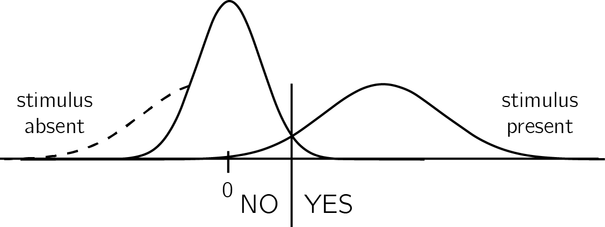
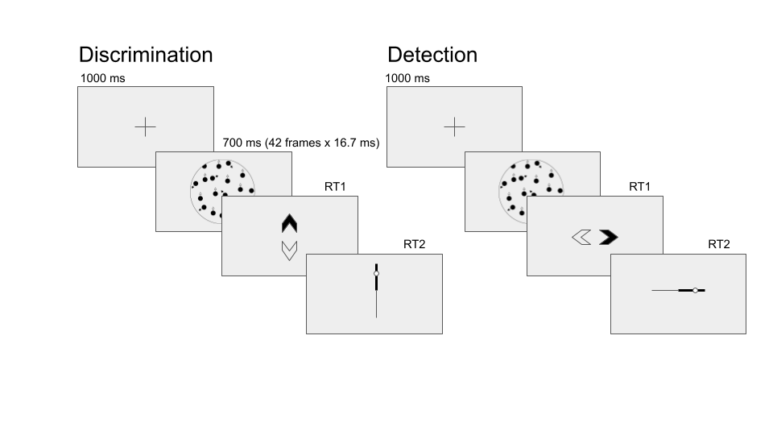
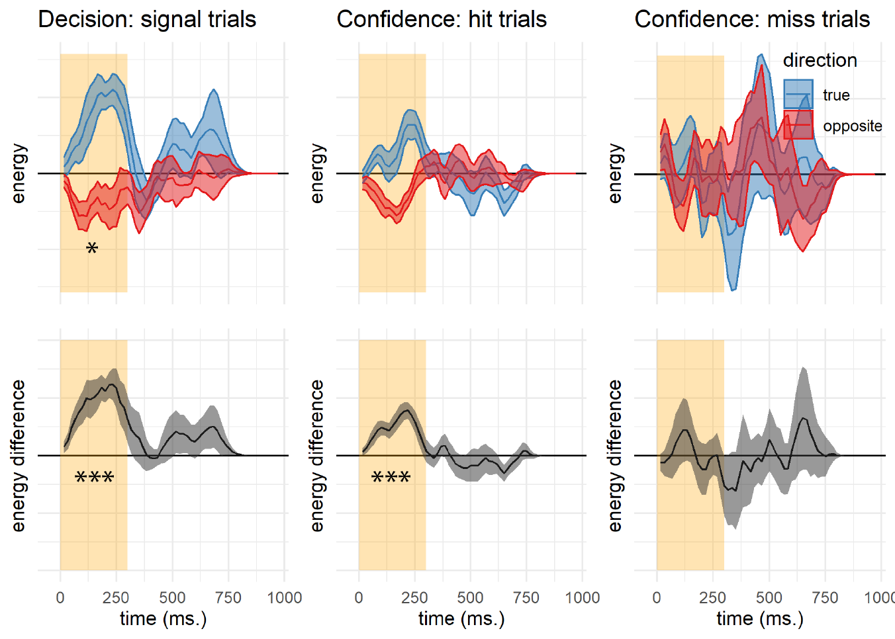
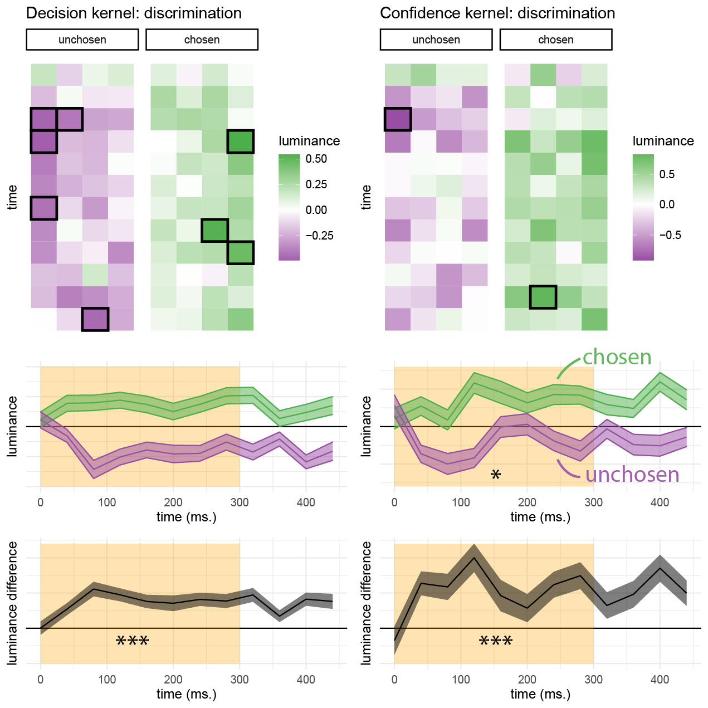
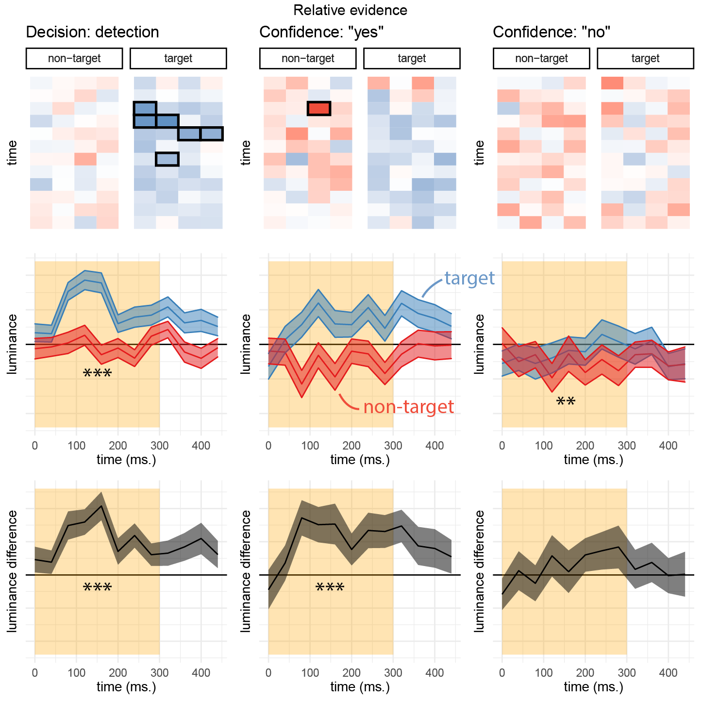
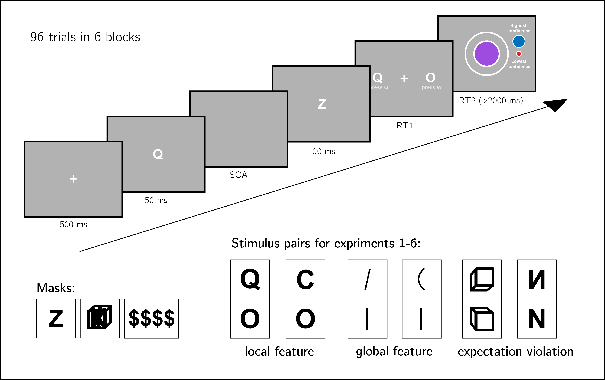
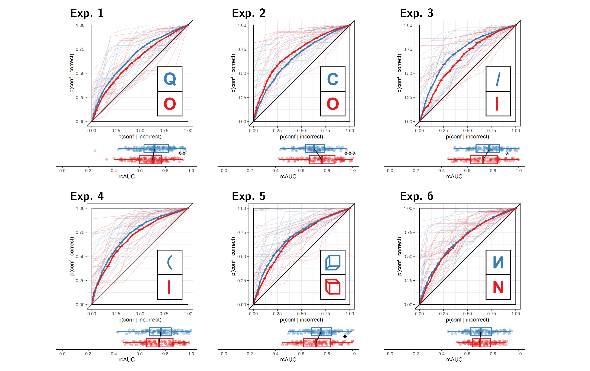

<!--
Above is the YAML (YAML Ain't Markup Language) header that includes a lot of 
metadata used to produce the document.  Be careful with spacing in this header!

If you'd prefer to not include a Dedication, for example, simply delete the section entirely, or silence them (add # before each line). 

If you have other LaTeX packages you would like to include, delete the # before header-includes and list the packages after hyphens on new lines.

If you'd like to include a comment that won't be produced in your resulting file enclose it in a block like this.

If you receive a duplicate label error after knitting, make sure to delete the index.Rmd file and then knit again.
-->


```{r include_packages, include=FALSE}
# This chunk ensures that the thesisdown package is
# installed and loaded. This thesisdown package includes
# the template files for the thesis.
if (!require(remotes)) {
  if (params$`Install needed packages for {thesisdown}`) {
    install.packages("remotes", repos = "https://cran.rstudio.com")
  } else {
    stop(
      paste('You need to run install.packages("remotes")",
            "first in the Console.')
    )
  }
}
if (!require(thesisdown)) {
  if (params$`Install needed packages for {thesisdown}`) {
    remotes::install_github("ismayc/thesisdown")
  } else {
    stop(
      paste(
        "You need to run",
        'remotes::install_github("ismayc/thesisdown")',
        "first in the Console."
      )
    )
  }
}
library(thesisdown)
# Set how wide the R output will go
options(width = 70)

knitr::opts_chunk$set(message = FALSE)
knitr::opts_chunk$set(warning = FALSE)

```

<!--
The acknowledgements, preface, dedication, and abstract are added into the PDF
version automatically by inputting them in the YAML at the top of this file.
Alternatively, you can put that content in files like 00--prelim.Rmd and
00-abstract.Rmd like done below.
-->


```{r eval=!knitr::is_latex_output(), child=here::here("prelims", "00--prelim.Rmd")}

```

```{r eval=!knitr::is_latex_output(), child=here::here("prelims", "00-abstract.Rmd")}

```

<!-- The {.unnumbered} option here means that the introduction will be 
"Chapter 0." You can also use {-} for no numbers on chapters.
-->

# Introduction {.unnumbered}


You are in the grocery shop. On your grocery list are one carton of oat milk and one guava. You search through the shelves and find your favourite oat milk. You place the carton in your basket and move on to the fruit aisle. You visually scan the fruit boxes, but you already have a strong feeling that you will not find guavas in this store. You would have already smelled the guavas if they were anywhere around you. But then again, maybe something is wrong with your sense of smell? You grab a mandarin and sniff it. Your sense of smell is intact. You can be confident that there are no guavas around. 

```{r intro-guava, echo=FALSE, fig.pos='!h', out.width="\\textwidth",fig.scap="Guavas", fig.cap="Guavas."}
knitr::include_graphics("figure/intro/guava.jpg")
```

## Inference about absence

Finding the oat milk carton was straightforward. As soon as you identified it you were convinced in its presence, no reflection or deliberation required. In contrast, concluding that no guavas were present took you longer and involved more complex cognitive processes. You had to rely on the absence of smell or sight of the fruit to reach a conclusion. In philosophical writings, this is known as Argument from Ignorance (*Argumentum ad ignorantiam*): the fallacy of accepting a statement as true only because it hasn't been disproved [@locke1836essay]. Although logically unsound, *Argumentum ad ignorantiam* is widely applied by humans in different situations and contexts [@Oaksford2004]. One particular context which invites such reasoning is that of inference about absence. Positive evidence is rarely available to support inference about absence, and so it is almost exclusively made on the basis of a failure to find evidence for presence. 

Basing inference on the absence of evidence can sometimes be rational from a Bayesian standpoint [@Oaksford2004]. For this to be the case, the individual must know the sensitivity and specificity of the perceptual or cognitive system at hand. For example, in order for the inference "I don't smell a guava, therefore there are no guavas in this store" to be logically sound, I need to know that the probability of me not smelling a guava is very low if it is nearby, and so is the probability of me imagining the smell of a guava when it is not there. In other words, in order to make valid inferences about absences I need to know things about myself and my cognitive processes (see next section \@ref(detectionmodels) for a formal unpacking of this logical derivation). In the above example, this is evident in that my certainty in the absence of a guava increased after smelling the mandarin. Critically, smelling the mandarin did not provide me with any additional information about the layout of the shop or the seasonal availability of tropical fruit, but about my own perceptual system.

<!-- This example of inference about absence is exceptional in that I am able to justify my reasoning. If later my friend asks me why I concluded that no guavas were in the store, I will be able to convince them by explaining how I normally smell guavas from a distance, how I was able to smell the mandarin, and how I concluded that I would have detected a guava if it was present. But explicitly representing a derivation chain from assumptions to conclusions is the exception, not the rule. I can tell with confidence that there is no cup of water on my desk right now. If my friend asks me how I concluded that there was no cup of water on my desk, I would probably answer that I could see that it was not there. But this does not mean that I perceived its absence. It means that I did not perceive its presence, and that I would see if it was there. The first part is a fact about my perception, but the second part is based on intricate knowledge that details how hypothetical glasses of water may look like to me if they were on my desk right now. This builds on my knowledge of glasses, but more relevant to us here, on a *mental self-model*: a simplified description of one's own cognition, perception and attention that allows agents to predict their mental states under different world states.  -->

<!-- Here I argue that this necessary role of a mental self-model for inference about absence makes inference about absence a promising tool to probe people's self-knowledge. Beliefs about my sense of smell, or the expected appearance of cups of water, are only part of a rich and complex knowledge structure, comprising beliefs about the senses (for example, the belief that my hearing is better in the right ear), attention (that I'm easily distracted by noises), and cognition (that I have bad memory for faces). Indeed, mental self-models have been suggested to play an important role in attention control [@wilterson2020attention], theory of mind [@graziano2019attributing], and subjectivity more generally [@metzinger2003phenomenal]. While I can report some of those beliefs, some are not available to report, potentially not even to introspection [@flavell1979metacognition]. This cognitive impenetrability is not different from how grammar rules are represented in cognition. Native English speakers would agree that the question "Who did you see Mary with?" is grammatically acceptable and that the question "Who did you see Mary and?" is not [@ross1967constraints], but most would not be able to tell what rule is violated by the second question. Similarly, one may immediately appreciate that an object is missing, even if they will not be able to provide a better justification for this impression other than "I could see that it was not there".  -->

The following section introduces a computational formulation of this self-knowledge account, based in formal semantics and Bayesian theories of cognition, and exemplifies how different patterns of results can be interpreted in light of this formulation. This formulation is then followed by descriptions of several independent lines of experimental findings that all demonstrate a role for self-knowledge in inference about absence. 

## Probabilistic reasoning, criterion setting, and self knowledge {#formalabsence}

The intimate link between inference about absence and self-knowledge has been recognized in the fields of linguistics, formal logic, and artificial intelligence. In *default-reasoning logic* [@reiter1980logic], a failure to provide a proof for a statement is transformed into a proof for the negation of the statement using the *closed world assumption*: the assumption that a proof would have been found if it was available. Similarly, Linguist Benoît de Cornulier's refers to *epistemic closure*: the notion that all there is to be known is in fact known. This is reflected in his two definitions of *knowing whether* [@de1988knowing]:

### Symmetrical definition: {-} 
'John knows whether P' means that:

1. If P, John knows that P.
2. If not-P, John knows that not-P.

### Dissymmetrical definition:{-}
'John knows whether P' means that:

1. If P, John knows that P.
2. John knows that 1 holds.

### Second-order cognition {#intro-2nd-order}

The symmetric definition entails a *first-order process*, as no knowledge about the system itself is used in the process of inferring the world state. This definition applies to scenarios in which it is possible to have direct evidence against the veracity of a proposition. For example, a hypothetical organism can be equipped with sensors $A$ and $B$ that are tuned to the presence or absence of a predator, respectively. This organism can be said to know whether there is a predator around or not. It will know that a predator is nearby if $A$ is on and $B$ is off, and it will know there is no predator around if $B$ is on and $A$ is off (similar to the *Neuron-Antineuron* architecture in @gold2001neural). Such an organism can be said to implement the symmetrical definition of to know whether presented above.

```{r intro-symmetric, echo=FALSE,out.width="50%",fig.scap="A symmetric implementation of a predator-detector.", fig.cap="A symmetric implementation of a predator-detector."}
knitr::include_graphics("figure/intro/symmetric.png")
```

The symmetric architecture is redundant: assuming perfect information flow there is a perfect negative correlation between the activations of sensors $A$ and $B$. Conversely, the asymmetric definition only necessitates one sensor that is sensitive to the presence of a predator. The organism will know that the predator is around if the sensor is activated, and will conclude that it is not around if the sensor is not activated. This inference is dependent on the confidence of the organism that the sensor will always be activated by the presence of a predator (the negative test validity of its sensor, see section \@ref(detectionmodels)). In that sense, the asymmetric definition entails a *second-order process*.

```{r intro-asymmetric, echo=FALSE,out.width="50%",fig.scap="An asymmetric implementation of a predator-detector.", fig.cap="An asymmetric implementation of a predator-detector."}
knitr::include_graphics("figure/intro/asymmetric.png")
```

This implementation assumes that the absence of a predator is a *default state*. Making this assumption makes the system leaner: instead of having two sensors, only one sensor is needed to mark deviations from a default state [@reiter1980logic]. This default-reasoning has an interesting property: it is *non-monotonous*. Accepting the default state (the absence of a predator in the above example) can only be done tentatively and can potentially be overridden by future evidence. This is not true for the deviant state (here, the presence of a predator), which once accepted cannot be retracted based on the absence of new evidence. In other words, while beliefs about the absence of a predator can be overturn by evidence for presence, beliefs about the presence of a predator cannot be overturn by the absence of evidence for presence. 

The asymmetric architecture requires that the organism knows that the presence of a predator would activate sensor $A$. Only then can the organism take the absence of input from $A$ as evidence for the absence of a predator. Without this knowledge, the organism will be able to represent the presence of a predator (when $A$ is activated), but not its absence. Indeed, it has been pointed out that Reiter's Default Logic is an *autoepistemic logic*, which is based on an agent's ability to introspect over their own belief states [@denecker2011reiter].

The mirror architecture is also possible: taking the presence of a predator to be a default state and using a sensor to mark deviations from this state, i.e., the absence of a predator.

```{r intro-pessimistic, echo=FALSE,out.width="50%",fig.cap="An asymmetric implementation of a predator-detector with a pessimistic prior."}
knitr::include_graphics("figure/intro/pessimistic.png")
```

This architecture is perfectly equivalent to the previous one for systems that are composed of sensors only. All activated sensors in the first architecture are silenced in the second architecture and vice versa. However, for multi-layered systems that generate higher-level representations from sensory input, the second architecture becomes unreasonably huge. In such systems, if the default state is taken to be "everything is happening", then for every sensory input the system should generate the abstract representation of all possible *combinations* of sensory inputs that were not experienced --- $2^n-1$ in total, $n$ being the number of sensors. This number becomes unrealistic even with a modest number of 100 sensors ($2^{99}$, or more than a million million million million millions), and is even less realistic for complex systems that are equipped with eyes, thalami and cortices. 

This has dramatic consequences for systems that need to flexibly represent a rich space of entities or events, using a set of finite building blocks such as sensors and atomic concepts. Such hierarchical, complex systems are compelled to implement an architecture analog to the one in figure \@ref(fig:intro-pessimistic), namely to represent presences only, and infer absence by relying on their own self-representation. In other words, the maintenance of a reliable self-representation can be costly, but not nearly as costly as the alternative of representing absences and presences in a symmetrical way.

### Computational models of detection {#detectionmodels}

<!-- The symmetrical definition is available for statements that can be supported or negated by evidence. For example, the statement "It is not yet 3pm" can be supported if the time on one's phone indicates that it is 2:30pm, or negated if the time on one's phone indicates it is 3:30pm. Therefore, knowing whether it is now 3pm does not rely on self-knowledge. Conversely, statements such as "I have met this person before" can only be supported by positive evidence. This leaves inference about their negation to be made based on the absence of evidence, in conjunction with self-knowledge ("I don't recall seeing this person before, and this is not a face that I would forget"). This is an example of the De Cornulier's dissymmetrical definition: knowing that I would not have forgotten this person's face is in this case 'knowing that 1 holds'.  -->

In psychological experiments of near-threshold detection, participants are required to decide whether a stimulus (for example a faint dot) was present or absent from a display. Using De Cornulier's formulation, we can ask which of the two definitions better describes the inferential machinery that is engaged in detection tasks. Is it the case that participants perceive positive evidence for the absence of a target (symmetrical definition), or alternatively, do they rely on the metacognitive belief that they would have seen the target if it was present (dissymetrical definition)? 

### The High-Threshold model {#htm -}

The *high-threshold model* of visual detection [@blackwell1952studies] formalizes this process in a way that shares conceptual similarity with De Cornulier's dissymemetrical definition. According to this model, the probability of detecting the signal $d$ scales with stimulus intensity. If participants detect the signal, they respond with 'yes'. The parameter $d$ is a perceptual parameter: it captures variables such as objective stimulus intensity (for example, in units of luminance) and sensory sensitivity (for example, of photoreceptors in the retina, or neurons in the visual cortex). The value of this parameter corresponds to the degree to which statement 1 in the dissymetrical definition is true: "If P [a stimulus is presented] John knows that P", or to the reliability of the excitatory edge feeding into sensor *B* in figure \@ref(fig:intro-asymmetric). Critically, in the high-threshold model no similar parameter exists to control the probability of detecting the absence of a signal. In other words, the presence/absence asymmetry is expressed in the absence of a direct edge from 'stimulus absent' to a 'no' response (leftmost dashed line in Fig. \@ref(fig:intro-htm)). In this model, 'no' responses are controlled by the 'guessing' parameter $g$. Unlike $d$, the $g$ parameter is under participants' cognitive control, and can be optimally set to maximize accuracy based on beliefs about the probability of a stimulus, the incentive structure, and critically, metacognitive beliefs about the perceptual sensitivity parameter $d$. 

(ref:HTMcaption) In discrete high-threshold models the presence of a signal can sometimes lead directly to a 'yes' response, but the absence of a signal is never sufficient to lead to a 'no' response. Agents enter node *A* when a stimulus is not detected. 'No' responses are then controlled by the parameter *g* - a 'guessing parameter' that determines the probability of responding 'yes' in case no stimulus was detected. 

```{r intro-htm, echo=FALSE, fig.scap = "The high threshold model", fig.cap='(ref:HTMcaption)', out.width = '70%'}
knitr::include_graphics("figure/intro/htm.png")
```

Given accurate knowledge about the parameter $d$ and the prior probability of signal presence, observers can use *Bayes' rule* to extract the *negative test validity* [@Oaksford2004]: the probability that a signal is absent, given that the they did not perceive a signal. Formally, this equals $p(\neg T|\neg e)$, where $T$ stands for my theory (here, a signal is present) and $e$ for the availability of evidence (here, I can see the signal). Using Bayes' rule, this quantity is determined by the system's *correct rejection rate* ($p(\neg e|\neg T)$), *hit rate* ($p(e|T)$), and the prior probability of $T$. In the high threshold model, the correct rejection rate is always 1 (the threshold is never exceeded by noise alone), so the negative test validity equals:

\begin{equation}
p(\neg T|\neg e)=\frac{\overbrace{p(\neg e|\neg T))}^{CR}(1-p(T))}{1-p(e)} = \frac{1-p(T)}{1-p(e)}
\end{equation}
where 
\begin{equation}
p(e)=\overbrace{p(e|\neg T)}^{FA}(1-p(T))+\overbrace{p(e|T)}^{Hit}p(T) = \overbrace{p(e|T)}^{Hit}p(T)
\end{equation}

Subjects can then use the negative test validity to inform their setting of the $g$ parameter. For example, consider a setting where you know that a target will appear on exactly half of the trials ($p(T)=0.5$), and that half of the targets will be detected ($p(e|T)=0.5$). Using the above formula, and given that in the high-threshold model $p(e|\neg T)=0$, you can conclude that  $p(\neg T|\neg e)=\frac{1-0.5}{1-0.5*0.5}=\frac{2}{3}$. In other words, given that a target was not detected, it is twice as likely that no target was present than that a target was present. This information can now be used to inform your setting of the $g$ parameter before the next experimental trial.

### Signal Detection Theory {#sdt -}

Given its simplicity, the high-threshold model is useful for demonstrating the utility of self-knowledge for inference about absence. Without veridical knowledge about the sensitivity parameter $d$, subjects cannot tell whether they can rely on the absence of evidence when making inference about the absence of a stimulus. Continuous and graded models of perception based on Signal Detection Theory (SDT) express the same asymmetrical nature of presence/absence judgments, where clear evidence can be available for presence but less so for absence (see appendix \@ref(app1-SDT) for an overview of Signal Detection Theory). In signal detection terms, this is expressed as high between-trial variance in sensory strength when a signal is present, but low variance when a signal is absent (see Fig. \@ref(fig:intro-sdt)). Here, instead of controlling the parameter $g$, participants control the placement of a decision criterion. Only trials in which the sensory signal (also termed perceptual evidence, or decision variable) exceeds this criterion will be classified as 'stimulus present' trials. Optimal positioning of the criterion is dependent on beliefs about the likelihood of a stimulus to be present, as well as the spread of the signal and noise distributions and the distance between them [the stimulus-conditional *Probability Density Functions*; @gold2001neural]. Due to the unequal-variance structure, sensory strength in trials where a stimulus is present will be on average farther from the decision criterion compared to when no stimulus is present. As a result, similar to the setting of the $g$ parameter in the high-threshold model, the exact placement of the SDT decision criterion will affect accuracy more when a stimulus is absent, compared to when a stimulus is present. 

Common to both frameworks is the reliance on knowledge about one's own perception (the $d$ parameter in the first case, the shape and position of the sensory distributions in the second) for optimally setting a heuristic for response on trials in which no clear evidence is available for the presence of a signal. As a result, these models draw a strong link between participants' beliefs about their own perception and their behaviour on target-absent trials. In what follows I provide empirical examples for how humans make inference about the absence of objects and memories, and link those examples to the core idea, that inference about absence critically relies on access to a self-model. 

```{r intro-sdt, echo=FALSE, fig.scap="The unequal variance Signal Detection model",fig.cap="In unequal-variance SDT models, decisions are made based on the relative position of the sensory sample to a decision  criterion. The presense/absence asymmetry manifests in the fact that only in some 'target-present' trials, but not in 'target-absent' trials, the sensory sample falls far away from the decision criterion. The dashed line represents the missing tail of the noise distribution: without it, definite evidence is sometimes available for presence, but never for absence.", out.width = '70%'}

```

## Detection: "I would have noticed it"

We start our exploration of inference about absence in cognition with perhaps the most basic of psychophysical tasks - visual detection. In visual detection, participants report the presence or absence of a target stimulus, commonly presented near perceptual threshold. In such tasks, accuracy alone cannot reveal a difference in processing between decisions about presence and decisions about absence, because task accuracy is a function of both 'yes' and 'no' responses. 

However, when asked to report how confident they are in their decision, subjective confidence reports reveal a metacognitive asymmetry between judgments about presence and absence. Decisions about target absence are accompanied by lower confidence, even for correctly rejected 'stimulus absence' trials [@meuwese2014subjective; @kanai2010subjective; @mazor2020distinct]. Put differently, often participants cannot tell if they missed an existing target, or correctly perceived the absence of a target. 

For example, in a study by @meuwese2014subjective, participants were asked to rate their confidence after performing either a perceptual detection task ("Was there an animal present?") or a categorization task ("Was the animal a bird?"). Stimuli were identical for the two conditions, apart from phase-scrambled ‘noise’ images that were only shown on detection blocks. Metacognitive sensitivity was quantified as the area under the response-conditional type-II receiver-operating characteristic curve (AUROC2; see Appendix \@ref(app1-mc)). This measure reflects the agreement between confidence ratings and objective accuracy. AUROC2 was higher for the categorization than for the detection task even when performance on the primary tasks was equated. This difference originated from degraded metacognitive ability for trials in which the subjects reported not detecting an animal. More specifically, it was driven by lower confidence ratings for correct rejection trials rather than high confidence ratings for misses. 

<!-- These fits well with the high-threshold and unequal-variance SDT models described above. Confidence ratings in detection on perceptually degraded stimuli are well captured by an unequal-variance SDT model [@kellij2018foundations]. Importantly for our point here, an unequal-variance setting (whether produced by physiological constraints on neuronal firing rates, or by physical properties of the stimuli themselves) limits the availability of evidence for absence, making inference about absence more challenging. Only in the presence of a target stimulus can participants make a decision without deliberation (without passing in the *A* node in the high-threshold model, or based on a sample very far from the decision criterion in unequal-variance SDT). On these trials, participants can be highly confident in that a target was present -- more confident than when deciding that a target was present after deliberation. These high-confidence trials will not be available for decisions about target-absence. -->

```{r intro-meuwese, echo=FALSE, fig.cap="Task design for Meuwese et al (2014). Subjects performed both the detection task and the categorization task in 12 interleaved blocks of 60 trials. Stimulus visibility was manipulated between subjects, by either pattern masking or degrading (phase scrambling). During the detection task, the degraded or masked stimulus contained either an animal (cat, bird, or fish; target) or a fully phase-scrambled image (distractor). On every trial, subjects were asked “Was there an animal present?” For the categorization task, a target category was randomly selected for each block (i.e., “bird”), and the stimuli consisted of a degraded/masked cat, bird, or fish. Subjects were asked whether the animal was a member of the target category (i.e., “Was the animal a bird?”). Subjects rated their confidence in the correctness of their response on a scale from 1 (not at all confident) to 6 (very confident). By linking confidence ratings with objective performance, metacognitive ability (MA) was calculated. b An image that is phase scrambled to different coherence levels: from left to right, 0.4 to 0.75  phase coherence, which was the range of phase coherence levels and step sizes used in degraded condition of the experiment.", fig.scap="Task design for Meuwese et al (2014).", out.width = '70%'}
#knitr::include_graphics("figure/intro/Meuwese.jpg")
```

These and similar observations of a metacognitive disadvantage for inference about absence [@meuwese2014subjective; @kanai2010subjective; @mazor2020distinct; @kellij2018foundations], as well as a similar pattern in response times [decisions about absence tend to be slower than decisions about presence; @mazor2020distinct] fit well with the high-threshold and unequal-variance SDT models described above. Only in a subset of target-present trials, but in no target-absent trial, can participants make a decision without deliberation (without passing in the *A* node in the high-threshold model, or based on a sample very far from the decision criterion in unequal-variance SDT). On these trials, participants can be highly confident in that a target was present -- more confident than when deciding that a target was present after deliberation. These high-confidence trials will only be available when a target is indeed present, giving rise to a metacognitive disadvantage for inference about absence. 
 
In line with a central role for self-monitoring in inference about absence, the lower metacognitive sensitivity for 'stimulus absence' judgments diminishes or reverses when targets are masked from awareness by means of an attentional manipulation [@kanai2010subjective; @kellij2018foundations]. For example, when an attentional-blink paradigm is used to control stimulus visibility, participants are significantly more confident in their correct rejection trials than in their misses. What is it in attentional manipulations that improves participants' metacognitive insight into their judgments about stimulus absence? One compelling possibility is that a blockage of sensory information at the perceptual stage is not accessible to awareness [and is thus phenomenally transparent; @metzinger2003phenomenal], whereas fluctuations in attention are accessible to introspection [and are thus phenomenally opaque; @limanowski2018seeing]. This monitoring of one's attention state makes it possible to use premises such as "I would not have missed the target" in rating confidence in absence under attentional, but not under perceptual manipulations of visibility. Put in more formal terms, attentional manipulations increase metacognitive access to the likelihood function going from world-states to perceptual states, thereby allowing trial-to-trial tuning of the decision criterion or the *g* parameter. 

Studies contrasting detection responses and confidence ratings under different levels of attention provide more support for this metacognitive account of detection 'no' responses. For example, participants are more likely to report the absence of a target in a specific location if their attention was directed to this location before stimulus onset, compared to when their attention was directed to a different location [@rahnev2011attention]. Similarly, participants are more likely to correctly report the absence of a target embedded in a stimulus (for example, a grating embedded in noise) when the stimulus is presented at the center of their visual field, compared to the periphery [@odegaard2018inflation; @solovey2015decisional]. Note that both effects are the exact opposite of what is expected based on that attention boosts sensory gain [@parr2019attention], because an increase in sensory gain without a change to the decision criterion would make false alarms, not correct rejections, more prevalent. They are however consistent with the idea that participants deploy a metacognitive strategy, shifting their decision criterion to accord with the expected strength of evidence given their current attentional state. If participants overestimate the effect of attention on their visual sensitivity, decision criterion, as measured in Signal Detection Theory, will be higher for attended versus unattended stimuli (see Fig. \@ref(fig:intro-detection)). Indeed, detection criterion is typically found to be lower for unattended stimuli [@odegaard2018inflation; @solovey2015decisional; @rahnev2011attention].

```{r intro-detection, echo=FALSE, fig.scap="The effect of erroneous beliefs about perceptual sensitivity on decision criterion", fig.cap="Left panel: Sensitivity to near-threshold stimuli is lower in the visual periphery. For example, d' equals 1.0 in top left of the screen, but is much higher near the center. Right panel: the perceptual decision criterion is lower (more 'yes' responses) in the visual periphery.  Middle panel: if the effect of eccentricity on visual sensitivity is overestimated in participants' mental self-model (here d' in the top left corner is estimated to be 0.3), a lowering of the decision criterion in the visual periphery as observed in Odegaard et al. (2018) is expected.", out.width = '100%'}
knitr::include_graphics("figure/intro/detection.png")
```

## Visual search: "I would have found it" {#intro:search}

In visual search tasks, participants are presented with an array of stimuli and are asked to report, as quickly and accurately as possible, whether a target stimulus was present or absent in the array. Moving one step up the complexity ladder, the accumulation of information in visual search is not only a function of stimulus strength and sensory precision, but is also affected by the endogenous allocation of attention to items in an observed scene. As a result, search time varies as a function of the number of distractors, their perceptual similarity to the target and their spatial arrangement, among other factors [for a review, see @wolfe2008visual]. These factors affect not only the time taken to report the presence of a target, but also the time taken to report its absence. For example, when searching for an orange target among red and green distractors, the number of distractors has virtually no effect on search time [e.g., @d1991color] - a phenomenon known as 'pop-out'. The bottom-up pop-out of a target can explain the immediate recognition of the presence of a target, irrespective of distractor set size. But this perceptual pop-out cannot, by itself, explain the immediate recognition of target absence, because in target absence trials there is nothing in the display to pop out. 

Computational models of visual search provide different accounts for search termination in target-absent trials. In *Feature Integration Theory*, visual search comprises a pre-attentive, automatic process, and a later stage that is under participants' cognitive control. According to this model, difficult searches for a conjunction of features (*conjunction searches*, for example, searching for a purple *7* among orange and purple digits) terminate with a 'no' response once participants finished scanning all the items in the display [a *self-terminating exhaustive search*; @treisman1980feature]. However, this model predicts that search-time variability in such conjunction target-absent trials should be lower than in conjunction target-present trials - a pattern that is not observed in empirical data [@wolfe2010reaction; @moran2016serial]. Furthermore, Feature Integration Theory does not provide an explicit account of target-absent responses in highly efficient parallel searches.


```{r intro-termination-models, echo=FALSE, out.width="100%", fig.scap = 'Models of search termination', fig.cap="Models of search termination. For the same visual array (left panel) search terminated immediately for one target (a green 7, lower row), but takes longer for another target (a purple 7, upper row). Different models of visual search explain this difference by postulating search termination mechanisms that are sensitive to the counterfactual difficulty of finding a hypothetical target."}
knitr::include_graphics(path = "figure/intro/termination_models_wide.png")
```


In early versions of the *Guided Search* model, 'target absent' judgments are the result of exhausting the search only on items that surpass a learned 'activation threshold' [@chun1996just; @wolfe1994guided]. In difficult searches, the activation threshold is set to a low value, thereby requiring the scanning of multiple items before a 'no' response can be delivered. In contrast, in easy searches the activation threshold is set to a high value, reflecting a belief that a target would be highly salient (see Fig. \@ref(fig:intro-termination-models)). Furthermore, some very long searches are terminated once subjects concluded that "it rarely takes this long to find a target" [@wolfe1994guided].

A more recent version of the Guided Search model (*Competitive Guided Search*) described visual search as a stochastic process where items are selected for inspection based on their dynamic weight in a salience map. Critically, this model also included a *quitting unit* that is selected with a certain probability [@moran2013competitive]. The search terminates once an item is recognized as the target, or once the quitting unit is selected. In this model, the salience of the quitting unit changes following the rejection of distractors. This incremental change is controlled by a parameter ($\Delta w_{quit}$) that is "under strategic control of the observer". For difficult searches, this parameter can be set to a low value, so that more items can be scanned before search termination. In very easy 'pop-out' searches this parameter can be set to a high value, making it possible to terminate a search after rejecting only one item.   

In the latest formulation of the Guided Search model [@wolfe2021guided], searches are terminated once a noisy accumulator reaches a *quitting threshold*. Setting the quitting threshold high allows participants to scan more items before concluding that a target is absent. The mechanism by which participants calibrate the quitting threshold is not specified in the model. 

Finally, in a fixation-based model of visual search, the number of items that are concurrently scanned within a single fixation (the *functional visual field*) is dependent on search difficulty: with more items for easy searches and less items for more difficult ones [@hulleman2017impending].  

Importantly for our point here, the activation threshold, $\Delta w_{quit}$, the quitting threshold and the functional visual field all share high similarity with the SDT criterion or the high-threshold *g* parameter, and are influenced by explicit or implicit beliefs about the subjective salience of a hypothetical target in the array -- a form of self-knowledge. 

<!-- @moran2013competitive proposed a Competitive Guided Search model, according to which 'target absent' responses are the result of selecting a 'quit unit' with probability that inversely scales with the salience of items in the display. In this model too, bottom-up activation is not sufficient to explain the lack of a distractor set-size effect on 'no' responses in feature search. The authors note that this effect may be driven by participants' expectation that in feature search, it is unlikely that attention will be drawn to a distractor when a target exists. Again, this is a form of self-knowledge, and more specifically beliefs and predictions about attention and search difficulty.  -->

Usually, search times in target-present and target-absent trials are highly correlated, such that if participants take longer to find the target in a given display, they will also take longer to conclude that it is absent from it [@wolfe1998can]. This alignment speaks to the accuracy of the mental self-model: participants take longer to conclude that a target is missing when they believe they would take longer to find the target, and these beliefs about hypothetical search times are generally accurate. In the two upper panels of Fig. \@ref(fig:intro-search) I provide two examples of cases where beliefs about search behaviour perfectly align with actual serach behaviour, leading to optimal search termination. 

However, self-knowledge about attention in visual search is not always accurate. For example, when searching for an unfamiliar letter (for example, an inverted N) among familiar letters (for example, Ns), the unfamiliar letter draws immediate attention without a need for serially attending to each item in the display. However, participants are slow in concluding that no unfamiliar letter is present, exhibiting a search time pattern consistent with a serial search for 'target absent' responses only [@wang1994familiarity; @zhang2020visual]. In the context of my proposal here, this can be an indication for a blind-spot of the mental self-model, failing to represent the fact that an unfamiliar letter would stand out (see Fig. \@ref(fig:intro-search), lower panel). 

<!-- Importantly, collecting explicit metacognitive judgments of expected search times may lead to underestimating the richness and accuracy of the mental self-model. For example, participants may not have introspective access to their knowledge about color pop-out, but may still be able to act on this information when deciding to terminating their search. Here also, inference about absence provides a unique window into the mental self-model that does not depend on introspective access. -->

```{r intro-search, echo=FALSE, fig.scap ="Computational models of visual search", fig.cap="Upper panel: A target that is marked by a unique colour imemdiately captures attention (left). This fact is available to participants' self-model (middle). As a result, participants can immediately terminate a search when no distractor shares the color of the target (right). Middle panel: When searching for the letter N among inverted Ns, the target does not immediately capture attention, and the serial deployment of attention is necessary (left). Participants are aware of this (middle). As a result, participants perform an exhaustive serial search before concluding that a target is absent (right). Lower panel: When searching for an inverted N among canonically presented Ns, the inverted letter immediately captures attention (left). This fact is not specified in the self-model (middle). As a result, participants perform an unncessary exhaustive serial search before concluding that a target is absent (right).", out.width = '70%'}
knitr::include_graphics("figure/intro/search.png")
```

## Memory: "I would have remembered it"

Inference about absence not only applies to external objects (such as guavas, or visual items on the screen), but also to mental variables such as memories and thoughts. For example, upon being introduced to a new colleague, one can be certain that they have not met this person before. In the memory literature, this is known as *Negative recognition*: remembering that something did not happen [@brown1977memorability]. In the lab, a typical recognition memory experiment comprises a learning phase and a test phase. In the learning phase participants are presented with a list of items, and in the test phase they are asked to classify different items as 'old' (presented in the learning phase) or 'new' (not presented in the learning phase). 

Recognition memory is often modeled using threshold or signal detection models, or a combination of the two [*Dual Process models*; @wixted2007dual; @yonelinas1996signal]. For example, in SDT models [@banks1970signal], participants compare a 'memory trace' against an internal criterion to determine whether the item should be classified as old or new. Like perceptual detection, the placement of the decision threshold reflects beliefs about the expected signal for old and new items. If participants believe that learned items would produce very salient memory traces, they can safely increase the decision criterion without risking mistaking old items for being new. 

The role of self-knowledge in negative recognition is exemplified in the *mirror effect*: items that are more likely to be correctly endorsed as 'old' are also more likely to be correctly rejected as 'new'. In SDT terms, this effect can be described as the adjustment of the decision criterion to the expected memory trace of an item, had it been present [its *memorability*; @brown1977memorability]. For example, @brown1977memorability found that when asked to memorize a list of names, subjects are more confident in remembering that their own name was on the list, but also in correctly remembering when it was *not* on the list. For this effect to manifest, it is not sufficient that subjects' memory was better for their own name. They also had to know this fact, and to use it in their counterfactual thinking ("I would remember if my name were on the list"). 

The mirror effect has also been demonstrated for the name of one's hometown [@brown1977memorability], for word frequency [rare words are more likely to be correctly endorsed or rejected with confidence; @brown1977memorability; @glanzer1976analysis], word imaginability [@cortese2010recognition; @cortese2015mega] and for study time [subjects are more likely to correctly classify new items as new if learned items are presented for longer; @stretch1998difference; @starns2012strength]. 

In a clever set of experiments, @strack2005know established a causal link from metacognitive beliefs about item memorability and decisions about the absence of memories. In two experiments, participants in one group were led to believe that high-frequency words (words that are used relatively often) are more memorable than low-frequency words, while participants in a second group were led to believe that low-frequency words were more memorable than high-frequency words. This manipulation affected participants' tendency to reject high-frequency or low-frequency items in a later recognition-memory task. Participants who believed that high-frequency words were more memorable were more likely to classify high-frequency words as 'new', suggesting that their metacognitive belief informed their inference about the absence of a memory ('I would have remembered this word'). Inversely, participants who believed that low frequency words were more memorable showed the opposite pattern. 

One formal description of this inferential process is provided by the *likelihood ratio* rule. According to this model, subjects compare the likelihood of incoming evidence under two competing models of the world - the presence or absence of a memory trace, and choose the model under which the incoming evidence is more likely. In order to be able to compare the likelihood of an observation under alternative models, subjects must have a model of their cognition that is sufficiently detailed to yield conditional probability distributions. In experiments where the probabilities of an item to be old or new is equal, the likelihood ratio strategy is optimal [@neyman1933ix]. As a cartoon example, a participant may expect the perceived memory trace for frequent words to be centered around 0.3, and around 0.6 for infrequent words. Using the likelihood ratio rule, this participant will be more confident in that a word is new if the observed memory is 0 and the word is infrequent, compared to when the word is frequent. The likelihood ratio approach has been successful in explaining several features of recognition memory, including the mirror effect in negative recognition [@glanzer1993regularities; @glanzer2009likelihood].

Just like in the cases of near-threshold detection and visual search, the intuitive metacognitive knowledge behind the mirror effect may not be available for explicit report, at least not in the absence of direct experience with the task itself. In their explicit memorability reports, subjects often have little to no declarative metacognitive knowledge of which items are more likely to be remembered, even under conditions that give rise to a mirror effect. For example, although more frequent words are more likely to be forgotten (and incorrectly classified as old), participants tended to judge them as more memorable than infrequent words [@benjamin2003predicting; @begg1989memory; @wixted1992subjective; @greene1994mirror]. However, participants showed metacognitive insight into the negative effect of word frequency on memorability when memorability was rated after (and not before) negative recognition judgments [@guttentag1998memorability; @benjamin2003predicting]. Thus, the implicit metacognitive knowledge that supports accurate negative recognition may become available for explicit report only when participants introspect about their recognition attempts. 

## The development of a self-model

As exemplified above, the inferential processes that result in judgments of absence share important commonalities, regardless of whether it is the absence of an isolated target stimulus, of one target in an array of distractors, or of a non-physical entity such as a memory. First, in all three cases, to infer absence agents must possess some self-knowledge (under what conditions are they likely to miss a target, how long they should expect to search before finding a target in an array of distractors, or which items are likely or unlikely to be remembered). Second, agents must be able to use this counterfactual knowledge and compare it with their current state (for example, having no recollection of an item, or not seeing a target stimulus). 

At what developmental stage do humans master the necessary self knowledge and inferential machinery to make efficient and accurate inference about absence? In the context of memory, evidence suggests that the necessary self-knowledge and the capacity for counterfactual thinking exist in primary form already in early childhood, but continue to develop until adulthood. For example, children as young as 5 were able to give meaningful assessments the memorability of hypothetical life events and to use this metacognitive knowledge to inform their judgments about the nonoccurrence of an event, but this ability did not reach full maturation until the age of 9 [@ghetti2004if]. Other studies identified a qualitative transition between the ages 7 and 8 in the ability of children to rely on expected event memorability for inference about the absence of a memory [@ghetti2010knowing; @ghetti2008development]. This developmental discontinuity was attributed to the development of counterfactual thinking and second-order theory of mind. Indeed, the ability to infer that something did not happen based on that it would have been remembered critically relies on one's ability to ascribe mental states to their counterfactual self. 

In perception, the ability to represent absences lags behind the ability to represent presences, but reaches maturation much earlier than in the case of memory. In a study by @coldren2000asymmetries, 4 month-old infants were familiarized with a pair of identical letters (e.g., the letter 'O'), presented side by side. In the test phase, one of the letters was replaced with a novel letter, which differed from the familiar letter either in the presence or the absence of a distinctive feature. For example, when infants that were familiarized with the letter O were tested on a display of one O and one Q, the novel letter (Q) was marked by the presence of a distinctive feature. Conversely, for infants that were familiarized with the letter Q, the novel letter O was marked by the absence of a distinctive feature. Infants showed preferential looking at the novel letter only when this letter was marked by the presence, not the absence, of a distinctive feature. A similar feature-positive effect was still evident in the learning behaviour of preschool children. When presented with two similar displays, 4 and 5 year old children were able to learn to approach the display with a distinctive feature but were at chance when trained to approach a display that is marked by the absence of a distinctive feature [@sainsbury1971feature]. 

Together, these results suggest that the capacity to infer the absence of physical and mental entities and the ability to use beliefs about absence to guide learning develop through infancy and early childhood. In the context of this thesis, the development of this capacity may reflect, at least in part, the gradual expansion of different aspects a mental self-model, and the development of the capacity to use this model for counterfactual reasoning. For example, a baby that is not drawn to the new letter 'O' after being habituated to the letter 'Q' may not yet represent the absence of the distinguishing feature, because they lack the implicit self knowledge to know that they would notice the lower diagonal line if it was present. More abstractly, a 7 year-old may not be able to confidently tell that they did not spread a lotion on a chair [a highly memorable action, due to its bizarreness; @ghetti2008development], because they lack the self-knowledge to know that if they had, they would remember doing so.  

## This thesis

This thesis revolves around inference about absence in perception, and its reliance on self-modeling. First, in Chapter \@ref(ch-termination) I look at inference about absence in visual search. Like detection and memory, in visual search too inference about the absence of a target item must rely on some form of self-knowledge (see section \@ref(intro:search)). This study sought to pinpoint the origin of this knowledge. For example, is the knowledge that some visual searches are easier than others available to subjects in everyday life, or is it learned from experience in the artificial context of performing many trials of the same visual search task again and again? Due to the typical many-trials/few-subjects structure of lab-based experiments, classical visual search studies could not tell between these alternative options. By collecting data from a large number of online participants, in this first study we were able to reliably characterize participants' search termination in the first few trials of an experiment. 

In Chapter \@ref(ch-termination), Exp. 2, we found that participants gave accurate estimates of search difficulty, showing good metacognitive knowledge of key findings in the visual search literature. However, metacognitive estimates were given at the end of the experiment, allowing participants to base their estimates on their recent task experience. In Chapter \@ref(ch-MVS) I asked participants to estimate search times for new search arrays, before performing these searches. Here I found that an internal model of visual search is rich and accurate, and also that it is person-specific in that it is better aligned with subjects' own search behaviour than with the search behaviour of other participants. 

In Chapters \@ref(ch-RC) and \@ref(ch-fMRI) I looked at a different perceptual task in which participants make inference about presence and absence: near-threshold detection. Detection was compared against discrimination as a control task in which stimulus category is inferred in a symmetrical setting (for example, right versus left motion). In Chapter \@ref(ch-RC), I used reverse correlation to ask what perceptual features contribute to decision and confidence in detection and discrimination. In three experiments (one lab-based and two conducted online), I replicated the 'positive evidence bias' in discrimination confidence, and found that a similar bias exists in detection response, establishing a link between confidence in disrimination and decisions about presence and absence.

In Chapter \@ref(ch-fMRI) I used functional magnetic resonance imaging (fMRI) to compare brain activation in decisions about stimulus type, stimulus presence, and stimulus absence, as well as in confidence ratings in these decisions. I found a quadratic modulation of brain activity by confidence in prefrontal and parietal cortices. This modulation was stronger for detection judgments (decisions about stimulus presence or absence) than for discrimination judgments (decisions about stimulus type). Computational models of internal and external precision monitoring captured some, but not all aspects of the observed data.

Finally, in Chapter \@ref(ch-asymmetry) I focused on three behavioural asymmetries in detection (in confidence, response time, and metacognitive sensitivity), and asked whether similar asymmetries exist for the detection not of entire objects or stimuli, but also of stimulus parts, stimulus features, and expectation violations. The idea to look at presence and absence of sub-stimulus entities drew inspiration from reports of *visual search asymmetries*, where finding a stimulus that is marked by the presence of a feature relative to distractors is easier than finding a stimulus that is marked by the absence of a feature. Results from six pre-registered experiments indicated at least two sources of asymmetry between presence and absence, that independently contribute to differences in response time and confidence on the one hand, and in metacognitive sensitivity on the other hand.


<!--chapter:end:index.Rmd-->


```{r termination_load_pkgs, echo=FALSE, message=FALSE, include=FALSE}

# # Load packages
library('broom')
library("papaja")
library('reticulate')
library('tidyverse')
library('cowplot')
library('MESS') # for AUCs
library('lsr') # for effect sizes
library('pwr') # for power calculations
library('brms') # for mixed effects modeling
library('BayesFactor') # for Bayesian t test
library('jsonlite') #parsing data from sort_trial
library('thesisdown')
library('knitr')
# r_refs("r-references.bib")


knitr::opts_chunk$set(message = FALSE)
knitr::opts_chunk$set(warning = FALSE)

```

# Efficient search termination without task experience: the role of second-order knowledge about visual search {#ch-termination}

#### Matan Mazor & Stephen M. Fleming {.unnumbered}

As a general rule, if it is easy to detect a target in a visual scene, it is also easy to detect its absence. To account for this, models of visual search explain search termination as resulting either from counterfactual reasoning over second-order representations of search efficiency, automatic extraction of ensemble statistics of a display, or heuristic adjustment of a search termination strategy based on previous trials. Traditional few-subjects/many-trials lab-based experiments render it impossible to disentangle the unique contribution of these different processes to absence pop-out - the immediate recognition that a feature is missing from a display. In two pre-registered large-scale online experiments (N1=1187, N2=887) we show that search termination times are already aligned with target identification times in the very first trials of the experiment, before any experience with target presence. Exploratory analysis reveals that second-order knowledge about search efficiency can be used to guide decisions about search termination even if it is not available for explicit report. We conclude that for basic stimulus properties, efficient inference about absence is independent of task experience, and relies instead on implicit second-order knowledge.

## Introduction 

Searching for the only blue letter in an array of yellow letters is easy, but searching for the only blue X in an array of yellow Xs and blue Ts is much harder [@treisman1980feature]. This difference manifests in the time taken to find the target letter, but also in the time taken to conclude that the target letter is missing. In other words, easier searches not only make it easier to detect the presence of a target, but also to infer its absence. Differences in the speed of detecting the presence of a target have been attributed to pre-attentional mechanisms [@treisman1980feature] and guiding signals [@wolfe2007guided; @wolfe2021guided] that can sometimes make the target item 'pop out' immediately without any attentional effort. In target-absent trials, however, there is nothing in the display to pop out. This raises a fundamental question: what makes some decisions about target absence easier than others?

Models of search termination offer three classes of answers to this question, based on counterfactual reasoning, ensemble perception, and task heuristics. According to counterfactual models, decisions about target absence are guided by prior beliefs about search efficiency ("If it were present, I would have found the red book by now"). These comprise beliefs about regularities in the environment ("it it were present, the book would have been on this shelf"), and second-order beliefs about one's own perception and attention ("the red cover would have immediately drawn my attention"). In recent versions of the Guided Search model [@wolfe2012quit; @wolfe2021guided], for example, search termination is triggered by a noisy quitting signal accumulator reaching a *quitting threshold*, which can be adapted to maximize long-time search efficiency, and be affected by prior second-order beliefs about the effects of set size and crowding on search difficulty [@wolfe2012quit]. Similarly, in Competitive Guided Search, the probability of terminating a search is a function of several factors, including a free parameter that indexes counterfactual beliefs about finding a target, had it been present [@moran2013competitive]. Finally, in a fixation-based model of visual search, the number of items that are concurrently scanned within a single fixation (the *functional visual field*) depends on the expected difficulty of finding a hypothetical target: with more items for easy searches and fewer items for more difficult ones [@hulleman2017impending]. 

Ensemble perception accounts of visual search postulate that some global properties of a display can be extracted automatically and immediately, and that in some cases these global properties are sufficient to conclude that a target is absent. For example, according to Feature Integration Theory, pre-attentive activation in *feature maps* can provide participants with information about the presence or absence of a feature in the display [@treisman1980feature]. The absence of a relevant feature is then sufficient to make an immediate 'target absent' decision, without processing any individual stimulus. 

Finally, heuristic-based models suggest that quitting parameters are acquired by participants as they perform a task, sometimes by following very simple rules. For example, in one model, an internal *activation threshold* decreases following incorrect and increases following correct 'no' responses [@chun1996just]. A higher activation threshold results in the scanning of less distractors, giving rise to shorter search times for easier searches. This simple heuristic provides an excellent fit to data from a visual search task with hundreds of trials, and does so without requiring that subjects hold any prior knowledge or expectations about search efficiency.

In traditional visual search experiments, where participants perform hundreds of trials of similar searches, it is impossible to disentangle the contributions of these three putative mechanisms to search termination. Yet, the three accounts make different predictions for the earliest trials of a visual search experiment, where participants encounter the stimuli for the first time. In these trials, quitting time cannot reflect the adaptive adjustment of a threshold based on previous trials, or the statistical learning of regularities in the experiment. Instead, efficient search termination without task experience must rely on an immediate perception of ensemble properties of the display, prior second-order knowledge about one's own search efficiency, or a combination of both. 

<!-- . This makes search time in the first few trials of a task a critical window into participants’ metacognitive knowledge about attention and visual search. Furthermore, participants' ability to learn from positive examples (target-present trials), and their ability to generalize their knowledge across stimulus types and displays, offers an opportunity to study the structure of this simplified metacognitive knowledge, its building blocks, and the inductive biases that guide its acquisition. In this study, we use target-absent trials in visual search to ask what participants know about their spatial attention before engaging with the visual search task, and how this knowledge is built and expanded based on experience. -->

In two pre-registered experiments we focus on feature search for colour and shape. Focusing on the first four trials of the task, we ask whether prior experience with the task and stimuli is necessary for efficient search termination in feature searches. Unlike typical visual search experiments that comprise hundreds or thousands of trials, here we collect only a handful of trials from a large pool of online participants. This unusual design allows us to reliably identify search time patterns in the first trials of the experiment. By making sure that the first displays do not include the target stimulus, we are able to ask what knowledge is available to participants about their expected search efficiency prior to engaging with the task. 

To anticipate our results, we find that efficient search termination for single features does not depend on task experience. In an exploratory analysis on a subset of participants, we further show that efficient search termination is also independent of explicit metacognitive knowledge about the task. We argue that without second-order knowledge about one's own perception and attention, ensemble perception alone is not sufficient for efficient search termination, and interpret our results as revealing a role for implicit second-order knowledge of search efficiency in search termination.

<!-- We dub this approach *zero-shot search termination* in a tribute to the study of 'zero-shot learning' in machine learning: the ability to classify unseen categories of stimuli, based on generalizable knowledge from other categories [@xian2017zero]. Efficient (i.e., fast and accurate) quitting in target-absent trials prior to any target-present trials would indicate that knowledge about the salience of a divergent color or shape is available at some form in the cognitive system, and that this knowledge can flexibly be put to use for counterfactual reasoning in the process of inference about absence. Conversely, inefficient search in these first trials would mean that positive experience is necessary for this knowledge to be acquired, or to be expressed.  -->

<!-- In the experiments outlines below, target-present trials are used as learning samples (where subjects observe how efficiently they can find a target), and target-absent trials are used as test trials (where subjects terminate the search when they believe a target would have been found). By testing participants' prior knowledge state, and their ability to learn and generalize from a few positive samples, we lay the groundwork for building a model of the Visual Search Schema. -->

 
```{r termination_load_and_format_data, echo=FALSE, cache=TRUE}

E1.df <- read_csv('data/termination/exp1/jatos_results_batch1.csv', lazy=FALSE) %>%
  rename('subj_id' = 'subject_identifier') %>%
  mutate(subj_id=factor(subj_id))

E1.export <- read_csv('data/termination/exp1/prolific_export_batch1.csv', lazy=FALSE) %>%
  filter(status=='APPROVED')

E1.N_total <- E1.df$subj_id%>%unique()%>%length()

E1.search_df <- E1.df %>%
  filter((test_part=='absence1') | 
           (test_part=='absence2') | 
           (test_part=='presence1')) %>%
  dplyr::select('subj_id','test_part','set_size','target_present','correct','RT','search_type') %>%
  #response was not coded directly, so is instead inferred from accuracy and stimulus
  mutate(response = ifelse(correct==1, target_present, 1-target_present)) %>%
  #in order to correct for serial position effects, I'm extracting a centered serial
  #position value for each trial in a block (-1.5,-0.5,0.5,1.5)
  mutate(trial = sequence(rle(as.character(subj_id))$lengths),
         i = trial%%4,
         i = ifelse(i==0,1.5,i-2.5),
         #convert to factor
         test_part = factor(test_part, levels = c('absence1','presence1','absence2')),
         search_type = factor(search_type, levels = c('conjunction','color')))

#Exclusion parameters:
minRT <- 250
maxRTsubj <- 5000 # for subject exclusion
maxRTtrial <- 1000 #for trial exclusion
min_acc_search <- 5/6

#Obtain list of excluded subjects
E1.excluded <- E1.search_df %>%
  group_by(subj_id) %>%
  summarise(acc = mean(correct),
            RTlow = quantile(RT,0.25),
            RThigh = quantile(RT,0.75)) %>%
  filter(acc<min_acc_search | RTlow<minRT | RThigh>maxRTsubj) %>%
  dplyr::select('subj_id')


#Obtain list of excluded subjects
E1_no_RT_exc.excluded <- E1.search_df %>%
  group_by(subj_id) %>%
  summarise(acc = mean(correct)) %>%
  filter(acc<min_acc_search) %>%
  dplyr::select('subj_id')

#A function to control for within-block slope effects of serial order
correctOrderEffects <- function(df) {
  fit <- lm(RTfiltered ~ i, data=df)
  slope = fit$coefficients[2];
  return(df$RTfiltered-slope*(df$i))
}

#Correct order effects
E1.search_df <- E1.search_df %>%
  mutate( include=RT>minRT & 
            RT<maxRTtrial & 
            correct==1 & 
            !subj_id%in%E1.excluded$subj_id,
          RTfiltered = ifelse(include, RT, NA)) %>%
  group_by(test_part) %>%
  do(mutate(.,RTcorrected = correctOrderEffects(.)))

#Correct order effects
E1_no_RT_exc.search_df <- E1.search_df %>%
  mutate( include= correct==1 & 
            !subj_id%in%E1_no_RT_exc.excluded$subj_id,
          RTfiltered = ifelse(include, RT, NA)) %>%
  group_by(test_part) %>%
  do(mutate(.,RTcorrected = correctOrderEffects(.)))

E1.descriptives <- E1.search_df %>% 
  filter(!subj_id%in%E1.excluded$subj_id) %>%
  group_by(subj_id) %>%
  summarise(accuracy=mean(correct), RT=median(RT));

E1.num_RT_exclusion_per_s <- E1.search_df %>%
  filter(RT>maxRTtrial | RT<minRT) %>%
  group_by(subj_id) %>%
  tally() %>%pull(n) %>%
  mean()

E1.num_error_exclusion_per_s <- E1.search_df %>%
  filter(correct==0) %>%
  group_by(subj_id) %>%
  tally() %>%pull(n) %>%
  mean()
```

## Experiment 1
In Experiment 1, we examined search termination in the case of colour search. When searching for a deviant colour, the number of distractors has virtually no effect on search time [*colour pop-out*; e.g., @d1991color], for both 'target present' and 'target absent' responses. Here we asked whether efficient quitting in colour search (*color absence pop-out*) is dependent on task experience. A detailed pre-registration document for Experiment 1 can be accessed at [osf.io/yh82v/](osf.io/yh82v/).

### Participants

The research complied with all relevant ethical regulations, and was approved by the Research Ethics Committee of University College London (study ID number 1260/003). `r E1.N_total` Participants (median reported age: `r E1.export%>%pull(age)%>%median(na.rm=TRUE)%>%round()`; range: [`r E1.export%>%pull(age)%>%min(na.rm=TRUE)%>%round()`-`r E1.export%>%pull(age)%>%max(na.rm=TRUE)%>%round()`]) were recruited via Prolific, and gave their informed consent prior to their participation. They were selected based on their acceptance rate (>95%) and for being native English speakers. Following our pre-registration, we collected data until we reached 320 included participants for each of our pre-registered hypotheses (after applying our pre-registered exclusion criteria). The entire experiment took around 3 minutes to complete (median completion time: `r printnum(E1.export$time_taken%>%median()/60)` minutes). Participants were paid \£0.38 for their participation, equivalent to an hourly wage of \£ `r printnum(0.38*3600/E1.export$time_taken%>%median())`.

### Procedure

A static version of Experiment 1 can be accessed on [matanmazor.github.io/termination](matanmazor.github.io/termination/experiments/demos/exp1/). Participants were first instructed about the visual search task. Specifically, that their task is to report, as accurately and quickly as possible, whether a target stimulus was present (press 'J') or absent (press 'F'). Then, practice trials were delivered, in which the target stimulus was a rotated *T*, and distractors rotated *L*s. The purpose of the practice trials was to familiarize participants with the structure of the task. For these practice trials the number of items was always 3. Practice trials were delivered in short blocks of 6 trials each, and the main part of the experiment started only once participants responded correctly on at least five trials in a block (see Figure \@ref(fig:termination-design)). 


```{r termination-design, echo=FALSE,out.width="60%",fig.cap="Experimental design. Top panel: each visual search trial started with a screen indicating the target stimulus. The search display remained visible until a response was recorded. To motivate accurate responses, the feedback screen remained visible for one second following correct responses and for four seconds following errors. Middle panel: after reading the instructions, participants practiced the visual search task in blocks of 6 trials, until they had reached an accuracy level of 0.83 correct or higher (at most one error in a block of 6 trials). Bottom panel: the main part of the experiment comprised 12 trials only, in which the target was a red dot. Unbeknown to subjects, only trials 5-8 (Block 2) were target-present trials, and the remaining trials were target-absent trials. Each 4-trial block followed a 2 by 2 design, with factors being set size (4 or 8) and distractor type (color or conjunction; blue dots only or blue dots and red squares, respectively).", fig.scap="Search termination without task experience: experimental design."}
knitr::include_graphics("figure/termination/designExp1.png")
```

In the main part of the experiment, participants searched for a red dot among blue dots or a mixed array of blue dots and red squares. Set size was set to 4 or 8, resulting in a 2-by-2 design (search type: color or color$\times$shape, by set size: 4 or 8). Critically, and unbeknown to subjects, the first four trials were always target-absent trials (one of each set-size $\times$ search-type combination), presented in randomized order. These trials were followed by the four corresponding target-present trials, presented in randomized order. The final four trials were again target-absent trials, presented in randomized order.

### Randomization

The order and timing of experimental events was determined pseudo-randomly by the Mersenne Twister pseudorandom number generator, initialized in a way that ensures registration time-locking [@mazor2019novel]. 

### Data analysis

#### Rejection criteria

Participants were excluded for making more than one error in the main part of the experiment, or for having extremely fast or slow reaction times in one or more of the tasks (below 250 milliseconds or above 5 seconds in more than 25% of the trials). 

Error trials, and trials with response times below 250 milliseconds or above 1 second were excluded from the response-time analysis. All pre-registered analyses without RT-based exclusion are reported in appendix \@ref(app1-RT).  

#### Data preprocessing

To control for within-block trial order effects, a linear regression model was fitted separately for each block and participant, predicting search time as a function of trial serial order within the block ($RT \sim \beta_0+\beta_1i$, with $i$ denoting the mean-centered serial position within a block). Search times were corrected by subtracting the product of the slope and the mean-centered serial position, in a block-wise manner.

Subject-wise search slopes were then extracted for each combination of search type (color or conjunction) and block number by fitting a linear regression model to the reaction time data with one intercept and one set-size term.

#### Hypotheses and analysis plan

Experiment 1 was designed to test several hypotheses about the contribution of metacognitive knowledge to search termination, the state of this knowledge prior to engaging with the task, and the effect of experience on this metacognitive knowledge. The specifics of our pre-registered analysis can be accessed in the following link: [https://osf.io/ea385](https://osf.io/ea385). We outline some possible search time patterns and their pre-registered interpretation in Fig. \@ref(fig:termination-models). 


```{r termination-models, echo=FALSE, out.width="100%",fig.cap="Visualization of Hypotheses. Top left: typical search times in visual search experiments with many trials (where TP = Target Present responses; TA = Target Absent responses). Set size (x axis) affects search time in conjunction search, but much less so in color search. However, it is unclear whether this pattern also holds in the first target-absent trials in an experiment. Different models make different predictions about target-absent search times in the first block of the experiment. Top right: one possibility is that the same qualitative pattern will be observed in our design, with an overall decrease in response time as a function of trial number. This would suggest that the second-order knowledge necessary to support efficient inference about absence was already in place before engaging with the task. Bottom left: an alternative pattern is that the same qualitative pattern will be observed for blocks 2 and 3, but not in block 1. This would suggest that for inference about absence to be efficient, participants had to first experience some target-present trials. Bottom right: alternatively, some degree of second-order knowledge may be available prior to engaging with the task, with some being acquired by subsequent exposure to target-present trials. This would manifest as different slopes for conjunction and color searches in blocks 1 and a learning effect for color search between blocks 1 and 3.", fig.scap="Pre-registered termination models and the predictions they make for the first trials."}

```


Analysis comprised a positive control based on target-present trials, a test of the presence of a pop-out effect for target-absent color search in block 1, and a test for the change in slope for target-absent color search between blocks 1 and 3. All hypotheses were tested using a within-subject t-test, with a significance level of 0.05. 
Given the fact that we only have one trial per cell, one excluded trial is sufficient to make some hypotheses impossible to test on a given participant. For this reason, for each hypothesis separately, participants were included only if all necessary trials met our inclusion criteria. This meant that some hypotheses were tested on different subsets of participants.

#### Transparency and Openness

We report how we determined our sample size, all data exclusions (if any), all manipulations, and all measures in the study. We used `r cite_r("r-references.bib", pkgs=c('ggplot2','reticulate', 'cowplot','dplyr','papaja','tidyr','MESS', 'jsonlite', 'lsr', 'BayesFactor', 'pwr'), withhold=FALSE)` for all our analyses. A detailed pre-registration document for Experiment 1 can be accessed at [osf.io/yh82v/](osf.io/yh82v/). All analysis scripts and anonymized data are available at [github.com/matanmazor/termination](github.com/matanmazor/termination).

### Results

```{r termination_analyze_data, echo=FALSE, cache=TRUE}

N_perm <- 1000;
bootstrap_error <- function(x, N_perm) {
  N <- length(x)
  medians = c();
  for (i in 1:N_perm) {
    medians = c(medians,sample(x,replace=TRUE,size=N)%>%median())
  };
  return(sd(medians))
}

E1.median_search_times <- E1.search_df %>%
  filter(include==1) %>%
  group_by(test_part,set_size,search_type) %>%
  summarise(median_RT= median(RTcorrected), 
            sem_RT=bootstrap_error(RTcorrected,N_perm))%>%
  #since we are only looking at correct responses
  mutate(response=test_part=='presence1')

E1.mean_acc <- E1.search_df %>%
  group_by(test_part,set_size,search_type) %>%
  summarise(mean_acc=mean(correct))%>%
  mutate(response=test_part=='presence1')

E1.search_slopes <- E1.search_df %>%
  filter(include==1) %>%
  group_by(subj_id,search_type,test_part) %>%
  do(model=lm(RTcorrected~set_size,data=.)) %>%
  mutate(tidys=list(broom::tidy(model))) %>%
  unnest(tidys) %>%
  # we are interested in the slope, i.e., the effect of set size.
  filter(term=='set_size')

E1.mean_search_slopes <- E1.search_slopes %>%
  group_by(search_type,test_part) %>%
  summarise('mean_slope'=mean(estimate,na.rm=TRUE),
            'se_slope' = se(estimate, na.rm=TRUE))

E1.slopes_wide <- pivot_wider(E1.search_slopes,
                           id_cols = 'subj_id',
                           names_from = c('search_type','test_part'),
                           values_from = estimate)
```

Overall mean accuracy was `r printnum(mean(E1.descriptives$accuracy))` (standard deviation =`r printnum(sd(E1.descriptives$accuracy))`). Median reaction time was `r printnum(median(E1.descriptives$RT))` ms (median absolute deviation = `r printnum(mad(E1.descriptives$RT))`). In all further analyses, only correct trials with response times between 250 and 1000 ms are included. 

*Hypothesis 1 (positive control)*: Search times in block 2 (target-present) followed the expected pattern, with a steep slope for conjunction search (`r apa_print(t.test(E1.slopes_wide$conjunction_presence1,na.rm=TRUE))$estimate`) and a shallow slope for color search (`r apa_print(t.test(E1.slopes_wide$color_presence1,na.rm=TRUE))$estimate`; see middle panel in Fig. \@ref(fig:termination-resultsMain)A). Color search slope was significantly lower than 10 ms/item and thus met our criterion for being considered 'pop-out' (`r apa_print(t.test(E1.slopes_wide$color_presence1,na.rm=TRUE,mu=10,alternative='less'))$statistic`). Furthermore, the difference between the slopes was significant (`r apa_print(t.test(E1.slopes_wide$conjunction_presence1-E1.slopes_wide$color_presence1,na.rm=TRUE))$statistic`). This positive control served to validate our method of using two trials per participant for obtaining reliable group-level estimates of search slopes.

*Hypothesis 2*: Our central focus was on results from block 1 (target-absent). Here participants didn't yet have experience with searching for the red dot. Similar to the second block, conjunction search slope was steep (`r apa_print(t.test(E1.slopes_wide$conjunction_absence1,na.rm=TRUE))$estimate`). A clear pop-out effect for color absence was also evident (`r apa_print(t.test(E1.slopes_wide$color_absence1,na.rm=TRUE,mu=10, alternative='less'))$full_result`). Furthermore, the average search slope for color search in this first block was significantly different from that of the conjunction search (`r apa_print(t.test(E1.slopes_wide$conjunction_absence1-E1.slopes_wide$color_absence1,na.rm=TRUE))$statistic`; see leftmost panel in Fig. \@ref(fig:termination-resultsMain)A), indicating that a color-absence pop-out is already in place prior to direct task experience. This result is in line with the *prior-knowledge only* model (see Fig. \@ref(fig:termination-models)), in which participants have valid expectations for efficient color search, prior to engaging with a task.

Pre-registered hypotheses 3-5 were designed to test for a learning effect between blocks 1 and 3, before and after experience with observing a red target among blue distractors. Given the overwhelming pop-out effect for target-absent trials in block 1, not much room for additional learning remained. Indeed, results from these tests support a prior-knowledge only model.

*Hypothesis 3*: Like in the first block, in the third block color search complied with our criterion for 'pop-out'  (`r apa_print(t.test(E1.slopes_wide$color_absence2,na.rm=TRUE,mu=10, alternative='less'))$full_result`), and was significantly different from the conjunction search slope (`r apa_print(t.test(E1.slopes_wide$conjunction_absence2-E1.slopes_wide$color_absence2,na.rm=TRUE))$statistic`; see rightmost panel in Fig. \@ref(fig:termination-resultsMain)A). This result is not surprising, given that a pop-out effect was already observed in block 1.

*Hypothesis 4*: To quantify the learning effect for color search, we directly contrasted the search slope for color search in blocks 1 and 3. We find no evidence for a learning effect (`r apa_print(t.test(E1.slopes_wide$color_absence1-E1.slopes_wide$color_absence2,na.rm=TRUE))$statistic`). Furthermore, a Bayesian t-test with a scaled Cauchy prior for effect sizes (r=0.707) provided strong evidence in favour of the absence of a learning effect (`r apa_print(ttestBF(na.omit(E1.slopes_wide$color_absence1-E1.slopes_wide$color_absence2)))$statistic`).

*Hypothesis 5*: In case of a learning effect for pop-out search, Hypothesis 5 was designed to test the specificity of this effect to color pop-out by computing an interaction between block number and search type. Given that no learning effect was observed, this test makes little sense. For completeness, we report that the change in slope between blocks 1 and 3 was similar for color and conjunction search (`r apa_print(t.test(E1.slopes_wide$color_absence1-E1.slopes_wide$color_absence2-E1.slopes_wide$conjunction_absence1+E1.slopes_wide$conjunction_absence2,na.rm=TRUE))$full_result`). 


(ref:mainResultsCaption) Main Results for Expeiments 1 (A) and 2 (B). Upper panel: median search time by distractor set size for the two search tasks across the three blocks (12 trials per participant). Correct responses only. Lower panel: accuracy as a function of block, set size and search type. Error bars represent the standard error of the median (estimated with bootstrapping). Significance stars correspond to the difference in slope between conjunction and feature search within a block. \*: p<0.5, \* \* : p<0.01, \* \* \* : p<0.001

```{r termination-resultsMain, echo=FALSE, out.width = "\\textwidth", fig.cap="(ref:mainResultsCaption)", fig.scap="Search time and accuracy, Exp. 1 and 2"}
block_names <-  c("Block 1 (Absence)", "Block 2 (Presence)", "Block 3 (Absence)");
names(block_names) <- c("absence1", "presence1", "absence2");

RTplot <- ggplot(data=E1.median_search_times, 
       aes(x=set_size, y=median_RT, color=search_type, fill=search_type, linetype=test_part)) +
  geom_line(size=1) +
  geom_point(aes(shape = search_type), size=4, color="black",stroke=1.5, alpha=0.8) +
  scale_shape_manual(values=c(4,21))+
  scale_fill_manual(values = c("black","#377eb8"))+
  scale_color_manual(values = c("black","#377eb8"))+
  scale_linetype_manual(values=c("21", "solid","21"))+
  facet_grid(cols = vars(test_part))+
  geom_errorbar(aes(ymin=median_RT-sem_RT,ymax=median_RT+sem_RT),linetype="solid", width=1.2, color="black") +
  facet_grid(cols = vars(test_part), 
             labeller = labeller(test_part = block_names))+
  labs(x='set size',y='median RT (seconds)', title='Experiment 1') + 
  theme_bw()+ 
  scale_x_continuous(breaks = c(4,8))+
  theme(legend.position='none',
        legend.background = element_rect(fill=NA))+
  guides(color = FALSE, linetype=FALSE) 

accplot <- ggplot(data=E1.mean_acc, 
       aes(x=set_size, y=mean_acc, fill=search_type)) +
  geom_bar(position='dodge',stat='identity') +
  theme_classic()+ 
  scale_fill_manual(values = c("black","#377eb8"))+
  facet_grid(cols = vars(test_part))+
  labs(x='set size',y='accuracy') +
  scale_x_continuous(breaks = c(4,8))+
  scale_y_continuous(breaks = c(0.5,1))+
  coord_cartesian(ylim=c(0.5,1)) +
  theme(legend.position='none')+ theme(strip.background = element_blank(),
   strip.text.x = element_blank())

# p <- plot_grid(RTplot,accplot,nrow=2,rel_heights=c(3,1))
# ggsave('figure/termination/results_Exp1.pdf',p,width=5,height=4.5)


```


```{r termination-first_trial_E1, echo=FALSE, cache=TRUE}

E1.first_trial_df <- E1_no_RT_exc.search_df %>%
  filter(trial==1)

E1.median_search_times_first_trial <- E1.first_trial_df %>%
  filter(include==1) %>%
  group_by(test_part,set_size,search_type) %>%
  summarise(mean_trial=mean(trial),median_RT= median(RT), num_trials=length(RT),
            sem_RT=bootstrap_error(RT,N_perm))%>%
  mutate(response=test_part=='presence1')

E1.search_slopes_first_trial <- E1.first_trial_df %>%
  group_by(search_type) %>%
  nest() %>%
  mutate(model = map(data, ~ lm(RT ~ set_size, data = .x)), 
         tidy = map(model, ~ tidy(.x))) %>%
  unnest(tidy) %>%
  filter(term == 'set_size') %>%
  dplyr::select(!c(data, model))

E1.anova_first_trial <- afex::aov_ez(
  data = E1.first_trial_df%>%filter(include==1)
  , dv = "RT"
  , between = c("search_type", "set_size")
  , id = "subj_id"
)


```


```{r termination-color_first, echo=FALSE, cache=TRUE}

E1.color_first_subjects <- E1.search_df %>%
  group_by(subj_id) %>%
  summarise(
    first_cond=search_type[trial==1], 
    second_cond=search_type[trial==2]) %>%
  filter(
    first_cond=='color' &
      second_cond=='color')

E1.color_first_df <- E1.search_df %>%
  filter(subj_id %in% E1.color_first_subjects$subj_id)

E1.median_search_times_color_first <- E1.color_first_df %>%
  filter(include==1) %>%
  group_by(test_part,set_size,search_type) %>%
  summarise(mean_trial=mean(trial),
            median_RT= median(RTfiltered), 
            num_trials=length(RT),
            sem_RT=se(RTfiltered)*1.2533)%>%
  mutate(response=test_part=='presence1')

E1.search_slopes_color_first <- E1.color_first_df %>%
  filter(include==1) %>%
  group_by(subj_id,search_type,test_part) %>%
  nest() %>%
  mutate(model = map(data, ~ lm(RTcorrected ~ set_size, data = .x)), 
         tidy = map(model, ~ tidy(.x))) %>%
  unnest(tidy) %>%
  filter(term == 'set_size') %>%
  dplyr::select(!c(data, model))

E1.slopes_wide_color_first <- pivot_wider(E1.search_slopes_color_first,
                           id_cols = 'subj_id',
                           names_from = c('search_type','test_part'),
                           values_from = estimate)

# block_names <-  c("Block 1 (Absence)", "Block 2 (Presence)", "Block 3 (Absence)");

# ggplot(data=median_search_times_color_first, 
#        aes(x=set_size, y=median_RT, color=search_type, fill=search_type, linetype=test_part)) +
#   geom_line(size=1) +
#   geom_point(aes(shape = search_type), size=4, color="black",stroke=1.5) +
#   scale_shape_manual(values=c(21,22))+
#   scale_fill_manual(values = c("#377eb8", "#e41a1c"))+
#   scale_color_manual(values = c("#377eb8", "#e41a1c"))+
#   scale_linetype_manual(values=c("21", "solid","21"))+
#   facet_grid(cols = vars(test_part))+
#   geom_errorbar(aes(ymin=median_RT-sem_RT,ymax=median_RT+sem_RT),linetype="solid", width=0.6) +
#   facet_grid(cols = vars(test_part), 
#              labeller = labeller(test_part = block_names))+
#   labs(x='set size',y='median RT (seconds)', title='Search time curves') + 
#   theme_bw()+ 
#   scale_x_continuous(breaks = c(4,8))+
#   theme(legend.position='none',
#         legend.background = element_rect(fill=NA))+
#   guides(color = FALSE, linetype=FALSE) 
# 
# ggsave('color_first.png',dpi=300, width=7, height=5, units='in')
```

### Additional analysis: first trial only

We considered the possibility that our results do not reflect true absence pop-out without task experience, but instead might reflect participants' ability to rapidly adjust their termination times based on feedback from previous trials, even within the four trials of the first block. To rule out such within-block learning effects, we tested whether participants showed a color-absence pop-out effect on the very first trial of the experiment. To this end, we analyzed first trial response times as a function of search type (conjunction or color) and set-size. Since these first trials were slower overall (median RT in the first trial: `r E1.search_df%>%filter(trial==1)%>%pull(RT)%>%median()%>%printnum()` ms compared to `r E1.search_df%>%filter(trial==12)%>%pull(RT)%>%median()%>%printnum()` ms in the last trial), for this exploratory analysis we did not exclude trials based on response times. 

Even in this between-subject analysis, with only one trial per participant, we found a significant positive search slope for conjunction search (`r E1.search_slopes_first_trial%>%filter(search_type=='conjunction')%>%pull(estimate)%>%printnum()` ms/item, $p<0.01$), but not for color search (`r E1.search_slopes_first_trial%>%filter(search_type=='color')%>%pull(estimate)%>%printnum()` ms/item, $p=.43$; note that this negative slope is not apparent in Fig. \@ref(fig:termination-firstTrial)A because the figure presents median reaction times, rather than means). The difference in slopes between conjunction and color, quantified as the interaction between set size and search type in a two-way between-subject analysis of variance, was also significant (`r apa_print(E1.anova_first_trial)$full_result$search_type_set_size`; see Fig. \@ref(fig:termination-firstTrial)A). In other words, a color-absence pop-out  was already detectable in the very first trial of the experiment.

(ref:firstTrialCaption) Median search time by distractor set size for Experiments 1 and 2, looking at the first trial of each participant only. Same conventions as in Fig. \@ref(fig:termination-resultsMain).

```{r termination-firstTrial, echo=FALSE, out.width="100%", fig.cap="(ref:firstTrialCaption)", fig.scap="First-trial analysis"}


```


```{r termination-noerrors, echo=FALSE, cache=TRUE, eval=FALSE}

E1.no_errors_subjects <-E1.search_df %>%
  group_by(subj_id) %>%
  summarise(
    numcorrect=sum(correct)) %>%
  filter(
    numcorrect==12)

E1.no_errors_df <- E1.search_df %>%
  filter(subj_id %in% E1.no_errors_subjects$subj_id)

E1.median_search_times_no_errors <- E1.no_errors_df %>%
  filter(include==1) %>%
  group_by(test_part,set_size,search_type) %>%
  summarise(mean_trial=mean(trial),
            median_RT= median(RTfiltered),
            num_trials=length(RT),
            sem_RT=se(RTfiltered)*1.2533)%>%
  mutate(response=test_part=='presence1')

E1.search_slopes_no_errors <- E1.no_errors_df %>%
  filter(include==1) %>%
  group_by(search_type) %>%
  do(model=lm(RT~set_size,data=.)) %>%
  tidy(model) %>%
  filter(term=='set_size')

block_names <-  c("Block 1 (Absence)", "Block 2 (Presence)", "Block 3 (Absence)");

# names(block_names) <- c("absence1", "presence1", "absence2");
# ggplot(data=median_search_times_no_errors,
#        aes(x=set_size, y=median_RT, color=search_type, fill=search_type, linetype=test_part)) +
#   geom_line(size=1) +
#   geom_point(aes(shape = search_type), size=4, color="black",stroke=1.5) +
#   scale_shape_manual(values=c(21,22))+
#   scale_fill_manual(values = c("#377eb8", "#e41a1c"))+
#   scale_color_manual(values = c("#377eb8", "#e41a1c"))+
#   scale_linetype_manual(values=c("21", "solid","21"))+
#   facet_grid(cols = vars(test_part))+
#   geom_errorbar(aes(ymin=median_RT-sem_RT,ymax=median_RT+sem_RT),linetype="solid", width=0.6) +
#   facet_grid(cols = vars(test_part),
#              labeller = labeller(test_part = block_names))+
#   labs(x='set size',y='median RT (seconds)', title='Search time curves') +
#   theme_bw()+
#   scale_x_continuous(breaks = c(4,8))+
#   theme(legend.position='none',
#         legend.background = element_rect(fill=NA))+
#   guides(color = FALSE, linetype=FALSE)
# 
# ggsave('no_errors.png',dpi=300, width=7, height=5, units='in')
```

## Experiment 2

Experiment 1 provided unequivocal evidence that color-absence pop-out occurs prior to experiencing color pop-out in the context of the same task. Experiment 2 was designed to extend these findings to another stimulus feature that is also found to efficiently guide attention: shape. Unlike colour space, which spans three dimensions only, the space of possible shapes is relatively unconstrained such that having prior knowledge of the expected effect of different shapes on attention might require a richer mental model of attentional processes. Furthermore, colour is agreed to be a 'guiding attribute of attention', while it is unclear which shape features guide attention [@wolfe2017five]. In this experiment we also included an additional control for prior experience with visual search tasks, and asked if knowledge about search efficiency is available for explicit metacognitive report.

```{r termination_load_and_format_data_Exp2, echo=FALSE, cache=TRUE}

E2.df <- read_csv('data/termination/exp2/jatos_results_batch1.csv', lazy=FALSE) %>%
  rename('subj_id' = 'subject_identifier') %>%
  mutate(subj_id=factor(subj_id))

E2.export <- read_csv('data/termination/exp2/prolific_export_batch1.csv', lazy=FALSE) %>%
  filter(status=='APPROVED')

E2.N_total <- E2.df$subj_id%>%unique()%>%length()

#subjective estimates of search difficulty
E2.estimates <- E2.df %>%
  filter(test_part=='sort_trial') %>%
  dplyr::select(
    subj_id,
    final_locations) %>%
  mutate(final_locations = map(final_locations, ~ fromJSON(.) %>%
                                 as.data.frame())) %>%
  unnest(final_locations) %>%
  #only include stimulus name, no path or file extension.
  mutate(stimulus=substr(src,9,nchar(src)-4))%>%
  group_by(subj_id)%>%
  mutate(rank_x=rank(x),
         search_type=ifelse(stimulus=='shape4' | stimulus=='shape8','shape','conjunction'),
         set_size=ifelse(stimulus=='shape4' | stimulus=='conj4',4,8))%>%
  dplyr::select(subj_id,search_type,set_size,x, rank_x) 

#count how many times participants moved the boxes in the sorting trial.
E2.num_moves<- E2.df %>%
     filter(test_part=='sort_trial') %>%
     dplyr::select(
         subj_id,
         moves) %>%
     mutate(moves = map(moves, ~fromJSON(.) %>%
                          as.data.frame())) %>%
  unnest(moves) %>%
  group_by(subj_id) %>%
  tally() %>%
  #n represents the number of states, so the number of moves is n-1
  mutate(moves=n-1) 

#create a dataframe for prior experience responses
E2.prior_experience1 <- E2.df %>%
  filter(test_part=='prior_experience1') %>%
  dplyr::select('subj_id','responses') %>%
  mutate(responses =substr(responses,8,nchar(responses)-2))

E2.prior_experience2 <- E2.df %>%
  filter(test_part=='prior_experience2') %>%
  dplyr::select('subj_id','responses') %>%
  mutate(description=substr(responses,15,nchar(responses)-2))

E2.prior_experience <- merge(
  E2.prior_experience1,
  E2.prior_experience2,
  all=TRUE) %>%
  mutate(experience=ifelse(responses=='no','no',description)) %>%
  dplyr::select('subj_id','experience')

E2.search_df <- merge(E2.df,
                      E2.prior_experience) %>%
  filter((test_part=='absence1') | 
           (test_part=='absence2') | 
           (test_part=='presence1')) %>%
  dplyr::select('subj_id','test_part','set_size','target_present','correct','RT','search_type','experience') %>%
  #response was not coded directly, so is instead inferred from accuracy and stimulus
  mutate(response = ifelse(correct==1, target_present, 1-target_present)) %>%
  #in order to correct for serial position effects, I'm extracting a centered serial
  #position value for each trial in a block (-1.5,-0.5,0.5,1.5)
  mutate(trial = sequence(rle(as.character(subj_id))$lengths),
         i = trial%%4,
         i = ifelse(i==0,1.5,i-2.5),
         #convert to factor
         test_part = factor(test_part, levels = c('absence1','presence1','absence2')),
         search_type = factor(search_type, levels = c('conjunction','shape')))

##exclude subjects
E2.excluded <- E2.search_df %>%
  group_by(subj_id) %>%
  summarise(acc = mean(correct),
            RTlow = quantile(RT,0.25),
            RThigh = quantile(RT,0.75))%>%
  filter(acc<min_acc_search | RTlow<minRT | RThigh>maxRTsubj) %>%
  dplyr::select('subj_id')


##exclude subjects
E2_no_RT_exc.excluded <- E2.search_df %>%
  group_by(subj_id) %>%
  summarise(acc = mean(correct))%>%
  filter(acc<min_acc_search) %>%
  dplyr::select('subj_id')

E2.search_df <- E2.search_df %>%
  mutate( include=RT>minRT & 
            RT<maxRTtrial & correct==1 & 
            !subj_id%in%E2.excluded$subj_id,
          RTfiltered = ifelse(include, RT, NA)) %>%
  group_by(test_part) %>%
  do(mutate(.,RTcorrected = correctOrderEffects(.)))

E2_no_RT_exc.search_df <- E2.search_df %>%
  mutate( include=correct==1 & 
            !subj_id%in%E2_no_RT_exc.excluded$subj_id,
          RTfiltered = ifelse(include, RT, NA)) %>%
  group_by(test_part) %>%
  do(mutate(.,RTcorrected = correctOrderEffects(.)))

E2.descriptives <- E2.search_df %>% 
  filter(!subj_id%in%E2.excluded$subj_id) %>%
  group_by(subj_id) %>%
  summarise(accuracy=mean(correct), RT=median(RT))

E2.num_RT_exclusion_per_s <- E2.search_df %>%
  filter(RT>maxRTtrial | RT<minRT) %>%
  group_by(subj_id) %>%
  tally() %>%pull(n) %>%
  mean()

E2.num_error_exclusion_per_s <- E2.search_df %>%
  filter(correct==0) %>%
  group_by(subj_id) %>%
  tally() %>%pull(n) %>%
  mean()
```

### Participants

The research complied with all relevant ethical regulations, and was approved by the Research Ethics Committee of University College London (study ID number 1260/003). `r E2.N_total` participants (median reported age: `r E2.export%>%pull(age)%>%median(na.rm=TRUE)%>%round()`; range: [`r E2.export%>%pull(age)%>%min(na.rm=TRUE)%>%round()`-`r E2.export%>%pull(age)%>%max(na.rm=TRUE)%>%round()`]) were recruited via Prolific, and gave their informed consent prior to their participation. They were selected based on their acceptance rate (>95%) and for being native English speakers. We collected data until we reached 320 included participants for hypotheses 1-4 (after applying our pre-registered exclusion criteria). The entire experiment took around 4 minutes to complete (median completion time in our pilot data: `r printnum(E2.export$time_taken%>%median()/60)` minutes). Participants were paid \£0.51 for their participation, equivalent to an hourly wage of \£`r printnum(0.51*3600/E2.export$time_taken%>%median())`.

### Procedure

A static version of Experiment 2 can be accessed on [matanmazor.github.io/termination](matanmazor.github.io/termination/experiments/demos/exp1/). Experiment 2 was identical to Experiment 1 with the following exceptions. First, instead of color search trials, we included shape search trials, where the red dot target is present or absent in an array of red squares. Second, to minimize the similarity between conjunction and shape searches, conjunction trials included blue dots and red triangles as distractors. Third, to test participants' explicit metacognition about their visual search behaviour, upon completing the main part of the task participants were presented with the four target-absent displays (shape and conjunction displays with 4 or 8 items), and were asked to sort them from fastest to slowest. Finally, participants reported whether they had participated in a similar experiment before, where they were asked to search for shapes on the screen. Participants who responded 'yes' were asked to tell us more about this previous experiment. This question was included in order to examine whether efficient target-absent search in trial 1 reflects prior experience with similar visual search experiments.

Our pre-registered analysis plan for Experiment 2, including rejection criteria and data preprocessing, was identical to our analysis plan for Experiment 1, and can be accessed in the following link: [https://osf.io/v6mnb](https://osf.io/v6mnb).

```{r analyze_data_E2, echo=FALSE, cache=TRUE}

E2.median_search_times <- E2.search_df %>%
  filter(include==1) %>%
  group_by(test_part,set_size,search_type) %>%
  summarise(mean_trial=mean(trial),median_RT= median(RTcorrected), 
            sem_RT=bootstrap_error(RTcorrected,N_perm))%>%
  mutate(response=test_part=='presence1')

E2.mean_acc <- E2.search_df %>%
  group_by(test_part,set_size,search_type) %>%
  summarise(mean_acc=mean(correct))%>%
  mutate(response=test_part=='presence1')

E2.search_slopes <- E2.search_df %>%
  filter(include==1) %>%
  group_by(subj_id,search_type,test_part) %>%
  do(model=lm(RTcorrected~set_size,data=.)) %>%
  mutate(tidys=list(broom::tidy(model))) %>%
  unnest(tidys) %>%
  filter(term=='set_size')

E2.mean_search_slopes <- E2.search_slopes %>%
  group_by(search_type,test_part) %>%
  summarise('mean_slope'=mean(estimate,na.rm=TRUE),
            'se_slope' = se(estimate, na.rm=TRUE))

E2.slopes_wide <- pivot_wider(E2.search_slopes,
                           id_cols = 'subj_id',
                           names_from = c('search_type','test_part'),
                           values_from = estimate) %>%
  mutate(double_shape_presence=2*shape_presence1,
         double_conjunction_presence=2*conjunction_presence1);
```
### Results

Overall mean accuracy was `r printnum(mean(E2.descriptives$accuracy))` (standard deviation =`r printnum(sd(E2.descriptives$accuracy))`). Median reaction time was `r printnum(median(E2.descriptives$RT))` ms (median absolute deviation = `r printnum(mad(E2.descriptives$RT))`). In all further analyses, only correct trials with response times between 250 and 1000 ms are included. 

*Hypothesis 1 (positive control)*: Search times in block 2 (target-present) followed the expected pattern, with a steep slope for conjunction search (`r apa_print(t.test(E2.slopes_wide$conjunction_presence1,na.rm=TRUE))$estimate`) and a shallow slope for shape search (`r apa_print(t.test(E2.slopes_wide$shape_presence1,na.rm=TRUE))$estimate`; see middle panel of Fig. \@ref(fig:termination-resultsMain)B). The slope for shape search was significantly lower than 10 ms/item and thus met our criterion for being considered 'pop-out' (`r apa_print(t.test(E2.slopes_wide$shape_presence1,na.rm=TRUE,mu=10,alternative='less'))$statistic`). Furthermore, the difference between the slopes was significant (`r apa_print(t.test(E2.slopes_wide$conjunction_presence1-E2.slopes_wide$shape_presence1,na.rm=TRUE))$statistic`). 

*Hypothesis 2*: Our central focus was on results from block 1 (target-absent). Here participants didn't yet have experience with finding the red dot. Similar to the second block, the slope for conjunction search was steep (`r apa_print(t.test(E2.slopes_wide$conjunction_absence1,na.rm=TRUE))$estimate`). The slope for shape search was numerically lower than 10 ms/item, but not significantly so (`r apa_print(t.test(E2.slopes_wide$shape_absence1,na.rm=TRUE,mu=10, alternative='less'))$full_result`). Still, the average search slope for shape search in this first block was significantly different from that of the conjunction search (`r apa_print(t.test(E2.slopes_wide$conjunction_absence1-E2.slopes_wide$shape_absence1,na.rm=TRUE))$statistic`; see leftmost panel of Fig. \@ref(fig:termination-resultsMain)B), indicating that a processing advantage for detecting the absence of a shape compared to the absence of shape-color conjunction was already in place before experience with target presence.

Moreover, this processing advantage was not different from what is expected based on shape search slope in block 2 (target presence). A conservative estimate for the ratio between target absence and target presence search slopes is 2 [@wolfe1998can]. Based on this ratio of 2 and the observed target-presence search slope of 6 ms/item, target absence search slope is expected to be 12 ms/item, or higher. Indeed, search slope for shape absence was not significantly different from, and numerically lower than, twice the search slope for shape presence as measured in block 2 (`r apa_print(t.test(E2.slopes_wide$shape_absence1-E2.slopes_wide$double_shape_presence))$statistic`; `r apa_print(ttestBF(na.omit(E2.slopes_wide$shape_absence1-E2.slopes_wide$double_shape_presence)))$statistic`). In other words, our failure to find a pop-out effect for shape absence was not due to participants being suboptimal in their quitting times, but because finding a red dot among red squares is truly more difficult than finding a red dot among blue dots. 

*Hypothesis 3*: As in the first block, in the third block the slope for shape search was numerically lower than 10 ms/item, but not significantly so (`r apa_print(t.test(E2.slopes_wide$shape_absence2,na.rm=TRUE,mu=10, alternative='less'))$full_result`). Importantly, the slope for shape search in block 3 was significantly different from the slope for conjunction search (`r apa_print(t.test(E2.slopes_wide$conjunction_absence2-E2.slopes_wide$shape_absence2,na.rm=TRUE))$statistic`) and not significantly different from twice the search slope for shape presence (`r apa_print(t.test(E2.slopes_wide$double_shape_presence-E2.slopes_wide$shape_absence2,na.rm=TRUE))$statistic`; `r apa_print(ttestBF(na.omit(E2.slopes_wide$shape_absence2-E2.slopes_wide$double_shape_presence)))$statistic`; see rightmost panel of Fig. \@ref(fig:termination-resultsMain)B).

*Hypothesis 4*: To quantify a potential learning effect for shape search between blocks 1 and 3, we directly contrasted the search slope for shape search in these two 'target-absent' blocks. We find no evidence for a learning effect (`r apa_print(t.test(E2.slopes_wide$shape_absence1-E2.slopes_wide$shape_absence2,na.rm=TRUE))$statistic`). Furthermore, a Bayesian t-test with a scaled Cauchy prior for effect sizes (r=0.707) provided strong evidence against a learning effect (`r apa_print(ttestBF(na.omit(E2.slopes_wide$shape_absence1-E2.slopes_wide$shape_absence2)))$statistic`). Like in Experiment 1, these results are most consistent with a *prior-knowledge only* model (see Fig. \@ref(fig:termination-models)), in which participants already know to expect that shape search should be easier than conjunction search, prior to having direct experience with target-present trials. 

```{r termination-exp2Plot, echo=FALSE}


RTplot <- ggplot(data=E2.median_search_times, 
       aes(x=set_size, y=median_RT, color=search_type, fill=search_type, linetype=test_part)) +
  geom_line(size=1) +
  geom_point(aes(shape = search_type), size=4, color="black",stroke=1.5, alpha=0.8) +
  scale_shape_manual(values=c(4,22))+
  scale_fill_manual(values = c('black',"#e41a1c"))+
  scale_color_manual(values = c('black',"#e41a1c"))+
  scale_linetype_manual(values=c("21", "solid","21"))+
  facet_grid(cols = vars(test_part))+
  geom_errorbar(aes(ymin=median_RT-sem_RT,ymax=median_RT+sem_RT),linetype="solid", width=1.2,color='black') +
  facet_grid(cols = vars(test_part), 
             labeller = labeller(test_part = block_names))+
  labs(x='set size',y='median RT (seconds)', title='Experiment 2') + 
  theme_bw()+ 
  scale_x_continuous(breaks = c(4,8))+
  theme(legend.position='none',
        legend.background = element_rect(fill=NA))+
  guides(color = FALSE, linetype=FALSE) 

accplot <- ggplot(data=E2.mean_acc, 
       aes(x=set_size, y=mean_acc, fill=search_type)) +
  geom_bar(position='dodge',stat='identity') +
  theme_classic()+ 
  scale_fill_manual(values = c('black',"#e41a1c"))+
  facet_grid(cols = vars(test_part))+
  labs(x='set size',y='accuracy') +
  scale_x_continuous(breaks = c(4,8))+
  scale_y_continuous(breaks = c(0.5,1))+
  coord_cartesian(ylim=c(0.5,1)) +
  theme(legend.position='none')+ theme(strip.background = element_blank(),
   strip.text.x = element_blank())

p <- plot_grid(RTplot,accplot,nrow=2,rel_heights=c(3,1))

ggsave('figure/termination/results_Exp2.pdf',p,width=5,height=4.5)
# ggplot(data=mean_search_slopes, aes(x=search_type, y=mean_slope))+
#   geom_bar(aes(fill=search_type), stat="identity",show.legend = FALSE)+
#   geom_errorbar(aes(ymin=mean_slope-se_slope, ymax=mean_slope+se_slope), width=.2)+
#   facet_grid(cols=vars(test_part))+
#   labs(y='mean slope (ms/item)', title='Search slopes')+
#   theme_minimal()
```

### Additional Analyses

#### First trial only {-}


```{r first_trial_E2, echo=FALSE, cache=TRUE}

E2.first_trial_df <- E2_no_RT_exc.search_df %>%
  filter(trial==1)

E2.median_search_times_first_trial <- E2.first_trial_df %>%
  filter(include==1) %>%
  group_by(test_part,set_size,search_type) %>%
  summarise(mean_trial=mean(trial),median_RT= median(RT), num_trials=length(RT),
            sem_RT=bootstrap_error(RT,N_perm))%>%
  mutate(response=test_part=='presence1')

E2.search_slopes_first_trial <- E2.first_trial_df %>%
  filter(include==1) %>%
  group_by(search_type) %>%
  nest() %>%
  mutate(model = map(data, ~ lm(RT ~ set_size, data = .x)), 
         tidy = map(model, ~ tidy(.x))) %>%
  unnest(tidy) %>%
  filter(term == 'set_size') %>%
  dplyr::select(!c(data, model))

E2.anova_first_trial <- afex::aov_ez(
  data = E2.first_df <-E2.first_trial_df%>%filter(include==1)
  , dv = "RT"
  , between = c("search_type", "set_size")
  , id = "subj_id"
)

```


As in Exp. 1, here we also extended our pre-registered analysis with an exploratory between-subject analysis, focusing on the first trial of the experiment. Here too, we observed a significant positive search slope for conjunction search (`r E2.search_slopes_first_trial%>%filter(search_type=='conjunction')%>%pull(estimate)%>%printnum()` ms/item, $p<0.001$), but not for shape search (`r E2.search_slopes_first_trial%>%filter(search_type=='shape')%>%pull(estimate)%>%printnum()` ms/item, $p=.40$). The difference in slopes between conjunction and shape, quantified as the interaction between set size and search type in a two-way betwee-subject analysis of variance, was significant (`r apa_print(E2.anova_first_trial)$full_result$search_type_set_size`; see Fig. \@ref(fig:termination-firstTrial)B). This result reveals that efficient recognition of shape absence is already detectable in the very first trial of the experiment.

```{r termination-FirstTrial, echo=FALSE}

block_names <-  c("Block 1 (Absence)", "Block 2 (Presence)", "Block 3 (Absence)");

p1 <- ggplot(data=E1.median_search_times_first_trial, 
        aes(x=set_size, y=median_RT, color=search_type, fill=search_type, linetype=test_part)) + 
  geom_line(size=1) +
  geom_point(aes(shape = search_type), size=4, color="black",stroke=1.5, alpha=0.8) +
  scale_shape_manual(values=c(4,21))+
  scale_fill_manual(values = c("black","#377eb8"))+
  scale_color_manual(values = c("black","#377eb8"))+
  scale_linetype_manual(values=c("21", "solid","21"))+
  geom_errorbar(aes(ymin=median_RT-sem_RT,ymax=median_RT+sem_RT),linetype="solid", width=1.2, color="black") +
  labs(x='set size',y='median RT (seconds)', title='First trial only (Exp. 1)') +
  theme_bw()+
  scale_x_continuous(breaks = c(4,8))+
  theme(legend.position='none',
        legend.background = element_rect(fill=NA))+
  guides(color = FALSE, linetype=FALSE)

p2 <- ggplot(data=E2.median_search_times_first_trial, 
        aes(x=set_size, y=median_RT, color=search_type, fill=search_type, linetype=test_part)) + 
  geom_line(size=1) +
  geom_point(aes(shape = search_type), size=4, color="black",stroke=1.5, alpha=0.8) +
  scale_shape_manual(values=c(4,22))+
  scale_fill_manual(values = c('black',"#e41a1c"))+
  scale_color_manual(values = c('black',"#e41a1c"))+
  scale_linetype_manual(values=c("21", "solid","21"))+
  geom_errorbar(aes(ymin=median_RT-sem_RT,ymax=median_RT+sem_RT),linetype="solid", width=1.2,color='black') +
  labs(x='set size',y='median RT (seconds)', title='First trial only (Exp. 2)') +
  theme_bw()+
  scale_x_continuous(breaks = c(4,8))+
  theme(legend.position='none',
        legend.background = element_rect(fill=NA))+
  guides(color = FALSE, linetype=FALSE)

p <- plot_grid(p1,p2,nrow=1)
ggsave('figure/termination/results_first_trials.pdf',p, width=5,height=3.5)

```

#### Task experience {-}

```{r analyze_experience_E2, echo=FALSE, cache=TRUE}

E2.no_experience <- E2.prior_experience1 %>%
  filter(responses=='no') %>%
  '$'(subj_id)

E2.search_slopes_no_experience <- E2.slopes_wide %>%
  filter(subj_id%in%E2.no_experience)
  
```

At the end of the experiment, participants were asked if they have ever participated in a similar experiment before, where they were asked to search for a target item. `r length(E2.no_experience)` out of `r E2.search_df$subj_id%>%unique()%>%length()` participants answered 'no' to this question. For those participants, a highly efficient search for a distinct shape in the first trials of the experiment, if found, cannot be due to prior experience of performing a visual search task with similar stimuli. Notably, however, participants who reported having no prior experience with a visual search task still showed efficient search termination for shape distractors (`r apa_print(t.test(E2.search_slopes_no_experience$shape_absence1,na.rm=TRUE,mu=10))$estimate`), and were significantly more efficient in terminating shape search than conjunction search in the first 4 target-absent trials (`r apa_print(t.test(E2.search_slopes_no_experience$conjunction_absence1-E2.search_slopes_no_experience$shape_absence1,na.rm=TRUE))$statistic`). Efficient search termination for shape search is therefore not dependent on prior visual search trials, neither within the same experiment nor in previous ones. 

#### Search time estimates {-}

```{r termination_analyze_estimates_E2, echo=FALSE, cache=TRUE}

#only analyze participants that made at least one move
moved <- E2.num_moves %>%
  filter(moves>0) %>%
  '$'(subj_id)

E2.median_estimates <- E2.estimates %>%
  filter(subj_id%in%moved) %>%
  group_by(set_size,search_type) %>%
  summarise(median_estimate= median(x), 
            sem_estimate=se(x)*1.2533)

E2.estimate_by_search_type <- E2.estimates %>%
    filter(subj_id%in%moved) %>%
  dplyr::select(subj_id,search_type,x) %>%
  group_by(subj_id,search_type) %>%
  summarise(x=mean(x)) %>%
  spread(key=search_type,value=x) %>%
  mutate(diff=conjunction-shape)

E2.estimate_by_set_size <- E2.estimates %>%
    filter(subj_id%in%moved) %>%
  dplyr::select(subj_id,set_size,x) %>%
  group_by(subj_id,set_size) %>%
  summarise(x=mean(x)) %>%
  spread(key=set_size,value=x,sep='') %>%
  mutate(diff=set_size8-set_size4)

E2.estimate_slopes <- E2.estimates %>%
  filter(subj_id%in%moved) %>%
  group_by(subj_id,search_type) %>%
  nest() %>%
  mutate(model = map(data, ~ lm(x ~ set_size, data = .x)), 
         tidy = map(model, ~ tidy(.x))) %>%
  unnest(tidy) %>%
  filter(term == 'set_size') %>%
  dplyr::select(c(subj_id,search_type,estimate))%>%
  pivot_wider(
    id_cols = 'subj_id',
    names_from = c('search_type'),
    values_from = estimate
  )

E2.slopes_by_resp <- E2.search_df %>%
    filter(include==1) %>%
    group_by(subj_id,search_type,response) %>%
    nest() %>%
  mutate(model = map(data, ~ lm(RTcorrected ~ set_size, data = .x)), 
         tidy = map(model, ~ tidy(.x))) %>%
  unnest(tidy) %>%
    filter(term=='set_size')%>%
  dplyr::select(subj_id,search_type,response,estimate)%>%
  pivot_wider(id_cols = 'subj_id',
                           names_from = c('search_type','response'),
                           values_from = estimate)

# Both search slopes and estimated slopes
E2.all_slopes <- na.omit(merge(E2.estimate_slopes,E2.slopes_wide)%>%merge(E2.slopes_by_resp));

E2.all_slopes_no_insight <- E2.all_slopes%>%filter(shape>conjunction);

E2.no_insight_subjects <- E2.all_slopes_no_insight %>%
  pull(subj_id);

E2.median_estimates_no_insight <- E2.estimates %>%
  filter(subj_id%in%moved & subj_id%in%E2.no_insight_subjects) %>%
  group_by(set_size,search_type) %>%
  summarise(median_estimate= median(x), 
            sem_estimate=se(x)*1.2533)

# filter participants that rated conjunction4 as slower than shape8
E2.correct_estimates <- E2.estimates %>%
  pivot_wider(id_cols=subj_id,
              names_from=c('search_type','set_size'),
              values_from=x) %>%
  filter(conjunction_4<shape_8) %>%
  '$'(subj_id)


p <- ggplot(data=E2.median_estimates,
       aes(x=set_size, y=median_estimate, color=search_type, fill=search_type)) +
  geom_line(size=1) +
  geom_point(aes(shape = search_type), size=4, color="black",stroke=1.5) +
  scale_shape_manual(values=c(4,22))+
  scale_fill_manual(values = c('black',"#e41a1c"))+
  scale_color_manual(values = c('black',"#e41a1c"))+
  geom_errorbar(aes(ymin=median_estimate-sem_estimate,
                    ymax=median_estimate+sem_estimate),linetype="solid", width=0.6) +
  labs(x='set size',y='estimated difficulty (a.u.)', title='Difficulty estimates:\nall subjects') +
  theme_bw()+
  scale_x_continuous(breaks = c(4,8))+
  theme(legend.position='none',
        legend.background = element_rect(fill=NA),
        axis.text.y = element_blank())+
  guides(color = FALSE, linetype=FALSE)
ggsave('figure/termination/estimates.pdf',p,width=2.5,height=4.2)

p <- ggplot(data=E2.median_estimates_no_insight,
       aes(x=set_size, y=median_estimate, color=search_type, fill=search_type)) +
  geom_line(size=1) +
  geom_point(aes(shape = search_type), size=4, color="black",stroke=1.5) +
  scale_shape_manual(values=c(4,22))+
  scale_fill_manual(values = c('black',"#e41a1c"))+
  scale_color_manual(values = c('black',"#e41a1c"))+
  geom_errorbar(aes(ymin=median_estimate-sem_estimate,
                    ymax=median_estimate+sem_estimate),linetype="solid", width=0.6) +
  labs(x='set size',y='estimated difficulty (a.u.)', title='Difficulty estimates:\nno metacognitive insight') +
  theme_bw()+
  scale_x_continuous(breaks = c(4,8))+
  theme(legend.position='none',
        legend.background = element_rect(fill=NA),
        axis.text.y = element_blank())+
  guides(color = FALSE, linetype=FALSE)
ggsave('figure/termination/estimates_no_insight.pdf',p, width=2.5,height=4.2)


E2.median_search_times_no_insight <- E2.search_df %>%
  mutate(response=ifelse(test_part=='presence1','present','absent')) %>%
  filter(include==1 & subj_id%in%E2.no_insight_subjects) %>%
  group_by(response,set_size,search_type, subj_id) %>%
  summarise(RT=mean(RTcorrected))%>%
  group_by(response,set_size,search_type)%>%
  summarise(median_RT= median(RT), 
            sem_RT=bootstrap_error(RT,N_perm))

RTplot <- ggplot(data=E2.median_search_times_no_insight, 
       aes(x=set_size, y=median_RT, color=search_type, fill=search_type, linetype=response)) +
  geom_line(size=1) +
  geom_point(aes(shape = search_type), size=4, color="black",stroke=1.5, alpha=0.8) +
  scale_shape_manual(values=c(4,22))+
  scale_fill_manual(values = c('black',"#e41a1c"))+
  scale_color_manual(values = c('black',"#e41a1c"))+
  scale_linetype_manual(values=c("21", "solid","21"))+
  geom_errorbar(aes(ymin=median_RT-sem_RT,ymax=median_RT+sem_RT),linetype="solid", width=1.2,color='black') +
  facet_grid(cols = vars(response))+
  labs(x='set size',y='median RT (seconds)', title='Search times for participant with no insight') + 
  theme_bw()+ 
  scale_x_continuous(breaks = c(4,8))+
  theme(legend.position='none',
        legend.background = element_rect(fill=NA))+
  guides(color = FALSE, linetype=FALSE) 

E2.mean_acc_no_insight <- E2.search_df %>%
  mutate(response=ifelse(test_part=='presence1','present','absent')) %>%
  filter(subj_id%in%E2.no_insight_subjects)%>%
  group_by(response,set_size,search_type) %>%
  summarise(mean_acc=mean(correct))

accplot <- ggplot(data=E2.mean_acc_no_insight, 
       aes(x=set_size, y=mean_acc, fill=search_type)) +
  geom_bar(position='dodge',stat='identity') +
  theme_classic()+ 
  scale_fill_manual(values = c('black',"#e41a1c"))+
  facet_grid(cols = vars(response))+
  labs(x='set size',y='accuracy') +
  scale_x_continuous(breaks = c(4,8))+
  scale_y_continuous(breaks = c(0.5,1))+
  coord_cartesian(ylim=c(0.5,1)) +
  theme(legend.position='none')+ theme(strip.background = element_blank(),
   strip.text.x = element_blank())

p <- plot_grid(RTplot,accplot,nrow=2,rel_heights=c(3,1))

ggsave('figure/termination/results_Exp2_no_insight.pdf',width=4,height=4.5)

```


(ref:estimatesCaption) A: After completing the visual search component of Experiment 2, participants were asked to position the four searches (shape and conjunction searches with 4 or 8 distractors) on a perceived difficulty axis. B. As a group, participants' estimates revealed metacognitive knowledge of the set size effect and of the fact that shape search is harder. C. A subset of 84 participants erroneously believed that shape search was more difficult than conjunction search. D. Even among these participants, search slopes in target-absence blocks followed the typical pattern, with a steeper slope for conjunction search. Same plotting conventions as Fig. \@ref(fig:termination-resultsMain).

```{r termination-estimates, echo=FALSE, out.width="\\textwidth", fig.cap="(ref:estimatesCaption)", fig.scap="Retrospective search time estimates"}


```

Upon completing the main part of Experiment 2, participants positioned the four search arrays (shape and conjunction searches with 4 or 8 distractors) on a perceived difficulty axis (see Fig. \@ref(fig:termination-estimates)A). We used these difficulty ratings to ask whether the advantage for detecting the absence of a distinct shape over the absence of a shape/color conjunction depended on explicit access to metacognitive knowledge about search difficulty. The decision to quit early in shape-absent trials may depend on an internal belief that the target shape would have drawn attention immediately, but this belief may be inaccessible to introspection. If introspective access is not a necessary condition for efficient quitting in visual search, some participants may not be able to reliably introspect about the difficulty of different searches but still be able to quit efficiently in shape search.

For this analysis, we only considered the ratings of participants who engaged with the array-sorting trial, and moved some of the arrays before continuing to the next trial (N=`r length(moved)`). Searches with 8 distractors were rated as more difficult than searches with 4 distractors, in line with the set-size effect (`r apa_print(t.test(E2.estimate_by_set_size$diff))$statistic`). Furthermore, conjunction searches were rated as more difficult than shape searches (`r apa_print(t.test(E2.estimate_by_search_type$diff))$statistic`). Finally, we fitted single-subject linear regression models to the two search types, predicting search-time estimates (the position of each condition on a continuous perceived difficulty scale) as a function of set size. Similar to actual search slopes, these slopes derived from subjective estimates were also shallower for shape than for conjunction search, reflecting a belief that the effect of set size in shape search is not as strong as the effect of set size in conjunction search (`r apa_print(t.test(E2.estimate_slopes$conjunction-E2.estimate_slopes$shape))$full_result`; see Fig. \@ref(fig:termination-estimates)B).

Subjective search time estimates revealed that by the end of the experiment, the average participant considered the slope of shape search to be shallower than that of conjunction search. This suggests that at least some participants had introspective access to their visual search behaviour. But were those participants whose estimates reflected a shallow slope for shape search the same ones that were more efficient in detecting the absence of a shape in the display? The slopes of retrospective estimates for shape search were not reliably correlated with actual search slopes for shape absence in block 1 (`r apa_print(cor.test(E2.all_slopes$shape,E2.all_slopes$shape_absence1))$estimate`) or 2 (`r apa_print(cor.test(E2.all_slopes$shape,E2.all_slopes$shape_absence2))$estimate`). However, this result should be interpreted carefully in light of the low reliability of single subject estimates that are derived from one trial per cell. Indeed, search slopes for shape absence in blocks 1 and 3 were not reliably correlated themselves (`r apa_print(cor.test(E2.all_slopes$shape_absence1,E2.all_slopes$shape_absence2))$estimate`). 

To answer this question using a more severe test [@mayo2018statistical], we focused on the subset of participants whose difficulty orderings reflected the erroneous belief that shape search was more difficult than conjunction search ($N=$ `r E2.all_slopes_no_insight%>%nrow()`; see Fig. \@ref(fig:termination-estimates)C). If efficient search termination depends on accurate explicit metacognitive knowledge about search efficiency, search termination in this subset of participants is not expected to be more efficient in shape compared to conjunction search, and is even expected to show the opposite pattern. In contrast with this prediction, search slopes for shape-absence trials were shallower than for conjunction-absence trials (`r apa_print(t.test(E2.all_slopes_no_insight$conjunction_0,E2.all_slopes_no_insight$shape_0, paired=TRUE))$full_result`; see Fig. \@ref(fig:termination-estimates)D). This indicates that efficient identification of shape absence is not dependent on explicit metacognitive knowledge about search efficiency.

## Discussion

How do people decide that a target is absent from a visual scene? In this study we considered three candidate answers to this question: counterfactual reasoning ("I would have detected the target if it were present"), ensemble perception ("I immediately see that the target is missing") and task heuristics ("Based on previous trials, responding now would balance accuracy and response time"). The third option is different from the first two: while a heuristic calibration of a termination rule may shape search behaviour in classic lab-based experiments comprised of many repetitive trials, it is not available to subjects in one-shot searches in their everyday lives, nor is it available to them in the first trial of the experiment.  

To isolate the effect of previous trials on search termination, we focused on the first trials of a visual search task, before participants experience finding the target. Across two experiments, we found that no prior experience with color or shape pop-out in previous trials was needed for participants to be able to terminate the search early when a target would have been found immediately. In other words, participants were sensitive to the counterfactual efficiency with which a hypothetical target would have been detected even in the first trials of the experiment. This result rules out a purely heuristic-based account of search termination and suggests that in these first few trials, participants are relying on prior second-order knowledge about visual attention (e.g., 'red pops out', or 'a dot would catch my attention'), on a pre-attentional identification of target absence via ensemble statistics, or on a combination of the two. 

Do participants employ a counterfactual heuristic, drawing on implicit metacognitive knowledge about search efficiency, or instead immediately perceive the absence of a target via ensemble scene statistics? We suggest that without second-order knowledge of their own perception and attention, ensemble perception alone is not sufficient to account for absence pop-out. Ensemble perception allows observers to extract summary statistical information from sets of similar stimuli, without directly perceiving any single stimulus [@whitney2018ensemble]. According to this account, if participants immediately perceive that the search array comprises only squares, they might not need to rely on any counterfactual thinking or self-knowledge to conclude that no circle was present. Importantly, however, for the global statistical property 'the array comprises only squares' to be extracted from a display without representing individual squares, the visual system must represent, explicitly or implicitly, that a non-square item would have been detected by the visual system if they had been present. This second-order representation can be implemented, for example, as a threshold on curvature-sensitive neurons ('a round object would have induced a higher firing rate in this neuron population'), or more generally as a likelihood function going from polygons to firing patterns ('The perceived input is most likely under a world state where the display includes only polygons'). 

As an illustration, assume that Sarah, a participant in our experiment, does not know that a red item would immediately catch her attention in an array of blue distractors. Not only can Sarah not report this fact, this knowledge is not represented and cannot influence her cognitive system. Sarah is now searching for a red dot, and sees a uniform array of blue dots. How can she know that she hasn't missed a red dot? In the absence of second-order knowledge about search efficiency, Sarah would have to scan the dots one by one before committing to a 'target absent' response. Therefore, whether or not ensemble perception plays a role in absence pop-out, second-order knowledge about search efficiency is necessary to exlain the effects we observe.


Should this second-order knowledge be considered metacognitive? We argue that it should, and note that it is not a prerequisite for metacognitive knowledge to be accessible to consciousness. Metacognitive knowledge was originally assumed by Flavell -@flavell1979metacognition to mostly affect cognition without accessing consciousness at all (i.e. without inducing a 'metacognitive experience'). Different aspects of metacognitive monitoring, including an immediate *Feeling of Knowing* when presented with a problem, have been attributed to implicit metacognitive mechanisms that share a conceptual similarity with the ones described in the previous paragraph [@reder1996metacognition]. Indeed, metacognitive knowledge is sometimes measured as an ability to flexibly adapt information gathering thresholds: similar to a decision to terminate a search, the decision to stop gathering more information is widely accepted to be guided by metacognitive factors in developmental [@siegel2021children; @leckey2020response] and comparative [@watanabe2014western] psychology.

Our findings complement and extend previous work in which participants had introspective awareness of attentional capture [@adams2020assessing; @adams2021introspective]: our results suggest that on top of the ability to monitor attention, people also hold valid second-order knowledge about attentional processes, that allows them to make predictions and guide their information gathering decisions. A schematic model of attention has been suggested to be implemented in the brains of many animal species, including all mammals and birds, and to facilitate attention control and monitoring [@graziano2013consciousness]. This kind of implicit second-order knowledge, perhaps together with a capacity to extract ensemble statistics from a display, may be crucial for representing the *absence* of objects. The critical difference between inferring *X is absent* and simply lacking the belief *X is present* is a counterfactual belief that *X* would have been detected, had it been presented [@mazor2020distinguishing; @mazor2021inference]. In turn, studying the processes underpinning efficient inference about absence can shed light on the role of higher-order representations in perception - because such counterfactual beliefs rest on representing, perhaps implicitly, how one's own perceptual system might respond under various conditions.

## Conclusion

Our findings reveal that some knowledge about search efficiency is available to participants already in the first trials of the experiment, before engaging with the task or knowing what distractors to expect. These results reflect the same qualitative response time patterns as those commonly obtained in typical (few subjects/many trials) visual search experiments. Given that no target was present in these trials, participants must have been sensitive to the counterfactual likelihood of them finding the target, had it been present. In Experiment 2 we showed that this second-order knowledge about search difficulty was often accessible to report, but that this was not a necessary condition for efficient search termination. We conclude that efficient inference about absence is critically dependent on implicit second-order knowledge about visual search. In the next chapter I look more closely at participants' explicit second-order knowledge of their visual search behaviour, by asking for prospective search-time estimates for unfamiliar, complex stimuli. 


<!--chapter:end:01-chap1.Rmd-->

# Internal models of visual search are rich, person-specific, and mostly accurate {#ch-MVS}

#### Matan Mazor, Max Siegel & Joshua B. Tenenbaum {.unnumbered}
 
Having an internal model of one's attention can be useful for effectively managing limited perceptual and cognitive resources. For example, in the previous Chapter I argued that knowledge of the attentional capture of shape or colour singletons allows participants to immediately recognize the absence of objects in displays. While this and other work has hinted to the existence of an internal model of attention, it is still unknown how rich and flexible this model is, whether it corresponds to one's own attention or alternatively to a generic person-invariant schema, and whether it is specified as a list of facts and rules, or alternatively as a probabilistic simulation model.  To this end, we designed a task to test participants' ability to estimate their own behavior in a visual search task with novel displays. In four online experiments (two exploratory and two pre-registered), prospective search time estimates reflected accurate metacognitive knowledge of key findings in the visual search literature, including the set-size effect, higher efficiency of feature- over conjunction- searches, and visual search asymmetry for familiar and unfamiliar stimuli. We further find that participants' estimates fit better with their own search times compared to the search times of other participants. Together, we interpret our findings as suggesting that people hold an internal model of visual search that is rich, person specific, and mostly accurate.

```{r MVS_load_pkgs, echo=FALSE, message=FALSE, include=FALSE}
library('papaja')
library('dplyr')
library('magrittr')
library('broom')
library('tidyr')
library('BayesFactor')
library('lmerTest')
library('ppcor')
library('ggplot2')
library('png')
library('grid')
library('png')
library('cowplot')
library('modeest') # for mode
library('purrr')
options(warn=-1)

```


## Introduction

In order to efficiently interact with the world, agents construct *mental models*: simplified representations of the environment and of other agents that are accurate enough to generate useful predictions and handle missing data [@forrester1971counterintuitive; @friston2010free; @tenenbaum2011grow]. For example, participants' ability to predict the temporal unfolding of physical scenes has been attributed to an 'intuitive physics engine': a simplified model of the physical world that uses approximate, probabilistic simulations to make rapid inferences [@battaglia2013simulation].  Similarly, having a simplified model of planning and decision-making allows humans to infer the beliefs and desires of other agents based on their observed behaviour [@baker2011bayesian]. Finally, in motor control, an internal model of one's motor system and body allows subjects to monitor and control their body [@wolpert1995internal]. This internal forward model has also been proposed to play a role in differentiating self and other [@blakemore1998central].  In recent years, careful experimental and computational work has advanced our understanding of these internal models: their scope, the abstractions that they make, and the consequences of these abstractions for faithfully and efficiently modeling the environment.

Agents may benefit from having a simplified model not only of the environment, other agents, and their motor system, but also of their own perceptual, cognitive and psychological states. Chapter  \@ref(ch-termination) demonstrated the utility in a mental self-model for efficient inference about absence without task experience. But the utility in a mental self-model goes beyond visual search. For example, it has been suggested that knowing which items are more subjectively memorable is useful for making negative recognition judgments ["I would have remembered this object if I saw it"; @brown1977memorability]. Similarly, children guided their decisions and evidence accumulation based on model-based expectations about the perception of hidden items [@siegel2021children]. In the context of perception and attention, @graziano2015attention argued that having a simplified Attention Schema - a simplified model of attention and its dynamics - is crucial for monitoring and controlling one's attention, similar to how a body-schema supports motor control. 

Indeed, people are not only capable of predicting the temporal unfolding of physical scenes, or the behaviour of other agents, but also the workings of their own attention under hypothetical scenarios. In one study, participants held accurate beliefs about the serial nature of visual search for a conjunction of features, and the parallel nature of visual search for a distinct color [@levin2008visual]. Similarly, the majority of third graders knew that the addition of distractors makes finding the target harder, particularly if the distractors and target are of the same color [@miller1977children]. These and similar studies established the existence of metacognitive knowledge about visual search, as a result raising new questions about its structure, limits, and origins. We identify three such open questions. First, do internal models of visual search represent search difficulty along a continuum, or alternatively classify search displays as being either 'easy' or 'hard'? Second, to what extent is knowledge about visual search learned or calibrated based on first-person experience? And third, are internal models of visual search structured as a list of facts and laws, or as an approximate probabilistic simulation? 

Here we take a first step toward providing answers to these three questions, using visual search as our model test case for internal models of perception and attention more generally. Participants estimated their prospective search times in visual search tasks and then performed the same searches. Similar to using colliding balls [@smith2013sources] and falling blocks [@battaglia2013simulation] to study intuitive physics, here we chose visual search for being thoroughly studied and for following robust behavioural laws. In Experiments 1 and 2, we used simple colored shapes as our stimuli, and compared participants' internal models to scientific theories of attention that distinguish parallel from serial processing. We found that participants represented the relative efficiency of different search tasks along a continuum, but had a persistent bias to assume serial search. In experiments 3 and 4 we used unfamiliar stimuli from the Omniglot dataset [@lake2011one] with the purpose of testing the richness and compositional nature of participants' internal models, and their reliance on person-specific knowledge. We find that participants do remarkably well in predicting their search times for novel stimuli. Furthermore, we show that internal models of visual search are person-specific, in that they are better fitted to one's own search behaviour compared with the search behaviour of other participants. Although estimation time analysis failed to provide direct evidence for online simulation, we suggest that a graded, person-specific representation of visual search is most consistent with a simulation account.

## Experiments 1 and 2: shape, orientation, and color

An internal model of visual search may take a similar form to that of a scientific theory, by specifying an ontology of concepts and a set of causal laws that operate over them [@gopnik1997words; @gerstenberg2017intuitive]. For example, participants may hold an internal model of visual search that is similar to Anne Treisman's *Feature Integration Theory*. According to this theory, visual search comprises two stages: a pre-attentive parallel stage, and a serial focused attention stage [@treisman1986features;@treisman1990conjunction]. In the first stage, visual features (such as color, orientation, and intensity) are extracted from the display to generate spatial 'feature maps'. Targets that are defined by a single feature with respect to their surroundings can be located based on these feature maps alone (*feature search*; for example searching for a red car in a road full of yellow taxis). Since the extraction of a feature map is pre-attentive, in these cases search can be completed immediately. In contrast, sometimes the target can only be identified by integrating over multiple features (*conjunction search*; for example if the road has not only yellow taxis, but also red buses). In such cases, attention must be serially deployed to items in the display until the target is identified.

A simplifying assumption of Feature Integration Theory is that there is no transfer of information between the pre-attentive and focused attention stages. In other words, observers cannot selectively direct their focused attention to items that produced strong activations in the pre-attentive stage. *Guided Search* models [@wolfe1989guided; @wolfe1994guided; @wolfe2021guided] assume instead that participants use these pre-attentive guiding signals in their serial search. Compared to Feature Integration Theory, Guided Search models provide much better fit to empirical data, at the expense of being more complex and rich in detail. To date, it is unknown where do internal models of visual search fall on this performance-complexity trade-off: do people differentiate between 'easy' and 'hard' searches like in Feature Integration Theory, or do they represent search difficulty on a continuum, more like Guided Search?  

In Experiments 1 and 2 we used stimuli that lend themselves to a categorical distinction between parallel and serial search: simple geometrical shapes of different colors and orientations. We asked whether participants' internal models of visual search predict which search displays demand serial deployment of attention and which don't. Critically, participants gave their search time estimates before they were asked to perform searches involving these or similar stimuli, so their search time estimates reflected prior beliefs about search efficiency. Experiment 2 was designed to replicate and generalize the results of Exp. 1 to a new stimulus dimension (orientation) and distractor set sizes. Our hypotheses and analysis plan for Experiment 2, based on the results of Experiment 1, were pre-registered prior to data collection (pre-registration document: [osf.io/2dpq9](osf.io/2dpq9)). Raw data and full analysis scripts are available at [github.com/matanmazor/metaVisualSearch](github.com/matanmazor/metaVisualSearch).

```{r MVS-exports, include=FALSE, cache=TRUE}

# IMPORTANT: in the text, exp.2 is exp. 3 and vice versa
E2.export <- read.csv('data/MVS/expt2-export.csv')%>%
  filter(status=='APPROVED')

E3.export <- read.csv('data/MVS/expt3-export.csv')%>%
  filter(status=='APPROVED')

E4.export <- read.csv('data/MVS/expt4-export.csv');
```

### Participants

For Exp. 1, 100 participants (no demographic data was collected) were recruited from Amazon's crowdsourcing web-service Mechanical Turk. Exp. 1 took about 20 minutes to complete. Each participant was paid \$2.50. The highest performing 30% of participants received an additional bonus of \$1.50.  For Exp. 2, 100 participants (median reported age: `r E3.export%>%pull(age)%>%median(na.rm=TRUE)%>%printnum()`; range: [`r E3.export%>%pull(age)%>%min(na.rm=TRUE)%>%printnum()`-`r E3.export%>%pull(age)%>%max(na.rm=TRUE)%>%printnum()`]) were recruited from the Prolific crowdsourcing web-service. The experiment took about 15 minutes to complete. Each participant was paid \£1.5. The highest performing 30\% of participants received an additional bonus of \£1. 

### Procedure
The study was built using the Lab.js platform [@henninger2019lab] and hosted on a JATOS server [@lange2015just]. Static versions of all four experiments are available at [github.com/matanmazor/metaVisualSearch](github.com/matanmazor/metaVisualSearch).

#### Familiarization {-}
First, participants were acquainted with the visual search task. The instructions for this part were as follows:

>In the first part, you will find a target hidden among distractors. First, a gray cross will appear on the screen. Look at the cross. Then, the target and distractors will appear. When you spot the target, press the spacebar as quickly as possible. Upon pressing the spacebar, the target and distractors will be replaced by up to 5 numbers. To move to the next trial, type in the number that replaced the target.

The instructions were followed by four trials of an example visual search task (searching for a *T* among 7 *L*s). Feedback was delivered on speed and accuracy. The purpose of this part of the experiment was to familiarize participants with the task. 

#### Estimation {-}

After familiarization, participants estimated how long it would take them to perform various visual search tasks involving novel stimuli and various set sizes. On each trial, they were presented with a target stimulus and a display of distractors and were asked to estimate how long it would take to find the target if it was hidden among the distractors (see Fig. \@ref(fig:MVS-methods1)). 

To motivate accurate estimates, we explained that these visual search tasks will be performed in the last part of the experiment, and that bonus points will be awarded for trials in which participants detect the target as fast or faster than their search time estimate. The number of points awarded for a successful search changed as a function of the search time estimate according to the rule
$points=\frac{1}{\sqrt{secs}}$. This rule was chosen for being exponential with respect to the log response times, incentivizing participants to be consistent in their ratings across short and long search tasks (see Appendix \@ref(app2-bonus)). The report scale ranged from 0.1 to 4 seconds in Exp. 1 and to 2 seconds in Exp. 2. 

```{r MVS-methods1, cache=TRUE, echo=FALSE, fig.scap="Meta visual search: experimental design", fig.cap="Experimental design. Participants first performed five similar visual search trials and received feedback about their speed and accuracy. Then, they were asked to estimate the duration of novel visual search tasks. Bonus points were awarded for accurate estimates, and more points were awarded for risky estimates. Finally, in the visual search part participants performed three consecutive trials of each visual search task for which they gave a search time estimates. Right panels: stimuli used for Experiments 1 and 2.", fig.align='center', out.width = '100%'}
knitr::include_graphics("figure/MVS/methods1.png")
```

After one practice trial (estimating search time for finding one *T* among 3 randomly positioned *L*s), we turned to our stimuli of interest. In Experiment 1, participants estimated how long it would take them to find a red (#FF5733) square among green (#16A085) squares (color condition), red circles (shape condition) and a mix of green squares, red circles, and green circles (shape-color conjunction condition), for set sizes 1, 5, 15 and 30. Together, participants estimated the expected search time of 12 different search tasks (see Figure \@ref(fig:MVS-methods1), upper right panel). In Experiment 2, participants rated how long it would take them to find a red tilted bar (20\° off vertical) among green titled bars (color condition), red vertical bars (orientation condition) and a mix of green tilted and red vertical bars (orientation-color conjunction condition) for set sizes 2, 4, and 8. Together, participants estimated the expected search time of 9 different search tasks (see Figure \@ref(fig:MVS-methods1), lower right panel). In both experiments, the order of estimation trials was randomized between participants. 

#### Visual Search {-}
Participants performed three consecutive search tasks for each of the 12 (Exp. 1) or 9 (Exp. 2) search types. The order of presentation was randomized between participants. No feedback was delivered about speed. To motivate accurate responses, error trials were followed by a 5-second pause. 


### Results

```{r MVS-e1-descriptives, include=FALSE, cache=TRUE}
# load data
min_RT <- 0.2 #seconds
max_RT <- 5
max_tte <- 30 #time to estimate
max_exclude <- 30 #percent

e1=list();

e1$df <- read.csv('data/MVS/expt1.csv');

filterDataFrame <- function(e) {
  
  e$all_subjects <- e$df$Subj_id%>%unique();

  e$N_total <- e$all_subjects%>%length();

  # summarize accuracy
  e$acc <- e$df %>% 
    group_by(Subj_id) %>%
    summarize(acc = mean(accuracy, na.rm=TRUE)) %>%
    pull(acc);
  
  e$num_errors <- length(which(e$df$accuracy==0));
  e$too_fast <- length(which(e$df$RT<min_RT));
  e$too_slow <- length(which(e$df$RT>max_RT));
  e$slow_est <- length(which(e$df$timeToEstimate>max_tte))/3;
  
  # add an 'include' column based on reaction time, estimation time, 
  # and response accuracy
  e$df %<>%
    mutate(include=ifelse(accuracy==1 & 
                            !is.na(RT) &
                            RT>min_RT &
                            RT<max_RT,
                            1,0)) %>%
    mutate(timeToEstimate = ifelse(timeToEstimate <30, 
                                   timeToEstimate, NA ))
  
  e$filtered_df <- e$df %>%
    group_by(Subj_id) %>% 
    filter(mean(include)>(100-max_exclude)/100) %>%
    filter(include==1);
  
  # how many participants have survived exclusion?
  e$N <- length(unique(e$filtered_df$Subj_id))
  
  # average all three trials from each search type
  e$avgd <- e$filtered_df %>% 
    group_by(Subj_id,search_type,set_size) %>%
    summarize_at(vars('RT','estimates','timeToEstimate'),mean)

  return(e)
}

e1 <- e1%>%filterDataFrame();

```

```{r MVS-e2-descriptives, include=FALSE}
e2=list();

# In the pre-registration document, Exp. 2 is Exp. 3 and vice versa. 
e2$df <- read.csv('data/MVS/expt3.csv');

e2 <- e2%>%filterDataFrame();
```


Accuracy in the visual search task was reasonably high in both Experiments (Exp. 1: `r e1$acc%>%t.test()%>%apa_print()%>%'$'(estimate)`; Exp. 2: `r e2$acc%>%t.test()%>%apa_print()%>%'$'(estimate)`). Error trials and visual search trials that took shorter than `r min_RT*1000` milliseconds or longer than `r max_RT` seconds were excluded from all further analysis. Participants were excluded if more than `r max_exclude`\% of their trials were excluded based on the aforementioned criteria, leaving `r e1$N` and `r e2$N` participants for the main analysis of Experiments 1 and 2, respectively. 
```{r MVS-e1-search-slopes, include=FALSE, cache=TRUE}

getSlopes <- function(e) {
  
  # fit a linear model predicting RT from set size for each 
  # subject and search type
  e$search_slopes <- e$filtered_df %>%
    group_by(Subj_id,search_type) %>%
     nest() %>%
    mutate(model = map(data, ~ lm(RT ~ set_size, data = .x)), 
           tidy = map(model, ~ tidy(.x))) %>%
    unnest(tidy) %>%
    filter(term == 'set_size') %>%
    dplyr::select(!c(data, model))
  
  e$mean_search_slopes <- e$search_slopes %>%
  group_by(search_type) %>%
  summarize(mean=mean(estimate)*1000) %>%
  spread(key=search_type, value=mean);
  
  dfs<-e$filtered_df
  dfs[,c(7)]=scale(dfs[,c(7)]) # center set size
  e$RT_model <- lmer(RT ~ set_size*search_type + ((1+set_size*search_type)| Subj_id), data=dfs);
  e$est_model <- lmer(estimates ~ set_size*search_type + ((1+set_size*search_type)| Subj_id), data=dfs); 
  
  return(e)
}

e1 <- e1%>%getSlopes()


e1$t_slope_color <- e1$search_slopes %>%
                            filter(search_type=='color') %$%
                            estimate %>%
                            t.test(.,mu=0)

e1$BF_slope_color <- e1$search_slopes %>%
                            filter(search_type=='color') %$%
                            estimate %>%
                            ttestBF(.,mu=0)

e1$t_slope_shape <- e1$search_slopes %>%
                            filter(search_type=='shape') %$%
                            estimate %>%
                            t.test(.,mu=0)

e1$t_slope_conj <- e1$search_slopes %>%
                            filter(search_type=='conjunction') %$%
                            estimate %>%
                            t.test(.,mu=0)

e1$search_shape_vs_color <- t.test(
  e1$search_slopes %>%
    filter(search_type=='shape') %$%
    estimate,
  e1$search_slopes %>% 
    filter(search_type=='color') %$%
    estimate,
  paired=TRUE);

e1$search_shape_vs_conjunction <- t.test(
  e1$search_slopes %>%
    filter(search_type=='shape') %$%
    estimate,
  e1$search_slopes %>% 
    filter(search_type=='conjunction') %$%
    estimate,
  paired=TRUE)

```


```{r MVS-e2-search-slopes, include=FALSE, cache=TRUE}

e2 <- e2 %>%
  getSlopes()

e2$t_slope_color <- e2$search_slopes %>%
                            filter(search_type=='color') %$%
                            estimate %>%
                            t.test(.,mu=0)

e2$BF_slope_color <- e2$search_slopes %>%
                            filter(search_type=='color') %$%
                            estimate %>%
                            ttestBF(.,mu=0)

e2$t_slope_orientation <- e2$search_slopes %>%
                            filter(search_type=='orientation') %$%
                            estimate %>%
                            t.test(.,mu=0);

e2$BF_slope_orientation <- e2$search_slopes %>%
                            filter(search_type=='orientation') %$%
                            estimate %>%
                            ttestBF(.,mu=0)

e2$t_slope_conj <- e2$search_slopes %>%
                            filter(search_type=='conjunction') %$%
                            estimate %>%
                            t.test(.,mu=0)

e2$search_orientation_vs_color <- t.test(
  e2$search_slopes %>%
    filter(search_type=='orientation') %$%
    estimate,
  e2$search_slopes %>% 
    filter(search_type=='color') %$%
    estimate,
  paired=TRUE);

e2$search_orientation_vs_conjunction <- t.test(
  e2$search_slopes %>%
    filter(search_type=='orientation') %$%
    estimate,
  e2$search_slopes %>% 
    filter(search_type=='conjunction') %$%
    estimate,
  paired=TRUE)


```

#### Search times {-}

For each participant and distractor type, we extracted the slope of the function relating RT to distractor set size. As expected, search slopes for color search were not significantly different from zero in Exp. 1 (`r printnum(e1$mean_search_slopes$color)` ms/item; `r paste(apa_print(e1$t_slope_color)$statistic, apa_print(e1$BF_slope_color, auto_invert=TRUE)$statistic,sep=', ')`) and Exp. 2 (`r printnum(e2$mean_search_slopes$color)` ms/item; `r paste(apa_print(e2$t_slope_color)$statistic, apa_print(e2$BF_slope_color, auto_invert=TRUE)$statistic,sep=', ')`). This is consistent with color being a basic feature that is not dependent on serial attention for its extraction by the visual system [@treisman1986features;@treisman1990conjunction]. The slope for shape search was close, but significantly higher than zero (`r printnum(e1$mean_search_slopes$shape)` ms/item; `r apa_print(e1$t_slope_shape)$statistic`), and the slope for orientation was numerically higher than zero (`r printnum(e2$mean_search_slopes$orientation)` ms/item) but not significantly so (`r paste(apa_print(e2$t_slope_orientation)$statistic, apa_print(e2$BF_slope_orientation, auto_invert=TRUE)$statistic,sep=', ')`). In both Experiments, conjunction search gave rise to search slopes significantly higher than zero (Exp. 1: `r printnum(e1$mean_search_slopes$conjunction)` ms/item (`r apa_print(e1$t_slope_conj)$statistic`; Exp. 2: `r printnum(e2$mean_search_slopes$conjunction)` ms/item (`r apa_print(e2$t_slope_conj)$statistic`; see Figure \@ref(fig:MVS-e1-e2-slopes)). 

```{r MVS-e1-estimation, include=FALSE, cache=TRUE}

analyzeEstimates <- function(e) {
  
  # mean search times and estimated search times per participant
  e$mean_times <- e$filtered_df %>% 
  group_by(Subj_id) %>%
  summarize_at(vars('RT','estimates'),mean)

  e$time_comparison = t.test(e$mean_times$estimates, 
                             e$mean_times$RT, 
                             paired=TRUE);
  
  e$est_slopes <- e$filtered_df %>%
  group_by(Subj_id,search_type) %>%
  nest() %>%
  mutate(model = map(data, ~ lm(estimates ~ set_size, data = .x)), 
         tidy = map(model, ~ tidy(.x))) %>%
  unnest(tidy) %>%
  filter(term == 'set_size') %>%
  dplyr::select(!c(data, model))
  
  
  e$mean_est_slopes <- e$est_slopes %>%
  group_by(search_type) %>%
  summarize(mean=mean(estimate)*1000) %>%
  spread(key=search_type, value=mean)
  
  e$slope_comparison <- t.test(
  aggregate(e$est_slopes$estimate, by=list(e$est_slopes$Subj_id), FUN=mean)$x,
  aggregate(e$search_slopes$estimate, by=list(e$search_slopes$Subj_id), FUN=mean)$x,
  paired=TRUE);

  return(e)
};

e1 <- e1 %>%
  analyzeEstimates() 

e1$est_shape_vs_color <- t.test(
  e1$est_slopes %>%
    filter(search_type=='shape') %$%
    estimate,
  e1$est_slopes %>% 
    filter(search_type=='color') %$%
    estimate,
  paired=TRUE);

e1$est_conjunction_vs_color <- t.test(
  e1$est_slopes %>%
    filter(search_type=='conjunction') %$%
    estimate,
  e1$est_slopes %>% 
    filter(search_type=='color') %$%
    estimate,
  paired=TRUE);

e1$est_conjunction_vs_shape <- t.test(
  e1$est_slopes %>%
    filter(search_type=='conjunction') %$%
    estimate,
  e1$est_slopes %>% 
    filter(search_type=='shape') %$%
    estimate,
  paired=TRUE)

e1$t_est_slope_color <- e1$est_slopes %>%
                            filter(search_type=='color') %$%
                            estimate %>%
                            t.test(.,mu=0)

# Spearman correlations
e1$RT_est_corr <- e1$avgd %>%
  group_by(Subj_id) %>%
  summarize(COR = cor(RT,estimates,method = 'spearman',use='complete.obs'))

# Spearman part correlations, controlling for set size
e1$RT_est_corr_no_set_size <- e1$avgd %>%
  group_by(Subj_id) %>%
  na.omit() %>%
  summarize(COR = spcor.test(estimates,RT,set_size,method = 'spearman')$estimate)

# Spearman part correlations, controlling for search type slope
e1$RT_est_corr_no_type <- e1$avgd %>%
  group_by(Subj_id) %>%
  na.omit() %>%
  summarize(COR = spcor.test(estimates,RT, 
    list(
      ifelse(search_type=='conjunction',1,0)*set_size,
      ifelse(search_type=='shape',1,0)*set_size),
    method = 'spearman')$estimate);

# Spearman part correlations, controlling for search type and set size and for the interaction between them.
e1$RT_est_corr_no_set_size_type <- e1$avgd %>%
  group_by(Subj_id) %>%
  na.omit() %>%
  summarize(COR = spcor.test(estimates,RT, list(
    set_size,
    ifelse(search_type=='conjunction',1,0)*set_size,
    ifelse(search_type=='shape',1,0)*set_size),
    method = 'spearman')$estimate)

```

```{r MVS-e2-estimation, include=FALSE, cache=TRUE}


e2 <-  e2 %>%
  analyzeEstimates()


e2$est_orientation_vs_color <- t.test(
  e2$est_slopes %>%
    filter(search_type=='orientation') %$%
    estimate,
  e2$est_slopes %>% 
    filter(search_type=='color') %$%
    estimate,
  paired=TRUE);

e2$est_conjunction_vs_color <- t.test(
  e2$est_slopes %>%
    filter(search_type=='conjunction') %$%
    estimate,
  e2$est_slopes %>% 
    filter(search_type=='color') %$%
    estimate,
  paired=TRUE);

e2$est_conjunction_vs_orientation <- t.test(
  e2$est_slopes %>%
    filter(search_type=='conjunction') %$%
    estimate,
  e2$est_slopes %>% 
    filter(search_type=='orientation') %$%
    estimate,
  paired=TRUE);

e2$t_est_slope_color <- e2$est_slopes %>%
                            filter(search_type=='color') %$%
                            estimate %>%
                            t.test(.,mu=0);

e2$t_est_slope_orientation <- e2$est_slopes %>%
                            filter(search_type=='orientation') %$%
                            estimate %>%
                            t.test(.,mu=0)

# Spearman correlations
e2$RT_est_corr <- e2$avgd %>%
  group_by(Subj_id) %>%
  summarize(COR = cor(RT,estimates,method = 'spearman',use='complete.obs'))

# Spearman part correlations, controlling for set size
e2$RT_est_corr_no_set_size <- e2$avgd %>%
  group_by(Subj_id) %>%
  na.omit() %>%
  summarize(COR = spcor.test(estimates,RT,set_size,method = 'spearman')$estimate)

# Spearman part correlations, controlling for search type slope
e2$RT_est_corr_no_type <- e2$avgd %>%
  group_by(Subj_id) %>%
  na.omit() %>%
  summarize(COR = spcor.test(estimates,RT, 
    list(
      ifelse(search_type=='conjunction',1,0)*set_size,
      ifelse(search_type=='orientation',1,0)*set_size),
    method = 'spearman')$estimate);

# Spearman part correlations, controlling for search type and set size and for the interaction between them.
e2$RT_est_corr_no_set_size_type <- e2$avgd %>%
  group_by(Subj_id) %>%
  na.omit() %>%
  summarize(COR = spcor.test(estimates,RT, list(
    set_size,
    ifelse(search_type=='conjunction',1,0)*set_size,
    ifelse(search_type=='orientation',1,0)*set_size),
    method = 'spearman')$estimate)

```

### Estimation accuracy {-}

We next turned to analyze participants' prospective search time estimates, and their alignment with actual search times. In both Experiments, participants generally overestimated their search times. This was the case for all search types across the two Experiments (see Figure \@ref(fig:MVS-e1-e2-slopes), left panels: all markers are above the dashed $x=y$ diagonal). This is expected, based on our bonus scheme that incentivized conservative estimates (see Appendix \@ref(app2-bonus)). Despite this bias, estimates were correlated with true search times, supporting a metacognitive insight into visual search behaviour (see Fig. \@ref(fig:MVS-e1-e2-slopes), left panels. Within subject Spearman correlations, Exp. 1: `r apa_print(t.test(e1$RT_est_corr$COR))$full_result`; Exp 2: `r apa_print(t.test(e2$RT_est_corr$COR))$full_result`). 

To test participants' internal models of visual search, we analyzed their estimates as if they were search times, and extracted *estimation slopes* relating estimates to the number of distractors in the display (see Fig. \@ref(fig:MVS-e1-e2-slopes), right panels). Estimation slopes (expected ms/item) were steeper than search slopes for all search types. In particular, although search time for a deviant color was unaffected by the number of distractors, participants estimated that color searches with more distractors should take longer (mean estimated slope in Exp. 1: `r printnum(e1$mean_est_slopes$color)` ms/item; `r apa_print(e1$t_est_slope_color)$statistic`; in Exp 2: `r printnum(e2$mean_est_slopes$color)` ms/item; `r apa_print(e2$t_est_slope_color)$statistic`). In other words, at the group level, participants showed no metacognitive insight into the parallel nature of color search. 

Although they were significantly different from zero, in both Experiments estimation slopes for color search were significantly shallower than for conjunction search (Exp. 1: `r apa_print(e1$est_conjunction_vs_color)$statistic`, Exp. 2: `r apa_print(e2$est_conjunction_vs_color)$statistic`). In contrast, although true search slopes were shallower for shape and orientation than for conjunction (p's<0.001), the difference in estimation slopes was not significant (difference between shape and conjunction slopes: `r apa_print(e1$est_conjunction_vs_shape)$statistic`; difference between orientation and conjunction slopes: `r apa_print(e2$est_conjunction_vs_orientation)$statistic`). 

```{r MVS-e1-e2-slopes, echo=FALSE,cache=TRUE, fig.scap="Search time estimates accuracy, Experiments 1 and 2", fig.cap="Left panels: median estimated search times plotted against true search times for the different search types (coded by color), and set sizes (coded by circle size; from small to large), for Exp. 1 (upper panel) and 2 (lower panel). Error bars represent the standard error of the median. Right panels: distribution of search (top) and estimated (bottom) slopes for the three search types in Exp. 1 (upper panel) and 2 (lower panel). The dashed line indicates $y=x$."}

plotSlopes <- function(e) {
  e$est_slopes$measure='estimate'
  e$search_slopes$measure='RT'
  e$slopes <- bind_rows(e$est_slopes,e$search_slopes) %>%
    mutate(measure = factor(measure, levels=c('RT','estimate')),
           estimate_ms = estimate*1000)
  e$slope_figure <- ggplot(e$slopes,aes(x=estimate_ms,fill=search_type))+
    geom_vline(xintercept = 0) +
    geom_vline(xintercept = 1) +
    geom_density(alpha=0.5, color='black')+
      labs(x="slope (ms/item)", y = "")+
    facet_grid(measure ~ .,scales='free_y') +
    scale_fill_manual(values = c("#648FFF","#DC267F","#FFB000")) + 
    scale_color_manual(values = c("#648FFF","#DC267F","#FFB000")) +
      theme_classic()+
    theme(aspect.ratio=0.5, 
          legend.position='none',
          axis.title.y=element_blank(),
          axis.text.y=element_blank(),
          axis.ticks.y=element_blank(),
          );
  
  return(e);
};

#http://davidmlane.com/hyperstat/A106993.html
semedian <- function(x) {return(se(x, na.rm=TRUE)*1.253)}

plotMedian <- function(e) {
  
  e$median <- e$avgd %>%
  group_by(search_type,set_size) %>%
  summarize_at(vars('RT','estimates','timeToEstimate'),median, na.rm=TRUE)%>%
    mutate(RT=RT*1000,
           estimates=estimates*1000,
           timeToEstimate=timeToEstimate*1000)

  e$sem <- e$avgd %>%
    group_by(search_type,set_size) %>%
    summarize_at(vars('RT','estimates','timeToEstimate'),semedian)%>%
    mutate(RT=RT*1000,
           estimates=estimates*1000,
           timeToEstimate=timeToEstimate*1000)
  
  e$median_figure <- ggplot(e$median,
         aes(x=RT,y=estimates,color=search_type,fill=search_type,size=set_size, order=desc(set_size)))+
    geom_errorbar(
      aes(ymin = estimates-e$sem$estimates,ymax = estimates + e$sem$estimates),size=0.5)+
    geom_errorbar(
      aes(xmin = RT-e$sem$RT,xmax = RT + e$sem$RT),size=0.5)+
    geom_abline(slope=c(1),intercept=0,linetype=c('dashed'))+
    geom_point(aes(order=desc(set_size)),color='black',pch=21,alpha=0.5)+
    geom_path(size=0.5)+
    theme_classic() + 
    coord_fixed(ratio=0.5)+labs(x='RT (ms)',
                                y='estimates (ms)') +
    scale_fill_manual(values = c("#648FFF","#DC267F","#FFB000")) + 
    scale_color_manual(values = c("#648FFF","#DC267F","#FFB000")) +
    guides(size=FALSE) +
    scale_y_continuous(limits=c(200,2000),
                       breaks=seq(0,2000,by=500))+
    scale_x_continuous(limits=c(200,2000),
                       breaks=seq(0,2000,by=500))+
    theme(legend.position=c(0.8,0.4),
          legend.title = element_blank(),
          legend.background = element_blank(),
          legend.box.background = element_blank());
  
  return(e)
};

e1 <- e1 %>%
  plotSlopes() %>%
  plotMedian()

e2 <- e2 %>%
  plotSlopes() %>%
  plotMedian()

p <- plot_grid(e1$median_figure+labs(title='Experiment 1')+labs(x=''),e1$slope_figure+labs(x=''),
          e2$median_figure+labs(title='Experiment 2'),e2$slope_figure)

ggsave('figure/MVS/exp1and2Results.pdf',p,width=6, height=6);
#after some manual tweaks
img <- png::readPNG('figure/MVS/results12.png');
grid::grid.raster(img)
```


### A graded representation of search efficiency {-}

In Feature Integration Theory, searches come in two flavours: parallel and serial. If participants' model of visual search shares this simplifying assumption, the results from the previous section indicate that their models also wrongly specify that shape and orientation searches are serial just like conjunction search. In contrast, an internal model of visual search may represent search efficiency along a continuum, with some searches being highly efficient, some highly inefficient, and others fall somewhere in between the two ends. This is more in line with Guided Search models [@hoffman1979two; @wolfe1989guided; @wolfe2021guided].

```{r MVS-e1-e2-scaled-slopes, echo=FALSE,cache=TRUE, warning=FALSE, message=FALSE, fig.scap="Normalized slopes, Experiments 1 and 2", fig.cap="Normalized slopes for feature searches in Experiments 1 (left) and 2 (right). Search and estimate slopes were normalized with respect to conjunction slopes, to yield subject specific estimates."}

compareSlopesInSubj <- function(e) {
  
 normalizedRTSlopes <- e$slopes %>%
    filter(measure=='RT') %>%
    group_by(Subj_id) %>%
    filter(estimate_ms[search_type=='conjunction']>0) %>%
    mutate(scaled_slope = estimate_ms/estimate_ms[search_type=='conjunction']) %>%
    filter(search_type != 'conjunction')
  
  normalizedEstimateSlopes <- e$slopes %>%
    filter(measure=='estimate') %>%
    group_by(Subj_id) %>%
    filter(estimate_ms[search_type=='conjunction']>0) %>%
    mutate(scaled_slope = estimate_ms/estimate_ms[search_type=='conjunction']) %>%
    filter(search_type != 'conjunction')
  
  e$normalizedSlopes <- rbind(normalizedRTSlopes, normalizedEstimateSlopes);
  
  e$normalized_slope_figure <- ggplot(e$normalizedSlopes,aes(x=scaled_slope,fill=search_type))+
    geom_vline(xintercept = 0) +
    geom_vline(xintercept = 1) +
    geom_density(alpha=0.5, color='black')+
      labs(x="scaled slope", y = "")+
    facet_grid(measure ~ .,scales='free_y') +
    scale_fill_manual(values = c("#648FFF","#FFB000")) + 
    scale_color_manual(values = c("#648FFF","#FFB000")) +
    theme_classic()+
    scale_x_continuous(limits=c(-3,3),breaks=c(0,1), labels=c('0','conj.'))+
    theme(aspect.ratio=0.5, 
          axis.title.y=element_blank(),
          axis.text.y=element_blank(),
          axis.ticks.y=element_blank(),
          legend.position="top",
          legend.title = element_blank()
          );
  
   e$normalizedSlopes <- 
    e$normalizedSlopes %>% 
    mutate(id=paste(search_type,measure,sep='_')) %>%
    dplyr::select(c('Subj_id','id','scaled_slope')) %>%
    spread(key=id,value=scaled_slope)%>%na.omit();
  
  return(e)
}

e1 <- compareSlopesInSubj(e1);

e2 <- compareSlopesInSubj(e2);

plot_grid(e1$normalized_slope_figure+labs(title='Experiment 1'),
          e2$normalized_slope_figure+labs(title='Experiment 2'))
```

To decide between these two options, we focused on the slopes for shape and orientation. These searches were more efficient than conjunction search, but not as efficient as colour search. We tested if this efficiency gradient was represented in search time estimates of single individuals, or alternatively, emerged at the group level only. To this end, we scaled subject-specific RT and estimate slopes with respect to conjunction slopes $\beta_{scaled}=\frac{\beta}{\beta_{conjunction}}$. If representations of search efficiency are dichotomous, single participants can represent shape search either as being equally difficult as conjunction search, or as equally easy as color search. This predicts that the distribution of scaled estimate slopes should peak either at 1 or at the same value as color search. Instead, scaled estimate slopes for both shape and orientation peaked at values lower than 1 and higher than color search, indicating a graded representation of search efficiency in the internal models of single subjects (See Fig. \@ref(fig:MVS-e1-e2-scaled-slopes). Exp. 1: median: `r e1$normalizedSlopes$shape_estimate%>%median()%>%printnum()`; mode: `r e1$normalizedSlopes$shape_estimate%>%modeest::mlv()%>%printnum()`; One sided Wilcoxon test against 1: `r e1$normalizedSlopes$shape_estimate%>%wilcox.test(mu=1, alternative='less')%>%apa_print()%>%'$'(statistic)`; One sided Wilcoxon test against color slope: `r e1$normalizedSlopes$shape_estimate%>%wilcox.test(e1$normalizedSlopes$color_estimate, alternative='greater', paired=TRUE)%>%apa_print()%>%'$'(statistic)`.  Exp. 2: median: `r e2$normalizedSlopes$orientation_estimate%>%median()%>%printnum()`; mode: `r e2$normalizedSlopes$orientation_estimate%>%modeest::mlv()%>%printnum()`; One sided Wilcoxon test against 1: `r e2$normalizedSlopes$orientation_estimate%>%wilcox.test(mu=1, alternative='less')%>%apa_print()%>%'$'(statistic)`; One sided Wilcoxon test against color slope: `r e2$normalizedSlopes$orientation_estimate%>%wilcox.test(e2$normalizedSlopes$color_estimate, alternative='greater', paired=TRUE)%>%apa_print()%>%'$'(statistic)`). 


## Experiments 3 and 4: complex, unfamiliar stimuli

In Experiments 1 and 2 an internal model of visual search allowed participants to accurately estimate how long it would take them to find a target stimulus in arrays of distractor stimuli. Participants had insight into the set-size effect and into the fact that conjunction searches are more difficult than feature searches. We also found that participants' internal models of visual search represented search efficiency along a gradient, and were systematically biased to overestimate the effect of set-size, even in feature searches in which the number of distractors had no effect on search time.

In Experiments 3 and 4 we asked how rich this model is, by using displays of complex stimuli with which participants are unlikely to have any prior experience (letters from a medieval Alphabet and from the Futurama TV series). Here, insight into the set size effect and its absence in feature searches would not be useful for generating accurate search time estimates. Instead, participants' internal model of visual search must be capable of extracting relevant features from rich stimuli, and use these features to generate stimulus-specific predictions based on some intricate model of how visual search works. Using these more complex stimuli further allowed us to ask if search-time estimates rely on person-specific knowledge. Exp. 4 followed Exp. 3 and was pre-registered (pre-registration document: [osf.io/dprtk](osf.io/dprtk)). Raw data and full analysis scripts are available at [github.com/matanmazor/metaVisualSearch](github.com/matanmazor/metaVisualSearch).

### Participants

For Exp. 3, 100 participants (median reported age: `r E2.export%>%pull(age)%>%median(na.rm=TRUE)%>%round()`; range: [`r E2.export%>%pull(age)%>%min(na.rm=TRUE)%>%round()`-`r E2.export%>%pull(age)%>%max(na.rm=TRUE)%>%round()`]) were recruited from the Prolific crowdsourcing web-service. The experiment took about 15
minutes to complete. Participants were paid \£1.5. The highest performing 30\% of participants received an additional bonus of \£1. For Exp. 4, 200 participants (median reported age: `r E4.export%>%pull(age)%>%median(na.rm=TRUE)%>%round()`; range: [`r E4.export%>%pull(age)%>%min(na.rm=TRUE)%>%printnum()`-`r E4.export%>%pull(age)%>%max(na.rm=TRUE)%>%round()`]) were recruited from the Prolific crowdsourcing web-service. We recruited more participants for Exp. 4 in order to have sufficient statistical power for our inter-subject correlation analysis. The experiment took about 8 minutes to complete. Participants were paid \$1.27. The highest performing 30\% of participants received an additional bonus of \$0.75. 

### Procedure

The procedure for Experiments 3 and 4 was similar to that of Exp. 1 with several changes. 

Stimuli were letters drawn by Mechanical Turk workers [@lake2011one], instead of geometrical shapes (see Fig. \@ref(fig:MVS-methods2)). In Exp. 3, we used letters from the *Alphabet of the Magi*. In Exp. 4, we used letters from the *Futurama* television series as well as Latin letters. We explained to participants that they will search for a specific letter (the target letter) among copies of another letter (the distractor letter). In Exp. 3, both target and distractor were letters from the Alphabet of the Magi, and distractors were drawn by different Mechanical Turk workers. In Exp. 4, on half of the trials the target was a Latin letter and distractors were Futurama letters and on the other half the target was a Futurama letter and distractors were Latin letters. In these experiments, distractors were copies of the same letter drawn by the same Mechanical Turk worker. This was important for our visual search asymmetry analysis (see below).

```{r MVS-methods2, cache=TRUE, echo=FALSE, fig.scap="Experimental design for Experiments 3 and 4.", fig.cap="In Exp. 3, stimuli were characters from the Alphabet of the Magi, and distractors were drawn by different Mechanical Turk users. In Exp. 4, stimuli were characters from the Latin and Futurama alphabets. Stimulus pairs 1-4 and 5-8 are identical except for the target assignment. In Exp. 4, all distractors in a display were drawn by the same Mechanical Turk user, and were presented on an invisible clock face.", fig.align='center', out.width = '100%'}

```

In the familiarization part, we used as target and distractors two letters from the Alphabet of the Magi (Exp. 3) and two letters from the Futurama alphabet (Exp. 4). Importantly, these letters were only used for training, and did not appear in the Estimation or Visual search parts. In the Estimation part participants gave search time estimates for 8 search tasks, all involving 10 distractors, and in the Visual Search part they performed these search tasks. To minimize random variation in spatial configurations (which was important for the search asymmetry analysis), in Exp. 4 letters appeared on an invisible clock face. Finally, the report scale ranged from 0.1 to 4 seconds in Exp. 3 and to 2 seconds in Exp. 4.

### Results

```{r MVS-e3-descriptives, include=FALSE, cache=TRUE}

e3=list();

## In the report, Exp. 2 and 3 are swapped. That's okay.
e3$df <- read.csv('data/MVS/expt2.csv');

# summarize accuracy
e3$acc <- e3$df %>% 
  group_by(Subj_id) %>%
  summarize(acc = mean(accuracy, na.rm=TRUE))%>%
  pull(acc)

e3$num_errors <- length(which(e3$df$accuracy==0))
e3$num_too_slow <- length(which(e3$df$RT>max_RT))
e3$num_slow_est <- length(which(e3$df$timeToEstimate>max_tte))/3

# add an 'include' column based on reaction time, estimation time, 
# and response accuracy
e3$df %<>%
  mutate(include=ifelse(accuracy==1 & 
                          !is.na(RT) &
                          RT<max_RT, 
                        1,0)) %>%
  mutate(timeToEstimate = ifelse(timeToEstimate <30, 
                                 timeToEstimate, NA ))


e3$filtered_df <- e3$df %>%
  group_by(Subj_id) %>% filter(mean(include)>(100-max_exclude)/100) %>%
  filter(include==1)

# how many participants have survived exclusion?
e3$N_filtered <- length(unique(e3$filtered_df$Subj_id))
```

```{r MVS-e4-descriptives, include=FALSE, cache=TRUE}

e4=list();

## In the report, Exp. 2 and 3 are swapped. That's okay.
e4$df <- read.csv('data/MVS/expt4.csv');

# summarize accuracy
e4$acc <- e4$df %>% 
  group_by(Subj_id) %>%
  summarize(acc = mean(accuracy, na.rm=TRUE))%>%
  pull(acc)

e4$num_errors <- length(which(e4$df$accuracy==0))
e4$num_too_slow <- length(which(e4$df$RT>max_RT))
e4$num_slow_est <- length(which(e4$df$timeToEstimate>max_tte))/3

# add an 'include' column based on reaction time, estimation time, 
# and response accuracy
e4$df %<>%
  mutate(include=ifelse(accuracy==1 & 
                          !is.na(RT) &
                          RT<max_RT, 
                        1,0)) %>%
  mutate(timeToEstimate = ifelse(timeToEstimate <30, 
                                 timeToEstimate, NA ))


e4$filtered_df <- e4$df %>%
  group_by(Subj_id) %>% filter(mean(include)>(100-max_exclude)/100) %>%
  filter(include==1)

# how many participants have survived exclusion?
e4$N_filtered <- length(unique(e4$filtered_df$Subj_id))
```

Accuracy in the visual search task was high in both experiments (Exp. 3: `r e3$acc%>%t.test()%>%apa_print()%>%'$'(estimate)`; Exp. 4: `r e4$acc%>%t.test()%>%apa_print()%>%'$'(estimate)`). 
Error trials and visual search trials that took shorter than `r min_RT*1000` milliseconds or longer than `r max_RT` seconds were excluded from all further analysis. Participants were excluded if more than `r max_exclude`\% of their trials were excluded based on the aforementioned criteria, leaving `r e3$N_filtered` and `r e4$N_filtered` participants for the main analysis of Experiments 3 and 4, respectively. 

```{r MVS-e3-estimation, include=FALSE, cache=TRUE}


# mean search times and estimated search times per participant
e3$mean_times <- e3$filtered_df %>% 
  group_by(Subj_id) %>%
  summarize_at(vars('RT','estimates'),mean)

e3$time_comparison = t.test(e3$mean_times$estimates, e3$mean_times$RT, paired=TRUE)

# average all three trials from each search type
e3$avgd <- e3$filtered_df %>% 
  group_by(Subj_id,search_type) %>%
  summarize_at(vars('RT','estimates','timeToEstimate'),mean)

# Spearman correlations
e3$RT_est_corr <- e3$avgd %>%
  group_by(Subj_id) %>%
  summarize(COR = cor(RT,estimates,method = 'spearman',use='complete.obs'))

#http://davidmlane.com/hyperstat/A106993.html
semedian <- function(x) {return(se(x, na.rm=TRUE)*1.253)}

e3$median <- e3$avgd %>%
  group_by(search_type) %>%
  summarize_at(vars('RT','estimates','timeToEstimate'),median, na.rm=TRUE)%>%
    mutate(RT=RT*1000,
           estimates=estimates*1000,
           timeToEstimate=timeToEstimate*1000)

e3$sem <- e3$avgd %>%
  group_by(search_type) %>%
  summarize_at(vars('RT','estimates', 'timeToEstimate'),semedian)%>%
    mutate(RT=RT*1000,
           estimates=estimates*1000,
           timeToEstimate=timeToEstimate*1000)
```

```{r MVS-e4-estimation, include=FALSE, cache=TRUE}
# mean search times and estimated search times per participant
e4$mean_times <- e4$filtered_df %>% 
  group_by(Subj_id) %>%
  summarize_at(vars('RT','estimates'),mean)

e4$time_comparison = t.test(e4$mean_times$estimates, e4$mean_times$RT, paired=TRUE)

# average all three trials from each search type
e4$avgd <- e4$filtered_df %>% 
  group_by(Subj_id,search_type) %>%
  summarize_at(vars('RT','estimates','timeToEstimate'),mean)

# Spearman correlations
e4$RT_est_corr <- e4$avgd %>%
  group_by(Subj_id) %>%
  summarize(COR = cor(RT,estimates,method = 'spearman',use='complete.obs'));

#http://davidmlane.com/hyperstat/A106993.html
semedian <- function(x) {return(se(x, na.rm=TRUE)*1.253)}

e4$median <- e4$avgd %>%
  group_by(search_type) %>%
  summarize_at(vars('RT','estimates','timeToEstimate'),median, na.rm=TRUE) %>%
  mutate(target = factor(ifelse(search_type<5, 'Latin','Futurama'), levels=c('Latin','Futurama')),
         stimulus_pair = factor(mod(search_type,4), levels=c(1,2,3,0)),
         RT=RT*1000,
         estimates=estimates*1000,
         timeToEstimate=timeToEstimate*1000)

e4$sem <- e4$avgd %>%
  group_by(search_type) %>%
  summarize_at(vars('RT','estimates', 'timeToEstimate'),semedian) %>%
    mutate(RT=RT*1000,
           estimates=estimates*1000,
           timeToEstimate=timeToEstimate*1000)
```

#### Estimation accuracy {-}

In both experiments, search time estimates were positively correlated with true search times (within-subject Spearman correlations in Exp. 3: `r apa_print(t.test(e3$RT_est_corr$COR))$full_result`;  Exp. 4: `r apa_print(t.test(e4$RT_est_corr$COR))$full_result`; see Figures \@ref(fig:MVS-exp3-estimation-scatter) and \@ref(fig:MVS-exp4-fig)A). The correlation between search time and search time estimates was significantly weaker in Experiment 4 (`r apa_print(t.test(e3$RT_est_corr$COR,e4$RT_est_corr$COR))$full_result`)). This difference in correlation strength is likely the result of a narrower range of search times in Exp. 4 (with median search times `r round(e4$median$RT%>%min())` - `r round(e4$median$RT%>%max())` ms, per display) than in Exp. 3 (`r round(e3$median$RT%>%min())` - `r round(e3$median$RT%>%max())` ms). 

Importantly, in both experiments all searches involved exactly 10 distractors, so a positive correlation could not be driven by the effect of distractor set size. Furthermore, since participants had no prior experience with our stimuli, their estimates could not have been informed by explicit knowledge about specific letters ('The third letter in the *Alphabet of the Magi* pops out to attention when presented between instances of the fourth letter', or 'the fifth letter in the *Futurama Alphabet* is difficult to find when presented among *d*s'). These positive correlations reveal a more intricate knowledge of visual search. Our next two analyses were designed to test whether estimates were based on person-specific knowledge, and whether their generation involved a simulation of the search process.

```{r MVS-exp3-estimation-scatter, cache=TRUE, echo=FALSE, fig.scap="Search time estimates accuracy, Experiment 3", fig.cap="Estimated search times plotted against true search times in Experiment 2. The dashed line indicates $y=x$. Legend: each search task involved searching for one Omniglot character (top letter) among ten tokens of a second Omniglot character, drawn by 10 different MTurk workers (bottom letter)."}
#http://davidmlane.com/hyperstat/A106993.html
semedian <- function(x) {return(se(x, na.rm=TRUE)*1.253)}

e3$median <- e3$avgd %>%
  group_by(search_type) %>%
  summarize_at(vars('RT','estimates','timeToEstimate'),median, na.rm=TRUE)%>%
    mutate(RT=RT*1000,
           estimates=estimates*1000,
           timeToEstimate=timeToEstimate*1000)

e3$sem <- e3$avgd %>%
  group_by(search_type) %>%
  summarize_at(vars('RT','estimates', 'timeToEstimate'),semedian)%>%
    mutate(RT=RT*1000,
           estimates=estimates*1000,
           timeToEstimate=timeToEstimate*1000)

mylegend <- readPNG('figure/MVS/search_legend_exp2.png')
g <- rasterGrob(mylegend, interpolate=TRUE)

ggplot(e3$median,
       aes(x=RT,y=estimates, label=rank(RT)))+
  geom_errorbar(
    aes(ymin = estimates-e3$sem$estimates,ymax = estimates + e3$sem$estimates),size=0.5)+
  geom_errorbar(
    aes(xmin = RT-e3$sem$RT,xmax = RT + e3$sem$RT),size=0.5)+
  geom_abline(slope=c(1),intercept=0,linetype=c('dashed'))+
  geom_point()+
  theme_classic() + labs(x='RT (ms.)', y='estimates (ms.)', title='Estimation accuracy: Experiment 3') +  theme(legend.position='bottom')+geom_text(position = position_nudge(y = -30, x=-30))+ ylim(c(700,1800))+
  annotation_custom(g, xmin=1050, xmax=1750, ymin=600, ymax=1100) 
```


```{r MVS-e3-cross-participant-corr, include=FALSE, cache=TRUE}

compare_self_other <- function(RT_by_s,est_by_s) {
  
  cor_mat <- cor(est_by_s,RT_by_s,method='spearman',use='pairwise.complete.obs')
  
  mean_self_corr <- mean(diag(cor_mat),na.rm=TRUE)
  
  mean_other_corr <-  (mean(cor_mat[lower.tri(cor_mat,diag=FALSE)],na.rm=TRUE)
                       + mean(cor_mat[upper.tri(cor_mat,diag=FALSE)],na.rm=TRUE))/2
  
  true_diff <- mean_self_corr - mean_other_corr
  
  null_dist = c();
  null_self = c();
  for (i in 1:10000) {
    
    shuffled_cor_mat <- cor_mat[,sample(ncol(cor_mat))]
    shuf_self_cor <- mean(diag(shuffled_cor_mat),na.rm=TRUE)
    shuf_other_cor <-  (mean(shuffled_cor_mat[lower.tri(shuffled_cor_mat,diag=FALSE)],na.rm=TRUE)
                        + mean(shuffled_cor_mat[upper.tri(shuffled_cor_mat,diag=FALSE)],na.rm=TRUE))/2
    
    null_dist <- c(null_dist, shuf_self_cor-shuf_other_cor);
    null_self <- c(null_self, shuf_self_cor);

  }
  p_perm <- mean(null_dist>true_diff,na.rm=TRUE)
  
  RT_cor <-  cor(RT_by_s,method='spearman',use='pairwise.complete.obs')
  
  # How similar are the RTs of different participants? take off-diag entires only.
  RT_consensus <- (mean(RT_cor[lower.tri(RT_cor,diag=FALSE)],na.rm=TRUE)
                   + mean(RT_cor[upper.tri(RT_cor,diag=FALSE)],na.rm=TRUE))/2
  
  est_cor <- cor(est_by_s,method='spearman',use='pairwise.complete.obs')
  
  # How similar are the estimates of different participants? take off-diag entires only.
  est_consensus <- (mean(est_cor[lower.tri(est_cor,diag=FALSE)],na.rm=TRUE)
                    + mean(est_cor[upper.tri(est_cor,diag=FALSE)],na.rm=TRUE))/2
  
  
  return(list('p_perm'=p_perm, 
              'mean_self_corr'=mean_self_corr,
              'mean_other_corr'=mean_other_corr,
              'true_diff'=true_diff,
              'cor_mat'=cor_mat,
              'RT_consensus' = RT_consensus,
              'est_consensus' = est_consensus, 
              'null_self'=null_self))
}

testCorrelation <- function (e) {
  
  e$RT_by_s <- e$avgd %>% 
    dplyr::select(search_type,Subj_id,RT) %>%
    spread(key=Subj_id,value=RT,sep='') %>%
    ungroup() %>%
    dplyr::select(starts_with('Subj_id'))
  
  e$est_by_s <- e$avgd %>% 
    dplyr::select(search_type,Subj_id,estimates)%>%
    spread(key=Subj_id,value=estimates,sep='')%>%
    ungroup() %>%
    dplyr::select(starts_with('Subj_id'))
  
  e$corrTest <- compare_self_other(e$RT_by_s,e$est_by_s)
  
  return(e);
}

e3 <- e3%>%testCorrelation()
```

```{r MVS-e4-cross-participant-corr, include=FALSE, cache=TRUE}

e4 <- e4%>%testCorrelation()

```

#### Cross-participant correlations {#selfself -}

We chose unfamiliar letters as stimuli for Experiments 3 and 4 in order to make heuristic-based estimation more difficult, and to encourage an introspective estimation process. If participants were using idiosyncratic knowledge about their own attention, we would expect to find higher correlations between their search time estimates and their own search times (*self-self alignment*), compared to with the search times of a random surrogate participant (*self-other alignment*). To test this, we ran a non-parametric permutation test, comparing self-self and self-other alignment in prospective search time estimates. In Exp. 3, a numerical difference between self-self (mean Spearman correlation $M_r=$ `r printnum(e3$corr$mean_self_corr)`) and self-other alignment ($M_r=$ `r printnum(e3$corr$mean_other_corr)`) was marginally significant ($p_{perm}=$ `r printnum(e3$corr$p_perm)`). In Experiment 4, we pre-registered this analysis and found a significant advantage for self-self alignment compared with self-other alignment (see Fig. \@ref(fig:MVS-self-other-permutations); mean Spearman correlations for self-self $M_r=$ `r printnum(e4$corr$mean_self_corr)` and self-other $M_r=$ `r printnum(e4$corr$mean_other_corr)`, $p_{perm}=$ `r printnum(e4$corr$p_perm)`). We interpret this result as indicating that at least some of participants' internal model of visual search builds on idiosyncratic knowledge about their own attention.


```{r MVS-self-other-permutations, echo=FALSE,cache=TRUE, fig.scap="Self-self versus self-other alignment in Experiments 3 and 4", fig.cap="True correlation between estimates and search times (self-self alignment, vertical lines) plotted against a null distribution of correlations, when matching the estimates of each participant with the search time of a random surrogate participant (self-other alignment)."}

e3_null <- e3$corrTest$null_self;
e4_null <- e4$corrTest$null_self;

null_df <- data.frame(e3_null,e4_null) %>%
  gather('experiment','correlation') %>%
  mutate(experiment=factor(ifelse(experiment=='e3_null','e3','e4'),
                           levels=c('e3','e4'),
                           labels=c('Exp. 3','Exp. 4')));

e3_self <- e3$corrTest$mean_self_corr;
e4_self <- e4$corrTest$mean_self_corr;

self_df <- data.frame(e3_self,e4_self) %>%
  gather('experiment','correlation') %>%
  mutate(experiment=factor(ifelse(experiment=='e3_self','e3','e4'),
                           levels=c('e3','e4'),
                           labels=c('Exp. 3','Exp. 4')));

p <- ggplot(null_df,aes(x=correlation))+
  geom_density(fill='black',alpha=0.3)+
  geom_vline(data=self_df, aes(xintercept=correlation),size=1)+
  geom_vline(xintercept=0,linetype=2,size=0.7)+
  theme_bw()+
  facet_grid('experiment')+
  labs(x='mean Spearman correlation')

ggsave('figure/MVS/alignment.pdf',p,width=6, height=4);
#after some manual tweaks
img <- png::readPNG('figure/MVS/alignment_edited.png');
grid::grid.raster(img)
```

```{r MVS-exp4-estimation-scatter, cache=TRUE, echo=FALSE}
#http://davidmlane.com/hyperstat/A106993.html
semedian <- function(x) {return(se(x, na.rm=TRUE)*1.253)}

e4$median <- e4$avgd %>%
  group_by(search_type) %>%
  summarize_at(vars('RT','estimates','timeToEstimate'),median, na.rm=TRUE) %>%
  mutate(target = factor(ifelse(search_type<5, 'Latin','Futurama'), levels=c('Latin','Futurama')),
         stimulus_pair = factor(mod(search_type,4), levels=c(1,2,3,0)),
         RT=RT*1000,
         estimates=estimates*1000,
         timeToEstimate=timeToEstimate*1000)

e4$sem <- e4$avgd %>%
  group_by(search_type) %>%
  summarize_at(vars('RT','estimates', 'timeToEstimate'),semedian) %>%
    mutate(RT=RT*1000,
           estimates=estimates*1000,
           timeToEstimate=timeToEstimate*1000)

mylegend <- readPNG('figure/MVS/search_legend_exp4.png')
g <- rasterGrob(mylegend, interpolate=TRUE)

p <- ggplot(e4$median,
       aes(x=RT,y=estimates, fill=stimulus_pair, color=stimulus_pair, shape=target, label=search_type))+
  geom_errorbar(
    aes(ymin = estimates-e4$sem$estimates,ymax = estimates + e4$sem$estimates),size=0.5, color='black')+
  geom_errorbar(
    aes(xmin = RT-e4$sem$RT,xmax = RT + e4$sem$RT),size=0.5, color='black')+
  geom_abline(slope=c(1),intercept=0,linetype=c('dashed'))+
  geom_point(size=7, color='black',stroke=1)+
  scale_shape_manual(values=c(21,22))+
  scale_fill_manual(values = c("#785EF0","#DC267F","#FE6100","#FFB000"))+
  theme_classic() + labs(x='RT (ms)', y='estimates (ms)', title='Estimation accuracy: Experiment 4') +  theme(legend.position='none') +
  geom_text(color='black')+
  ylim(750,950) +
  xlim(530, 750) +
  annotation_custom(g, xmin=600, xmax=780, ymax=800, ymin=750) 

ggsave('figure/MVS/scatter4.pdf',p,width=5, height=5);


```

### Estimation time {-}

```{r MVS-e3-estimation-time, include=FALSE, cache=TRUE}

testEstimationTime <- function(e) {
  
  # Spearman correlations
  e$tte_est_corr <- e$avgd %>%
  group_by(Subj_id) %>%
  summarize(COR = cor(timeToEstimate,estimates,method = 'spearman',use='complete.obs'))
  
  return(e)
}

e3<- e3 %>%
  testEstimationTime()

```

```{r MVS-e4-estimation-time, include=FALSE, cache=TRUE}

e4<- e4 %>%
  testEstimationTime()

```

We next looked at the time taken to produce search time estimates in the Estimation part. We reasoned that if participants had to mentally simulate searching for the target in order to generate their search time estimates, they would take longer to estimate that a search task will terminate after 1500 compared to 1000 milliseconds. This is similar to how a linear alignment between the degree of rotation and response time in a mental rotation task was taken as support for an internal simulation that evolves over time [@shepard1971mental]. We find no evidence for within-subject correlation between estimates and the time taken to deliver them, not in Exp. 3 (`r apa_print(t.test(e3$tte_est_corr$COR))$statistic`) and not in Exp. 4 (`r apa_print(t.test(e4$tte_est_corr$COR))$statistic`). However, given that estimation times were three times longer than search time estimates (median time to estimate = `r e3$df$timeToEstimate%>%na.omit()%>%median()%>%round()` seconds in Exp. 3 and `r e4$df$timeToEstimate%>%na.omit()%>%median()%>%round()` seconds in Exp. 4), a simulation-driven correlation may have been masked by other factors that contributed to estimation times, such as motor control over the report slider.

### Visual search asymmetry {#asymmetry -}

```{r MVS-e4-asymmetry, include=FALSE, cache=TRUE}

e4$avgd <- e4$avgd %>%
  mutate(target = factor(ifelse(search_type<5, 'Latin','Futurama'), levels=c('Latin','Futurama')),
         stimulus_pair = factor(mod(search_type,4), levels=c(1,2,3,0)));

flipped_estimates <- e4$avgd %>%
  mutate(target = factor(ifelse(search_type<5, 'Futurama','Latin'), levels=c('Latin','Futurama')),
         flipped_estimates = estimates)%>%
  dplyr::select(Subj_id,target,stimulus_pair,flipped_estimates)

e4$avgd <- merge(e4$avgd, flipped_estimates)

# Spearman correlations
e4$RT_est_corr <- e4$avgd %>%
  group_by(Subj_id) %>%
  summarize(COR = cor(RT,estimates,method = 'spearman',use='complete.obs'),
            COR_flipped = cor(RT,flipped_estimates,method = 'spearman',use='complete.obs'),
            diff = COR-COR_flipped)

```

In Exp. 4, we put to the test an alternative interpretation for the remarkable alignment between search time and search time estimates that we observed in Exp. 3. We considered the possibility that participants were relying on a heuristic: since search time generally inversely scales with the perceived similarity between the target and distractor stimuli, participants could achieve high accuracy in their estimates by basing them not on an intuitive theory of visual search, but on their impressions of similarity between the stimulus pairs. If all participants know about their visual search behaviour is that searches are harder the more similar the target and distractor are, simply being able to rate the similarity between pairs of stimuli would produce a good alignment between search times and their estimates.

To test if this was the case, we leveraged a well-established phenomenon in visual search: subjects are generally faster detecting an unfamiliar stimulus in an array of familiar distractors compared to when the target is familiar and the distractors are not [@shen2001visual; @malinowski2001effect; @zhang2020visual]. This asymmetry cannot be captured by a similarity-based heuristic [at least if similarity is represented as a symmetric property, cf. @tversky1977features]. In Exp. 4, participants were presented with pairs of familiar and unfamiliar letters, and estimated their search time for finding the familiar letter among unfamiliar distractors and vice versa. This allowed us to ask if their internal models of visual search were solely based on visual similarity between the target and distractor stimuli. 

In addition to extracting correlation between search times and search time estimates, we extracted the same correlations after inverting the identity of the target and distractor stimuli in the estimates, but not in the actual search times. For example, instead of comparing search times for finding the letter v among 10 square spiral letters (stimulus pair 1) with estimates for the same search, we compared it with estimates for finding one square spiral letter among 10 v's (stimulus pair 5). If estimates were affected by the assignment of stimuli to target and distractor, this inversion should attenuate the correlation, but if visual search estimates reflected a symmetric notion of similarity the correlation should not be affected. 

Inverting the target/distractor assignment dropped the correlation between estimates and search time to zero (`r apa_print(t.test(e4$RT_est_corr%>%pull(COR_flipped)))$estimate`), significantly lower than the original correlation (`r apa_print(t.test(e4$RT_est_corr%>%pull(COR),e4$RT_est_corr%>%pull(COR_flipped),paired=TRUE))$full_result`; see Fig. \@ref(fig:MVS-exp4-fig)B). This is in contrast to what is expected if search time estimates reflected symmetric similarity judgments, and in line with an interpretation of our findings as evidence for a rich internal model of visual search.

```{r MVS-exp4-fig, cache=TRUE, echo=FALSE, fig.scap="Search time estimates accuracy and effect of search asymmetry, Experiment 4", fig.cap="A. Median estimated search times plotted against true search times in Exp. 4. The dashed line indicates y=x. Legend: each search task involved searching for one character (top letter) among ten tokens of a different character (bottom letter). In four searches, the target character was from the Latin alphabet (circles), and in the other four from the Futurama alphabet (squares). Search pairs that involved the same pair of stimuli with opposite roles are marked by the same color. B. Spearman correlations between estimates and search times for true labels (upper panel) and target-distractor flipped labels (lower panel) in Exp. 4. Spearman correlations significantly dropped, indicating that participants were aware of the search asymmetry for stimulus familiarity."}
source("R_rainclouds.R")

long_data <- e4$RT_est_corr %>%
  gather(key='condition',value='mycor',2:3) %>%
  mutate(condition=factor(condition, levels=c(
    'COR_flipped', 
    'COR')));

sum_long_data <- long_data %>%
  group_by(condition) %>%
  summarise(mean_cor=mean(mycor, na.rm=TRUE),
            se_cor = se(mycor, na.rm=TRUE))
  
p <- long_data %>%
  ggplot(aes(x=condition,y=mycor, group=condition)) +
  geom_flat_violin(position=position_nudge(x=.2,y=0),adjust=1.5) +
  geom_point(position=position_jitter(width=.05),size=2,alpha=0.2) +
  ylab('Spearman correlation') +
  theme_cowplot() +
  guides(fill=FALSE,color=FALSE) +
  geom_boxplot(aes(x=as.numeric(condition)+0.125,y=mycor),
               outlier.shape = NA, 
               alpha=0.3, 
               width=0.1, 
               color='black') +
  geom_errorbar(data=sum_long_data,
                aes(x=as.numeric(condition)+.2,
                    y=mean_cor,
                    ymin=mean_cor-se_cor,
                    ymax=mean_cor+se_cor),
                width=0.05,
                color='black',
                size=1)+
  geom_line(data=sum_long_data,
                aes(x=as.numeric(condition)+.2,
                    y=mean_cor,
                    group=1),
                linetype=3,
            size=0.75)+
  scale_x_discrete(labels=c('flipped labels','true labels'))+
  theme(axis.title.y=element_blank())+
  labs(title='Metacognitive awareness to search asymmetry', y='Spearman correlation',x='');

ggsave('figure/MVS/asymmetry.pdf',p,width=6, height=4);
#after some manual tweaks
img <- png::readPNG('figure/MVS/exp4.png');
grid::grid.raster(img)
``` 

## Discussion

Over more than four decades of research on spatial attention, experiments where participants report the presence or absence of a target in a display revealed basic principles such as the set-size effect [@treisman1986features; @treisman1990conjunction; @wolfe1998can], the advantage for feature search over more complicated conjunction and spatial configuration searches [@treisman1986features; @treisman1990conjunction], and asymmetries in the representations of visual features [@treisman1985search; @shen2001visual; @malinowski2001effect]. Some of these findings are intuitive, but others are more surprising, suggesting that even without training in psychology, people have a set of expectations and beliefs about their own perception and attention, and about visual search more specifically. 

Here we measured these expectations and their alignment with actual visual search behavior. In four experiments, we show that naive participants provide reasonably accurate prospective estimates for their search times. In line with previous reports, prospective search time estimates reflected accurate knowledge of the set size effect and differences in efficiency between feature and conjunction searches [@levin2008visual; @miller1977children]. We asked whether participants categorically distinguish 'easy' from 'hard' searches, or alternatively represent search efficiency along a continuum. The estimates of single participants revealed a graded representation of search efficiency, indicating metacognitive knowledge that is on par with contemporary theories of visual search such as Guided Search models. Furthermore, participants provided accurate search time estimates for complex stimuli and displays with which they had no prior experience, and had metacognitive insight into the search asymmetry for familiar and unfamiliar stimuli. 

In Exp. 4, we show that this internal model of visual search is person-specific: participants' predictions fitted better their own search times compared to the search times of other participants. The fact that this model is not generic suggests that it is learned or calibrated based on first-person experience. Humans accumulate observations not only of external events and objects, but also of their own cognitive and perceptual states. Specifically, subjects have been shown to notice when their attention is captured by a distractor [@adams2021introspective]  even in the absence of an overt eye movement [@adams2020assessing]. These observations can then be integrated into an internal model or an intuitive theory: which items are more or less likely to capture attention, under what circumstances, etc. Future research into the development of this simplified model and its expansion based on new evidence [for example, by measuring intuitions before and after exposure to some evidence; @bonawitz2019sticking] is needed to understand the relation between metacognitive monitoring of attention and metacognitive knowledge of attentional processes.

This relates to recent theoretical and empirical advances underscoring the utility of keeping a *mental self-model*, or a *self-schema* for attention control [@wilterson2020attention], social cognition [@graziano2013consciousness] , phenomenal experience [@metzinger2003phenomenal], and inference about absence [@mazor2021inference; @mazor2021zero].  For example, knowing that a red berry would be easy to find among green leaves, a forager can quickly decide that a certain bush bears no ripe fruit. Alternatively, knowing that a snake would be difficult to spot in the sand, they might allocate more attentional resources to scanning the ground. Experiments 3 and 4 show that this knowledge is more than a set of heuristics or rules, but reflects an intricate internal model of spatial attention that can be applied to unseen stimuli in novel displays, and is tailored to one's own perceptual and cognitive machinery. 

Our final question concerned the structure of this internal model: is it specified as a list of facts and laws [similar to how the acquisition of knowledge about mental states between the ages of 2 and 4 was described as the development of a scientific theory; @gopnik1997words], or alternatively as an approximate probabilistic model that can be used to run simulations [similar to the physics engine model of intuitive physics; @battaglia2013simulation]? We found no direct evidence for a simulation account in the time taken to produce search time estimates. Nevertheless, participants' ability to provide accurate estimates for displays of unfamiliar stimuli, and the better alignment of their estimates with their own search behavior compared to the search behavior of other participants, provide some indirect support for a simulation account - one that is based on a schematic version of one's own attention. Still, we cannot exclude rule-based implementations of this internal model that are rich in detail and are based on one's first-person experience, without involving a simulation.   

One important limitation of our current design is its reliance on explicit estimates, which may have potentially resulted in underestimating the richness and accuracy of these internal models. For example, in Experiments 1 and 2 participants' prospective estimates showed no metacognitive insight into the pop-out effect for color search. This does not necessarily mean that this information was misrepresented in their internal model. Instead, our numeric report scheme may have encouraged participants to adopt an analytical disposition to the problem, rather than relying fully on their intuitions. In support of this, in Chapter \@ref(ch-termination) a pop-out effect for color absence in the first few trials of a visual search task in interpreted as indicating accurate implicit metacognitive knowledge of the pop-out effect for color presence. 

Together, our results reveal an alignment between prospective search time estimates and search times. This alignment places a lower bound on the richness and complexity of participants' internal model of visual search, and of attention more generally, and opens a promising avenue for studying humans' intuitive understanding of their own mental processes.

<!--chapter:end:02-chap2.Rmd-->

# Evidence weightings in confidence judgments for detection and discrimination {#ch-RC}

#### Matan Mazor, Lucie Charles, Roni Or Maimon Mor & Stephen M. Fleming {.unnumbered}

In Chapters \@ref(ch-termination) and \@ref(ch-MVS) I examined inference about absence and its relation to self-modelling in visual search, where a target is present or absent in an array of distractors. In this Chapter, I examine inference about absence in a near-threshold detection setting, where the location of the target is known and no distractors are present. Previous studies of near-threshold discrimination revealed a *positive evidence bias* (PEB) in discrimination confidence: confidence in perceptual decisions is more sensitive to evidence in support of the decision than to conflicting evidence. Recent theoretical proposals suggest that a PEB is due to observers adopting a detection-like strategy when rating their confidence, one that has functional benefits for metacognition in real-world settings where detectability and discriminability often go hand in hand. In three experiments (one lab-based and two online) we first successfully replicate a PEB in discrimination confidence. We then show that a PEB is observed in detection decisions, where participants report the presence or absence of a stimulus, regardless of its identity. We discuss our findings in relation to models that account for a positive evidence bias as emerging from a confidence-specific heuristic, and alternative models where decision and confidence are generated by the same, Bayes-rational process.

```{r RC_load_pkgs, echo=FALSE, message=FALSE, include=FALSE}

# Load packages

library("papaja")
r_refs("r-references.bib")
library('tidyverse')
library('broom')
library('cowplot')
library('MESS') # for AUCs
library('lsr') # for effect sizes
library('pwr') # for power calculations
library('brms') # for mixed effects modeling
library('BayesFactor') # for Bayesian t test
library('jsonlite') #parsing data from sort_trial
library('thesisdown')
library('knitr')
library('egg')
library('zoo') # for rollapply
library('RColorBrewer')
library('reticulate') # for python
```


## Introduction
<!-- First-year statistics courses teach that “the absence of evidence is not evidence of absence” [@altman1995statistics]. In other words, failing to find a statistically significant effect is not sufficient justification for that an effect does not exist. To make claims about the absence of an effect, one needs to incorporate information about test sensitivity (statistical power), specificity (significance level), and the probability of an effect to exist prior to seeing any data. Similarly, when facing a perceptual detection problem (*is there any signal in the noise?*), failure to detect a signal is not by itself sufficient to conclude that a signal is absent. In this case, information of potential relevance is the sensitivity of one’s senses to external signals, the tendency to hallucinate in the absence of true signal, and the prior probability of signal presence. The same considerations are also relevant when forming subjective confidence in the presence or absence of external signals. -->

<!-- Adult humans have been shown to rationally integrate information about the prior of a signal and the statistical power of the test when forming confidence in the absence of a signal in an abstract decision making task [@hsu2017absence]. However, it remains unknown whether similar computational considerations apply in perceptual settings, where uncertainty about the presence or absence of a signal is affected by both external (signal intensity) and internal (sensory precision) sources, and where these sources are not explicitly signaled. What information is incorporated into confidence ratings in visual detection, and whether this varies between decisions about signal absence or presence, is still an open question. Specifically, while confidence in decisions about target presence can scale with stimulus intensity, it is unclear what stimulus features, if any, will affect confidence in stimulus absence, given that decisions about absence can only be based on the lack of perceptual evidence for stimulus presence.  -->

When considering two alternative hypotheses, the probability of a chosen hypothesis to be correct is not only a function of the likelihood of observations under the chosen hypothesis, but also under the unchosen one. For example, when deciding that a random dot display was drifting to the right and not to the left, confidence should not only positively weigh motion energy to the right (*positive evidence*), but also negatively weigh motion energy to the left (*negative evidence*). However, when rating their subjective confidence, subjects place disproportional weight on evidence in favour of the choice, giving rise to a *positive evidence bias* [@zylberberg2012construction; @koizumi2015does; @peters2017perceptual; @sepulveda2020visual; @samaha2020positive; @rollwage2020confidence]. Put differently, confidence ratings in discrimination are sensitive not only to the *relative evidence* of the chosen hypothesis compared with the unchosen one (also termed *balance of evidence*), but also to the *sum evidence* for the two hypotheses [which for perceptual decisions is often related to *visibility*; see Fig. \@ref(fig:RC-2dmodel), left panel; @rausch2018confidence].

(ref:RC-2dmodel) Discrimination and detection in a two-dimensional Signal Detection Theory model. Left: in a two-dimensional SDT model, percepts $e$ are sampled from one of two Gaussian distributions (here centered at (0,1) and (1,0)). We define relative evidence as $e_{S1}-e_{S2}$ and sum evidence as $e_{S1}+e_{S2}$. Circles represent cross-sections of two-dimensional distributions. Center and Left: response and confidence accuracy are maximized when based on a log-likelihood ratio for the two stimulus categories. Center: in discrimination, this yields optimal decision and confidence criteria that are based on relative evidence (distance from the main diagonal), irrespective of sum evidence. Right: in detection, percepts in the absence of a stimulus are sampled from a Gaussian distribution centered at (0,0). This yields optimal decision and confidence that are based on a non-linear interaction between relative and sum evidence.

```{r RC-2dmodel, echo=FALSE,out.width="\\textwidth",fig.scap="Discrimination and detection in a two-dimensional SDT model", fig.cap="(ref:RC-2dmodel)"}
knitr::include_graphics("figure/RC/2dmodel_enhanced.png")
```

To account for this apparently irrational discounting of incongruent evidence in confidence formation, @maniscalco2016heuristic point out that outside of a lab setting, representational spaces are so high-dimensional that keeping track of evidence for every possible stimulus category is not feasible. For example, to be confident that an object is an apple, one would have to incorporate evidence for this object not being an orange, a banana, a book and a ferret, among an infinite many other unsupported hypotheses. To resolve this engineering challenge, metacognitive systems may have evolved to weigh evidence for the chosen hypothesis only, while ignoring conflicting evidence. This is similar to rating confidence not in the identity of a stimulus relative to other hypothetical stimuli, but in the presence of a stimulus relative to absence. Such a strategy is reasonable, as in Signal Detection space, samples that are farther away from the origin (high visibility) are on average farther away from the discrimination criterion (high discriminability). This strategy is then carried over to the lab, where decisions are made in low-dimensional representational spaces, and where keeping track of evidence for the two alternative stimulus categories is in fact feasible. 

A more recent model identified the origin of this response-congruent heuristic not in the curse of dimensionality, but in the variance structure of perceptual evidence [@miyoshi2020decision]. In a series of simulations, the authors augmented a bidimensional Signal Detection model with realistic assumptions about the sensory encoding of signal and noise, most importantly that the variance of signal tends to be higher than that of noise. In these settings, a Response Congruent Evidence (RCE) heuristic provided more accurate confidence judgments, meaning ones that are more aligned with objective accuracy, than did a Balance of Evidence (BE) heuristic. Again, this model implies that adopting a detection-like strategy when rating one’s confidence might have functional benefits for metacognition.

Notably, both models imply a link between confidence in discrimination, and detection judgments about the presence or absence of a stimulus. In a detection setting with multiple possible targets, the likelihood ratio between stimulus presence and absence is more sensitive to positive evidence for the detected stimulus compared to evidence for the absence of other, undetected stimuli (see Fig. \@ref(fig:RC-2dmodel), right panel). Perhaps  surprisingly, however, despite several recent studies finding that discrimination confidence is detection-like, there has been limited focus on the complementary question: do detection decisions share features of discrimination confidence, such as a positive evidence bias? In other words, when faced with a detection task where targets are drawn from two stimulus classes, would detection decisions be sensitive to sum evidence (like discrimination confidence), or to the relative evidence for presence for one category over the other? Moreover, little is known about confidence in these detection responses: would confidence in the presence of a target stimulus be susceptible to the same positive evidence bias as confidence in stimulus type? Finally, we asked whether detection confidence ratings would be sensitive to some form of positive evidence bias not only in decisions about target presence, but also in decisions about target absence. 

<!-- A detection disposition to confidence judgments in discrimination is then a case of bounded rationality under limited cognitive resources. Keeping track of evidence for all stimulus categories is hard (or practically impossible in natural representational spaces), so people base their confidence in the identity of a stimulus on evidence that is easily available to their cognitive system, namely evidence for the presence of this particular stimulus.  -->

<!-- Focusing on sum evidence is rational if subjects are rating their confidence not in the identity of the stimulus, but in the presence or absence of a signal. For example, when evidence is equally high for both stimulus categories, confidence in stimulus identity should be low (low relative evidence; see Fig. \@ref(fig:RC-2dmodel), middle panel), but confidence in the presence of a stimulus, regardless of its identity, should be high (high sum evidence; see Fig. \@ref(fig:RC-2dmodel), right panel). A positive evidence bias in discrimination judgments may indicate that participants are rating their confidence not in the accuracy of their choice, but in the presence of a signal. Indeed, a model that assumed a detection disposition toward discrimination confidence accounted for a set of behavioural findings, including this positive evidence bias [@maniscalco2016heuristic]. -->


<!-- Some decisions however are asymmetric by design, not just in the cognitive or metacognitive processing of incoming evidence. For example, when deciding if a target object is present or absent in a display, evidence can only be available to support presence, and inference about absence is based on a failure to accumulate evidence for presence, not on the accumulation of evidence for absence.  -->

To examine these questions, we conducted three experiments: one lab-based (N=10, 1800 trials per participant) and two online (N=102/100, 112/168 trials per participant). Participants performed discrimination and detection decisions on noisy stimuli, and rated their confidence in their decisions. Using reverse correlation analysis, we measured the influence of random fluctuations in stimulus energy on both responses and confidence ratings, and tested for the existence of processing asymmetries between detection 'yes' and 'no' responses [in response time, general confidence, and metacognitive sensitivity; @meuwese2014subjective; @mazor2020distinct; @kellij2021investigation; @mazor2021stage]. In all three experiments, we replicated previous findings of a positive evidence bias in confidence in discrimination of motion direction and relative luminance [@zylberberg2012construction]. In contrast, our understanding of decision and confidence formation in detection has evolved and changed following each experiment, as evident in our pre-registration documents. When considering the results of all three experiments together, we conclude that, similar to discrimination confidence, detection decisions and confidence ratings are also sensitive to a positive evidence bias (we use the word bias here to mean a deviation from equal weighting of positive and negative evidence, and not in the sense of a deviation from rationality). We discuss our findings with respect to recent theoretical proposals regarding the origin of a positive evidence bias in discrimination confidence.

<!-- In Exp. 2, where reverse correlation revealed an accumulation of positive evidence for stimulus absence, we find no metacognitive asymmetry between the two detection responses. We discuss our findings as drawing a link between discrimination confidence ratings and detection responses, but not detection confidence ratings.  -->


## Experiment 1

### Methods

#### Participants

The research complied with all relevant ethical regulations, and was approved by the Research Ethics Committee of University College London (study ID number 1260/003). 10 participants were recruited via the UCL's psychology subject pool, and gave their informed consent prior to their participation. Each participant performed four sessions of 600 trials each, in blocks of 100 trials. Sessions took place on different days and consisted of 3 discrimination blocks interleaved with 3 detection blocks. 

#### Experimental procedure

The experimental procedure for Exp. 1 largely followed the procedure described in @zylberberg2012construction, Exp. 1. Participants observed a random-dot kinematogram for a fixed duration of 700 ms. In discrimination trials, the direction of motion was one of two opposite directions with equal probability, and participants reported the observed direction by pressing one of two arrow keys on a standard keyboard. In detection blocks participants reported whether there was coherent motion by pressing one of two arrow keys on a standard keyboard. In half of the detection trials dots moved coherently to one of two opposite directions, and in the other half they moved randomly.

In both detection and discrimination blocks, following a decision participants indicated their confidence in their decision. Confidence was reported on a continuous scale ranging from chance to complete certainty. To avoid systematic response biases affecting confidence reports, the orientation (vertical or horizontal) and polarity (e.g., right or left) of the scale was set to agree with the type 1 response. For example, following a down arrow press, a vertical confidence bar was presented where 'guess' is at the center of the screen and 'certain' appeared at the lower end of the scale (see Fig. \@ref(fig:RC-exp1-design)). 

To control for response requirements, for five subjects the dots moved to the right or to the left, and for the other five subjects they moved upward or downward. The first group made discrimination judgments with the right and left keys and detection judgments with the up and down keys, and this mapping was reversed for the second group. The number of coherently moving dots ('motion coherence') was adjusted to maintain performance at around 70% accuracy for detection and discrimination tasks independently. This was achieved by measuring mean accuracy after every 20 trials, and adjusting coherence by a step of 3% if accuracy fell below 60% or went above 80%.

Stimuli for discrimination blocks were generated using the exact same procedure reported in @zylberberg2012construction^[We reused the original Matlab code that was used for Exp. 1 in Zylberberg et. al. (2012), kindly shared by Ariel Zylberberg. ]. Trials started with a presentation of a fixation cross for one second, immediately followed by stimulus presentation. The stimulus consisted of 152 white dots (diameter = 0.14°), presented within a 6.5° circular aperture centered on the fixation point for 700 milliseconds (42 frames, frame rate = 60 Hz). Dots were grouped in two sets of 56 dots each. Every other frame, the dots of one set were replaced with a new set of randomly positioned dots. For a coherence value of $c'$, a proportion of $c'$ of the dots from the second set moved coherently in one direction by a fixed distance of 0.33°, while the remaining dots in the set moved in random directions by a fixed distance of 0.33°. On the next update, the sets were switched, to prevent participants from tracing the position of specific dots. Frame-specific coherence values were sampled for each screen update from a normal distribution centred around the coherence value $c$ with a standard deviation of 0.07, with the constraint that $c'$ must be a number between 0 and 1.

Stimuli for detection blocks were generated using a similar procedure, with the only difference being that on a random half of the trials coherence was set to 0%, without random sampling of coherence values for different frames (see Fig. 1). 

At the end of each experimental block (100 trials), participants estimated the number of correct responses they have made.


```{r RC-exp1-design, echo=FALSE,out.width="\\textwidth",fig.scap="Experimental design for Exp. 1", fig.cap="Task design for Experiment 1. In both discrimination and detection blocks, participants viewed 700 milliseconds of a random dot motion array, after which they made a keyboard response to indicate their decision (motion direction in discrimination, signal absence or presence in detection), followed by a continuous confidence report using the mouse. 5 participants viewed vertically moving dots and indicated their detection responses on a horizontal scale, and 5 participants viewed horizontally moving dots and indicated their detection responses on a vertical scale. "}

```

### Randomization

The order and timing of experimental events was determined pseudo-randomly by the Mersenne Twister pseudorandom number generator, initialized in a way that ensures registration time-locking [@mazor2019novel]. 

### Analysis

Experiment 1 was pre-registered (pre-registration document is available here: [https://osf.io/z2s93/](https://osf.io/z2s93/)). Our full pre-registered analysis of behavioural data is available in Appendix \@ref(appRC-everything). 

<!-- Our pre-registered objectives for this study were to: -->

<!-- 1. Replicate the finding that metacognitive sensitivity for ‘no’ responses is lower than for ‘yes’ responses in detection [@meuwese2014subjective; @kanai2010subjective; @kellij2018foundations], and generalize these findings to a different task (determining whether or not some dots moved coherently in a random dot kinematogram; RDK). -->

<!-- 2. Estimate the goodness of fit of an unequal-variance SDT model to perceptual detection data, and compare it to the fit of models that assume a qualitative difference between confidence in absence and confidence in presence. -->

<!-- 3. Replicate the results of @zylberberg2012construction for perceptual discrimination. Namely, show that confidence in a motion discrimination task is mostly influenced by evidence for the selected direction within a short time window around 300 milliseconds after stimulus onset.  -->

<!-- 4. Test the generality of the results of @zylberberg2012construction to perceptual detection, where, by definition, no evidence can be collected to support a ‘no’ decision. Examine the contribution of signal variance. -->

#### Reverse correlation analysis {-}

For the reverse correlation analysis, we followed a procedure similar to the one described in @zylberberg2012construction. For each of the four directions (right, left, up and down), we applied two spatiotemporal filters to the frames of the dot motion stimuli as described in previous studies [@adelson1985spatiotemporal; @zylberberg2012construction]. The outputs of the two filters were squared and summed, resulting in a three-dimensional matrix with motion energy in a specific direction as a function of x, y, and time. We then took the mean of this matrix across the x and y dimensions to obtain an estimate of the overall temporal fluctuations in motion energy in the selected direction. Additionally, for every time point we extracted the variance along the x and y dimensions, to obtain a measure of temporal fluctuations in spatial variance. Using this filter, we obtained estimates of temporal fluctuations in the mean and variance of motion energy for upward, downward, leftward and rightward motion within each trial. Given a high correlation between our mean and variance estimates, we focused our analysis on the mean motion energy.

In order to distill random fluctuations in motion energy from mean differences between stimulus categories, we subtracted the mean motion energy from trial-specific motion energy vectors. The mean motion energy vectors were extracted at the group level, separately for each motion coherence level and as a function of motion direction. We chose this approach instead of the linear regression approach used by @zylberberg2012construction in order to control for nonlinear effects of coherence on motion energy.

#### Statistical inference {-}

Statistics were extracted separately for each participant, and group-level inference was then performed on the first-order statistics. T-test Bayes factors were used to quantify the evidence for the null when appropriate, using a Jeffrey-Zellner-Siow Prior for the null distribution, with a unit prior scale [@rouder2009bayesian]. 

### Results


```{r RC-exp1-load-and-format-data, echo=FALSE, cache=TRUE, message=FALSE}

e1=list()

e1$df <- read_csv('data/RC/RC.csv', lazy=FALSE) %>%
  group_by(subj_id, detection) %>%
  mutate(confidence=confidence/1000,
         # in the original coding, 3 is right and 1 is left. 
         # changed to be 0 for right/up and 1 for left/down, to align 
         # with the coding of responses.
         direction = ifelse(direction==3,1,0)); 
 
e1$trial_df_unfiltered <- e1$df %>%
  filter(timepoint==1)%>%
  mutate(
    RT = RT-700, # stimulus duration
    logRT = log(RT),
    conf_bi = ifelse(
        response==1, 
        as.numeric(confidence),
        -1*as.numeric(confidence)))%>%
  group_by(subj_id) %>%
  mutate(
    conf_discrete = ntile(confidence,20) %>%
      factor(levels=1:21))

e1$task_stats_unfiltered <- e1$trial_df_unfiltered %>%
  group_by(subj_id,detection) %>%
  summarise(acc=mean(correct),
            RT = median(RT),
            confidence=mean(confidence));

e1$trial_df <- e1$trial_df_unfiltered %>%
  filter(trial_number>300);

e1$detection_df <- e1$trial_df %>%
  filter(detection==1) %>%
  mutate(stimulus=signal);

e1$discrimination_df <- e1$trial_df %>%
  filter(detection==0) %>%
  mutate(stimulus = direction);

```

```{r RC-exp1-general-stats, echo=FALSE, cache=TRUE, message=FALSE}

# get basic stats
generalStats <- function(df) {
  
  stats = list();

  # GENERAL STATS
  stats$general <- df %>%
    group_by(subj_id) %>%
    summarise(
      bias = mean(ifelse(response==1,1,0)),
      acc = mean(ifelse(correct==1,1,0)),
      hit_rate = sum(correct==1 & stimulus==1)/sum(stimulus==1),
      false_alarm_rate=sum(correct==0 & stimulus==0)/sum(stimulus==0),
      dprime=qnorm(hit_rate)-qnorm(false_alarm_rate),
      confidence=mean(confidence),
      )
  
  # STATS AS A FUNCTION OF ACCURACY
  stats$by_acc <-
    df %>%
    group_by(subj_id, correct) %>%
    summarise(
      RT = mean(RT),
      confidence = mean(confidence),
      logRT = mean(logRT)
    )
  
  # STATS PER RESPONSE
  stats$by_response <-
    df %>%
    group_by(subj_id, response) %>%
    summarise(
      cor = cor(x=logRT, y=confidence), #correlation between RT and confidence
      RT = mean(RT),
      logRT = mean(logRT),
      confidence = mean(confidence),
      acc=mean(correct),
      count = n()
    )
  
  # A DIRECT CONTRAST BETWEEN THE TWO RESPONSES
  stats$contrast_responses <-
    stats$by_response %>%
    group_by(subj_id) %>%
    summarise(
      RT=RT[response==1]-RT[response==0], 
      logRT = logRT[response==1]-logRT[response==0],
      confidence=confidence[response==1]-confidence[response==0],
      cor = cor[response==1]-cor[response==0],
      acc = acc[response==1]-acc[response==0])
  
  return(stats)

}

# get stats for both tasks

generalStats2Tasks <- function(e) {
  
  e$detection_stats <- generalStats(e$detection_df);
  
  e$discrimination_stats <- generalStats(e$discrimination_df);
  
  e$task_stats <- rbind(e$detection_stats$general%>%mutate(detection=1),
                        e$discrimination_stats$general%>%mutate(detection=0))
  
  return(e)
}

e1 <- generalStats2Tasks(e1);


# Compare area under the response conditional curve
testAUC <- function(e) {
  
  e$made_errors <- e$trial_df %>%
    group_by(subj_id, detection, response, correct, .drop=FALSE) %>%
    tally() %>% 
    group_by(subj_id) %>%
      summarise(min_per_cell=min(n))%>%
    filter(min_per_cell>1) %>%
    pull(subj_id);

  e$conf_counts <- e$trial_df %>%
    filter(subj_id %in% e$made_errors) %>%
  mutate(subj_id=factor(subj_id)) %>%
  group_by(subj_id, detection, response, correct, confidence, .drop=FALSE) %>%
  tally() %>%
  spread(correct, n, sep='', fill=0) %>%
  arrange(desc(confidence), by_group=TRUE) %>%
  group_by(subj_id, detection, response)%>%
  mutate(cs_correct=cumsum(correct1)/sum(correct1),
         cs_incorrect=cumsum(correct0)/sum(correct0));

e$conf_counts <-e$conf_counts %>%
  group_by(subj_id, detection, response,.drop=TRUE) %>%
  summarise(
    cs_correct=c(0,1),
    cs_incorrect=c(0,1)) %>%
  bind_rows(e$conf_counts,.) %>%
  group_by(subj_id, detection, response,cs_incorrect) %>%
  summarise(cs_correct=max(cs_correct)) %>%
  merge(e$task_stats%>%dplyr::select(subj_id,detection,dprime, hit_rate, false_alarm_rate))%>%
  mutate(miss_rate=1-hit_rate,
         cr_rate=1-false_alarm_rate,
         cs_correct_from_sdt= ifelse(response==1,
           pnorm(qnorm(false_alarm_rate*cs_incorrect), mean=-dprime)/hit_rate,
           pnorm(qnorm(miss_rate*cs_incorrect), mean=-dprime)/cr_rate));

  e$AUC <- e$conf_counts %>%
    group_by(subj_id, detection, response,.drop=TRUE) %>%
    summarise(AUC = auc(cs_incorrect, cs_correct)) %>%
    spread(response, AUC, sep='')%>%
    mutate(metacognitive_asymmetry=(response1-response0),
           average_AUC=response1/2+response0/2);
  
  e$sdtAUC <- e$conf_counts %>%
    group_by(subj_id, detection, response,.drop=TRUE) %>%
    summarise(AUC = auc(cs_incorrect, cs_correct_from_sdt)) %>%
    spread(response, AUC, sep='')%>%
    mutate(metacognitive_asymmetry_from_sdt=(response1-response0))

  e$AUC <- e$AUC %>%
    merge(e$sdtAUC%>%dplyr::select(subj_id,detection,metacognitive_asymmetry_from_sdt)) %>%
            mutate(metacognitive_asymmetry_control = metacognitive_asymmetry-metacognitive_asymmetry_from_sdt)
  
  return(e)

};

e1 <- testAUC(e1);

```

#### Response accuracy

Overall proportion correct was `r e1$task_stats_unfiltered%>%filter(detection==0)%>%pull(acc)%>%mean()%>%printnum()` in the discrimination and `r e1$task_stats_unfiltered%>%filter(detection==1)%>%pull(acc)%>%mean()%>%printnum()` in the detection task. Performance for discrimination was significantly higher than for detection (`r t.test(e1$task_stats_unfiltered%>%filter(detection==0)%>%pull(acc), e1$task_stats_unfiltered%>%filter(detection==1)%>%pull(acc), paired=TRUE)%>%apa_print()%>%'$'(full_result)`). This difference in task performance reflected a slower convergence of the staircasing procedure for the discrimination task during the first session. When discarding all data from the first session and analyzing only data from the last three sessions (1800 trials per participant), task performance was equated between the two tasks at the group level (`r t.test(e1$task_stats%>%filter(detection==0)%>%pull(acc), e1$task_stats%>%filter(detection==1)%>%pull(acc), paired=TRUE)%>%apa_print()%>%'$'(full_result)`; `r ttestBF(e1$task_stats%>%filter(detection==0)%>%pull(acc), e1$task_stats%>%filter(detection==1)%>%pull(acc), paired=TRUE)%>%apa_print()%>%'$'(statistic)`).  In order to avoid confounding differences between discrimination and detection decision and confidence profiles with more general task performance effects, the first session was excluded from all subsequent analyses.

#### Overall properties of response time and confidence distributions

In detection, participants were more likely to respond 'yes' than 'no' (mean proportion of 'yes' responses: `r t.test(e1$detection_stats$general$bias,mu=0.5)%>%apa_print()%>%'$'(full_result)`). We did not observe a consistent response bias for the discrimination data (mean proportion of 'rightward' or 'upward' responses: `r t.test(e1$discrimination_stats$general$bias,mu=0.5)%>%apa_print()%>%'$'(full_result)`). 

Replicating previous studies [@meuwese2014subjective; @mazor2020distinct; @kellij2021investigation; @mazor2021stage], we find the typical asymmetries between detection 'yes' and 'no' responses in response time, overall confidence, and the alignment between subjective confidence and objective accuracy (also termed metacognitive sensitivity, here measured as the area under the response-conditional type 2 ROC curve; see Fig. \@ref(fig:RC-exp1-asymmetries)). 'No' responses were slower compared to 'yes' responses (median difference: `r e1$detection_stats$contrast_responses%>%pull(RT)%>%median()%>%abs()%>%printnum()` ms), and accompanied by lower levels of subjective confidence (mean difference of `r e1$detection_stats$contrast_responses$confidence%>%mean()%>%printnum()` on a 0-1 scale). Metacognitive sensitivity was higher for detection 'yes' compared with detection 'no' responses (mean difference in area under the curve units: `r e1$AUC%>%filter(detection==1)%>%pull(metacognitive_asymmetry)%>%mean()%>%printnum()`). No difference in response time, confidence, or metacognitive sensitivity was found between the two discrimination responses. For a detailed statistical analysis of these behavioural asymmetries see Appendix \@ref(appRC-asymmetries1).

(ref:exp1-asymmetries) Behavioural asymmetries in metacognitive sensitivity, response time, and overall confidence, in Exp. 1. Top row: Response conditional type 2 ROC curves for the two tasks and four responses in Exp. 1. The area under the type 2 ROC curve is a measure of metacognitive sensitivity, and the difference in areas between the two responses a measure of metacognitive asymmetry. Single-subject curves are presented in low opacity. Second, third, and fourth rows: distributions of the area under the type 2 ROC curve, median response time, and mean confidence for the four responses, across participants. Box edges and central lines represent the 25, 50 and 75 quantiles. Whiskers cover data points within four inter-quartile ranges around the median. Stars represent significance in a two-sided t-test: \*\*: p<0.01, \*\*\*: p<0.001

```{r RC-exp1-asymmetries, echo=FALSE, message=FALSE, fig.cap="(ref:exp1-asymmetries)", fig.scap="Behavioural asymmetries in metacognitive sensitivity, response time, and overall confidence, in Exp. 1", out.width="\\textwidth"}

detection_colors = c('#377eb8', '#e41a1c');
discrimination_colors = c('#4daf4a','#984ea3')

 plotrcROC = function(df, labels, c, title, AUC, alpha=1) {
   #############################
  
  conf_discrete_counts <- df %>%
  mutate(subj_id=factor(subj_id),
         conf_discrete = conf_discrete%>%
            fct_rev()) %>%
  group_by(subj_id, response, correct, conf_discrete, .drop=FALSE) %>%
  tally() %>%
  spread(correct, n, sep='') %>%
  arrange(conf_discrete, by_group=TRUE) %>%
  group_by(subj_id, response)%>%
  mutate(cs_correct=cumsum(correct1)/sum(correct1),
         cs_incorrect=cumsum(correct0)/sum(correct0))

conf_discrete_counts_group <- conf_discrete_counts %>%
  group_by(response, conf_discrete)%>%
  summarise(conf_incorrect = mean(cs_incorrect, na.rm=TRUE),
            conf_correct = mean(cs_correct, na.rm=TRUE),
            conf_incorrect_sem = se(cs_incorrect, na.rm=TRUE),
            conf_correct_sem  = se(cs_correct, na.rm=TRUE));


rcROC <- ggplot(data=conf_discrete_counts_group %>%
                 mutate(response=ifelse(response==1,labels[1],labels[2]) %>%
                          factor(levels=labels)),
       aes(x=conf_incorrect, y=conf_correct, color=response)) +
  geom_line(size=1.3) +
  geom_point(aes(shape = response))+
  geom_errorbar(aes(ymin = conf_correct-conf_correct_sem,ymax = conf_correct+conf_correct_sem)) +
  geom_errorbar(aes(xmin = conf_incorrect-conf_incorrect_sem,xmax = conf_incorrect+conf_incorrect_sem)) +
  geom_abline(slope=1)+
  theme_bw() + coord_fixed() +
  labs(x='p(conf | incorrect)', y='p(conf | correct)', title=title)+ 
  scale_color_manual(values=c)+
  scale_fill_manual(values=c) +
  geom_rect(aes(xmin=0,xmax=1,ymin=0,ymax=1),size=0.5,color='black',alpha=0)+
  geom_line(data=conf_discrete_counts %>%
              filter(as.integer(subj_id)<20) %>%
              mutate(response=ifelse(response==1,labels[1],labels[2]) %>%
                       factor(levels=labels)),
            aes(x=cs_incorrect,y=cs_correct, group=interaction(subj_id,response), color=response),alpha=0.4) +
  theme(legend.position='none');


AUClong <- AUC %>%
  gather('response','rcAUC',3:4) %>%
  mutate(response=ifelse(response=='response1',labels[1],labels[2])%>%factor(levels=labels),
         'auROC2'=rcAUC);

AUCplot <- ggplot(AUClong, aes(x=response,y=auROC2, color=response)) +
  ylim(0,1)+
  geom_boxplot(size=1,fill='white',outlier.alpha=0)+
  geom_jitter(alpha=0.3,size=2, width=0.3) +
  theme(axis.text.x = element_blank(),
        plot.background = element_rect(
    fill = "white",
    colour = "black",
    size = 1)
    )+ 
  scale_color_manual(values=c)+
  scale_fill_manual(values=c)+
  theme_classic()+
  theme(legend.position='none',
        plot.margin=unit(c(0, 25, 0, 25),'pt'),
        axis.title.y=element_blank())+
  coord_flip();

return(list('rcROC'=rcROC, 'AUC'=AUCplot))

 }
 
 plotAllAsymmetries <- function(experiment, filename) {

  subj_df <- experiment$df %>% 
    group_by(subj_id,detection,response) %>%
    summarise(confidence=mean(confidence),
              RT=median(RT));
  
  DetRTplot <- ggplot(subj_df %>%
                        filter(detection==1) %>%
                        mutate(response=factor(response,levels=c(1,0),
                                               labels=c('yes','no'))),
                      aes(x=response,y=RT,group=response,fill=response,color=response)) +
        ylim(0,2500)+
        geom_boxplot(size=1,fill='white',outlier.alpha=0)+
        geom_jitter(alpha=0.3,size=2, width=0.3) +
  theme(axis.text.x = element_blank(),
        plot.background = element_rect(
    fill = "white",
    colour = "black",
    size = 1)
    )+ 
  scale_color_manual(values=detection_colors)+
  scale_fill_manual(values=detection_colors)+
  theme_classic()+
  theme(legend.position='none',
        plot.margin=unit(c(0, 25, 0, 25),'pt'),
        axis.title.y=element_blank())+
  coord_flip();
  
  Detconfplot <- ggplot(subj_df %>%
                        filter(detection==1) %>%
                        mutate(response=factor(response,levels=c(1,0),
                                               labels=c('yes','no'))),
                      aes(x=response,y=confidence,group=response,fill=response,color=response)) +
        ylim(0,1)+
        geom_boxplot(size=1,fill='white',outlier.alpha=0)+
        geom_jitter(alpha=0.3,size=2, width=0.3) +
  theme(axis.text.x = element_blank(),
        plot.background = element_rect(
    fill = "white",
    colour = "black",
    size = 1)
    )+ 
  scale_color_manual(values=detection_colors)+
  scale_fill_manual(values=detection_colors)+
  theme_classic()+
  theme(legend.position='none',
        plot.margin=unit(c(0, 25, 0, 25),'pt'),
        axis.title.y=element_blank())+
  coord_flip();
  
  DisRTplot <- ggplot(subj_df %>%
                        filter(detection==0) %>%
                        mutate(response=factor(response,levels=c(1,0),
                                               labels=c('S1','S2'))),
                      aes(x=response,y=RT,group=response,fill=response,color=response)) +
        ylim(0,2500)+
        geom_boxplot(size=1,fill='white',outlier.alpha=0)+
        geom_jitter(alpha=0.3,size=2, width=0.3) +
  theme(axis.text.x = element_blank(),
        plot.background = element_rect(
    fill = "white",
    colour = "black",
    size = 1)
    )+ 
  scale_color_manual(values=discrimination_colors)+
  scale_fill_manual(values=discrimination_colors)+
  theme_classic()+
  theme(legend.position='none',
        plot.margin=unit(c(0, 25, 0, 25),'pt'),
        axis.title.y=element_blank())+
  coord_flip();
  
  Disconfplot <- ggplot(subj_df %>%
                        filter(detection==0) %>%
                        mutate(response=factor(response,levels=c(1,0),
                                               labels=c('S1','S2'))),
                      aes(x=response,y=confidence,group=response,fill=response,color=response)) +
        geom_boxplot(size=1,fill='white',outlier.alpha=0)+
        geom_jitter(alpha=0.3,size=2, width=0.3) +
  theme(axis.text.x = element_blank(),
        plot.background = element_rect(
    fill = "white",
    colour = "black",
    size = 1)
    )+ 
  scale_color_manual(values=discrimination_colors)+
  scale_fill_manual(values=discrimination_colors)+
  theme_classic()+
  theme(legend.position='none',
        plot.margin=unit(c(0, 25, 0, 25),'pt'),
        axis.title.y=element_blank())+
  coord_flip();
  
  DetROCplot <- plotrcROC(experiment$detection_df, 
                 c('yes','no'), 
                 detection_colors, 
                 title='Detection', 
                 experiment$AUC%>%filter(detection==1));
  
  DisROCplot <- plotrcROC(experiment$discrimination_df, 
                 c('S1','S2'), 
                 discrimination_colors, 
                 title='Discrimination', 
                 experiment$AUC%>%filter(detection==0));

p <- grid.arrange(DetROCplot$rcROC,DisROCplot$rcROC,DetROCplot$AUC,DisROCplot$AUC,DetRTplot,DisRTplot,Detconfplot,Disconfplot,ncol=2, heights=c(6,2,2,2))
ggsave(filename,p,width=8,height=8,dpi=300) 

}

# plotAllAsymmetries(e1,'figure/RC/RC-exp1-asymmetries.pdf');
knitr::include_graphics("figure/RC/RC-exp1-asymmetries-enhanced.png")
```

<!-- #### zROC curves -->

```{r RC-exp1-zROC, echo=FALSE}

testzROC <- function(df) {
  
  conf_bi_counts <- df %>%
     mutate(subj_id=factor(subj_id)) %>%
      group_by(subj_id, stimulus, conf_bi, .drop=FALSE) %>%
      tally() %>%
      spread(stimulus, n, sep='', fill=0) %>%
      arrange(desc(conf_bi), by_group=TRUE) %>%
      mutate(cs_1=cumsum(stimulus1)/sum(stimulus1),
             cs_0=cumsum(stimulus0)/sum(stimulus0)) %>%
     filter(cs_1 >0 & cs_1<1 & cs_0>0 & cs_0<1) %>% 
    mutate(z_1 = qnorm(cs_1),
           z_0 = qnorm(cs_0)) %>%
    ungroup()
  
    zROC_slopes1 <- conf_bi_counts %>%
      group_by(subj_id) %>%
      nest() %>%
      mutate(model = map(data, ~ lm(z_1~z_0, data = .x)), 
             tidy = map(model, ~ tidy(.x))) %>%
      unnest(tidy) %>%
      filter(term == 'z_0') %>%
      mutate(slope1=estimate)%>%
      dplyr::select('subj_id','slope1') %>%
      drop_na();
    
    # To control for regression to the mean, fit the opposite model and average the two slopes
    # (see Wickens, p. 56)
    zROC_slopes2 <- conf_bi_counts %>%
      group_by(subj_id) %>%
      nest() %>%
      mutate(model = map(data, ~ lm(z_0~z_1, data = .x)), 
             tidy = map(model, ~ tidy(.x))) %>%
      unnest(tidy) %>%
      filter(term == 'z_1') %>%
      mutate(slope2=1/estimate)%>%
      dplyr::select('subj_id','slope2') %>%
      drop_na();
      
   zROC_fit <- conf_bi_counts %>%
          group_by(subj_id) %>%
          do(glance(lm(z_1~z_0,data=.))) %>%
          dplyr::select(subj_id,r.squared);
    
   zROC_slopes <- merge(
      zROC_slopes1 %>%
        dplyr::select(subj_id, slope1),
     zROC_slopes2 %>%
        dplyr::select(subj_id, slope2),
    ) %>%
      merge(zROC_fit) %>%
      rowwise()%>%
      mutate(
        logslope = log(slope1)/2+log(slope2)/2
    )
    
  return(zROC_slopes)
}

testzROC2tasks <- function(e) {
  
  e$detection_zROC<- testzROC(e$detection_df);
  
  e$discrimination_zROC <- testzROC(e$discrimination_df);
  
  return(e)
}

e1 <- testzROC2tasks(e1);

```


#### Reverse Correlation

Random fluctuations in motion energy made it possible to apply reverse correlation to test which stimulus features are incorporated into decisions and confidence ratings in detection and discrimination. Following @zylberberg2012construction, our statistical analysis focused on the first 300 milliseconds after stimulus onset.

##### Discrimination {#e1-disc-RC -}


(ref:exp1-discrimination) Decision and confidence discrimination kernels, Experiment 1. Upper left: motion energy in the chosen (green) and unchosen (purple) direction as a function of time. Lower left: a subtraction between energy in the chosen and unchosen directions. Upper right: confidence effects for motion energy in the chosen (green) and unchosen (purple) directions. Lower right: a subtraction between confidence effects in the chosen and unchosen directions. Shaded areas represent the the mean $\pm$ one standard error. The first 300 milliseconds of the trial are marked in yellow. Stars represent significance in a two-sided t-test: \*: p<0.05, \*\*: p<0.01, \*\*\*: p<0.001. In the upper row, stars represent the significance of a positive evidence bias in evidence weighting.

```{r RC-exp1-discrimination-RC, echo=FALSE, message=FALSE, warning=FALSE, fig.cap="(ref:exp1-discrimination)", fig.scap="Reverse correlation of discrimination trials, Exp. 1", out.width="\\textwidth"}

e1$discRCdf <- e1$df %>%
  filter(detection==0 & 
           trial_number>300) %>%
  mutate(energyChosen = ifelse(response==1, 
                               energyLeft, 
                               energyRight),
         energyUnchosen = ifelse(response==1, 
                                 energyRight,
                                 energyLeft),
         energyTrue = ifelse(direction==1, 
                               energyLeft, 
                               energyRight),
         energyOpposite = ifelse(direction==1, 
                                 energyRight,
                                 energyLeft)) %>%
  dplyr::select(subj_id,timepoint,energyChosen,energyUnchosen, energyTrue, energyOpposite, confidence, trial_number, correct) %>%
  gather('direction','energy',4:7) %>%
  mutate(direction=ifelse(direction=='energyChosen',
                          'chosen',
                          ifelse(direction=='energyUnchosen',
                                 'unchosen',
                                 ifelse(direction=='energyTrue',
                                        'true',
                                        'opposite'))),
         session = round(trial_number/300)) %>%
  group_by(subj_id, session) %>%
  mutate(median_confidence=median(confidence)) %>%
  ungroup() %>%
  mutate(
    binaryconf = ifelse(confidence>=median_confidence, 1, 0)
  );

  e1$discrimination_decision_kernel <- e1$discRCdf %>%
  filter(direction=='chosen' | direction=='unchosen') %>%
    group_by (subj_id,direction,timepoint) %>%
    summarise(energy=mean(energy)) %>%
    group_by(subj_id, direction)%>%
    arrange(timepoint) %>%
    mutate(sm_energy=rollapply(energy,5,mean,align='right',fill=NA),
           time=(timepoint-4)/60*1000)

  e1$discrimination_objective_decision_kernel <- e1$discRCdf %>%
    filter(direction=='true' | direction=='opposite') %>%
    group_by (subj_id,direction,timepoint,correct) %>%
    summarise(energy=mean(energy)) %>%
    group_by (subj_id,direction,timepoint) %>%
    summarise(energy=energy[correct==1]-energy[correct==0])%>%
    group_by(subj_id, direction)%>%
    arrange(timepoint) %>%
    mutate(sm_energy=rollapply(energy,5,mean,align='right',fill=NA),
           time=(timepoint-4)/60*1000)


p1 <- ggplot(e1$discrimination_decision_kernel %>%
    group_by(direction,time) %>%
    summarise(se=se(sm_energy),
              energy=mean(sm_energy)),aes(x=time,y=energy,color=direction)) +
  geom_hline(yintercept=0) +
  annotate(geom = "rect", xmin=0, xmax=300, ymin=-2000,ymax=2000, 
           color="transparent", fill="orange", alpha=0.3) +
  geom_line() +
  geom_ribbon(aes(ymin = energy-se, ymax = energy+se, fill=direction),alpha=0.5) +
  scale_color_manual(values=discrimination_colors)+
  scale_fill_manual(values=discrimination_colors) + 
  theme_minimal()+theme(
    axis.text.y=element_blank(),
    axis.ticks.y=element_blank(),
    axis.text.x=element_blank(),
    axis.ticks.x=element_blank(),
    axis.title.x=element_blank()) +
  labs(y='energy', 
       x='time (ms.)',
       title='Decision: discrimination')+
  theme(legend.position = 'none')
      
p2 <- ggplot(
  data= e1$discrimination_decision_kernel %>%
    group_by(time,subj_id) %>%
    summarise(diff=sm_energy[direction=='chosen']-sm_energy[direction=='unchosen'])%>%
    group_by(time) %>%
    summarise(se=se(diff),
              diff=mean(diff)),
  aes(x=time,y=diff)) +
  geom_hline(yintercept=0) +
  annotate(geom = "rect", xmin=0, xmax=300, ymin=-1500,ymax=3300, 
           color="transparent", fill="orange", alpha=0.3) +
  geom_line() +
  geom_ribbon(aes(ymin = diff-se, ymax = diff+se),alpha=0.5) +
  theme_minimal()+theme(
    axis.text.y=element_blank(),
    axis.ticks.y=element_blank()) +
  labs(title='',
       y='energy difference', 
       x='time (ms.)');

e1$discrimination_confidence_kernel <-  e1$discRCdf %>%
  filter(direction=='chosen' | direction=='unchosen') %>%
    group_by (subj_id,direction, binaryconf, timepoint) %>%
    summarise(energy=mean(energy)) %>%
    group_by(subj_id, direction, timepoint) %>%
    mutate(conf_effect = energy[binaryconf==1]-energy[binaryconf==0]) %>%
    group_by(subj_id, direction) %>%
    arrange(timepoint) %>%
    mutate(sm_energy=rollapply(conf_effect,5,mean,align='right',fill=NA),
           time=(timepoint-4)/60*1000)

p3 <- ggplot(
  data = e1$discrimination_confidence_kernel  %>%
    group_by(direction,time) %>%
    summarise(se=se(sm_energy),
              energy=mean(sm_energy)),
  aes(x=time,y=energy,color=direction)) +
  geom_hline(yintercept=0) +
  annotate(geom = "rect", xmin=0, xmax=300, ymin=-2000,ymax=2000, 
           color="transparent", fill="orange", alpha=0.3) +
  geom_line() +
  geom_ribbon(aes(ymin = energy-se, ymax = energy+se, fill=direction),alpha=0.5) +
  scale_color_manual(values=discrimination_colors)+
  scale_fill_manual(values=discrimination_colors) + 
  theme_minimal()+theme(
    axis.text.y=element_blank(),
    axis.ticks.y=element_blank(),
    axis.text.x=element_blank(),
    axis.ticks.x=element_blank(),
    axis.title.x=element_blank()) +
  labs(y='energy', 
       x='time (ms.)',
       title='Confidence: discrimination')+
  theme(legend.position = c(0.8, 0.8));

p4 <- ggplot(data= e1$discrimination_confidence_kernel %>%
    group_by(time,subj_id) %>%
    summarise(diff=sm_energy[direction=='chosen']-sm_energy[direction=='unchosen'])%>%
    group_by(time) %>%
    summarise(se=se(diff),
              diff=mean(diff)),
    aes(x=time,y=diff)) +
  geom_hline(yintercept=0) +
  annotate(geom = "rect", xmin=0, xmax=300, ymin=-1500,ymax=3300, 
           color="transparent", fill="orange", alpha=0.3) +
  geom_line() +
  geom_ribbon(aes(ymin = diff-se, ymax = diff+se),alpha=0.5) +
  theme_minimal()+theme(
    axis.text.y=element_blank(),
    axis.ticks.y=element_blank()) +
  labs(title='',
       y='energy difference', 
       x='time (ms.)');

# grid.arrange(p1, p3, p2, p4, ncol=2);
knitr::include_graphics("figure/RC/RC-exp1-discrimination-RC-enhanced.png")


# p5 <- ggplot(e1$discrimination_objective_decision_kernel %>%
#                mutate(direction=factor(direction,levels=c('true','opposite'))) %>%
#     group_by(direction,time) %>%
#     summarise(se=se(sm_energy),
#               energy=mean(sm_energy)),aes(x=time,y=energy,color=direction)) +
#   geom_hline(yintercept=0) +
#   annotate(geom = "rect", xmin=0, xmax=300, ymin=-2000,ymax=2000, 
#            color="transparent", fill="orange", alpha=0.3) +
#   geom_line() +
#   geom_ribbon(aes(ymin = energy-se, ymax = energy+se, fill=direction),alpha=0.5) +
#   scale_color_manual(values=discrimination_colors)+
#   scale_fill_manual(values=discrimination_colors) + 
#   theme_minimal()+theme(
#     axis.text.y=element_blank(),
#     axis.ticks.y=element_blank(),
#     axis.text.x=element_blank(),
#     axis.ticks.x=element_blank(),
#     axis.title.x=element_blank()) +
#   labs(y='energy', 
#        x='time (ms.)',
#        title='Decision: discrimination')+
#   theme(legend.position = c(0.8,0.8))

e1$RC = list();

e1$RC$decision300 <- e1$discrimination_decision_kernel %>%
  filter(timepoint>4 & timepoint<22) %>%
  group_by(subj_id,timepoint) %>%
  summarise(diff=sm_energy[direction=='chosen']-sm_energy[direction=='unchosen']) %>% 
  group_by(subj_id) %>%
  summarise(diff=mean(diff));

e1$RC$decisionPEB300 <- e1$discrimination_objective_decision_kernel %>%
  filter(timepoint>4 & timepoint<22) %>%
  group_by(subj_id,timepoint) %>%
  summarise(diff=sm_energy[direction=='true']+sm_energy[direction=='opposite']) %>% 
  group_by(subj_id) %>%
  summarise(diff=mean(diff));

e1$RC$accuracy300 <- e1$discrimination_objective_decision_kernel %>%
  filter(timepoint>4 & timepoint<22) %>%
  group_by(subj_id,timepoint) %>%
  summarise(diff=sm_energy[direction=='true']-sm_energy[direction=='opposite']) %>% 
  group_by(subj_id) %>%
  summarise(diff=mean(diff));

e1$RC$confidence300 <- e1$discrimination_confidence_kernel %>%
  filter(timepoint>4 & timepoint<22) %>%
  group_by(subj_id,timepoint) %>%
  summarise(diff=sm_energy[direction=='chosen']-sm_energy[direction=='unchosen']) %>% 
  group_by(subj_id) %>%
  summarise(diff=mean(diff));

e1$RC$PEB300 <- e1$discrimination_confidence_kernel %>%
  filter(timepoint>4 & timepoint<22) %>%
  group_by(subj_id,timepoint) %>%
  summarise(diff=sm_energy[direction=='chosen']+sm_energy[direction=='unchosen']) %>% 
  group_by(subj_id) %>%
  summarise(diff=mean(diff));

```

Reverse correlation analysis quantified the effect of random fluctuations in motion energy on the probability of responding 'right' and 'left' (or 'up' and 'down'), and the temporal dynamics of decision formation. Similar to the results obtained by @zylberberg2012construction., participants' decisions were sensitive to motion energy fluctuations during the first 300 milliseconds of the trial (`r e1$RC$decision300%>%pull(diff)%>%t.test()%>%apa_print()%>%'$'(statistic)`; see Fig. \@ref(fig:RC-exp1-discrimination-RC), left panels). The symmetry of the two time courses around the x axis does not by itself entail an equal contribution of negative and positive evidence to the final decision, because due to the demeaning procedure, with enough trials negative and positive evidence at each time point should mathematically sum to zero. Instead, we tested the contribution of motion energy in the true and opposite directions of motion (defined with respect to the stimulus, and independently of decision) to discrimination decisions. Fluctuations in motion energy in both directions contributed significantly to discrimination decisions (`r e1$RC$accuracy300%>%pull(diff)%>%t.test()%>%apa_print()%>%'$'(statistic)`), with no significant difference between them (`r e1$RC$decisionPEB300%>%pull(diff)%>%t.test()%>%apa_print()%>%'$'(statistic)`). In other words, positive and negative evidence equally contributed to discrimination decisions, even when defined independently of the decision. 

We then turned to the contribution of motion energy to subjective confidence ratings. The median confidence rating in each experimental session was used to split all motion energy vectors into four groups, according to decision (chosen or unchosen directions) and confidence level (high or low). Confidence kernels for the chosen and unchosen directions were then extracted by subtracting the mean low confidence vectors from the mean high confidence vectors for both the chosen and unchosen directions. We observed a significant effect of motion energy on confidence within this time window (`r e1$RC$confidence300%>%t.test()%>%apa_print()%>%'$'(statistic)`; see Fig. \@ref(fig:RC-exp1-discrimination-RC), right panels).  This effect was significantly stronger for motion energy in the chosen direction, compared to the unchosen direction (`r e1$RC$PEB300%>%pull(diff)%>%t.test()%>%apa_print()%>%'$'(statistic)`). In other words, confidence ratings in the discrimination task were more sensitive to positive evidence than to negative evidence. This is a replication of the Positive Evidence Bias observed in @zylberberg2012construction. 


```{r RC-exp1-detection-RC, echo=FALSE, message=FALSE, warning=FALSE}

e1$detRCdf <- e1$df %>%
  filter(detection==1 & 
           trial_number>300) %>%
  mutate(totalEnergy = energyLeft+energyRight) %>%
  dplyr::select(subj_id, timepoint, response, totalEnergy, confidence, trial_number, signal) %>%
  mutate(session = round(trial_number/300)) %>%
  group_by(subj_id, session) %>%
  mutate(median_confidence=median(confidence)) %>%
  ungroup() %>%
  mutate(
    binaryconf = ifelse(confidence>=median_confidence, 1, 0)
  );

## to make sure that we are not measuring some artefact of signal vs. noise trials
e1$detection_signal_kernel <- e1$detRCdf %>%
group_by (subj_id,signal,timepoint) %>%
summarise(totalEnergy=mean(totalEnergy)) %>%
group_by(subj_id, signal)%>%
arrange(timepoint) %>%
mutate(sm_energy=rollapply(totalEnergy,5,mean,align='right',fill=NA),
       time=(timepoint-4)/60*1000);

e1$detection_response_kernel <- e1$detRCdf %>%
group_by (subj_id,response,timepoint) %>%
summarise(totalEnergy=mean(totalEnergy)) %>%
group_by(subj_id, response)%>%
arrange(timepoint) %>%
mutate(sm_energy=rollapply(totalEnergy,5,mean,align='right',fill=NA),
       time=(timepoint-4)/60*1000);


e1$detection_confidence_kernel <- e1$detRCdf %>%
group_by (subj_id,response,binaryconf,timepoint) %>%
summarise(totalEnergy=mean(totalEnergy)) %>%
group_by(subj_id, response, timepoint)%>%
summarise(diff=totalEnergy[binaryconf==1]-totalEnergy[binaryconf==0])%>%
arrange(timepoint) %>%
mutate(sm_energy=rollapply(diff,5,mean,align='right',fill=NA),
       time=(timepoint-4)/60*1000);


e1$RC$detectionDecision300 <- e1$detection_response_kernel %>%
filter(timepoint>4 & timepoint<22) %>%
group_by(subj_id,timepoint) %>%
mutate(energy=sm_energy[response==1]-sm_energy[response==0]) %>%
group_by(subj_id) %>%
summarise(energy=mean(energy));

e1$RC$detectionConfidence300 <- e1$detection_confidence_kernel %>%
filter(timepoint>4 & timepoint<22) %>%
group_by(subj_id,timepoint) %>%
mutate(energy=sm_energy[response==1]-sm_energy[response==0]) %>%
group_by(subj_id) %>%
summarise(energy=mean(energy));

e1$RC$detectionConfidence300_by_resp <- e1$detection_confidence_kernel %>%
filter(timepoint>4 & timepoint<22) %>%
group_by(subj_id, response) %>%
summarise(energy=mean(sm_energy)) %>%
  spread(response,energy,sep='');

e1$RC$detectionPEB300 <- e1$detection_confidence_kernel %>%
  filter(timepoint>4 & timepoint<22) %>%
  group_by(subj_id,timepoint) %>%
  summarise(diff=sm_energy[response==1]+sm_energy[response==0]) %>% 
  group_by(subj_id) %>%
  summarise(diff=mean(diff));
      

```

##### Detection {-}

Reverse correlation analysis for detection introduces a challenge: while 'no' responses reflect a belief in the absence of any coherent motion, 'yes' responses can result from detection of any type of coherent motion going in either direction (or both). We chose to have two possible motion directions in the detection task in order to prevent participants from making 'no' responses based on significant motion in an unexpected direction. While this choice ensured that participants cannot trivially accumulate evidence for absence, it also made the reverse correlation analysis more difficult, as we did not have full access to participants' beliefs about the stimulus when they responded 'yes'. 

As a first approximation, we tested whether sum motion energy along the relevant dimension (horizontal or vertical), regardless of direction (up/down or left/right), affected the probability of a 'yes' response. Sum motion energy did not have a significant effect on participants' responses during the first 300 milliseconds (`r e1$RC$detectionDecision300%>%pull(energy)%>%t.test()%>%apa_print()%>%'$'(statistic)`) or at any other time point. The effect of sum motion energy on decision confidence during the first 300 milliseconds was positive and marginally significant (`r e1$RC$detectionConfidence300%>%pull(energy)%>%t.test()%>%apa_print()%>%'$'(statistic)`). Response-specific effects of sum motion energy on decision confidence were not significant for either response.


```{r RC-exp1-detection-RC-figure, echo=FALSE, message=FALSE, warning=FALSE,fig.cap="Decision and confidence detection kernels, Experiment 1. Upper left: sum motion energy along the relevant dimension in 'yes' (blue) and 'no' (red) responses as a function of time. Lower left: a subtraction between energy in 'yes' and 'no' responses. Upper right: confidence effects for motion energy in 'yes' and 'no' responses. Lower right: a subtraction between confidence effects 'yes' and 'no' responses. Shaded areas represent the the mean +- one standard error. The first 300 milliseconds of the trial are marked in yellow", fig.scap="Reverse correlation of detection trials, Exp. 1", out.width="\\textwidth"}

p1 <- ggplot(e1$detection_response_kernel%>%
    group_by(response,time) %>%
    summarise(se=se(sm_energy),
              energy=mean(sm_energy)) %>%
      mutate(response=factor(ifelse(response==1,'yes','no'), levels=c('yes','no'))),aes(x=time,y=energy,color=response)) +
  geom_hline(yintercept=0) +
  annotate(geom = "rect", xmin=0, xmax=300, ymin=-4500,ymax=3000, 
           color="transparent", fill="orange", alpha=0.3) +
  geom_line() +
  geom_ribbon(aes(ymin = energy-se, ymax = energy+se, fill=response),alpha=0.5) +
  scale_color_manual(values=detection_colors)+
  scale_fill_manual(values=detection_colors) + 
  theme_minimal()+theme(
    axis.text.y=element_blank(),
    axis.ticks.y=element_blank(),
    axis.text.x=element_blank(),
    axis.ticks.x=element_blank(),
    axis.title.x=element_blank()) +
  labs(y='energy', 
       x='time (ms.)',
       title='Decision kernel: detection')+
  theme(legend.position = 'none');

p2 <- ggplot(
  data= e1$detection_response_kernel%>%
    group_by(time,subj_id) %>%
    summarise(diff=sm_energy[response==1]-sm_energy[response==0])%>%
    group_by(time) %>%
    summarise(se=se(diff),
              diff=mean(diff)),
  aes(x=time,y=diff)) +
  geom_hline(yintercept=0) +
  annotate(geom = "rect", xmin=0, xmax=300, ymin=-2500,ymax=6000, 
           color="transparent", fill="orange", alpha=0.3) +
  geom_line() +
  geom_ribbon(aes(ymin = diff-se, ymax = diff+se),alpha=0.5) +
  theme_minimal()+theme(
    axis.text.y=element_blank(),
    axis.ticks.y=element_blank()) +
  labs(title='',
       y='energy difference', 
       x='time (ms.)');

p3 <- ggplot(
  data = e1$detection_confidence_kernel %>%
    group_by(response,time) %>%
    summarise(se=se(sm_energy),
              energy=mean(sm_energy))%>%
      mutate(response=factor(ifelse(response==1,'yes','no'), levels=c('yes','no'))),
  aes(x=time,y=energy,color=response)) +
  geom_hline(yintercept=0) +
  annotate(geom = "rect", xmin=0, xmax=300, ymin=-4500,ymax=3000, 
           color="transparent", fill="orange", alpha=0.3) +
  geom_line() +
  geom_ribbon(aes(ymin = energy-se, ymax = energy+se, fill=response),alpha=0.5) +
  scale_color_manual(values=detection_colors)+
  scale_fill_manual(values=detection_colors) + 
  theme_minimal()+theme(
    axis.text.y=element_blank(),
    axis.ticks.y=element_blank(),
    axis.text.x=element_blank(),
    axis.ticks.x=element_blank(),
    axis.title.x=element_blank()) +
  labs(y='energy', 
       x='time (ms.)',
       title='Confidence kernel: detection')+
  theme(legend.position = c(0.8,0.8));

p4 <- ggplot(data= e1$detection_confidence_kernel%>%
    group_by(time,subj_id) %>%
    summarise(diff=sm_energy[response==1]-sm_energy[response==0])%>%
    group_by(time) %>%
    summarise(se=se(diff),
              diff=mean(diff)),
    aes(x=time,y=diff)) +
  geom_hline(yintercept=0) +
  annotate(geom = "rect", xmin=0, xmax=300, ymin=-2500,ymax=6000, 
           color="transparent", fill="orange", alpha=0.3) +
  geom_line() +
  geom_ribbon(aes(ymin = diff-se, ymax = diff+se),alpha=0.5) +
  theme_minimal()+theme(
    axis.text.y=element_blank(),
    axis.ticks.y=element_blank()) +
  labs(title='',
       y='energy difference', 
       x='time (ms.)');


# grid.arrange(p1, p3, p2, p4, ncol=2)

```


#### Detection signal trials {-}

```{r RC-exp1-signal, echo=FALSE, message=FALSE, warning=FALSE}
e1$signalRCdf <- e1$df %>%
  filter(detection==1 & 
           signal==1 &
           trial_number>300) %>%
  mutate(energyTrue= ifelse(direction==1,
                            energyLeft,
                            energyRight),
         energyOpposite=ifelse(direction==1,
                               energyRight,
                               energyLeft))%>%
  pivot_longer(starts_with('energy'),names_to='motionDirection',values_to='energy')%>%
  dplyr::select(subj_id, timepoint, response, motionDirection, energy, confidence, trial_number) %>%
  mutate(session = round(trial_number/300)) %>%
  group_by(subj_id, session) %>%
  mutate(median_confidence=median(confidence)) %>%
  ungroup() %>%
  mutate(
    binaryconf = ifelse(confidence>=median_confidence, 1, 0)
  ) %>%
  filter(motionDirection=='energyTrue' | motionDirection=='energyOpposite')%>%
  mutate(motionDirection=factor(ifelse(motionDirection=='energyTrue','true','opposite'),
                                levels=c('true', 'opposite')));

e1$signal_decision_kernel <- e1$signalRCdf %>%
group_by (subj_id,response,timepoint,motionDirection) %>%
summarise(energy=mean(energy)) %>%
group_by (subj_id,timepoint,motionDirection) %>%
summarise(energy=energy[response==1]-energy[response==0])%>%
group_by(subj_id,motionDirection) %>%
arrange(timepoint) %>%
mutate(sm_energy=rollapply(energy,5,mean,align='right',fill=NA),
       time=(timepoint-4)/60*1000);


e1$signal_confidence_kernel <- e1$signalRCdf %>%
group_by (subj_id,response,binaryconf,timepoint, motionDirection) %>%
summarise(energy=mean(energy)) %>%
group_by(subj_id, response, timepoint, motionDirection)%>%
summarise(diff=energy[binaryconf==1]-energy[binaryconf==0])%>%
group_by(subj_id,motionDirection,response)%>%
arrange(timepoint) %>%
mutate(sm_energy=rollapply(diff,5,mean,align='right',fill=NA),
       time=(timepoint-4)/60*1000);


p1 <- ggplot(e1$signal_decision_kernel%>%
    group_by(motionDirection,time) %>%
    summarise(se=se(sm_energy),
              energy=mean(sm_energy)),
    aes(x=time,y=energy,color=motionDirection)) +
  geom_hline(yintercept=0) +
  annotate(geom = "rect", xmin=0, xmax=300, ymin=-6300,ymax=6300,
           color="transparent", fill="orange", alpha=0.3) +
  geom_line() +
  geom_ribbon(aes(ymin = energy-se, ymax = energy+se, fill=motionDirection),alpha=0.5) +
  scale_color_manual(values=detection_colors)+
  scale_fill_manual(values=detection_colors) + 
  theme_minimal()+theme(
    axis.text.y=element_blank(),
    axis.ticks.y=element_blank(),
    axis.text.x=element_blank(),
    axis.ticks.x=element_blank(),
    axis.title.x=element_blank()) +
  labs(y='energy', 
       x='time (ms.)',
       title='Decision: signal trials')+
  theme(legend.position = 'none');

p2 <- ggplot(e1$signal_confidence_kernel%>%
               filter(response==1)%>%
    group_by(motionDirection,time) %>%
    summarise(se=se(sm_energy),
              energy=mean(sm_energy)),
    aes(x=time,y=energy,color=motionDirection)) +
  geom_hline(yintercept=0) +
  annotate(geom = "rect", xmin=0, xmax=300, ymin=-6300,ymax=6300,
           color="transparent", fill="orange", alpha=0.3) +
  geom_line() +
  geom_ribbon(aes(ymin = energy-se, ymax = energy+se, fill=motionDirection),alpha=0.5) +
  scale_color_manual(values=detection_colors)+
  scale_fill_manual(values=detection_colors) + 
  theme_minimal()+theme(
    axis.text.y=element_blank(),
    axis.ticks.y=element_blank(),
    axis.text.x=element_blank(),
    axis.ticks.x=element_blank(),
    axis.title.x=element_blank()) +
  labs(y='energy', 
       x='time (ms.)',
       title='Confidence: hit trials')+
  theme(legend.position = 'none');

p3 <- ggplot(e1$signal_confidence_kernel%>%
               filter(response==0)%>%
    group_by(motionDirection,time) %>%
    summarise(se=se(sm_energy),
              energy=mean(sm_energy)),
    aes(x=time,y=energy,color=motionDirection)) +
  geom_hline(yintercept=0) +
  annotate(geom = "rect", xmin=0, xmax=300, ymin=-6300,ymax=6300,
           color="transparent", fill="orange", alpha=0.3) +
  geom_line() +
  geom_ribbon(aes(ymin = energy-se, ymax = energy+se, fill=motionDirection),alpha=0.5) +
  scale_color_manual(values=detection_colors)+
  scale_fill_manual(values=detection_colors) + 
  theme_minimal()+theme(
    axis.text.y=element_blank(),
    axis.ticks.y=element_blank(),
    axis.text.x=element_blank(),
    axis.ticks.x=element_blank(),
    axis.title.x=element_blank()) +
  labs(y='energy', 
       x='time (ms.)',
       title='Confidence: miss trials',
       fill='direction',
       color='direction')+
  theme(legend.position = c(0.8,0.8))


p4 <- ggplot(
  data = e1$signal_decision_kernel %>%
    group_by(subj_id,time) %>%
    summarise(diff=sm_energy[motionDirection=='true']-sm_energy[motionDirection=='opposite'])%>%
      group_by(time)%>%
      summarise(se=se(diff),
              energy=mean(diff)),
  aes(x=time,y=energy)) +
  geom_hline(yintercept=0) +
  annotate(geom = "rect", xmin=0, xmax=300, ymin=-10000,ymax=10000, 
           color="transparent", fill="orange", alpha=0.3) +
  geom_line() +
  geom_ribbon(aes(ymin = energy-se, ymax = energy+se),alpha=0.5) +
  scale_color_manual(values=detection_colors)+
  scale_fill_manual(values=detection_colors) + 
  theme_minimal()+theme(
    axis.text.y=element_blank(),
    axis.ticks.y=element_blank()) +
  labs(y='energy difference', 
       x='time (ms.)');

p5 <- ggplot(
  data = e1$signal_confidence_kernel %>%
    filter(response==1)%>%
    group_by(subj_id,time) %>%
    summarise(diff=sm_energy[motionDirection=='true']-sm_energy[motionDirection=='opposite'])%>%
      group_by(time)%>%
      summarise(se=se(diff),
              energy=mean(diff)),
  aes(x=time,y=energy)) +
  geom_hline(yintercept=0) +
  annotate(geom = "rect", xmin=0, xmax=300, ymin=-10000,ymax=10000, 
           color="transparent", fill="orange", alpha=0.3) +
  geom_line() +
  geom_ribbon(aes(ymin = energy-se, ymax = energy+se),alpha=0.5) +
  scale_color_manual(values=detection_colors)+
  scale_fill_manual(values=detection_colors) + 
  theme_minimal()+theme(
    axis.text.y=element_blank(),
    axis.ticks.y=element_blank()) +
  labs(y='energy difference', 
       x='time (ms.)');

p6 <- ggplot(
  data = e1$signal_confidence_kernel %>%
    filter(response==0)%>%
    group_by(subj_id,time) %>%
    summarise(diff=sm_energy[motionDirection=='true']-sm_energy[motionDirection=='opposite'])%>%
      group_by(time)%>%
      summarise(se=se(diff),
              energy=mean(diff)),
  aes(x=time,y=energy)) +
  geom_hline(yintercept=0) +
  annotate(geom = "rect", xmin=0, xmax=300, ymin=-10000,ymax=10000, 
           color="transparent", fill="orange", alpha=0.3) +
  geom_line() +
  geom_ribbon(aes(ymin = energy-se, ymax = energy+se),alpha=0.5) +
  scale_color_manual(values=detection_colors)+
  scale_fill_manual(values=detection_colors) + 
  theme_minimal()+theme(
    axis.text.y=element_blank(),
    axis.ticks.y=element_blank()) +
  labs(y='energy difference', 
       x='time (ms.)');

e1$RC$signal_decision300 <- e1$signal_decision_kernel %>%
  filter(timepoint>4 & timepoint<22)%>%
  group_by(subj_id) %>%
  summarise(diff=mean(sm_energy[motionDirection=='true'])-mean(sm_energy[motionDirection=='opposite'])); 

e1$RC$signalPEB300 <- e1$signal_decision_kernel %>%
  filter(timepoint>4 & timepoint<22)%>%
  group_by(subj_id) %>%
  summarise(diff=mean(sm_energy[motionDirection=='true'])+mean(sm_energy[motionDirection=='opposite'])); 

e1$RC$signal_confidenceYes300 <- e1$signal_confidence_kernel %>%
  filter(timepoint>4 & timepoint<22 & response==1)%>%
  group_by(subj_id) %>%
  summarise(diff=mean(sm_energy[motionDirection=='true'])-mean(sm_energy[motionDirection=='opposite']));

e1$RC$signal_confidenceNo300 <- e1$signal_confidence_kernel %>%
  filter(timepoint>4 & timepoint<22 & response==0)%>%
  group_by(subj_id) %>%
  summarise(diff=mean(sm_energy[motionDirection=='true'])-mean(sm_energy[motionDirection=='opposite']));

e1$RC$signal_confidenceNoTrue300 <- e1$signal_confidence_kernel %>%
  filter(timepoint>4 & timepoint<22 & response==0)%>%
  group_by(subj_id) %>%
  summarise(diff=mean(sm_energy[motionDirection=='true']));

e1$RC$signal_confidenceNoOpposite300 <- e1$signal_confidence_kernel %>%
  filter(timepoint>4 & timepoint<22 & response==0)%>%
  group_by(subj_id) %>%
  summarise(diff=mean(sm_energy[motionDirection=='opposite']));

e1$RC$signal_PEBYes300 <- e1$signal_confidence_kernel %>%
  filter(timepoint>4 & timepoint<22 & response==1)%>%
  group_by(subj_id) %>%
  summarise(diff=mean(sm_energy[motionDirection=='true'])+mean(sm_energy[motionDirection=='opposite']));

e1$RC$signal_PEBNo300 <- e1$signal_confidence_kernel %>%
  filter(timepoint>4 & timepoint<22 & response==0)%>%
  group_by(subj_id) %>%
  summarise(diff=mean(sm_energy[motionDirection=='true'])+mean(sm_energy[motionDirection=='opposite']));
# 
```

A failure to find significant effects of sum motion energy on detection decisions and confidence may be due to the fact that participants were sensitive to relative evidence (e.g., 'more dots are moving to the right than to the left') rather than to the sum motion along the relevant axis ('many dots are moving to the right and to the left'). However, as we mention above, on any single trial, we cannot tell whether a 'yes' response means 'I perceived coherent motion to the right' or 'I perceived coherent motion to the left'. Instead, in order to approximate participants' belief states during 'yes' responses, we focused only on trials in which coherent motion was presented in one of the two directions (signal trials). In these trials, we reasoned that a 'yes' response is most likely to reflect the detection of the true direction of motion. We therefore asked whether fluctuations in the true and opposite directions of motion contributed to detection decision and confidence. This was done by subtracting the motion energy vectors for 'yes' and 'no' responses in the true and opposite motion directions. 

Similar to discrimination decisions, detection decisions were most sensitive to perceptual evidence in the first 300 milliseconds of the trial (see Fig. \@ref(fig:RC-exp1-signal-figure), left panels). However, in contrast to discrimination, an asymmetric evidence weighting was apparent in the decision itself: when deciding whether a stimulus contained coherent motion, participants were more sensitive to fluctuations in motion energy that strengthened the true direction of motion, in comparison to fluctuations that weakened motion in the opposite direction (`r e1$RC$signalPEB300%>%pull(diff)%>%t.test()%>%apa_print()%>%'$'(statistic)`). 

<!-- We note again that the apparent symmetry in the discrimination decision kernel is an artefact of the analysis method. In the discrimination analysis, 'chosen' and 'unchosen' vectors mirror each other in the limit, because they must sum to zero. This is not true for this analysis, where we subtract motion energy for 'yes' and 'no' responses within each of the two vectors.  -->
  
  Motion fluctuations in the first 300 milliseconds of the trial also contributed to confidence in detection 'yes' responses (contrasting high and low confidence hit trials; `r e1$RC$signal_confidenceYes300%>%pull(diff)%>%t.test()%>%apa_print()%>%'$'(statistic)`). But unlike in the discrimination task here we found no positive evidence bias in confidence ratings (`r e1$RC$signal_PEBYes300%>%pull(diff)%>%t.test()%>%apa_print()%>%'$'(statistic)`). To reiterate, while detection decisions were mostly sensitive to fluctuations in motion energy toward the true direction of motion, confidence in detection 'yes' responses was equally sensitive to fluctuations in the true and opposite directions of motion. 
Confidence in 'miss' trials was independent of motion energy (`r e1$RC$signal_confidenceNo300%>%pull(diff)%>%t.test()%>%apa_print()%>%'$'(statistic)`). This was true for motion energy in the true direction of motion (`r e1$RC$signal_confidenceNoTrue300%>%pull(diff)%>%t.test()%>%apa_print()%>%'$'(statistic)`) as well as for motion energy in the opposite direction (`r e1$RC$signal_confidenceNoOpposite300%>%pull(diff)%>%t.test()%>%apa_print()%>%'$'(statistic)`). However, and to anticipate the results of Exp. 3 presented below, we note that this equal weighting of positive and negative evidence in detection confidence was not replicated in an experiment designed to directly test this surprising result with an experimental manipulation. 

(ref:exp1-signal) Decision and confidence detection kernels in signal trials, Experiment 1. Upper left: difference in motion energy between 'yes' and 'no' responses in the true (blue) and opposite (red) directions as a function of time. Upper middle and right: confidence effects for motion energy in the true and opposite directions for 'yes' and 'no' responses, respectively. Lower panels: the subtraction of decision and confidence kernels for the true and opposite directions. Shaded areas represent the the mean $\pm$ one standard error. The first 300 milliseconds of the trial are marked in yellow. Stars represent significance in a two-sided t-test: \*: p<0.05, \*\*: p<0.01, \*\*\*: p<0.001. In the upper row, stars represent the significance of a positive evidence bias in evidence weighting.

```{r RC-exp1-signal-figure, echo=FALSE, message=FALSE, warning=FALSE,fig.cap="(ref:exp1-signal)", fig.scap="Reverse correlation of detection signal trials, Exp. 1", out.width="\\textwidth"}

# grid.arrange(p1, p2, p3, p4, p5, p6, ncol=3)


```


<!-- #### Perceptual sample analysis {-} -->
  
  <!-- According to  -->
  
```{r RCExp1MEhistDisc, echo=FALSE, message=FALSE, warning=FALSE, eval=FALSE, fig.cap="Decision and confidence discrimination kernels, Experiment 1. Upper left: motion energy in the chosen (green) and unchosen (purple) direction as a function of time. Upper right: a subtraction between energy in the chosen and unchosen directions. Lower left: confidence effects for motion energy in the chosen (green) and unchosen (purple) directions. Upper right: a subtraction between confidence effects in the chosen and unchosen directions. Shaded areas represent the the mean +- one standard error. The first 300 milliseconds of the trial are marked in yellow", fig.scap="Decision kernels in discrimination."}

# e1$raw_df <- read_csv('data/RC/raw_RC.csv') %>%
#   group_by(subj_id, detection) %>%
#   mutate(confidence=confidence/1000,
#          # in the original coding, 3 is right and 1 is left. 
#          # changed to be 0 for right/up and 1 for left/down, to align 
#          # with the coding of responses.
#          direction = ifelse(direction==3,1,0)); 
# 
# df <- e1$raw_df %>%
#   filter(detection==0 & 
#            trial_number>300 &
#            timepoint >4 &
#            timepoint<22) %>%
#   mutate(energyDiff = energyRight-energyLeft) %>%
#   group_by(subj_id,trial_number,response,confidence,direction) %>%
#   summarise(X=mean(energyDiff)) %>%
#   ungroup()%>%
#   mutate(respconf=ifelse(response==1,-confidence,confidence),
#          direction=ifelse(direction==0,'right','left'))
# 
# p1 <- ggplot(df%>%filter(subj_id==4),aes(x=X,fill=direction))+geom_density(alpha=0.5, color='black',size=1)+scale_fill_manual(values=discrimination_colors);
# 
# p2 <- ggplot(df%>%filter(subj_id==4), aes(x=X,y=respconf))+geom_point();
# 
# grid.arrange(p1, p2, ncol = 1, heights = c(2, 0.5));
# 
# discCorPerResp <- df %>% group_by(subj_id,response) %>% 
#   summarise(cor=cor(respconf,X,method='spearman')) %>%
#   spread(response,cor,sep='')

```


```{r RCExp1MEhistDet, echo=FALSE, message=FALSE, warning=FALSE, fig.cap="Decision and confidence discrimination kernels, Experiment 1. Upper left: motion energy in the chosen (green) and unchosen (purple) direction as a function of time. Upper right: a subtraction between energy in the chosen and unchosen directions. Lower left: confidence effects for motion energy in the chosen (green) and unchosen (purple) directions. Upper right: a subtraction between confidence effects in the chosen and unchosen directions. Shaded areas represent the the mean +- one standard error. The first 300 milliseconds of the trial are marked in yellow", eval=FALSE, fig.scap="Decision kernels in discrimination."}


# df <- e1$raw_df %>%
#   filter(detection==1 & 
#            trial_number>300 &
#            timepoint >4 &
#            timepoint<22) %>%
#   mutate(energy = abs(energyRight-energyLeft)) %>%
#   group_by(subj_id,trial_number,response,confidence,signal) %>%
#   summarise(X=mean(energy)) %>%
#   ungroup()%>%
#   mutate(respconf=ifelse(response==1,confidence,-confidence),
#          signal=factor(ifelse(signal==1,'signal','noise'),
#                        levels=c('signal','noise')))
# 
# p1 <- ggplot(df%>%filter(subj_id==4),aes(x=X,fill=signal))+geom_density(alpha=0.5, color='black',size=1)+scale_fill_manual(values=detection_colors);
# 
# p2 <- ggplot(df%>%filter(subj_id==4), aes(x=X,y=respconf))+geom_point();
# 
# grid.arrange(p1, p2, ncol = 1, heights = c(2, 0.5))
# 
# detCorPerResp <- df %>% group_by(subj_id,response) %>% 
#   summarise(cor=cor(respconf,X,method='spearman')) %>%
#   spread(response,cor,sep='')
```


## Experiment 2

```{r RC-exp2-load-and-format-data, echo=FALSE, cache=TRUE, message=FALSE, warning=FALSE}

e2=list()

e2$df <- read_csv('data/RC/Flicker.csv', lazy=FALSE) %>%
  group_by(s,task,trial_index) %>%
  mutate(side=c(rep(0,48),rep(1,48)),
         timepoint=rep(1:12,8), 
         eccentricity = rep(c(rep(1,12),rep(2,12),rep(3,12),rep(4,12)),2)) %>%
  rename(subj_id = s,
         trial_id = trial_index) %>%
  mutate(detection = ifelse(task=='detection',1,0),
         bright_side=ifelse(bright_side=='right',1,0),
         signal=signal_presence,
         detection=as.factor(detection),
         response=as.factor(response),
         correct=as.factor(correct),
         subj_id=as.factor(subj_id)) %>%
  ungroup() %>%
  dplyr::select(subj_id,detection,trial_id,
                RT,signal,correct,bright_side,
                response,conf_RT,confidence,
                luminance,side,timepoint,
                eccentricity,trial)

e2$trial_df <- e2$df %>%
  group_by(subj_id, trial_id) %>%
  summarise(
    detection = detection[side==1 & timepoint==1 & eccentricity == 1],
    bright_side = bright_side[side==1 & timepoint==1 & eccentricity == 1],
    signal = signal[side==1 & timepoint==1 & eccentricity == 1],
    response = response[side==1 & timepoint==1 & eccentricity == 1],
    RT = RT[side==1 & timepoint==1 & eccentricity == 1]-480, # stimulus duration
    confidence = confidence[side==1 & timepoint==1 & eccentricity == 1],
    correct = correct[side==1 & timepoint==1 & eccentricity == 1],
    trial_number = trial[side==1 & timepoint==1 & eccentricity == 1],
    conf_bi = ifelse(
      response==1, 
      as.numeric(confidence),
      -1*as.numeric(confidence)),
    luminance_0=mean(luminance[side==0 & timepoint<8]),
    luminance_1=mean(luminance[side==1 & timepoint<8]))%>%
  group_by(subj_id) %>%
  mutate(
    conf_discrete = ntile(confidence,20) %>%
      factor(levels=1:21),
    logRT=log(RT));

e2$detection_df <- e2$trial_df %>%
  filter(detection==1) %>%
  mutate(stimulus=signal);

e2$discrimination_df <- e2$trial_df %>%
  filter(detection==0) %>%
  mutate(stimulus = bright_side);

e2 <- generalStats2Tasks(e2) %>%
  testAUC() %>%
  testzROC2tasks();

e2$zROC <- rbind(e2$detection_zROC%>%mutate(detection=1),
                 e2$discrimination_zROC%>%mutate(detection=0));

e2$zROC_contast_rsquare <- e2$zROC%>%group_by(subj_id)%>%summarize(fit_diff=r.squared[detection==1]-r.squared[detection==0])

e2$export <- read.csv('data/RC/Flicker-export.csv')%>%
  filter(status=='APPROVED')
```


In Exp. 1,  we replicated previous observations of a positive evidence bias in discrimination confidence, such that evidence in support of a decision was given more weight in the construction of confidence than evidence against it. In contrast, in detection a positive evidence bias was apparent for the decision, but not for the confidence kernels. Equal weighting of positive and negative evidence suggests that detection confidence followed not the presence or absence of a signal, but the clarity of its identity. Furthermore, confidence in detection 'no' responses was not at all affected by fluctuations in motion energy. 

In Exp. 2 we tested the robustness of these findings by employing a different type of stimuli (flickering patches) and mode of data collection (a ~10 minute online experiment). Our pre-registered objectives (documented here: [https://osf.io/8u7dk/](https://osf.io/8u7dk/)) were to first, replicate a positive evidence bias in discrimination, second, replicate the absence of a positive evidence bias in detection confidence ratings, and third, replicate the absence of an effect for either positive or negative evidence on confidence in 'no' judgments. 

### Methods

#### Participants

The research complied with all relevant ethical regulations, and was approved by the Research Ethics Committee of University College London (study ID number 1260/003). 147 participants (median reported age: `r e2$export%>%pull(age)%>%median(na.rm=TRUE)%>%round()`; range: [`r e2$export%>%pull(age)%>%min(na.rm=TRUE)%>%round()`-`r e2$export%>%pull(age)%>%max(na.rm=TRUE)%>%round()`]) were recruited via Prolific (prolific.co), and gave their informed consent prior to their participation. They were selected based on their acceptance rate (>95%) and for being native English speakers. Following our pre-registration, we aimed to collect data until we had reached 100 included participants based on our pre-specified inclusion criteria (see [https://osf.io/8u7dk/](https://osf.io/8u7dk/)). Our final data set includes observations from 102 included participants. The entire experiment took around 10 minutes to complete. Participants were paid £1.25 for their participation, equivalent to an hourly wage of £7.5.

#### Experimental paradigm

The experiment was programmed using the jsPsych and P5 JavaScript packages [@de2015jspsych;@mccarthy2015p5], and was hosted on a JATOS server [@lange2015jatos]. It consisted of two tasks (Detection and Discrimination) presented in separate blocks. A total of 56 trials of each task were delivered in 2 blocks of 28 trials each. The order of experimental blocks was interleaved, starting with discrimination.

The first discrimination block started after an instruction section, which included instructions about the stimuli and confidence scale, four practice trials and four confidence practice trials. Further instructions were presented before the second block. Instruction sections were followed by multiple-choice comprehension questions, to monitor participants' understanding of the main task and confidence reporting interface. To encourage concentration, feedback was delivered at the end of the second and fourth blocks about overall performance and mean confidence in the task. 

Importantly, unlike the lab-based experiment, there was no calibration of difficulty for the two tasks. The rationale for this is that in Exp. 1 perceptual thresholds for motion discrimination were highly consistent across participants, and staircasing took a long time to converge. Furthermore, in Exp. 1 we aimed to control for task difficulty, but this introduced differences between the stimulus intensity in detection and discrimination. To complement our findings, here we aimed to match stimulus intensity between the two tasks, and accept that task performance might vary. 

##### Trial structure {-}

In discrimination blocks, trial structure closely followed Exp. 2 from @zylberberg2012construction, with a few adaptations. Following a fixation cross (500 ms), two sets of four adjacent vertical gray bars were presented as a rapid serial visual presentation (RSVP; 12 frames, presented at 25Hz), displayed to the left and right of the fixation cross (see Fig. \@ref(fig:RC-exp2-design)). On each frame, the luminance of the bars was randomly sampled from a Gaussian distribution with a standard deviation of 10/255 units in the standard RGB 0-255 coordinate system. The average luminance of one set of bars was that of the background (128/255). The average luminance of the other set was 133/255, making this patch brighter on average. Participants then reported which of the two sets was brighter on average using the 'D' and 'F' keys on the keyboard. After their response, they rated their confidence on a continuous scale, by controlling the size of a colored circle with their mouse. High confidence was mapped to a big, blue circle, and low confidence to a small, red circle. To discourage hasty confidence ratings, the confidence rating scale stayed on the screen for at least 2000 milliseconds. Feedback about response accuracy was delivered after the confidence rating phase. 

```{r RC-exp2-design, echo=FALSE,out.width="\\textwidth",fig.scap="Experimental design for Exp. 2", fig.cap="Task design for Experiment 2. In both tasks, participants viewed 480 milliseconds of two flicketing patches, after which they made a keyboard response to indicate which of the patches was brighter (discrimination) or whether any of the patches was brighter than the background (detection). ", out.width="\\textwidth"}
knitr::include_graphics("figure/RC/designExp2.png")
```


Detection blocks were similar to discrimination blocks, with the exception that decisions were made about whether the average luminance of either of the two sets was brighter than the gray background, or not. In 'different' trials, the luminance of the four bars in one of the sets was sampled from a Gaussian distribution with mean 133/255, and the luminance of the other set from a Gaussian distribution with mean 128/255. In 'same' trials, the luminance of both sets was sampled from a distribution centered at 128/255. Decisions in Detection trials were reported using the 'Y' and 'N' keys. Confidence ratings and feedback were as in the discrimination task. 

### Randomization

The order and timing of experimental events was determined pseudo-randomly by the Mersenne Twister pseudorandom number generator, initialized in a way that ensures registration time-locking [@mazor2019novel]. 

### Results

#### Response accuracy

Overall proportion correct was `r e2$task_stats%>%filter(detection==0)%>%pull(acc)%>%mean()%>%printnum()` in the discrimination and `r e2$task_stats%>%filter(detection==1)%>%pull(acc)%>%mean()%>%printnum()` in the detection task. Performance for discrimination was significantly higher than for detection (`r t.test(e2$task_stats%>%filter(detection==0)%>%pull(acc), e2$task_stats%>%filter(detection==1)%>%pull(acc), paired=TRUE)%>%apa_print()%>%'$'(full_result)`). Unlike in Exp. 1, where we aimed to control for task difficulty, here we decided to match stimulus intensity between the two tasks, so a difference between detection and discrimination performance was expected [@wickens2002elementary, 104]. 

#### Overall properties of response and confidence distributions

Similar to Exp. 1, participants were more likely to respond 'yes' than 'no' in the detection task (mean proportion of 'yes' responses: `r t.test(e2$detection_stats$general$bias,mu=0.5)%>%apa_print()%>%'$'(full_result)`). We did not observe a consistent response bias in discrimination (mean proportion of 'right' responses: `r t.test(e2$discrimination_stats$general$bias,mu=0.5)%>%apa_print()%>%'$'(full_result)`). 

As in Exp. 1, we also found behavioural asymmetries between the two detection responses (see Fig. \@ref(fig:RC-exp2-asymmetries)), with 'yes' responses being faster (median difference of `r e2$detection_stats$contrast_responses%>%pull(RT)%>%median()%>%abs()%>%printnum()` ms) and accompanied by higher levels of confidence (mean difference of `r e2$detection_stats$contrast_responses$confidence%>%mean()%>%printnum()` on a 0-1 scale). Unlike in Exp. 1, here we found no evidence for a difference in metacognitive sensitivity between 'yes' and 'no' responses (mean difference of `r e2$AUC%>%filter(detection==1)%>%pull(metacognitive_asymmetry)%>%mean()%>%printnum()` in AUC units). No asymmetries were observed between the two discrimination responses. For a detailed statistical analysis see Appendix \@ref(appRC-asymmetries2).

(ref:exp2-asymmetries) Behavioural asymmetries in metacognitive sensitivity, response time, and overall confidence, in Exp. 2. Same conventions as in Fig. \@ref(fig:RC-exp1-asymmetries).

```{r RC-exp2-asymmetries, echo=FALSE, message=FALSE, fig.scap="Behavioural asymmetries in metacognitive sensitivity, response time, and overall confidence, in Exp. 2",  fig.cap= "(ref:exp2-asymmetries)", out.width="\\textwidth"}
# plotAllAsymmetries(e2,'figures/RC-exp2-asymmetries.pdf');
knitr::include_graphics("figure/RC/RC-exp2-asymmetries-enhanced.png")
```

#### Reverse Correlation

Stimuli in Exp. 2 consisted of two flickering patches, each comprising 4 gray bars presented for 12 frames. Together, this summed to 96 random luminance values per trial, which we subjected to reverse correlation analysis, following the analysis procedure of Exp 2. in @zylberberg2012construction.  


```{r echo=FALSE, message=FALSE, warning=FALSE}

e2$demeaned_df <- e2$df %>%
  mutate(luminance=ifelse(signal==1 & side==bright_side,
                luminance-133,
                luminance-128),
         time=(timepoint-1)*40);

e2$discRCdf <- e2$demeaned_df %>%
  filter(detection==0) %>%
  mutate(obj_side=factor(ifelse(side==bright_side,
                         'true',
                         'opposite'),levels=c('true','opposite')),
         side = factor(ifelse(response==side,
                       'chosen',
                       'unchosen'),
                       levels=c('chosen','unchosen'))) %>%
  dplyr::select(subj_id,timepoint,obj_side,side,eccentricity,confidence, trial,luminance, time, correct) %>%
  group_by(subj_id) %>%
  mutate(median_confidence=median(confidence)) %>%
  ungroup() %>%
  mutate(
    binaryconf = ifelse(confidence>=median_confidence, 1, 0),
  );


e2$discrimination_decision_kernel <- e2$discRCdf %>%
  group_by (subj_id,side,time,eccentricity) %>%
  summarise(luminance=mean(luminance)) 

e2$discrimination_objective_decision_kernel <- e2$discRCdf %>%
  drop_na()%>%
  group_by (subj_id,obj_side,time,eccentricity,correct) %>%
  summarise(luminance=mean(luminance)) %>%
  group_by(subj_id,obj_side,time,eccentricity) %>%
  summarise(luminance=luminance[correct==1]-luminance[correct==0])
  
p1 <- ggplot(e2$discrimination_decision_kernel%>%
    group_by(side,time,eccentricity) %>%
    summarise(se=se(luminance),
              luminance=mean(luminance)) %>%
      mutate(position=ifelse(side=='unchosen',
                             eccentricity,
                             5-eccentricity),
             sig=pt(-abs(luminance/se),101)<0.05/48,
             side=factor(side,levels=c('unchosen','chosen'))),
    aes(x=position,y=time,fill=luminance)) +
  geom_tile(size=1) +
  geom_tile(aes(color=sig),alpha=0,size=1,show.legend = FALSE)+
  scale_y_reverse() +
  scale_fill_gradient2(low='#984ea3',mid='white',high='#4daf4a', midpoint=0)+
scale_colour_manual(values = c("#00000000", "#000000")) +
  theme_classic()+
  theme(axis.title.x=element_blank(),
        axis.text.x=element_blank(),
        axis.ticks.x=element_blank(),
        axis.text.y=element_blank(),
        axis.ticks.y=element_blank(),
        line = element_blank()) +
  facet_wrap(~side)+
  ggtitle('Decision kernel: discrimination')

e2$discrimination_confidence_kernel <- e2$discRCdf %>%
  group_by (subj_id,side,time,eccentricity,binaryconf) %>%
  summarise(luminance=mean(luminance)) %>%
  group_by (subj_id,side,time,eccentricity) %>%
  summarise(diff = luminance[binaryconf==1]-luminance[binaryconf==0])

p2 <- ggplot(e2$discrimination_confidence_kernel%>%
               group_by(side,time,eccentricity) %>%
               summarise(se=se(diff),
                         luminance=mean(diff)) %>%
               mutate(position=ifelse(side=='unchosen',
                                      eccentricity,
                                      5-eccentricity),
                      sig=pt(-abs(luminance/se),101)<0.05/48,
                      side=factor(side,levels=c('unchosen','chosen'))),
             aes(x=position,y=time,fill=luminance)) +
  geom_tile(size=1) +
  geom_tile(aes(color=sig),alpha=0,size=1,show.legend = FALSE)+
  scale_y_reverse() +
  scale_fill_gradient2(low='#984ea3',mid='white',high='#4daf4a', midpoint=0)+
  scale_colour_manual(values = c("#00000000", "#000000")) +
  theme_classic()+
  theme(axis.title.x=element_blank(),
        axis.text.x=element_blank(),
        axis.ticks.x=element_blank(),
        axis.text.y=element_blank(),
        axis.ticks.y=element_blank(),
        line = element_blank()) +
  facet_wrap(~side)+
  ggtitle('Confidence kernel: discrimination');

p3 <- ggplot(e2$discrimination_decision_kernel%>%
               group_by(side,time, subj_id) %>%
               summarise(luminance=mean(luminance)) %>%
               group_by(side,time)%>%
               summarise(se=se(luminance),
                         luminance=mean(luminance)),aes(x=time,y=luminance,color=side)) +
  geom_hline(yintercept=0)  +
  annotate(geom = "rect", xmin=0, xmax=300, ymin=-0.5,ymax=0.5, 
           color="transparent", fill="orange", alpha=0.3) +
  geom_line() +
  geom_ribbon(aes(ymin = luminance-se, ymax = luminance+se, fill=side),alpha=0.5) +
  scale_color_manual(values=discrimination_colors)+
  scale_fill_manual(values=discrimination_colors) + 
  theme_minimal()+theme(
    axis.text.y=element_blank(),
    axis.ticks.y=element_blank()) +
  labs(y='luminance', 
       x='time (ms.)')+
  theme(legend.position = 'none');

p4 <- ggplot(e2$discrimination_confidence_kernel%>%
               group_by(side,time, subj_id) %>%
               summarise(luminance=mean(diff)) %>%
               group_by(side,time)%>%
               summarise(se=se(luminance),
                         luminance=mean(luminance)),aes(x=time,y=luminance,color=side)) +
  geom_hline(yintercept=0)  +
  annotate(geom = "rect", xmin=0, xmax=300, ymin=-0.8,ymax=0.8, 
           color="transparent", fill="orange", alpha=0.3) +
  geom_line() +
  geom_ribbon(aes(ymin = luminance-se, ymax = luminance+se, fill=side),alpha=0.5) +
  scale_color_manual(values=discrimination_colors)+
  scale_fill_manual(values=discrimination_colors) + 
  theme_minimal()+theme(
    axis.text.y=element_blank(),
    axis.ticks.y=element_blank()) +
  labs(y='luminance', 
       x='time (ms.)')+
  theme(legend.position = 'none');

p5 <- ggplot(e2$discrimination_decision_kernel%>%
               group_by(time, subj_id) %>%
               summarise(luminance=mean(luminance[side=='chosen'])-mean(luminance[side=='unchosen'])) %>%
               group_by(time)%>%
               summarise(se=se(luminance),
                         luminance=mean(luminance)),aes(x=time,y=luminance)) +
  geom_hline(yintercept=0)  +
  annotate(geom = "rect", xmin=0, xmax=300, ymin=-0.5,ymax=1.2, 
           color="transparent", fill="orange", alpha=0.3) +
  geom_line() +
  geom_ribbon(aes(ymin = luminance-se, ymax = luminance+se),alpha=0.5,fill='black') +
  theme_minimal()+theme(
    axis.text.y=element_blank(),
    axis.ticks.y=element_blank()) +
  labs(y='luminance difference', 
       x='time (ms.)')+
  theme(legend.position = 'none');

p6 <- ggplot(e2$discrimination_confidence_kernel%>%
               group_by(time, subj_id) %>%
               summarise(luminance=mean(diff[side=='chosen'])-mean(diff[side=='unchosen'])) %>%
               group_by(time)%>%
               summarise(se=se(luminance),
                         luminance=mean(luminance)),aes(x=time,y=luminance)) +
  geom_hline(yintercept=0)  +
  annotate(geom = "rect", xmin=0, xmax=300, ymin=-0.5,ymax=1.2, 
           color="transparent", fill="orange", alpha=0.3) +
  geom_line() +
  geom_ribbon(aes(ymin = luminance-se, ymax = luminance+se),alpha=0.5,fill='black') +
  theme_minimal()+theme(
    axis.text.y=element_blank(),
    axis.ticks.y=element_blank()) +
  labs(y='luminance difference', 
       x='time (ms.)')+
  theme(legend.position = 'none');


# p<- grid.arrange(p1, p2, p3, p4, p5, p6, ncol=2, heights=c(2,1,1))
# ggsave('figure/RC/RC-exp2-discrimination-RC.pdf',p,width=8,height=8)

e2$RC = list();

e2$RC$decision300 <- e2$discrimination_decision_kernel %>%
  filter(time<300)%>%
  group_by(subj_id) %>%
  summarise(diff=mean(luminance[side=='chosen'])-mean(luminance[side=='unchosen'])); 

e2$RC$accuracy300 <- e2$discrimination_objective_decision_kernel %>%
  filter(time<300)%>%
  group_by(subj_id) %>%
  summarise(diff=mean(luminance[obj_side=='true'])-mean(luminance[obj_side=='opposite'])); 

e2$RC$decisionPEB300 <- e2$discrimination_objective_decision_kernel %>%
  filter(time<300)%>%
  group_by(subj_id) %>%
  summarise(diff=mean(luminance[obj_side=='true'])+mean(luminance[obj_side=='opposite'])); 

e2$RC$confidence300 <- e2$discrimination_confidence_kernel %>%
  filter(time<300)%>%
  group_by(subj_id) %>%
  summarise(diff=mean(diff[side=='chosen'])-mean(diff[side=='unchosen']));

e2$RC$PEB300 <- e2$discrimination_confidence_kernel %>%
  filter(time<300)%>%
  group_by(subj_id) %>%
  summarise(diff=mean(diff[side=='chosen'])+mean(diff[side=='unchosen']));

```


##### Discrimination decisions {-}

First, we asked whether random fluctuations in luminance had an effect on participants' discrimination responses. Similar to the results obtained by Zylberberg et. al., discrimination decisions were sensitive to fluctuations in luminance during the first 300 milliseconds of the trial (`r e2$RC$decision300%>%pull(diff)%>%t.test()%>%apa_print()%>%'$'(statistic)`; see Fig. \@ref(fig:RC-exp2-discrimination-RC), left panels). As per our approach to the reverse correlation analysis of Exp. 1, in order to test for decision biases we need to divide evidence based on a criterion that is independent of participants' decision. When sorting evidence based on the location of the true signal, participants' decisions were significantly more sensitive to fluctuations in luminance in the non-signal compared with the signal stimulus within the first 300 milliseconds of the trial (`r e2$RC$decisionPEB300%>%pull(diff)%>%t.test()%>%apa_print()%>%'$'(statistic)`). Importantly, this asymmetry (effectively, a negative evidence bias) is in the opposite direction to what we later find in discrimination confidence and detection decisions.

(ref:exp2-discrimination) Decision and confidence discrimination kernels, Experiment 2. Upper panels: decision (left) and confidence (right) kernels for the flickering patch stimuli. Black frames signify a significant effect at the 0.05 significance level controlling for family-wise error rate across the 48 (12 timepoint x 4 positions) comparisons. middle panels: decision and confidence kernels, averaged across the four bars to yield a single timecourse for the chosen (green) and unchosen (purple) stimuli. Lower panels: subtraction of luminance timecourses for the chosen and unchosen stimuli. Same plotting conventions as Fig. \@ref(fig:RC-exp1-discrimination-RC).

```{r RC-exp2-discrimination-RC, echo=FALSE, fig.cap="(ref:exp2-discrimination)", fig.scap="Discrimination decision kernels, Exp. 2", out.width="\\textwidth"}

```

##### Discrimination confidence {-}

We observed a significant effect of luminance on confidence within the first 300 milliseconds of the stimulus (`r e2$RC$confidence300%>%pull(diff)%>%t.test()%>%apa_print()%>%'$'(statistic)`; see Fig. \@ref(fig:RC-exp2-discrimination-RC), right panels).  Replicating @zylberberg2012construction, this effect was significantly stronger for luminance in the chosen stimulus, compared to the unchosen one (`r e2$RC$PEB300%>%pull(diff)%>%t.test()%>%apa_print()%>%'$'(statistic)`), consistent with a positive evidence bias. 

##### Detection decisions {#e2-det-RC -}


```{r RC-exp2-detection-RC, echo=FALSE, message=FALSE, warning=FALSE}


e2$detRCdf <- e2$demeaned_df %>%
  filter(detection==1) %>%
  group_by(subj_id,time,eccentricity,confidence, trial,response) %>%
  summarise(luminance=luminance[side==0]+luminance[side==1]) %>%
  group_by(subj_id) %>%
  mutate(median_confidence=median(confidence)) %>%
  ungroup() %>%
  mutate(
    binaryconf = ifelse(confidence>=median_confidence, 1, 0)
  );

e2$detection_decision_kernel <- e2$detRCdf %>%
  group_by (subj_id,response,time,eccentricity) %>%
  summarise(luminance=mean(luminance)) %>%
  group_by(subj_id,time,eccentricity) %>%
  summarise(diff=luminance[response==1]-luminance[response==0]);
      

e2$detection_confidence_kernel <- e2$detRCdf %>%
  group_by (subj_id,response,time,eccentricity, binaryconf) %>%
  summarise(luminance=mean(luminance)) %>%
  group_by(subj_id,time,eccentricity,response) %>%
  summarise(diff=luminance[binaryconf==1]-luminance[binaryconf==0]);


e2$RC$detectionDecision300 <- e2$detection_decision_kernel %>%
  filter(time<300) %>%
  group_by(subj_id) %>%
  summarise(diff=mean(diff)); 


e2$RC$detectionConfidenceYes300 <- e2$detection_confidence_kernel %>%
  filter(time<300) %>%
  filter(response==1)%>%
  group_by(subj_id) %>%
  summarise(diff=mean(diff)); 

e2$RC$detectionConfidenceNo300 <- e2$detection_confidence_kernel %>%
  filter(time<300) %>%
  filter(response==0)%>%
  group_by(subj_id) %>%
  summarise(diff=mean(diff));

```

<!-- To make a detection decision, participants could either compare the luminance of the right and left stimuli and respond 'yes' if they thought one was brighter than the other, or alternatively pool luminance values from both stimuli and respond 'yes' if the average stimulus was brighter than the background. Participants who employ the second strategy should be more likely to respond 'yes' when both stimuli are equally bright, but are brighter than the background. The second strategy however predicts that overall luminance should have no effect on detection decision.  -->

We pooled luminance values from both right and left stimuli and contrasted the resulting values as a function of detection response. Sum luminance had a significant effect on participants' detection responses during the first 300 milliseconds (`r e2$RC$detectionDecision300%>%pull(diff)%>%t.test()%>%apa_print()%>%'$'(statistic)`; see Fig. \@ref(fig:RC-exp2-detection-RC-figure), left panel), suggesting that participants were sensitive to sum evidence in their detection responses, as expected from a model in which detection is rationally based on the likelihood ratio between signal presence and absence (see Fig. \@ref(fig:RC-2dmodel)).

We then asked if overall luminance had an effect on decision confidence, such that participants are more confident in their 'yes' responses for brighter displays, and more confident in their 'no' responses for darker displays. Interestingly, and in contrast with our hypothesis, sum luminance had no effect on decision confidence in 'yes' responses (`r e2$RC$detectionConfidenceYes300%>%pull(diff)%>%t.test()%>%apa_print()%>%'$'(statistic)`), but had a significant negative effect on confidence in 'no' responses (`r e2$RC$detectionConfidenceNo300%>%pull(diff)%>%t.test()%>%apa_print()%>%'$'(statistic)`;  see Fig. \@ref(fig:RC-exp2-detection-RC-figure), middle and right panels). However, to again anticipate our  pre-registered Exp. 3, we find an effect of sum luminance on both 'yes' and 'no' responses, suggesting that this surprising absence of an effect for 'yes' responses is likely to be a type-2 error. 

(ref:exp2-detection) Decision and confidence detection kernels, Experiment 2. Upper panels: decision (left) and confidence (right) kernels for the flickering patch stimuli, showing the effect of sum evidence (sum luminance across both stimuli) on decisions and confidence. Black frames signify a significant effect at the 0.05 significance level controlling for family-wise error rate across the 48 (12 timepoint x 4 positions) comparisons. Lower panels: decision and confidence kernels, averaged across the four bars to yield a single timecourse for the difference in luminance effects in 'yes' and 'no' responses. Same conventions as in Fig. \@ref(fig:RC-exp2-discrimination-RC).

``` {r RC-exp2-detection-RC-figure, echo=FALSE, message=FALSE, warning=FALSE, fig.cap="(ref:exp2-detection)", fig.scap="Decision kernels in detection, Exp. 2", out.width="\\textwidth"}

p1 <- ggplot(e2$detection_decision_kernel%>%
               group_by(time,eccentricity) %>%
               summarise(se=se(diff),
                         luminance=mean(diff)) %>%
               mutate(sig=pt(-abs(luminance/se),101)<0.05/48),
             aes(x=eccentricity,y=time,fill=luminance)) +
  geom_tile(size=1) +
  geom_tile(aes(color=sig),alpha=0,size=1,show.legend = FALSE)+
  scale_y_reverse() +
  scale_fill_gradient2(low=detection_colors[2],mid='white',high=detection_colors[1], midpoint=0)+
  scale_colour_manual(values = c("#00000000", "#000000")) +
  theme_classic()+
  theme(axis.title.x=element_blank(),
        axis.text.x=element_blank(),
        axis.ticks.x=element_blank(),
        axis.text.y=element_blank(),
        axis.ticks.y=element_blank(),
        line = element_blank()) +
  ggtitle('Decision: detection');


## confidence in 'yes' responses
p2 <- ggplot(e2$detection_confidence_kernel%>%
               filter(response==1)%>%
               group_by(time,eccentricity) %>%
               summarise(se=se(diff),
                         luminance=mean(diff)) %>%
               mutate(sig=pt(-abs(luminance/se),101)<0.05/48),
             aes(x=eccentricity,y=time,fill=luminance)) +
  geom_tile(size=1) +
  geom_tile(aes(color=sig),alpha=0,size=1,show.legend = FALSE)+
  scale_y_reverse() +
  scale_fill_gradient2(low=detection_colors[2],mid='white',high=detection_colors[1], midpoint=0)+
  scale_colour_manual(values = c("#00000000", "#000000")) +
  theme_classic()+
  theme(axis.title.x=element_blank(),
        axis.text.x=element_blank(),
        axis.ticks.x=element_blank(),
        axis.text.y=element_blank(),
        axis.ticks.y=element_blank(),
        line = element_blank()) +
  ggtitle('Confidence: \'yes\'');

## confidence in 'no' responses
p3 <- ggplot(e2$detection_confidence_kernel%>%
               filter(response==0)%>%
               group_by(time,eccentricity) %>%
               summarise(se=se(diff),
                         luminance=mean(diff)) %>%
               mutate(sig=pt(-abs(luminance/se),101)<0.05/48),
             aes(x=eccentricity,y=time,fill=luminance)) +
  geom_tile(size=1) +
  geom_tile(aes(color=sig),alpha=0,size=1,show.legend = FALSE)+
  scale_y_reverse() +
  scale_fill_gradient2(low=detection_colors[2],mid='white',high=detection_colors[1], midpoint=0)+
  scale_colour_manual(values = c("#00000000", "#000000")) +
  theme_classic()+
  theme(axis.title.x=element_blank(),
        axis.text.x=element_blank(),
        axis.ticks.x=element_blank(),
        axis.text.y=element_blank(),
        axis.ticks.y=element_blank(),
        line = element_blank()) +
  ggtitle('Confidence: \'no\'');


p4 <- ggplot(e2$detection_decision_kernel%>%
               group_by(time, subj_id) %>%
               summarise(diff=mean(diff)) %>%
               group_by(time)%>%
               summarise(se=se(diff),
                         luminance=mean(diff)),aes(x=time,y=luminance)) +
  geom_hline(yintercept=0)  +
  annotate(geom = "rect", xmin=0, xmax=300, ymin=-1.3,ymax=1.3, 
           color="transparent", fill="orange", alpha=0.3) +
  geom_line() +
  geom_line() +
  geom_ribbon(aes(ymin = luminance-se, ymax = luminance+se),alpha=0.5) +
  theme_minimal()+theme(
    axis.text.y=element_blank(),
    axis.ticks.y=element_blank()) +
  labs(y='sum luminance', 
       x='time (ms.)')+
  theme(legend.position = 'none');

p5 <- ggplot(e2$detection_confidence_kernel%>%
               filter(response==1)%>%
               group_by(time, subj_id) %>%
               summarise(diff=mean(diff)) %>%
               group_by(time)%>%
               summarise(se=se(diff),
                         luminance=mean(diff)),aes(x=time,y=luminance)) +
  geom_hline(yintercept=0)  +
  annotate(geom = "rect", xmin=0, xmax=300, ymin=-1.3,ymax=1.3, 
           color="transparent", fill="orange", alpha=0.3) +
  geom_line() +
  geom_ribbon(aes(ymin = luminance-se, ymax = luminance+se),alpha=0.5) +
  theme_minimal()+theme(
    axis.text.y=element_blank(),
    axis.ticks.y=element_blank()) +
  labs(y='sum luminance', 
       x='time (ms.)')+
  theme(legend.position = 'none');

p6 <- ggplot(e2$detection_confidence_kernel%>%
               filter(response==0)%>%
               group_by(time, subj_id) %>%
               summarise(diff=mean(diff)) %>%
               group_by(time)%>%
               summarise(se=se(diff),
                         luminance=mean(diff)),aes(x=time,y=luminance)) +
  geom_hline(yintercept=0)  +
  annotate(geom = "rect", xmin=0, xmax=300, ymin=-1.3,ymax=1.3, 
           color="transparent", fill="orange", alpha=0.3) +
  geom_line() +
  geom_ribbon(aes(ymin = luminance-se, ymax = luminance+se),alpha=0.5) +
  theme_minimal()+theme(
    axis.text.y=element_blank(),
    axis.ticks.y=element_blank()) +
  labs(y='sum luminance', 
       x='time (ms)')+
  theme(legend.position = 'none');


# p <- grid.arrange(p1, p2, p3, p4, p5, p6, ncol=3, top='Sum evidence');
# ggsave('figure/RC/RC-exp2-detection-RC.pdf',p)
knitr::include_graphics("figure/RC/RC-exp2-detection-RC-enhanced.png")
```


### Detection signal trials

(ref:exp2-signal) Decision and confidence kernels for detection signal trials, Experiment 2. Upper left: mean difference in luminance between 'yes' and 'no' responses for the target and non-target stimuli. Upper middle and right panels: mean effect of luminance on confidence in the target and non-target stimuli, in 'yes' and 'no' responses. Middle panels: the effects of luminance on decision and confidence, averaged across the four spatial locations. Lower panels: a subtraction between the effects of luminance in the target and non-target stimuli. Same conventions as Fig. \@ref(fig:RC-exp2-discrimination-RC)

```{r RC-exp2-signal-RC, echo=FALSE, message=FALSE, warning=FALSE, fig.cap="(ref:exp2-signal)", fig.scap="Decision kernels in detection signal trials, Exp. 2", out.width="\\textwidth"}

e2$signalRCdf <- e2$demeaned_df %>%
  filter(detection==1) %>%
  mutate(side = factor(ifelse(side==bright_side,
                              'target',
                              'non-target'),
                       levels=c('target','non-target'))) %>%
  dplyr::select(subj_id,time,side,eccentricity,confidence, trial,luminance, response) %>%
  group_by(subj_id, response) %>%
  mutate(median_confidence=median(confidence)) %>%
  ungroup() %>%
  mutate(
    binaryconf = ifelse(confidence>=median_confidence, 1, 0)
  );

e2$signal_decision_kernel <- e2$signalRCdf %>%
  group_by (subj_id,side,time,eccentricity, response) %>%
  summarise(luminance=mean(luminance)) %>%
  group_by(subj_id,side,time,eccentricity) %>%
  summarise(luminance=luminance[response==1]-luminance[response==0])


p1 <- ggplot(e2$signal_decision_kernel%>%
               group_by(side,time,eccentricity) %>%
               summarise(se=se(luminance),
                         luminance=mean(luminance)) %>%
               mutate(position=ifelse(side=='target',
                                      eccentricity,
                                      5-eccentricity),
                      sig=pt(-abs(luminance/se),101)<0.05/48,
                      side=factor(side,levels=c('non-target','target'))),
             aes(x=position,y=time,fill=luminance)) +
  geom_tile(size=1) +
  geom_tile(aes(color=sig),alpha=0,size=1,show.legend = FALSE)+
  scale_y_reverse() +
  scale_fill_gradient2(low=detection_colors[2],mid='white',high=detection_colors[1], midpoint=0, limits=c(-1.8,1.8))+
  scale_colour_manual(values = c("#00000000", "#000000")) +
  theme_classic()+
  theme(axis.title.x=element_blank(),
        axis.text.x=element_blank(),
        axis.ticks.x=element_blank(),
        axis.text.y=element_blank(),
        axis.ticks.y=element_blank(),
        line = element_blank()) +
  facet_wrap(~side)+
  ggtitle('Decision: detection')+
  theme(legend.position = 'none');

e2$signal_confidence_kernel <- e2$signalRCdf %>%
  group_by (subj_id,side,time,eccentricity,binaryconf,response) %>%
  summarise(luminance=mean(luminance)) %>%
  group_by (subj_id,side,time,eccentricity,response) %>%
  summarise(diff = luminance[binaryconf==1]-luminance[binaryconf==0])

p2 <- ggplot(e2$signal_confidence_kernel%>%
               filter(response==1)%>%
               group_by(side,time,eccentricity) %>%
               summarise(se=se(diff),
                         luminance=mean(diff)) %>%
               mutate(position=ifelse(side=='target',
                                      eccentricity,
                                      5-eccentricity),
                      sig=pt(-abs(luminance/se),101)<0.05/48,
                      side=factor(side,levels=c('non-target','target'))),
             aes(x=position,y=time,fill=luminance)) +
  geom_tile(size=1) +
  geom_tile(aes(color=sig),alpha=0,size=1,show.legend = FALSE)+
  scale_y_reverse() +
  scale_fill_gradient2(low=detection_colors[2],mid='white',high=detection_colors[1], midpoint=0, limits=c(-1.8,1.8))+
  scale_colour_manual(values = c("#00000000", "#000000")) +
  theme_classic()+
  theme(axis.title.x=element_blank(),
        axis.text.x=element_blank(),
        axis.ticks.x=element_blank(),
        axis.text.y=element_blank(),
        axis.ticks.y=element_blank(),
        line = element_blank()) +
  facet_wrap(~side)+
  ggtitle('Confidence: "yes"')+
  theme(legend.position = 'none');

p3 <- ggplot(e2$signal_confidence_kernel%>%
               filter(response==0)%>%
               group_by(side,time,eccentricity) %>%
               summarise(se=se(diff),
                         luminance=mean(diff)) %>%
               mutate(position=ifelse(side=='target',
                                      eccentricity,
                                      5-eccentricity),
                      sig=pt(-abs(luminance/se),101)<0.05/48,
                      side=factor(side,levels=c('non-target','target'))),
             aes(x=position,y=time,fill=luminance)) +
  geom_tile(size=1) +
  geom_tile(aes(color=sig),alpha=0,size=1,show.legend = FALSE)+
  scale_y_reverse() +
  scale_fill_gradient2(low=detection_colors[2],mid='white',high=detection_colors[1], midpoint=0, limits=c(-1.8,1.8))+
  scale_colour_manual(values = c("#00000000", "#000000")) +
  theme_classic()+
  theme(axis.title.x=element_blank(),
        axis.text.x=element_blank(),
        axis.ticks.x=element_blank(),
        axis.text.y=element_blank(),
        axis.ticks.y=element_blank(),
        line = element_blank()) +
  facet_wrap(~side)+
  ggtitle('Confidence: "no"')+
  theme(legend.position = 'none');

p4 <- ggplot(e2$signal_decision_kernel%>%
               group_by(side,time, subj_id) %>%
               summarise(luminance=mean(luminance)) %>%
               group_by(side,time)%>%
               summarise(se=se(luminance),
                         luminance=mean(luminance)),aes(x=time,y=luminance,color=side)) +
  geom_hline(yintercept=0)  +
  annotate(geom = "rect", xmin=0, xmax=300, ymin=-1.2,ymax=1.2, 
           color="transparent", fill="orange", alpha=0.3) +
  geom_line() +
  geom_ribbon(aes(ymin = luminance-se, ymax = luminance+se, fill=side),alpha=0.5) +
  scale_color_manual(values=detection_colors)+
  scale_fill_manual(values=detection_colors) + 
  theme_minimal()+theme(
    axis.text.y=element_blank(),
    axis.ticks.y=element_blank()) +
  labs(y='luminance', 
       x='time (ms.)',
       fill= 'side',
       color='side')+
  theme(legend.position = 'none');

p5 <- ggplot(e2$signal_confidence_kernel%>%
               filter(response==1)%>%
               group_by(side,time, subj_id) %>%
               summarise(luminance=mean(diff)) %>%
               group_by(side,time)%>%
               summarise(se=se(luminance),
                         luminance=mean(luminance)),aes(x=time,y=luminance,color=side)) +
  geom_hline(yintercept=0)  +
  annotate(geom = "rect", xmin=0, xmax=300, ymin=-1.2,ymax=1.2, 
           color="transparent", fill="orange", alpha=0.3) +
  geom_line() +
  geom_ribbon(aes(ymin = luminance-se, ymax = luminance+se, fill=side),alpha=0.5) +
  scale_color_manual(values=detection_colors)+
  scale_fill_manual(values=detection_colors) + 
  theme_minimal()+theme(
    axis.text.y=element_blank(),
    axis.ticks.y=element_blank()) +
  labs(y='luminance', 
       x='time (ms.)')+
  theme(legend.position = 'none');

p6 <- ggplot(e2$signal_confidence_kernel%>%
               filter(response==0)%>%
               group_by(side,time, subj_id) %>%
               summarise(luminance=mean(diff)) %>%
               group_by(side,time)%>%
               summarise(se=se(luminance),
                         luminance=mean(luminance)),aes(x=time,y=luminance,color=side)) +
  geom_hline(yintercept=0)  +
  annotate(geom = "rect", xmin=0, xmax=300, ymin=-1.2,ymax=1.2, 
           color="transparent", fill="orange", alpha=0.3) +
  geom_line() +
  geom_ribbon(aes(ymin = luminance-se, ymax = luminance+se, fill=side),alpha=0.5) +
  scale_color_manual(values=detection_colors)+
  scale_fill_manual(values=detection_colors) + 
  theme_minimal()+theme(
    axis.text.y=element_blank(),
    axis.ticks.y=element_blank()) +
  labs(y='luminance', 
       x='time (ms.)')+
  theme(legend.position = 'none');

p7 <- ggplot(e2$signal_decision_kernel%>%
               group_by(time, subj_id) %>%
               summarise(luminance=mean(luminance[side=='target'])-mean(luminance[side=='non-target'])) %>%
               group_by(time)%>%
               summarise(se=se(luminance),
                         luminance=mean(luminance)),aes(x=time,y=luminance)) +
  geom_hline(yintercept=0)  +
  annotate(geom = "rect", xmin=0, xmax=300, ymin=-1.2,ymax=1.3, 
           color="transparent", fill="orange", alpha=0.3) +
  geom_line() +
  geom_ribbon(aes(ymin = luminance-se, ymax = luminance+se),alpha=0.5, fill='black') +
  scale_color_manual(values=detection_colors)+
  scale_fill_manual(values=detection_colors) + 
  theme_minimal()+theme(
    axis.text.y=element_blank(),
    axis.ticks.y=element_blank()) +
  labs(y='luminance difference', 
       x='time (ms.)',
       fill= 'side',
       color='side')+
  theme(legend.position = 'none');

p8 <- ggplot(e2$signal_confidence_kernel%>%
               filter(response==1)%>%
               group_by(time, subj_id) %>%
               summarise(luminance=mean(diff[side=='target'])-mean(diff[side=='non-target'])) %>%
               group_by(time)%>%
               summarise(se=se(luminance),
                         luminance=mean(luminance)),aes(x=time,y=luminance)) +
  geom_hline(yintercept=0)  +
  annotate(geom = "rect", xmin=0, xmax=300, ymin=-1.2,ymax=1.3, 
           color="transparent", fill="orange", alpha=0.3) +
  geom_line() +
  geom_ribbon(aes(ymin = luminance-se, ymax = luminance+se),alpha=0.5, fill='black') +
  scale_color_manual(values=detection_colors)+
  scale_fill_manual(values=detection_colors) + 
  theme_minimal()+theme(
    axis.text.y=element_blank(),
    axis.ticks.y=element_blank()) +
  labs(y='luminance difference', 
       x='time (ms.)',
       fill= 'side',
       color='side')+
  theme(legend.position = 'none');

p9 <- ggplot(e2$signal_confidence_kernel%>%
               filter(response==0)%>%
               group_by(time, subj_id) %>%
               summarise(luminance=mean(diff[side=='target'])-mean(diff[side=='non-target'])) %>%
               group_by(time)%>%
               summarise(se=se(luminance),
                         luminance=mean(luminance)),aes(x=time,y=luminance)) +
  geom_hline(yintercept=0)  +
  annotate(geom = "rect", xmin=0, xmax=300, ymin=-1.2,ymax=1.3, 
           color="transparent", fill="orange", alpha=0.3) +
  geom_line() +
  geom_ribbon(aes(ymin = luminance-se, ymax = luminance+se),alpha=0.5, fill='black') +
  scale_color_manual(values=detection_colors)+
  scale_fill_manual(values=detection_colors) + 
  theme_minimal()+theme(
    axis.text.y=element_blank(),
    axis.ticks.y=element_blank()) +
  labs(y='luminance difference', 
       x='time (ms.)',
       fill= 'side',
       color='side')+
  theme(legend.position = 'none');

# p<- grid.arrange(p1, p2, p3, p4, p5, p6,p7,p8,p9, ncol=3, top = "Relative evidence");
# ggsave('figure/RC/RC-exp2-signal-RC.pdf',p,width=8, height=8)


e2$RC$signal_decision300 <- e2$signal_decision_kernel %>%
  filter(time<300)%>%
  group_by(subj_id) %>%
  summarise(diff=mean(luminance[side=='target'])-mean(luminance[side=='non-target'])); 

e2$RC$signalPEB300 <- e2$signal_decision_kernel %>%
  filter(time<300)%>%
  group_by(subj_id) %>%
  summarise(diff=mean(luminance[side=='target'])+mean(luminance[side=='non-target'])); 

e2$RC$signal_confidenceYes300 <- e2$signal_confidence_kernel %>%
  filter(time<300 & response==1)%>%
  group_by(subj_id) %>%
  summarise(diff=mean(diff[side=='target'])-mean(diff[side=='non-target']));

e2$RC$signal_confidenceNo300 <- e2$signal_confidence_kernel %>%
  filter(time<300 & response==0)%>%
  group_by(subj_id) %>%
  summarise(diff=mean(diff[side=='target'])-mean(diff[side=='non-target']));

e2$RC$signal_confidenceNoTrue300 <- e2$signal_confidence_kernel %>%
  filter(time<300 & response==0)%>%
  group_by(subj_id) %>%
  summarise(diff=mean(diff[side=='target']));

e2$RC$signal_confidenceNoOpposite300 <- e2$signal_confidence_kernel %>%
  filter(time<300 & response==0)%>%
  group_by(subj_id) %>%
  summarise(diff=mean(diff[side=='non-target']));

e2$RC$signal_PEBYes300 <- e2$signal_confidence_kernel %>%
  filter(time<300 & response==1)%>%
  group_by(subj_id) %>%
  summarise(diff=mean(diff[side=='target'])+mean(diff[side=='non-target']));

e2$RC$signal_PEBNo300 <- e2$signal_confidence_kernel %>%
  filter(time<300 & response==0)%>%
  group_by(subj_id) %>%
  summarise(diff=mean(diff[side=='target'])+mean(diff[side=='non-target']));


```

We next focused on detection signal trials. This analysis diverged from our pre-registered plan; for the pre-registered analysis, please see Appendix section \@ref(appRC-PDRC). In these trials, we could separate stimuli to a signal channel (the brighter, target stimulus) and a noise channel (the darker, non-target stimulus), and ask how random variability in luminance in each channel affected detection decisions and confidence. As in Exp. 1, a positive evidence bias effect in detection was apparent in the decision itself: when deciding whether one of the flickering patches was brighter, participants were more sensitive to positive noise in the brighter patch than to negative noise in the darker patch (`r e2$RC$signalPEB300%>%pull(diff)%>%t.test()%>%apa_print()%>%'$'(statistic)`). Random fluctuations in luminance in the first 300 milliseconds of the trial also contributed to confidence in detection 'yes' responses (hit trials; `r e2$RC$signal_confidenceYes300%>%pull(diff)%>%t.test()%>%apa_print()%>%'$'(statistic)`). In contrast, confidence in 'no' responses was negatively sensitive to the overall luminance of the display. A negative effect of luminance on confidence in 'no' responses was significant for the non-target stimulus (`r e2$RC$signal_confidenceNoOpposite300%>%pull(diff)%>%t.test()%>%apa_print()%>%'$'(statistic)`), and marginally significant for the target stimulus (`r e2$RC$signal_confidenceNoTrue300%>%pull(diff)%>%t.test()%>%apa_print()%>%'$'(statistic)`). Consistent with the results of Exp. 1, confidence in 'miss' trials was independent of the contrast in luminance between the right and left stimuli (`r e2$RC$signal_confidenceNo300%>%pull(diff)%>%t.test()%>%apa_print()%>%'$'(statistic)`). Importantly, for both stimuli higher confidence in these trials was associated with lower luminance values, in line with our observation that confidence in detection 'no' responses was based on the overall darkness of the display, rather than on relative evidence. Finally, and similar to the results of Exp. 1, detection confidence was not susceptible to a positive evidence bias (`r e2$RC$signal_PEBYes300%>%pull(diff)%>%t.test()%>%apa_print()%>%'$'(statistic)`). Exp. 3 below was designed to replicate this surprising symmetric weighting of positive and negative evidence in detection confidence (the absence of a positive evidence bias) in a highly-powered design.

## Experiment 3

In Exp. 3 we aimed to replicate our findings using an experimental manipulation, in addition to employing reverse-correlation analysis to random variations between stimuli. Our pre-registered objectives (see our pre-registration document: [https://osf.io/hm3fn/](https://osf.io/hm3fn/)) were to first, replicate a positive evidence bias in discrimination, second, replicate a positive evidence bias in detection decisions, and third, replicate the absence of a positive evidence bias in detection confidence. 

### Methods

```{r RC-exp3-load-and-format-data, echo=FALSE, cache=TRUE, message=FALSE, warning=FALSE}

e3=list()

e3$df <- read_csv('data/RC/Flicker2.csv', lazy=FALSE) %>%
  filter(include==TRUE)%>%
  group_by(s,task,trial_index) %>%
  mutate(side=c(rep(0,48),rep(1,48)),
         timepoint=rep(1:12,8), 
         eccentricity = rep(c(rep(1,12),rep(2,12),rep(3,12),rep(4,12)),2)) %>%
  rename(subj_id = s,
         trial_id = trial_index) %>%
  mutate(detection = ifelse(task=='detection',1,0),
         bright_side=ifelse(bright_side=='right',1,0),
         signal=signal_presence,
         detection=as.factor(detection),
         response=as.factor(response),
         correct=as.factor(correct),
         subj_id=as.factor(subj_id)) %>%
  ungroup() %>%
  dplyr::select(subj_id,detection,trial_id,
                RT,signal,correct,bright_side,
                response,conf_RT,confidence,
                luminance,side,timepoint,
                eccentricity,trial, brightness_boost)

e3$trial_df <- e3$df %>%
  group_by(subj_id, trial_id) %>%
  summarise(
    detection = detection[side==1 & timepoint==1 & eccentricity == 1],
    bright_side = bright_side[side==1 & timepoint==1 & eccentricity == 1],
    brightness_boost = brightness_boost[side==1 & timepoint==1 & eccentricity == 1],
    signal = signal[side==1 & timepoint==1 & eccentricity == 1],
    response = response[side==1 & timepoint==1 & eccentricity == 1],
    RT = RT[side==1 & timepoint==1 & eccentricity == 1]-480, # stimulus duration
    confidence = confidence[side==1 & timepoint==1 & eccentricity == 1],
    correct = correct[side==1 & timepoint==1 & eccentricity == 1],
    trial_number = trial[side==1 & timepoint==1 & eccentricity == 1],
    conf_bi = ifelse(
      response==1, 
      as.numeric(confidence),
      -1*as.numeric(confidence)),
    luminance_0=mean(luminance[side==0 & timepoint<8]),
    luminance_1=mean(luminance[side==1 & timepoint < 8]))%>%
  group_by(subj_id) %>%
  mutate(
    conf_discrete = ntile(confidence,20) %>%
      factor(levels=1:21),
    logRT=log(RT));

e3$detection_df <- e3$trial_df %>%
  filter(detection==1) %>%
  mutate(stimulus=signal);

e3$discrimination_df <- e3$trial_df %>%
  filter(detection==0) %>%
  mutate(stimulus = bright_side);

e3 <- generalStats2Tasks(e3) %>%
  testAUC() %>%
  testzROC2tasks();

e3$zROC <- rbind(e3$detection_zROC%>%mutate(detection=1),
                 e3$discrimination_zROC%>%mutate(detection=0));

e3$zROC_contast_rsquare <- e3$zROC%>%group_by(subj_id)%>%summarize(fit_diff=r.squared[detection==1]-r.squared[detection==0])

e3$discrimination_conf_PEB <- e3$trial_df %>%
  filter(detection==0) %>%
  group_by(subj_id, brightness_boost) %>%
  summarise(confidence=mean(confidence)) %>%
  group_by(subj_id)%>%
  summarise(PEB=confidence[brightness_boost==2]-confidence[brightness_boost==0]);

e3$H1$t.test <- t.test(e3$discrimination_conf_PEB$PEB);
e3$H1$d <- cohensD(e3$discrimination_conf_PEB$PEB);

e3$detection_dec_PEB <- e3$trial_df %>%
  filter(detection==1) %>%
  group_by(subj_id, brightness_boost) %>%
  summarise(P=mean(as.numeric(as.character(response))))%>%
  group_by(subj_id)%>%
  summarise(PEB=P[brightness_boost==2]-P[brightness_boost==0]);

e3$H2 <- t.test(e3$detection_dec_PEB$PEB);

e3$PEB_interaction <- e3$trial_df %>%
  filter(correct==1 & signal==1) %>%
  group_by(subj_id, detection, brightness_boost) %>%
  summarise(confidence=mean(confidence)) %>%
  group_by(subj_id,detection) %>%
  summarise(PEB=confidence[brightness_boost==2]-confidence[brightness_boost==0]) %>%
  group_by(subj_id) %>%
  summarise(PEB_diff = PEB[detection==0]-PEB[detection==1]); 

e3$H3 <- t.test(e3$PEB_interaction$PEB_diff);

e3$yes_conf_PEB <- e3$trial_df %>%
  filter(detection==1 & response==1) %>%
  group_by(subj_id, brightness_boost) %>%
  summarise(confidence=mean(confidence)) %>%
  group_by(subj_id)%>%
  summarise(PEB=confidence[brightness_boost==2]-confidence[brightness_boost==0]);


e3$H4$BF <- ttestBF(e3$yes_conf_PEB$PEB,rscale=e3$H1$d);
e3$H4$t.test <- t.test(e3$yes_conf_PEB$PEB)


e3$no_conf_PEB <- e3$trial_df %>%
  filter(detection==1 & response==0) %>%
  group_by(subj_id, brightness_boost) %>%
  summarise(confidence=mean(confidence)) %>%
  group_by(subj_id)%>%
  summarise(PEB=confidence[brightness_boost==2]-confidence[brightness_boost==0]);

e3$H5$BF <- ttestBF(e3$no_conf_PEB$PEB,rscale=e3$H1$d);
e3$H5$t.test <- t.test(e3$no_conf_PEB$PEB)

e3$export <- read.csv('data/RC/Flicker2-export.csv');

```

#### Participants

The research complied with all relevant ethical regulations, and was approved by the Research Ethics Committee of University College London (study ID number 1260/003). 173 participants (median reported age: `r e3$export%>%pull(age)%>%median(na.rm=TRUE)%>%round()`; range: [`r e3$export%>%pull(age)%>%min(na.rm=TRUE)%>%round()`-`r e3$export%>%pull(age)%>%max(na.rm=TRUE)%>%round()`]) were recruited via Prolific (prolific.co), and gave their informed consent prior to their participation. They were selected based on their acceptance rate (>95%) and for being native English speakers. Following our pre-registration, we aimed to collect data until we had reached 100 included participants based on our pre-specified inclusion criteria (see [https://osf.io/hm3fn/](https://osf.io/hm3fn/)). Our final data set includes observations from 100 included participants. The entire experiment took around 20 minutes to complete. Participants were paid £2.5 for their participation, equivalent to an hourly wage of £7.5.

#### Experimental paradigm

Experiment 3 was identical to Experiment 2 with two changes. First, on half of the trials (*high-luminance* trials) the luminance of both sets of bars was increased by 2/255 for the entire duration of the display. Second, in order to increase our statistical power for detecting response-specific effects in detection, participants performed four detection blocks and two discrimination blocks. Each block comprised 56 trials. The order of blocks was [detection, discrimination, detection, discrimination, detection, detection] for all participants.

### Results

#### Response accuracy

Overall proportion correct was `r e3$task_stats%>%filter(detection==0)%>%pull(acc)%>%mean()%>%printnum()` in the discrimination and `r e3$task_stats%>%filter(detection==1)%>%pull(acc)%>%mean()%>%printnum()` in the detection task. Performance for discrimination was significantly higher than for detection (`r t.test(e3$task_stats%>%filter(detection==0)%>%pull(acc), e3$task_stats%>%filter(detection==1)%>%pull(acc), paired=TRUE)%>%apa_print()%>%'$'(full_result)`), as expected. 

#### Overall properties of response and confidence distributions

Similar to Experiments 1 and 2, participants were more likely to respond 'yes' than 'no' in the detection task (mean proportion of 'yes' responses: `r t.test(e3$detection_stats$general$bias,mu=0.5)%>%apa_print()%>%'$'(full_result)`). We did not observe a consistent response bias in discrimination (mean proportion of 'right' responses: `r t.test(e3$discrimination_stats$general$bias,mu=0.5)%>%apa_print()%>%'$'(full_result)`). 

As in both Experiments 1 and 2, we found behavioural asymmetries between the two detection responses, with 'yes' responses being faster (median difference of `r e3$detection_stats$contrast_responses%>%pull(RT)%>%median()%>%abs()%>%printnum()` ms), and accompanied by higher levels of confidence (mean difference of `r e3$detection_stats$contrast_responses$confidence%>%mean()%>%printnum()` on a 0-1 scale). As in Exp. 1, we find a difference in metacognitive sensitivity between 'yes' and 'no' responses (mean difference of `r e3$AUC%>%filter(detection==1)%>%pull(metacognitive_asymmetry)%>%mean()%>%printnum()` in AUC units). No asymmetries were observed between the two discrimination responses. For a detailed statistical analysis see Appendix \@ref(appRC-asymmetries3).

(ref:exp3-asymmetries) Behavioural asymmetries in metacognitive sensitivity, response time, and overall confidence, in Exp. 3. Same conventions as in Fig. \@ref(fig:RC-exp1-asymmetries).

```{r RC-exp3-asymmetries, echo=FALSE, message=FALSE, fig.scap="Behavioural asymmetries in metacognitive sensitivity, response time, and overall confidence, in Exp. 3",  fig.cap= "(ref:exp3-asymmetries)", out.width="\\textwidth"}
# plotAllAsymmetries(e1,'figure/RC/RC-exp3-asymmetries.pdf');
knitr::include_graphics("figure/RC/RC-exp3-asymmetries-enhanced.png")
```

#### Reverse correlation
##### Discrimination decisions {-}

```{r RC-exp3-discrimination, echo=FALSE, message=FALSE}

e3$demeaned_df <- e3$df %>%
  mutate(luminance=ifelse(signal==1 & side==bright_side,
                          luminance-134,
                          luminance-129),
         time=(timepoint-1)*40);

e3$discRCdf <- e3$demeaned_df %>%
  filter(detection==0) %>%
  mutate(obj_side=factor(ifelse(side==bright_side,
                                'true',
                                'opposite'),levels=c('true','opposite')),
         side = factor(ifelse(response==side,
                              'chosen',
                              'unchosen'),
                       levels=c('chosen','unchosen'))) %>%
  dplyr::select(subj_id,timepoint,obj_side,side,eccentricity,confidence, trial,luminance, time, correct) %>%
  group_by(subj_id) %>%
  mutate(median_confidence=median(confidence)) %>%
  ungroup() %>%
  mutate(
    binaryconf = ifelse(confidence>=median_confidence, 1, 0),
  );


e3$discrimination_decision_kernel <- e3$discRCdf %>%
  group_by (subj_id,side,time,eccentricity) %>%
  summarise(luminance=mean(luminance)) 

e3$discrimination_objective_decision_kernel <- e3$discRCdf %>%
  drop_na()%>%
  group_by (subj_id,obj_side,time,eccentricity,correct) %>%
  summarise(luminance=mean(luminance)) %>%
  group_by(subj_id,obj_side,time,eccentricity) %>%
  summarise(luminance=luminance[correct==1]-luminance[correct==0])

e3$discrimination_confidence_kernel <- e3$discRCdf %>%
  group_by (subj_id,side,time,eccentricity,binaryconf) %>%
  summarise(luminance=mean(luminance)) %>%
  group_by (subj_id,side,time,eccentricity) %>%
  summarise(diff = luminance[binaryconf==1]-luminance[binaryconf==0])

e3$RC = list();

e3$RC$decision300 <- e3$discrimination_decision_kernel %>%
  filter(time<300)%>%
  group_by(subj_id) %>%
  summarise(diff=mean(luminance[side=='chosen'])-mean(luminance[side=='unchosen'])); 

e3$RC$accuracy300 <- e3$discrimination_objective_decision_kernel %>%
  filter(time<300)%>%
  group_by(subj_id) %>%
  summarise(diff=mean(luminance[obj_side=='true'])-mean(luminance[obj_side=='opposite'])); 

e3$RC$decisionPEB300 <- e3$discrimination_objective_decision_kernel %>%
  filter(time<300)%>%
  group_by(subj_id) %>%
  summarise(diff=mean(luminance[obj_side=='true'])+mean(luminance[obj_side=='opposite'])); 

e3$RC$confidence300 <- e3$discrimination_confidence_kernel %>%
  filter(time<300)%>%
  group_by(subj_id) %>%
  summarise(diff=mean(diff[side=='chosen'])-mean(diff[side=='unchosen']));

e3$RC$PEB300 <- e3$discrimination_confidence_kernel %>%
  filter(time<300)%>%
  group_by(subj_id) %>%
  summarise(diff=mean(diff[side=='chosen'])+mean(diff[side=='unchosen']));

```

We first focused on reverse correlation analyses that collapsed across high-luminance and standard trials, in order to replicate the same approach used in Exps. 1 and 2. When focusing on standard trials only, the results are qualitatively similar, with the exception of confidence in detection 'no' responses (see Appendix \@ref(appRC-standardonly)). Discrimination decisions were sensitive to fluctuations in luminance during the first 300 milliseconds of the trial (`r e3$RC$decision300%>%pull(diff)%>%t.test()%>%apa_print()%>%'$'(statistic)`; see Fig. \@ref(fig:RC-exp3-discrimination-RC), left panels). We found no evidence for a positive evidence bias in discrimination decisions, even when grouping evidence based on the location of the true signal rather than subjects' decisions (`r e3$RC$decisionPEB300%>%pull(diff)%>%t.test()%>%apa_print()%>%'$'(statistic)`). 


##### Discrimination confidence {-}

Luminance within the first 300 milliseconds had a significant effect on confidence ratings (`r e3$RC$confidence300%>%pull(diff)%>%t.test()%>%apa_print()%>%'$'(statistic)`; see Fig. \@ref(fig:RC-exp3-discrimination-RC), right panels). A positive evidence bias in discrimination confidence was only marginally significant in this sample (`r e3$RC$PEB300%>%pull(diff)%>%t.test()%>%apa_print()%>%'$'(statistic)`). 

(ref:exp3-discrimination-RC) Decision and confidence discrimination kernels, Experiment 3. Same conventions as Fig. \@ref(fig:RC-exp2-discrimination-RC).

```{r RC-exp3-discrimination-RC, echo=FALSE, message=FALSE, warning=FALSE, fig.cap="(ref:exp3-discrimination-RC)", fig.scap="Decision kernels in discrimination, Exp. 3", out.width="\\textwidth"}
  
p1 <- ggplot(e3$discrimination_decision_kernel%>%
    group_by(side,time,eccentricity) %>%
    summarise(se=se(luminance),
              luminance=mean(luminance)) %>%
      mutate(position=ifelse(side=='unchosen',
                             eccentricity,
                             5-eccentricity),
             sig=pt(-abs(luminance/se),101)<0.05/48,
             side=factor(side,levels=c('unchosen','chosen'))),
    aes(x=position,y=time,fill=luminance)) +
  geom_tile(size=1) +
  geom_tile(aes(color=sig),alpha=0,size=1,show.legend = FALSE)+
  scale_y_reverse() +
  scale_fill_gradient2(low='#984ea3',mid='white',high='#4daf4a', midpoint=0)+
scale_colour_manual(values = c("#00000000", "#000000")) +
  theme_classic()+
  theme(axis.title.x=element_blank(),
        axis.text.x=element_blank(),
        axis.ticks.x=element_blank(),
        axis.text.y=element_blank(),
        axis.ticks.y=element_blank(),
        line = element_blank()) +
  facet_wrap(~side)+
  ggtitle('Decision kernel: discrimination')

e3$discrimination_confidence_kernel <- e3$discRCdf %>%
  group_by (subj_id,side,time,eccentricity,binaryconf) %>%
  summarise(luminance=mean(luminance)) %>%
  group_by (subj_id,side,time,eccentricity) %>%
  summarise(diff = luminance[binaryconf==1]-luminance[binaryconf==0])

p2 <- ggplot(e3$discrimination_confidence_kernel%>%
               group_by(side,time,eccentricity) %>%
               summarise(se=se(diff),
                         luminance=mean(diff)) %>%
               mutate(position=ifelse(side=='unchosen',
                                      eccentricity,
                                      5-eccentricity),
                      sig=pt(-abs(luminance/se),101)<0.05/48,
                      side=factor(side,levels=c('unchosen','chosen'))),
             aes(x=position,y=time,fill=luminance)) +
  geom_tile(size=1) +
  geom_tile(aes(color=sig),alpha=0,size=1,show.legend = FALSE)+
  scale_y_reverse() +
  scale_fill_gradient2(low='#984ea3',mid='white',high='#4daf4a', midpoint=0)+
  scale_colour_manual(values = c("#00000000", "#000000")) +
  theme_classic()+
  theme(axis.title.x=element_blank(),
        axis.text.x=element_blank(),
        axis.ticks.x=element_blank(),
        axis.text.y=element_blank(),
        axis.ticks.y=element_blank(),
        line = element_blank()) +
  facet_wrap(~side)+
  ggtitle('Confidence kernel: discrimination');

p3 <- ggplot(e3$discrimination_decision_kernel%>%
               group_by(side,time, subj_id) %>%
               summarise(luminance=mean(luminance)) %>%
               group_by(side,time)%>%
               summarise(se=se(luminance),
                         luminance=mean(luminance)),aes(x=time,y=luminance,color=side)) +
  geom_hline(yintercept=0)  +
  annotate(geom = "rect", xmin=0, xmax=300, ymin=-0.5,ymax=0.5, 
           color="transparent", fill="orange", alpha=0.3) +
  geom_line() +
  geom_ribbon(aes(ymin = luminance-se, ymax = luminance+se, fill=side),alpha=0.5) +
  scale_color_manual(values=discrimination_colors)+
  scale_fill_manual(values=discrimination_colors) + 
  theme_minimal()+theme(
    axis.text.y=element_blank(),
    axis.ticks.y=element_blank()) +
  labs(y='luminance', 
       x='time (ms.)')+
  theme(legend.position = 'none');

p4 <- ggplot(e3$discrimination_confidence_kernel%>%
               group_by(side,time, subj_id) %>%
               summarise(luminance=mean(diff)) %>%
               group_by(side,time)%>%
               summarise(se=se(luminance),
                         luminance=mean(luminance)),aes(x=time,y=luminance,color=side)) +
  geom_hline(yintercept=0)  +
  annotate(geom = "rect", xmin=0, xmax=300, ymin=-0.8,ymax=0.8, 
           color="transparent", fill="orange", alpha=0.3) +
  geom_line() +
  geom_ribbon(aes(ymin = luminance-se, ymax = luminance+se, fill=side),alpha=0.5) +
  scale_color_manual(values=discrimination_colors)+
  scale_fill_manual(values=discrimination_colors) + 
  theme_minimal()+theme(
    axis.text.y=element_blank(),
    axis.ticks.y=element_blank()) +
  labs(y='luminance', 
       x='time (ms.)')+
  theme(legend.position = 'none')

p5 <- ggplot(e3$discrimination_decision_kernel%>%
               group_by(time, subj_id) %>%
               summarise(luminance=mean(luminance[side=='chosen'])-mean(luminance[side=='unchosen'])) %>%
               group_by(time)%>%
               summarise(se=se(luminance),
                         luminance=mean(luminance)),aes(x=time,y=luminance)) +
  geom_hline(yintercept=0)  +
  annotate(geom = "rect", xmin=0, xmax=300, ymin=-0.8,ymax=1.5, 
           color="transparent", fill="orange", alpha=0.3) +
  geom_line() +
  geom_ribbon(aes(ymin = luminance-se, ymax = luminance+se),alpha=0.5, color='black') +
  scale_color_manual(values=discrimination_colors)+
  scale_fill_manual(values=discrimination_colors) + 
  theme_minimal()+theme(
    axis.text.y=element_blank(),
    axis.ticks.y=element_blank()) +
  labs(y='luminance difference', 
       x='time (ms.)')+
  theme(legend.position = 'none');

p6 <- ggplot(e3$discrimination_confidence_kernel%>%
               group_by(time, subj_id) %>%
               summarise(luminance=mean(diff[side=='chosen'])-mean(diff[side=='unchosen'])) %>%
               group_by(time)%>%
               summarise(se=se(luminance),
                         luminance=mean(luminance)),aes(x=time,y=luminance)) +
  geom_hline(yintercept=0)  +
  annotate(geom = "rect", xmin=0, xmax=300, ymin=-0.8,ymax=1.5, 
           color="transparent", fill="orange", alpha=0.3) +
  geom_line() +
  geom_ribbon(aes(ymin = luminance-se, ymax = luminance+se),alpha=0.5,fill='black') +
  scale_color_manual(values=discrimination_colors)+
  scale_fill_manual(values=discrimination_colors) + 
  theme_minimal()+theme(
    axis.text.y=element_blank(),
    axis.ticks.y=element_blank()) +
  labs(y='luminance difference', 
       x='time (ms.)')+
  theme(legend.position = 'none')

# p <- grid.arrange(p1, p2, p3, p4, p5, p6, ncol=2, heights=c(2,1,1))
# ggsave('figure/RC/RC-exp3-discrimination-RC.pdf',p,width=8, height=8);
knitr::include_graphics('figure/RC/RC-exp3-discrimination-RC-enhanced.png')

```

#### Detection

```{r RC-exp3-detection-RC, echo=FALSE, message=FALSE, warning=FALSE}


e3$detRCdf <- e3$demeaned_df %>%
  filter(detection==1) %>%
  group_by(subj_id,time,eccentricity,confidence, trial,response) %>%
  summarise(luminance=luminance[side==0]+luminance[side==1]) %>%
  group_by(subj_id) %>%
  mutate(median_confidence=median(confidence)) %>%
  ungroup() %>%
  mutate(
    binaryconf = ifelse(confidence>=median_confidence, 1, 0)
  );

e3$detection_decision_kernel <- e3$detRCdf %>%
  group_by (subj_id,response,time,eccentricity) %>%
  summarise(luminance=mean(luminance)) %>%
  group_by(subj_id,time,eccentricity) %>%
  summarise(diff=luminance[response==1]-luminance[response==0]);


e3$detection_confidence_kernel <- e3$detRCdf %>%
  group_by (subj_id,response,time,eccentricity, binaryconf) %>%
  summarise(luminance=mean(luminance)) %>%
  group_by(subj_id,time,eccentricity,response) %>%
  summarise(diff=luminance[binaryconf==1]-luminance[binaryconf==0]);


e3$RC$detectionDecision300 <- e3$detection_decision_kernel %>%
  filter(time<300) %>%
  group_by(subj_id) %>%
  summarise(diff=mean(diff)); 


e3$RC$detectionConfidenceYes300 <- e3$detection_confidence_kernel %>%
  filter(time<300) %>%
  filter(response==1)%>%
  group_by(subj_id) %>%
  summarise(diff=mean(diff)); 

e3$RC$detectionConfidenceNo300 <- e3$detection_confidence_kernel %>%
  filter(time<300) %>%
  filter(response==0)%>%
  group_by(subj_id) %>%
  summarise(diff=mean(diff));

```

Similar to Exp. 2, sum luminance had a significant effect on participants' detection responses during the first 300 milliseconds (`r e3$RC$detectionDecision300%>%pull(diff)%>%t.test()%>%apa_print()%>%'$'(statistic)`; see Fig. \@ref(fig:RC-exp3-detection-RC-figure), left panel). Recall that a surprising finding in Exp. 1 was that sum luminance on detection decisions had no effect on participants' confidence in their judgments of stimulus presence. In contrast, in Exp. 3 sum luminance had a significant positive effect on decision confidence when reporting target presence ('yes' responses; `r e3$RC$detectionConfidenceYes300%>%pull(diff)%>%t.test()%>%apa_print()%>%'$'(statistic)`), and a significant negative effect on confidence when reporting target absence ('no' responses; `r e3$RC$detectionConfidenceNo300%>%pull(diff)%>%t.test()%>%apa_print()%>%'$'(statistic)`;  see Fig. \@ref(fig:RC-exp3-detection-RC-figure), middle and right panels).

(ref:exp3-detection) Decision and confidence detection kernels, Experiment 3. Same conventions as Fig. \@ref(fig:RC-exp2-detection-RC-figure).

``` {r RC-exp3-detection-RC-figure, echo=FALSE, message=FALSE, warning=FALSE, fig.cap="(ref:exp3-detection)", fig.scap="Decision kernels in detection, Exp. 3", out.width="\\textwidth"}

p1 <- ggplot(e3$detection_decision_kernel%>%
               group_by(time,eccentricity) %>%
               summarise(se=se(diff),
                         luminance=mean(diff)) %>%
               mutate(sig=pt(-abs(luminance/se),101)<0.05/48),
             aes(x=eccentricity,y=time,fill=luminance)) +
  geom_tile(size=1) +
  geom_tile(aes(color=sig),alpha=0,size=1,show.legend = FALSE)+
  scale_y_reverse() +
  scale_fill_gradient2(low=detection_colors[2],mid='white',high=detection_colors[1], midpoint=0)+
  scale_colour_manual(values = c("#00000000", "#000000")) +
  theme_classic()+
  theme(axis.title.x=element_blank(),
        axis.text.x=element_blank(),
        axis.ticks.x=element_blank(),
        axis.text.y=element_blank(),
        axis.ticks.y=element_blank(),
        line = element_blank()) +
  ggtitle('Decision: detection');


## confidence in 'yes' responses
p2 <- ggplot(e3$detection_confidence_kernel%>%
               filter(response==1)%>%
               group_by(time,eccentricity) %>%
               summarise(se=se(diff),
                         luminance=mean(diff)) %>%
               mutate(sig=pt(-abs(luminance/se),101)<0.05/48),
             aes(x=eccentricity,y=time,fill=luminance)) +
  geom_tile(size=1) +
  geom_tile(aes(color=sig),alpha=0,size=1,show.legend = FALSE)+
  scale_y_reverse() +
  scale_fill_gradient2(low=detection_colors[2],mid='white',high=detection_colors[1], midpoint=0)+
  scale_colour_manual(values = c("#00000000", "#000000")) +
  theme_classic()+
  theme(axis.title.x=element_blank(),
        axis.text.x=element_blank(),
        axis.ticks.x=element_blank(),
        axis.text.y=element_blank(),
        axis.ticks.y=element_blank(),
        line = element_blank()) +
  ggtitle('Confidence: \'yes\'');

## confidence in 'no' responses
p3 <- ggplot(e3$detection_confidence_kernel%>%
               filter(response==0)%>%
               group_by(time,eccentricity) %>%
               summarise(se=se(diff),
                         luminance=mean(diff)) %>%
               mutate(sig=pt(-abs(luminance/se),101)<0.05/48),
             aes(x=eccentricity,y=time,fill=luminance)) +
  geom_tile(size=1) +
  geom_tile(aes(color=sig),alpha=0,size=1,show.legend = FALSE)+
  scale_y_reverse() +
  scale_fill_gradient2(low=detection_colors[2],mid='white',high=detection_colors[1], midpoint=0)+
  scale_colour_manual(values = c("#00000000", "#000000")) +
  theme_classic()+
  theme(axis.title.x=element_blank(),
        axis.text.x=element_blank(),
        axis.ticks.x=element_blank(),
        axis.text.y=element_blank(),
        axis.ticks.y=element_blank(),
        line = element_blank()) +
  ggtitle('Confidence: \'no\'');


p4 <- ggplot(e3$detection_decision_kernel%>%
               group_by(time, subj_id) %>%
               summarise(diff=mean(diff)) %>%
               group_by(time)%>%
               summarise(se=se(diff),
                         luminance=mean(diff)),aes(x=time,y=luminance)) +
  geom_hline(yintercept=0)  +
  annotate(geom = "rect", xmin=0, xmax=300, ymin=-1.3,ymax=1.3, 
           color="transparent", fill="orange", alpha=0.3) +
  geom_line() +
  geom_line() +
  geom_ribbon(aes(ymin = luminance-se, ymax = luminance+se),alpha=0.5) +
  theme_minimal()+theme(
    axis.text.y=element_blank(),
    axis.ticks.y=element_blank()) +
  labs(y='sum luminance', 
       x='time (ms.)')+
  theme(legend.position = 'none');

p5 <- ggplot(e3$detection_confidence_kernel%>%
               filter(response==1)%>%
               group_by(time, subj_id) %>%
               summarise(diff=mean(diff)) %>%
               group_by(time)%>%
               summarise(se=se(diff),
                         luminance=mean(diff)),aes(x=time,y=luminance)) +
  geom_hline(yintercept=0)  +
  annotate(geom = "rect", xmin=0, xmax=300, ymin=-1.3,ymax=1.3, 
           color="transparent", fill="orange", alpha=0.3) +
  geom_line() +
  geom_ribbon(aes(ymin = luminance-se, ymax = luminance+se),alpha=0.5) +
  theme_minimal()+theme(
    axis.text.y=element_blank(),
    axis.ticks.y=element_blank()) +
  labs(y='sum luminance', 
       x='time (ms.)')+
  theme(legend.position = 'none');

p6 <- ggplot(e3$detection_confidence_kernel%>%
               filter(response==0)%>%
               group_by(time, subj_id) %>%
               summarise(diff=mean(diff)) %>%
               group_by(time)%>%
               summarise(se=se(diff),
                         luminance=mean(diff)),aes(x=time,y=luminance)) +
  geom_hline(yintercept=0)  +
  annotate(geom = "rect", xmin=0, xmax=300, ymin=-1.3,ymax=1.3, 
           color="transparent", fill="orange", alpha=0.3) +
  geom_line() +
  geom_ribbon(aes(ymin = luminance-se, ymax = luminance+se),alpha=0.5) +
  theme_minimal()+theme(
    axis.text.y=element_blank(),
    axis.ticks.y=element_blank()) +
  labs(y='sum luminance', 
       x='time (ms)')+
  theme(legend.position = 'none');


# p <-grid.arrange(p1, p2, p3, p4, p5, p6, ncol=3, top='Sum evidence')
# ggsave('figure/RC/RC-exp3-detection-RC.pdf',p, width=8, height=8);
knitr::include_graphics('figure/RC/RC-exp3-detection-RC-enhanced.png');
```

(ref:exp3-signal) Decision and confidence kernels for detection signal trials, Experiment 3. Same conventions as Fig. \@ref(fig:RC-exp2-signal-RC).

```{r RC-exp3-signal-RC, echo=FALSE, message=FALSE, warning=FALSE, fig.cap="(ref:exp3-signal)", fig.scap="Decision kernels in detection signal trials, Exp. 3", out.width="\\textwidth"}

e3$signalRCdf <- e3$demeaned_df %>%
  filter(detection==1) %>%
  mutate(side = factor(ifelse(side==bright_side,
                              'target',
                              'non-target'),
                       levels=c('target','non-target'))) %>%
  dplyr::select(subj_id,time,side,eccentricity,confidence, trial,luminance, response) %>%
  group_by(subj_id, response) %>%
  mutate(median_confidence=median(confidence)) %>%
  ungroup() %>%
  mutate(
    binaryconf = ifelse(confidence>=median_confidence, 1, 0)
  );

e3$signal_decision_kernel <- e3$signalRCdf %>%
  group_by (subj_id,side,time,eccentricity, response) %>%
  summarise(luminance=mean(luminance)) %>%
  group_by(subj_id,side,time,eccentricity) %>%
  summarise(luminance=luminance[response==1]-luminance[response==0])


p1 <- ggplot(e3$signal_decision_kernel%>%
               group_by(side,time,eccentricity) %>%
               summarise(se=se(luminance),
                         luminance=mean(luminance)) %>%
               mutate(position=ifelse(side=='target',
                                      eccentricity,
                                      5-eccentricity),
                      sig=pt(-abs(luminance/se),101)<0.05/48,
                      side=factor(side,levels=c('non-target','target'))),
             aes(x=position,y=time,fill=luminance)) +
  geom_tile(size=1) +
  geom_tile(aes(color=sig),alpha=0,size=1,show.legend = FALSE)+
  scale_y_reverse() +
  scale_fill_gradient2(low=detection_colors[2],mid='white',high=detection_colors[1], midpoint=0, limits=c(-1.8,1.8))+
  scale_colour_manual(values = c("#00000000", "#000000")) +
  theme_classic()+
  theme(axis.title.x=element_blank(),
        axis.text.x=element_blank(),
        axis.ticks.x=element_blank(),
        axis.text.y=element_blank(),
        axis.ticks.y=element_blank(),
        line = element_blank()) +
  facet_wrap(~side)+
  ggtitle('Decision: detection')+
  theme(legend.position = 'none');

e3$signal_confidence_kernel <- e3$signalRCdf %>%
  group_by (subj_id,side,time,eccentricity,binaryconf,response) %>%
  summarise(luminance=mean(luminance)) %>%
  group_by (subj_id,side,time,eccentricity,response) %>%
  summarise(diff = luminance[binaryconf==1]-luminance[binaryconf==0])

p2 <- ggplot(e3$signal_confidence_kernel%>%
               filter(response==1)%>%
               group_by(side,time,eccentricity) %>%
               summarise(se=se(diff),
                         luminance=mean(diff)) %>%
               mutate(position=ifelse(side=='target',
                                      eccentricity,
                                      5-eccentricity),
                      sig=pt(-abs(luminance/se),101)<0.05/48,
                      side=factor(side,levels=c('non-target','target'))),
             aes(x=position,y=time,fill=luminance)) +
  geom_tile(size=1) +
  geom_tile(aes(color=sig),alpha=0,size=1,show.legend = FALSE)+
  scale_y_reverse() +
  scale_fill_gradient2(low=detection_colors[2],mid='white',high=detection_colors[1], midpoint=0, limits=c(-1.8,1.8))+
  scale_colour_manual(values = c("#00000000", "#000000")) +
  theme_classic()+
  theme(axis.title.x=element_blank(),
        axis.text.x=element_blank(),
        axis.ticks.x=element_blank(),
        axis.text.y=element_blank(),
        axis.ticks.y=element_blank(),
        line = element_blank()) +
  facet_wrap(~side)+
  ggtitle('Confidence: "yes"')+
  theme(legend.position = 'none');

p3 <- ggplot(e3$signal_confidence_kernel%>%
               filter(response==0)%>%
               group_by(side,time,eccentricity) %>%
               summarise(se=se(diff),
                         luminance=mean(diff)) %>%
               mutate(position=ifelse(side=='target',
                                      eccentricity,
                                      5-eccentricity),
                      sig=pt(-abs(luminance/se),101)<0.05/48,
                      side=factor(side,levels=c('non-target','target'))),
             aes(x=position,y=time,fill=luminance)) +
  geom_tile(size=1) +
  geom_tile(aes(color=sig),alpha=0,size=1,show.legend = FALSE)+
  scale_y_reverse() +
  scale_fill_gradient2(low=detection_colors[2],mid='white',high=detection_colors[1], midpoint=0, limits=c(-1.8,1.8))+
  scale_colour_manual(values = c("#00000000", "#000000")) +
  theme_classic()+
  theme(axis.title.x=element_blank(),
        axis.text.x=element_blank(),
        axis.ticks.x=element_blank(),
        axis.text.y=element_blank(),
        axis.ticks.y=element_blank(),
        line = element_blank()) +
  facet_wrap(~side)+
  ggtitle('Confidence: "no"')+
  theme(legend.position = 'none');

p4 <- ggplot(e3$signal_decision_kernel%>%
               group_by(side,time, subj_id) %>%
               summarise(luminance=mean(luminance)) %>%
               group_by(side,time)%>%
               summarise(se=se(luminance),
                         luminance=mean(luminance)),aes(x=time,y=luminance,color=side)) +
  geom_hline(yintercept=0)  +
  annotate(geom = "rect", xmin=0, xmax=300, ymin=-1.2,ymax=1.2, 
           color="transparent", fill="orange", alpha=0.3) +
  geom_line() +
  geom_ribbon(aes(ymin = luminance-se, ymax = luminance+se, fill=side),alpha=0.5) +
  scale_color_manual(values=detection_colors)+
  scale_fill_manual(values=detection_colors) + 
  theme_minimal()+theme(
    axis.text.y=element_blank(),
    axis.ticks.y=element_blank()) +
  labs(y='luminance', 
       x='time (ms.)',
       fill= 'side',
       color='side')+
  theme(legend.position = 'none');

p5 <- ggplot(e3$signal_confidence_kernel%>%
               filter(response==1)%>%
               group_by(side,time, subj_id) %>%
               summarise(luminance=mean(diff)) %>%
               group_by(side,time)%>%
               summarise(se=se(luminance),
                         luminance=mean(luminance)),aes(x=time,y=luminance,color=side)) +
  geom_hline(yintercept=0)  +
  annotate(geom = "rect", xmin=0, xmax=300, ymin=-1.2,ymax=1.2, 
           color="transparent", fill="orange", alpha=0.3) +
  geom_line() +
  geom_ribbon(aes(ymin = luminance-se, ymax = luminance+se, fill=side),alpha=0.5) +
  scale_color_manual(values=detection_colors)+
  scale_fill_manual(values=detection_colors) + 
  theme_minimal()+theme(
    axis.text.y=element_blank(),
    axis.ticks.y=element_blank()) +
  labs(y='luminance', 
       x='time (ms.)')+
  theme(legend.position = 'none');

p6 <- ggplot(e3$signal_confidence_kernel%>%
               filter(response==0)%>%
               group_by(side,time, subj_id) %>%
               summarise(luminance=mean(diff)) %>%
               group_by(side,time)%>%
               summarise(se=se(luminance),
                         luminance=mean(luminance)),aes(x=time,y=luminance,color=side)) +
  geom_hline(yintercept=0)  +
  annotate(geom = "rect", xmin=0, xmax=300, ymin=-1.2,ymax=1.2, 
           color="transparent", fill="orange", alpha=0.3) +
  geom_line() +
  geom_ribbon(aes(ymin = luminance-se, ymax = luminance+se, fill=side),alpha=0.5) +
  scale_color_manual(values=detection_colors)+
  scale_fill_manual(values=detection_colors) + 
  theme_minimal()+theme(
    axis.text.y=element_blank(),
    axis.ticks.y=element_blank()) +
  labs(y='luminance', 
       x='time (ms.)')+
  theme(legend.position = 'none');

p7 <- ggplot(e3$signal_decision_kernel%>%
               group_by(time, subj_id) %>%
               summarise(luminance=mean(luminance[side=='target']-luminance[side=='non-target'])) %>%
               group_by(time)%>%
               summarise(se=se(luminance),
                         luminance=mean(luminance)),aes(x=time,y=luminance)) +
  geom_hline(yintercept=0)  +
  annotate(geom = "rect", xmin=0, xmax=300, ymin=-1.2,ymax=1.2, 
           color="transparent", fill="orange", alpha=0.3) +
  geom_line() +
  geom_ribbon(aes(ymin = luminance-se, ymax = luminance+se),fill='black',alpha=0.5) +
  scale_color_manual(values=detection_colors)+
  scale_fill_manual(values=detection_colors) + 
  theme_minimal()+theme(
    axis.text.y=element_blank(),
    axis.ticks.y=element_blank()) +
  labs(y='luminance difference', 
       x='time (ms.)',
       fill= 'side',
       color='side')+
  theme(legend.position = 'none');


p8 <- ggplot(e3$signal_confidence_kernel%>%
               filter(response==1)%>%
               group_by(time, subj_id) %>%
               summarise(luminance=mean(diff[side=='target'])-mean(diff[side=='non-target'])) %>%
               group_by(time)%>%
               summarise(se=se(luminance),
                         luminance=mean(luminance)),aes(x=time,y=luminance)) +
  geom_hline(yintercept=0)  +
  annotate(geom = "rect", xmin=0, xmax=300, ymin=-1.2,ymax=1.2, 
           color="transparent", fill="orange", alpha=0.3) +
  geom_line() +
  geom_ribbon(aes(ymin = luminance-se, ymax = luminance+se),fill='black',alpha=0.5) +
  scale_color_manual(values=detection_colors)+
  scale_fill_manual(values=detection_colors) + 
  theme_minimal()+theme(
    axis.text.y=element_blank(),
    axis.ticks.y=element_blank()) +
  labs(y='luminance', 
       x='time (ms.)')+
  theme(legend.position = 'none');

p9 <- ggplot(e3$signal_confidence_kernel%>%
               filter(response==0)%>%
               group_by(time, subj_id) %>%
               summarise(luminance=mean(diff[side=='target'])-mean(diff[side=='non-target'])) %>%
               group_by(time)%>%
               summarise(se=se(luminance),
                         luminance=mean(luminance)),aes(x=time,y=luminance)) +
  geom_hline(yintercept=0)  +
  annotate(geom = "rect", xmin=0, xmax=300, ymin=-1.2,ymax=1.2, 
           color="transparent", fill="orange", alpha=0.3) +
  geom_line() +
  geom_ribbon(aes(ymin = luminance-se, ymax = luminance+se),fill='black',alpha=0.5) +
  scale_color_manual(values=detection_colors)+
  scale_fill_manual(values=detection_colors) + 
  theme_minimal()+theme(
    axis.text.y=element_blank(),
    axis.ticks.y=element_blank()) +
  labs(y='luminance', 
       x='time (ms.)')+
  theme(legend.position = 'none');

# p <- grid.arrange(p1, p2, p3, p4, p5, p6, p7, p8, p9, ncol=3, top = "Relative evidence")
# ggsave('figure/RC/RC-exp3-signal-RC.pdf',p, width=8, height=8)
knitr::include_graphics('figure/RC/RC-exp3-signal-RC-enhanced.png')

e3$RC$signal_decision300 <- e3$signal_decision_kernel %>%
  filter(time<300)%>%
  group_by(subj_id) %>%
  summarise(diff=mean(luminance[side=='target'])-mean(luminance[side=='non-target'])); 

e3$RC$signalPEB300 <- e3$signal_decision_kernel %>%
  filter(time<300)%>%
  group_by(subj_id) %>%
  summarise(diff=mean(luminance[side=='target'])+mean(luminance[side=='non-target'])); 

e3$RC$signal_confidenceYes300 <- e3$signal_confidence_kernel %>%
  filter(time<300 & response==1)%>%
  group_by(subj_id) %>%
  summarise(diff=mean(diff[side=='target'])-mean(diff[side=='non-target']));

e3$RC$signal_confidenceNo300 <- e3$signal_confidence_kernel %>%
  filter(time<300 & response==0)%>%
  group_by(subj_id) %>%
  summarise(diff=mean(diff[side=='target'])-mean(diff[side=='non-target']));

e3$RC$signal_confidenceNoTrue300 <- e3$signal_confidence_kernel %>%
  filter(time<300 & response==0)%>%
  group_by(subj_id) %>%
  summarise(diff=mean(diff[side=='target']));

e3$RC$signal_confidenceNoOpposite300 <- e3$signal_confidence_kernel %>%
  filter(time<300 & response==0)%>%
  group_by(subj_id) %>%
  summarise(diff=mean(diff[side=='non-target']));

e3$RC$signal_PEBYes300 <- e3$signal_confidence_kernel %>%
  filter(time<300 & response==1)%>%
  group_by(subj_id) %>%
  summarise(diff=mean(diff[side=='target'])+mean(diff[side=='non-target']));

e3$RC$signal_PEBNo300 <- e3$signal_confidence_kernel %>%
  filter(time<300 & response==0)%>%
  group_by(subj_id) %>%
  summarise(diff=mean(diff[side=='target'])+mean(diff[side=='non-target']));


```

#### Detection signal trials

As in Exp. 2, here we also asked how random variability in luminance in the target (brighter) and non-target (darker) channels affected detection decision and confidence. When deciding whether one of the two flickering patches was brighter than the background, participants were sensitive to positive noise in the target patch more than to negative noise in the non-target patch (`r e3$RC$signalPEB300%>%pull(diff)%>%t.test()%>%apa_print()%>%'$'(statistic)`), consistent with a positive evidence bias in detection decisions and replicating findings from Exps. 1 and 2. Random fluctuations in luminance in the first 300 milliseconds of the trial also contributed to confidence in detection 'yes' responses (hit trials; `r e3$RC$signal_confidenceYes300%>%pull(diff)%>%t.test()%>%apa_print()%>%'$'(statistic)`). Importantly, however, and in contrast to the results of Exp. 1 and 2, confidence in 'yes' responses was more sensitive to positive evidence than to conflicting evidence (`r e3$RC$signal_PEBYes300%>%pull(diff)%>%t.test()%>%apa_print()%>%'$'(statistic)`). Together these results are consistent with a positive evidence bias not only for detection decisions, but also for detection confidence.

<!-- In fact, the only comparison that survived a correction for multiple comparisons for 12 timepoints and 4 spatial positions was in the foil stimulus, such that participants were more confident in their 'yes' responses if the foil stimulus was darker 75 ms after stimulus onset.  -->
  
Confidence in 'miss' trials was independent of the contrast in luminance between the right and left stimuli (`r e3$RC$signal_confidenceNo300%>%pull(diff)%>%t.test()%>%apa_print()%>%'$'(statistic)`) but, as described above, confidence in 'no' responses was sensitive to the overall luminance of the display. This negative effect of luminance on confidence in 'no' responses was significant for the non-target stimulus (`r e3$RC$signal_confidenceNoOpposite300%>%pull(diff)%>%t.test()%>%apa_print()%>%'$'(statistic)`), and marginally significant for the target stimulus (`r e3$RC$signal_confidenceNoTrue300%>%pull(diff)%>%t.test()%>%apa_print()%>%'$'(statistic)`). In other words, and similar to our findings in Exp. 2, for both stimuli higher confidence was associated with lower luminance values. This is again consistent with our observation that confidence in judgments about stimulus absence is based on the overall darkness of the display.

#### Evidence-weighting

In Experiments 1 and 2, confidence in judgments about stimulus presence was invariant to sum evidence (overall motion energy in Exp.1, sum luminance in Exp. 2). This was surprising for two reasons. First, in both cases sum motion energy did have a significant effect on detection decisions. Second, incorporating information about sum evidence into confidence in the presence of a stimulus is rational: a target stimulus is more likely to be present when both stimuli are brighter. As we document above, however, this surprising finding did not replicate in Exp. 3, where detection confidence was now sensitive to the overall brightness of the display. We contrasted the two luminance conditions as a direct experimental test of differential evidence weighting on detection decisions and confidence. 

In order to increase statistical power for tests of a positive evidence bias, in Exp. 3 half of the trials consisted of slightly brighter stimuli. In detection, participants were more likely to respond 'yes' on these high-luminance trials (`r apa_print(e3$H2)$full_result`). Overall luminance is a valid cue for signal presence, so relying on it for detection judgments is rational. In discrimination, participants were also more confident in high-luminance trials (`r apa_print(e3$H1$t.test)$full_result`), replicating a positive evidence bias for discrimination confidence.

In line with the reverse correlation analysis of Exp. 3 (and in contrast to the findings of Experiments 1 and 2), participants were more confident in their 'yes' responses when overall luminance was higher (`r apa_print(e3$H4$t.test)$full_result`). Our pre-registered Bayesian analysis provided strong evidence for the alternative hypothesis that detection confidence is affected by this manipulation (`r apa_print(e3$H4$BF)$statistic`). Furthermore, this increase in 'yes' response confidence as a function of the brightness manipulation was not significantly different from that observed for discrimination confidence (`r apa_print(e3$H3)$full_result`).

Finally, and in line with Exp. 2, overall luminance had a significant negative effect on confidence in 'no' responses (`r apa_print(e3$H5$t.test)$full_result`), indicating that participants were more confident in the absence of a target when overall luminance was lower. 

(ref:conf-boost) Difference in confidence between standard and higher-luminance trials for the three response categories (detection 'yes' and 'no' responses, and discrimination responses) in Exp. 3. Box edges and central lines represent the 25, 50 and 75 quantiles. Whiskers cover data points within four inter-quartile ranges around the median. Stars represent significance in a two-sided t-test: \*\*: p<0.01

```{r RC-exp3-conf-boost, echo=FALSE, message=FALSE, warning=FALSE, fig.cap="(ref:conf-boost)", fig.scap="Difference in confidence between standard and high-luminance trials in Exp. 3", out.width="\\textwidth"}


conf_boost_df <- e3$trial_df %>%
  mutate(response_category = factor(ifelse(detection==0, 'discrimination', 
                                           ifelse(response==1, 'yes','no')), 
                                    levels=c('yes','no','discrimination'))) %>%
  group_by(subj_id,brightness_boost,response_category)%>%
  summarise(confidence=mean(confidence),
            RT=mean(RT),
            correct=mean(as.numeric(as.character(correct))));

e3$accuracy_boost <- conf_boost_df %>%
  filter(response_category=='discrimination') %>%
  group_by(subj_id) %>%
  summarise(accuracy_effect=correct[brightness_boost==2]-correct[brightness_boost==0]) %>%
  merge(e3$discrimination_conf_PEB)

p<-ggplot(conf_boost_df,
             aes(x=brightness_boost,y=confidence,group=brightness_boost,fill=response_category,color=response_category)) +
  ylim(0,1)+
  geom_boxplot(size=1,fill='white',outlier.alpha=0)+
  geom_jitter(alpha=0.3,size=2, width=0.3) +
  scale_color_manual(values=c(detection_colors,discrimination_colors[1]))+
  scale_fill_manual(values=c(detection_colors,discrimination_colors[1]))+
  scale_x_continuous(breaks=c(0,2))+
  theme_classic()+
  theme(legend.position='none',
        plot.margin=unit(c(0, 25, 0, 25),'pt'))+
  facet_grid(~response_category)+
  labs(x='brightness');

# ggsave('figure/RC/confidence_boost.png',p,width=6,height=3)
knitr::include_graphics('figure/RC/confidence_boost_enhanced.png')

```

## Discussion

In three experiments, we compared the perceptual drivers of decisions and confidence ratings in discrimination and detection, matched for difficulty (Exp. 1) and signal strength (Exp. 2 and 3). In order to measure the contribution of perceptual evidence to confidence in detection and discrimination confidence ratings, we followed @zylberberg2012construction and applied reverse correlation to noisy stimuli in perceptual decision making tasks. We fully replicated the main results of Zylberberg and colleagues: decisions and confidence were affected by perceptual evidence in the first 300 milliseconds of the trial, peaking at around 200 milliseconds. We also successfully replicated a positive evidence bias for discrimination confidence: confidence in the discrimination task was more affected by supporting than by conflicting evidence. A positive evidence bias in discrimination confidence judgments may indicate that participants adopt a detection-like disposition in their metacognitive judgments, focusing on sum evidence rather than relative evidence when rating their confidence.

In Experiments 1 and 2, detection decisions but not confidence ratings also showed a positive evidence bias: when making a detection response participants mostly ignored random fluctuations in stimulus energy that were not aligned with the true, presented signal, but these fluctuations were later taken into account when rating their confidence. Based on this surprising finding, in Experiment 3 we pre-registered an hypothesis that detection confidence should be equally sensitive to positive and negative evidence. To increase our statistical sensitivity, we doubled the number of detection trials and included a direct manipulation of positive evidence. Results from Experiment 3 provided clear evidence against the hypothesis derived from Experiments 1 and 2, and support an unequal weighting of positive and negative evidence not only for detection decisions, but also for detection confidence judgments. 

Previous accounts of the positive evidence bias in discrimination confidence presented it as a heuristic that participants adopt due to cognitive constraints in the face of unreasonably vast representational spaces [@maniscalco2016heuristic] or due to an asymmetric encoding of signal and noise [@miyoshi2020decision]. A heuristic use of evidence in confidence ratings, but not in the decision itself, in turn implies that different processes are involved in the generation of decisions and confidence ratings, and that participants are in some sense being irrational when discarding relevant evidence that could be used in constructing confidence. 

Similarly, a positive-evidence bias was recently demonstrated in an artificial neural network trained to classify hand-written digits and, in parallel, predict its classification accuracy [@webb2021task]. The network was trained on images varying in contrast and visual noise, and later tested on overlays of two digits, varying in contrast only. Under this training regime, the network was more confident for high-contrast images, controlling for classification accuracy. Similar to the heuristic account of @maniscalco2016heuristic, here also a positive evidence bias reflected the application of an inductive bias acquired in real life, or in training, to a test setting where doing so is maladaptive.

An alternative possibility is that a single, Bayes-rational model with a valid prior is governing both choice and confidence ratings, but that the form of that model is yet to be specified. For instance, one possible driver of a positive evidence bias in discrimination confidence ratings is the higher informational value of signal than noise. If the signal channel holds more information about signal identity or stimulus presence, giving more weight to information from this channel is rational. This is the case in unequal-variance SDT settings, where signal is sampled from a wider range of values than noise. As an example, if noise is sampled from a Gaussian distribution with mean 0 and variance 1 and signal from a Gaussian distribution with mean 2 and variance 9, sampling the value 7 (two standard deviations to the right of the signal distribution) is much more informative about the presence or absence of a signal than sampling the value -2 (two standard deviations to the left of the noise distribution), because the first is only likely if sampled from the signal distribution ($\frac{p(x|signal)}{p(x|noise)}>1,000,000,000$), but the second is likely under both distributions ($\frac{p(x|signal)}{p(x|noise)}=1.5$). ^[In other words, the expected log likelihood ratio when sampling from the signal distribution is higher (in absolute terms) than when sampling from the noise distribution, or $D_{KL}(signal||noise)>D_{KL}(noise||signal)$.] Similarly, if the representation of coherent motion is more variable across trials than the representation of random motion, participants would be rational to give more weight to evidence for coherent motion in one channel than evidence for its absence in the other channel.

Higher variability in the representation of signal is often built into the experiment itself. For example, in our Exp. 1, following @zylberberg2012construction, the number of coherently moving dots was itself randomly determined, sampled from a Gaussian distribution once every four frames. This means that there were two sources of variability for the true direction of motion (variability in the direction of randomly moving dots and variability in the number of coherently moving dots), but only one source of variability for the opposite direction (variability in the direction of randomly moving dots). But even when signal is not made more variable by design, the representation of signal is expected to be more variable due to the Weber-Fechner law [@fechner1860elements] and the coupling between firing rate mean and variability implied by a Poisson form of neuronal firing rates. 

To obtain qualitative predictions for such effects, we simulated a stimulus-dependent noise model (full simulation details, including source code are available in appendix \@ref(app2-simulation)). To model the unequal variance nature of the perception of signal and noise, perceptual noise was sampled from a normal distribution with mean 0 and a standard deviation proportional to the exponent of the sensory sample ($x'=x+\epsilon; \epsilon \sim \mathcal{N}(0,2^x)$). We chose to use the exponent of the sensory sample in order to have positive values only for the standard deviation, but qualitatively similar results are obtained for a linear mapping from sensory samples to sensory noise. A Bayes-rational agent had full knowledge of this generative model for extracting a Log Likelihood Ratio in the process of making a decision and rating their confidence.

This simulation gave rise to a pronounced positive evidence bias in discrimination confidence ratings and in detection decisions (see Fig. \@ref(fig:RC-2d-model-2)). The agent was more sensitive to variations in the signal channel both for deciding whether a signal was present or not, when rating its confidence in discriminating between two stimulus classes, and when rating its confidence in decisions about stimulus presence. This is in line with our empirical findings. Importantly, in this model decision and confidence ratings are the output of the same Bayes-rational process applied to a situation where perceptual noise scales with signal strength, and do not reflect any suboptimality in evidence weighting.

(ref:RC-2dmodel-2) Model predictions for a stimulus-dependent noise model. Sensory noise is higher for stronger sensory samples. For each point on the grid, we simulated 200 trials by sampling a sensory sample and extracting a decision and a confidence rating according to the log likelihood ratio of the two hypotheses. Left: two example sensory samples, marked with an X, have the same relative evidence, but absolute evidence is higher for the sample on the upper right. This sample was given a higher-confidence rating, consistent with a positive evidence bias in behaviour, here emerging from a Bayes-rational response and confidence strategy.

```{r RC-2d-model-2, fig.cap="(ref:RC-2dmodel-2)",fig.scap="Model predictions for a stimulus-dependent noise model.", out.width="\\textwidth",echo=FALSE, message=FALSE, warning=FALSE}

knitr::include_graphics('figure/RC/2dmodel_2_enhanced.png')

```

However, a stimulus-dependent-noise model makes predictions not only for the effect of sum evidence on discrimination and detection confidence ratings, but also for the effect of sum evidence on decision performance ($d'$). Specifically, if stronger stimuli are also noisier, sum evidence should have a positive effect on confidence, but a negative effect on response accuracy. In contrast with this prediction, in Exp. 3, an increase to the luminance of both stimuli had no effect on accuracy (`r apa_print(e3$accuracy_boost$accuracy_effect%>%t.test())$full_result`), but boosted discrimination confidence nonetheless. Moreover, the effect of overall luminance on confidence was positively correlated with its effect on decision confidence (`r  apa_print(cor.test(e3$accuracy_boost$accuracy_effect,e3$accuracy_boost$PEB))$full_result`) and not negatively correlated as would be expected if degraded accuracy and higher confidence were both driven by higher sum evidence. 

Goal-contingent effects also weigh against a Bayes-rational account of the positive evidence bias in discrimination confidence. In a recent study, @sepulveda2020visual presented participants with pairs of dot arrays and asked them to choose the array with more white dots. Participants were more confident when both arrays included more dots, replicating a positive evidence bias. Critically, the experiment also included a second condition, in which participants were asked to choose the array with *fewer* white dots. In this condition, confidence was higher when both arrays included fewer dots: an effect opposite to the positive evidence bias. This effect was also related to participants' information sampling behaviour in the two conditions: they spent more time fixating their gaze at the array containing more dots under typical instructions, but the opposite was the case when they were instructed to select the array with fewer dots. In a Bayes-rational model, evidence weighting should be identical for these two equivalent ways of framing the task instructions. This finding is also inconsistent with heuristic models that are based at variance differences between the encoding of signal and noise, as those are not expected to change as task instructions change. 

Instead, our findings, as well as those of @sepulveda2020visual, are generally in line with a heuristic account of positive evidence bias that posits limits on cognitive resources when coping with high-dimensional representations [@maniscalco2016heuristic]. Basing confidence on positive evidence in such a world frees agents from the need to consider an infinite number of alternative hypotheses. Similarly, the findings of @sepulveda2020visual can be accounted for by a model in which participants flexibly allocate attention to the choice-consistent dimension of evidence (more vs. fewer dots), while ignoring other dimensions. What constitutes positive evidence is then rationally dependent on an agent's specific goals and attentional set at the time of performing a task. 

```{r RC-wrap_for_app, echo=FALSE, message=FALSE, warning=FALSE}
RC = list();
RC$e1 = e1;
RC$e2 = e2;
RC$e3 = e3;
```

<!--chapter:end:03-chap3.Rmd-->

---
output: html_document
---
```{r include_packages_2, include = FALSE, message=FALSE}
# This chunk ensures that the thesisdown package is
# installed and loaded. This thesisdown package includes
# the template files for the thesis and also two functions
# used for labeling and referencing
if (!require(remotes)) {
  if (params$`Install needed packages for {thesisdown}`) {
    install.packages("remotes", repos = "https://cran.rstudio.com")
  } else {
    stop(
      paste(
        'You need to run install.packages("remotes")',
        "first in the Console."
      )
    )
  }
}
if (!require(dplyr)) {
  if (params$`Install needed packages for {thesisdown}`) {
    install.packages("dplyr", repos = "https://cran.rstudio.com")
  } else {
    stop(
      paste(
        'You need to run install.packages("dplyr")',
        "first in the Console."
      )
    )
  }
}
if (!require(ggplot2)) {
  if (params$`Install needed packages for {thesisdown}`) {
    install.packages("ggplot2", repos = "https://cran.rstudio.com")
  } else {
    stop(
      paste(
        'You need to run install.packages("ggplot2")',
        "first in the Console."
      )
    )
  }
}
if (!require(bookdown)) {
  if (params$`Install needed packages for {thesisdown}`) {
    install.packages("bookdown", repos = "https://cran.rstudio.com")
  } else {
    stop(
      paste(
        'You need to run install.packages("bookdown")',
        "first in the Console."
      )
    )
  }
}
if (!require(thesisdown)) {
  if (params$`Install needed packages for {thesisdown}`) {
    remotes::install_github("ismayc/thesisdown")
  } else {
    stop(
      paste(
        "You need to run",
        'remotes::install_github("ismayc/thesisdown")',
        "first in the Console."
      )
    )
  }
}
library(thesisdown)
library(dplyr)
library(ggplot2)
library(knitr)
library(shiny)
# library(plotly)
```


# Distinct neural contributions to metacognition for detecting (but not discriminating) visual stimuli {#ch-fMRI}

#### Matan Mazor, Karl J. Friston & Stephen M. Fleming {.unnumbered}

Being confident in whether a stimulus is present or absent (a detection judgment) is qualitatively distinct from being confident in the identity of that stimulus (a discrimination judgment). In particular, in detection, evidence can only be available for the presence, not the absence, of a target object. In accordance with this observation, in Chapter \@ref(ch-RC) we observed slower reaction times, as well as lower and less reliable subjective confidence ratings for decisions about absence. Here we asked if these conceptual and behavioural differences between decisions about presence and absence are also reflected in brain activation patterns, specifically in parietal and prefrontal brain regions that are typically implicated in higher-order thought. In a within-subject, pre-registered and performance-matched fMRI design, we observed quadratic confidence effects in frontopolar cortex for detection but not discrimination. Furthermore, in the right temporoparietal junction, confidence effects were enhanced for judgments of target absence compared to judgments of target presence. We interpret these findings as reflecting qualitative differences between the neural basis of metacognitive evaluation of detection and discrimination, potentially in line with counterfactual or higher-order models of confidence formation in detection.

## Introduction

When foraging for berries, one first needs to decide whether a certain bush bears fruit or not. Only if berries are detected, can one proceed to examine and classify them into a category - are these raspberries or blackberries? The first is a *detection* task: a decision about whether something is there or not, and the second is a *discrimination* task: a decision about which item is there. For these types of decisions, it is important not only to understand the decision process that leads to deciding present or absent, or raspberries or blackberries, but also our ability to reflect on and estimate the quality of the decision, known as metacognition. For instance, two foragers working together may want to share their confidence in deciding which bush to tackle next [@bahrami2010optimally; @frith2012role]. 

There is an increasing understanding of the neural basis of confidence in simple decisions, with a network of prefrontal and parietal regions being identified as important for tracking metacognitive beliefs about the accuracy of both perceptual and value-based decisions [for reviews, see @fleming2012neural; @domenech2015executive; @meyniel2015confidence]. Accordingly, neuropsychological data in humans suggests that damage or impairment of prefrontal function can lead to metacognitive impairments such as noisy or inappropriate confidence judgments  [for a review, see @rouault2018psychiatric]. However, in a majority of these cases, the study of confidence has been restricted to discrimination, or deciding whether a stimulus is from category A or B. Despite their ubiquity and importance in decision-making, much less is known about how confidence is formed in detection settings, in which subjects are asked to make a judgment about whether a target stimulus is present or not. 

Computational considerations and behavioural findings suggest that computing confidence in detection judgments may differ from computing confidence in the more commonly studied discrimination tasks. In particular, detection is unique in the landscape of perceptual tasks in that evidence can only be available to support the presence, not the absence, of a target object. This makes confidence ratings in judgments about absence a unique case, where confidence is decoupled from the amount of supporting perceptual evidence. Accordingly, behavioural evidence indicates that metacognitive sensitivity, or the alignment between subjective confidence and objective performance, for judgments about absence is typically impaired compared to metacognitive sensitivity for judgments about presence [@meuwese2014subjective; @kanai2010subjective].

Under one family of models (*first-order models*), confidence in detection judgments is formed in the same way as confidence in discrimination judgments. For example, in evidence-accumulation models, confidence can be evaluated as the distance of the losing accumulator from the threshold at the time of decision [@merkle2006application].  Similarly, in models of discrimination confidence based on *Signal Detection Theory* (SDT), decision confidence is assumed to be proportional to the strength of the available evidence supporting the decision, which is modeled as the distance of the perceptual sample from the decision criterion on a strength-of-evidence axis [@wickens2002elementary, 85].  While first-order models are traditionally symmetric, they can be adapted to account for the asymmetry between judgments about presence and absence. For example, *unequal-variance* and *multi-dimensional SDT models* account for the inherent difference between presence and absence by making the signal distribution wider than the noise distribution [@wickens2002elementary, 48], or by assuming a high-dimensional stimulus space, in which the absence of a signal is represented as a distribution centered around the origin [@king2014model; @wickens2002elementary, 118]. Importantly, first-order models treat the process of metacogntive evaluation of detection and discrimination as qualitatively similar, with any differences between detection and discrimination emerging from differences in the underlying distributions (uv-SDT), or the mapping between stimulus features and responses (two-dimensional SDT). 

In contrast with first-order models of detection confidence, *higher-order models* treat confidence in judgments about target absence as emerging from a distinct, higher-order cognitive process. For instance, in one version of the higher-order approach, confidence in judgments about absence is assumed to be based on counterfactual estimation of the likelihood of a hypothetical stimulus to be detected, if presented. In other words, subjects may be more confident in the absence of a target object when they believe they would not have missed it, based on their global estimation of task difficulty, or on their current level of attention. A similar type of modeling has been successfully employed in studies of memory, to explain how participants form judgments that an item was not presented during the preceding learning phase, based on their counterfactual expectations about remembering an item [for example, @glanzer1990mirror]. When applied to the comparison of detection and discrimination, this approach predicts that qualitatively distinct cognitive and neural resources will be recruited when judging confidence in detection responses, due to the additional demand on counterfactual and self-monitoring processes, and that this recruitment will be most pronounced for confidence about absence. In particular, the counterfactual account predicts that responses in the frontopolar cortex, a region which has been shown to track counterfactual world states [@boorman2009green], will show specificity for confidence judgements when inferring the absence of a target.

To test for such qualitative differences, here we set out to directly compare the neural basis of metacognitive evaluation of detection and discrimination responses within two similar low-level perceptual tasks, while controlling for differences in task performance. In a pre-registered design, we asked whether parametric relationships between subjective confidence ratings and the blood-oxygenation-level-dependent (BOLD) signal in a set of predefined prefrontal and parietal regions of interests (ROIs) would show systematic interaction with task (detection/discrimination) and, within detection, type of response (present/absent). To anticipate our results, we observed a quadratic effect of confidence on regional responses in frontopolar cortex for detection, but not for discrimination judgments. In further whole-brain exploratory analyses, we found stronger confidence-related effecs for judgments of absence compared to presence in right temporoparietal junction. 

## Methods and Materials

All design and analysis details were pre-registered before data acquisition and time-locked using pre-RNG randomization [@mazor2019novel]. The time-locked protocol folder is available [in the following GitHub repository](https://www.github.com/matanmazor/detectionVsDiscrimination\_fMRI/protocl%20folder). The entire set of preregistered analysis is available [in the following OSF Project](https://www.osf.io/98mv4). Whole-brain imaging results are available in [NeuroValut](https://neurovault.org/collections/VVLPQBWK/).

### Participants
46 participants took part in the study (ages 18-36, mean = 24 $\pm$ 4; 29 females). 35 participants met our pre-specified inclusion criteria (ages 18-36, mean=24 $\pm$ 4; 20 females). After applying our run-wise exclusion criteria to the data of the remaining 35 participants, our dataset consisted of 5 usable experimental runs from 15 participants, 4 usable experimental runs from 14 participants, 3 usable experimental runs from 5 participants, and 2 usable experimental runs from one participant. 

### Design and procedure
After a temporally jittered rest period of 500-4000 milliseconds, each trial started with a fixation cross (500 milliseconds), followed by a presentation of a target for 33 milliseconds. In discrimination trials, the target was a circle of diameter 3° containing randomly generated white noise, merged with a sinusoidal grating (2 cycles per degree; oriented 45° or -45°). In half of the detection trials, targets did not contain a sinusoidal grating and consisted of random noise only. After stimulus offset, participants used their right-hand index and middle fingers to make a perceptual decision about the orientation of the grating (discrimination blocks), or about the presence or absence of a grating (detection blocks). The response mapping was counterbalanced between blocks, such that an index finger press was used to indicate a clockwise tilt on half of the trials, and an anticlockwise tilt on the other half. Similarly, in half of the detection trials the index finger was mapped to a 'yes' (‘target present’) response, and on the other half to a 'no' (‘target absent’) response. 

Immediately after making a decision, participants rated their confidence on a 6-point scale by using two keys to increase and decrease their reported confidence level with their left-hand thumb. Confidence levels were indicated by the size and color of a circle presented at the center of the screen. The initial size and color of the circle was determined randomly at the beginning of the confidence rating phase, to decorrelate the number of button presses and the final confidence rating. The mapping between color and size to confidence was counterbalanced between participants: for half of the participants high confidence was mapped to small, red circles, and for the other half high confidence was mapped to large, blue circles. This counterbalancing was employed to isolate confidence-related activations from activations that originate from the perceptual properties of the confidence scale or from differences in the motor requirement to press the upper and lower buttons. The perceptual decision and the confidence rating phases were restricted to 1500 and 2500 milliseconds, respectively. No feedback was delivered to subjects about their performance. 


Participants were acquainted with the task in a preceding behavioural session. During this session, task difficulty was adjusted independently for detection and for discrimination, targeting around 70% accuracy on both tasks. We achieved this by adaptively controlling the stimulus signal-to-noise ratio (SNR) once in every 10 trials: increasing the SNR when accuracy fell below 60%, and decreasing it when accuracy exceeded 80%.  Performance on the detection and discrimination task was further calibrated to the scanner environment at the beginning of the scanning session, during the acquisition of anatomical (MP-RAGE and fieldmap) images. After completing the calibration phase, participants underwent five ten-minute functional scanner runs, each comprising one detection and one discrimination block of 40 trials each, presented in random order. 

To avoid stimulus-driven fluctuations in confidence, grating SNR was fixed within each experimental block. Nevertheless, following experimental blocks with markedly bad ($\leq52.5\%$ ) or good ($\geq85\%$) accuracy, grating SNR was adjusted for the next block of the same task (SNR level was divided or multiplied by a factor of 0.9 for bad and good performance, respectively). Finally, grating SNR was adjusted for both tasks following runs in which the difference in performance between the two tasks exceeded 16.25% (SNR level was multiplied by the square root of 0.9 for the easier task and divided by the square root of 0.9 for the more difficult task).

To incentivize participants to do their best at the task and rate their confidence accurately, we offered a bonus payment according to the following payment schedule:
bonus = £$\frac{\overrightarrow{accuracy}  \cdot \overrightarrow{confidence}}{200}$
Where $\overrightarrow{accuracy}$ is a vector of 1 and -1 for correct and incorrect responses, and $\overrightarrow{confidence}$  is a vector of integers in the range of 1 to 6, representing confidence reports for all trials. We explained the payment structure to participants in the preceding behavioural session. Specifically, we advised participants that to maximize their bonus they should do their best at the main task, rate the confidence higher when they believe they are correct, and rate their confidence lower when they believe they might be wrong. 


```{r fMRI-exp1-design, echo=FALSE, out.width="\\linewidth", fig.scap = 'Experimental design, imaging experiment', fig.cap="Experimental design for discrimination and for detection trials . Perceptual decisions were reported using the right index and middle fingers, and confidence ratings were reported using the left thumb. A) In discrimination blocks, participants indicated the orientation of a visual grating ('clockwise' or 'counterclockwise'). B) In detection blocks, participants indicated whether a grating was embedded in random noise, or not ('yes' or 'no'). Confidence ratings were made by varying the size and color of a circle, with 6 options ranging from small and red to big and blue. For half of the subjects, high confidence was mapped to a small, red circle. For the other half, high confidence was mapped to a big, blue circle. The initial size and color of the circle was determined randomly at the beginning of the confidence rating phase. Participants performed 10 interleaved 40-trial detection and discrimination blocks inside a 3T MRI scanner."}
include_graphics(path = "figure/fMRI/design.png")
```


### Scanning parameters

Scanning took place at the Wellcome Centre for Human Neuroimaging, London, using a 3 Tesla Siemens Prisma MRI scanner with a 64-channel head coil. 
We acquired structural images using an MPRAGE sequence (1x1x1mm voxels, 176 slices, in plane FoV = 256x256 mm$^2$), followed by a double-echo FLASH (gradient echo) sequence with TE1=10ms and TE2=12.46ms (64 slices, slice thickness = 2mm, gap = 1mm, in plane FoV= 192×192 mm$^2$, resolution = 3×3 mm$^2$) that was later used for field inhomogeneity correction. Functional scans were acquired using a 2D EPI sequence, optimized for regions near the orbito-frontal cortex (3.0x3.0x3.0mm voxels, TR=3.36 seconds, TE = 30 ms, 48 slices tilted by -30 degrees with respect to the T>C axis, matrix size = 64x72, Z-shim=-1.4). 

### Analysis

The preregistered objectives of this study were to:

* Replicate findings of a generic (task-invariant) confidence signal in the activity of medial prefrontal cortex [@fleming2012neural; @morales2018domain].

*	Test for an interaction between the parametric effect of confidence level and task (detection/discrimination) in the BOLD response in prefrontal cortex ROIs.

*	Within detection trials, test for an interaction between the parametric effect of confidence level and response ('yes'/'no') in the BOLD response, specifically in the prefrontal cortex and in frontopolar regions that have previously been associated with counterfactual reasoning [@boorman2009green; @donoso2014foundations].

*	 Test for relationships between fluctuations in metacognitive adequacy [a trial-by-trial measure of metacognitive sensitivity; @wokke2017sure], and the BOLD signal separately for detection and for discrimination, and for 'yes' and 'no' responses within detection.

*	 Replicate previous findings of between-subject correlations between lateral prefrontal cortex (lPFC) function and metacognitive efficiency  [meta-d’/d’;  @fleming2014measure] in discrimination [@yokoyama2010right].

*	 Identify between-subject functional correlates of metacognitive efficiency in detection. Specifically, ask if metacognitive efficiency in detection is predicted by activity in distinct networks compared to metacognitive efficiency in discrimination. 


#### Exclusion criteria

Subjects were excluded from all analyses for any of the following pre-specified reasons: missing more than 20% of the trials, performing one of the tasks with accuracy below 60%, exceeding the 4 mm affine motion cutoff criterion in more than 2 experimental runs, and showing a consistent response bias (i.e. using the same response in more than 75% of the trials) in at least one task. Individual scan runs were excluded from all analyses if the participant exceeded the affine motion cutoff, if more than 20% of trials were missed, if mean accuracy was below 60% or if the response bias for one of the tasks exceeded 80%.

In addition, we applied a confidence-related exclusion criterion: participants were excluded if they used the same confidence level in more than 80% of all trials globally or for a particular response, and individual scan runs were excluded if the same confidence level was used in more than 95% of the trials, either globally or for particular response types. Our preregistration document specified that the confidence exclusion criterion will be used to exclude participants from confidence-related analyses only, but we subsequently revised this plan in order to use identical design matrices for all participants.

#### Response conditional type-II ROC curves

Response conditional ROC (Receiver Operating Characteristic) curves were extracted for the two discrimination and two detection responses. This was done by plotting the cumulative distribution of confidence levels in correct responses against the cumulative distribution of confidence levels in incorrect responses. As a measure of response-specific metacognitive sensitivity, we extracted the area under these curves (*AUROC2*). The expected AUROC2 for no metacognitive insight (i.e., the confidence distributions are identical for correct and incorrect responses) is 0.5. Perfect metacognitive insight (i.e., confidence in all correct responses is higher than confidence in all incorrect responses) will result in an AUROC2 of 1. 

#### Imaging analysis

##### fMRI data preprocessing {-}

Data preprocessing followed the procedure described in @morales2018domain: 

> "Imaging analysis was performed using SPM12 (Statistical Parametric Mapping; www.fil.ion.ucl.ac.uk/spm). The first five volumes of each run were discarded to allow for T1 stabilization. Functional images were realigned and unwarped using local field maps [@andersson2001modeling] and then slice-time corrected [@sladky2011slice]. Each participant’s structural image was segmented into gray matter, white matter, CSF, bone, soft tissue, and air/background images using a nonlinear deformation field to map it onto template tissue probability maps [@ashburner2005unified]. This mapping was applied to both structural and functional images to create normalized images in Montreal Neurological Institute (MNI) space. Normalized images were spatially smoothed using a Gaussian kernel (6 mm FWHM). We set a within-run 4 mm affine motion cutoff criterion."

Preprocessing and construction of first- and second-level models used standardized pipelines and scripts available at the [MetaLab GitHub page](https://github.com/metacoglab/MetaLabCore/)

##### Regions of Interest {-}

In addition to an exploratory whole-brain analysis (corrected for multiple comparisons at the cluster level), our analysis focused on the following a priori regions of interest, largely following the ROIs used by @fleming2018neural:

* *Frontopolar cortex* (FPC, defined anatomically). We used a connectivity-based parcellation [@neubert2014comparison] to define a general FPC region of interest as the total area spanned by areas FPl,  FPm and BA46. The right hemisphere mask was mirrored to create a bilateral mask.

* *Ventromedial prefrontal cortex* (vmPFC). The vmPFC ROI was defined as a 8-mm sphere around MNI coordinates [0,46,-7], obtained from a meta-analysis of subjective-value related activations [@bartra2013valuation] and aligned to the cortical midline.

*	*Bilateral ventral striatum*. The ventral striatum ROIs was specified anatomically from the Oxford-Imanova Striatal Strctural Atlas included with [FSL](http://fsl.fmrib.ox.ac.uk).

*	*Posterior medial frontal cortex* (pMFC). The pMFC ROI was defined as a 8-mm sphere around MNI coordinates [0, 17, 46], obtained from a functional MRI study on decision confidence) and aligned to the cortical midline [@fleming2012prefrontal].

*	*Precuneus*. The precuneus ROI was defined as a 8-mm sphere around MNI coordinates [0,-57,18], based on Voxel Based Morphometry studies of metacognitive efficiency [@fleming2010relating; @mccurdy2013anatomical] and aligned to the cortical midline.


For the general FPC ROI, small-volume correction was applied to individual voxels within the ROI for all univariate contrasts. For the multivariate analysis, we used a searchlight approach to scan for spatial patterns within the ROI, followed by a correction for multiple comparisons.  For all other ROIs, a GLM was fitted to the mean time course of voxels within the region, and multivariate analysis was performed on all voxels within the ROI.
While our pre-registered analysis defined the frontopolar cortex as a single region, we subsequently decided to separately analyze its 3 separate anatomical subregions identified by @neubert2014comparison (FPl, FPm and BA46). The decision to separate the FPC ROI to its subcomponents was made *after* data collection. These anatomical subregions should not be taken as prior ROIs.

##### Univariate analysis {-}

Univariate analysis was based on a design matrix in which different trial types are modeled by different regressors (main design matrix, below). Additionally, to examine the global effect of confidence across trial types, a simpler design matrix was fitted to the data as a first step (global confidence design matrix, below). Experimental runs for each subject were temporally concatenated before estimating the GLM coefficients. This was done in order to maximize sensitivity to response- and task-specific modulations of confidence, given the limited and varying number of trials within each experimental run.

###### Main Design Matrix (DM-1) {- #DM-1}

The main design matrix for the univariate GLM analysis consisted of 16 regressors of interest. There was a regressor for each of the eight combinations of task x condition x response: For example, a regressor for detection trials where a signal was present and the subject reported seeing a signal with a 'yes' response. The relevant trials were modeled by a boxcar regressor with nonzero entries at the 4300 millisecond interval starting at the offset of the stimulus and ending immediately after the confidence rating phase, convolved with the canonical hemodynamic response function (HRF). 
Each of these primary regressors was accompanied by a linear parametric modulation of the confidence reported for each trial. Together, the design matrix included 16 regressors of interest (see table \@ref(tab:fMRIDM1))

|    |              | Task           | Stimulus      | Response      |
|----|--------------|----------------|---------------|---------------|
| 1  | CW_CW        | Discrimination | Clockwise     | Clockwise     |
| 2  | CW_ACW_conf  |                |               |               |
| 3  | CW_ACW       | Discrimination | Clockwise     | anticlockwise |
| 4  | CW_ACW_conf  |                |               |               |
| 5  | CW_CW        | Discrimination | anticlockwise | Clockwise     |
| 6  | CW_CW_conf   |                |               |               |
| 7  | ACW_ACW      | Discrimination | anticlockwise | anticlockwise |
| 8  | ACW_ACW_conf |                |               |               |
| 9  | Y_Y          | Detection      | Signal        | Yes           |
| 10 | Y_Y_conf     |                |               |               |
| 11 | Y_N          | Detection      | Signal        | No            |
| 12 | Y_N_conf     |                |               |               |
| 13 | N_Y          | Detection      | Noise         | Yes           |
| 14 | N_Y_conf     |                |               |               |
| 15 | N_N          | Detection      | Noise         | No            |
| 16 | N_N_conf     |                |               |               |
Table: (\#tab:fMRIDM1) List of regressors in the main design matrix (DM-1).

Trials in which the participant did not respond within the 1500 millisecond time frame were modeled by a separate regressor. The design matrix also include a run-wise constant term regressor, an instruction-screen regressor for the beginning of each block, motion regressors (the 6 motion parameters and their first derivatives as extracted by SPM in the head motion correction preprocessing phase) and regressors for physiological measures. Button presses were modeled as stick functions, convolved with the canonical HRF, in three regressors: two regressors for the right and left right-hand buttons, and one regressor for both up and down left-hand presses. We decided to have one regressor for both types of left-hand presses due to the strong positive correlation of the final confidence rating with the number of ‘increase confidence’ button presses, and the strong negative correlation with the number of ‘decrease confidence’ button presses.

###### Global Confidence Design Matrix (GC-DM) {-}

The global confidence design matrix consisted of 4 regressors of interest. The first two primary regressors were 'correct trials' (trials in which the participant was correct, across tasks and responses) and 'incorrect trials' (trials in which the participant was incorrect, across tasks and responses). Single events were modeled by a boxcar regressor with nonzero entries at the interval starting at the offset of the stimulus and ending immediately after the confidence rating phase, convolved with the canonical hemodynamic response function (HRF). The duration of this interval was 4300 milliseconds, and not 4000 milliseconds as mistakenly indicated in the preregistration document. Additionally, the design matrix included a confidence parametric modulator for each of the first two regressors. The construction of the regressors and the additional nuisance regressors was handled similarly to the main design.

###### Quadratic-Confidence Design Matrix (post-hoc analysis; QC-DM) {- #QC-DM}

The quadratic-confidence design matrix for the univariate GLM analysis consisted of 12 regressors of interest. There was a regressor for each of the four responses: 'yes', 'no', 'clockwise' and 'anticlockwise'. Similar to the main design matrix, the relevant trials were modeled by a boxcar regressor with nonzero entries at the 4300 millisecond interval starting at the offset of the stimulus and ending immediately after the confidence rating phase, convolved with the canonical hemodynamic response function (HRF). 
Each of these primary regressors was accompanied by two parametric modulators, representing the linear and quadratic effects of confidence. Together, the design matrix included 12 regressors (4 responses + 4 linear confidence regressors + 4 quadratic confidence regressors). The QC-DM included the same set of nuisance regressors as the main design matrix.

###### Categorical-Confidence Design Matrices (post-hoc analysis; CC-DM) {- #categoricalDM}

In order to better understand the nature of the linear interaction between confidence in 'yes' and 'no' responses, we specified a pair of design matrices - one for each task - in which confidence level was modeled as a categorical variable. Instead of the 8 primary regressors in the main design matrix, this design matrix consisted of only one regressor of interest for all trials, modeled by a boxcar with nonzero entries at the 4300 millisecond interval starting at the offset of the stimulus and ending immediately after the confidence rating phase, convolved with the canonical hemodynamic response function (HRF). This regressor was in turn modulated by a series of 12 dummy (0/1) parametric modulators - one for every response ('yes' and 'no' for detection and 'clockwise' and 'anticlockwise' for discrimination) and confidence rating (1-6 for both tasks).  Using two design matrices instead of one allowed us to set discrimination trials to be the baseline category for detection, and detection trials as the baseline for discrimination. These design matrices included the same set of nuisance regressors as the main design matrix. 

For each participant, we used the beta-estimates from the categorical-confidence design matrices as the input to four response-specific multiple linear regression models, with linear confidence and quadratic confidence as predictors, in addition to an intercept term. The subject-specific coefficients were then subjected to ordinary least squares group-level inference, to compare linear and quadratic effects of confidence between responses. The rational for choosing this two-step approach was its ambivalence to differences in the confidence distributions for the four responses, that may bias the estimation of the quadratic and linear terms.

##### Multivariate analysis {-}

Multi-voxel pattern analysis [@norman2006beyond] was used to test for consistent spatial patterns in the fMRI data. We used The Decoding Toolbox [@hebart2015decoding] and followed the procedures described by @morales2018domain.  In order to identify brain regions that are implicated in inference about presence and absence, we trained and tested a linear classifier on detection decisions. We classified hits and correct rejections, instead of hits and misses as originally planned, due to an insufficient number of detection misses in some experimental blocks. We then compared the resulting classification accuracy with the cross-classification accuracy of training on detection responses and testing on discrimination confidence and vice versa. The purpose of this comparison was to isolate neural correlates of inference about stimulus absence or presence that should be specific to detection from more general neural correlates of stimulus visibility, that are also expected to affect confidence in discrimination judgements.  

The other prespecified multivariate tests were designed to find universal and response-specific spatially multivariate representations of confidence. After conducting this analysis we came to realize that our experimental design was not appropriate for estimating the degree to which the representation of confidence is “response-general”. In our experimental design, confidence is confounded with visual feedback during the confidence-rating phase, such that “response-general” representations of confidence could appear if the spatial pattern of activation was sensitive to the visual feedback in the confidence rating. For completeness, we include the results of this analysis in the appendix (\@ref(app3-cross)), but do not interpret them further.

#### Statistical inference

T-test and anova Bayes factors use a Jeffrey-Zellner-Siow Prior for the null distribution, with a unit prior scale  [@rouder2009bayesian; @rouder2012default]. Whole-brain fMRI significance was corrected for family-wise error rate at the cluster level (p<0.05), with a cluster defining threshold of p<0.001.

## Results

35 participants performed two perceptual decision-making tasks while being scanned in a 3T MRI scanner: an orientation discrimination task (*"was the grating tilted clockwise or anticlockwise?"*), and a detection task (*"was any grating presented at all?"*). At the end of each trial, participants rated their confidence in the accuracy of their decision on a 6-point scale. We adjusted the difficulty of the two tasks in a preceding behavioural session to achieve equal performance of around 70% accuracy. At scanning, 10 discrimination and detection blocks were presented in 5 scanner runs. 

### Behavioural results

Task performance was similar for detection (75% accuracy, d’=1.48) and discrimination blocks (76% accuracy, d’=1.50). Repeated measures t-tests failed to detect a difference between tasks both in mean accuracy ($t(34) = -0.90, p = 0.37$, $BF_{01}= 5.15$), and d’ ( $t(34) = -0.30, p = 0.76$, $BF_{01}=7.29$), indicating that performance was well matched. Responses were also balanced for the two tasks. The probability of responding 'yes' (target present) in the detection task was $0.49 \pm 0.11$, and not significantly different from 0.5 ($t(34) = -0.39, p = 0.70$, $BF_{01}=7.07$). The probability of responding 'clockwise' in the discrimination task was $0.50 \pm 0.08$, and not significantly different from 0.5 ($t(34) = 0.22, p=0.87$, $BF_{01}=7.43$).

The distribution of confidence ratings was generally similar between the two tasks and four responses. For all four responses, participants were most likely to report the highest confidence rating compared to any other option. Within detection, a significant difference in mean confidence was observed between 'yes' (target present) and 'no' (target absent) responses, such that participants were more confident in their 'yes' responses ($t(34) = -4.85, p<0.0001$; see Figure \@ref(fig:fMRI-exp1-behaviour)). This difference in mean confidence was mostly driven by the higher proportion of maximum confidence ratings in 'yes' responses compared to 'no' responses (46% of all 'yes' responses compared to 26% of all 'no' responses, $t(34)=5.63, p<0.00001$), but persisted even when ignoring the highest ratings ($t(34)=2.39, p<0.05$).

```{r fMRI-exp1-behaviour, echo=FALSE, out.width="\\linewidth", fig.scap = 'Behavioural results, imaging experiment', fig.cap="Upper panels: response conditional type-2 ROC curves. In parentheses: the mean area under the curve. Lower panels: distribution of confidence ratings for the two tasks and four responses. Right panel: Mean accuracy for both tasks. Error bars represent the standard error of the mean."}
include_graphics(path = "figure/fMRI/behaviour.png")
```

Metacognitive sensitivity, quantified as the area under the type-II ROC curve, was significantly higher for 'yes' compared to 'no' responses ($t(34) = 7.83, p<10-8$; see Figure \@ref(fig:fMRI-exp1-behaviour), as expected [@meuwese2014subjective]. In other words, confidence ratings about the presence of a target stimulus were more diagnostic of accuracy than ratings about target absence, even though both sets of ratings tended to cover the full range of the scale, from low to high confidence. Taking metacognitive sensitivity following discrimination responses as a baseline, we found that this effect was driven by a decrease in metacognitive sensitivity for 'no' responses ($t(34) = -4.89, p<0.0001$), whereas a quantitative increase in metacognitive sensitivity for 'yes' responses compared to discrimination was not significant ($t(34)=1.84, p=0.07$). No difference was observed in metacognitive sensitivity between the two discrimination responses ('clockwise' and 'anticlockwise'; $t(34) = 0.06, p=0.95$, $BF_{01}=7.6$). Taken together, these results are consistent with the previously reported selective asymmetry in the fidelity of metacognitive evaluation following  judgments about target absence [@meuwese2014subjective; @kanai2010subjective].

Response times were faster on average for correct responses ($849 \pm 79$ milliseconds) compared to incorrect responses ($938 \pm 95$ milliseconds; $t(34)=10.59, p<10^{-11}$ for a paired t-test on the log-transformed response times). Within the detection task, 'yes' responses were significantly faster than 'no' responses ($850 \pm 90$ milliseconds and $896 \pm 103$ milliseconds, respectively; $t(34)=3.16, p<0.005$ for a paired t-test on the log-transformed response times).

### Imaging results

#### Parametric effect of confidence {-}

We next turned to our fMRI data to ask whether confidence-related responses were similar or distinct across tasks (detection / discrimination) and response (target present: 'yes' / target absent: 'no'). We first established the presence of linear confidence-related effects in our a priori ROIs, both across tasks and response types and across correct and incorrect responses, in line with previous findings of “generic” or task-invariant confidence signals in these regions [@morales2018domain]. Specifically, high confidence ratings were associated with increased activation in the ventromedial prefrontal cortex (vmPFC), the ventral striatum, and the precuneus. Conversely, activations in the posterior medial frontal cortex (pMFC) were negatively correlated with confidence (see figure \@ref(fig:fMRI-exp1-globalConf)). For the confidence effect pattern obtained from the Global-Confidence Design Matrix (GC-DM), see supplementary figure \@ref(app3-GC-DM).

```{r fMRI-exp1-globalConf, echo=FALSE, out.width="\\linewidth", fig.scap = 'Univariate parametric effect of confidence', fig.cap="Univariate parametric effect of confidence. a) Glass brain visualization of global effect of confidence, thresholded at the single voxel level for visualization (p<0.001, uncorrected). Negative confidence effects appears in blue, and positive effects in red. b) Whole brain contrast between confidence in ‘yes’ (target-present) and ‘no’ (target-absent) detection responses, corrected for family-wise error rate at the cluster level (p<0.05) with a cluster defining threshold of p<0.001, uncorrected. c. upper panel: BOLD signal in the rTPJ cluster from panel b as a function of response and confidence. lower panel: mean coefficients of response- and subject-specific multiple linear regression models, predicting rTPJ activation as a linear and quadratic function of confidence.  * - p<0.05; uncorrected for multiple comparisons across the four tests."}
include_graphics(path = "figure/fMRI/figure3.png")
```

#### Interaction of linear confidence effects with task and response {-}

We next asked whether the linear parametric relationship between confidence and BOLD activity differed as a function of task (discrimination vs. detection) and response type ('yes' vs. 'no' in detection). In the pMFC, vmPFC, ventral striatum and precuneus ROIs, the parametric effect of confidence failed to show a significant difference between the two tasks (all p-values > 0.3), between the two discrimination responses (all p-values > 0.24), or between the two detection responses (all p-values > 0.09). Similarly, no cluster within the pre-specified frontopolar ROI showed a differential effect of confidence as a function of task or response. We show below that this absence of a linear interaction should not be taken as evidence of absence of differences between detection and discrimination, due to the presence of nonlinear interaction effects. In the next section we first explain the analysis steps we took to uncover nonlinear effect of confidence.

#### Interaction of nonlinear confidence effects with task and response {-}

An exploratory whole brain analysis (p<0.05, corrected for multiple comparisons at the cluster-level) revealed no differential confidence effect as a function of task anywhere in the brain. However, within detection, whole-brain analysis revealed that the linear effect of confidence was significantly more negative for 'no' compared to 'yes' responses in the right temporo-parietal junction (rTPJ: 101 voxels, peak voxel: [54,-46, 26], z = 5.10). To further characterize the nature of the interaction between confidence and response in the rTPJ, we fitted a new design matrix for each task ([CC-DM](#categoricalDM)) where confidence was represented as a categorical variable with 6 levels instead of one parametric modulator. In contrast to our original design matrix ([DM-1](#DM-1)) that assumed a linear effect of confidence, this analysis is agnostic as to the functional form of the confidence effect. We then plotted the mean activation level for each combination of response and confidence level in the rTPJ cluster (see Figure \@ref(fig:fMRI-exp1-globalConf), panel c).

The categorical-confidence design matrix revealed a positive quadratic effect of confidence on activation levels in the rTPJ, with stronger activation levels for the two extremities of the confidence scale. We confirmed the presence of a significant quadratic effect of confidence in this region by fitting a second-order polynomial to the response-specific confidence curve of each participant (see [Methods](#categoricalDM)). This analysis revealed a main quadratic effect of confidence in this region ($t(34) = 5.21, p<0.00001$), an effect which was stronger in detection compared to discrimination ($t(34)=2.06, p<0.05$).  Importantly, the linear interaction of confidence with detection responses remained significant for this quadratic model, establishing that this response-specific effect is not explained by an overall quadratic pattern ($t(33)=2.09, p<0.05$; see Figure \@ref(fig:fMRI-exp1-globalConf)). More generally, these analyses make clear that linear effects of parametric modulators and their interactions are not exhaustive in their characterization of the confidence-related BOLD response – in this region and potentially in our other ROIs too.

To formally test for such nonlinear differences in the activation profile of other ROIs, we extracted the coefficients from the categorical model for each ROI, and fitted a second-order polynomial separately for the ensuing confidence-related response. Within our a priori ROIs, no quadratic effect of confidence was observed in the pMFC, the precuneus, the ventral striatum, or the vmPFC (see supplementary figure \@ref(app3-ROIconf)). In contrast, in all three anatomical subregions of the frontopolar cortex, we found a positive quadratic effect of confidence, with stronger activations for the two extremities of the confidence scale. Strikingly, in both the FPl and the FPm, this positive quadratic effect of confidence was entirely driven by the detection task (FPm: $t(34)=3.04, p<0.005$; FPl: $t(34)=3.90, p<0.001$; see Figure \@ref(fig:fMRI-exp1-FPl)). Confidence ratings for the discrimination task however showed a quadratic effect that was not statistically different from zero (FPm: $t(34)=-0.54, p=0.59$, $BF_{01}=6.61$; FPl: $t(34)=1.42, p=0.16$, $BF_{01}=2.92$). In the FPm, the linear effect of confidence was more negative for detection than for discrimination ($t(34) = -2.11, p<0.05$), and within detection, more negative for confidence in judgments about absence ('no' responses; $t(34) = 2.10, p<0.05$).

(ref:captionConfidence) Confidence effect as a function of response in the frontopolar cortex separated into its three anatomical subcomponents: FPm, FPl, and BA 46. Same conventions as in Figure \@ref(fig:fMRI-exp1-FPl) * - p<0.05; uncorrected for multiple comparisons.

```{r fMRI-exp1-FPl, echo=FALSE, out.width="0.7\\linewidth", fig.scap = 'Effect of confidence in the frontopolar cortex', fig.cap='(ref:captionConfidence)'}
include_graphics(path = "figure/fMRI/figure4.png")
```

Finally, to test for similar quadratic effects of confidence at the whole-brain level, we constructed a new design matrix (in a departure to our pre-registered analysis plan) in which confidence was modeled by a parametric modulator with a polynomial expansion of 2 ([QC-DM](#QC-DM)). Three clusters in the right hemisphere showed a significantly stronger quadratic effect of confidence in detection compared to discrimination (Figure \@ref(fig:fMRI-exp1-quadConf)). These were located in the right superior temporal sulcus (72 voxels, peak voxel: [60,-43,2], Z=3.99), right pre-SMA (130 voxels, peak voxel: [0,35,47], Z=4.07), and right frontopolar cortex, overlapping with our FPl and FPm frontopolar anatomical subregions (51 voxels, peak voxel: [9,65,-10], Z=4.00). 


To visualize activity patterns in these regions, we extracted the mean coefficients from the categorical model for these three clusters, and fitted a second-order polynomial separately to each response estimate (see Figure \@ref(fig:fMRI-exp1-quadConf)). In addition to the effect of task on the quadratic effect of confidence in all three clusters, the linear effect of confidence in the right frontopolar cluster was significantly more negative for detection, compared to discrimination ($t(34)=-3.13, p<0.005$). For both tasks, inter-subject variability in metacognitive efficiency [measured as meta-d’/d’; @maniscalco2010comparing] was not reliably correlated with linear or quadratic parametric effect of confidence in any of the three regions (see Supplementary Figure \@ref(app3-varianceRat) in the supplementary materials).

```{r fMRI-exp1-quadConf, echo=FALSE, out.width="\\linewidth", fig.scap = 'Quadratic effect of confidence', fig.cap="Left, top panel: a glass-brain representation of a contrast between the quadratic effects of confidence in detection and in discrimination, whole-brain corrected for family-wise error rate at the cluster-level (p<.05)  with a cluster-defining threshold of p<.001, uncorrected). Remaining panels: mean betas from the categorical model for each of the four responses and six confidence ratings, for the three indicated clusters. The second-order polynomial coefficients for these estimates are presented below each plot. Significance is only indicated for the linear effects, which are orthogonal to the quadratic contrast used to select the clusters. * - p<0.05; ** - p<0.01"}
include_graphics(path = "figure/fMRI/figure5.png")
```

### Computational models

We next considered alternative computational-level explanations for the detection-specific quadratic activation profile. Specifically, we evaluated how latent model variables or belief states change non-linearly as a function of confidence in three candidate model architectures (see \@ref(fig:fMRI-exp1-models)): a static ‘Signal Detection’ model, a ‘Dynamic Criterion’ model where policy changes as a function of previous perceptual samples, and an ‘Attention Monitoring’ model in which beliefs about fluctuations in attention inform decisions and confidence judgments. A detailed formal description of the three models is available in the appendix (sections \@ref(app3-SDT), \@ref(app3-Dynamic) and \@ref(app3-Monitoring)), and Matlab implementations are available in the following [page](https://github.com/matanmazor/detectionVsDiscrimination_fMRI/blob/master/simulation/simulations.mlx).

```{r fMRI-exp1-models, echo=FALSE, out.width="\\linewidth", fig.scap = 'Computational models, imaging experiment', fig.cap="The three models (left) and their prediction for confidence effects (right). Top panel: In Signal Detection Theory, perceptual decisions and confidence ratings are generated by comparing the sensory evidence to a fixed set of criteria. In detection the ’signal’ distribution is assumed to have higher variance. Plotting the absolute value of the log likelihood ratio as a function of decision and confidence results in a linear curve for discrimination, and a pronounced quadratic effect for 'yes' responses in detection, an effect that is specific to unequal-variance SDT. Middle panel: In a Dynamic Criterion model beliefs about the mean and variance of the perceptual distributions are updated as a function of incoming samples (plotted as circles) and the decision criterion is shifted accordingly. Plotting the absolute change in criterion placement as a function of decision and confidence results in a quadratic effect of confidence for detection responses only. Bottom: In the Attention Monitoring model, beliefs about overall attentiveness (’onTask’ node) probabilistically reflect sensory precision. Plotting beliefs about overall attentiveness as a function of decision and confidence results in an overall quadratic effect of confidence, and an interaction between 'yes' and 'no' responses in detection."}
include_graphics(path = "figure/fMRI/models.png")
```


First, we consider the static Signal Detection Theory (SDT) model. In SDT models of confidence formation, the log likelihood-ratio between the two competing hypotheses ($LLR=log\frac{p(x|S1)}{p(x|S2)}$) is a useful measure for determining the certainty with which one should commit to a choice. The mapping between the perceptual sample x and the LLR is linear for equal-variance SDT, which is often used to model discrimination, but quadratic for unequal-variance SDT, which is often used to model detection. It then follows that if confidence is proportional to the distance of the sample x from the decision criterion, neuronal populations that represent the relative likelihood of a choice being correct (be it LLR or an analogue quantity) will show a quadratic tuning function of confidence in detection and a linear tuning function in discrimination, similar to that observed in FPC, pre-SMA and STS. However, LLR is also expected to scale more strongly with confidence in yes responses (see simulation results in Figure \@ref(fig:fMRI-exp1-models), upper panel), which was not observed in these brain regions. This model also predicts a stronger quadratic effect of confidence in participants for which the variance ratio between the signal and noise distributions is particularly high. However, the variance ratio was not significantly correlated with the quadratic effect of confidence in any of these regions, as would be expected if they were representing LLR or a similar quantity (see Appendix section \@ref(app3-varianceRat)).

For the next two models, confidence was assumed to be directly proportional to the LLR, with the measured signal representing internal beliefs about hidden model parameters. In the ‘Dynamic Criterion’ model, we considered whether a quadratic effect of confidence in detection may reflect the active tuning of decision policy in the absence of explicit feedback [@guggenmos2016mesolimbic; @ko2012detection]. In the model, beliefs about the underlying distributions are updated on a trial-to-trial basis, and in turn affect the placement of decision criterion. The Dynamic Criterion model predicts that the magnitude of shift in decision criterion will display a positive quadratic relation to confidence (LLR) in detection but not discrimination (see simulation results in Figure \@ref(fig:fMRI-exp1-models), middle panel). This is because the problem is asymmetric in detection, and decision policy should depend on beliefs about both sensory precision (or the relative variance of the noise and signal distribution) and expected signal strength (mean of the signal distribution), which is not the case for a symmetric discrimination problem.

Notably, the pattern of criterion shifts in the Dynamic Criterion model resembled the task-specific effect of confidence in the FPC, STS and pre-SMA. As a post-hoc test of a role for these regions in criterion adjustment, we examined sequential pairs of trials of the same stimulus category (for example, a signal present trial that was followed by a signal present trial), and contrasted ‘repeat’ trials with ‘switch’ trials (for example, ['yes', 'yes'] vs. ['yes', 'no']). The Dynamic Criterion model predicts stronger activation in switch compared to stay trials in both detection and discrimination. The FPl showed a weak effect in this direction ($t = 2.03, p=0.05, d = 0.34$), whereas FPm, pre-SMA, right BA10 and STS did not (all p-values>0.15).

Finally, we considered a higher-order ‘Attention Monitoring’ model in which beliefs about one’s current attentional state (precision or inverse variance in SDT) are taken into account when making perceptual decisions and confidence ratings on detection trials. This model formalizes the notion that after not detecting a target the participant may ask ‘Given my current attentional state, would I have missed the target?'. The Attention Monitoring model thus makes different predictions for confidence in detection ‘no’ (target absent) responses, where the participant is assumed to reflect on the detection-likelihood of hypothetical targets, compared to ‘yes’ (target absent) responses, similar to the activation profile observed in the rTPJ. However, this model also predicts a pronounced quadratic confidence profile for all four responses, which we do not see in our data.

## Discussion

Previous studies of the neural basis of human perceptual decision-making have tended to focus on discrimination judgments, such as sorting stimuli into category A or B. The general computational architecture supporting discrimination judgments can be naturally extended to support detection (for instance, within signal detection theory). However, computational considerations and behavioral findings suggest that forming confidence in detection judgments may rest on qualitatively distinct cognitive and neural processes in comparison to generating confidence in discrimination judgments.

To test for such differences, here we acquired functional MRI data from 35 participants who reported their subjective confidence in judgments about stimulus type (discrimination), and target presence or absence (detection). These judgments were given on separate trials that were well-matched for stimulus characteristics, response requirements and task difficulty. Across both tasks, we found the expected linear effects of confidence in our pre-specified regions of interest in the prefrontal and parietal cortex. Specifically, in the precuneus, vmPFC, pMFC and ventral striatum, the effect of confidence was invariant to task and response. In contrast, having adjusted our planned design matrix to be sensitive to non-monotonic effects of confidence, we observed a quadratic effect of confidence in detection judgments in the frontopolar cortex (medial and lateral surfaces of BA10), that was absent for discrimination judgments. Similar quadratic activation profiles were observed for both 'yes' and 'no' responses. Whole-brain analysis revealed a similar effect of task on the quadratic effect of confidence in the right STS and the pre-SMA. Since task performance was matched across the two tasks and since we did not observe overall differences in activation between detection and discrimination, these differences in confidence profiles are unlikely to originate from experimental confounds such as task difficulty, but instead indicate a unique neurocognitive contribution to metacognition of detection judgments. In what follows we will unpack what this contribution might be.

The three regions that showed an interaction of the quadratic expansion of confidence with task in our whole-brain analysis (right frontopolar cortex, right STS, and pre-SMA), as well as two anatomical subcomponents of our frontopolar ROI (FPl and FPm), all shared a very similar activation profile. In detection, the quadratic effect of confidence was positive, but was almost entirely absent for the discrimination task. Follow-up analysis confirmed that this difference was not driven by motor aspects of the confidence rating procedure, such as the number of increase or decrease confidence steps taken to reach the desired confidence level, which was similar for the two tasks (see Appendix \@ref(app3-buttonpresses)). Ours is not the first report of a quadratic relation between activation in prefrontal cortical structures and different subjective ratings. For example, in a study by @christensen2006fmri, participants were presented with masked stimuli and gave subjective visibility ratings on a three-point scale. The right frontopolar cortex showed decreased activation for ‘clear perception’ and ‘no perception’ categories relative to a middle ‘vague perception’ category. Similarly, @de2017social reported a quadratic effect of product desirability in the pMFC. However, for both of the above cases, a quadratic effect can reflect a monotonic relationship with an implicit representation of subjective confidence [@lebreton2015automatic]. For example, participants may be more confident in the ‘clear perception’ and ‘no perception’ responses compared to the ‘vague perception’ option, or more confident about liking or not liking a product, compared to when using the middle parts of the liking scale. This explanation cannot account for the observed quadratic trend in our case, where in addition to strong activation levels for the highest confidence ratings in target presence and absence, we also find strong activation levels for the lowest levels of confidence.

We are unable to determine whether this effect originates from one homogeneous population of neurons that shows a quadratic effect of detection confidence, or from two overlapping populations that show nonlinear positive and negative effects of detection confidence – summing to an overall quadratic effect at the voxel level [similar to positive and negative confidence-selective neurons in the human posterior parietal cortex; @rutishauser2018single]. Addressing this question would require higher spatial resolution, for example using single-cell recordings in patients. Furthermore, because confidence judgments were always preceded by perceptual decisions in our design, we cannot determine whether the observed effects reflect an implicit representation of uncertainty, computed in parallel with the perceptual decision itself, or a higher-order representation that emerges at the explicit confidence rating phase. Future studies which use model-based estimates of covert decision confidence [@bang2018distinct] or EEG-informed fMRI to resolve early and late processing stages [@gherman2018human] may answer this question.

We considered three alternative computational models that were able to account for asymmetries between detection and discrimination activation profiles. An unequal variance signal detection theory model provided a simple account of the asymmetry between detection and discrimination, but could not account for the similar quadratic profiles observed for 'yes' and 'no' responses. A more direct test of the proposal that a detection-specific quadratic effect of confidence originates from the unequal-variance properties of stimulus distributions in detection would be to test for similar effects in a discrimination task in which one category of stimuli is of higher variance [e.g., @denison2018humans]. In contrast, the Dynamic Criterion model provided good qualitative accounts for distinct regional activation profiles, and the Attention Monitoring account predicted an interaction between confidence in judgments about presence and absence. However, the Attention Monitoring model also predicted a quadratic effect in discrimination, which we did not see.

Notably, both of these models share the need to learn (in the Dynamic Criterion model) or estimate (in the Attention Monitoring model) the current level of precision (inverse variance) in detection. Such online precision estimation evinces a profound asymmetry between detection and discrimination tasks: in discrimination tasks, one simply has to evaluate the relative evidence for different causes of sensory samples, under some prior belief about sensory precision; namely, the precision of the likelihood that any particular cause (e.g., clockwise or anticlockwise orientation) would generate sensory samples. In contrast, detection presents a difficult (ill-posed, dual estimation) problem. When assessing the evidence for the absence of a target, there could be no sensory evidence because the target is not there or because precision is low (or both). This puts pressure on the estimation of precision to resolve conditional dependencies between posterior beliefs about target presence and the precision with which it can be detected. In short, two things have to be estimated; the posterior expectation about the target and posterior beliefs about precision [@clark2013many; @feldman2010attention; @haarsma2018precision; @palmer2019sensorimotor; @parr2018precision].

In line with a role in monitoring of attention or precision, right TPJ showed a negative effect of confidence that was stronger for ‘target absent’ responses compared to ‘target present’ responses in detection. This cluster was closest to the posterior subdivision of the right TPJ [TPJp-R; @igelstrom2015neural], which is most strongly associated with reasoning about others’ beliefs [@igelstrom2016topographical]. In addition to its role in Theory of Mind [@saxe2005making; @lee2016functional], previous work has highlighted the importance of the rTPJ in controlling attention [@marois2004neural; @geng2013re; @lee2016functional; @dugue2018specific] and filtering distractors in visual search [@shulman2007right]. Furthermore, damage to the rTPJ can result in visual hemineglect: a condition in which stimuli in the left visual hemifield fail to reach awareness [@shulman2007right]. Together, these observations have led to a proposal (the ‘Attention Schema Theory’) that the rTPJ is maintaining a simplified representation of one’s own and others’ attentional states, and that this function makes this region essential for maintaining conscious awareness [@graziano2015attention].

The current Attention Monitoring model fits well with the Attention Schema Theory. A representation of one’s current attentional state is a useful source of information for determining confidence in detection judgments, because stimuli are more likely to be missed when participants are not paying careful attention. This will be specifically useful for judgments about stimulus absence: if a target was not observed, the participant may reason something along the lines of 'given my current state of attention, I was not very likely to miss a target, therefore I can be very confident that a target was not presented’. In support of this idea, the typically poor metacognitive evaluations of decisions about stimulus absence are partially recovered when task difficulty is controlled by manipulating attention rather than stimulus visibility [@kanai2010subjective; @kellij2018foundations], suggesting that subjects may harness information about their attentional state to inform their confidence judgments. Interestingly, the frontopolar cortex, which showed a detection-specific quadratic effect of confidence in our experiment, has also been implicated in attentional control via the gating of internal and external modes of attention [@burgess2007function] and in discriminating between imagined and externally perceived memory items [@simons2006discriminating; @turner2008distinct]. Together, the engagement of this set of regions in detection confidence hints at a potential role for self-monitoring of attention in metacognition of detection.

To conclude, we find a quadratic effect of confidence in detection judgments in several brain regions, including the frontopolar cortex and rTPJ. In the frontopolar cortex, this quadratic effect was not seen for discrimination judgments. In the rTPJ, we also found a linear effect of confidence that was more negative for judgments about stimulus absence compared to judgments about stimulus presence. We consider three computational accounts of our results, two of which implicate the learning and estimation of signal-to-noise statistics as promising accounts of the observed detection-specific activation profiles. However, while each of these accounts could explain some of our findings, none of the models could provide a complete account of the data. Further work is needed to decide between these alternatives, or to suggest new ones.


<!--chapter:end:04-chap4.Rmd-->

# Metacognitive asymmetries in visual perception {#ch-asymmetry}

#### Matan Mazor, Rani Moran & Stephen M. Fleming {.unnumbered}

In previous chapters we examined inference about absence and its relation to self-modelling, focusing on the absence of entire shapes (Chapter \@ref(ch-termination)), visual gratings (Chapter \@ref(ch-fMRI)) and non-random patterns in otherwise random displays (Chapter \@ref(ch-RC)). In all cases we find that decisions about absence are slower than decisions about presence, and in chapters \@ref(ch-RC) and \@ref(ch-fMRI) we further replicate findings of higher levels of confidence and improved metacognitive sensitivity for decisions about the presence compared to the absence of objects. in this last chapter, based on a Registered Report, I ask how far can we stretch the definition of 'absence', focusing on the absence of stimulus features or expectation violations, rather than entire objects or stimuli. Our pre-registered prediction was that differences in the processing of presence and absence reflect a default mode of reasoning: assuming absence unless evidence is available for presence. In a Registered Report, we predicted asymmetries in response time, confidence, and metacognitive sensitivity in discriminating between stimulus categories that vary in the presence or absence of a distinguishing feature, or in their compliance with an expected default state. Six experiments, using six pairs of stimuli, provide evidence that like the presence of entire shapes or gratings, the presence of local and global stimulus features gives rise to faster, more confident responses. Contrary to our hypothesis, however, the presence or absence of a local feature has no effect on metacognitive sensitivity. Our results weigh against our proposal of a link between the detection metacognitive asymmetry and default reasoning, and are instead consistent with a low-level visual origin of the metacognitive asymmetry between detection 'yes' and 'no' responses.    

```{r asymmetry_load_pkgs, echo=FALSE, message=FALSE, include=FALSE}
library("papaja")
r_refs("r-references.bib")

library('tidyverse')
library('broom')
library('cowplot')
library('MESS') # for AUCs
library('pracma') # for AUCs
library('lsr') # for effect sizes
library('BayesFactor') # for Bayesian t test
library('pwr') # for power calculations
library('reticulate') #for json to csv conversion in Python
library('gsubfn') #for multiple assignment
library('lmerTest')
library('gridExtra')
library('scales') # for rescaling variables

knitr::opts_chunk$set(message = FALSE)
knitr::opts_chunk$set(warning = FALSE)
```

## Introduction

At any given moment, there are many more things that are not there than things that are there. As a result, and in order to efficiently represent the environment, perceptual and cognitive systems have evolved to represent presences, and absence is implicitly represented as a default state [@oaksford2002contrast; @oaksford2001probabilistic]. One corollary of this is that presence can be inferred from bottom-up sensory signals, but absence is never explicitly represented in sensory channels and must instead by inferred based on top-down expectations about the likelihood of detecting a hypothetical signal, had it been present. Experiments on human subjects accordingly suggest that representing absence is more cognitively demanding than representing presence, even in simple perceptual tasks, as is evident in slower reactions to stimulus absence than stimulus presence in near-threshold visual detection [@mazor2020distinct], in a general difficulty to form associations with absence [@newman1980feature], and in the late acquisition of explicit representations of absence in development [e.g., @sainsbury1971feature; @coldren2000asymmetries; for a review on the representation of nothing see @hearst1991psychology]. 

An overarching difficulty in representing absence may reflect the metacognitive nature of absence representations; to represent something as absent, one must assume that they would have detected it had it been present. In philosophical writings, this form of higher-order, metacognitive inference-about-absence is known as *argument from epistemic closure*, or *argument from self-knowledge* [*If it was true, I would have known it*; @walton1992nonfallacious; @de1988knowing]. Strikingly, quantitative measures of metacognitive insight are consistently found to be lower for decisions about absence than for decisions about presence. When asked to rate their subjective confidence following near-threshold detection decisions, subjective confidence ratings following 'target absent' judgments are commonly lower, and less aligned with objective accuracy, than following 'target present' judgments [Fig. \@ref(fig:asymmetry-asymmetry); @kanai2010subjective; @meuwese2014subjective; @kellij2018foundations; @mazor2020distinct]. 

Metacognitive asymmetries have not only been observed for judgments about the presence or absence of whole physical objects and stimuli, but also for the presence or absence of cognitive variables such as memory traces. For instance, in recognition memory, subjects typically show poor metacognitive sensitivity for judgments about the absence of memories [such as when judging that they haven't seen a study item before; @higham2009investigating]. Unlike the absence of a visual stimulus, the absence of a memory is not localized in space and does not correspond with a specific representation of 'nothing'. 

One way of conceptualizing these findings is that absence asymmetries emerge as a function of default reasoning - absences are considered the 'default', and information about perceptual or mnemonic presence is accumulated and tested against this default. For instance, an asymmetry may emerge in recognition memory because the presence of memories is actively represented, and the absence of memories is assumed as the default unless evidence is available for the contrary. In the same way, other visual features that are not typically treated as presences or absences may still be coded relative to a default, assuming one state unless evidence is available for the contrary (e.g., assuming that a cookie is sweet rather than salty). However, whether a metacognitive asymmetry in processing presence and absence generalizes to these more abstract violations of default expectations remains unknown. Here we set out to map out the structure of absence representations by testing for metacognitive asymmetries in the presence and absence of attributes at different levels of representation - from concrete objects, to visual features, to violations of default expectations.

Our choice of stimuli draws inspiration from visual search - a field where asymmetries are observed for a variety of stimulus types and features. In visual search, participants typically take longer to search for a target that is marked by the absence of a distinguishing feature, as compared to searching for a target that is marked by the presence of a feature relative to distractors [@treisman1985search; @treisman1988feature]. Interestingly, *search asymmetries* have been demonstrated not only for the absence or presence of concrete physical features, but also for the presence or absence of deviations from a more abstract default state, which can be based on experience, culture, and contextual expectations [see methods; @von1994visual; @frith1974acurious; @wang1994familiarity; @gandolfo2020asymmetric]. 

Of special interest for our study are these latter asymmetries due to expectation violations, and their relation with asymmetries induced by the presence or absence of local and global features. Observing a metacognitive asymmetry for expectation violations as well as for the presence and absence of object features would support a strong link between the representation of absence and default reasoning, where differences in metacognitive sensitivity reflect differences in the processing of information that agrees or contrasts with the expected default state.

While traditional accounts interpreted visual search asymmetries as reflecting a qualitative advantage for the cognitive representation of presence [affording a parallel search in the case of feature-present search only; @treisman1988feature], other models attribute the asymmetry to differences in the distributions of perceptual signals already at the sensory level [@vincent2011search; @dosher2004parallel]. Similarly, in the case of metacognitive asymmetries, the idea that decisions about absence are qualitatively different from decisions about presence has been challenged by an excellent fit of simple models that assume unequal variance for the signal-present and signal-absent sensory distributions, a model that does not assume any qualitative difference between the two decisions [@kellij2018foundations]. Deciding between these model families is beyond the scope of this project. However, identifying metacognitive asymmetries for abstract cognitive variables such as familiarity could help refine these models, for instance by revealing that representing deviations from a default state is an overarching principle of cognitive organization, one that goes beyond specific features of visual perception.  

```{r asymmetry-asymmetry, echo=FALSE, fig.scap="Behavioural asymmetries in perceptual detection", fig.cap="In visual detection, subjective confidence ratings following judgments about target absence are typically lower, and less correlated with objective accuracy than following judgments about target presence. Top panel: a typical detection experiment. The participant reports whether a visual grating was present or absent, and then rates their subjective decision confidence. Bottom left: typically, mean confidence in 'yes' responses (blue) is higher than in 'no' responses (red). This effect is much more pronounced in correct trials. Bottom right: the interaction between accuracy and response type on confidence (metacognitive asymmetry) manifests as a lower area under the response conditional type 2 ROC curve (AUROC2) for 'no' responses compared with 'yes' responses. Plots do not directly correspond to a specific dataset, but portray typical results in visual detection.", out.width = '60%'}
knitr::include_graphics("figure/asymmetry/asymmetry.png")
```


## Methods

We report how we determined our sample size, all data exclusions (if any), all manipulations, and all measures in the study. <!-- 21-word solution (Simmons, Nelson & Simonsohn, 2012; retrieved from http://ssrn.com/abstract=2160588) --> The full registered protocol is available at [osf.io/ed8n7](osf.io/ed8n7).

We ran six experiments, that were identical except for the identity of the two stimuli $S_1$ and $S_2$ (and of the stimulus used for backward masking; see section \@ref(deviations) for details). Our choice of stimuli for this study was based on the visual search literature. For some stimulus pairs $S_1$ and $S_2$, searching for one $S_1$ among multiple $S_2$s is more efficient than searching for one $S_2$ among multiple $S_1$s. Such *search asymmetries* have been reported for stimulus pairs that are identical except for the presence and absence of a distinguishing feature. Importantly, distinguishing features vary in their level of abstraction, from concrete *local features* [finding a Q among Os is easier than the inverse search; @treisman1985search], through *global features* [finding a curved line among straight lines is easier than the inverse search; @treisman1988feature], and up to the presence or absence of abstract *expectation violations* [searching for an upward-tilted cube among downward-tilted cubes is easier than the inverse search, in line with a general expectation to see objects on the ground rather than floating in space; @von1994visual]. We treat these three types of asymmetries as reflecting a default-reasoning mode of representation, where the absence of features and/or the adherence of objects to prior expectations is tentatively accepted as a default by the visual system, unless evidence is available for the contrary [@treisman1985search; @treisman1988feature]. In this study, we test for metacognitive asymmetries for two stimulus features in each category, in six separate experiments with different participants (Fig. \@ref(fig:asymmetry-trialstructure)). For each of the following stimulus pairs, searching for $S_1$ among multiple instances of $S_2$ has been found to be more efficient than the inverse search:

1. **Local feature: Addition of a stimulus part**. *Q* and *O* were used as $S_1$ and $S_2$, respectively [@treisman1985search].
2. **Local feature: Open ends**. *C* and *O* were used as $S_1$ and $S_2$, respectively [@treisman1985search; @takeda2000inhibitory; @treisman1988feature].
3. **Global feature: Orientation**. Tilted and vertical lines were used $S_1$ and $S_2$, respectively [@treisman1988feature].
4. **Global feature: Curvature**. Curved and straight lines were used as $S_1$ and $S_2$, respectively [@treisman1988feature].
5. **Expectation violation: Viewing angle**. Upward and Downward tilted cubes were used as $S_1$ and $S_2$, respectively [@von1994visual].
6. **Expectation violation: Letter inversion**. Flipped and normal *N* were used as $S_1$ and $S_2$, respectively [@frith1974acurious; @wang1994familiarity].

The experiments quantified participants' metacognitive sensitivity for discrimination judgments between $S_1$ and $S_2$. 

### Participants

The research complied with all relevant ethical regulations, and was approved by the Research Ethics Committee of University College London (study ID number 1260/003). Participants were recruited via Prolific, and gave informed consent prior to their participation. They were selected based on their acceptance rate (>95%) and for being native English speakers. For each of the six experiments, we aimed to collected data until we reached 106 included participants (after applying our pre-registered exclusion criteria). The entire experiment took 10-15 minutes to complete. Participants were paid between \£1.25 to \£2 for their participation, maintaining a median hourly wage of \£6 or higher.


### Procedure

Experiments were programmed using the jsPsych and P5 JavaScript packages [@de2015jspsych;@mccarthy2015p5], and were hosted on a JATOS server [@lange2015jatos].

After instructions, a practice phase, and a multiple-choice comprehension check, the main part of the experiment started. It comprised 96 trials separated into 6 blocks. Only the last 5 blocks were analyzed. 

On each trial, participants made discrimination judgments on masked stimuli, and rated their subjective decision confidence on a continuous scale. After a fixation cross (500 ms), the target stimulus ($S_1$ or $S_2$) was presented in the center of the screen for 50 ms, followed by a mask (100 ms). Stimulus onset asynchrony (SOA) was calibrated online in a 1-up-2-down procedure [@levitt1971transformed], with a multiplicative step factor of 0.9, and starting at 30 milliseconds. Participants then used their keyboard to make a discrimination judgment. Stimulus-key mapping was counterbalanced between participants. Following response, subjective confidence ratings were given on an analog scale by controlling the size of a colored circle with the computer mouse. High confidence was mapped to a big, blue circle, and low confidence to a small, red circle. We chose a continuous (rather than a more typical discrete) confidence scale in order to ensure sufficient variation in confidence ratings within the dynamic range of individual participants. This variation is useful for the extraction of the area under response conditional type 2 ROC curves (AUROC2). The confidence rating phase terminated once participants clicked their mouse, but not before 2000 ms. No trial-specific feedback was delivered about accuracy. In order to keep participants motivated and engaged, block-wise feedback was delivered between experimental blocks about overall accuracy, mean confidence in correct responses, and mean confidence in incorrect responses. Online demos the experiments can be accessed at [matanmazor.github.io/asymmetry](matanmazor.github.io/asymmetry).


(ref:asymmetry-trialstructure) Experiment design. Metacognitive asymmetry effects were tested for six stimulus features in six separate experiments, encompassing three levels of abstraction: local features, global features, and expectation violations. The presented trial corresponds to the first stimulus pair, with *Q* and *O* as stimuli.

```{r asymmetry-trialstructure, echo=FALSE, fig.scap="Design for Experiments 1-6", fig.cap= "(ref:asymmetry-trialstructure)", out.width = '100%'}

```

#### Randomization

The order and timing of experimental events was determined pseudo-randomly by the Mersenne Twister pseudorandom number generator, initialized in a way that ensures registration time-locking [@mazor2019novel]. 

### Data analysis

We used `r cite_r("r-references.bib", pkgs=c('broom','ggplot2','cowplot','dplyr','papaja','tidyr','MESS', 'pracma', 'lsr', 'BayesFactor', 'pwr','lmerTest'), withhold=FALSE)` for all our analyses.


For each of the six stimulus pairs [$S_1$, $S_2$], we tested the following hypotheses: 

1. **Hypothesis 1**: Subjective confidence is higher for $S_1$ responses than for $S_2$ responses. 

For each of the six stimulus pairs, we tested the null hypothesis that subjective confidence for $S_1$ responses is equal to or lower than subjective confidence for the feature-absent stimulus ($H_o: conf_{S_1}\leq Conf_{S_2}$).

2. **Hypothesis 2**: Metacognitive sensitivity, measured as the area under the response conditional type 2 ROC curves, is higher for $S_1$ responses than for $S_2$ responses. 

For each of the six stimulus pairs, we tested the null hypothesis that metacognitive sensitivity for $S_1$ responses is equal to or lower than metacognitive sensitivity for the $S_2$ responses ($H_o: auROC_{S_1}\leq auROC_{S_2}$). 

3. **Hypothesis 3**: Metacognitive sensitivity, measured as the area under the response conditional type 2 ROC curves, is higher for $S_1$ responses than for $S_2$ responses, to a greater extent than expected from an equivalent equal-variance SDT model. 

For each of the six stimulus pairs, we tested the null hypothesis that difference between metacognitive sensitivities for $S_1$ and $S_2$ responses is lower than the difference expected from an equivalent equal-variance SDT model  ($H_o: (auROC_{S_1}-auROC_{S_2})\leq (\widehat{auROC}_{S_1}-\widehat{auROC}_{S_2})$ where $\widehat{auROC}$ is the expected auROC under an equal variance SDT model with equal sensitivity, criterion, and distribution of confidence ratings in incorrect responses). 

4. **Hypothesis 4**: $S_1$ responses are faster on average than $S_2$ responses.

For each of the six stimulus pairs, we tested the null hypothesis that log-transformed response times for $S_1$ responses are equal to or higher than log-transformed response times for $S_2$ responses ($H_o: log(RT_{S_1})\geq log(RT_{S_2})$).

Hypotheses 1 and 2 correspond to the effects of stimulus type on metacognitive bias and metacognitive sensitivity, respectively. Although these two measures are theoretically independent, both bias and sensitivity are found to vary between detection 'yes' and 'no' responses. 

Based on pilot data and previous experiments examining near-threshold perceptual detection and discrimination, we did not expect a response bias (such that the probability of responding $S_1$ is significantly different from 0.5 across participants). However, such a response bias, if found, may bias metacognitive asymmetry estimates as measured with response conditional type 2 ROC curves. Hypothesis 3 was designed to confirm that metacognitive asymmetry is higher than that expected from an equivalent equal-variance SDT model with the same response bias, sensitivity, and distribution of confidence ratings in incorrect responses as in the actual data. We interpreted conflicting results for Hypotheses 2 and 3 as evidence for a metacognitive asymmetry that is driven or masked by a response bias.

Hypothesis 4 is motivated by two observations from previous studies. First, detection 'yes' responses are faster than detection 'no' responses [@mazor2020distinct]. And second, when participants are not under strict time pressure, reaction time inversely scales with confidence [@henmon1911relation; @calder2020bayesian; @pleskac2010two; @moran2015post]. Based on these findings, if $S_1$ and $S_2$ responses are similar to detection 'yes' and 'no' responses not only in explicit confidence judgments, but also in response times, we should also expect a response time difference for these stimulus pairs. 


### Dependent variables and analysis plan {#analysis-plan}

Response conditional type 2 ROC (rcROC) curves were extracted by plotting the empirical cumulative distribution of confidence ratings for correct responses against the same cumulative distribution for incorrect responses. This was done separately for the two responses $S_1$ and $S_2$, resulting in two curves. The area under the rcROC curve is a measure of metacognitive sensitivity [@fleming2014measure]. The difference between the areas for the two responses is a measure of metacognitive asymmetry [@meuwese2014subjective]. This difference was used to test Hypothesis 2. 

In order to test hypothesis 3, SDT-derived rcROC curves were plotted in the following way. For each response, we plotted the empirical cumulative distribution for incorrect responses on the x axis against the cumulative distribution for correct responses that would be expected in an equal-variance SDT model with matching sensitivity and response bias on the y axis. The difference between the areas of these theoretically derived rcROC curves was compared against the difference between the true rcROC curves.

For visualization purposes only, confidence ratings were divided into 20 bins, tailored for each participant to cover their dynamic range of confidence ratings. 

For each of the six experiments, Hypotheses 1-4 were tested using a one tailed t-test at the group level with $\alpha=0.05$. The summary statistic at the single subject level was difference in mean confidence between $S_1$ and $S_2$ responses for Hypothesis 1, difference in area under the rcROC curve between $S_1$ and $S_2$ responses ($\Delta AUC$) for Hypothesis 2, difference in $\Delta AUC$ between true confidence distributions and SDT-derived confidence distributions for hypothesis 3, and difference in mean log response time between $S_1$ and $S_2$ responses for Hypothesis 4. 

In addition, a Bayes factor was computed using the BayesFactor R package [@morey2015package] and using a Jeffrey-Zellner-Siow (Cauchy) Prior with an rscale parameter of 0.65, representative of the similar standardized effect sizes we observe for Hypotheses 1-4 in our pilot data. 

We based our inference on the resulting Bayes Factors. 

### Statistical power

Statistical power calculations were performed using the R-pwr packages pwr [@R-pwr] and PowerTOST [@labes2020package]. 

1. Hypothesis 1 (MEAN CONFIDENCE): With 106 participants, we had statistical power of 95% to detect effects of size `r printnum(pwr.t.test(power=0.95,n=106,sig.level=0.05, type='paired', alternative='greater')%>%'$'(d))`, which is less than the standardized effect size we observed for confidence in our pilot sample ($d=0.66$). 

2. Hypothesis 2 (METACOGNITIVE ASYMMETRY): With 106 participants, we had statistical power of 95% to detect effects of size `r printnum(pwr.t.test(power=0.95,n=106,sig.level=0.05, type='paired', alternative='greater')%>%'$'(d))`, which is less than the standardized effect size we observed for metacognitive sensitivity in our pilot sample ($d=0.73$). 

2. Hypothesis 3 (METACOGNITIVE ASYMMETRY: CONTROL): With 106 participants, we had statistical power of 95% to detect effects of size `r printnum(pwr.t.test(power=0.95,n=106,sig.level=0.05, type='paired', alternative='greater')%>%'$'(d))`, which is less than the standardized effect size we observed for metacognitive sensitivity, controlling for response bias, in our pilot sample ($d=0.81$). 

3. Hypothesis 4 (RESPONSE TIME): With 106 participants, we had statistical power of 95% to detect effects of size `r printnum(pwr.t.test(power=0.95,n=106,sig.level=0.05, type='paired', alternative='greater')%>%'$'(d))`, which is less than the standardized effect size we observed for response time in our pilot sample ($d=0.61$).

Finally, in case that the true effect size equals 0, a Bayes Factor with our chosen prior for the alternative hypothesis will support the null in 95 out of 100 repetitions, and will support the null with a $BF_{01}$ higher than 3 in 79 out of 100 repetitions. In a case where the true effect size is sampled from a Cauchy distribution with a scale factor of 0.65, a Bayes Factor with our chosen prior for the alternative hypothesis will support the alternative hypothesis in 76 out of 100 repetitions, support the alternative hypothesis with a $BF_{10}$ higher than 3 in 70 out of 100 repetitions, and support the null hypothesis with a $BF_{01}$ higher than 3 in 15 out of 100 hypotheses [based on an adaptation of simulation code from @lakens_2016].  

#### Rejection criteria {-}

Participants were excluded for performing below 60% accuracy, for having extremely fast or slow reaction times (below 250 milliseconds or above 5 seconds in more than 25% of the trials), and for failing the comprehension check. Finally, for type-2 ROC curves to be generated, some responses must be incorrect, and for them to be informative some variability in confidence ratings is necessary. Thus, participants who committed less than two of each error type (for example, mistaking a *Q* for an *O* and mistaking an *O* for a *Q*), or who reported less than two different confidence levels for each of the two responses were excluded from all analyses. 

Trials with response time below 250 milliseconds or above 5 seconds were excluded.


## Data availability

All raw data is fully available on OSF and on the study's GitHub respository: https://github.com/matanmazor/asymmetry. 

## Code availability

All analysis code is openly shared on the study's GitHub repository: https://github.com/matanmazor/asymmetry. For complete reproducibility, the RMarkdown file used to generate the final version of the manuscript, including the generation of all figures and extraction of all test statistics, is also available on our GitHub repository.

## Deviations from pre-registration {#deviations}

- *Stimulus used for backward masking*: We planned to use the same stimulus (the letter *Z*) for backward masking in all six experiments. This mask was effective in Experiments 1 and 2, but in Experiment 3 overly high accuracy levels indicated that for these stimuli the mask was not salient enough.  For a subset of participants in Exp. 3, an overlay of all 7 stimuli from experiments 3-6 (vertical, tilted, and curved lines, upward-tilted and downward-tilted cubes, and normal and flipped Ns) was used. For the remaining participants and experiments, we used four dollar signs as our mask. See Fig. \@ref(fig:asymmetry-trialstructure) for depictions of the three masks.

- *Rejection criteria*: In our pre-registration we explain that informative rcROC curves can only be generated if participants make errors. When analyzing the data we came to realize that an additional prerequisite for rcROC curves to be informative is that the variance in confidence ratings is higher than zero, otherwise the curve is diagonal. We therefore required that participants report at least two different confidence levels for each response. Participants that did not meet this additional criterion were excluded from all analyses. 

- *Monetary compensation*: For some of the experiments, we noticed that participants completed the experiment more quickly than what we had originally estimated. We therefore reduced our offered payment for some of the experiments, while maintaining a median hourly wage of \£6 or higher.


## Results

A summary of the results from all six experiments is available in section \@ref(asymmetry-summary) and in Figures \@ref(fig:asymmetry-all-distributions), \@ref(fig:asymmetry-all-rcROCs) and \@ref(fig:asymmetry-summary).

### Experiment 1: *Q* vs. *O*

In Experiment 1, we examined discrimination judgments between the two letters *Q* and *O*. Based on a search asymmetry for these letters [*Q*s are found faster than *O*s than vice-versa; @treisman1985search], we hypothesized that a similar asymmetry would emerge in subjective confidence judgments, such that metacognitive sensitivity for *Q* responses will be higher than for *O* responses. We used the letter *Z* as our backward mask. 

```{r asymmetry-load-e1, echo=FALSE, cache=TRUE, message=FALSE, warning=FALSE}


min_acc_disc <- 0.6;
minRT <- 250;
maxRT <- 5000;

e1=list()

e1$df <- read_csv('data/asymmetry/exp1.csv') %>%
  rename('subj_id' = 'subject_identifier')
 
e1$export <- read_csv('data/asymmetry/exp1_export.csv')  %>%
  rename('subj_id' = 'participant_id') %>%
  filter(status=='APPROVED')

filterDataFrame <- function(e) {
  
  e$all_subjects <- e$df$subj_id%>%unique()

  e$N_total <- e$all_subjects%>%length()

  e$disc_df_unfiltered <- e$df %>%
    filter(test_part=='disc') %>%
    dplyr::select('subj_id','which_stimulus','measured_SOA','correct','RT','confidence','conf_RT') %>%
    mutate(response = ifelse(correct==1, which_stimulus, 3-which_stimulus)) %>%
    mutate(response= factor(response, levels=c(1,2)),
           which_stimulus = factor(which_stimulus, levels=c(1,2))) %>%
    group_by(subj_id) %>%
    mutate(trial=row_number())
  
  e$median_completion_time <-
    e$export %>%
    filter(status=='APPROVED') %>%
    '$'('time_taken') %>%
    median()/60

  ##exclude subjects
  e$bad_disc <- e$disc_df_unfiltered %>%
    group_by(subj_id) %>%
    summarise(acc = mean(correct),
              RTlow = quantile(RT,0.25),
              RThigh = quantile(RT,0.75))%>%
    filter(acc<min_acc_disc | RTlow<minRT| RThigh>maxRT) %>%
    dplyr::select('subj_id') 

  e$failed_test <- e$df %>%
    group_by(subj_id) %>%
    summarise(fi=all(followed_instructions)) %>%
    filter(fi==FALSE) %>%
    dplyr::select('subj_id') 

  excluded <- union(e$failed_test, e$bad_disc)%>%pull()

  disc_df_half_filtered <- e$disc_df_unfiltered %>%
    filter(!subj_id%in%excluded & 
             RT>minRT & 
             RT<maxRT &
             trial>16) %>%
    group_by(subj_id) %>%
    mutate(
      conf_discrete = ntile(confidence,20) %>%
        factor(levels=1:21),
      correct = factor(correct, levels=c(0,1)),
      conf_bi = ifelse(
        response==1, 
        as.numeric(confidence),
        -1*as.numeric(confidence)),
      logRT = log(RT)
      )

  e$not_enough_errors <- disc_df_half_filtered %>%
    group_by(subj_id, response, correct,.drop=FALSE) %>%
    tally() %>%
    group_by(subj_id) %>%
    summarise(enough_errors=min(n)>1) %>%
    filter(!enough_errors)%>%
    dplyr::select(subj_id) 

  e$no_variance <- disc_df_half_filtered %>%
    group_by(subj_id, response) %>%
    summarise(varconf=var(confidence))%>%
    group_by(subj_id)%>%
    summarise(no_var=min(varconf)==0)%>%
    filter(no_var)%>%
    dplyr::select(subj_id)


  excluded2 <- union(e$no_variance,e$not_enough_errors)%>%pull()
  
  e$included <- setdiff(setdiff(e$all_subjects,excluded),excluded2)

  e$disc_df <- disc_df_half_filtered %>%
    filter(subj_id %in% e$included)
  
  e$N <- e$included%>%length()

  return(e)
}

e1 <- filterDataFrame(e1);

this.expt <- e1;

```

`r this.expt$N_total` participants (median reported age: `r this.expt$export%>%pull(age)%>%median(na.rm=TRUE)%>%round()`; range: [`r this.expt$export%>%pull(age)%>%min(na.rm=TRUE)%>%round()`-`r this.expt$export%>%pull(age)%>%max(na.rm=TRUE)%>%round()`]) were recruited from Prolific for Experiment 1.

Median completion time was `r printnum(this.expt$median_completion_time)` minutes. Mean proportion correct was `r printnum(this.expt$disc_df_unfiltered$correct%>%mean())`. Participants reported seeing an *O* on `r round((this.expt$disc_df_unfiltered$response%>%as.numeric()%>%mean()-1)*100)`% of trials. In a deviation from our pre-registration, we excluded `r this.expt$no_variance$subj_id%>%length()` participants for having zero variance in their confidence ratings for at least one of the two responses (see Section \@ref(deviations)). Overall we excluded `r this.expt$N_total-this.expt$N` participants based on our exclusion criteria, leaving `r this.expt$N` participants for the main analysis. Due to a technical error in data collection, this figure is higher than that specified in our preregistration document (N=106). Going forward, only data from included participants is analyzed.


```{r asymmetry-analyze-e1, echo=FALSE, cache=TRUE}

generalStats <- function(e) {

  # GENERAL STATS
  e$disc_subj_stats <- e$disc_df %>%
    group_by(subj_id) %>%
    summarise(
      bias = mean(ifelse(response==1,1,0)),
      acc = mean(ifelse(correct==1,1,0)),
      hit_rate = sum(correct==1 & which_stimulus==1)/sum(which_stimulus==1),
      false_alarm_rate=sum(correct==0 & which_stimulus==2)/sum(which_stimulus==2),
      dprime=qnorm(hit_rate)-qnorm(false_alarm_rate),
      conf=mean(confidence),
      RT=mean(RT),
      SOA=mean(measured_SOA, na.rm=TRUE),
      n1 = sum(which_stimulus==1),
      n2 = sum(which_stimulus==2))%>%
    merge(e$export,by='subj_id', all.x=TRUE)

  # MINIMUM NUMBER OF TRIALS PER EXPERIMENTAL CELL
  e$disc_subj_stats <- e$disc_df%>%
    group_by(subj_id, response, correct,.drop=FALSE) %>%
    tally() %>% 
    group_by(subj_id) %>%
      summarise(min_per_cell=min(n)) %>%
    merge(e$disc_subj_stats, by='subj_id')
  
  # TO REPORT SOA ON FINAL TRIAL
  e$final_trial <- e$disc_df%>%filter(trial==96);
  
  # STATS AS A FUNCTION OF ACCURACY
  e$disc_df_by_acc <-
    e$disc_df %>%
    group_by(subj_id, correct) %>%
    summarise(
      RT = mean(RT),
      conf = mean(confidence),
      conf_RT = mean(conf_RT)
    )
  
  e$conf_by_acc <-
    t.test(
      e$disc_df_by_acc %>%
        filter(correct==1) %>%
        "$"(conf),
      e$disc_df_by_acc %>%
        filter(correct==0) %>%
        "$"(conf),
      paired=TRUE)
  
  # STATS PER RESPONSE
  e$disc_df_by_response <-
    e$disc_df %>%
    group_by(subj_id, response) %>%
    summarise(
      cor = cor(x=logRT, y=confidence), #correlation between RT and confidence
      RT = mean(RT),
      logRT = mean(logRT),
      conf = mean(confidence),
      conf_RT = mean(conf_RT),
      count = n()
    )
  
  # A DIRECT CONTRAST BETWEEN THE TWO RESPONSES
  e$contrast_df <-
    e$disc_df_by_response %>%
    group_by(subj_id) %>%
    summarise(
      RT=RT[response==1]-RT[response==2], 
      conf=conf[response==1]-conf[response==2],
      cor = cor[response==1]-cor[response==2])
  
  return(e)

}

e1 <- generalStats(e1)

# HYPOTHESIS 1
testH1 <- function(e) {
  
  # confidence by response
  e$H1$t.test <-
  t.test(
    e$disc_df_by_response %>%
      filter(response==1) %>%
      "$"(conf),
    e$disc_df_by_response %>%
      filter(response==2) %>%
      "$"(conf),
    paired=TRUE,
    alternative = 'greater')

e$H1$d <-
  cohensD(
    e$disc_df_by_response %>%
      filter(response==1) %>%
      "$"(conf),
    e$disc_df_by_response %>%
      filter(response==2) %>%
      "$"(conf),
    method='paired');

e$H1$BF <-
  ttestBF(
    e$disc_df_by_response %>%
      filter(response==1) %>%
      "$"(conf),
    e$disc_df_by_response %>%
      filter(response==2) %>%
      "$"(conf),
    paired=TRUE,
    rscale=0.65);

e$H1$raw_es <- e$disc_df_by_response %>%
  group_by(subj_id) %>%
  summarise(conf_diff=conf[response==1]-conf[response==2]) %>%
  pull(conf_diff)%>%mean()


return(e)
}

e1 <- testH1(e1)

# HYPOTHESIS 2

testH2 <- function(e) {
  
  e$conf_counts <- e$disc_df %>%
  mutate(subj_id=factor(subj_id)) %>%
  group_by(subj_id, response, correct, confidence, .drop=FALSE) %>%
  tally() %>%
  spread(correct, n, sep='', fill=0) %>%
  arrange(desc(confidence), by_group=TRUE) %>%  
  group_by(subj_id, response)%>%
  mutate(cs_correct=cumsum(correct1)/sum(correct1),
         cs_incorrect=cumsum(correct0)/sum(correct0));
  
  e$conf_counts <-e$conf_counts %>%
  group_by(subj_id, response,.drop=TRUE) %>%
  summarise(
    cs_correct=c(0,1),
    cs_incorrect=c(0,1)) %>%
  bind_rows(e$conf_counts,.) %>%
  group_by(subj_id, response, cs_incorrect) %>%
  summarise(cs_correct=max(cs_correct)) %>%
  merge(e$disc_subj_stats%>%dplyr::select(subj_id,dprime, hit_rate, false_alarm_rate))%>%
  mutate(miss_rate=1-hit_rate,
         cr_rate=1-false_alarm_rate,
         cs_correct_from_sdt= ifelse(response==1,
           pnorm(qnorm(false_alarm_rate*cs_incorrect), mean=-dprime)/hit_rate,
           pnorm(qnorm(miss_rate*cs_incorrect), mean=-dprime)/cr_rate));

  e$AUC <- e$conf_counts %>%
    group_by(subj_id, response,.drop=TRUE) %>%
    summarise(AUC = auc(cs_incorrect, cs_correct)) %>%
    spread(response, AUC, sep='')%>%
    mutate(metacognitive_asymmetry=(response1-response2),
           average_AUC=response1/2+response2/2)
  
  e$H2$t.test <- t.test(e$AUC$response1,
                        e$AUC$response2,
                        paired=TRUE,
                        alternative = 'greater');
  
  e$H2$d <- cohensD(e$AUC$response1-e$AUC$response2);
  
  e$H2$BF <- ttestBF(
    e$AUC$response1,
    e$AUC$response2,
    paired=TRUE,
    rscale=0.65);
  
  e$H2$raw_es <- e$AUC %>%
  pull(metacognitive_asymmetry)%>%mean();
  
  return(e)

}

e1 <- testH2(e1)

# HYPOTHESIS 3

testH3 <- function(e) {
  
  e$sdtAUC <- e$conf_counts %>%
    group_by(subj_id, response,.drop=TRUE) %>%
    summarise(AUC = auc(cs_incorrect, cs_correct_from_sdt)) %>%
    spread(response, AUC, sep='')%>%
    mutate(metacognitive_asymmetry_from_sdt=(response1-response2))

  e$AUC <- e$AUC %>%
    merge(e$sdtAUC%>%dplyr::select(subj_id,metacognitive_asymmetry_from_sdt)) %>%
            mutate(metacognitive_asymmetry_control = metacognitive_asymmetry-metacognitive_asymmetry_from_sdt) %>%
    merge(e$disc_subj_stats%>%dplyr::select(subj_id,min_per_cell), by='subj_id')
  
  e$contrast_df <- e$contrast_df %>%
    merge(e$AUC%>%dplyr::select(subj_id, metacognitive_asymmetry,metacognitive_asymmetry_control, average_AUC),
          by='subj_id')

  e$disc_subj_stats <-merge( e$disc_subj_stats,e$AUC) %>%
    mutate(bias=bias-0.5)
  
  e$H3$t.test <- e$AUC$metacognitive_asymmetry_control %>%
    t.test(alternative = 'greater');

  e$H3$d <- e$AUC$metacognitive_asymmetry_control %>%
    cohensD();
  
  e$H3$BF <- e$AUC$metacognitive_asymmetry_control %>%
    ttestBF(rscale=0.65);
  
  e$H3$raw_es <- e$AUC %>%
  pull(metacognitive_asymmetry_control)%>%mean();

return(e)
}

e1 <- testH3(e1);

# HYPOTHESIS 4

testH4 <- function(e) {
  e$RT_by_resp <-
  t.test(
    e$disc_df_by_response %>%
      filter(response==1) %>%
      "$"(RT),
    e$disc_df_by_response %>%
      filter(response==2) %>%
      "$"(RT),
    paired=TRUE);

e$H4$t.test <-
  t.test(
    e$disc_df_by_response %>%
      filter(response==1) %>%
      "$"(logRT),
    e$disc_df_by_response %>%
      filter(response==2) %>%
      "$"(logRT),
    paired=TRUE,
    alternative = 'less');


e$H4$d <-
  cohensD(
    e$disc_df_by_response %>%
      filter(response==1) %>%
      "$"(logRT),
    e$disc_df_by_response %>%
      filter(response==2) %>%
      "$"(logRT),
     method='paired');

e$H4$BF <-
  ttestBF(
    e$disc_df_by_response %>%
      filter(response==1) %>%
      "$"(logRT),
    e$disc_df_by_response %>%
      filter(response==2) %>%
      "$"(logRT),
    paired=TRUE,
    rscale=0.65);

e$H4$raw_es <- e$disc_df_by_response %>%
  group_by(subj_id) %>%
  summarise(RT_diff=RT[response==1]-RT[response==2]) %>%
  pull(RT_diff)%>%median()


return(e)
}

e1 <- testH4(e1)

this.expt <- e1;
```

Mean proportion correct among the included participants was `r apa_print(this.expt$disc_subj_stats$acc%>%t.test())$estimate`. Mean SOA in the last trial was `r apa_print(t.test(this.expt$final_trial$measured_SOA))$estimate`. Participants showed no consistent bias in their responses (quantified as the probability of a 'Q' response minus 0.5; `r apa_print(this.expt$disc_subj_stats$bias%>%t.test())$estimate`). On a scale of 0 to 1, mean confidence level was `r apa_print(this.expt$disc_subj_stats$conf%>%t.test())$estimate`. Confidence was higher for correct than for incorrect responses (`r apa_print(this.expt$conf_by_acc)$full_result`). 

*Hypothesis 1*: In line with our hypothesis, confidence was generally higher for *Q* (feature present) responses than for *O* (feature absent) responses (`r apa_print(this.expt$H1$t.test)$statistic`; Cohen's d = `r printnum(this.expt$H1$d)`; `r apa_print(this.expt$H1$BF)$statistic`; see Fig. \@ref(fig:asymmetry-all-distributions), panel 1).

*Hypothesis 2*: In order to measure metacognitive asymmetry, we extracted the response conditional type 2 ROC (rcROC) curves for the two responses (*Q* and *O*) in the discrimination task. This was done by plotting the cumulative distribution of confidence ratings (high to low) for correct responses against the same distribution for incorrect responses. The area under the rcROC curve (auROC2) was then taken as a measure of metacognitive sensitivity [@kanai2010subjective; @meuwese2014subjective]. In line with our hypothesis, auROC2 for *Q* responses (`r apa_print(t.test(this.expt$AUC$response1))$estimate`) was higher than for *O* responses (`r apa_print(t.test(this.expt$AUC$response2))$estimate`; `r apa_print(this.expt$H2$t.test)$statistic`; Cohen's d = `r printnum(this.expt$H2$d)`; `r apa_print(this.expt$H2$BF)$statistic`; see Figure \@ref(fig:asymmetry-all-rcROCs), panel 1), similar to the documented metacognitive asymmetry for detection judgments.

*Hypothesis 3*: Metacognitive asymmetry was not significantly higher than what is expected based on an equal-variance SDT model with the same response bias and sensitivity as the subjects (`r apa_print(this.expt$H3$t.test)$statistic`; Cohen's d=`r printnum(this.expt$H3$d)`). A Bayes Factor indicated that our results are more likely under a model that assumes no additional metacognitive asymmetry (`r apa_print(this.expt$H3$BF)$statistic`). 

*Hypothesis 4*: In line with our hypothesis, *Q* responses were faster on average than *O* responses by `r e1$H4$raw_es%>%abs()%>%round()` ms. (`r apa_print(this.expt$H4$t.test)$statistic` ; Cohen's d = `r printnum(this.expt$H4$d)`; `r apa_print(this.expt$H4$BF)$statistic`; see Fig. \@ref(fig:asymmetry-all-distributions), panel 1).


In summary, in Experiment 1 we found that *Q* responses were faster and accompanied by higher subjective confidence, in line with a processing advantage for feature-presence. Metacognitive asymmetry however did not go beyond what is expected from an equal-variance SDT model for these stimuli, taking into account response biases.


```{r asymmetry-e1-ROC, echo=FALSE, fig.show='hide',fig.cap="Response conditional type 2 ROC (rcROC) curves for the two discrimination responses in Exp. 1. The area under the curve is a measure of metacognitive sensitivity. Bottom right inset: distributions of the area under the curve for the two responses, across participants. Overall, participants had lower metacognitive insight into the accuracy of their 'O' responses. Error bars stand for the standard error of the mean. For illustration, rcROC curves of the first 20 participants are included."}

detection_colors = c('#377eb8', '#e41a1c');
source("R_rainclouds.R")

 plotROC = function(e, labels, filename) {
   #############################
  
  e$conf_discrete_counts <- e$disc_df %>%
  mutate(subj_id=factor(subj_id),
         conf_discrete = conf_discrete%>%
            fct_rev()) %>%
  group_by(subj_id, response, correct, conf_discrete, .drop=FALSE) %>%
  tally() %>%
  spread(correct, n, sep='') %>%
  arrange(conf_discrete, by_group=TRUE) %>%
  group_by(subj_id,response)%>%
  mutate(cs_correct=cumsum(correct1)/sum(correct1),
         cs_incorrect=cumsum(correct0)/sum(correct0))

e$conf_discrete_counts_group <- e$conf_discrete_counts %>%
  group_by(response, conf_discrete)%>%
  summarise(conf_incorrect = mean(cs_incorrect, na.rm=TRUE),
            conf_correct = mean(cs_correct, na.rm=TRUE),
            conf_incorrect_sem = se(cs_incorrect, na.rm=TRUE),
            conf_correct_sem  = se(cs_correct, na.rm=TRUE));


e$rcROC <- ggplot(data=e$conf_discrete_counts_group%>%mutate(response=ifelse(response==1,labels[1],labels[2])%>%factor(levels=labels)),
       aes(x=conf_incorrect, y=conf_correct, color=response)) +
  geom_line(size=1.3) +
  geom_point(aes(shape = response))+
  geom_errorbar(aes(ymin = conf_correct-conf_correct_sem,ymax = conf_correct+conf_correct_sem)) +
  geom_errorbar(aes(xmin = conf_incorrect-conf_incorrect_sem,xmax = conf_incorrect+conf_incorrect_sem)) +
  geom_abline(slope=1)+
  theme_bw() + coord_fixed() +
  labs(x='p(conf | incorrect)', y='p(conf | correct)')+ 
  scale_color_manual(values=detection_colors)+
  scale_fill_manual(values=detection_colors) +
  geom_rect(aes(xmin=0,xmax=1,ymin=0,ymax=1),size=0.5,color='black',alpha=0)+
  geom_line(data=e$conf_counts %>%
              filter(as.integer(subj_id)<20) %>%
              mutate(response=ifelse(response==1,labels[1],labels[2]) %>%
                       factor(levels=labels)),
            aes(x=cs_incorrect,y=cs_correct, group=interaction(subj_id,response), color=response),alpha=0.2)


e$AUClong <- e$AUC %>%
  gather('response','rcAUC',2:3) %>%
  mutate(response=ifelse(response=='response1',labels[1],labels[2])%>%factor(levels=labels))

e$AUCplot <-ggplot(e$AUClong, aes(x=response,y=rcAUC, color=response)) + 
  geom_violin() +
  geom_line(data=e$AUClong,aes(x=response, y=rcAUC,group=subj_id), color='black',alpha=0.2) +
  geom_point(aes(x=response,y=rcAUC, color=response), size=2, fill="white", alpha=0.5, show.legend = FALSE) +  scale_color_manual(values=detection_colors)+
  scale_fill_manual(values=detection_colors)+
  theme_classic()+
  theme(
    legend.position='none',
    plot.margin=unit(c(0, 25, 0, 25),'pt'),
    axis.title.y=element_blank(),
    axis.ticks.y=element_blank(),
    axis.line.y = element_blank(),
    axis.text.y=element_blank())+
  coord_flip();

full_plot <- grid.arrange(e$rcROC,e$AUCplot+theme(plot.margin=unit(c(0, 130, 0, 110),'pt')),heights=c(1,0.3));

ggsave(filename,full_plot)

return(e)

 }

e1 <- plotROC(e1, c('Q','O'), 'figure/asymmetry/exp1.png')

```
(ref:hists-cap) Reaction time and confidence distributions for Experiments 1-6. Box edges and central lines represent the 25, 50 and 75 quantiles. Whiskers cover data points within four inter-quartile ranges around the median. Black lines connect the median values for the two responses. Stars represent significance in a two-sided t-test: \*\*: p<0.01, \*\*\*: p<0.001


```{r asymmetry-all-distributions, echo=FALSE, fig.cap= "(ref:hists-cap)", fig.scap="Confidence and reaction time effects for Experiments 1-6", out.width = '100%'}
knitr::include_graphics("figure/asymmetry/hists.png")
```


(ref:ROC-cap) Response conditional type 2 ROC (rcROC) curves for Experiments 1-6. The area under the curve is a measure of metacognitive sensitivity. Error bars stand for the standard error of the mean. For illustration, the response conditional ROC (rcROC) curves of the first 20 participants of each Experiment are plotted in low opacity. Below each ROC: distributions of the area under the curve for the two responses, across participants. Same conventions as Fig. \@ref(fig:asymmetry-all-distributions). Stars represent significance in a two-sided t-test: \*: p<0.05, \*\*: p<0.01, \*\*\*: p<0.001

```{r asymmetry-all-rcROCs, echo=FALSE, fig.scap="rcROC curves for Experiments 1-6",fig.cap= "(ref:ROC-cap)", out.width = '100%'}

```

### Experiment 2: C vs. O

In Experiment 2, we looked at discrimination judgments between the two letters *C* and *O*. Based on a search asymmetry for these letters [*C*s are found faster among *O*s than vice versa; @treisman1985search; @takeda2000inhibitory; @treisman1988feature], we hypothesized that a similar asymmetry would emerge in subjective confidence judgments, such that metacognitive sensitivity for perceiving a *C* will be higher than for perceiving an *O*. We used the letter *Z* as our backward mask. 

```{r asymmetry-e2, echo=FALSE, fig.show='hide', cache=TRUE}

e2=list()

e2$df <- read_csv('data/asymmetry/exp2.csv') %>%
  rename('subj_id' = 'subject_identifier')

e2$export <- read_csv('data/asymmetry/exp2-export.csv')  %>%
  rename('subj_id' = 'participant_id') %>%
  filter(status=='APPROVED')


e2 <- e2%>%
  filterDataFrame() %>%
  generalStats() %>%
  testH1() %>%
  testH2() %>%
  testH3() %>%
  testH4() %>%
  plotROC(c('C','O'),'figure/asymmetry/exp2.png');

this.expt <- e2;

```

`r this.expt$N_total` participants (median reported age: `r this.expt$export%>%pull(age)%>%median(na.rm=TRUE)%>%round()`; range: [`r this.expt$export%>%pull(age)%>%min(na.rm=TRUE)%>%round()`-`r this.expt$export%>%pull(age)%>%max(na.rm=TRUE)%>%round()`]) were recruited from Prolific for Experiment 2.

Median completion time was `r printnum(this.expt$median_completion_time)` minutes. Mean proportion correct was `r printnum(this.expt$disc_df_unfiltered$correct%>%mean())`, and participants reported seeing an *O* on `r round((this.expt$disc_df_unfiltered$response%>%as.numeric()%>%mean()-1)*100)`% of trials. In a deviation from our pre-registration, we excluded `r this.expt$no_variance$subj_id%>%length()` participants for having zero variance in their confidence ratings for at least one of the two responses (see Section \@ref(deviations)). Overall we excluded `r this.expt$N_total-this.expt$N` participants, leaving `r this.expt$N` participants for the main analysis. Going forward, only data from included participants is analyzed.

Mean proportion correct among included participants was `r apa_print(this.expt$disc_subj_stats$acc%>%t.test())$estimate`. The mean SOA of the last trial was `r apa_print(t.test(this.expt$final_trial$measured_SOA))$estimate`. Participants showed a consistent bias toward reporting a *C* rather than an *O* (`r apa_print(this.expt$disc_subj_stats$bias%>%t.test())$estimate`). On a scale of 0 to 1, mean confidence level was `r apa_print(this.expt$disc_subj_stats$conf%>%t.test())$estimate`. Confidence was higher for correct than for incorrect responses (`r apa_print(this.expt$conf_by_acc)$full_result`). 

*Hypothesis 1*: In line with our hypothesis, confidence was generally higher for *C* (feature present) responses than for *O* (feature absent) responses (`r apa_print(this.expt$H1$t.test)$full_result`; Cohen's d = `r printnum(this.expt$H1$d)`; `r apa_print(this.expt$H1$BF)$statistic`; see Figure \@ref(fig:asymmetry-all-distributions), panel 2).

*Hypothesis 2*: Opposite to our prediction, auROC2 for *C* responses (`r apa_print(t.test(this.expt$AUC$response1))$estimate`) was *lower* than for *O* responses (`r apa_print(t.test(this.expt$AUC$response2))$estimate`; `r apa_print(this.expt$H2$t.test)$statistic`; Cohen's d = `r printnum(this.expt$H2$d)`; see Figure \@ref(fig:asymmetry-all-rcROCs), panel 2.). Bayes Factor strongly supported the alternative (`r apa_print(this.expt$H2$BF)$statistic`). Note that our prior on effect sizes was symmetric around zero, such that support for the alternative is obtained for negative, as well as positive effects. 

*Hypothesis 3*: Metacognitive sensitivity for *C* responses was still higher than for *O* responses after controlling for bias (Cohen's d=`r printnum(this.expt$H3$d)`; `r apa_print(this.expt$H3$BF)$statistic`).

*Hypothesis 4*: Contrary to our hypothesis, response times for *C* and for *O* responses were highly similar, with a median difference of `r e2$H4$raw_es%>%abs()%>%round()` ms. (`r apa_print(this.expt$H4$t.test)$statistic` ; Cohen's d = `r printnum(this.expt$H4$d)`; `r apa_print(this.expt$H4$BF)$statistic`; see Figure \@ref(fig:asymmetry-all-distributions), panel 2).

In summary, in Experiment 2 we found a dissociation between our two confidence-related measures. As we hypothesized, participants were generally more confident in their *C* (feature present) responses, but their metacognitive sensitivity was higher following *O* (feature absent) responses. We found no reliable difference in response times between these two responses.

### Experiment 3: tilted vs. vertical lines

In Experiment 3, we looked at discrimination judgments between tilted and vertical lines. Based on a search asymmetry for these stimuli [tilted lines are found faster among vertical lines than vice versa; @treisman1988feature], we hypothesized that a similar asymmetry would emerge in subjective confidence judgments, such that metacognitive sensitivity for perceiving a tilted line will be higher than for perceiving a vertical line. As described in section \@ref(deviations), too high accuracy in the first participants led us to change our masking stimulus, first to an overlay of all stimuli and then to four dollar signs. We present here the combined results from these two cohorts of participants. The results were qualitatively similar in the two cohorts. 


```{r asymmetry-e3, echo=FALSE, fig.show='hide', cache=TRUE}

e3=list()

e3$df <- read_csv('data/asymmetry/exp3.csv') %>%
  rename('subj_id' = 'subject_identifier')

e3$export <- read_csv('data/asymmetry/exp3-export.csv')  %>%
  rename('subj_id' = 'participant_id') %>%
  filter(status=='APPROVED')


e3 <- e3%>%
  filterDataFrame() %>%
  generalStats() %>%
  testH1() %>%
  testH2() %>%
  testH3() %>%
  testH4() %>%
  plotROC(c('tilted','vertical'),'figure/asymmetry/exp3.png');

this.expt <- e3;

```

`r this.expt$N_total` participants (median reported age: `r this.expt$export%>%pull(age)%>%median(na.rm=TRUE)%>%round()`; range: [`r this.expt$export%>%pull(age)%>%min(na.rm=TRUE)%>%round()`-`r this.expt$export%>%pull(age)%>%max(na.rm=TRUE)%>%round()`]) were recruited from Prolific for Experiment 3. Due to shorter than expected completion times in the first 94 participants, the remaining participants were paid \£1.25, equivalent to an hourly wage of \£6.

Median completion time was `r printnum(this.expt$median_completion_time)` minutes. Mean proportion correct was `r printnum(this.expt$disc_df_unfiltered$correct%>%mean())`, and participants reported seeing a vertical line on `r round((this.expt$disc_df_unfiltered$response%>%as.numeric()%>%mean()-1)*100)`% of trials. In a deviation from our pre-registration, we excluded `r this.expt$no_variance$subj_id%>%length()` participants for having zero variance in their confidence ratings for at least one of the two responses (see Section \@ref(deviations)). Overall we excluded `r this.expt$N_total-this.expt$N` participants, leaving `r this.expt$N` participants for the main analysis. Going forward, only data from included participants is analyzed. 

Mean proportion correct among included participants was `r apa_print(this.expt$disc_subj_stats$acc%>%t.test())$estimate`. The mean SOA of the last trial was `r apa_print(t.test(this.expt$final_trial$measured_SOA))$estimate`. Participants showed a consistent bias toward reporting a tilted rather than a vertical line (`r apa_print(this.expt$disc_subj_stats$bias%>%t.test())$estimate`). On a scale of 0 to 1, mean confidence level was `r apa_print(this.expt$disc_subj_stats$conf%>%t.test())$estimate`. Confidence was higher for correct than for incorrect responses (`r apa_print(this.expt$conf_by_acc)$full_result`). 

*Hypothesis 1*: In line with our hypothesis, confidence was generally higher for tilted lines (feature present) responses than for vertical lines (feature absent) responses (`r apa_print(this.expt$H1$t.test)$full_result`; Cohen's d = `r printnum(this.expt$H1$d)`; `r apa_print(this.expt$H1$BF)$statistic`; see Figure \@ref(fig:asymmetry-all-distributions), panel 3).

*Hypothesis 2*: Contrary to our prediction, Bayes Factor analysis did not provide evidence for or against a difference in auROC2 between reports of seeing a tilted line (`r apa_print(t.test(this.expt$AUC$response1))$estimate`) and reports of seeing a vertical line (`r apa_print(t.test(this.expt$AUC$response2))$estimate`; Cohen's d = `r printnum(this.expt$H2$d)`; `r apa_print(this.expt$H2$BF)$statistic`; see Figure \@ref(fig:asymmetry-all-rcROCs), panel 3.). A difference in metacognitive sensitivity was however significant in a standard t-test (`r apa_print(this.expt$H2$t.test)$statistic`). With a sample size of 106, a one-tailed t-test is significant for observed effect sizes of `r printnum(qt(0.95,105)/sqrt(106))` standard deviations or higher. In contrast, for our choice of a scale factor, a Bayes Factor is higher than 3 for observed standardized effect sizes of $0.26$ standard deviations or higher. Effect sizes that fall between `r printnum(qt(0.95,105)/sqrt(106))` and $0.26$ are then significant in a t-test, with no conclusive evidence in a Bayes Factor analysis. A robustness region analysis revealed that no scale factor would have led to the conclusion that auROC2s for the two responses are different with $BF_{10}>3$. See Supplementary Figure \@ref(fig:app5-RR) for a full Robustness Region plot [@dienes2019know].

*Hypothesis 3*: A Bayes Factor analysis did not provide evidence for or against metacognitive asymmetry when controlling for response bias and sensitivity (`r apa_print(this.expt$H3$t.test)$statistic`; Cohen's d=`r printnum(this.expt$H3$d)`; `r apa_print(this.expt$H3$BF)$statistic`). 

*Hypothesis 4*: In line with our hypothesis, response times for 'tilted' responses were faster than response times for 'vertical' responses, with a median difference of `r e3$H4$raw_es%>%abs()%>%round()` ms. (`r apa_print(this.expt$H4$t.test)$statistic` ; Cohen's d = `r printnum(this.expt$H4$d)`; `r apa_print(this.expt$H4$BF)$statistic`; see Figure \@ref(fig:asymmetry-all-distributions), panel 3).

In summary, in Experiment 3 we found that 'tilted' (feature present) responses were faster and accompanied by higher subjective confidence that 'vertical' (feature absent) responses, with no difference in metacognitive sensitivity between the two responses. 

### Experiment 4: curved vs. straight lines

In Experiment 4, we looked at discrimination judgments between curved and vertical lines. Based on a search asymmetry for these stimuli [curved lines are found faster among vertical lines than vice versa; @treisman1988feature], we hypothesized that a similar asymmetry would emerge in subjective confidence judgments, such that metacognitive sensitivity for perceiving a tilted line will be higher than for perceiving an vertical line. We used four dollar signs (\$ \$ \$ \$) as our mask.

```{r asymmetry-e4, echo=FALSE, fig.show='hide', cache=TRUE}

e4=list()

e4$df <- read_csv('data/asymmetry/exp4.csv') %>%
  rename('subj_id' = 'subject_identifier')

e4$export <- read_csv('data/asymmetry/exp4-export.csv')  %>%
  rename('subj_id' = 'participant_id') %>%
  filter(status=='APPROVED')


e4 <- e4%>%
  filterDataFrame() %>%
  generalStats() %>%
  testH1() %>%
  testH2() %>%
  testH3() %>%
  testH4() %>%
  plotROC(c('curved','straight'),'figure/asymmetry/exp4.png');

this.expt <- e4;

```

`r this.expt$N_total` participants (median reported age: `r this.expt$export%>%pull(age)%>%median(na.rm=TRUE)%>%round()`; range: [`r this.expt$export%>%pull(age)%>%min(na.rm=TRUE)%>%round()`-`r this.expt$export%>%pull(age)%>%max(na.rm=TRUE)%>%round()`]) were recruited from Prolific for Experiment 4. Due to shorter than expected completion times in previous experiments, participants were paid \£1.25, equivalent to an hourly wage of \£6. 

Median completion time was `r printnum(this.expt$median_completion_time)` minutes. Mean proportion correct was `r printnum(this.expt$disc_df_unfiltered$correct%>%mean())`, and participants reported seeing a straight line on `r round((this.expt$disc_df_unfiltered$response%>%as.numeric()%>%mean()-1)*100)`% of trials. In a deviation from our pre-registration, we excluded `r this.expt$no_variance$subj_id%>%length()` participants for having zero variance in their confidence ratings for at least one of the two responses (see Section \@ref(deviations)). Overall we excluded `r this.expt$N_total-this.expt$N` participants, leaving `r this.expt$N` participants for the main analysis. Going forward, only data from included participants is analyzed. 

Mean proportion correct among included participants was `r apa_print(this.expt$disc_subj_stats$acc%>%t.test())$estimate`. The mean SOA of the last trial was `r apa_print(t.test(this.expt$final_trial$measured_SOA))$estimate`. Participants showed a consistent bias toward reporting a curved rather than a vertical line (`r apa_print(this.expt$disc_subj_stats$bias%>%t.test())$estimate`). On a scale of 0 to 1, mean confidence level was `r apa_print(this.expt$disc_subj_stats$conf%>%t.test())$estimate`. Confidence was higher for correct than for incorrect responses (`r apa_print(this.expt$conf_by_acc)$full_result`). 

*Hypothesis 1*: In line with our hypothesis, confidence was generally higher for curved lines (feature present) responses than for straight lines (feature absent) responses (`r apa_print(this.expt$H1$t.test)$full_result`; Cohen's d = `r printnum(this.expt$H1$d)`; `r apa_print(this.expt$H1$BF)$statistic`; see Figure \@ref(fig:asymmetry-all-distributions), panel 4).

*Hypothesis 2*: Contrary to our prediction, auROC2 for reports of seeing a curved line (`r apa_print(t.test(this.expt$AUC$response1))$estimate`) was similar to auROC2 for reports of seeing a straight line (`r apa_print(t.test(this.expt$AUC$response2))$estimate`; `r apa_print(this.expt$H2$t.test)$statistic`; Cohen's d = `r printnum(this.expt$H2$d)`; `r apa_print(this.expt$H2$BF)$statistic`; see Figure \@ref(fig:asymmetry-all-rcROCs), panel 4.). 

*Hypothesis 3*: (The lack of) metacognitive asymmetry was not different from what would be expected based on an equal-variance SDT model with the same response bias and sensitivity (`r apa_print(this.expt$H3$t.test)$statistic`; Cohen's d=`r printnum(this.expt$H3$d)`; `r apa_print(this.expt$H3$BF)$statistic`). 

*Hypothesis 4*: In line with our hypothesis, response times for 'curved' responses were faster than response times for 'straight' responses, with a median difference of `r e4$H4$raw_es%>%abs()%>%round()` ms (`r apa_print(this.expt$H4$t.test)$statistic` ; Cohen's d = `r printnum(this.expt$H4$d)`; `r apa_print(this.expt$H4$BF)$statistic`; see Figure \@ref(fig:asymmetry-all-distributions), panel 4).

In summary, similar to Experiment 3, 'curved' (feature-present) responses were faster and accompanied by higher subjective confidence than 'straight' (feature absent) responses. However, similar to the results of Experiment 3, here also we did not find a metacognitive asymmetry for these stimuli.

### Experiment 5: upward-tilted vs. downward-tilted cubes

In Experiment 5, we looked at discrimination judgments between upward-tilted and downward-tilted cubes. Based on a search asymmetry for these stimuli [upward-tilted cubes are found faster among downward-tilted cubes than vice versa, in line with an expectation to see objects on the ground and not floating in space; @von1994visual], we hypothesized that a similar asymmetry would emerge in subjective confidence judgments, such that metacognitive sensitivity for perceiving an upward-tilted cube will be higher than for perceiving a downward-tilted cube. We used four dollar signs (\$ \$ \$ \$) as our mask.

```{r asymmetry-e5, echo=FALSE, fig.show='hide', cache=TRUE}

e5=list()

e5$df <- read_csv('data/asymmetry/exp5.csv') %>%
  rename('subj_id' = 'subject_identifier')

e5$export <- read_csv('data/asymmetry/exp5-export.csv')  %>%
  rename('subj_id' = 'participant_id') %>%
  filter(status=='APPROVED')


e5 <- e5%>%
  filterDataFrame() %>%
  generalStats() %>%
  testH1() %>%
  testH2() %>%
  testH3() %>%
  testH4() %>%
  plotROC(c('up','down'),'figure/asymmetry/exp5.png');

this.expt <- e5;

```

`r this.expt$N_total` participants (median reported age: `r this.expt$export%>%pull(age)%>%median(na.rm=TRUE)%>%round()`; range: [`r this.expt$export%>%pull(age)%>%min(na.rm=TRUE)%>%round()`-`r this.expt$export%>%pull(age)%>%max(na.rm=TRUE)%>%round()`]) were recruited from Prolific for Experiment 5. 

Median completion time was `r printnum(this.expt$median_completion_time)` minutes. Mean proportion correct was `r printnum(this.expt$disc_df_unfiltered$correct%>%mean())`, and participants reported seeing a downward-tilted cube on `r round((this.expt$disc_df_unfiltered$response%>%as.numeric()%>%mean()-1)*100)`% of trials. In a deviation from our pre-registration, we excluded `r this.expt$no_variance$subj_id%>%length()` participants for having zero variance in their confidence ratings for at least one of the two responses (see Section \@ref(deviations)). Overall we excluded `r this.expt$N_total-this.expt$N` participants, leaving `r this.expt$N` participants for the main analysis. Going forward, only data from included participants is analyzed. 

Mean proportion correct among included participants was `r apa_print(this.expt$disc_subj_stats$acc%>%t.test())$estimate`. The mean SOA of the last trial was `r apa_print(t.test(this.expt$final_trial$measured_SOA))$estimate`. Participants showed no consistent response bias (`r apa_print(this.expt$disc_subj_stats$bias%>%t.test())$estimate`). On a scale of 0 to 1, mean confidence level was `r apa_print(this.expt$disc_subj_stats$conf%>%t.test())$estimate`. Confidence was higher for correct than for incorrect responses (`r apa_print(this.expt$conf_by_acc)$full_result`). 

*Hypothesis 1*: Contrary to our hypothesis, confidence was similar for upward-tilted (feature present) responses and downward-tilted (feature absent) responses (`r apa_print(this.expt$H1$t.test)$full_result`; Cohen's d = `r printnum(this.expt$H1$d)`; `r apa_print(this.expt$H1$BF)$statistic`; see Figure \@ref(fig:asymmetry-all-distributions), panel 5).

*Hypothesis 2*: Contrary to our hypothesis, a Bayes Factor analysis did not provide evidence for or against a difference in auROC2 for reports of seeing an upward-tilted cube (`r apa_print(t.test(this.expt$AUC$response1))$estimate`) and reports of seeing a downward-tilted cube (`r apa_print(t.test(this.expt$AUC$response2))$estimate`; Cohen's d = `r printnum(this.expt$H2$d)`; `r apa_print(this.expt$H2$BF)$statistic`; see Figure \@ref(fig:asymmetry-all-rcROCs), panel 5.). In contrast, a t-test revealed a significant metacognitive asymmetry, with higher metacognitive sensitivity for perceiving an upward-tilted (default-violating) cube (`r apa_print(this.expt$H2$t.test)$statistic`). See Supplementary Figure \@ref(fig:app5-RR) for a full Robustness Region plot [@dienes2019know].

*Hypothesis 3*: (The lack of) metacognitive asymmetry was not different from what would be expected based on an equal-variance SDT model with the same response bias and sensitivity (Cohen's d=`r printnum(this.expt$H3$d)`; `r apa_print(this.expt$H3$BF)$statistic`). Here also, frequentist and Bayesian analyses conflicted, with a t-test revealing a significant metacogntiive advantage for upward-tilted (default violating) responses when controlling for bias (`r apa_print(this.expt$H3$t.test)$statistic`). 

*Hypothesis 4*: Contrary to our hypothesis, response times for 'upward-tilted' responses were similar to response times for 'downward-tilted' responses with a median difference of `r e5$H4$raw_es%>%abs()%>%round()` ms. (`r apa_print(this.expt$H4$t.test)$statistic` ; Cohen's d = `r printnum(this.expt$H4$d)`; `r apa_print(this.expt$H4$BF)$statistic`; see Figure \@ref(fig:asymmetry-all-distributions), panel 5).

In summary, in Experiment 5 we found no sign of processing asymmetry between upward and downward-tilted cubes in response-times and confidence. A significant metacognitive asymmetry was observed when using null-hypothesis significance testing, but was not supported by our Bayes Factor analysis. In accordance with our pre-registered plan to commit to the Bayes Factor analysis in interpreting the results, in what follows we interpret these findings as providing no support for a metacognitive asymmetry for upward and downward tilted cubes.

### Experiment 6: flipped vs. normal letters

In Experiment 6, we looked at discrimination judgments between flipped and normal Ns. Based on a search asymmetry for these stimuli [flipped Ns are found faster among normal Ns than vice versa; @frith1974acurious; @wang1994familiarity], we hypothesized that a similar asymmetry would emerge in subjective confidence judgments, such that metacognitive sensitivity for perceiving a flipped N will be higher than for perceiving a normal N. We used four dollar signs (\$ \$ \$ \$) as our mask.


```{r asymmetry-e6, echo=FALSE, fig.show='hide', cache=TRUE}

e6=list()

e6$df <- read_csv('data/asymmetry/exp6.csv') %>%
  rename('subj_id' = 'subject_identifier')

e6$export <- read_csv('data/asymmetry/exp6-export.csv')  %>%
  rename('subj_id' = 'participant_id') %>%
  filter(status=='APPROVED')


e6 <- e6%>%
  filterDataFrame() %>%
  generalStats() %>%
  testH1() %>%
  testH2() %>%
  testH3() %>%
  testH4() %>%
  plotROC(c('flipped','normal'),'figure/asymmetry/exp6.png');

this.expt <- e6;

```

`r this.expt$N_total` participants (median reported age: `r this.expt$export%>%pull(age)%>%median(na.rm=TRUE)%>%round()`; range: [`r this.expt$export%>%pull(age)%>%min(na.rm=TRUE)%>%round()`-`r this.expt$export%>%pull(age)%>%max(na.rm=TRUE)%>%round()`]) were recruited from Prolific for Experiment 6. Due to shorter than expected completion times in previous experiments, participants were paid \£1.25, equivalent to an hourly wage of \£6. 


Median completion time was `r printnum(this.expt$median_completion_time)` minutes. Mean proportion correct was `r printnum(this.expt$disc_df_unfiltered$correct%>%mean())`, and participants reported seeing a normal *N* on `r round((this.expt$disc_df_unfiltered$response%>%as.numeric()%>%mean()-1)*100)`% of trials. In a deviation from our pre-registration, we excluded `r this.expt$no_variance$subj_id%>%length()` participants for having zero variance in their confidence ratings for at least one of the two responses (see Section \@ref(deviations)). Overall we excluded `r this.expt$N_total-this.expt$N` participants, leaving `r this.expt$N` participants for the main analysis. Going forward, only data from included participants is analyzed. 

Mean proportion correct among included participants was `r apa_print(this.expt$disc_subj_stats$acc%>%t.test())$estimate`. The mean SOA in the last trial was `r apa_print(t.test(this.expt$final_trial$measured_SOA))$estimate`. Participants showed no consistent response bias (`r apa_print(this.expt$disc_subj_stats$bias%>%t.test())$estimate`). On a scale of 0 to 1, mean confidence level was `r apa_print(this.expt$disc_subj_stats$conf%>%t.test())$estimate`. Confidence was higher for correct than for incorrect responses (`r apa_print(this.expt$conf_by_acc)$full_result`). 

*Hypothesis 1*: Contrary to our hypothesis, confidence was *lower* for flipped (feature present) responses than for normal (feature absent) responses. This result was in the opposite direction to what we had expected, so was not significant in a one-tailed t-test (`r apa_print(this.expt$H1$t.test)$full_result`; Cohen's d = `r printnum(this.expt$H1$d)`). However, a Bayes Factor favoured the alternative over the null (`r apa_print(this.expt$H1$BF)$statistic`; see Figure \@ref(fig:asymmetry-all-distributions), panel 6).

*Hypothesis 2*: Contrary to our hypothesis, auROC2 for reports of seeing a flipped *N* (`r apa_print(t.test(this.expt$AUC$response1))$estimate`) was similar to auROC2 for reports of seeing a normal *N* (`r apa_print(t.test(this.expt$AUC$response2))$estimate`; `r apa_print(this.expt$H2$t.test)$statistic`; Cohen's d = `r printnum(this.expt$H2$d)`; `r apa_print(this.expt$H2$BF)$statistic`; see Figure \@ref(fig:asymmetry-all-rcROCs), panel 6.). 

*Hypothesis 3*: (The lack of) metacognitive asymmetry was not different from what would be expected based on an equal-variance SDT model with the same response bias and sensitivity (`r apa_print(this.expt$H3$t.test)$statistic`; Cohen's d=`r printnum(this.expt$H3$d)`; `r apa_print(this.expt$H3$BF)$statistic`). 

*Hypothesis 4*: Contrary to our hypothesis, response times for 'flipped' responses were *slower* than response times for 'normal' responses, with a median difference of `r e6$H4$raw_es%>%abs()%>%round()` ms. (`r apa_print(this.expt$H4$t.test)$statistic` ; Cohen's d = `r printnum(this.expt$H4$d)`; `r apa_print(this.expt$H4$BF)$statistic`; see Figure \@ref(fig:asymmetry-all-distributions), panel 6).

In summary, in Experiment 6 we found a difference in response speed and subjective confidence in the opposite direction to what we expected, with a processing advantage for the default-complying stimulus (*N*) compared to the default-violating stimulus (flipped *N*). We found no metacognitive asymmetry for these stimuli.


### Experiments 1-6: summary {#asymmetry-summary}

Overall, the pattern of results from Experiments 1-6 only partly matched our hypotheses in some cases, and stood in direct contrast to them in other cases (see fig. \@ref(fig:asymmetry-summary)). A reliable metacognitive asymmetry was observed only in Experiment 2, and this asymmetry was in the opposite direction to what we had predicted, with a metacognitive advantage for *O* (feature absent) over *C* (feature present) responses. A metacognitive advantage for reporting *Q* over *O*s (Exp. 1) was not reliably above what is expected based on an equal-variance signal detection model. 

For both local and global visual features (Experiments 1-4) we observed differences in mean confidence and response times that were consistent with our hypothesis of a processing advantage for the representation of the presence compared to the absence of visual features. In Experiments 5 and 6, we tested more abstract expectation violations. In Experiment 5, discrimination between upward-tilted and downward-tilted cubes showed no asymmetry in response time and confidence. In Experiment 6, participants were less confident and slower in their reports of seeing a flipped N, contrary to our prediction that default-violating signals should be easier to perceive. We found no evidence for or against a metacognitive asymmetry in either of the experiments.


```{r asymmetry-summary, echo=FALSE, fig.cap= "Summary of results from Experiments 1-6, and from the positive-control Experiment 7", out.width = '100%'}
knitr::include_graphics("figure/asymmetry/summary.png")
```

### Experiment 7 (exploratory): grating vs. noise

Results from Experiments 1-6 revealed that search asymmetry is not always accompanied by an asymmetry in metacognitive sensitivity. Given that we did not observe a true metacognitive asymmetry in the expected direction for any of our stimulus pairs, we were concerned that our experimental design may have been unsuitable for detecting classical metacognitive asymmetries in detection, for example due to an insufficient number of trials, the masking procedure, or the confidence report scheme. As a positive control, we collected data for an additional experiment that more closely resembled typical detection experiments. In this experiment, participants discriminated between two stimuli: random noise and a noisy grating (presented to participants as a 'zebra' stimulus; see Fig. \@ref(fig:asymmetry-rcROC7)). In Chapter \@ref(ch-fMRI), similar stimuli produced a robust metacognitive asymmetry between target absent (noise) and target present (noisy grating) responses [@mazor2020distinct]. We used black and white concentric circles as a mask. Apart from the choice of stimuli and mask, the procedure was identical to that of our pre-registered experiments.


```{r asymmetry-e7, echo=FALSE, fig.show='hide', cache=TRUE}

e7=list()

e7$df <- read_csv('data/asymmetry/exp7.csv') %>%
  rename('subj_id' = 'subject_identifier')

e7$export <- read_csv('data/asymmetry/exp7-export.csv')  %>%
  rename('subj_id' = 'participant_id') %>%
  filter(status=='APPROVED')


e7 <- e7%>%
  filterDataFrame() %>%
  generalStats() %>%
  testH1() %>%
  testH2() %>%
  testH3() %>%
  testH4() %>%
  plotROC(c('grating','noise'),'figure/asymmetry/exp7.png');

this.expt <- e7;

```

`r this.expt$N_total` participants (median reported age: `r this.expt$export%>%pull(age)%>%median(na.rm=TRUE)%>%round()`; range: [`r this.expt$export%>%pull(age)%>%min(na.rm=TRUE)%>%round()`-`r this.expt$export%>%pull(age)%>%max(na.rm=TRUE)%>%round()`]) were recruited from Prolific for exploratory Experiment 7. For this positive control, all four hypotheses were fulfilled. 

Median completion time was `r printnum(this.expt$median_completion_time)` minutes. Mean proportion correct was `r printnum(this.expt$disc_df_unfiltered$correct%>%mean())`, and participants reported seeing a grating on `r round((this.expt$disc_df_unfiltered$response%>%as.numeric()%>%mean()-1)*100)`% of trials. Overall we excluded `r this.expt$N_total-this.expt$N` participants, leaving `r this.expt$N` participants for the main analysis. Going forward, only data from included participants is analyzed. 

Mean proportion correct among included participants was `r apa_print(this.expt$disc_subj_stats$acc%>%t.test())$estimate`. The mean SOA of the last trial was `r apa_print(t.test(this.expt$final_trial$measured_SOA))$estimate`. Participants showed no consistent response bias (`r apa_print(this.expt$disc_subj_stats$bias%>%t.test())$estimate`). On a scale of 0 to 1, mean confidence level was `r apa_print(this.expt$disc_subj_stats$conf%>%t.test())$estimate`. Confidence was higher for correct than for incorrect responses (`r apa_print(this.expt$conf_by_acc)$full_result`). 

*Hypothesis 1*: In line with our hypothesis, confidence was higher for reports of target presence than for reports of target absence (`r apa_print(this.expt$H1$t.test)$full_result`; Cohen's d = `r printnum(this.expt$H1$d)`; `r apa_print(this.expt$H1$BF)$statistic`; see Figure \@ref(fig:asymmetry-rcROC7), right panel).

*Hypothesis 2*: In line with our hypothesis, auROC2 for reports of target presence (`r apa_print(t.test(this.expt$AUC$response1))$estimate`) was higher than for reports of target absence (`r apa_print(t.test(this.expt$AUC$response2))$estimate`; `r apa_print(this.expt$H2$t.test)$statistic`; Cohen's d = `r printnum(this.expt$H2$d)`; `r apa_print(this.expt$H2$BF)$statistic`; see Figure \@ref(fig:asymmetry-rcROC7), left panel). 

*Hypothesis 3*: In line with our hypothesis, this metacognitive asymmetry was stronger than what is expected based on an equal-variance SDT model with the same response bias and sensitivity (`r apa_print(this.expt$H3$t.test)$statistic`; Cohen's d=`r printnum(this.expt$H3$d)`; `r apa_print(this.expt$H3$BF)$statistic`). 

*Hypothesis 4*: In line with our hypothesis, reports of target presence were faster than reports of target absence, with a median difference of `r e7$H4$raw_es%>%abs()%>%round` ms. (`r apa_print(this.expt$H4$t.test)$statistic` ; Cohen's d = `r printnum(this.expt$H4$d)`; `r apa_print(this.expt$H4$BF)$statistic`; see Figure \@ref(fig:asymmetry-rcROC7), right panel).


```{r asymmetry-rcROC7, echo=FALSE, fig.scap="Results from Experiment 7 (positive control)", fig.cap= "rcROC curves (left panel) and confidence and reaction time distributions (right panel) for Exp. 7 (detection positive control)", out.width = '100%'}
knitr::include_graphics("figure/asymmetry/results7.png")
```

### Exploratory analysis


#### zROC analysis {-}

```{r asymmetry-zROC, echo=FALSE}
testzROC <- function(e) {
  
  e$conf_bi_counts <- e$disc_df %>%
    mutate(subj_id=factor(subj_id)) %>%
    group_by(subj_id, which_stimulus, conf_bi, .drop=FALSE) %>%
    tally() %>%
    spread(which_stimulus, n, sep='', fill=0) %>%
    arrange(desc(conf_bi), by_group=TRUE) %>%
    mutate(cs_1=cumsum(which_stimulus1)/sum(which_stimulus1),
           cs_2=cumsum(which_stimulus2)/sum(which_stimulus2)) %>%
    filter(cs_1 >0 & cs_1<1 & cs_2>0 & cs_2<1) %>% 
    mutate(z_1 = qnorm(cs_1),
           z_2 = qnorm(cs_2)) %>%
    ungroup()
  
  e$zROC_slopes1 <- e$conf_bi_counts %>%
    group_by(subj_id) %>%
     nest() %>%
      mutate(model = map(data, ~ lm(z_1~z_2, data = .x)), 
             tidy = map(model, ~ tidy(.x))) %>%
      unnest(tidy) %>%
      filter(term == 'z_2') %>%
      mutate(slope1=estimate)%>%
      dplyr::select('subj_id','slope1') %>%
      drop_na();
  

  # To control for regression to the mean, fit the opposite model and average the two slopes
  # (see Wickens, p. 56)
  e$zROC_slopes2 <- e$conf_bi_counts %>%
    group_by(subj_id) %>%
      nest() %>%
      mutate(model = map(data, ~ lm(z_2~z_1, data = .x)), 
             tidy = map(model, ~ tidy(.x))) %>%
      unnest(tidy) %>%
      filter(term == 'z_1') %>%
      mutate(slope2=1/estimate)%>%
      dplyr::select('subj_id','slope2') %>%
      drop_na();

  
  e$zROC_slopes <- merge(
    e$zROC_slopes1 %>%
      dplyr::select(subj_id, slope1),
    e$zROC_slopes2 %>%
      dplyr::select(subj_id, slope2)
  ) %>%
    rowwise()%>%
    mutate(
      logslope = log(slope1)/2+log(slope2)/2,
       slope=exp(logslope)
    )
  
  e$zROC_slopes <- merge(
    e$zROC_slopes,
    e$AUC %>%
      dplyr::select(subj_id,metacognitive_asymmetry,metacognitive_asymmetry_control)
  )
  
  e$contrast_df <- e$contrast_df %>%
    merge(e$zROC_slopes %>%
            dplyr::select(subj_id, logslope), by='subj_id');
  
  e$zROCtest$t.test <- e$zROC_slopes$logslope %>% 
    t.test();
  
  e$zROCtest$d <- e$zROC_slopes$logslope %>%
    cohensD();
  
  e$zROCtest$BF <- e$zROC_slopes$logslope %>%
    ttestBF(rscale=0.5);
  
  
  return(e)
}

e1 <- testzROC(e1);
e2 <- testzROC(e2);
e3 <- testzROC(e3);
e4 <- testzROC(e4);
e5 <- testzROC(e5);
e6 <- testzROC(e6);
e7 <- testzROC(e7);


```

In a signal-detection framework, metacognitive asymmetry appears when the signal distribution has both a higher mean and higher variance than that of the noise distribution. This unequal variance setting produces higher metacognitive sensitivity for judgments of signal presence, compared to judgments of signal absence. A direct measure for the ratio between the variances of the two distributions is the slope of the *type-1 zROC curve*. A zROC curve is constructed by applying the inverse of the normal cumulative density function to false alarm and hit rates for different confidence thresholds. The slope of the zROC curve equals 1 exactly when the variance of the signal and noise distributions are equal. In detection experiments, the slope is often shallower than 1, indicating a wider signal distribution. Indeed, in our positive control experiment (Exp. 7), the median zROC slope was `r printnum(e7$zROC_slopes$slope%>%median())` and significantly shallower than 1 (`r apa_print(e7$zROCtest$t.test)$statistic` for a t-test on the log-slope against zero). Measuring the slope of the zROC curve in our six pre-registered experiments, we asked whether our 'feature-present' distributions had higher variance than our 'feature-absent' distributions. We used the standardized effect size obtained from Experiment 7 as a scaling factor for the prior distribution over effect sizes, reflecting a belief that a difference in slopes should be similar in magnitude to what is observed in a detection task.

zROC slopes were numerically shallower than one in Experiments 1 (Q vs. O; median slope = `r e1$zROC_slopes$slope%>%median%>%printnum()`), 3 (line tilt; median slope = `r e3$zROC_slopes$slope%>%median%>%printnum()`), 4 (line curvature; `r e4$zROC_slopes$slope%>%median%>%printnum()`) and 5 (cube orientation; `r e5$zROC_slopes$slope%>%median%>%printnum()`). This was significant only in Experiment 5 (`r apa_print(e5$zROCtest$t.test)$statistic`). In agreement with the results of our rcROC analysis, the zROC slope in Exp. 2 (C vs. O) was significantly higher than one, suggesting that the representation of the letter 'O' was more variable than that of the letter 'C' (median slope = `r e2$zROC_slopes$slope%>%median%>%printnum()`; `r apa_print(e2$zROCtest$t.test)$statistic`). A Bayes Factor analysis did not provide support for or against the null hypothesis for any of the six experiments (all Bayes Factors between 1/3 and 3).

Previous studies reported similar variance structures for these stimuli when presented in visual search arrays. For example, confidence in a vertical/tilted visual search task revealed higher variance in the representation of tilted (feature positive) compared to vertical (feature negative) stimuli [ @vincent2011search]. Similarly, reverse correlation analysis revealed higher variance in the representation of *Q* (feature positive) compared to *O* (feature negative) stimuli [@saiki2008stimulus]. Finally, and in agreement with our results, variance in the representation of *O* (feature negative) was found to be higher than in the representation of *C* (feature positive) [@dosher2004parallel]. Note that for the case of line tilt and *Q* vs. *O*, finding a high-variance target among low-variance distractors is easier than finding a low-variance target among high-variance distractors. However, the opposite is true for *C* vs. *O*, where a low-variance target (*C*) renders the search easier. This last observation challenges the suggestion that variance structure is the determining factor for visual search asymmetries [@treisman1988feature; @dosher2004parallel; @vincent2011search; @saiki2008stimulus]. 


#### Inter-subject correlations {-}


```{r asymmetry-correlations, echo=FALSE}

all_data <- rbind(
  e1$contrast_df%>%mutate(exp=1),
  e2$contrast_df%>%mutate(exp=2),
  e3$contrast_df%>%mutate(exp=3),
  e4$contrast_df%>%mutate(exp=4),
  e5$contrast_df%>%mutate(exp=5),
  e6$contrast_df%>%mutate(exp=6),
  e7$contrast_df%>%mutate(exp=7)) %>%
  mutate(exp=factor(exp,
         levels=c(1,2,3,4,5,6,7),
         labels=c(1,2,3,4,5,6,'detection')),
         detection=exp==7);

# test for a correlation between RT and confidence

confxRT <- lmer(RT ~ conf + (1+conf|exp), data=all_data%>%mutate(conf=rescale(conf))) %>%
  summary();

confxmc <- lmer(metacognitive_asymmetry_control ~ conf + (1+conf|exp), data=all_data%>%mutate(conf=rescale(conf))) %>%
  summary();

RTxmc <- lmer(metacognitive_asymmetry_control ~ RT + (1+RT|exp), data=all_data%>%mutate(RT=rescale(RT))) %>%
  summary();

```

Across experiments, asymmetry in mean confidence (Hypothesis 1) and in response time (Hypothesis 4) were mostly aligned. This is consistent with previous reports of a negative correlation between response times and confidence across trials within participants [@henmon1911relation; @calder2020bayesian; @pleskac2010two; @moran2015post]. To test if this was the case across participants too, and not only across experiments, we fitted a mixed-effects regression model to data from all seven experiments with experiment as a random effect ($\Delta RT \sim \Delta conf+(1+\Delta conf|exp)$). The association between confidence and RT effects was significant in this model ($p<0.001$; see Fig. \@ref(fig:asymmetry-correlations-fig); upper panel). In contrast, metacognitive asymmetry (difference between the area under the rcROC curves, controlling for response bias) was not significantly associated with asymmetry in either confidence ratings ($p=0.41$; see Fig. \@ref(fig:asymmetry-correlations-fig); lower panel) or reaction time ($p=0.54$). 


```{r asymmetry-correlations-fig, echo=FALSE, fig.cap = "Upper panel: Difference in mean confidence between S1 and S2 responses plotted against differnce in mean response time between S1 and S2 responses across the seven experiments. Lower panel: Difference in mean confidence between S1 and S2 responses plotted against difference in metacognitive sensitivity, controlling for response bias, across the seven experiments. Semi-transparent circles represent individual subjects. Opaque circles are the means for each of the seven experiments, across participants. Lines indicate the best-fitting linear regression line for experiments 1-7.", fig.scap="Inter-subject correlations between reaction time, confidence, and metacognitive asymmetries", out.width = '100%'}
experiment_palette = c("#E41A1C", "#377EB8", "#4DAF4A", "#984EA3", "#FF7F00", "#FFFF33", "#000000")

p1 <- all_data %>% 
  mutate(exp=factor(exp,
         labels=c(1,2,3,4,5,6,'detection')))%>%
  ggplot(aes(x=conf,y=RT,color=exp)) +
  geom_vline(xintercept=0) +
  geom_hline(yintercept=0) +
  geom_point(alpha=0.1,size=3) +
  geom_smooth(method='lm', se=F) +
  scale_color_manual(values=experiment_palette) +
  scale_fill_manual(values=experiment_palette) +
  scale_x_continuous(limits=c(-0.5,0.75))+
  scale_y_continuous(limits=c(-500,500))+
  geom_point(data = all_data %>%
               group_by(exp) %>%
               summarise(RT=mean(RT),conf=mean(conf)),
             aes(x=conf,y=RT,fill=exp),
             size=5, colour='black', pch=21) + 
  theme_minimal() +
  labs(x='\u0394 confidence', 
       y='\u0394 response time (ms)',
       fill='Experiment')+
  guides(color=FALSE)+
  theme(legend.position='none')


p2 <- all_data %>% 
  ggplot(aes(x=conf,y=metacognitive_asymmetry_control,color=exp)) +
  geom_vline(xintercept=0) +
  geom_hline(yintercept=0) +
  geom_point(alpha=0.1,size=3) +
  geom_smooth(method='lm', se=F) +
  scale_color_manual(values=experiment_palette) +
  scale_fill_manual(values=experiment_palette) +
  scale_x_continuous(limits=c(-0.5,0.75))+
  # scale_y_continuous(limits=c(-0.5,0.6))+
  geom_point(data = all_data %>%
               group_by(exp) %>%
               summarise(mc=mean(metacognitive_asymmetry_control),conf=mean(conf)),
             aes(x=conf,y=mc,fill=exp),
             size=5, colour='black', pch=21) + 
  theme_minimal() +
  labs(x='\u0394 confidence', 
       y='\u0394 AUC',
       fill='Experiment')+
  guides(color=FALSE)+
  theme(legend.position='bottom')

# plot_grid(p1+theme(aspect.ratio=2/3),p2+theme(aspect.ratio=2/3),ncol=1, rel_heights=c(1,1.4))

#otherwise the Delta symbol is not rendered properly
knitr::include_graphics("figure/asymmetry/correlations.png")


```

## Discussion

In perceptual detection, judgments about the presence or absence of a target stimulus differ in several ways. First, participants are more confident in stimulus presence than in stimulus absence [e.g., @meuwese2014subjective; @kellij2018foundations]. Second, confidence ratings in judgments of stimulus presence are more aligned with objective accuracy [@meuwese2014subjective; @kellij2018foundations; @mazor2020distinct]. Finally, participants are faster to report stimulus presence [@mazor2020distinct]. In our positive control detection experiment (Experiment 7) we replicated these detection asymmetries. We found a mean difference of `r (e7$H1$raw_es*100)%>%round()`\%  confidence between decisions about the presence or absence of a grating, a metacognitive asymmetry of `r e7$H2$raw_es%>%printnum()` in AUC units (ranging from 0 to 1), and a median difference of `r e7$H4$raw_es%>%abs()%>%round()` milliseconds in response time between reports of target presence and absence. 

In six pre-registered experiments, we focused on these three behavioural signatures of decisions about the presence and absence of a stimulus, and asked whether they extend to discrimination tasks where stimuli are distinct in the presence or absence of sub-stimulus features such as the presence of an additional line in a letter, the curvature of a line, or more abstractly, the presence of a surprising default-violating signal. Our six stimulus pairs have been shown in previous studies to produce asymmetries in visual search, potentially reflecting differences in the processing of presences and absences of visual features, and of default-complying versus default-violating stimuli. If detection asymmetries also reflect differences in the abstract processing of presences and absences, or of default-complying versus default-violating sensory input, one would expect to find detection-like asymmetries in response time, confidence, and metacognitive sensitivity for discrimination between stimuli that produce asymmetries in a visual search task.

Starting from the end, Experiments 5 and 6 provide evidence against the proposal that asymmetries in confidence, reaction time and metacognitive sensitivity emerge for default-violating signals at all levels of representation. Stimulus pairs in Exp. 5 (cube orientation) and 6 (letter inversion) produced rcROC curves that were more consistent with the absence of metacognitive asymmetry than with our prior distribution on effect sizes (see section \@ref(analysis-plan) for the specifics of our Bayesian hypothesis testing, including our prior on effect sizes). Given that these stimuli have been shown to produce reliable asymmetries in visual search [@von1994visual; @shen2001visual; @malinowski2001effect; @frith1974acurious; @wang1994familiarity], we can safely conclude that not all default violations that produce an asymmetry in visual search also produce an asymmetry in metacognitive sensitivity.

Moreover, in Exp. 6, default-complying *N* responses were faster, and accompanied by higher levels of subjective confidence, than default-violating flipped-*N* responses. This is in contrast to our prediction of a processing advantage for default-violating signals, and in line with previous reports of a processing advantage for familiar over unfamiliar stimuli in the context of face perception and reading. For example, in a breaking continuous flash suppression (bCFS) paradigm, inverted faces took longer to break into awareness than upright faces [@stein2021dissociating]. A similar processing advantage for familiar stimuli has been documented for the perception of words [@albonico2018perceptual] and Chinese letters [@xue2006language]. One possibility is that the perception of highly familiar stimuli such as letters and faces is supported by specific expert brain systems, affording a processing advantage beyond the general superior processing of default-violating signals [@yovel2005neural; @xue2006language]. Indeed, Exp. 6 was the only experiment in which we observed a processing advantage for familiar over unfamiliar stimuli.  

Next, in Experiments 3 and 4 we looked at two features that have a global effect on stimulus appearance: tilt and curvature. Based on visual search asymmetries, @treisman1988feature proposed that tilt and curvature are represented as positive features in the visual system. This takes us one step closer to typical detection experiments: participants now detect the presence or absence of a basic visual feature. In agreement with our Hypotheses 1 and 4, participants were more confident in identifying tilted and curved lines (mean differences of `r e3$H1$raw_es%>%printnum()` and `r e4$H1$raw_es%>%printnum()` on a 0-1 confidence scale), and were faster in giving these responses (mean differences of `r e3$H4$raw_es%>%abs()%>%printnum()` and `r e4$H4$raw_es%>%abs()%>%printnum()` ms). However, we did not find evidence for or against a metacognitive asymmetry for these global visual features. 

Our strongest candidate for a stimulus pair for which we expected to find a presence-absence asymmetry was *Q* vs. *O* (Exp. 1). The difference between these two letters is the presence of an additional line stroke: a concrete stimulus part that is localized in space and is independent of the rest of the stimulus. Theoretically, participants could approach this task as a detection task: ignore the common denominator (*O*) and focus on the presence or absence of the distinctive feature (','). As we hypothesized, participants were more confident in their *Q* responses (mean difference of `r e1$H1$raw_es%>%printnum()` on a 0-1 confidence scale). Participants were also faster in their *Q* responses (median difference of `r e1$H4$raw_es%>%abs()%>%round()` ms). However, unlike stimulus-level detection, a small difference of `r e1$H2$raw_es%>%abs()%>%printnum()` units in the area under the rcROC ROC curves was not different to what is expected based on a null SDT model. 

Finally, In Experiment 2 we looked at discrimination between *C* and *O*s based on evidence from visual search that open edges are represented as a positive feature in the visual system [@treisman1985search; @takeda2000inhibitory; @treisman1988feature]. As we hypothesized, *C* responses were accompanied by higher levels of subjective confidence (mean difference of `r e2$H1$raw_es%>%printnum()` on a 0-1 confidence scale). However, in striking contrast to our original hypothesis, metacognitive sensitivity was *lower* for *C* responses (mean difference of `r e2$H2$raw_es%>%abs()%>%printnum()` AUC units), even when controlling for response bias. This result strongly supports different underlying mechanisms behind search and metacognitive asymmetries. Furthermore, the results of Experiment 2 suggest distinct factors mediate the processing advantage for presence over absence (as reflected in shorter response times and higher confidence for *C* responses), and the metacognitive asymmetry between presence and absence (as reflected in improved metacognitive sensitivity for *O* responses). 

*C* and *O* are unique in that the difference between them corresponds to two contrasting notions of presence and absence. On the one hand, *C* is marked by the presence of one additional feature - open edges [@treisman1985search; @treisman1988feature]. On the other hand, it is marked by the absence of a piece: there is simply less of it relative to *O*. These two notions of presence and absence are typically coupled in detection. For example, the presence of a grating on a screen corresponds to the presence of additional features (such as orientation, contrast, and phase) as well as of more 'visual stuff', relative to the blank background. A compelling interpretation of the results of Exp. 2 is that it is the presence or absence of visual features such as open edges that is driving the difference in confidence and response time, whereas a more quantitative notion of presence or absence (the amount of 'visual stuff' presented) is driving the metacognitive asymmetry between these two responses. We note however that based on this interpretation, we would expect a metacognitive sensitivity to operate also in Experiment 1, where *O* is missing a piece relative to *Q*. As described above, Experiment 1 provided no evidence for such a metacognitive asymmetry beyond what is expected from an equal-variance signal-detection model.

Notably, not one of the six pre-registered experiments produced a metacognitive asymmetry in the expected direction. This was in contrast to Experiment 7 (grating vs. noise), where metacognitive sensitivity for reporting noise was lower than for reporting a noisy grating (with a difference of `r e7$AUC$metacognitive_asymmetry%>%mean()%>%printnum()` auROC2 units, `r apa_print(e7$H3$BF)$statistic`). Positive control Experiment 7 was also the only experiment in which we found higher variance for stimulus S1 than for stimulus S2 (with a median variance ratio of `r e7$zROC_slopes$slope%>%median()%>%printnum()`). These two observations are likely to be related: across participants, metacognitive asymmetry and variance ratio were highly correlated (`r apa_print(cor.test(e7$zROC_slopes$logslope,-e7$zROC_slopes$metacognitive_asymmetry))$full_result`). Indeed, previous theoretical work has pointed out that response-dependent asymmetries in metacognition may be driven by an underlying unequal-variance SDT model, and, vice-versa, that findings of unequal variance might be due to a response-dependent metacognitive asymmetry. These two perspectives are interchangeable [@maniscalco2014signal]. However, a correlation between metacognitive asymmetry and variance structure, both estimated from confidence ratings, is not a satisfactory answer for *why* noise and gratings should exhibit a unique asymmetry in metacognitive sensitivity, or in variance structure. More theoretical and experimental work is needed to identify the sources of this asymmetry, perhaps focusing on the role of stimulus complexity and perceptual uncertainty as potential drivers of this effect.

When interpreting our findings in a broader context, it is useful to note that in all six experiments we used backward masking for controlling the visibility level of our stimuli. Different visibility manipulations have been shown to affect detection metacognitive sensitivity in different ways. For example, whereas metacognitive sensitivity in detection 'no' responses is at chance when backward masking is used, it is significantly higher than chance when the attentional blink is used to control stimulus visibility [@kanai2010subjective]. Similarly, phase scrambling but not attentional blink produces a metacognitive advantage for 'yes' responses [@kellij2018foundations]. While our positive control (Exp. 7) produced a reliable metacognitive asymmetry between judgments of target presence and absence, it was also the only experiment where stimulus visibility was controlled with low contrast, in addition to backward masking (for the purpose of compatibility with previous experiments; see Fig. \@ref(fig:asymmetry-rcROC7)). Based on our findings alone, we cannot rule out the possibility that using other visibility manipulations may reveal metacognitive asymmetries for the presence or absence of abstract default violations. Furthermore, it is possible that some of the observed asymmetries for low-level features may reflect asymmetries in the joint perception of target stimulus and backward mask, rather than in the perception of the target stimulus by itself [@kahneman1968method; @jannati2012relative].

Together, our findings weigh against our original proposal that metacognitive asymmetries in perceptual detection are a signature of higher-order default reasoning. Unlike search asymmetries that extend to abstract levels of representations such as familiarity [@wang1994familiarity; @wolfe2001asymmetries] and even social features such as ethnicity and gender [@levin2001visual; @gandolfo2020asymmetric], metacognitive asymmetries in visual discrimination are grounded in concrete visual processing. Furthermore, we provide evidence for a dissociation between asymmetries in metacognition and in response time and confidence, where the latter is linked to activation of basic feature-detectors, for example of orientation, open ends, or curvature. 


## Conclusion

In a set of six experiments, we sought to test the proposal that a metacognitive asymmetry between the representation of stimulus presence and absence is one instance of a more general asymmetry between the representation of default states and default-violating surprises. Our findings provide evidence against this idea. A metacognitive asymmetry was not observed in near-threshold discrimination between stimulus pairs that differ in their alignment with default expectations. This was the case even in pairs that showed substantial asymmetries in response time and overall confidence levels. Results from our pre-registered set of analyses are most consistent with a narrow interpretation of the presence/absence metacognitive asymmetry in visual detection, that is limited to concrete, spatially localized presences. Furthermore, a metacognitive asymmetry between *C*s and *O*s in the opposite direction to what is observed in visual search indicates that different cognitive and perceptual mechanisms underlie these two apparently similar phenomena. 

```{r hists, fig.show='hide',echo=FALSE}

detection_colors = c('#377eb8', '#e41a1c');
semedian <- function(x) {return(se(x, na.rm=TRUE)*1.253)}

plotHists = function(e, labels, filename) {
  #############################
  
  c <- detection_colors; 
  
    RTdf <- e$disc_df %>%
    group_by(response,subj_id) %>%
    summarise(RT=median(RT))
  
  RTplot <- ggplot(RTdf,aes(x=response,y=RT,group=response,fill=response,color=response)) +
        ylim(0,2500)+
        geom_boxplot(size=1,fill='white',outlier.alpha=0)+
        geom_jitter(alpha=0.3,size=2, width=0.3) +
        geom_path(data=RTdf%>%group_by(response)%>%summarise(RT=median(RT)),
                  aes(x=response,y=RT,group=1),
                  color='black',size=0.7)+
        scale_color_manual(values=detection_colors) + 
        theme_classic() +
        labs(y='median RT (ms)')+
        theme(axis.title.x=element_blank(),
              axis.text.x=element_blank(),
              axis.ticks.x=element_blank(),
              legend.position='none');

  
  confdf <- e$disc_df %>%
    group_by(response,subj_id) %>%
    summarise(confidence=mean(confidence));

  
  
  confplot <- ggplot(confdf,aes(x=response,y=confidence,group=response,fill=response,color=response)) +
        geom_boxplot(size=1,fill='white',outlier.alpha=0)+
        geom_jitter(alpha=0.3,size=2, width=0.2) +
        geom_path(data=confdf%>%group_by(response)%>%summarise(confidence=median(confidence)),
                  aes(x=response,y=confidence,group=1),
                  color='black',size=0.7)+
        scale_color_manual(values=detection_colors) +
        scale_color_manual(values=detection_colors) + 
        theme_classic() +
        labs(y='mean confidence')+
        theme(axis.title.x=element_blank(),
              axis.text.x=element_blank(),
              axis.ticks.x=element_blank(),
              legend.position='none')+
      scale_y_continuous(position = "right");
  

  full_plot <- plot_grid(RTplot,confplot,ncol=2)

  ggsave(filename,full_plot,width=3,height=3)
  
  e$hist_plots <- list('RT'=RTplot, 'confidence'=confplot);
  
  return(e)
  
}

# e1 <- plotHists(e1, labels=c('',''),filename='figures\\exp1hists.png');
# e2 <- plotHists(e2, labels=c('',''),filename='figures\\exp2hists.png')
# e3 <- plotHists(e3, labels=c('',''),filename='figures\\exp3hists.png')
# e4 <- plotHists(e4, labels=c('',''),filename='figures\\exp4hists.png')
# e5 <- plotHists(e5, labels=c('',''),filename='figures\\exp5hists.png')
# e6 <- plotHists(e6, labels=c('',''),filename='figures\\exp6hists.png')
# e7 <- plotHists(e7, labels=c('',''),filename='figures\\exp7hists.png')

```

<!--chapter:end:05-chap5.Rmd-->

# General Discussion {-}

<!-- \adjustmtc -->
<!-- \markboth{General Discussion}{} -->

In this thesis I investigated inference about absence in visual perception, and its relation with self-modeling and default-mode reasoning. In chapters \@ref(ch-termination) and \@ref(ch-MVS) I focused on visual search, and asked what people know about their visual search behaviour, and how this knowledge related to their ability to efficiently terminate a search in the absence of a target. In Chapter \@ref(ch-RC) I used reverse correlation to ask what information is incorporated into confidence judgments in decisions about the presence and absence of a stimulus. Then, in chapter \@ref(ch-fMRI) I used functional imaging to compare the neural processes governing metacognitive evaluation of decisions about stimulus type and stimulus presence or absence. Finally, in chapter \@ref(ch-asymmetry) I borrowed ideas from the visual search literature to ask at what cognitive level does the metacognitive asymmetry between judgments of presence and absence emerge. 

In what follows I evaluate my original proposal, that inference about absence critically relies on self-knowledge, in light of my findings. Specifically, I list observations that don't fit with this idea. Before concluding, I critically review two approaches to inference about absence that obviate the need in self-modelling, and briefly describe two directions for future research that build on and extend my work here.


## What I didn't find { #didnotfind -}

The theoretical proposal put forward in this thesis is that inference about absence is unique in that it requires relying on a self-model. In previous chapters I tried to make sense of my data in light of this proposal. However, some patterns that I expected to find were missing in the data, and some patterns that I did find were difficult to reconcile with this overarching idea. In the following, and following Charles Darwin's advice to make an effort to remember observations that don't fit with one's theory [@darwin1958autobiography, 123], I list some things that I thought I should find, but didn't. 

### Chapter 1: no correlation with explicit metacognition {-}

In Chapter \@ref(ch-termination), I show that participants can immediately recognize the absence of a salient target in a display, and that they can do so even before having experience with the task. My interpretation of the results abscribes this 'absence pop-out' to pre-existing metacognitive knowledge of the parallel nature of feature search. I further show that even participants whose explicit metacognitive reports show no insight into the parallel nature of feature search exhibit the same pattern of search time in target-absent trials - a finding that we interpret as indicating a dissociation between explicit and implicit metacognitive knowledge.

A much stronger support for the proposal I put forward here would be a correlation between explicit metacognitive knowledge of search efficiency and search slopes in target-absent trials, such that participants who rate feature searches as easier also quit them earlier in the absence of a target. Instead, I found no correlation between explicit metacognition and behaviour on target-absent trials. A full dissociation between implicit and explicit metacognition is one possible interpretation for my results. An alternative interpretation is that the immediate recognition of target absence in these first trials is not at all dependent on metacognitive knowledge - explicit or implicit. 
In the discussion of Chapter 1 I list some alternative accounts, such as immediate recognition of absence via ensemble perception, and explain how they depend on implicit metacognitive knowledge, for example in the form of a firing threshold on neurons in the visual pathway. One concern is that a notion of self-modelling that encompasses the firing thresholds of visual neurons is too permissive to be scientifically useful. The visual system translates incoming sensory signals into beliefs about the external world. To do that, neurons in associative visual areas implicitly represent a likelihood function going from world states into firing patterns, and invert this function to approximate a representation of the world state, given observed firing patterns in primary visual areas. This likelihood function is a form of self-knowledge, in the sense that it is knowledge about how the brain responds to incoming signals. But its importance is not specific to the representation of absence (although representations of absence may be more sensitive to these internal models compared with other decisions).

In the pre-registration documents for Experiments [1](https://osf.io/ea385) and [2](https://osf.io/v6mnb) I focused on a contrast between blocks 1 and 3 (before and after experience with target-present trials), with the hypothesis that task experience will affect the search slope for target-absent trials. A learning effect between blocks 1 and 3 would have allowed me to further ask how generalizable this new knowledge is, and for how long is it retained in the system, giving us a better hold of this mental self-model. In a later section I expand on how focusing on model failures (such as mismatches between target-present and target-absent search efficiency) can be useful for understanding the structure of the mental self model.

### Chapter 3: no effect of confidence in signal presence {-}

```{r RC-previous-trials, echo=FALSE, message=FALSE, include=FALSE}
# List of packages required for this analysis
pkg <- c("dplyr", "ggplot2", "knitr", "bookdown")
# Check if packages are not installed and assign the
# names of the packages not installed to the variable new.pkg
new.pkg <- pkg[!(pkg %in% installed.packages())]
# If there are any packages in the list that aren't installed,
# install them
if (length(new.pkg)) {
  install.packages(new.pkg, repos = "https://cran.rstudio.com")
}
# Load packages

library("papaja")
r_refs("r-references.bib")
library('tidyverse')
library('broom')
library('cowplot')
library('MESS') # for AUCs
library('lsr') # for effect sizes
library('pwr') # for power calculations
library('brms') # for mixed effects modeling
library('BayesFactor') # for Bayesian t test
library('jsonlite') #parsing data from sort_trial
library('thesisdown')
library('knitr')
library('egg')
library('zoo') # for rollapply
library('RColorBrewer')
library('reticulate') # for python

e1=list()

e1$df <- read_csv('data/RC/RC.csv', lazy=FALSE) %>%
  group_by(subj_id, detection) %>%
  mutate(confidence=confidence/1000,
         # in the original coding, 3 is right and 1 is left. 
         # changed to be 0 for right/up and 1 for left/down, to align 
         # with the coding of responses.
         direction = ifelse(direction==3,1,0)); 
 
e1$trial_df_unfiltered <- e1$df %>%
  group_by(subj_id, trial_id) %>%
  summarise(
    detection = detection[timepoint==1],
    direction = direction[timepoint==1],
    signal = signal[timepoint==1],
    response = response[timepoint==1],
    RT = RT[timepoint==1]-700, # stimulus duration
    confidence = confidence[timepoint==1],
    correct = correct[timepoint==1],
    trial_number = trial_number[timepoint==1],
    logRT = log(RT[timepoint==1]),
    conf_bi = ifelse(
        response==1, 
        as.numeric(confidence),
        -1*as.numeric(confidence)))%>%
  group_by(subj_id) %>%
  mutate(
    conf_discrete = ntile(confidence,20) %>%
      factor(levels=1:21))

e1$task_stats_unfiltered <- e1$trial_df_unfiltered %>%
  group_by(subj_id,detection) %>%
  summarise(acc=mean(correct),
            RT = median(RT),
            confidence=mean(confidence));

e1$trial_df <- e1$trial_df_unfiltered %>%
  filter(trial_number>300);

e1$detection_df <- e1$trial_df %>%
  filter(detection==1) %>%
  mutate(stimulus=signal);

e1$discrimination_df <- e1$trial_df %>%
  filter(detection==0) %>%
  mutate(stimulus = direction);

lcin = c(); # last confidence in no
lciy = c(); # last confidence in yes
tp = c(); # target prevalence
lt = c() # last target

for (subj in e1$detection$subj_id%>%unique()) {
  subj_df <- e1$detection_df%>%filter(subj_id==subj);

  for (i_r in seq(1,subj_df%>%nrow())) {
    
    if (i_r%%40==1) {
      last_conf_in_yes=NA;
      last_conf_in_no=NA;
      last_5_trials = c(NA,NA,NA,NA,NA);
      last_target = NA;
    } else if (subj_df$response[i_r]==0 & subj_df$correct[i_r]==1) {
      last_conf_in_no=subj_df$confidence[i_r]
    } else if (subj_df$response[i_r]==1 & subj_df$correct[i_r]==1) {
      last_conf_in_yes=subj_df$confidence[i_r]
    }
  
    last_5_trials = c(subj_df$signal[i_r],last_5_trials[1:4]);
    if (subj_df$stimulus[i_r]==1) {
      last_target=0
    } else {
      last_target= last_target+1;
    }
    lcin = c(lcin,last_conf_in_no);
    lciy = c(lciy,last_conf_in_yes);
    tp=c(tp,mean(last_5_trials));
    lt=c(lt,last_target)
  }
};

e1$detection_df <- e1$detection_df %>%
  ungroup() %>%
  mutate(lciy = lciy,
         lcin=lcin,
         tp=tp,
         lt=lt);

e1$effect_of_prev_conf_in_yes <- e1$detection_df %>%
  group_by(subj_id) %>%
  filter(response==0 & correct==1) %>%
  drop_na() %>%
  summarise(correlation=cor(confidence,lciy));


e1$effect_of_prev_conf_in_no <- e1$detection_df %>%
  group_by(subj_id) %>%
  filter(response==1 & correct==1) %>%
  drop_na() %>%
  summarise(correlation=cor(confidence,lcin));


e1$effect_target_prevalence <- e1$detection_df %>%
  group_by(subj_id,response) %>%
  filter(correct==1) %>%
  drop_na() %>%
  summarise(correlation=cor(confidence,tp)) %>%
  spread(response,correlation,sep='');

e1$effect_last_target <- e1$detection_df %>%
  group_by(subj_id,response) %>%
  filter(correct==1) %>%
  drop_na() %>%
  summarise(correlation=cor(confidence,lt)) %>%
  spread(response,correlation,sep='');


e2=list()

e2$df <- read_csv('data/RC/Flicker.csv', lazy=FALSE) %>%
  group_by(s,task,trial_index) %>%
  mutate(side=c(rep(0,48),rep(1,48)),
         timepoint=rep(1:12,8), 
         eccentricity = rep(c(rep(1,12),rep(2,12),rep(3,12),rep(4,12)),2)) %>%
  rename(subj_id = s,
         trial_id = trial_index) %>%
  mutate(detection = ifelse(task=='detection',1,0),
         bright_side=ifelse(bright_side=='right',1,0),
         signal=signal_presence,
         detection=as.factor(detection),
         response=as.factor(response),
         correct=as.factor(correct),
         subj_id=as.factor(subj_id)) %>%
  ungroup() %>%
  dplyr::select(subj_id,detection,trial_id,
         RT,signal,correct,bright_side,
         response,conf_RT,confidence,
         luminance,side,timepoint,
         eccentricity,trial)
 
e2$trial_df <- e2$df %>%
  group_by(subj_id, trial_id) %>%
  summarise(
    detection = detection[side==1 & timepoint==1 & eccentricity == 1],
    bright_side = bright_side[side==1 & timepoint==1 & eccentricity == 1],
    signal = signal[side==1 & timepoint==1 & eccentricity == 1],
    response = response[side==1 & timepoint==1 & eccentricity == 1],
    RT = RT[side==1 & timepoint==1 & eccentricity == 1]-480, # stimulus duration
    confidence = confidence[side==1 & timepoint==1 & eccentricity == 1],
    correct = correct[side==1 & timepoint==1 & eccentricity == 1],
    trial_number = trial[side==1 & timepoint==1 & eccentricity == 1],
     conf_bi = ifelse(
        response==1, 
        as.numeric(confidence),
        -1*as.numeric(confidence)))%>%
  group_by(subj_id) %>%
  mutate(
    conf_discrete = ntile(confidence,20) %>%
      factor(levels=1:21),
    logRT=log(RT));

e2$detection_df <- e2$trial_df %>%
  filter(detection==1) %>%
  mutate(stimulus=signal);

e2$discrimination_df <- e2$trial_df %>%
  filter(detection==0) %>%
  mutate(stimulus = bright_side);


lcin = c(); # last confidence in no
lciy = c(); # last confidence in yes
tp = c(); # target prevalence
lt = c(); # last target

for (subj in e2$detection$subj_id%>%unique()) {
  subj_df <- e2$detection_df%>%filter(subj_id==subj);
  last_conf_in_no = NA;
  last_conf_in_yes = NA;
  last_5_trials = c(NA,NA,NA,NA,NA);
  last_target=NA
  for (i_r in seq(1,subj_df%>%nrow())) {
    
    if (subj_df$response[i_r]==0 & subj_df$correct[i_r]==1) {
      last_conf_in_no=subj_df$confidence[i_r]
    } else if (subj_df$response[i_r]==1 & subj_df$correct[i_r]==1) {
      last_conf_in_yes=subj_df$confidence[i_r]
    }
    
    last_5_trials = c(subj_df$signal[i_r],last_5_trials[1:4])
    if (subj_df$stimulus[i_r]==1) {
      last_target=0
    } else {
      last_target=last_target+1
    }
    lcin = c(lcin,last_conf_in_no);
    lciy = c(lciy,last_conf_in_yes);
    tp=c(tp,mean(last_5_trials));
    lt=c(lt, last_target)
  }
};

last_target=lt
e2$detection_df <- e2$detection_df %>%
  ungroup() %>%
  mutate(lciy = lciy,
         lcin=lcin,
         tp=tp) %>%
  mutate(lt=last_target)

e2$effect_of_prev_conf_in_yes <- e2$detection_df %>%
  group_by(subj_id) %>%
  filter(response==0 & correct==1) %>%
  drop_na() %>%
  summarise(correlation=cor(confidence,lciy));


e2$effect_of_prev_conf_in_no <- e2$detection_df %>%
  group_by(subj_id) %>%
  filter(response==1 & correct==1) %>%
  drop_na() %>%
  summarise(correlation=cor(confidence,lcin))

e2$effect_target_prevalence <- e2$detection_df %>%
  group_by(subj_id,response) %>%
  filter(correct==1) %>%
  drop_na() %>%
  summarise(correlation=cor(confidence,tp)) %>%
  spread(response,correlation,sep='');

e2$effect_last_target <- e2$detection_df %>%
  group_by(subj_id,response) %>%
  filter(correct==1) %>%
  drop_na() %>%
  summarise(correlation=cor(confidence,lt)) %>%
  spread(response,correlation,sep='');
```

In Chapter \@ref(ch-RC), I asked what drives confidence in decisions about target absence. Since decisions about target absence are based on the absence of perceptual evidence, I hypothesized that subjective confidence in such decisions may rely on other factors. For example, if participants are using a counterfactual heuristic, their confidence in previous 'target present' trials may inform their confidence in 'target absent' decisions  ("When a target was present it was highly visible, so I would have seen the target if it were present"). This effect should be stronger than the effect of previous confidence in target-absence decisions on confidence in presence, because confidence in presence can be based on perceptual evidence. To test this, I looked at the correlation between confidence in absence and confidence in the last target-presence decision. This correlation was not significantly different from 0 in Experiment 1 (`r apa_print(e1$effect_of_prev_conf_in_yes$correlation%>%t.test())$statistic`). In Experiment 2, this correlation was significantly higher than 0 at the group level (`r apa_print(e2$effect_of_prev_conf_in_yes$correlation%>%t.test())$full_result`), but a similarly high correlation between confidence in 'yes' responses and in the last decision about target absence suggests that this was not specific to decisions about absence (`r apa_print(t.test(e2$effect_of_prev_conf_in_yes$correlation,e2$effect_of_prev_conf_in_no$correlation))$full_result`). 

Similarly, a counterfactual heuristic predicts lower confidence in absence when local target prevalence (for example, the number of targets presented in the last 5 trials) is low [@hsu2017absence]. To see this, compare two participants that are presented with random noise: one that hasn't seen a target for 4 trials in a row, and one that just saw a target in the previous trial. The first participant may doubt their perceptual sensitivity and give a low confidence rating, but the second can be more confident that they would not have missed a target. Contrary to this prediction, local target prevalence had no effect on confidence in 'no' responses in Experiment 2 (quantified as the distance in number of trials from the last encounter with a target; `r apa_print(e2$effect_last_target$response0%>%t.test())$statistic`). In Experiment 1, a significant correlation in the opposite direction was observed, such that participants were more confident in their 'no' responses when a target hasn't been observed for a longer series of trials (`r apa_print(e1$effect_last_target$response0%>%t.test())$statistic`). Overall, we found no evidence for higher susceptibility of confidence in absence to confidence and stimulus prevalence in previous trials.
 
 
### Chapter 4: only minor differences in brain activity between inference about absence and presence {-}

In Chapter \@ref(ch-fMRI), I compared brain activity in discrimination and detection. Within detection, we compared decisions about signal presence and absence. Our [pre-registration document](https://github.com/matanmazor/detectionVsDiscrimination_fMRI/blob/master/protocol%20folder/docs/Confidence%20in%20Detection%20and%20Discrimination.pdf) largely focused on the behavioural differences between 'yes' and 'no' responses, and their possible neural underpinning, with a focus on the lateral prefrontal cortex and regions that have been associated with counterfactual reasoning ["I would have seen it if it were there"; @boorman2009green]. To my surprise, I found no significant difference in overall activity between 'yes' and 'no' responses (for an uncorrected map, see [here](https://identifiers.org/neurovault.image:305384)). A significant difference in the parametric modulation of confidence was found not in our pre-defined regions of interests, but in the [right temporo-parietal junction (rTPJ)](https://identifiers.org/neurovault.image:305379).

Given the reliable behavioural differences in reaction time, overall confidence, and metacognitive sensitivity, a similar profile of BOLD activation for 'yes' and 'no' responses was unexpected. In language comprehension, for example, the processing of negation shows distinct neurobiological markers that are overlapping with those of response inhibition [@papeo2020neurobiology]. In visual search, the right lateral prefrontal cortex was more engaged in target-absent trials [@vallesi2014monitoring], and the right temporo-parietal junction showed differential activation in visual search hit and miss trials [@shulman2007right]. Surprisingly, however, despite the robust behavioural differences, BOLD activations for 'yes' and 'no' responses gave rise to indistinguishable baseline activation, differing only in the modulation of confidence. When focusing on the frontopolar cortex, confidence modulation was different between detection and discrimination, but remarkably similar for detection 'yes' and 'no' responses. Again, this is in contrast to my original hypothesis, that counterfactual reasoning should play a major role in decisions about target absence, more so than in decisions about target presence.


### Chapter 5: no metacognitive asymmetry between default-complying and default-violating signals {-}

In Chapter \@ref(ch-asymmetry), I focused on three behavioural asymmetries between detection 'yes' (stimulus present) and 'no' (stimulus absent) responses: in reaction time, global confidence, and metacognitive sensitivity. Using stimulus pairs that generate asymmetries in visual search, I asked whether detection-like asymmetries would emerge in discrimination tasks that can be described as the detection of sub-stimulus presences: local stimulus features (such as the line that distinguishes a *Q* from an *O*), global features (such as the presence or absence of curvature), and expectation violations (such as the presence or absence of letter inversion). My reasoning was the following: if presence/absence asymmetries emerge because participants assume absence as default unless they have evidence for presence, similar asymmetries should emerge for other things that we take as default (e.g., letters are not mirrored, objects are not floating in space). This default-reasoning framework also provided a conceptual link to metacognitive asymmetries in recognition memory: there also, participants assume as default that an item is new (i.e., hasn't been presented in the study phase), unless they have evidence for that it is old.

I found no evidence for a metacognitive asymmetry between default-complying and default-violating signals. Furthermore, in Experiment 6 participants were *slower* and gave *lower* confidence ratings when they reported seeing a flipped letter: a significant finding that stood in direct contrast to the default-reasoning proposal. We interpreted our findings as placing the metacognitive asymmetry for detection judgments at lower levels of the cognitive hierarchy, potentially in early visual processing. 

A similar behavioural profile for the identification of default-complying and default violating stimuli does not stand in contrast to the proposal that inference about absence does involve a default-reasoning component, and that as a result it requires reliance on a mental self model (see Section \@ref(intro-2nd-order)). Nevertheless, finding a metacognitive asymmetry for expectation violations would have provided strong support for this framework, which we did not get from our findings.

## Inference about absence without self-modelling {#withoutselfmodel -}

In this thesis, I focused on the role of self-modelling in inference about absence. My investigation was guided by a conceptual analysis, based on default-reasoning (Section \@ref(formalabsence)). In Chapter \@ref(ch-termination) I also considered alternative accounts of inference about absence in visual search, where decisions about the absence of a target object are guided not by counterfactual reasoning based on a self-model, but by a model-free heuristic based on success in previous trials, or by an immediate perception of ensemble statistics of a visual scene. In the following, I describe two approaches to inference about absence that do not involve self-modelling: patch-leaving heuristics in foraging, and philosophical accounts of absence perception. I unpack some of their strengths and limitations. 

### Patch-leaving in foraging {#patch -}

Chapter \@ref(ch-fMRI) opens with a foraging example: an agent deciding whether a bush bears ripe fruit or not. In this example, detecting berries is an instance of inference about presence, and deciding that a bush bears no fruit is an instance of inference about absence. Since evidence can only be available for the presence but not for the absence of berries, decisions about the absence of berries must rely on some form of counterfactual reasoning ("I would be seeing the berries if they were present"), that in turn relies on a self-model. However, when considering the behaviour of foragers, explicitly deciding that a bush bears no ripe fruit is mostly unnecessary. Instead, a decision to move to the next bush can be motivated by an explicit or implicit belief that leaving the current bush will be more rewarding than staying. 

Heuristics for approximating when is the optimal time to leave a patch in search for other sources of food have been formalised and tested against animal behaviour. For example, in Charnov's *Marginal Value Theorem* [MVT; @charnov1976optimal], a decision to leave the current patch (a spatially defined source of food, like a bush of berries) is optimal when the instantanous rate of return (e.g., berries found per minute) falls below the mean rate for the environment as a whole. Thus, MVS predicts that agents would exploit patches for longer under conditions in which patches yield less returns on average, or in which patches are physically farther away from each other. Foraging behaviour that is consistent with these qualitative predictions has been observed in birds [@krebs1974hunting; @cowie1977optimal], armadillos and guinea pigs [@cassini1990tale]. Similarly, when searching for an unspecified number of visual targets in an array (e.g., gas stations in satellite images), online participants set their giving up times in accordance with MVT [@ehinger2016time].  

As MVS shows, a decision to move on to the next bush can be made without a self-model (or any model other than knowledge of basic properties of the environment). Importantly, however, it does not show that absence can be inferred without a self-model, but that patch-leaving is not necessarily an instance of inference about absence. This is because search in natural foraging tasks is not exhaustive: the task is rarely to find *all* berries on a bush, but to find as many berries as possible, considering the cost of search itself in energy and exposure to threats. 

In ecological settings outside of controlled experiments, instances of exhaustive search are usually ones where the cost of missing a target are considerable, such as when scanning a lake for predators before approaching to drink, or checking a memograpm for potential indicators of a tumor. In these cases, basing decisions on inference about absence is crucial, rendering MVS-like approaches dangerous. Still, patch-leaving algorithms reveal that for many behavioural functions, including foraging for food, strict inference about absence is not necessary. 

### Direct perception {#absenceperception -}

According to some contemporary philosophers absence need not be inferred because it is directly perceived. For example, philosopher Anna Farennikova explains the perception of absence as a perception of a mismatch between sensory input and expectations of presence: "The phenomenology of absence is the experience of incongruity" [@farennikova2013seeing; @farennikova2015perception]. Farennikova presents the following example of absence perception:

> "You’ve been working on your laptop in the cafe for a few hours and have decided to take a break. You step outside, leaving your laptop temporarily unattended on the table. After a few minutes, you walk back inside. Your eyes fall upon the table. The laptop is gone! This experience has striking phenomenology. You do not infer that the laptop is missing through reasoning; you have an immediate impression of its absence."

According to this account, the absence of a laptop is directly perceived, instantaneously and without any conscious effort, as a mismatch of sensory input relative to a perceptual template of a laptop on a table. This seems to contrast with the account presented here in several ways. 

First, according to this account, absence is perceived, whereas in the account I defend it is inferred. On closer inspection, this is not in fact a point of disagreement. Perception is widely held to involve, and depend on, inference from noisy sensory data about unknown world states [@helmholtz_concerning_1948; @friston2010free; @gershman2012multistability]. Therefore, that absence is inferred does not mean that is cannot also be perceived. Indeed, @gow2021new proposes that absence is perceived via "intellectual seeming":  a form of inference that results not in beliefs or judgments, but in perceptual states. 

The next point of potential disagreement concerns what knowledge is necessary to infer absence. According to the template-mismatch account, any sensory mismatch relative to an expected template immediately results in a perception of, or inference about, absence. In the account defended here, absence can only be inferred when one believes that they would have perceived the missing object if it were present. Consider, for example, returning from a break and finding a waiter occluding some of the table. As in Farennikova's example, the sensory input is not consistent with your expectation to find your laptop on the table, but this time you are not inferring that it is absent, because you know that the waiter might be occluding it. Similarly, if you believe the laptop would be difficult to see (for example, if your forgot your glasses inside), you will not infer absence until you check the table more closely. In both cases, inference about absence depends on much more than a comparison to a sensory template: it depends on sophisticated inference based on sensory and metacognitive cues. In support of this more elaborate account of inference about absence, in Chapter \@ref(ch-termination) I show that participants take longer to infer absence in displays that make finding the target more difficult.

In defense of a template-mismatch account, one may argue that the difference between seeing the absence of a laptop in Farennikova's example and not seeing it in my occluding-waiter or missing-glasses variants is not in post-perceptual inferences, but in the sensory templates against which the sensory input is compared. For example, my sensory template of a laptop on a table may itself become less clear when I know the lighting has changes. Critically, this flexible updating of sensory templates based on changing environmental and internal conditions is a model-based process, one that involves not only modelling of objects and other agents, but of my own perception and attention too.   

Finally, in support of the template-mismatch account, Farennikova mentions that many experiences of absence feel instantaneous and lacking in conscious effort, indicating some automaticity of absence processing. However, introspection can be misleading. Using different tasks and stimuli, in Chapters \@ref(ch-termination), \@ref(ch-fMRI), \@ref(ch-RC) and \@ref(ch-asymmetry) I show that inference about absence is significantly slower than inference about presence or stimulus type, even when controlling for response requirements (Chapter \@ref(ch-RC)), and when presenting the decision as a discrimination task between two stimuli (Chapter \@ref(ch-asymmetry), Exp. 7). The difference in response times between inferences about presence and absence ranged from 46 ms in Chapter \@ref(ch-fMRI) to 124 ms in Chapter \@ref(ch-asymmetry). These are neurally and psychologically significant differences, that are comparable in size to congruency effects in Stroop Flanker tasks, and to perceptual priming effects [@semmelmann2017online]. This strongly suggest that, at least in the context of a detection task, inference about absence is slower than inference about presence. 

To conclude, a template-mismatch account of inference about absence as the one put forward by @farennikova2013seeing either includes implicit self- and world-modelling in the generation of context-sensitive templates, or fails to account for the flexibility with which subjects infer absence in dynamic environments and internal conditions.     

## Future directions {-}

As the list in the section "what I didn't find" makes clear, the investigation of a link between inference about absence and self-modeling is far from complete. The data are telling us that there is more to the story than default reasoning and reliance on self knowledge, or that my particular formulation of these concepts is lacking. More work is needed to further investigate the mechanisms that allow humans to form explicit representation of absence based on the absence of evidence, and how this relates to their generative models of their own perception and cognition. In the following, I list two avenues for future studies: leveraging failures of a self-model, and using inference about absence in more naturalistic settings.

### Failures of a self-model {#failures -}

The structure of models is best revealed when they fail to faithfully represent their object. For example, a failure of the body-schema to correctly identify the position of one's arm following synchronous touch [@botvinick1998rubber] has advanced our understanding of how humans represent their own bodies, and how they update these representations based on sensory evidence [@cowie2013children; @kammers2009rubber; @tsakiris2005rubber]. Systematic errors in participants' predictions of the physical effects of collisions informed theories of people's intuitive understanding of physics [@sanborn2013reconciling]. Lastly, children's failure to ascribe a false-belief to an agent provided cognitive scientists with an experimental handle on the development of a Theory of Mind between the ages of 2.5 and 4 [@gopnik1992child]. 

Similarly, a scientific investigation of the mental self model can make use of cases in which this model fails to accurately represent the mental self. In the introduction, I provided two examples for misrepresentations that were revealed by suboptimal inference about absence: in near-threshold detection, participants overestimate the effect of eccentricity on perceptual sensitivity [@odegaard2018inflation; @solovey2015decisional], and in visual search participants fail to fully represent the search advantage for unfamiliar targets [@wang1994familiarity; @zhang2020visual; but see Chapter \@ref(ch-MVS) for evidence that intuitive theories of visual search are sensitive to this advantage, at least to some extent]. Focusing on these mismatches between the mental self (including perception, attention, and higher cognition) and the mental self-model has the potential to uncover the boundaries of the self model, the simplifications it makes, and its computational building blocks.

For example, large-scale online data collection with adaptive [@he2020new; @cavagnaro2011model] and sequential designs [@sanborn2008markov; @hsu2019identifying; @langlois2021serial] now affords to identify stimulus features that affect visual search in target-present trials more than in target-absent trials or vice versa, indicating a mismatch between visual attention and participants' model of their own attention. Beside directly contributing to our knowledge of the contents and structure of the mental self model (e.g., the mental self model is better calibrated for basic visual features than for experience-based ones), this systematic mapping of model misrepresentations can then be used to ask how is the mental self model expanded and adjusted based on experience, by measuring how these biases change in light of task experience. Collecting data from multiple subjects on multiple test items has been successful in investigating factors that contribute to image memorability, to subjective memorability scores, and to mismatches between the two [@isola2013makes; @rust2020understanding].

### Inference about asbence in multi-dimensional and hierarchical representational spaces {-}

in order to achieve high levels of experimental control, experiments in this thesis have mostly used simple stimuli: random dot kinematograms, visual gratings, flickering patches, and simple geometrical shapes. Using low-level visual stimuli has made is possible to precisely control the input to participants' perceptual system (e.g., in the form of signal to noise ratio). However, restricting our focus to the representation of presence and absence in low-dimensional representational spaces has potentially masked some crucial properties of inference about absence that are revealed in high-dimensional, hierarchically structured representational spaces (see Section \@ref(intro-2nd-order) in the introduction). 

Consider, for example, the results of the imaging experiment in Chapter \@ref(ch-fMRI), where to our surprise we found no univariate difference in activation between detection 'yes' and 'no' responses. One explanation is that our limited stimulus set (noise and right- and left-tilted gratings embedded in noise) has allowed subjects to form active representations of stimulus absence (in this case, noise), bypassing the need for counterfactual reasoning for inferring absence. In Chapter \@ref(ch-RC), Experiment 2, reverse correlation analysis revealed an active accumulation of evidence for absence (in the form of overall darkness).

In future studies, using high-dimensional stimuli such as photographs of animals [@kellij2018foundations], faces, or words [@kay2017bottom] may render it impossible to accumulate evidence for absence, instead pushing participants to adopt a counterfacutal reasoning heuristic. Combinatorically, the number of all possible stimuli is exponential in the number of dimensions, making an exhaustive search impossible in high-dimensional stimulus spaces. In such highly asymmetric spaces, a counterfactual heuristic (would I have seen a target stimulus if it were present?) may be more advantageous.


## Conclusion {-}

In five studies I investigated inference about absence, self-modeling, and the relation between the two. Using visual search and perceptual detection and discrimination, I asked what separates decisions about the presence of a signal from decisions about signal absence, and to what extent is the difference between these two types of decisions related to the reliance of the latter on counterfactual reasoning on the basis of a self-model. Overall, I observed mixed results for and against this proposal. In visual search, participants' rich and accurate explicit theory of their own visual search behaviour played no role in deciding that a target was absent from a display. In near-threshold detection, a parametric modulation of confidence on brain activation was similar for decisions about the presence and the absence of a stimulus, except for in the right temporoparietal junction - a brain region that has been associated with monitoring one's own attention, as well as the attention of other agents. Finally, discrimination tasks with stimuli that varied in the presence or absence of a local feature, a global feature, or a default violation, allowed a dissociation of the factors that independently contribute to behavioural differences between decisions about the presence and absence of a stimulus. Overall, my findings suggest that decisions about presence and absence differ in more than one way. Self-modeling and counterfactual thinking may account for some of these differences, but not for all of them. 

<!--chapter:end:06-conclusion.Rmd-->

`r if(knitr:::is_latex_output()) '\\appendix'`

`r if(!knitr:::is_latex_output()) '# (APPENDIX) Appendix {-}'` 

```{r include_packages_3, include = FALSE}
# This chunk ensures that the thesisdown package is
# installed and loaded. This thesisdown package includes
# the template files for the thesis and also two functions
# used for labeling and referencing
if (!require(remotes)) {
  if (params$`Install needed packages for {thesisdown}`) {
    install.packages("remotes", repos = "https://cran.rstudio.com")
  } else {
    stop(
      paste(
        'You need to run install.packages("remotes")',
        "first in the Console."
      )
    )
  }
}
if (!require(dplyr)) {
  if (params$`Install needed packages for {thesisdown}`) {
    install.packages("dplyr", repos = "https://cran.rstudio.com")
  } else {
    stop(
      paste(
        'You need to run install.packages("dplyr")',
        "first in the Console."
      )
    )
  }
}
if (!require(ggplot2)) {
  if (params$`Install needed packages for {thesisdown}`) {
    install.packages("ggplot2", repos = "https://cran.rstudio.com")
  } else {
    stop(
      paste(
        'You need to run install.packages("ggplot2")',
        "first in the Console."
      )
    )
  }
}
if (!require(bookdown)) {
  if (params$`Install needed packages for {thesisdown}`) {
    install.packages("bookdown", repos = "https://cran.rstudio.com")
  } else {
    stop(
      paste(
        'You need to run install.packages("bookdown")',
        "first in the Console."
      )
    )
  }
}
if (!require(thesisdown)) {
  if (params$`Install needed packages for {thesisdown}`) {
    remotes::install_github("ismayc/thesisdown")
  } else {
    stop(
      paste(
        "You need to run",
        'remotes::install_github("ismayc/thesisdown")',
        "first in the Console."
      )
    )
  }
}
library(thesisdown)
library(dplyr)
library(ggplot2)
library(knitr)

knitr::opts_chunk$set(message = FALSE)
knitr::opts_chunk$set(warning = FALSE)
```

# Signal Detection Theory {#app1-SDT}

"Signal Detection Theory" is a conceptual framework for the description of decision making between two alternatives in the presence of uncertainty. Examples include deciding whether a presented word has been studied before or not, to which of two groups does a noisy stimulus belong, or whether a stimulus was presented on the screen or not [@tanner1954decision; @stanislaw1999calculation]. Under this framework, on each experimental trial a "decision variable" is sampled from one of two distributions. I will refer to these distributions here as the *signal* and *noise* distributions, although depending on context they can have different labels, such as *old* and *new* distributions in recognition memory task or *right* and *left* in a movement discrimination task. On trials in which the decision variable exceeds a criterion $c$, a 'yes' response is executed, otherwise a 'no' response is executed (see Fig. \@ref(fig:app1-SDT)). 

(ref:app1-SDT-caption) Distribution of the decision variable across noise and signal trials, showing d', c, and the likelihoods. Figure based on  Stanislaw & Todorov, 1999.
```{r app1-SDT, echo=FALSE, out.width="70%", fig.scap = 'Signal Detection Theory', fig.cap='(ref:app1-SDT-caption)'}
include_graphics(path = "figure/app-SDT/SDT_rep.png")
```

Given the noisiness of the incoming input, some signal trials will result in a 'no' response and some noise trials will result in a 'yes' response. This makes a total of four groups of trials that can be ordered in a two by two table:

|  response| signal | noise     |
|-----|----------------|-------------------|
| 'yes' | hit            | false alarm       |
| 'no'  | miss           | correct rejection |
Table: (\#tab:app1SDT) SDT response classification.

Two conditional probabilities are sufficient to provide a full description of the behaviour profile of a participant, namely $p(yes|Signal)$ (the 'hit rate'), and $p(yes|Noise)$ (the 'false alarm rate'). SDT makes it possible to translate these two probabilities to properties of the signal and noise distributions and their positioning with respect to the decision criterion. The parameter $d'$ represents the distance between the two distributions in standard deviations. Under the assumption of equal variance of the two distributions $d'$ can be approximated as $\hat{d'}=Z(h)-Z(f)$, with $Z$ representing the inverse cumulative normal distribution. The parameter $\lambda$ stands for the position of the criterion relative to the mean of the noise distribution, and can be approximated as $\hat{\lambda}=-Z(f)$. 

## ROC and zROC curves {#app1-ROC}

The false alarm and hit rates are often insufficient to provide a full description of a system. For example, they are not sufficient to determine the ratio between the variance terms of the two distributions, and therefore to decide if the equal variance assumption holds. To obtain a fuller picture, false alarm and hit rates can be recorded under different settings of the decision criterion. One way to experimentally shift the criterion is by manipulation of the task incentive structure. For example, in order to encourage participants to make more 'no' responses, rewards for correct rejections can be set higher than rewards for hits. Alternatively, confidence ratings can be collected for every decision. The criterion can then be theoretically placed between every two possible confidence ratings, to generate a full set of false positive and hit rates. 

A "*Receiver Operating Characteristic*" (ROC) curve is the plot of false alarm and hit rates for all possible settings of a decision criterion value. It can be approximated by plotting the false alarm and hit rates for the criterion values available by the experimental manipulation (see figure \ref{fig:app1-ROC}). For a system that performs at chance, false positive and hit rates should be equal for every criterion, giving rise to an ROC that follows the identity line. The area under the ROC curve ("AUROC") can be interpreted as the proportion of times the system will identify the stimulus in a 2AFC task where noise and signal are presented simultaneously [@stanislaw1999calculation]. 

(ref:app1ROCcaption) Receiver Operating Characteristic (ROC) curve. Three points on the ROC curve are shown (open squares). The area under the curve, as estimated by linear extrapolation, is indicating by hatching; the true area includes the gray regions. Figure based on Stanislaw & Todorov, 1999.
```{r app1-ROC, echo=FALSE, out.width="60%", fig.scap = 'Receiver Operative Characteristic (ROC) curve', fig.cap="(ref:app1ROCcaption)"}
include_graphics(path = "figure/app-SDT/ROC_rep.png")
```

Often it is informative to plot the inverse of the cumulative distribution for $p(f)$ and $p(h)$, resulting in what is known as a "zROC curve" (see figure \ref{fig:app1-zROC}). The zROC curve is linear when the noise and signal distributions are approximately normal. The slope of the zROC curve equals the ratio between the standard deviations of the noise and signal distributions [@stanislaw1999calculation]. Hence, the standard equal-variance SDT model predicts a linear zROC curve with a slope of 1. 

```{r app1-zROC, echo=FALSE, out.width="60%", fig.cap="zROC curve"}
include_graphics(path = "figure/app-SDT/zROC_rep.png")
```

## Unequal-variance (uv) SDT {#app1-uvSDT}

Unequal variance (uv) SDT can be applied to settings in which one distribution is assumed to be wider. For example, in perceptual detection tasks it is plausible that the signal distribution will be wider, as every sample comprises two sources of variance: a baseline noise component that is shared with the noise distribution, and the stimulus noise that represents fluctuations in the evidence strength available in the physical stimulus. A similar pattern is typically observed in recognition memory tasks. 

This simple change to the model has profound effects on the decision making process. Under the assumption of equal-variance, the "log likelihood-ratio" (LLR; $log(\frac{p(x|signal)}{p(x|noise)})$) increases monotonically as a function of the decision variable, so that an optimal solution to the inference problem can rely on one decision criterion: samples to the right of the criterion are labeled as 'signal', and samples to its left are labeled as 'noise' [@wickens2002elementary, 30]. The introduction of unequal variance to the SDT model makes inference more complex. Both extreme positive and extreme negative values are more likely to be drawn from the signal distribution when it is wider than the noise distribution, making a single-criterion decision rule sub-optimal. More specifically, in an unequal-variance setting, the LLR is proportional to the square of the decision variable. This means that it can be arbitrarily high for extremely positive or negative decision variables, but has a strict lower bound around the peak of the noise distribution. 

## SDT Measures for Metacognition {#app1-mc}

the ability to reliably track one's objective performance in a perceptual or a memory task is commonly taken as a measure of one's metacognitive ability [e.g., @fleming2012neural]. This ability can be quantified by asking participants for confidence judgments ("type-2 task") following their primary decision ("type-1 task"). The match or mismatch between objective performance and confidence can then be used as a proxy for their "metacognitive sensitivity". 

The way this measure is extracted depends on the assumed underlying process. One potential process is a second-order SDT model, where a second variable is sampled following the type-1 decision, and this variable is then compared with an internal criterion that separates 'confident' responses from 'unconfident' responses (or a set of criteria, in the case of more than two possible confidence ratings). This variable is assumed to have higher values on average on trials in which the type-1 response was correct, similar to how the decision variable is higher on average on trials in which a signal is presented in a visual detection task (see figure \@ref(fig:app1-kunimoto)).  Assuming that the two distributions of this confidence variable are normal, and assuming equal-variance, metacognitive sensitivity can then be quantified as the $d'$ of the process that aims to separate between correct and incorrect responses . Alternatively, a type-2 ROC curve can be generated by plotting $p(confidence>x|incorrect)$ against $p(confidence>x|correct)$ for different values of x, and the area under this curve can be extracted as a measure of metacognitive sensitivity. Under these assumptions, these SDT measures have the desired properties of relative invariance of $d'$ and AuROC to the positioning of the criterion and to performance level in the type-1 task [@kunimoto2001confidence].

(ref:app1Kunimotocaption) A second order SDT model: confidence judgments are assumed to result from a process that uses an internal variable to separate correct from incorrect responses. Figure is based on  Kunimoto, Miller, & Pashler, 2001.
```{r app1-kunimoto, echo=FALSE, out.width="60%", fig.cap="(ref:ref:app1Kunimotocaption)", fig.scap="A second order SDT model"}
include_graphics(path = "figure/app-SDT/kunimoto_rep.png")
```

However, as discussed by @maniscalco2012signal, this approach is unwarranted if the assumed underlying process uses the decision variable itself, or some transformation of it, in the generation of the confidence rating. In such a first-order model, the distance between the signal and noise distributions $d'$ will be positively correlated with the estimated distance between the hypothetical 'correct' and 'incorrect' internal distributions. To correct for this, the authors propose to extract a measure of metacognitive sensitivity ($meta-d'$) that is fitted to the conditional distribution of confidence given stimulus and response, and compare it with $d'$ (for example, by taking the ratio between these the two ($M_{ratio}=meta-d'/d'$). For an interactive primer on this approach, see [matanmazor.shinyapps.io/sdtprimer](matanmazor.shinyapps.io/sdtprimer).
<!--
If you feel it necessary to include an appendix, it goes here.
-->

# Supp. materials for ch. 1 {#app1-RT}

## Effect of RT-based trial exclusion

Our pre-registered exclusion criterion for particularly slow (>1000 ms) and fast (<250 ms) trials resulted in the exclusion of a non-negligible number of trials per participant (more than two out of 12 trials on average). 

```{r RT-histograms, echo=FALSE, out.width="100%", fig.cap="RT histograms in the first block (first four trials) of Exp. 1 and 2 as a function of search type and set size. Our pre-registered analysis included only trials between the two vertical lines, corresponding to 250 and 1000 ms.", fig.scap="Uncensored search time histograms"}

p1 <- E1.search_df %>%
  filter(test_part=='absence1') %>%
  ggplot(aes(x=RT, color=search_type)) +
  geom_density() +
  geom_vline(xintercept=c(250,1000)) +
  facet_wrap(~set_size,ncol=1) +
  labs(title='Experiment 1',
       color='Search type')+
  theme(legend.position='bottom');

p2 <- E2.search_df %>%
  filter(test_part=='absence1') %>%
  ggplot(aes(x=RT, color=search_type)) +
  geom_density() +
  geom_vline(xintercept=c(250,1000)) +
  facet_wrap(~set_size,ncol=1) +
  labs(title='Experiment 2',
       color='search type')+
  theme(legend.position='bottom')

plot_grid(p1,p2,nrow=1);
# ggsave('figure/termination/RT_hists.pdf',width=9,height=4.5)

```


To test the robustness of our findings to other RT-based exclusion criteria, we report here all pre-registered analyses, this time without excluding trials based on response time. Relaxing the RT-based exclusion criterion did not affect the results of most of our four pre-registered analyses, with the following exceptions: slopes for conjunctions slopes were now generally higher, and in Experiment 2, block 3, shape slope was not significantly different from the slope for conjunction search. Importantly, even when including these trials, shape slope was significantly different from conjunction slope in block 1. Furthermore, like in the original report, here also we find no learning effect between blocks 1 and 3. 

```{r analyze_E1_no_RT_exp, echo=FALSE, cache=TRUE}

E1_no_RT_exc.median_search_times <- E1_no_RT_exc.search_df %>%
  filter(include==1) %>%
  group_by(test_part,set_size,search_type) %>%
  summarise(median_RT= median(RTcorrected), 
            sem_RT=bootstrap_error(RTcorrected,N_perm))%>%
  #since we are only looking at correct responses
  mutate(response=test_part=='presence1')

E1_no_RT_exc.mean_acc <- E1_no_RT_exc.search_df %>%
  group_by(test_part,set_size,search_type) %>%
  summarise(mean_acc=mean(correct))%>%
  mutate(response=test_part=='presence1')

E1_no_RT_exc.search_slopes <- E1_no_RT_exc.search_df %>%
  filter(include==1) %>%
  group_by(subj_id,search_type,test_part) %>%
  do(model=lm(RTcorrected~set_size,data=.)) %>%
  mutate(tidys=list(broom::tidy(model))) %>%
  unnest(tidys) %>%
  # we are interested in the slope, i.e., the effect of set size.
  filter(term=='set_size')

E1_no_RT_exc.mean_search_slopes <- E1_no_RT_exc.search_slopes %>%
  group_by(search_type,test_part) %>%
  summarise('mean_slope'=mean(estimate,na.rm=TRUE),
            'se_slope' = se(estimate, na.rm=TRUE))

E1_no_RT_exc.slopes_wide <- pivot_wider(E1_no_RT_exc.search_slopes,
                           id_cols = 'subj_id',
                           names_from = c('search_type','test_part'),
                           values_from = estimate)
```

### Experiment 1


*Hypothesis 1 (positive control)*: Search times in block 2 (target-present) followed the expected pattern, with a steep slope for conjunction search (`r apa_print(t.test(E1_no_RT_exc.slopes_wide$conjunction_presence1,na.rm=TRUE))$estimate`) and a shallow slope for color search (`r apa_print(t.test(E1_no_RT_exc.slopes_wide$color_presence1,na.rm=TRUE))$estimate`). The slope for color search was significantly lower than 10 ms/item and thus met our criterion for being considered 'pop-out' (`r apa_print(t.test(E1_no_RT_exc.slopes_wide$color_presence1,na.rm=TRUE,mu=10,alternative='less'))$statistic`). Furthermore, the difference between the slopes was significant (`r apa_print(t.test(E1_no_RT_exc.slopes_wide$conjunction_presence1-E1_no_RT_exc.slopes_wide$color_presence1,na.rm=TRUE))$statistic`). 

*Hypothesis 2*: Similar to the second block, the slope for the conjunction search was steep (`r apa_print(t.test(E1_no_RT_exc.slopes_wide$conjunction_absence1,na.rm=TRUE))$estimate`). A clear ‘pop-out’ effect for color search was also evident (`r apa_print(t.test(E1_no_RT_exc.slopes_wide$color_absence1,na.rm=TRUE,mu=10, alternative='less'))$full_result`). Furthermore, the average search slope for color search in this first block was significantly different from that of the conjunction search (`r apa_print(t.test(E1_no_RT_exc.slopes_wide$conjunction_absence1-E1_no_RT_exc.slopes_wide$color_absence1,na.rm=TRUE))$statistic`), indicating that a color-absence pop-out is already in place prior to direct task experience. 

*Hypothesis 3*: Like in the first block, in the third block color search complied with our criterion for ‘pop-out’  (`r apa_print(t.test(E1_no_RT_exc.slopes_wide$color_absence2,na.rm=TRUE,mu=10, alternative='less'))$full_result`), and was significantly different from the conjunction search slope (`r apa_print(t.test(E1_no_RT_exc.slopes_wide$conjunction_absence2-E1_no_RT_exc.slopes_wide$color_absence2,na.rm=TRUE))$statistic`). 

*Hypothesis 4*:  We find no evidence for a learning effect (`r apa_print(t.test(E1_no_RT_exc.slopes_wide$color_absence1-E1_no_RT_exc.slopes_wide$color_absence2,na.rm=TRUE))$statistic`). Furthermore, a Bayesian t-test with a scaled Cauchy prior for effect sizes (r=0.707) provided strong evidence in favour of the absence of a learning effect (`r apa_print(ttestBF(na.omit(E1_no_RT_exc.slopes_wide$color_absence1-E1_no_RT_exc.slopes_wide$color_absence2)))$statistic`).

*Hypothesis 5*: The change in slope between blocks 1 and 3 was similar for color and conjunction search (`r apa_print(t.test(E1_no_RT_exc.slopes_wide$color_absence1-E1_no_RT_exc.slopes_wide$color_absence2-E1_no_RT_exc.slopes_wide$conjunction_absence1+E1_no_RT_exc.slopes_wide$conjunction_absence2,na.rm=TRUE))$full_result`). 


```{r exp1PlotnoRTexc, echo=FALSE, out.width="100%", fig.cap="Results from Experiment 1 without RT-based trial exclusion"}

block_names <-  c("Block 1 (Absence)", "Block 2 (Presence)", "Block 3 (Absence)");
names(block_names) <- c("absence1", "presence1", "absence2");

RTplot <- ggplot(data=E1_no_RT_exc.median_search_times, 
       aes(x=set_size, y=median_RT, color=search_type, fill=search_type, linetype=test_part)) +
  geom_line(size=1) +
  geom_point(aes(shape = search_type), size=4, color="black",stroke=1.5, alpha=0.8) +
  scale_shape_manual(values=c(4,21))+
  scale_fill_manual(values = c("black","#377eb8"))+
  scale_color_manual(values = c("black","#377eb8"))+
  scale_linetype_manual(values=c("21", "solid","21"))+
  facet_grid(cols = vars(test_part))+
  geom_errorbar(aes(ymin=median_RT-sem_RT,ymax=median_RT+sem_RT),linetype="solid", width=1.2, color="black") +
  facet_grid(cols = vars(test_part), 
             labeller = labeller(test_part = block_names))+
  labs(x='set size',y='median RT (seconds)', title='Experiment 1') + 
  theme_bw()+ 
  scale_x_continuous(breaks = c(4,8))+
  theme(legend.position=c(0.48,0.7),
        legend.background = element_rect(fill=NA))+
  guides(color = FALSE, linetype=FALSE) 

accplot <- ggplot(data=E1_no_RT_exc.mean_acc, 
       aes(x=set_size, y=mean_acc, fill=search_type)) +
  geom_bar(position='dodge',stat='identity') +
  theme_classic()+ 
  scale_fill_manual(values = c("black","#377eb8"))+
  facet_grid(cols = vars(test_part))+
  labs(x='set size',y='accuracy') +
  scale_x_continuous(breaks = c(4,8))+
  scale_y_continuous(breaks = c(0.5,1))+
  coord_cartesian(ylim=c(0.5,1)) +
  theme(legend.position='none')+ theme(strip.background = element_blank(),
   strip.text.x = element_blank())

plot_grid(RTplot,accplot,nrow=2,rel_heights=c(3,1))

ggsave('figure/termination/results_Exp1_no_RT_exp.pdf',width=5,height=4.5)

```

### Experiment 2

```{r analyzedataE2noRTexc, echo=FALSE, cache=TRUE}

E2_no_RT_exc.median_search_times <- E2_no_RT_exc.search_df %>%
  filter(include==1) %>%
  group_by(test_part,set_size,search_type) %>%
  summarise(mean_trial=mean(trial),median_RT= median(RTcorrected), 
            sem_RT=bootstrap_error(RTcorrected,N_perm))%>%
  mutate(response=test_part=='presence1')

E2_no_RT_exc.mean_acc <- E2_no_RT_exc.search_df %>%
  group_by(test_part,set_size,search_type) %>%
  summarise(mean_acc=mean(correct))%>%
  mutate(response=test_part=='presence1')

E2_no_RT_exc.search_slopes <- E2_no_RT_exc.search_df %>%
  filter(include==1) %>%
  group_by(subj_id,search_type,test_part) %>%
  do(model=lm(RTcorrected~set_size,data=.)) %>%
  mutate(tidys=list(broom::tidy(model))) %>%
  unnest(tidys) %>%
  filter(term=='set_size')

E2_no_RT_exc.mean_search_slopes <- E2_no_RT_exc.search_slopes %>%
  group_by(search_type,test_part) %>%
  summarise('mean_slope'=mean(estimate,na.rm=TRUE),
            'se_slope' = se(estimate, na.rm=TRUE))

E2_no_RT_exc.slopes_wide <- pivot_wider(E2_no_RT_exc.search_slopes,
                           id_cols = 'subj_id',
                           names_from = c('search_type','test_part'),
                           values_from = estimate)
```
*Hypothesis 1 (positive control)*: Search times in block 2 (target-present) followed the expected pattern, with a steep slope for conjunction search (`r apa_print(t.test(E2_no_RT_exc.slopes_wide$conjunction_presence1,na.rm=TRUE))$estimate`) and a shallow slope for shape search (`r apa_print(t.test(E2_no_RT_exc.slopes_wide$shape_presence1,na.rm=TRUE))$estimate`). The slope for shape search was significantly lower than 10 ms/item and thus met our criterion for being considered 'pop-out' (`r apa_print(t.test(E2_no_RT_exc.slopes_wide$shape_presence1,na.rm=TRUE,mu=10,alternative='less'))$statistic`). Furthermore, the difference between the slopes was significant (`r apa_print(t.test(E2_no_RT_exc.slopes_wide$conjunction_presence1-E2_no_RT_exc.slopes_wide$shape_presence1,na.rm=TRUE))$statistic`). 

*Hypothesis 2*: Also in the first block, the slope for conjunction search was steep (`r apa_print(t.test(E2_no_RT_exc.slopes_wide$conjunction_absence1,na.rm=TRUE))$estimate`). The slope for shape search was numerically lower than 10 ms/item, but not significantly so (`r apa_print(t.test(E2_no_RT_exc.slopes_wide$shape_absence1,na.rm=TRUE,mu=10, alternative='less'))$full_result`). Still, the average search slope for shape search in this first block was significantly different from that of the conjunction search (`r apa_print(t.test(E2_no_RT_exc.slopes_wide$conjunction_absence1-E2_no_RT_exc.slopes_wide$shape_absence1,na.rm=TRUE))$statistic`).

*Hypothesis 3*: In the third block the slope for shape search was *higher* than 10 ms/item (`r apa_print(t.test(E2_no_RT_exc.slopes_wide$shape_absence2,na.rm=TRUE))$estimate`), and not significantly different from the the slope for conjunction search (`r apa_print(t.test(E2_no_RT_exc.slopes_wide$conjunction_absence2-E2_no_RT_exc.slopes_wide$shape_absence2,na.rm=TRUE))$statistic`).

*Hypothesis 4*: To quantify a potential learning effect for shape search between blocks 1 and 3, we directly contrasted the search slope for shape search in these two 'target-absent' blocks. We find no evidence for a learning effect (`r apa_print(t.test(E2_no_RT_exc.slopes_wide$shape_absence1-E2_no_RT_exc.slopes_wide$shape_absence2,na.rm=TRUE))$statistic`). Furthermore, a Bayesian t-test with a scaled Cauchy prior for effect sizes (r=0.707) provided strong evidence against a learning effect (`r apa_print(ttestBF(na.omit(E2_no_RT_exc.slopes_wide$shape_absence1-E2_no_RT_exc.slopes_wide$shape_absence2)))$statistic`). 

```{r exp2PlotnoRTexc, echo=FALSE, out.width="100%", fig.cap="Results from Experiment 1 without RT-based trial exclusion"}


RTplot <- ggplot(data=E2_no_RT_exc.median_search_times, 
       aes(x=set_size, y=median_RT, color=search_type, fill=search_type, linetype=test_part)) +
  geom_line(size=1) +
  geom_point(aes(shape = search_type), size=4, color="black",stroke=1.5, alpha=0.8) +
  scale_shape_manual(values=c(4,22))+
  scale_fill_manual(values = c('black',"#e41a1c"))+
  scale_color_manual(values = c('black',"#e41a1c"))+
  scale_linetype_manual(values=c("21", "solid","21"))+
  facet_grid(cols = vars(test_part))+
  geom_errorbar(aes(ymin=median_RT-sem_RT,ymax=median_RT+sem_RT),linetype="solid", width=1.2,color='black') +
  facet_grid(cols = vars(test_part), 
             labeller = labeller(test_part = block_names))+
  labs(x='set size',y='median RT (seconds)', title='Experiment 2') + 
  theme_bw()+ 
  scale_x_continuous(breaks = c(4,8))+
  theme(legend.position=c(0.48,0.7),
        legend.background = element_rect(fill=NA))+
  guides(color = FALSE, linetype=FALSE) 

accplot <- ggplot(data=E2_no_RT_exc.mean_acc, 
       aes(x=set_size, y=mean_acc, fill=search_type)) +
  geom_bar(position='dodge',stat='identity') +
  theme_classic()+ 
  scale_fill_manual(values = c('black',"#e41a1c"))+
  facet_grid(cols = vars(test_part))+
  labs(x='set size',y='accuracy') +
  scale_x_continuous(breaks = c(4,8))+
  scale_y_continuous(breaks = c(0.5,1))+
  coord_cartesian(ylim=c(0.5,1)) +
  theme(legend.position='none')+ theme(strip.background = element_blank(),
   strip.text.x = element_blank())

plot_grid(RTplot,accplot,nrow=2,rel_heights=c(3,1))

ggsave('figure/termination/results_Exp2_no_RT_exp.pdf',width=5,height=4.5)

```


# Supp. materials for ch. 2

## Bonus structure {#app2-bonus}

We assume that participants represent the distribution of response times conditional on a specific search array as a right-skewed, positive distribution. Here, we assume that internal distributions of response times abide by the rule that 

\begin{align}
    log(RT) \sim N(\mu, \sigma)
\end{align}

where $\sigma$ is fixed per participant, and $\mu$ varies as a function of search difficulty. 

The participants produces an estimate $x$. The expected bonus given for a trial is now:

\begin{align}
    E[bonus|x]=Pr_{n \sim N(\mu, \sigma)}[\log(x)>n] \cdot e^{-\log(x)/2}.
\end{align}

We can write $log(x)=\mu+\alpha \cdot \sigma$ for some number $\alpha$. This number represents the position of the estimate relative to the distribution of response times, with lower values corresponding to more risky estimates, and higher values to more conservative ones. Then the expected bonus is:

\begin{align}
    E[bonus|\alpha]&=Pr_{n \sim N(0, 1)}[\alpha>n] \cdot e^{-(\mu+\alpha \cdot \sigma)/2} \\ \nonumber
    &= Pr_{n \sim N(0, 1)}[\alpha>n] \cdot e^{-(\alpha \cdot \sigma)/2} \cdot e^{-\mu/2}. 
\end{align}

$\mu$ only appears in the third term in the product, which functions as a constant multiplier which scales the expected bonus equally for all choices of $\alpha$. It then follows that the function relating the choice of $\alpha$ to the expected bonus preserves its shape for all possible values of $\mu$:

```{r bonus-scheme, echo=FALSE, message=FALSE, warning=FALSE, fig.cap='Upper panel: response time distributions are modeled as exponents of values drawn from a normal distribution with different values of mu. Lower panel: the estimate value that maximizes the expected bonus is fixed with respect to the the mean of the log(RT) distributions, regardless of what the mean is. The expected bonus is higher for lower values of mu, but to maximize their bonus participants should always choose an estimate that is positioned in the 70 quantile of the RT distribution.', fig.scap='bonus structure'}

library(dplyr);
library(ggplot2);
library(gridExtra);
mu=0;
sd = 1;

x <- seq(-5,5,0.001);
expx <- exp(x)
muminus2 <- dnorm(x,-2,1)
muminus1 <- dnorm(x,-1,1)
mu0 <- dnorm(x,0,1)
mu1 <- dnorm(x,1,1)

df <- data.frame(x);

dfminus2 <- df %>%mutate(mu = -2,
                         density = dnorm(x,mu,1));

dfminus1 <- df %>%mutate(mu = -1,
                         density = dnorm(x,mu,1));

df0 <- df %>%mutate(mu = 0,
                         density = dnorm(x,mu,1));

df1 <- df %>%mutate(mu = 1,
                         density = dnorm(x,mu,1));

df <- rbind(dfminus2,
            rbind(dfminus1,
                  rbind(df0,df1))) %>%
  mutate(expx=exp(x),
         bonus=1/sqrt(expx)*pnorm(x,mu,1),
         alpha=x-mu,
         mu=factor(mu))

p1 <- ggplot(df,aes(x=expx,y=density,color=mu))+
  geom_line(size=1) + labs(x='seconds') + scale_x_continuous(limits=c(0,10))

p2 <- ggplot(df,aes(x=alpha,y=bonus,color=mu))+
  geom_line(size=1) + labs(x='alpha (sd from mu)',y='expected bonus') + scale_x_continuous(limits=c(-2,4))


# df <- df %>%
#   mutate(bonus=1/sqrt(exp(x))*pnorm(x,mu,sd))
# 
# ggplot(df, aes(x=x,y=bonus))+
#   geom_line() +
#   labs(x='alpha',
#        y='expected bonus')+
#   theme_classic()

grid.arrange(p1,p2)
```

# Supp. materials for ch. 3 {#appRC-everything}

## Additional analyses: Exp. 1

### Response time, confidence, and metacognitive sensitivity differences {#appRC-asymmetries1}

In detection, participants were generally slower to deliver 'no' responses compared to 'yes' responses (median difference: `r RC$e1$detection_stats$contrast_responses%>%pull(RT)%>%median()%>%abs()%>%printnum()` ms, `r RC$e1$detection_stats$contrast_responses%>%pull(logRT)%>%t.test()%>%apa_print()%>%'$'(statistic)` for a t-test on the log-transformed response times; see Fig. \@ref(fig:RC-exp1-asymmetries), third row). No significant difference in response times was observed for the discrimination task (median difference: `r RC$e1$discrimination_stats$contrast_responses%>%pull(RT)%>%mean()%>%abs()%>%printnum()` ms, `r RC$e1$discrimination_stats$contrast_responses%>%pull(logRT)%>%t.test()%>%apa_print()%>%'$'(statistic)`).

Confidence in detection was generally higher than in discrimination (`r t.test(RC$e1$task_stats%>%filter(detection==1)%>%pull(confidence), RC$e1$task_stats%>%filter(detection==0)%>%pull(confidence), paired=TRUE)%>%apa_print()%>%'$'(full_result)`; see Fig. \@ref(fig:RC-exp1-asymmetries), fourth row). Within detection, confidence in 'yes' responses was generally higher than confidence in 'no' responses (`r RC$e1$detection_stats$contrast_responses$confidence%>%t.test()%>%apa_print()%>%'$'(full_result)`). No difference in average confidence levels was found between the two discrimination responses (`r RC$e1$discrimination_stats$contrast_responses$confidence%>%t.test()%>%apa_print()%>%'$'(full_result)`).

Following @meuwese2014subjective, we extracted response-conditional type-2 ROC (rc-ROC) curves for the two tasks. Unlike traditional type-I ROC curves that provide a summary of subjects' ability to distinguish between two external world states, type 2 ROC curves represent their ability to track the accuracy of their own responses. The area under the response-conditional ROC curve (auROC2) is a measure of metacognitive sensitivity, with higher values corresponding to more accurate metacognitive monitoring. 

Mean response-conditional ROC curves for the two responses in the discrimination task closely matched (`r RC$e1$AUC%>%filter(detection==0)%>%pull(metacognitive_asymmetry)%>%t.test()%>%apa_print()%>%'$'(full_result)`), indicating that on average, participants had similar metacognitive insight into the accuracy of the two discrimination responses. In contrast, auROC2 estimates for ‘yes’ responses were significantly higher than for 'no' responses, indicating a metacognitive asymmetry between the two detection responses (group difference in auROC2: `r RC$e1$AUC%>%filter(detection==1)%>%pull(metacognitive_asymmetry)%>%t.test()%>%apa_print()%>%'$'(full_result)`). 

### zROC curves


An asymmetry in metacognitive sensitivity for 'yes' and 'no' responses is predicted by unequal-variance Signal Detection Theory (*uvSDT*). Specifically, if the signal distribution is wider than the noise distribution, the overlap between the distributions will be more pronounced for misses and correct rejections than for hits and false alarms, making metacognitive judgments for 'no' responses objectively more difficult. Unequal-variance SDT predicts that plotting the type-1 ROC curve in z-space (taking the inverse cumulative distribution of the confidence rating histogram) will result in a straight line with a slope equal to $\frac{\sigma_{noise}}{\sigma_{signal}}$. Because the variance of the signal distribution is higher than that of the noise distribution, zROC slopes are typically shallow, with slopes below 1.

We used linear regression to estimate the slope of the zROC curve. To control for underestimation of the slope due to regression to the mean [@wickens2002elementary, 56], we fitted two regression models for the task data of each participant: one predicting $Z(h)$ based on $Z(f)$ (slope $s_1$) and one predicting $Z(f)$ based on $Z(h)$ (slope $s_2$). We then used $\frac{log(s_1)-log(s2)}{2}$ as a bias-free measure of the zROC slope. In equal-variance SDT, this value is predicted to be 0, corresponding to a slope of 1.

Indeed, slopes were generally shallow for detection zROC curves (as predicted by an unequal-variance SDT model; `r  RC$e1$detection_zROC%>%pull(logslope)%>%t.test%>%apa_print()%>%'$'(full_result)`), and not significantly different from 1 for discrimination zROC curves (as predicted by equal-variance SDT; `r RC$e1$discrimination_zROC%>%pull(logslope)%>%t.test%>%apa_print()%>%'$'(full_result)`).

These results support a difference in the variance-structure of the representation of signal and noise, such that the representation of signal is more varied across trials. However, it is still possible that some of the metacognitive asymmetry in detection (the difference in auROC between 'yes' and 'no' responses) reflects additional higher-order processes that cannot be captured by a first-order signal-detection model. If this was the case, zROC curves for detection should not only be more shallow, but also less linear than for discrimination, reflecting poorer fit of the signal-detection model to detection. In order to test if this was the case, we compared the subject-wise $R^2$ values for the detection and discrimination zROC regression lines. $R^2$ values reflect the goodness of fit of a linear model to the data. These values were similar for the two tasks (`r t.test(RC$e1$detection_zROC$r.squared,RC$e1$discrimination_zROC$r.squared, paired=TRUE)%>%apa_print%>%'$'(full_result)`), suggesting that a first-order SDT model accounted equally well for the two tasks.

### Confidence response-time alignment

```{r RC-conf-RT, echo=FALSE, message=FALSE, include=FALSE}

RC$e1$RT_conf_cor <- RC$e1$trial_df %>%
  group_by(subj_id,detection,response) %>%
  summarise(cor=cor(RT,confidence,method='spearman'))

```


Following our pre-registered analysis plan, we extracted a Spearman correlation coefficient between confidence and response times separately for the two tasks and four responses. We find a negative correlation in all four cases (discrimination responses: `r RC$e1$RT_conf_cor%>%filter(detection==0&response==0)%>%pull(cor)%>%mean()%>%printnum()` and `r RC$e1$RT_conf_cor%>%filter(detection==0&response==1)%>%pull(cor)%>%mean()%>%printnum()`, detection 'yes': `r RC$e1$RT_conf_cor%>%filter(detection==1&response==1)%>%pull(cor)%>%mean()%>%printnum()`, detection 'no': `r RC$e1$RT_conf_cor%>%filter(detection==1&response==0)%>%pull(cor)%>%mean()%>%printnum()`). As hypothesized, this negative correlation was significantly attenuated in detection 'no' responses compared to detection 'yes' responses (tested with a one-tailed t-test: `r apa_print(t.test(RC$e1$RT_conf_cor%>%filter(detection==1&response==1)%>%pull(cor),RC$e1$RT_conf_cor%>%filter(detection==1&response==0)%>%pull(cor),paired=1,alternative='less'))$statistic`). The difference in correlation strength between detection 'no' responses and discrimination responses was only marginally significant (`r apa_print(t.test(RC$e1$RT_conf_cor%>%filter(detection==0)%>%group_by(subj_id)%>%summarise(cor=mean(cor))%>%pull(cor),RC$e1$RT_conf_cor%>%filter(detection==1&response==0)%>%pull(cor),paired=1,alternative='less'))$statistic`).

### Global metacognitive estimates

```{r RC-global, echo=FALSE, message=FALSE, include=FALSE}

RC$e1$global_df <- read_csv('data/RC/global_estimates.csv', lazy=FALSE) %>%
  drop_na() %>%
  mutate(estimates = as.numeric(estimates))

RC$e1$global_df_per_subj <- RC$e1$global_df %>%
  group_by(subj_id,detection) %>%
  summarise(estimates = mean(estimates,na.rm=TRUE)/100) %>%
  spread(detection,estimates,sep='_') %>%
  mutate(diff=detection_0-detection_1);

```

At the end of each 100-trial block, participants estimated their block-wise accuracy. Mean estimated accuracy was `r RC$e1$global_df_per_subj%>%pull(detection_0)%>%mean()%>%printnum()` for discrimination and `r RC$e1$global_df_per_subj%>%pull(detection_1)%>%mean()%>%printnum()`. These figures are close to true correct response rates:  `r RC$e1$task_stats_unfiltered%>%filter(detection==0)%>%pull(acc)%>%mean()%>%printnum()` in discrimination and `r RC$e1$task_stats_unfiltered%>%filter(detection==1)%>%pull(acc)%>%mean()%>%printnum()` in detection. 

A difference of `r RC$e1$global_df_per_subj%>%pull(diff)%>%mean()%>%printnum()` between mean accuracy estimates for discrimination and detection was not significant at the group level (`r apa_print(RC$e1$global_df_per_subj%>%pull(diff)%>%t.test())$statistic`).


## Additional analyses: Exp. 2

### Response time, confidence, and metacognitive sensitivity differences {#appRC-asymmetries2}

Participants were slower to deliver 'no' responses compared to 'yes' responses (median difference: `r RC$e2$detection_stats$contrast_responses%>%pull(RT)%>%median()%>%abs()%>%printnum()` ms, `r RC$e2$detection_stats$contrast_responses%>%pull(logRT)%>%t.test()%>%apa_print()%>%'$'(statistic)` for a t-test on the log-transformed response times; see Fig. \@ref(fig:RC-exp2-asymmetries), third row). No significant difference in response times was observed for the discrimination task (median difference: `r RC$e2$discrimination_stats$contrast_responses%>%pull(RT)%>%mean()%>%abs()%>%printnum()` ms, `r RC$e2$discrimination_stats$contrast_responses%>%pull(logRT)%>%t.test()%>%apa_print()%>%'$'(statistic)`).

Confidence in detection was generally lower than in discrimination, consistent with lower accuracy in this task (`r t.test(RC$e2$task_stats%>%filter(detection==1)%>%pull(confidence), RC$e2$task_stats%>%filter(detection==0)%>%pull(confidence), paired=TRUE)%>%apa_print()%>%'$'(full_result)`; see Fig. \@ref(fig:RC-exp2-asymmetries), fourth row). Within detection, confidence in 'yes' responses was generally higher than confidence in 'no' responses (`r RC$e2$detection_stats$contrast_responses$confidence%>%t.test()%>%apa_print()%>%'$'(full_result)`). No difference in average confidence levels was observed between the two discrimination responses (`r RC$e2$discrimination_stats$contrast_responses$confidence%>%t.test()%>%apa_print()%>%'$'(full_result)`).

In contrast to the results of Exp. 1, auROC2 for 'yes' and 'no' responses were not significantly different (group difference in area under the response-conditional curve, AUROC2: `r RC$e2$AUC%>%filter(detection==1)%>%pull(metacognitive_asymmetry)%>%t.test()%>%apa_print()%>%'$'(full_result)`; see Fig. \@ref(fig:RC-exp2-asymmetries), first and second rows). auROC2s were not significantly different also when controlling for type-1 response and confidence biases (`r RC$e2$AUC%>%filter(detection==1)%>%pull(metacognitive_asymmetry_control)%>%t.test()%>%apa_print()%>%'$'(full_result)`). 

### zROC curves
Unlike in Experiment 1, detection zROC slopes were not significantly different from 1  (`r RC$e2$detection_zROC%>%pull(logslope)%>%t.test%>%apa_print()%>%'$'(full_result)`), whereas discrimination zROC slopes were significantly shallower than 1 (`r RC$e2$discrimination_zROC%>%pull(logslope)%>%t.test%>%apa_print()%>%'$'(full_result)`). This unexpected result indicates equal variance for the signal and noise distributions, but higher variance for targets presented on the right than on the left. Furthermore, first-order SDT fitted the data significantly better for the detection task than for the discrimination (difference in $R^2$ for the two tasks: `r RC$e2$zROC_contast_rsquare%>%pull(fit_diff)%>%t.test()%>%apa_print()%>%'$'(full_result)`). 

## Additional analyses: Exp. 3

### Response time, confidence, and metacognitive sensitivity differences {#appRC-asymmetries3}

Participants were also slower to deliver 'no' responses compared to 'yes' responses (median difference: `r RC$e3$detection_stats$contrast_responses%>%pull(RT)%>%median()%>%abs()%>%printnum()` ms, `r RC$e3$detection_stats$contrast_responses%>%pull(logRT)%>%t.test()%>%apa_print()%>%'$'(statistic)` for a t-test on the log-transformed response times; see Fig. \@ref(fig:RC-exp3-asymmetries), third row). No significant difference in response times was observed for the discrimination task (median difference: `r RC$e3$discrimination_stats$contrast_responses%>%pull(RT)%>%mean()%>%abs()%>%printnum()` ms, `r RC$e3$discrimination_stats$contrast_responses%>%pull(logRT)%>%t.test()%>%apa_print()%>%'$'(statistic)`).

Confidence in detection was generally lower than in discrimination, consistent with lower accuracy in this task (`r t.test(RC$e3$task_stats%>%filter(detection==1)%>%pull(confidence), RC$e3$task_stats%>%filter(detection==0)%>%pull(confidence), paired=TRUE)%>%apa_print()%>%'$'(full_result)`; see Fig. \@ref(fig:RC-exp3-asymmetries), fourth row). Within detection, confidence in 'yes' responses was generally higher than confidence in 'no' responses (`r RC$e3$detection_stats$contrast_responses$confidence%>%t.test()%>%apa_print()%>%'$'(full_result)`). No difference in average confidence levels was observed between the two discrimination responses (`r RC$e3$discrimination_stats$contrast_responses$confidence%>%t.test()%>%apa_print()%>%'$'(full_result)`).


### Reverse correlation analysis of standard trials only {#appRC-standardonly}

In the following, we repeat the reverse correlation analysis for Exp 3. on the subset of trials where luminance was not increased by 2/255.

##### Discrimination decisions {-}

```{r RC-exp3-no-boost-discrimination, echo=FALSE, message=FALSE}

e3$no_boost$df <- RC$e3$df %>%
  filter(brightness_boost==0);

e3$no_boost$demeaned_df <- e3$no_boost$df %>%
  mutate(luminance=ifelse(signal==1 & side==bright_side,
                          luminance-133,
                          luminance-128),
         time=(timepoint-1)*40);

e3$no_boost$discRCdf <- e3$no_boost$demeaned_df %>%
  filter(detection==0) %>%
  mutate(obj_side=factor(ifelse(side==bright_side,
                                'true',
                                'opposite'),levels=c('true','opposite')),
         side = factor(ifelse(response==side,
                              'chosen',
                              'unchosen'),
                       levels=c('chosen','unchosen'))) %>%
  dplyr::select(subj_id,timepoint,obj_side,side,eccentricity,confidence, trial,luminance, time, correct) %>%
  group_by(subj_id) %>%
  mutate(median_confidence=median(confidence)) %>%
  ungroup() %>%
  mutate(
    binaryconf = ifelse(confidence>=median_confidence, 1, 0),
  );


e3$no_boost$discrimination_decision_kernel <- e3$no_boost$discRCdf %>%
  group_by (subj_id,side,time,eccentricity) %>%
  summarise(luminance=mean(luminance)) 

e3$no_boost$discrimination_objective_decision_kernel <- e3$no_boost$discRCdf %>%
  drop_na()%>%
  group_by (subj_id,obj_side,time,eccentricity,correct) %>%
  summarise(luminance=mean(luminance)) %>%
  group_by(subj_id,obj_side,time,eccentricity) %>%
  summarise(luminance=luminance[correct==1]-luminance[correct==0])

e3$no_boost$discrimination_confidence_kernel <- e3$no_boost$discRCdf %>%
  group_by (subj_id,side,time,eccentricity,binaryconf) %>%
  summarise(luminance=mean(luminance)) %>%
  group_by (subj_id,side,time,eccentricity) %>%
  summarise(diff = luminance[binaryconf==1]-luminance[binaryconf==0])

e3$no_boost$RC = list();

e3$no_boost$RC$decision300 <- e3$no_boost$discrimination_decision_kernel %>%
  filter(time<300)%>%
  group_by(subj_id) %>%
  summarise(diff=mean(luminance[side=='chosen'])-mean(luminance[side=='unchosen'])); 

e3$no_boost$RC$accuracy300 <- e3$no_boost$discrimination_objective_decision_kernel %>%
  filter(time<300)%>%
  group_by(subj_id) %>%
  summarise(diff=mean(luminance[obj_side=='true'])-mean(luminance[obj_side=='opposite'])); 

e3$no_boost$RC$decisionPEB300 <- e3$no_boost$discrimination_objective_decision_kernel %>%
  filter(time<300)%>%
  group_by(subj_id) %>%
  summarise(diff=mean(luminance[obj_side=='true'])+mean(luminance[obj_side=='opposite'])); 

e3$no_boost$RC$confidence300 <- e3$no_boost$discrimination_confidence_kernel %>%
  filter(time<300)%>%
  group_by(subj_id) %>%
  summarise(diff=mean(diff[side=='chosen'])-mean(diff[side=='unchosen']));

e3$no_boost$RC$PEB300 <- e3$no_boost$discrimination_confidence_kernel %>%
  filter(time<300)%>%
  group_by(subj_id) %>%
  summarise(diff=mean(diff[side=='chosen'])+mean(diff[side=='unchosen']));

```

 Discrimination decisions were sensitive to fluctuations in luminance during the first 300 milliseconds of the trial (`r e3$no_boost$RC$decision300%>%pull(diff)%>%t.test()%>%apa_print()%>%'$'(statistic)`). We found no evidence for a positive evidence bias in discrimination decisions, even when grouping evidence based on the location of the true signal rather than subjects' decisions (`r e3$no_boost$RC$decisionPEB300%>%pull(diff)%>%t.test()%>%apa_print()%>%'$'(statistic)`). 


##### Discrimination confidence {-}

Luminance within the first 300 milliseconds had a significant effect on confidence ratings (`r e3$no_boost$RC$confidence300%>%pull(diff)%>%t.test()%>%apa_print()%>%'$'(statistic)`; see Fig. \@ref(fig:RC-exp3-no-boost-discrimination-RC), right panels). A positive evidence bias in discrimination confidence was not significant in this sample (`r e3$no_boost$RC$PEB300%>%pull(diff)%>%t.test()%>%apa_print()%>%'$'(statistic)`). 

(ref:exp3-no-boost-discrimination-RC) Decision and confidence discrimination kernels, Experiment 3, standard trials only.

```{r RC-exp3-no-boost-discrimination-RC, echo=FALSE, message=FALSE, warning=FALSE, fig.cap="(ref:exp3-no-boost-discrimination-RC)", fig.scap="Decision kernels in discrimination, Exp. 3"}
  
p1 <- ggplot(e3$no_boost$discrimination_decision_kernel%>%
    group_by(side,time,eccentricity) %>%
    summarise(se=se(luminance),
              luminance=mean(luminance)) %>%
      mutate(position=ifelse(side=='unchosen',
                             eccentricity,
                             5-eccentricity),
             sig=pt(-abs(luminance/se),101)<0.05/48,
             side=factor(side,levels=c('unchosen','chosen'))),
    aes(x=position,y=time,fill=luminance)) +
  geom_tile(size=1) +
  geom_tile(aes(color=sig),alpha=0,size=1,show.legend = FALSE)+
  scale_y_reverse() +
  scale_fill_gradient2(low='#984ea3',mid='white',high='#4daf4a', midpoint=0)+
scale_colour_manual(values = c("#00000000", "#000000")) +
  theme_classic()+
  theme(axis.title.x=element_blank(),
        axis.text.x=element_blank(),
        axis.ticks.x=element_blank(),
        axis.text.y=element_blank(),
        axis.ticks.y=element_blank(),
        line = element_blank()) +
  facet_wrap(~side)+
  ggtitle('Decision kernel: discrimination')

e3$no_boost$discrimination_confidence_kernel <- e3$no_boost$discRCdf %>%
  group_by (subj_id,side,time,eccentricity,binaryconf) %>%
  summarise(luminance=mean(luminance)) %>%
  group_by (subj_id,side,time,eccentricity) %>%
  summarise(diff = luminance[binaryconf==1]-luminance[binaryconf==0])

p2 <- ggplot(e3$no_boost$discrimination_confidence_kernel%>%
               group_by(side,time,eccentricity) %>%
               summarise(se=se(diff),
                         luminance=mean(diff)) %>%
               mutate(position=ifelse(side=='unchosen',
                                      eccentricity,
                                      5-eccentricity),
                      sig=pt(-abs(luminance/se),101)<0.05/48,
                      side=factor(side,levels=c('unchosen','chosen'))),
             aes(x=position,y=time,fill=luminance)) +
  geom_tile(size=1) +
  geom_tile(aes(color=sig),alpha=0,size=1,show.legend = FALSE)+
  scale_y_reverse() +
  scale_fill_gradient2(low='#984ea3',mid='white',high='#4daf4a', midpoint=0)+
  scale_colour_manual(values = c("#00000000", "#000000")) +
  theme_classic()+
  theme(axis.title.x=element_blank(),
        axis.text.x=element_blank(),
        axis.ticks.x=element_blank(),
        axis.text.y=element_blank(),
        axis.ticks.y=element_blank(),
        line = element_blank()) +
  facet_wrap(~side)+
  ggtitle('Confidence kernel: discrimination');

p3 <- ggplot(e3$no_boost$discrimination_decision_kernel%>%
               group_by(side,time, subj_id) %>%
               summarise(luminance=mean(luminance)) %>%
               group_by(side,time)%>%
               summarise(se=se(luminance),
                         luminance=mean(luminance)),aes(x=time,y=luminance,color=side)) +
  geom_hline(yintercept=0)  +
  annotate(geom = "rect", xmin=0, xmax=300, ymin=-0.5,ymax=0.5, 
           color="transparent", fill="orange", alpha=0.3) +
  geom_line() +
  geom_ribbon(aes(ymin = luminance-se, ymax = luminance+se, fill=side),alpha=0.5) +
  scale_color_manual(values=discrimination_colors)+
  scale_fill_manual(values=discrimination_colors) + 
  theme_minimal()+theme(
    axis.text.y=element_blank(),
    axis.ticks.y=element_blank()) +
  labs(y='luminance', 
       x='time (ms.)')+
  theme(legend.position = 'none');

p4 <- ggplot(e3$no_boost$discrimination_confidence_kernel%>%
               group_by(side,time, subj_id) %>%
               summarise(luminance=mean(diff)) %>%
               group_by(side,time)%>%
               summarise(se=se(luminance),
                         luminance=mean(luminance)),aes(x=time,y=luminance,color=side)) +
  geom_hline(yintercept=0)  +
  annotate(geom = "rect", xmin=0, xmax=300, ymin=-0.8,ymax=0.8, 
           color="transparent", fill="orange", alpha=0.3) +
  geom_line() +
  geom_ribbon(aes(ymin = luminance-se, ymax = luminance+se, fill=side),alpha=0.5) +
  scale_color_manual(values=discrimination_colors)+
  scale_fill_manual(values=discrimination_colors) + 
  theme_minimal()+theme(
    axis.text.y=element_blank(),
    axis.ticks.y=element_blank()) +
  labs(y='luminance', 
       x='time (ms.)')+
  theme(legend.position = 'none')

p5 <- ggplot(e3$no_boost$discrimination_decision_kernel%>%
               group_by(time, subj_id) %>%
               summarise(luminance=mean(luminance[side=='chosen'])-mean(luminance[side=='unchosen'])) %>%
               group_by(time)%>%
               summarise(se=se(luminance),
                         luminance=mean(luminance)),aes(x=time,y=luminance)) +
  geom_hline(yintercept=0)  +
  annotate(geom = "rect", xmin=0, xmax=300, ymin=-0.8,ymax=1.5, 
           color="transparent", fill="orange", alpha=0.3) +
  geom_line() +
  geom_ribbon(aes(ymin = luminance-se, ymax = luminance+se),alpha=0.5, color='black') +
  scale_color_manual(values=discrimination_colors)+
  scale_fill_manual(values=discrimination_colors) + 
  theme_minimal()+theme(
    axis.text.y=element_blank(),
    axis.ticks.y=element_blank()) +
  labs(y='luminance difference', 
       x='time (ms.)')+
  theme(legend.position = 'none');

p6 <- ggplot(e3$no_boost$discrimination_confidence_kernel%>%
               group_by(time, subj_id) %>%
               summarise(luminance=mean(diff[side=='chosen'])-mean(diff[side=='unchosen'])) %>%
               group_by(time)%>%
               summarise(se=se(luminance),
                         luminance=mean(luminance)),aes(x=time,y=luminance)) +
  geom_hline(yintercept=0)  +
  annotate(geom = "rect", xmin=0, xmax=300, ymin=-0.8,ymax=1.5, 
           color="transparent", fill="orange", alpha=0.3) +
  geom_line() +
  geom_ribbon(aes(ymin = luminance-se, ymax = luminance+se),alpha=0.5,fill='black') +
  scale_color_manual(values=discrimination_colors)+
  scale_fill_manual(values=discrimination_colors) + 
  theme_minimal()+theme(
    axis.text.y=element_blank(),
    axis.ticks.y=element_blank()) +
  labs(y='luminance difference', 
       x='time (ms.)')+
  theme(legend.position = 'none')

grid.arrange(p1, p2, p3, p4, p5, p6, ncol=2, heights=c(2,1,1))
# ggsave('figures/RC-exp3-discrimination-RC.pdf',p,width=8, height=8);
# knitr::include_graphics('figures/RC-exp3-discrimination-RC-enhanced.png')

```

## Pseudo-discrimination analysis {#appRC-PDRC}

```{r all-relevant-code-from-ch2, echo=FALSE, message=FALSE, warning=FALSE}

### THIS THING SHOULD BE WRAPPED IN A PACKAGE!

# library("papaja")
# r_refs("r-references.bib")
# library('reticulate')
# library('tidyverse')
# library('broom')
# library('cowplot')
# library('MESS') # for AUCs
# library('lsr') # for effect sizes
# library('pwr') # for power calculations
# library('brms') # for mixed effects modeling
# library('BayesFactor') # for Bayesian t test
# library('jsonlite') #parsing data from sort_trial
# library('thesisdown')
# library('knitr')
# library('egg')
# library('zoo') # for rollapply
# library('RColorBrewer')
# 
# e1=list()
# 
# e1$df <- read_csv('../experiments/Experiment1/data/RC.csv') %>%
#   group_by(subj_id, detection) %>%
#   mutate(confidence=confidence/1000,
#          # in the original coding, 3 is right and 1 is left. 
#          # changed to be 0 for right/up and 1 for left/down, to align 
#          # with the coding of responses.
#          direction = ifelse(direction==3,1,0)); 
#  
# e1$trial_df_unfiltered <- e1$df %>%
#   group_by(subj_id, trial_id) %>%
#   summarise(
#     detection = detection[timepoint==1],
#     direction = direction[timepoint==1],
#     signal = signal[timepoint==1],
#     response = response[timepoint==1],
#     RT = RT[timepoint==1]-700, # stimulus duration
#     confidence = confidence[timepoint==1],
#     correct = correct[timepoint==1],
#     trial_number = trial_number[timepoint==1],
#     logRT = log(RT[timepoint==1]),
#     conf_bi = ifelse(
#         response==1, 
#         as.numeric(confidence),
#         -1*as.numeric(confidence)))%>%
#   group_by(subj_id) %>%
#   mutate(
#     conf_discrete = ntile(confidence,20) %>%
#       factor(levels=1:21))
# 
# e1$task_stats_unfiltered <- e1$trial_df_unfiltered %>%
#   group_by(subj_id,detection) %>%
#   summarise(acc=mean(correct),
#             RT = median(RT),
#             confidence=mean(confidence));
# 
# e1$trial_df <- e1$trial_df_unfiltered %>%
#   filter(trial_number>300);
# 
# e1$detection_df <- e1$trial_df %>%
#   filter(detection==1) %>%
#   mutate(stimulus=signal);
# 
# e1$discrimination_df <- e1$trial_df %>%
#   filter(detection==0) %>%
#   mutate(stimulus = direction);
# 
# detection_colors = c('#377eb8', '#e41a1c');
# discrimination_colors = c('#4daf4a','#984ea3')

e1$PDRCdf <- RC$e1$df %>%
  filter(detection==1 &
           signal ==1  &
           trial_number>300) %>%
  mutate(energyChosen = ifelse((response==1 & direction == 1) | (response==0 & direction==0),
                               energyLeft,
                               energyRight),
         energyUnchosen = ifelse((response==1 & direction == 1) | (response==0 & direction==0),
                                 energyRight,
                                 energyLeft)) %>%
  dplyr::select(subj_id,timepoint,energyChosen,energyUnchosen, confidence, trial_number, response) %>%
  gather('direction','energy',4:5) %>%
  mutate(direction=ifelse(direction=='energyChosen',
                          'chosen',
                          'unchosen'),
         session = round(trial_number/300)) %>%
  group_by(subj_id, session) %>%
  mutate(median_confidence=median(confidence)) %>%
  ungroup() %>%
  mutate(
    binaryconf = ifelse(confidence>=median_confidence, 1, 0)
  );

  e1$PD_decision_kernel <- e1$PDRCdf %>%
    group_by (subj_id,direction,timepoint) %>%
    summarise(energy=mean(energy)) %>%
    group_by(subj_id, direction)%>%
    arrange(timepoint) %>%
    mutate(sm_energy=rollapply(energy,5,mean,align='right',fill=NA),
           time=(timepoint-4)/60*1000)

e1$PD_confidence_kernel <-  e1$PDRCdf %>%
    group_by (subj_id,direction, binaryconf, timepoint) %>%
    summarise(energy=mean(energy)) %>%
    group_by(subj_id, direction, timepoint) %>%
    mutate(conf_effect = energy[binaryconf==1]-energy[binaryconf==0]) %>%
    group_by(subj_id, direction) %>%
    arrange(timepoint) %>%
    mutate(sm_energy=rollapply(conf_effect,5,mean,align='right',fill=NA),
           time=(timepoint-4)/60*1000)

e1$RC$PDdecision300 <- e1$PD_decision_kernel %>%
  filter(timepoint>4 & timepoint<22) %>%
  group_by(subj_id,timepoint) %>%
  summarise(diff=sm_energy[direction=='chosen']-sm_energy[direction=='unchosen']) %>%
  group_by(subj_id) %>%
  summarise(diff=mean(diff));

e1$RC$PDconfidence300 <- e1$PD_confidence_kernel %>%
  filter(timepoint>4 & timepoint<22) %>%
  group_by(subj_id,timepoint) %>%
  summarise(diff=sm_energy[direction=='chosen']-sm_energy[direction=='unchosen']) %>%
  group_by(subj_id) %>%
  summarise(diff=mean(diff));

e1$RC$PDPEB300 <- e1$PD_confidence_kernel %>%
  filter(timepoint>4 & timepoint<22) %>%
  group_by(subj_id,timepoint) %>%
  summarise(diff=sm_energy[direction=='chosen']+sm_energy[direction=='unchosen']) %>%
  group_by(subj_id) %>%
  summarise(diff=mean(diff));

e1$RC$PDconfidenceChosenOnly300 <- e1$PD_confidence_kernel %>%
  filter(timepoint>4 & timepoint<22) %>%
  group_by(subj_id,timepoint) %>%
  summarise(diff=sm_energy[direction=='chosen']) %>%
  group_by(subj_id) %>%
  summarise(diff=mean(diff));

e1$RC$PDconfidenceUnchosenOnly300 <- e1$PD_confidence_kernel %>%
  filter(timepoint>4 & timepoint<22) %>%
  group_by(subj_id,timepoint) %>%
  summarise(diff=sm_energy[direction=='unchosen']) %>%
  group_by(subj_id) %>%
  summarise(diff=mean(diff));

e1$PD_confidence_kernel_by_resp <-  e1$PDRCdf %>%
    group_by (subj_id,direction, binaryconf, timepoint, response) %>%
    summarise(energy=mean(energy)) %>%
    group_by(subj_id, direction, timepoint, response) %>%
    mutate(conf_effect = energy[binaryconf==1]-energy[binaryconf==0]) %>%
    group_by(subj_id, direction, response) %>%
    arrange(timepoint) %>%
    mutate(sm_energy=rollapply(conf_effect,5,mean,align='right',fill=NA),
           time=(timepoint-4)/60*1000)


e1$RC$PDconfidence300_by_resp <- e1$PD_confidence_kernel_by_resp %>%
  filter(timepoint>4 & timepoint<22) %>%
  group_by(subj_id,timepoint,response) %>%
  summarise(diff=sm_energy[direction=='chosen']-sm_energy[direction=='unchosen']) %>%
  group_by(subj_id,response) %>%
  summarise(diff=mean(diff)) %>%
  spread(response, diff,sep='');

e1$RC$PDPEB300_by_resp <- e1$PD_confidence_kernel_by_resp %>%
  filter(timepoint>4 & timepoint<22) %>%
  group_by(subj_id,timepoint,response) %>%
  summarise(diff=sm_energy[direction=='chosen']+sm_energy[direction=='unchosen']) %>%
  group_by(subj_id,response) %>%
  summarise(diff=mean(diff)) %>%
  spread(response, diff,sep='');

# e2=list()
# 
# e2$df <- read_csv('../experiments/Experiment2/data/Flicker.csv') %>%
#   group_by(s,task,trial_index) %>%
#   mutate(side=c(rep(0,48),rep(1,48)),
#          timepoint=rep(1:12,8), 
#          eccentricity = rep(c(rep(1,12),rep(2,12),rep(3,12),rep(4,12)),2)) %>%
#   rename(subj_id = s,
#          trial_id = trial_index) %>%
#   mutate(detection = ifelse(task=='detection',1,0),
#          bright_side=ifelse(bright_side=='right',1,0),
#          signal=signal_presence,
#          detection=as.factor(detection),
#          response=as.factor(response),
#          correct=as.factor(correct),
#          subj_id=as.factor(subj_id)) %>%
#   ungroup() %>%
#   dplyr::select(subj_id,detection,trial_id,
#          RT,signal,correct,bright_side,
#          response,conf_RT,confidence,
#          luminance,side,timepoint,
#          eccentricity,trial)
#  
# e2$trial_df <- e2$df %>%
#   group_by(subj_id, trial_id) %>%
#   summarise(
#     detection = detection[side==1 & timepoint==1 & eccentricity == 1],
#     bright_side = bright_side[side==1 & timepoint==1 & eccentricity == 1],
#     signal = signal[side==1 & timepoint==1 & eccentricity == 1],
#     response = response[side==1 & timepoint==1 & eccentricity == 1],
#     RT = RT[side==1 & timepoint==1 & eccentricity == 1]-480, # stimulus duration
#     confidence = confidence[side==1 & timepoint==1 & eccentricity == 1],
#     correct = correct[side==1 & timepoint==1 & eccentricity == 1],
#     trial_number = trial[side==1 & timepoint==1 & eccentricity == 1],
#      conf_bi = ifelse(
#         response==1, 
#         as.numeric(confidence),
#         -1*as.numeric(confidence)))%>%
#   group_by(subj_id) %>%
#   mutate(
#     conf_discrete = ntile(confidence,20) %>%
#       factor(levels=1:21),
#     logRT=log(RT));
# 
# e2$detection_df <- e2$trial_df %>%
#   filter(detection==1) %>%
#   mutate(stimulus=signal);
# 
# e2$discrimination_df <- e2$trial_df %>%
#   filter(detection==0) %>%
#   mutate(stimulus = bright_side);
# 
# e2$demeaned_df <- e2$df %>%
#   mutate(luminance=ifelse(signal==1 & side==bright_side,
#                 luminance-133,
#                 luminance-128),
#          time=(timepoint-1)*40);

```


In our pre-registration document ([https://osf.io/8u7dk/](https://osf.io/8u7dk/)), we specified our plan for *pseudo-discrimination analysis*, where we analyze detection 'signal' trials as if they were discrimination trials:

> In this analysis, we will assume that in the majority of ‘different’ trials, when participants responded ‘yes’ they correctly identified the brighter set. For example, a detection trial in which the brighter set was presented on the right and in which the participant responded ‘yes’ will be treated as a discrimination trial in which the participant responded ‘right’. Conversely, a trial in which the brighter set was presented on the right and in which the participant responded ‘no’ will be treated as a discrimination trial in which the participant responded ‘left’. These hypothetical responses will then be submitted to the same reverse correlation analysis described in the previous section confidence kernels.

We subsequently realized that a much simpler approach is to contrast 'yes' and 'no' responses for the true and opposite direction of motion (or flickering stimuli) in signal trials. This alternative approach does not entail treating 'no' responses as the successful detection of a wrong signal. The results of this analysis mostly agreed with the pre-registered pseudo-discrimination analysis. For completeness, we include the pre-registered pseudo-discrimination analysis for both experiments here. 

(ref:caption1) Decision and confidence pseudo-discrimination kernels, Experiment 1. Upper left: motion energy in the "chosen" (green) and "unchosen" (purple) direction as a function of time. Bottom left: a subtraction between energy in the "chosen" and "unchosen" directions. Upper right: confidence effects for motion energy in the "chosen" (green) and "unchosen" (purple) directions. Lower right: a subtraction between confidence effects in the "chosen" and "unchosen" directions. Shaded areas represent the the mean +- one standard error. The first 300 milliseconds of the trial are marked in yellow.

### Exp. 1

```{r ch2-exp1-RC-PD-figure, echo=FALSE, message=FALSE, warning=FALSE, fig.cap='(ref:caption1)', fig.scap="Pseudo-discrimination kernels for detection signal trials."}


p1 <- ggplot(e1$PD_decision_kernel%>%
    group_by(direction,time) %>%
    summarise(se=se(sm_energy),
              energy=mean(sm_energy)),aes(x=time,y=energy,color=direction)) +
  geom_hline(yintercept=0) +
  annotate(geom = "rect", xmin=0, xmax=300, ymin=-2600,ymax=2600,
           color="transparent", fill="orange", alpha=0.3) +
  geom_line() +
  geom_ribbon(aes(ymin = energy-se, ymax = energy+se, fill=direction),alpha=0.5) +
  scale_color_manual(values=discrimination_colors)+
  scale_fill_manual(values=discrimination_colors) +
  theme_minimal()+theme(
    axis.text.y=element_blank(),
    axis.ticks.y=element_blank(),
    axis.text.x=element_blank(),
    axis.ticks.x=element_blank(),
    axis.title.x=element_blank()) +
  labs(y='energy',
       x='time (ms.)',
       title='Decision kernel: pseudo-disc.')+
  theme(legend.position = 'none')

p2 <- ggplot(
  data= e1$PD_decision_kernel%>%
    group_by(time,subj_id) %>%
    summarise(diff=sm_energy[direction=='chosen']-sm_energy[direction=='unchosen'])%>%
    group_by(time) %>%
    summarise(se=se(diff),
              diff=mean(diff)),
  aes(x=time,y=diff)) +
  geom_hline(yintercept=0) +
  annotate(geom = "rect", xmin=0, xmax=300, ymin=-2500,ymax=3500,
           color="transparent", fill="orange", alpha=0.3) +
  geom_line() +
  geom_ribbon(aes(ymin = diff-se, ymax = diff+se),alpha=0.5) +
  theme_minimal()+theme(
    axis.text.y=element_blank(),
    axis.ticks.y=element_blank()) +
  labs(title='',
       y='energy difference',
       x='time (ms.)');

p3 <- ggplot(
  data = e1$PD_confidence_kernel %>%
    group_by(direction,time) %>%
    summarise(se=se(sm_energy),
              energy=mean(sm_energy)),
  aes(x=time,y=energy,color=direction)) +
  geom_hline(yintercept=0) +
  annotate(geom = "rect", xmin=0, xmax=300, ymin=-2600,ymax=2600,
           color="transparent", fill="orange", alpha=0.3) +
  geom_line() +
  geom_ribbon(aes(ymin = energy-se, ymax = energy+se, fill=direction),alpha=0.5) +
  scale_color_manual(values=discrimination_colors)+
  scale_fill_manual(values=discrimination_colors) +
  theme_minimal()+theme(
    axis.text.y=element_blank(),
    axis.ticks.y=element_blank(),
    axis.text.x=element_blank(),
    axis.ticks.x=element_blank(),
    axis.title.x=element_blank()) +
  labs(y='energy',
       x='time (ms.)',
       title='Confidence kernel: pseudo-disc.')+
  theme(legend.position = c(0.8, 0.8));

p4 <- ggplot(data= e1$PD_confidence_kernel%>%
    group_by(time,subj_id) %>%
    summarise(diff=sm_energy[direction=='chosen']-sm_energy[direction=='unchosen'])%>%
    group_by(time) %>%
    summarise(se=se(diff),
              diff=mean(diff)),
    aes(x=time,y=diff)) +
  geom_hline(yintercept=0) +
  annotate(geom = "rect", xmin=0, xmax=300, ymin=-2500,ymax=3500,
           color="transparent", fill="orange", alpha=0.3) +
  geom_line() +
  geom_ribbon(aes(ymin = diff-se, ymax = diff+se),alpha=0.5) +
  theme_minimal()+theme(
    axis.text.y=element_blank(),
    axis.ticks.y=element_blank()) +
  labs(title='',
       y='energy difference',
       x='time (ms.)');

grid.arrange(p1, p3, p2, p4, ncol=2)
```


Pseudo-discrimination decision kernels were highly similar to discrimination decision kernels. Here also, motion energy during the first 300 milliseconds of the stimulus had a significant effect on decision (`r e1$RC$PDdecision300%>%pull(diff)%>%t.test()%>%apa_print()%>%'$'(statistic)`) and on decision confidence (`r e1$RC$PDconfidence300%>%pull(diff)%>%t.test()%>%apa_print()%>%'$'(statistic)`). However, unlike discrimination, where motion energy in the chosen direction influenced decision confidence more than motion energy in the unchosen direction, no such bias was observed for detection responses (`r e1$RC$PDPEB300%>%pull(diff)%>%t.test()%>%apa_print()%>%'$'(statistic)`).

While motion energy during the first 300 milliseconds of the trial significantly affected confidence in 'yes' responses (`r e1$RC$PDconfidence300_by_resp %>%pull(response1)%>%t.test()%>%apa_print%>%'$'(statistic)`), it had no significant effect on confidence in 'no' responses (`r e1$RC$PDconfidence300_by_resp %>%pull(response0)%>%t.test()%>%apa_print%>%'$'(statistic)`). However, given that the pseudo-discrimination analysis was performed on signal trials only, confidence kernels for ‘no’ responses were based on fewer trials than confidence kernels for ‘yes’ responses, such that the absence of a significant effect in 'no' responses may reflect insufficient statistical power to detect one. 

### Exp. 2

(ref:caption2) Decision and confidence pseudo-discrimination kernels, Experiment 2. Upper left: luminance in the "chosen" (green) and "unchosen" (purple) stimulus as a function of time and spatial position. Bottom left: decision kernel averaged across the four spatial positions. Upper right: confidence effects for motion energy in the "chosen" (green) and "unchosen" (purple) stimuli. Bottom right: confidence effects averaged across the four spatial positions. Shaded areas represent the the mean +- one standard error. The first 300 milliseconds of the trial are marked in yellow. Black frames denote significance at the 0.05 level controlling for family-wise error rate for 48 comparisons.

```{r ch2-exp2-PD-RC, echo=FALSE, message=FALSE, warning=FALSE, fig.cap='(ref:caption2)', fig.scap="Pseudo-discrimination kernels for detection signal trials."}


e2$PDRCdf <- RC$e2$demeaned_df %>%
  filter(detection==1) %>%
  mutate(side = factor(ifelse((response==1 & side==bright_side) |
                               (response==0 & side!=bright_side),
                       'chosen',
                       'unchosen'),
                       levels=c('chosen','unchosen'))) %>%
  dplyr::select(subj_id,time,side,eccentricity,confidence, trial,luminance) %>%
  group_by(subj_id) %>%
  mutate(median_confidence=median(confidence)) %>%
  ungroup() %>%
  mutate(
    binaryconf = ifelse(confidence>=median_confidence, 1, 0)
  );

e2$PD_decision_kernel <- e2$PDRCdf %>%
  group_by (subj_id,side,time,eccentricity) %>%
  summarise(luminance=mean(luminance))


p1 <- ggplot(e2$PD_decision_kernel%>%
    group_by(side,time,eccentricity) %>%
    summarise(se=se(luminance),
              luminance=mean(luminance)) %>%
      mutate(position=ifelse(side=='unchosen',
                             eccentricity,
                             5-eccentricity),
             sig=pt(-abs(luminance/se),101)<0.05/48,
             side=factor(side,levels=c('unchosen','chosen'))),
    aes(x=position,y=time,fill=luminance)) +
  geom_tile(size=1) +
  geom_tile(aes(color=sig),alpha=0,size=1,show.legend = FALSE)+
  scale_y_reverse() +
  scale_fill_gradient2(low='#984ea3',mid='white',high='#4daf4a', midpoint=0)+
  scale_colour_manual(values = c("#00000000", "#000000")) +
  theme_classic()+
  theme(axis.title.x=element_blank(),
        axis.text.x=element_blank(),
        axis.ticks.x=element_blank(),
        axis.text.y=element_blank(),
        axis.ticks.y=element_blank(),
        line = element_blank()) +
  facet_wrap(~side)+
  ggtitle('Decision kernel: pseudo-disc.')

e2$PD_confidence_kernel <- e2$PDRCdf %>%
  group_by (subj_id,side,time,eccentricity,binaryconf) %>%
  summarise(luminance=mean(luminance)) %>%
  group_by (subj_id,side,time,eccentricity) %>%
  summarise(diff = luminance[binaryconf==1]-luminance[binaryconf==0])

p2 <- ggplot(e2$PD_confidence_kernel%>%
    group_by(side,time,eccentricity) %>%
    summarise(se=se(diff),
              luminance=mean(diff)) %>%
      mutate(position=ifelse(side=='unchosen',
                             eccentricity,
                             5-eccentricity),
             sig=pt(-abs(luminance/se),101)<0.05/48,
             side=factor(side,levels=c('unchosen','chosen'))),
    aes(x=position,y=time,fill=luminance)) +
  geom_tile(size=1) +
  geom_tile(aes(color=sig),alpha=0,size=1,show.legend = FALSE)+
  scale_y_reverse() +
  scale_fill_gradient2(low='#984ea3',mid='white',high='#4daf4a', midpoint=0)+
  scale_colour_manual(values = c("#00000000", "#000000")) +
  theme_classic()+
  theme(axis.title.x=element_blank(),
        axis.text.x=element_blank(),
        axis.ticks.x=element_blank(),
        axis.text.y=element_blank(),
        axis.ticks.y=element_blank(),
        line = element_blank()) +
  facet_wrap(~side)+
  ggtitle('Confidence kernel: pseudo-disc.');

p3 <- ggplot(e2$PD_decision_kernel%>%
    group_by(side,time, subj_id) %>%
      summarise(luminance=mean(luminance)) %>%
      group_by(side,time)%>%
       summarise(se=se(luminance),
              luminance=mean(luminance)),aes(x=time,y=luminance,color=side)) +
  geom_hline(yintercept=0)  +
  annotate(geom = "rect", xmin=0, xmax=300, ymin=-0.5,ymax=0.5,
           color="transparent", fill="orange", alpha=0.3) +
  geom_line() +
  geom_ribbon(aes(ymin = luminance-se, ymax = luminance+se, fill=side),alpha=0.5) +
  scale_color_manual(values=discrimination_colors)+
  scale_fill_manual(values=discrimination_colors) +
  theme_minimal()+theme(
    axis.text.y=element_blank(),
    axis.ticks.y=element_blank()) +
  labs(y='luminance',
       x='time (ms.)')+
  theme(legend.position = 'none');

p4 <- ggplot(e2$PD_confidence_kernel%>%
    group_by(side,time, subj_id) %>%
      summarise(luminance=mean(diff)) %>%
      group_by(side,time)%>%
       summarise(se=se(luminance),
              luminance=mean(luminance)),aes(x=time,y=luminance,color=side)) +
  geom_hline(yintercept=0)  +
  annotate(geom = "rect", xmin=0, xmax=300, ymin=-0.5,ymax=0.5,
           color="transparent", fill="orange", alpha=0.3) +
  geom_line() +
  geom_ribbon(aes(ymin = luminance-se, ymax = luminance+se, fill=side),alpha=0.5) +
  scale_color_manual(values=discrimination_colors)+
  scale_fill_manual(values=discrimination_colors) +
  theme_minimal()+theme(
    axis.text.y=element_blank(),
    axis.ticks.y=element_blank()) +
  labs(y='luminance',
       x='time (ms.)')+
  theme(legend.position = c(0.2, 0.9))


grid.arrange(p1, p2, p3, p4, ncol=2)


e2$RC$PDdecision300 <- e2$PD_decision_kernel %>%
  filter(time<300)%>%
  group_by(subj_id) %>%
  summarise(diff=mean(luminance[side=='chosen'])-mean(luminance[side=='unchosen']));


e2$RC$PDconfidence300 <- e2$PD_confidence_kernel %>%
  filter(time<300)%>%
  group_by(subj_id) %>%
  summarise(diff=mean(diff[side=='chosen'])-mean(diff[side=='unchosen']));

e2$RC$PDPEB300 <- e2$PD_confidence_kernel %>%
  filter(time<300)%>%
  group_by(subj_id) %>%
  summarise(diff=mean(diff[side=='chosen'])+mean(diff[side=='unchosen']));

e2$RC$PDconfideneChosenOnly300 <- e2$PD_confidence_kernel %>%
  filter(time<300)%>%
  group_by(subj_id) %>%
  summarise(diff=mean(diff[side=='chosen']));

e2$RC$PDconfideneUnchosenOnly300 <- e2$PD_confidence_kernel %>%
  filter(time<300)%>%
  group_by(subj_id) %>%
  summarise(diff=mean(diff[side=='unchosen']));


```

Similar to decision kernels in Exp. 2, random fluctuations in luminance during the first 300 milliseconds of the stimulus had a significant effect on decision (`r e2$RC$PDdecision300%>%pull(diff)%>%t.test()%>%apa_print()%>%'$'(statistic)`). However, in Exp. 2 this anslysis revealed no effect of luminance on decision confidence (`r e2$RC$PDconfidence300%>%pull(diff)%>%t.test()%>%apa_print()%>%'$'(statistic)`), and no positive evidence bias in confidence judgments (`r e2$RC$PDPEB300%>%pull(diff)%>%t.test()%>%apa_print()%>%'$'(statistic)`). 

## Stimulus-dependent noise model { #app2-simulation}

### Discrimination

#### Generative model {-}

Stimuli were represented as pairs of numbers, corresponding to the two sensory channels (e.g., right and left motion). One sensory channel transmitted pure noise, and one channel had additional signal in it. The signal channel was chosen randomly for each trial with equal probability.

\begin{equation}
  x^c_t \sim \begin{cases}
    \mathcal{N}(0,1), & \text{if signal}.\\
    \mathcal{N}(1,1), & \text{if noise}.\\
  \end{cases}
\end{equation}

On top of the presented noise, we added perceptual noise to the stimulus. Importantly, this additional noise affected the decisions and confidence ratings of the simulated agent, but did not affect trial-wise estimates of stimulus energy for the reverse correlation analysis.  The noise was channel specific, and its magnitude dependent on the magnitude of the underlying signal:

\begin{equation}
  \epsilon^c_t \sim \mathcal{N}(0,2^{x^c_t})
\end{equation}

\begin{equation}
 x'^c_t= x^c_t+\epsilon^c_t
\end{equation}


#### Inference {-}
The log likelihood ratio is computed to decide whether it is more likely that the signal was in channel 1 or 2. 

\begin{equation}
LLR=log(p([x'^1_t,x'^2_t]|stim=[x^s,x^n])-log(p([x'^1_t,x'^2_t]|stim=[x^n,x^s])
\end{equation}

\begin{equation}
  decision_t=\begin{cases}
    \text{1}, & \text{if } LLR>1.\\
   \text{2}, & \text{else}.
    
  \end{cases}
\end{equation}

\begin{equation}
confidence_t = |LLR|
\end{equation}

```{python app2-simulation-load-packages, echo=FALSE, message=FALSE, warning=FALSE}
import pandas as pd
import numpy as np
import scipy.stats as stats
from scipy.stats import norm
from scipy.stats import poisson
import statsmodels.formula.api as sm
import warnings
warnings.filterwarnings('ignore')

np.random.seed(1)
```

```{python app2-discrimination-simulation, message=FALSE, warning=FALSE, eval=FALSE}

class Model:
    def __init__(self, mu, sigma, noise_factor):
        
        self.df = pd.DataFrame()
        self.mu = mu
        self.sigma = sigma
        self.noise_factor = noise_factor
        
        # if noise factor > 0, approximate density function
        # with grid.
        if noise_factor > 0:
        
          X = np.arange(-100,100,0.1)
          Xboundaries = np.arange(-100,100.1,0.1)-0.05
          marginal_signal=[0]*len(X)
          marginal_noise=[0]*len(X)
          
          for x in X:
            conditional = stats.norm(x,self.noise_factor**x).pdf(X);
            prior_noise = stats.norm(self.mu[0],self.sigma[0]).pdf(x)
            prior_signal = stats.norm(self.mu[1],self.sigma[1]).pdf(x)
            marginal_noise = [p+conditional[i]*prior_noise 
                              for i,p in enumerate(marginal_noise)];
            marginal_signal = [p+conditional[i]*prior_signal 
                               for i,p in enumerate(marginal_signal)];

          
          self.signal_dist = stats.rv_histogram(
              (np.array(marginal_signal),Xboundaries));

          self.noise_dist = stats.rv_histogram(
              (np.array(marginal_noise),Xboundaries));

        # else, use normal distributions.
        else:
          self.signal_dist = stats.norm(self.mu[1],self.sigma[1]);
          self.noise_dist = stats.norm(self.mu[0],self.sigma[0])
      
    def runModel(self, num_trials):

        # first, decide which is the true direction in each trial
        # (p=0.5)
        self.df['direction'] = ['r' if flip else 'l' 
               for flip in np.random.binomial(1,0.5,num_trials)] 

        self.getMotionEnergy()
        
        self.extractLLR()

        self.makeDecision()

        self.rateConfidence()
        
        self.df['correct'] = self.df.apply(lambda row: 
               row.direction==row.decision, axis=1)
        
        #energy in chosen direction
        self.df['E_c'] = self.df.apply(lambda row: 
                                       row.E_r if row.decision=='r' 
                                       else row.E_l, axis=1)
        
        #energy in unchosen direction
        self.df['E_u'] = self.df.apply(lambda row: 
                                       row.E_l if row.decision=='r' 
                                       else row.E_r, axis=1)
    
    def runModelForSpecifiedValues(self, 
          specified_values, 
          repetitions=1):

        # no direction here
        self.df['direction'] = 
          ['x']*len(specified_values)**2*repetitions
        
        self.df['E_r'] = 
          specified_values*len(specified_values)*repetitions;
        
        self.df['E_l'] = list(np.repeat(
            specified_values,len(specified_values)))*repetitions;
        
        # how it appears to subjects
        if self.noise_factor>0:
          self.df['E_ra'] = self.df.apply(lambda row: row.E_r +
                 np.random.normal(0, self.noise_factor**row.E_r), 
                 axis=1);

          self.df['E_la'] = self.df.apply(lambda row: row.E_l +
                 np.random.normal(0, self.noise_factor**row.E_l), 
                 axis=1);
        else:
          self.df['E_ra']=self.df['E_r'];
          self.df['E_la']=self.df['E_l'];

        self.extractLLR()

        self.makeDecision()

        self.rateConfidence()
        
        self.df['correct'] = self.df.apply(lambda row: 
               row.direction==row.decision, axis=1)
        
        #energy in chosen direction
        self.df['E_c'] = self.df.apply(lambda row: 
                                       row.E_r if row.decision=='r' 
                                       else row.E_l, axis=1)
        
        #energy in unchosen direction
        self.df['E_u'] = self.df.apply(lambda row: 
                                       row.E_l if row.decision=='r' 
                                       else row.E_r, axis=1)
        
    def getMotionEnergy(self):
    # sample the motion energy for left and right as a function of 
    # the true direction
        self.df['E_r'] = self.df.apply(lambda row: 
               np.random.normal(self.mu[1],self.sigma[1]) 
               if row.direction=='r' 
               else np.random.normal(self.mu[0],self.sigma[0]),
               axis=1)

        self.df['E_l'] = self.df.apply(lambda row: 
               np.random.normal(self.mu[1],self.sigma[1]) 
               if row.direction=='l' 
               else np.random.normal(self.mu[0],self.sigma[0]),
               axis=1)
        
        # how it appears to subjects
        if self.noise_factor>0:
          self.df['E_ra'] = self.df.apply(lambda row: row.E_r +
                 np.random.normal(0, self.noise_factor**row.E_r), 
                 axis=1);
          self.df['E_la'] =  self.df.apply(lambda row: row.E_l +
                 np.random.normal(0, self.noise_factor**row.E_l), 
                 axis=1)
        else:
          self.df['E_ra']=self.df['E_r'];
          self.df['E_la']=self.df['E_l'];
    
    def extractLLR(self):
        
        # extract the Log Likelihood Ratio (LLR) 
        #log(p(Er|r))-log(p(Er|l)) + log(p(El|r))-log(p(El|l))
        self.df['LLR'] = self.df.apply(lambda row: 
               np.log(self.signal_dist.pdf(row.E_ra))- 
               np.log(self.noise_dist.pdf(row.E_ra)) + 
               np.log(self.noise_dist.pdf(row.E_la))- 
               np.log(self.signal_dist.pdf(row.E_la)), axis=1)
    def makeDecision(self):
        
        # we assume that our participant chooses the direction associated 
        # with higher likelihood
        self.df['decision'] =  self.df.apply(lambda row: 
                                             'r' if row.LLR>0 else 'l', 
                                             axis=1)
        
    def rateConfidence(self):
        
        # and rates their confidence in proportion to the absolute LLR
        self.df['confidence'] = abs(self.df['LLR'])
        
```

### Detection

#### Generative model {-}

Similar to detection, except that on half of the trials both channels transmitted noise only.

#### Inference {-}
The log likelihood ratio is computed to decide whether it is more likely that the signal was present or absent. 


\begin{equation}
p(x|signal)= 0.5 \times p([x'^1_t,x'^2_t]|stim=[x^s,x^n])  \\ 
+ 0.5 \times p([x'^1_t,x'^2_t]|stim=[x^n,x^s])
\end{equation}

\begin{equation}
p(x|noise)= p([x'^1_t,x'^2_t]|stim=[x^n,x^n])
\end{equation}

\begin{equation}
LLR=log(p(x|signal)) - log(p(x|noise))
\end{equation}

\begin{equation}
  decision_t=\begin{cases}
    \text{1}, & \text{if } LLR>1.\\
   \text{2}, & \text{else}.
    
  \end{cases}
\end{equation}

\begin{equation}
confidence_t = |LLR|
\end{equation}


```{python app2-detection-simulation, message=FALSE, warning=FALSE, eval=FALSE}

class DetectionModel(Model):
    
    def runModel(self, num_trials):

        # first, decide which is the true direction in each trial 
        #(p=0.5)
        self.df['direction'] = ['r' if flip else 'l' 
               for flip in np.random.binomial(1,0.5,num_trials)] 
        
        # decide whether motion is present or absent.
        self.df['motion'] = ['p' if flip else 'a' 
               for flip in np.random.binomial(1,0.5,num_trials)] 
        
        self.getMotionEnergy()
        
        self.extractLLR()

        self.makeDecision()

        self.rateConfidence()
        
        self.df['correct'] = self.df.apply(lambda row: 
               row.motion==row.decision, 
               axis=1)
        
         #energy in true direction
        self.df['E_t'] = self.df.apply(lambda row: 
               row.E_r if row.direction=='r' 
               else row.E_l, 
               axis=1)
        
        #energy in opposite direction
        self.df['E_o'] = self.df.apply(lambda row: 
               row.E_l if row.direction=='r' 
               else row.E_r, 
               axis=1)
        
    def runModelForSpecifiedValues(self, specified_values, repetitions=1):

        # no direction/motion here
        self.df['direction'] = 
          ['x']*len(specified_values)**2*repetitions
          
        self.df['motion'] = 
          ['x']*len(specified_values)**2*repetitions

        self.df['E_r'] = 
          specified_values*len(specified_values)*repetitions;
        self.df['E_l'] = list(np.repeat(
            specified_values,len(specified_values)))*repetitions;
        
        # how it appears to subjects
        if self.noise_factor>0:
          self.df['E_ra'] = self.df.apply(lambda row: row.E_r +
                        np.random.normal(0, self.noise_factor**row.E_r), 
                        axis=1);
          self.df['E_la'] = self.df.apply(lambda row: row.E_l +
                        np.random.normal(0, self.noise_factor**row.E_l), 
                        axis=1)
        else:
          self.df['E_ra']=self.df['E_r'];
          self.df['E_la']=self.df['E_l'];

        self.extractLLR()

        self.makeDecision()

        self.rateConfidence()
        
        self.df['correct'] = 
          self.df.apply(lambda row: 
            row.motion==row.decision, axis=1)

    def getMotionEnergy(self):
    # sample the motion energy for left and right as a function of 
    # the true direction
        self.df['E_r'] = self.df.apply(lambda row: 
               np.random.normal(self.mu[1],self.sigma[1]) 
               if row.direction=='r' and row.motion=='p'
               else np.random.normal(self.mu[0],self.sigma[0]),
               axis=1)

        self.df['E_l'] = self.df.apply(lambda row: 
               np.random.normal(self.mu[1],self.sigma[1]) 
               if row.direction=='l' and row.motion=='p'
               else np.random.normal(self.mu[0],self.sigma[0]),
               axis=1)
       
        # how it appears to subjects
        if self.noise_factor>0:
          self.df['E_ra'] = self.df.apply(lambda row: row.E_r +
                 np.random.normal(0, self.noise_factor**row.E_r), 
                 axis=1);
          self.df['E_la'] = self.df.apply(lambda row: row.E_l +
                 np.random.normal(0, self.noise_factor**row.E_l), 
                 axis=1)
        else:
          self.df['E_ra']=self.df['E_r'];
          self.df['E_la']=self.df['E_l'];
    
    def extractLLR(self):
        
        self.df['LLR'] = self.df.apply(lambda row: 
               np.log(0.5*self.signal_dist.pdf(row.E_ra)* 
               self.noise_dist.pdf(row.E_la) + 
               0.5*self.signal_dist.pdf(row.E_la)* 
               self.noise_dist.pdf(row.E_ra)) - 
               np.log(self.noise_dist.pdf(row.E_la) * 
               self.noise_dist.pdf(row.E_ra)), 
               axis=1)
               
    def makeDecision(self):
        
        # we assume that our participant just chooses the option 
        # associated with higher likelihood
        self.df['decision'] =  self.df.apply(lambda row: 
               'p' if row.LLR>0 
                else 'a', 
                axis=1)
        
    def rateConfidence(self):
        
        # and rates their confidence in proportion to the absolute
        # LLR
        self.df['confidence'] = abs(self.df['LLR'])
```

### Effects of evidence on decision and confidence: Exp. 2 and 3

To compare participants' empirical behaviour to our model simulations, we plotted optimal behaviour, participants' responses, and confidence in correct responses, as a function of perceptual evidence in a two-dimensional representational space. First, for each trial we extracted mean luminance (minus background luminance) in the first 300 milliseconds in the right and left stimuli. These numbers were rounded to the closest integer. For each tuple of such integers, we extracted the posterior probability for stimulus category (Fig. \@ref(fig:RC-2d-empirical), top row), participants' empirical discrimination and detection decisions (middle row), and participants' subjective confidence in correct responses (bottom row). 

```{r RC-2d-empirical, fig.scap="Empirical two dimensional probability plots", fig.cap="Top row: posterior probability of stimulus category given perceptual evidence for discrimination (left) and detection (right). Middle row: decision probability as a function of perceptual evidence. Bottom row: mean confidence in correct responses as a function of perceptual evidence.", echo=FALSE, out.width="60%"}

knitr::include_graphics('figure/RC/empirical_tile.png')

```


# Supp. materials for ch. 4

## Confidence button presses {#app3-buttonpresses}

```{r buttonpresses, fig.pos='H', echo=FALSE, out.width="\\linewidth", fig.scap = 'Button presses, imaging experiment', fig.cap="Average number of button presses for each confidence level, as a function of task. More button presses were needed on average to reach the extreme confidence ratings, hence the quadratic shape. No difference between the two tasks was observed in the mean number of button presses for any of the confidence levels. Error bars represent the standard error of the mean."}
include_graphics(path = "figure/fMRI/buttonPresses.png")
```

\newpage

## zROC curves {#app3-zROC}

```{r zROC, echo=FALSE, fig.pos='H', out.width="\\linewidth", fig.scap = 'zROC curves, imaging experiment', fig.cap="mean zROC curves for the discrimination and detection tasks. As expected in a uv-SDT setting, the discrimination curve is approximately linear with a slope of 1, and the detection curve is approximately linear with a shallower slope. Error bars represent the standard error of the mean."}
include_graphics(path = "figure/fMRI/zROC.jpg")
```

\newpage

## Global confidence design matrix {#app3-GC-DM}

```{r GC-DM, echo=FALSE, fig.pos='H', out.width="\\linewidth", fig.scap = 'Parametric effect of confidence in correct responses', fig.cap="Effect of confidence in correct responses, from the global-confidence design matrix. Uncorrected, thresholded at p<0.001. Left: glass brain visualization of the whole brain contrast. Right: yellow-red represent a positive correlation with subjective confidence ratings, and green-blue represent a negative correlation."}
include_graphics(path = "figure/fMRI/GC-DM.jpg")
```

From our pre-specified ROIs, only the vmPFC and BA46 ROIs showed a significant linear effect of confidence in correct responses, in the opposite direction to what we expected based on previous studies. This is likely to be due to the differences in confidence profiles between the detection and discrimination tasks:

| Average beta     | T value | P value | Standard deviation |      |
|------------------|---------|---------|--------------------|------|
| vmPFC            | -0.35   | -3.06   | 4 × 10-3           | 0.67 |
| pMFC             | -0.31   | -2.48   | 0.02               | 0.74 |
| precuneus        | 0.25    | 2.30    | 0.03               | 0.64 |
| ventral striatum | -0.056  | -1.51   | 0.14               | 0.22 |
| FPl              | 0.16    | 1.52    | 0.14               | 0.64 |
| FPm              | -0.12   | -1.46   | 0.16               | 0.48 |
| BA 46            | 0.37    | 3.77    | 6 × 10-4           | 0.57 |

## Effect of confidence in our pre-specified ROIs {#app3-ROIconf}
```{r ROIconf, echo=FALSE, fig.pos='H', out.width="\\linewidth", fig.scap = 'Effect of confidence in Regions of Interest', fig.cap="Effect of confidence in all 4 ROIs, as a function of task and response, as extracted from the categorical design matrix. No significant interaction between the linear or quadratic effects and task or response was observed in any of the ROIs."}
include_graphics(path = "figure/fMRI/allROIs.png")
```

\newpage

## SDT variance ratio correlation with the quadratic confidence effect {#app3-varianceRat}

```{r varianceRat, echo=FALSE, fig.pos='H', out.width="\\linewidth", fig.scap = 'Inter-subject correlation between the quadratic effect in the right hemisphere clusters and the ratio between the detection and discrimination distribution variances', fig.cap="Inter-subject correlation between the quadratic effect in the right hemisphere clusters and the ratio between the detection (top panel) and discrimination (lower panel) distribution variances, as estimated from the zROC curve slopes in the two tasks. Marker color indicates the goodness of fit of the second-order polynomial model to the BOLD data. All Spearman correlation coefficients are <0.25."}
include_graphics(path = "figure/fMRI/varianceRatio.jpg")
```

\newpage

## Correlation of metacognitive efficiency with linear and quadratic confidence effects {#app3-efficiency}
```{r varianceRatio, echo=FALSE, fig.pos='H', out.width="\\linewidth", fig.scap = 'Inter-subject correlation between the linear and quadratic effects in the right hemisphere clusters and metacognitive efficiency scores', fig.cap="Inter-subject correlation between the linear (upper panel) and quadratic (lower panel) effects in the right hemisphere clusters and metacognitive efficiency scores (measured as M ratio = meta-d'/d', Maniscalco and Lau, 2012)."}
include_graphics(path = "figure/fMRI/efficiency.png")
```

\newpage

## Confidence-decision cross classification {#app3-cross}
In order to dissociate between brain regions that encode stimulus visibility and brain regions that encode decision confidence, we performed a multivariate cross-classification analysis. We trained a linear classifier on detection decisions ('yes' and 'no'), and tested it on discrimination confidence (high and low), and vice versa. Shared information content between detection responses and confidence in discrimination is expected in brain regions that encode stimulus visibility, rather than accuracy estimation. In detection, yes responses are associated with higher stimulus visibility compared to no responses (regardless of decision confidence), and in discrimination high confidence trials are associated with higher visibility than low confidence trials (regardless of subjective confidence).

Presented cross classification scores are the mean of cross classification accuracies in both directions. Detection-response and discrimination-confidence cross-classification was significantly above chance in in the pMFC ($t(29)=2.76, p<0.05$, corrected for family-wise error across the four ROIs), and in the BA46 anatomical subregion of the frontopolar ROI ($t(29)=2.64, p<0.05$, corrected).

```{r cross, echo=FALSE, out.width="\\linewidth", fig.pos='H', fig.scap = 'Cross-classification analysis', fig.cap="Accuracy minus chance for classification of response in detection (yes vs. no; blue), and from a cross-classification between tasks: confidence in detection and confidence in discrimination (gray), and confidence in discrimination and decision in detection (pink). "}
include_graphics(path = "figure/fMRI/confidence_cross_resp.png")
```

\newpage

## Static Signal Detection Theory {#app3-SDT}
### Discrimination
#### Generative model {-}
According to SDT, a decision variable $x$ is sampled from one of two distributions on each experimental trial.

\begin{equation}
  \mu_t=\begin{cases}
    0.5, & \text{if cw}.\\
    -0.5, & \text{if acw}.\\
  \end{cases}
\end{equation}

\begin{equation}
   x_t \sim \mathcal{N}(\mu_t,1)    
\end{equation}

#### Inference {-}
$x$ is compared against a criterion to generate a decision about which of the two distributions was most likely, given the sample. For a discrimination task with symmetric distributions around 0, the optimal placement for a criterion is at 0.

\begin{equation}
  decision_t=\begin{cases}
    \text{cw}, & \text{if } x_t>0.\\
   \text{acw}, & \text{else}.
    
  \end{cases}
\end{equation}

In standard discrimination tasks, a common assumption is that the two distributions are Gaussian with equal variance. This assumption has a convenient computational consequence: the log-likelihood ratio (LLR), a quantity that reflects the degree to which the sample is more likely under one distribution or another, is linear with respect to $x$. Confidence is then assumed to be proportional to the distance of $x_t$ from the decision criterion. 

In what follows $\phi(x,\mu,\sigma)$ is the likelihood of observing x when sampling from a normal distribution with mean $\mu$ and standard deviation $\sigma$.

\begin{equation}
LLR = log(\phi(x_t,0.5,1))-log(\phi(x_t,-0.5,1))
\end{equation}

\begin{equation}
confidence_t \propto |x_t|
\end{equation}

### Detection
#### Generative model {-}
A common assumption is that in detection the signal distribution is wider than the noise distribution  [unequal-variance SDT; @wickens2002elementary, 48]. 

\begin{equation}
  \mu_t=\begin{cases}
    1.3, & \text{if P}.\\
    0, & \text{if A}.\\
  \end{cases}
\end{equation}

\begin{equation}
  \sigma_t=\begin{cases}
    2, & \text{if P}.\\
    1, & \text{if A}.\\
  \end{cases}
\end{equation}

\begin{equation}
   x_t \sim \mathcal{N}(\mu_t,\sigma_t)    
\end{equation}

#### Inference {-}
Here $med(x)$ represents the median sensory sample $x$. This criterion was chosen to ensure that detection responses are balanced.

\begin{equation}
  decision=\begin{cases}
    \text{P}, & \text{if } x_t>med(x).\\
    \text{A}, & \text{else}.
  \end{cases}
\end{equation}

Importantly, in uv-SDT, LLR is quadratic in x. 
\begin{equation}
LLR = log(\phi(x,1.3,2))-log(\phi(x,0,1))
\end{equation}

\begin{equation}
confidence \propto |x_t-med(x)|
\end{equation}

## Dynamic Criterion {#app3-Dynamic}

In SDT, task performance depends on the degree of overlap between the underlying distributions (d’) and on the positioning of the decision criterion (c). Participants may optimize criterion placement based on their changing beliefs about the underlying distributions [@ko2012detection]. To model this dynamic process of criterion setting we simulated a model where beliefs about the underlying distributions are the Maximum Likelihood Estimates of the mean and standard deviation, based on the last 5 samples that were (correctly or not) categorized. 

### Discrimination
#### Generative model {-}

As in the Static Signal Detection model.

#### Inference {-}

Means and standard deviations of the two distributions are estimated based on the last 5 samples in each category. To model prior beliefs about these parameters, each participant starts the task with 5 imaginary samples from the veridical distributions. Means and standard deviations are then extracted from these imaginary samples. In what follows, $\vec{cw}$  and $\vec{acw}$ are vectors with entries corresponding to the last 5 samples that were (correcly or not) labelled as 'cw' and 'acw', respectively. $\bar{x}_{cw}$ and $\bar{x}_{acw}$ correspond to the sample means of these vectors. $\sigma_{cw}$ and  $\sigma_{acw}$ correspond to their standard deviations.

\begin{equation}
LLR = log(\phi(x,\bar{x}_{cw},\sigma_{cw}))-log(\phi(x,\bar{x}_{acw},\sigma_{acw}))
\end{equation}

Decisions and confidence are extracted from the $LLR$ as in the Static Signal Detection model.

### Detection

#### Generative model {-}

As in the Static Signal Detection model.

#### Inference {-}

As in discrimination. In what follows, $\vec{a}$  and $\vec{p}$ are vectors with entries corresponding to the last 5 samples that were (correcly or not) labelled as 'signal absent' and 'signal present', respectively. $\bar{x}_{a}$ and $\bar{x}_{p}$ correspond to the sample means of these vectors. $\sigma_{a}$ and  $\sigma_{p}$ correspond to their standard deviations.

\begin{equation}
LLR = log(\phi(x,\bar{x}_{p},\sigma_{p}))-log(\phi(x,\bar{x}_{a},\sigma_{a}))
\end{equation}

In detection, $LLR=0$ at two points (see figure \@ref{fig:models). The decision criterion $c_t$ is chosen to coincide with the rightmost point, which is positioned between the Signal and Noise distribution means. 

\begin{equation}
  decision=\begin{cases}
    \text{p}, & \text{if } x_t>c_t.\\
    \text{a}, & \text{else}.
  \end{cases}
\end{equation}

\begin{equation}
confidence \propto |LLR|
\end{equation}

## Attention Monitoring {#app3-Monitoring}

Similar to the Dynamic Criterion model, in the Attention Monitoring model participants adjusts a decision criterion based on changing beliefs about the underlying distributions. However, unlike the Dynamic Criterion model, here beliefs change not as a function of recent perceptual samples, but as a function of access to an internal variable that represents the expected sensory precision (attention).

### Discrimination
#### Generative model {-}

In our schematic formulation of this model, participants have a true attentional state, which for simplicity we treat as either being on (1) or off (0). When attending, participatns enjoy higher sensitivity than when they don't.

\begin{equation}
    p(attended_t)= 0.5
\end{equation}

The attentional state determines the means of sensory distributions. 

\begin{equation}
  \mu_t=\begin{cases}
    0.5, & \text{if cw and $\neg attended_t$}.\\
    -0.5, & \text{if acw and $\neg attended_t$}.\\
    2, & \text{if cw and $attended_t$}.\\
    -2, & \text{if acw and $attended_t$}.\\
  \end{cases}
\end{equation}

\begin{equation}
   x_t \sim \mathcal{N}(\mu_t,1)    
\end{equation}

However, they don't have direct access to their attentional state, but only to a noisy approximation of the probability that they were attending. 
 
\begin{equation}
onTask_t \sim \begin{cases}
    Beta(2, 1), & \text{if $attended_t$}.\\
    Beta(1, 2), & \text{if $\neg attended_t$}.\\
  \end{cases}
\end{equation}
\subsubsection{Inference}

#### Inference {-}

Participants are then assumed to use their knowledge about the $onTask$ variable when making a decision and confidence estimate.

\begin{equation}
\begin{aligned}
    p(x_t | \text{cw}) = p(attended_t | onTask_t) \phi(x_t,2,1) + p(\neg attended_t | onTask_t) \phi(x_t,0.5,1)\\
    = onTask_t \phi(x_t,2,1) + (1-onTask_t) \phi(x_t,0.5,1)
    \end{aligned}
\end{equation}

\begin{equation}
\begin{aligned}
    p(x_t | \text{acw}) = p(attended_T | onTask_t) \phi(x_t,-2,1) + p(\neg attended_t | onTask_t) \phi(x_t,-0.5,1)\\
    = onTask_t \phi(x_t,-2,1) + (1-onTask_t) \phi(x_t,-0.5,1)
    \end{aligned}
\end{equation}

\begin{equation}
LLR = log(p(x_t | \text{w}))-log(p(x_t | \text{acw})
\end{equation}

\begin{equation}
  decision_t=\begin{cases}
    \text{cw}, & \text{if } LLR>0.\\
   \text{acw}, & \text{else}.
    
  \end{cases}
\end{equation}

\begin{equation}
confidence_t \propto |LLR|
\end{equation}

### Detection

#### Generative model {-}

In detection, attentional states only affect the signal distribution, as noise is always centred at 0.

\begin{equation}
  \mu_t=\begin{cases}
    0, & \text{if a and $\neg attended_t$}.\\
    0.5, & \text{if p and $\neg attended_t$}.\\
    0, & \text{if a and $attended_t$}.\\
    2, & \text{if p and $attended_t$}.\\
  \end{cases}
\end{equation}

\begin{equation}
   x_t \sim \mathcal{N}(\mu_t,1)    
\end{equation}


#### Inference {-}

\begin{equation}
\begin{aligned}
    p(x_t | \text{p}) = p(attended_t | onTask_t) \phi(x_t,2,1) + p(\neg attended_t|onTask_t) \phi(x_t,0.5,1)\\
    = onTask_t \phi(x_t,2,1) + (1-onTask_t) \phi(x_t,0.5,1)
    \end{aligned}
\end{equation}

The likelihood of observing $x_t$ if no stimulus was presented is independent of the attention state.

\begin{equation}
\begin{aligned}
    p(x_t | \text{a}) = p(attended_t | onTask_t) \phi(x_t,0,1)) + p(\neg attended_t | onTask_t) \phi(x_t,0,1)\\
    = \phi(x_t,0,1)
    \end{aligned}
\end{equation}

\begin{equation}
LLR = log(p(x_t | \text{p}))-log(p(x_t | \text{a})
\end{equation}

\begin{equation}
  decision_t=\begin{cases}
    \text{p}, & \text{if } LLR>0.\\
   \text{a}, & \text{else}.
    
  \end{cases}
\end{equation}

Nevertheless, confidence in judgments about stimulus absence is dependent on beliefs about the attentional state. This is mediated by the effect of attention on the likelihood of observing $x_t$ if a stimulus were present. This is the counterfactual part.

\begin{equation}
confidence_t \propto |LLR|
\end{equation}

# Supp. materials for ch. 5

## Robustness Region

```{r app5-RR, echo=FALSE, fig.scap="Robustness region", fig.cap="A Robustness Region plot, visualizing Bayes Factors for hypothetical effect sizes and scale factors on the prior, for our sample size of 106 participants. Points above the horizontal line are significant in a one-tailed t-test. The dashed line indicates our choice of a scale factor on the prior.", out.width = '100%'}
knitr::include_graphics("figure/asymmetry/RR.png")
```

# Reproducibility receipt

```{r}
## datetime
Sys.time()

## session info
sessionInfo()
```

<!--chapter:end:07-appendix.Rmd-->

<!--
The bib chunk below must go last in this document according to how R Markdown renders.  More info is at http://rmarkdown.rstudio.com/authoring_bibliographies_and_citations.html
-->

\backmatter

<!-- 
If you'd like to change the name of the bibliography to something else,
delete "References" and replace it.
-->

# References {-}
<!--
This manually sets the header for this unnumbered chapter.
-->
\markboth{References}{References}
<!--
To remove the indentation of the first entry.
-->
\noindent

<!--
To create a hanging indent and spacing between entries.  These three lines may need to be removed for styles that don't require the hanging indent.
-->

\setlength{\parindent}{-0.20in}
\setlength{\leftskip}{0.20in}
\setlength{\parskip}{8pt}


<!--
This is just for testing with more citations for the bibliography at the end.  Add other entries into the list here if you'd like them to appear in the bibliography even if they weren't explicitly cited in the document.
-->

---
nocite: | 
  @angel2000, @angel2001, @angel2002a
...

<!--chapter:end:99-references.Rmd-->

